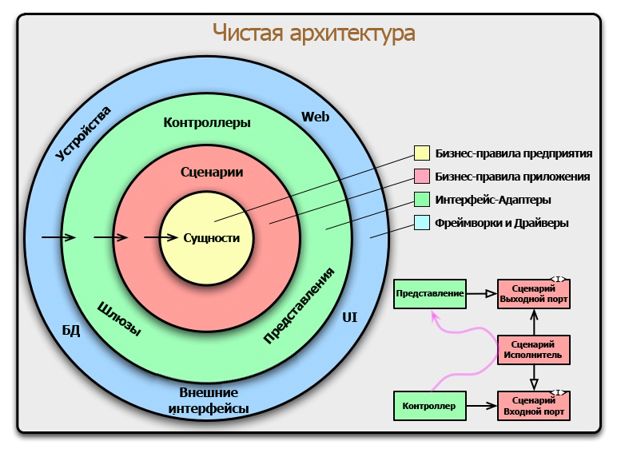

# Чистая архитектура в Go

**Задача любой архитектуры** — поддерживать эффективность разработки, от проектирования до развертывания, без необходимости высокоскоростного обмена данными между командами.

Паттерн чистой архитектуры служит не только отличным способом начать проект; он полезен и при рефакторинге плохо спроектированного приложения. У этого подхода есть следующие преимущества:

* стандартная структура помогает легко ориентироваться в проекте;
* ускорение разработки в долгосрочной перспективе;
* подстановка моковых данных становится тривиальной для юнит-тестов;
* простой переход от прототипов к правильным решениям (например, смена хранилища в памяти на базу данных SQL).

Документ разбит на две части: первые четыре раздела дают теорию чистой архитектуры (слои, правило зависимостей), а разделы 5–6 показывают, как эти принципы воплощаются в конкретной структуре Go-проекта.

***

## 1. Чистая архитектура: базовые понятия

Большая часть этого подхода состоит в абстрагировании деталей реализации — стандарте технологии, особенно в ПО. Другое его название — **принцип разделения ответственности** (Separation of Concerns). Эта концепция существует на нескольких уровнях: структуры, пространства имён, модули, пакеты и даже (микро)сервисы. Всё предназначено для того, чтобы удерживать связанные вещи в границах:

* Если нужно оптимизировать SQL-запрос, нежелательно рисковать изменением формата отображения.
* Если нужно изменить формат ответа HTTP, нежелательно менять схему базы данных.

Описанный здесь подход к чистой архитектуре заключается в сочетании двух идей: разделении портов и адаптеров и ограничении того, как структуры кода ссылаются друг на друга.


### Разделение портов и адаптеров

**Порты и адаптеры** могут называться по-разному: интерфейсы и инфраструктура. Идея в том, чтобы явно отделить эти две категории от остального кода приложения.

Берём код из этих групп и размещаем его в разных пакетах — назовём их **слоями**. Обычно используются четыре слоя: домен, приложение (use cases), адаптеры и инфраструктура.

**Адаптер** — это то, как приложение общается с внешним миром: запросы SQL, клиенты HTTP или gRPC, программы чтения и записи файлов, публикаторы сообщений Pub/Sub. Необходимо адаптировать внутренние структуры под ожидания внешнего API.

**Порт** — это вход в приложение и единственный способ, с помощью которого внешний мир может получить к нему доступ: сервер HTTP или gRPC, команда CLI или подписчик сообщений Pub/Sub.

**Логика приложения** (use cases) представляет собой тонкий слой, который «склеивает» остальные слои. Если вы читаете код и не можете сказать, какую базу данных он использует или какой URL вызывает, — это хороший знак. Думайте об этом слое как об оркестраторе.

Если вы также применяете DDD (предметно-ориентированное проектирование), вы можете ввести уровень **предметной области** (domain), который содержит только бизнес-логику.

> **Зачем это Go-разработчику.** Разделение на порты и адаптеры — это прямой путь к коду, который легко тестировать и заменять реализации. В Go это разделение естественно ложится на систему пакетов: порты живут в `internal/domain` и `internal/usecase`, адаптеры — в `internal/adapter`.

***

## 2. Слои чистой архитектуры

В основе чистой архитектуры лежит представление о системе как о множестве концентрических слоёв, каждый из которых имеет свою чётко определённую зону ответственности и степень близости к бизнес-логике. В самом центре находятся наиболее абстрактные и стабильные элементы, а по мере движения наружу уровень конкретики и зависимости от внешних инструментов возрастает.



Текстовое представление тех же слоёв — от центра к периферии:

```
┌──────────────────────────────────────────┐
│  Infrastructure (фреймворки, драйверы)    │
│  ┌────────────────────────────────────┐  │
│  │  Adapters (контроллеры, репозитории)│  │
│  │  ┌──────────────────────────────┐  │  │
│  │  │  Use Cases (сценарии)        │  │  │
│  │  │  ┌────────────────────────┐  │  │  │
│  │  │  │  Domain (сущности)     │  │  │  │
│  │  │  └────────────────────────┘  │  │  │
│  │  └──────────────────────────────┘  │  │
│  └────────────────────────────────────┘  │
└──────────────────────────────────────────┘
```


### Слой домена (сущностей)

Самый центр, сердце любого приложения — **слой сущностей** (domain). Здесь живут структуры, представляющие ключевые понятия предметной области: пользователь, заказ, товар, счёт, бронирование. Эти сущности содержат наиболее общие и высокоуровневые бизнес-правила, которые остаются неизменными независимо от того, как именно вы решите автоматизировать тот или иной процесс. Например, правило о том, что заказ не может быть подтверждён без указания адреса доставки или что остаток на счёте не может стать отрицательным, принадлежит именно этому слою.

Критически важная характеристика доменного слоя — его абсолютная независимость от всего остального мира. Код здесь не должен ничего знать о базах данных, веб-фреймворках, очередях сообщений или любых других внешних инструментах. Он не импортирует ничего, кроме стандартной библиотеки языка. В идеальном случае этот слой можно вырезать из проекта и вставить в совершенно другое приложение с той же предметной областью, и он продолжит работать без изменений.


### Слой приложения (сценариев использования)

Следующий слой, окружающий домен, — **слой приложения** (use cases). Если домен отвечает на вопрос «какими вообще бывают объекты в нашей системе и какие правила действуют внутри них», то слой приложения описывает конкретные операции: «Создать заказ», «Оплатить счёт», «Зарегистрировать пользователя», «Добавить товар в корзину».

Каждый сценарий использования — это тонкий слой оркестровки: он получает команду извне, извлекает из хранилища нужные сущности, вызывает на них методы, реализующие бизнес-логику, и сохраняет результат. Сам сценарий не содержит сложной бизнес-логики — он лишь координирует работу сущностей и направляет поток данных.

Слой приложения зависит от домена (оперирует доменными сущностями), но по-прежнему ничего не знает о внешнем мире. Он **определяет интерфейсы** для того, что ему нужно извне — например, интерфейс репозитория для сохранения сущностей или интерфейс внешнего сервиса для отправки уведомлений. Конкретные реализации этих интерфейсов будут предоставлены извне, а сценарий работает только с абстракциями, что делает его идеально изолированным и тестируемым.


### Слой адаптеров

За слоем приложения располагается **слой адаптеров интерфейсов** (контроллеры и репозитории). Задача этого слоя — выступать в роли переводчика между внешним миром и внутренними сценариями использования.

Когда приходит HTTP-запрос от клиента, адаптер на входе (контроллер/хендлер) принимает этот запрос, парсит данные из JSON или формы, преобразует их в формат, понятный сценарию использования, и вызывает соответствующий метод сценария. После получения результата адаптер преобразует его обратно в формат, ожидаемый клиентом, и отправляет HTTP-ответ.

На выходе, когда сценарию нужно сохранить данные, в дело вступают адаптеры репозиториев. Они принимают доменные сущности от сценария и преобразуют их в запросы к конкретной базе данных (SQL, MongoDB и т.д.). Эти адаптеры реализуют интерфейсы, определённые в слое приложения или домена. Именно здесь появляется конкретика: SQL-запросы, обращения к API внешних сервисов, чтение и запись файлов. Этот слой уже знает о конкретных инструментах и технологиях, но не содержит бизнес-логики.


### Слой фреймворков и драйверов

Самый внешний слой — **слой фреймворков и драйверов** — содержит конкретные реализации инфраструктурных деталей: веб-серверы, драйверы баз данных, клиенты внешних API, брокеры сообщений и всё остальное, что приходит извне в виде сторонних библиотек. Код в этом слое часто представляет собой просто вызовы функций этих библиотек и минимальную логику для их интеграции с адаптерами.

Именно здесь принимается решение использовать Gin или Echo, PostgreSQL или MySQL, RabbitMQ или Kafka. Благодаря тому, что все зависимости направлены внутрь, эти решения можно менять, переписывая только самый внешний слой, не затрагивая бизнес-логику в центре.

> **Зачем это Go-разработчику.** Понимание слоёв даёт карту проекта. Когда вы открываете незнакомый Go-репозиторий и видите `internal/domain/user.go`, `internal/usecase/create_order.go`, `internal/adapter/handler/order_handler.go` — вы мгновенно понимаете, где что искать, даже не читая код.

***

## 3. Правило зависимостей

**Правило зависимостей** — фундамент, на котором держится вся чистая архитектура. Роберт Мартин формулирует его предельно чётко: **зависимости в исходном коде могут быть направлены только вовнутрь, от внешних слоёв к внутренним**. Ни один элемент внутри круга не должен ничего знать об элементах, находящихся снаружи. Внутренние слои не импортируют внешние пакеты, не используют внешние типы данных и не упоминают внешние сервисы.


### Почему это правило важно

Именно правило зависимостей создаёт независимость от деталей реализации — главную ценность чистой архитектуры. Когда бизнес-логика ничего не знает о базе данных, фреймворке или пользовательском интерфейсе, эти внешние компоненты становятся взаимозаменяемыми. Вы можете заменить PostgreSQL на MongoDB, переписать веб-слой с Gin на Echo или добавить консольный интерфейс рядом с HTTP — и все эти изменения не потребуют переписывания кода во внутренних слоях. Более того, такая изоляция делает бизнес-логику идеально тестируемой: её можно проверять без поднятия инфраструктуры, просто подставляя заглушки на место внешних зависимостей.


### Инверсия зависимостей

Возникает очевидное противоречие: как сценарий использования, находящийся во внутреннем слое, может вызвать метод репозитория, если реализация репозитория живёт во внешнем слое, а внутренний слой не имеет права знать о внешнем? Это противоречие разрешается через **принцип инверсии зависимостей** (Dependency Inversion Principle, один из пяти принципов SOLID): модули верхних уровней не должны зависеть от модулей нижних уровней — оба типа должны зависеть от абстракций.

На практике: сценарий использования определяет интерфейс, описывающий то, что ему нужно от внешнего мира (например, метод `FindByID`). Этот интерфейс живёт внутри слоя сценариев, во внутреннем круге. Внешний слой предоставляет конкретную реализацию этого интерфейса, которая ходит в настоящую базу данных. Реализация, находящаяся снаружи, зависит от интерфейса, определённого внутри — стрелка зависимости направлена вовнутрь. Сценарий же вызывает метод интерфейса, ничего не зная о конкретной реализации.

В Go этот принцип реализуется особенно естественно благодаря **неявному удовлетворению интерфейсов**: структура во внешнем пакете может реализовать интерфейс, определённый во внутреннем пакете, без явного указания `implements` и без импорта внутреннего пакета в месте определения структуры. Достаточно, чтобы методы совпадали по сигнатуре.


### Пересечение границ: DTO

Когда данные пересекают границы между слоями, они должны передаваться в простых, изолированных структурах — **объектах передачи данных (DTO, Data Transfer Objects)**. Нельзя передавать через границу внутренние сущности, если это приведёт к зависимости внешнего слоя от внутреннего. Также нельзя передавать структуры данных, специфичные для внешних фреймворков (например, объекты ORM), во внутренние слои — это нарушило бы правило зависимостей. Данные всегда должны быть представлены в форме, удобной для внутреннего круга.

В Go-проекте, построенном по чистой архитектуре, DTO возникают на каждой границе между слоями. У каждого типа DTO — своё место в структуре проекта и своя зона ответственности:

| DTO-тип               | Где живёт             | Откуда → Куда              | Пример имени              |
| --------------------- | --------------------- | -------------------------- | ------------------------- |
| **Request**           | `adapter/handler/`    | Внешний мир → handler      | `CreateOrderRequest`      |
| **Response**          | `adapter/handler/`    | Handler → внешний мир      | `OrderResponse`           |
| **Input**             | `usecase/`            | Handler → usecase          | `CreateOrderInput`        |
| **Output**            | `usecase/`            | Usecase → handler          | `CreateOrderOutput`       |
| **Доменная сущность** | `domain/`             | Между usecase и repository | `Order`                   |
| **DB-модель**         | `adapter/repository/` | Repository → БД            | `orderRow` / `orderModel` |

Цепочка преобразований при обработке HTTP-запроса выглядит так:

```
HTTP JSON → CreateOrderRequest → CreateOrderInput → domain.Order → orderRow → SQL
                (handler)           (handler)        (usecase)     (repository)
```

А в обратную сторону, при формировании ответа:

```
SQL → orderRow → domain.Order → CreateOrderOutput → OrderResponse → HTTP JSON
     (repository)  (repository)     (usecase)         (handler)       (handler)
```

Каждое преобразование — это явная функция в соответствующем пакете. Ни одна структура не пересекает границу слоя «как есть».

```go
// internal/adapter/handler/order_handler.go
// Request — то, что пришло от клиента
type CreateOrderRequest struct {
    UserID string `json:"user_id"`
    Amount int64  `json:"amount"`
}

// Response — то, что уйдёт клиенту
type OrderResponse struct {
    ID        string `json:"id"`
    UserID    string `json:"user_id"`
    Amount    int64  `json:"amount"`
    Status    string `json:"status"`
    CreatedAt string `json:"created_at"`
}

func (h *OrderHandler) Create(c *gin.Context) {
    var req CreateOrderRequest
    c.ShouldBindJSON(&req)

    // Преобразование Request → Input (граница handler → usecase)
    input := usecase.CreateOrderInput{
        UserID: req.UserID,
        Amount: req.Amount,
    }
    order, err := h.uc.Execute(c.Request.Context(), input)

    // Преобразование Output → Response (граница usecase → handler)
    c.JSON(201, OrderResponse{
        ID:        order.ID,
        UserID:    order.UserID,
        Amount:    order.Amount,
        Status:    string(order.Status),
        CreatedAt: order.CreatedAt.Format(time.RFC3339),
    })
}
```

```go
// internal/usecase/create_order.go
// Input — то, что usecase принимает от handler (или от CLI, gRPC, etc.)
type CreateOrderInput struct {
    UserID string
    Amount int64
}

// Output — то, что usecase возвращает handler
type CreateOrderOutput struct {
    ID        string
    UserID    string
    Amount    int64
    Status    domain.OrderStatus
    CreatedAt time.Time
}

func (uc *CreateOrderUseCase) Execute(ctx context.Context, input CreateOrderInput) (*CreateOrderOutput, error) {
    user, err := uc.userRepo.FindByID(ctx, input.UserID)
    if err != nil {
        return nil, fmt.Errorf("user not found: %w", err)
    }

    order := domain.NewOrder(user.ID, input.Amount)
    if err := uc.orderRepo.Save(ctx, order); err != nil {
        return nil, fmt.Errorf("save order: %w", err)
    }

    return &CreateOrderOutput{
        ID:        order.ID,
        UserID:    order.UserID,
        Amount:    order.Amount,
        Status:    order.Status,
        CreatedAt: order.CreatedAt,
    }, nil
}
```

Ключевое правило: **usecase никогда не принимает&#x20;****`CreateOrderRequest`****&#x20;(JSON-структуру) и никогда не возвращает&#x20;****`OrderResponse`**. И наоборот: handler никогда не работает с `domain.Order` напрямую. Каждый слой оперирует своими DTO, а преобразования локализованы в виде явных вызовов на границах.

> **Зачем это Go-разработчику.** Разделение DTO по слоям — это не бюрократия, а страховка. Когда фронтенд-разработчик просит добавить поле `discount_code` в JSON-ответ, вы меняете только `OrderResponse` в handler и `CreateOrderOutput` в usecase. Доменная сущность `Order` не трогается. Когда меняется схема БД — меняется только `orderRow` в repository. Изменения не расползаются по проекту.


### Гибкость количества слоёв

Количество слоёв не обязательно должно равняться четырём. Это лишь схематичное изображение; на практике вы можете использовать столько слоёв, сколько необходимо для вашего проекта. Главное — неукоснительно соблюдать правило зависимостей: все стрелки в исходном коде смотрят только внутрь. По мере движения к центру уровень абстракции возрастает, а уровень детализации падает. Внешние круги содержат конкретные детали реализации, внутренние — высокоуровневые политики и бизнес-правила.

> **Зачем это Go-разработчику.** Правило зависимостей — это не просто теория. В Go оно укрепляется на уровне компилятора через `internal`-пакеты: код из `internal/domain` физически не может быть импортирован извне модуля. Это превращает архитектурное правило в жёсткое ограничение тулчейна.

***

## 4. Файловое устройство Go-проекта при чистой архитектуре

Теория слоёв и правил зависимостей обретает смысл, когда мы видим, как она отображается в конкретные файлы и папки. Ниже — каноническая структура Go-проекта, следующего принципам чистой архитектуры.

### Стандартные соглашения Go

Прежде чем раскладывать слои по папкам, напомним три ключевых соглашения экосистемы Go:

| Директория  | Назначение                                                                                                                                                                        |
| ----------- | --------------------------------------------------------------------------------------------------------------------------------------------------------------------------------- |
| `cmd/`      | Точки входа. Каждая подпапка — отдельный исполняемый файл (с `package main`). Здесь живёт `main.go` — место композиции всех зависимостей.                                         |
| `internal/` | Код, который не может быть импортирован извне модуля. Компилятор Go запрещает импорт `internal/...` из других модулей. Это естественный механизм укрепления правила зависимостей. |
| `pkg/`      | Код, доступный для импорта извне модуля. Сюда выносятся переиспользуемые утилиты, не содержащие бизнес-логики (логгеры, хелперы, общие типы).                                     |

Ключевой момент: **вся бизнес-логика живёт в&#x20;****`internal/`**. Это гарантирует, что никто снаружи не «привяжется» к внутренним деталям реализации.


### Полное дерево каталогов

```
project/
├── cmd/
│   └── app/
│       └── main.go                  — точка входа, композиция зависимостей
├── internal/
│   ├── domain/                      — слой домена (сущности + интерфейсы)
│   │   ├── user.go                  — сущность User
│   │   ├── order.go                 — сущность Order
│   │   └── repository.go            — интерфейсы репозиториев (порты)
│   ├── usecase/                     — слой сценариев использования
│   │   ├── create_order.go          — сценарий CreateOrder + Input/Output DTO
│   │   ├── create_order_test.go     — юнит-тест сценария
│   │   ├── get_user.go              — сценарий GetUser + Input/Output DTO
│   │   └── get_user_test.go
│   ├── adapter/                     — слой адаптеров
│   │   ├── handler/                 — входящие адаптеры (HTTP, gRPC)
│   │   │   ├── order_handler.go     — HTTP-обработчик заказов + Request/Response DTO
│   │   │   └── user_handler.go      — HTTP-обработчик пользователей + Request/Response DTO
│   │   └── repository/              — исходящие адаптеры (БД, внешние API)
│   │       ├── postgres_order.go    — реализация репозитория заказов на PostgreSQL
│   │       ├── postgres_user.go     — реализация репозитория пользователей на PostgreSQL
│   │       └── models.go            — DB-модели (ORM/sqlx-структуры, только здесь!)
│   └── infrastructure/              — слой фреймворков и драйверов
│       └── database/
│           └── postgres.go          — подключение к БД, миграции
├── pkg/
│   └── logger/
│       └── logger.go                — переиспользуемый логгер
├── go.mod
└── go.sum
```


### Пояснение к каждому элементу

**`cmd/app/main.go`** — единственное место, где происходит «сборка» приложения. Здесь:

* создаётся подключение к базе данных;
* создаются экземпляры репозиториев (реализующие доменные интерфейсы);
* создаются сценарии использования (получают репозитории через конструктор);
* создаются HTTP-обработчики (получают сценарии через конструктор);
* запускается HTTP-сервер.

Это и есть **Composition Root** — точка, где внешние детали собираются в работающее приложение, а внутренние слои остаются чистыми.

**`internal/domain/`** — здесь живут:

* структуры-сущности (чистый Go, без ORM-тегов);
* интерфейсы репозиториев (`UserRepository`, `OrderRepository`);
* бизнес-правила как методы сущностей (например, `func (o *Order) CanBeCancelled() bool`).

Никаких импортов внешних пакетов — только стандартная библиотека.

**`internal/usecase/`** — каждый файл содержит один сценарий использования. Структура сценария принимает зависимости через конструктор:

```go
type CreateOrderUseCase struct {
    orderRepo OrderRepository
    userRepo  UserRepository
}

func NewCreateOrderUseCase(or OrderRepository, ur UserRepository) *CreateOrderUseCase {
    return &CreateOrderUseCase{orderRepo: or, userRepo: ur}
}

func (uc *CreateOrderUseCase) Execute(ctx context.Context, input CreateOrderInput) (*Order, error) {
    // оркестровка: проверка пользователя → создание заказа → сохранение
}
```

**`internal/adapter/handler/`** — HTTP-обработчики. Принимают сценарии через конструктор, парсят JSON, вызывают `Execute`, формируют HTTP-ответ. Не содержат бизнес-логики.

**`internal/adapter/repository/`** — реализации репозиториев. Здесь и только здесь находятся DB-модели с тегами (gorm, db, sqlx), а также функции преобразования между доменными сущностями и моделями БД.

Репозиторий — это абстракция над хранилищем данных, посредник между бизнес-логикой и базой данных. Репозиторий владеет DB-моделями и содержит функции преобразования (ToDomain, fromDomain). Интерфейс репозитория лежит в слое usecase, реализация — в adapter/repository. Утечка ORM за пределы репозитория является архитектурной ошибкой.

Подробнее о роли ORM в чистой архитектуре — в разделе 6.

**`internal/infrastructure/database/`** — низкоуровневые детали: функция `NewPostgresConnection`, миграции, настройка пула соединений.


### DTO в структуре проекта

DTO не выносятся в отдельный пакет — они живут рядом с тем кодом, который их потребляет. Это осознанное решение: DTO — деталь контракта конкретного слоя, а не переиспользуемый компонент.

| DTO-тип                                 | Файл                               | Причина размещения                                                                                                                |
| --------------------------------------- | ---------------------------------- | --------------------------------------------------------------------------------------------------------------------------------- |
| `CreateOrderRequest`, `OrderResponse`   | `adapter/handler/order_handler.go` | Это контракт HTTP-слоя. Если появится gRPC-обработчик, у него будут свои Request/Response.                                        |
| `CreateOrderInput`, `CreateOrderOutput` | `usecase/create_order.go`          | Это контракт сценария использования. Input/Output не зависят от протокола (HTTP, gRPC, CLI).                                      |
| `domain.Order`                          | `domain/order.go`                  | Доменная сущность — единственная структура, которая путешествует между usecase и repository, но и то «под прикрытием» интерфейса. |
| `orderRow` / `orderModel`               | `adapter/repository/models.go`     | DB-модель — деталь конкретной БД и конкретного драйвера. Никогда не покидает пакет repository.                                    |

Почему DTO не в отдельном пакете `dto/`:

* **Локальность изменений.** Когда меняется HTTP-контракт, вы правите один файл — `order_handler.go`. Input/Output usecase при этом не трогаются.
* **Явные границы.** Если DTO лежат в общем пакете, возникает соблазн использовать `CreateOrderRequest` в usecase «потому что поля те же». Размещение DTO рядом с потребляющим кодом делает пересечение границы физически видимым: чтобы использовать DTO из другого слоя, нужен явный import.
* **Избегание транзитивных зависимостей.** Общий пакет `dto/` быстро превращается в свалку, где смешиваются HTTP-теги (`json:"..."`), DB-теги и бизнес-правила — ровно то, от чего чистая архитектура призвана защитить.


#### Три подхода к размещению DTO

На практике в Go-проектах встречаются три варианта:

| Подход                                | Пример                                               | Плюс                                                                | Минус                                                                         |
| ------------------------------------- | ---------------------------------------------------- | ------------------------------------------------------------------- | ----------------------------------------------------------------------------- |
| DTO в том же файле, что и потребитель | `CreateOrderInput` прямо в `usecase/create_order.go` | Максимальная локальность: изменение контракта — правка одного файла | При 5+ DTO на сценарий файл раздувается до 200+ строк                         |
| DTO в отдельном файле того же пакета  | `usecase/create_order.go` + `usecase/dto.go`         | Локальность на уровне пакета, файлы не раздуваются                  | Соблазн переиспользовать DTO между сценариями внутри пакета                   |
| Общий пакет `dto/`                    | `internal/dto/`                                      | Удобно искать все структуры в одном месте                           | Размывает границы слоёв, смешивает теги, провоцирует транзитивные зависимости |

**Золотая середина** для большинства проектов — вариант 2: DTO выносятся в отдельный файл внутри того же пакета (`usecase/dto.go`, `adapter/handler/dto.go`). Ты не нарушаешь правило зависимостей — import не пересекает границу слоя. При этом файл сценария не замусорен десятком структур, а DTO одного слоя не просачиваются в другой.


#### Когда общий `dto/` может быть оправдан

Отдельный пакет `dto/` имеет смысл ровно в двух случаях, и оба — за пределами строгой чистой архитектуры:

* **Микросервис из 3–5 endpoints**, где архитектурная дисциплина чистой архитектуры — оверкилл, а главная цель — просто аккуратный код без дублирования структур.
* **Одна и та же структура реально используется и HTTP-, и gRPC-обработчиком.** Например, `UserResponse` одинакова для REST и gRPC. Тогда её можно вынести в `internal/adapter/dto/` (внутри адаптера, не в корне). Но на практике JSON- и protobuf-структуры почти всегда различаются хотя бы тегами, так что этот случай редок.

В любом случае: если вы заводите общий `dto/`, он должен жить **внутри** слоя адаптеров (`internal/adapter/dto/`), а не на верхнем уровне `internal/`. Это сохраняет хотя бы минимальную изоляцию: домен и usecase по-прежнему не видят эти структуры.


### Поток данных по слоям

Рассмотрим, как HTTP-запрос на создание заказа проходит через все слои:

```
HTTP-запрос POST /orders
        │
        ▼
[handler/order_handler.go]
  ├─ парсит JSON → CreateOrderRequest
  ├─ преобразует CreateOrderRequest → CreateOrderInput (DTO для usecase)
  └─ вызывает usecase.Execute(ctx, input)
        │
        ▼
[usecase/create_order.go]
  ├─ userRepo.FindByID(ctx, input.UserID)   → вызывает интерфейс
  ├─ проверяет, что пользователь существует
  ├─ создаёт domain.Order (чистая сущность)
  ├─ order.CanBeCreated()                    → бизнес-правило
  └─ orderRepo.Save(ctx, order)              → вызывает интерфейс
        │
        ▼
[adapter/repository/postgres_order.go]
  ├─ преобразует domain.Order → ORM-структуру
  ├─ db.Create(&ormModel)                    → конкретный SQL
  └─ возвращает domain.Order обратно
        │
        ▼ (обратно по цепочке)
[handler] формирует JSON-ответ 201 Created
```

Ключевое наблюдение: **usecase не знает**, что handler получил JSON, и не знает, что repository пишет в PostgreSQL. Он работает только с абстракциями.

> **Зачем это Go-разработчику.** Имея такую структуру, вы можете: (1) заменить PostgreSQL на SQLite, переписав только `adapter/repository/`; (2) добавить gRPC-интерфейс рядом с HTTP, создав новый handler без изменения usecase; (3) протестировать сценарий создания заказа моком репозитория, не поднимая базу данных.

***

## 5. Чистая архитектура в Go: ключевые механизмы

Разобрав структуру каталогов, углубимся в три механизма Go, которые делают реализацию чистой архитектуры особенно естественной.


### Неявное удовлетворение интерфейсов

В отличие от Java или C#, где класс должен явно декларировать `implements`, в Go интерфейс удовлетворяется неявно: если структура имеет все методы, описанные в интерфейсе, она автоматически его реализует. Это критически важно для правила зависимостей.

Интерфейс объявляется там, где он **используется** (в `domain/` или `usecase/`), а реализуется во внешнем слое (`adapter/`):

```go
// internal/domain/repository.go — ВНУТРЕННИЙ слой
package domain

type OrderRepository interface {
    Save(ctx context.Context, order *Order) error
    FindByID(ctx context.Context, id string) (*Order, error)
}
```

```go
// internal/adapter/repository/postgres_order.go — ВНЕШНИЙ слой
package repository

import "project/internal/domain" // зависит внутрь ✓

type PostgresOrderRepo struct {
    db *gorm.DB
}

// Неявно реализует domain.OrderRepository — без всякого "implements"
func (r *PostgresOrderRepo) Save(ctx context.Context, order *domain.Order) error { ... }
func (r *PostgresOrderRepo) FindByID(ctx context.Context, id string) (*domain.Order, error) { ... }
```

Структура `PostgresOrderRepo` импортирует `domain` (стрелка вовнутрь), но `domain` ничего не знает о `PostgresOrderRepo` — правило зависимостей соблюдено автоматически.


### Внедрение зависимостей (Dependency Injection)

В Go принято ручное внедрение зависимостей через конструкторы — без фреймворков, без магии. Это самый идиоматичный подход:

```go
// cmd/app/main.go
func main() {
    db := infrastructure.NewPostgresConnection(cfg.DatabaseURL)

    // Слой адаптеров
    orderRepo := repository.NewPostgresOrderRepo(db)
    userRepo := repository.NewPostgresUserRepo(db)

    // Слой сценариев
    createOrderUC := usecase.NewCreateOrderUseCase(orderRepo, userRepo)
    getUserUC := usecase.NewGetUserUseCase(userRepo)

    // Слой обработчиков
    orderHandler := handler.NewOrderHandler(createOrderUC)
    userHandler := handler.NewUserHandler(getUserUC)

    // Запуск сервера
    router := gin.Default()
    router.POST("/orders", orderHandler.Create)
    router.GET("/users/:id", userHandler.GetByID)
    router.Run(":8080")
}
```

Для крупных проектов с десятками зависимостей существуют инструменты кодогенерации:

* **wire** (Google) — compile-time DI через кодогенерацию, без рефлексии;
* **fx** (Uber) — runtime DI с рефлексией, удобен для больших сервисов.

Однако для большинства проектов ручного DI в `main.go` достаточно. Главное преимущество — вся композиция видна в одном месте, и стрелки зависимостей очевидны при чтении.


### Стратегия тестирования

Чистая архитектура естественно диктует пирамиду тестов:

| Слой                  | Тип тестов     | Что проверяется                | Инструменты                  |
| --------------------- | -------------- | ------------------------------ | ---------------------------- |
| `domain/`             | Юнит-тесты     | Бизнес-правила сущностей       | `testing` (stdlib)           |
| `usecase/`            | Юнит-тесты     | Оркестровка сценариев с моками | `gomock`, `testify/mock`     |
| `adapter/handler/`    | Интеграционные | HTTP-контракт: запрос/ответ    | `httptest` (stdlib)          |
| `adapter/repository/` | Интеграционные | SQL-запросы к реальной БД      | `testcontainers-go` + Docker |

Пример теста сценария с моком репозитория:

```go
// internal/usecase/create_order_test.go
func TestCreateOrder_Success(t *testing.T) {
    mockRepo := new(MockOrderRepository)
    mockRepo.On("Save", mock.Anything, mock.AnythingOfType("*domain.Order")).Return(nil)

    mockUserRepo := new(MockUserRepository)
    mockUserRepo.On("FindByID", mock.Anything, "user-1").Return(&domain.User{ID: "user-1"}, nil)

    uc := NewCreateOrderUseCase(mockRepo, mockUserRepo)
    order, err := uc.Execute(context.Background(), CreateOrderInput{
        UserID: "user-1",
        Amount: 100,
    })

    assert.NoError(t, err)
    assert.NotNil(t, order)
    mockRepo.AssertExpectations(t)
}
```

Ни база данных, ни HTTP-сервер для этого теста не нужны — только моки интерфейсов.

> **Зачем это Go-разработчику.** Главное преимущество чистой архитектуры в Go — тесты сценариев использования выполняются за миллисекунды, потому что не требуют инфраструктуры. Вы можете получить полное покрытие бизнес-логики тестами, которые проходят мгновенно.

***

## 6. Структуры ORM в чистой архитектуре

**ORM (Object-Relational Mapping)** — технология, создающая мост между объектно-ориентированным кодом и реляционной базой данных. Вместо написания SQL-запросов разработчик работает с экземплярами Go-структур, а ORM-библиотека генерирует SQL.

В Go популярной ORM-библиотекой является **GORM**. Каждое поле ORM-структуры соответствует колонке в таблице; сопоставление задаётся тегами:

```go
type orderModel struct {
    ID        string    `gorm:"primaryKey;column:id"`
    UserID    string    `gorm:"column:user_id;index"`
    Amount    int64     `gorm:"column:amount"`
    Status    string    `gorm:"column:status"`
    CreatedAt time.Time `gorm:"column:created_at"`
    UpdatedAt time.Time `gorm:"column:updated_at"`
}

func (orderModel) TableName() string { return "orders" }
```


### Главное правило: ORM-структуры ≠ доменные сущности

Это самая распространённая ошибка в Go-проектах: использование одной и той же структуры и как доменной сущности, и как ORM-модели. В чистой архитектуре это **строго разные структуры**, живущие в разных пакетах:

```go
// internal/domain/order.go — чистая сущность, без ORM-тегов
package domain

type Order struct {
    ID        string
    UserID    string
    Amount    int64
    Status    OrderStatus
    CreatedAt time.Time
}
```

```go
// internal/adapter/repository/orm_models.go — ORM-модель с тегами GORM
package repository

type orderModel struct {
    ID        string `gorm:"primaryKey;column:id"`
    UserID    string `gorm:"column:user_id;index"`
    Amount    int64  `gorm:"column:amount"`
    Status    string `gorm:"column:status"`
    CreatedAt time.Time `gorm:"column:created_at"`
    UpdatedAt time.Time `gorm:"column:updated_at"`
}

// Функции преобразования — ответственность адаптера
func (m *orderModel) toDomain() *domain.Order {
    return &domain.Order{
        ID:        m.ID,
        UserID:    m.UserID,
        Amount:    m.Amount,
        Status:    domain.OrderStatus(m.Status),
        CreatedAt: m.CreatedAt,
    }
}

func fromDomain(o *domain.Order) *orderModel {
    return &orderModel{
        ID:        o.ID,
        UserID:    o.UserID,
        Amount:    o.Amount,
        Status:    string(o.Status),
        CreatedAt: o.CreatedAt,
    }
}
```

Репозиторий работает так: принимает доменную сущность → преобразует в ORM-модель → сохраняет через GORM → преобразует результат обратно в доменную сущность → возвращает сценарию.


### Почему это разделение критично

* **Доменный слой остаётся чистым** — никаких ORM-тегов, никаких зависимостей от GORM.
* **Смена ORM или отказ от неё** — меняется только `adapter/repository/`, домен и сценарии не трогаются.
* **Разные схемы для разных нужд** — доменная сущность может иметь вычисляемые поля и бизнес-методы, которые не имеют смысла в БД.
* **Миграции БД не ломают бизнес-логику** — добавили колонку в таблицу, обновили ORM-модель и маппинг, домен не изменился.

Конечно, для простых CRUD-приложений такое разделение может показаться избыточным. Но как только бизнес-логика усложняется (появляются статусные машины, инварианты, вычисляемые поля), цена смешивания домена и ORM становится неприемлемо высокой.

> **Зачем это Go-разработчику.** Код преобразования между доменом и ORM — это boilerplate, но он механический и пишется один раз. В обмен вы получаете сценарии использования, которые можно тестировать без базы данных, и свободу менять ORM без переписывания бизнес-логики.


### Альтернативы ORM: от чистого SQL до sqlx

ORM — не единственный способ работы с базой данных в Go. В сообществе распространены три альтернативных подхода, и каждый из них по-разному вписывается в чистую архитектуру. Выбор между ними — это выбор компромисса между контролем над SQL и количеством boilerplate-кода.

#### Чистый SQL через `database/sql`

Стандартная библиотека Go предоставляет пакет `database/sql` — минималистичный интерфейс для работы с реляционными базами данных. Он не генерирует SQL, не маппит строки на структуры, не управляет миграциями. Всё, что он делает — отправляет SQL-запросы драйверу базы данных и возвращает `sql.Rows`.

```go
// internal/adapter/repository/postgres_order.go
package repository

import (
    "context"
    "database/sql"
    "project/internal/domain"
)

type PostgresOrderRepo struct {
    db *sql.DB
}

func (r *PostgresOrderRepo) Save(ctx context.Context, order *domain.Order) error {
    const query = `
        INSERT INTO orders (id, user_id, amount, status, created_at)
        VALUES ($1, $2, $3, $4, $5)
        ON CONFLICT (id) DO UPDATE
        SET user_id = $2, amount = $3, status = $4
    `
    _, err := r.db.ExecContext(ctx, query,
        order.ID, order.UserID, order.Amount, string(order.Status), order.CreatedAt,
    )
    return err
}

func (r *PostgresOrderRepo) FindByID(ctx context.Context, id string) (*domain.Order, error) {
    const query = `SELECT id, user_id, amount, status, created_at FROM orders WHERE id = $1`

    var o domain.Order
    var status string
    err := r.db.QueryRowContext(ctx, query, id).Scan(
        &o.ID, &o.UserID, &o.Amount, &status, &o.CreatedAt,
    )
    if err != nil {
        return nil, err
    }
    o.Status = domain.OrderStatus(status)
    return &o, nil
}
```

**Плюсы:**

* Полный контроль над SQL — никакой «магии», вы точно знаете, какой запрос уходит в базу.
* Никаких внешних зависимостей, кроме драйвера БД (`pgx`, `lib/pq`, `go-sqlite3`).
* Максимальная производительность — нет прослойки, генерирующей запросы.
* Идеально для сложных запросов с JOIN, оконными функциями, CTE.

**Минусы:**

* `Scan()` вручную — много boilerplate-кода, особенно при JOIN-запросах с десятком колонок.
* Нет защиты от опечаток в именах колонок (ошибки проявляются только в рантайме).
* Нет встроенных миграций, пула соединений, транзакционного менеджера (хотя `database/sql` даёт пул, а транзакции — через `db.Begin()`).

`database/sql` хорошо вписывается в чистую архитектуру: репозиторий содержит SQL-запросы и вручную маппит `sql.Rows` на доменные сущности. Никакие ORM-теги не проникают в домен.

#### Query Builder: Squirrel

**Query Builder** — промежуточный слой между чистым SQL и ORM. Он генерирует SQL из цепочки вызовов методов, но не управляет маппингом строк на структуры. Самая популярная библиотека этого класса в Go — **Squirrel**.

```go
import (
    sq "github.com/Masterminds/squirrel"
    "database/sql"
)

type PostgresOrderRepo struct {
    db *sql.DB
    psql sq.StatementBuilderType
}

func NewPostgresOrderRepo(db *sql.DB) *PostgresOrderRepo {
    return &PostgresOrderRepo{
        db:   db,
        psql: sq.StatementBuilder.PlaceholderFormat(sq.Dollar),
    }
}

func (r *PostgresOrderRepo) FindByUserID(ctx context.Context, userID string) ([]*domain.Order, error) {
    query, args, err := r.psql.
        Select("id", "user_id", "amount", "status", "created_at").
        From("orders").
        Where(sq.Eq{"user_id": userID}).
        OrderBy("created_at DESC").
        ToSql()
    if err != nil {
        return nil, err
    }

    rows, err := r.db.QueryContext(ctx, query, args...)
    // ... обычный rows.Scan(), как с чистым SQL
}
```

**Плюсы:**

* Программное построение запросов — динамический `WHERE` по нескольким фильтрам пишется без склеивания строк.
* Типобезопасность: условия вроде `sq.Eq{"user_id": userID}` исключают опечатки в операторах.
* Генерируемый SQL предсказуем и читаем — в отличие от ORM, где сложный запрос может породить неожиданный SQL.
* Squirrel не управляет маппингом строк — вы сохраняете полный контроль, но избавляетесь от ручной сборки SQL-строк.

**Минусы:**

* `Scan()` по-прежнему вручную — Squirrel не решает проблему маппинга колонок на поля структур.
* Дополнительная зависимость.
* Сложные запросы со специфичным для конкретной БД синтаксисом (например, `ON CONFLICT` в PostgreSQL) могут требовать «сырых» вставок через `sq.Expr()`.

#### sqlx: тонкая надстройка над `database/sql`

**sqlx** — это библиотека, которая оборачивает `database/sql`, сохраняя его API, но добавляя автоматический маппинг строк на структуры через теги `db:"column_name"`. Она не генерирует SQL — вы по-прежнему пишете запросы руками.

```go
import (
    "github.com/jmoiron/sqlx"
)

type PostgresOrderRepo struct {
    db *sqlx.DB
}

// SQL-модель — только на уровне адаптера, с тегами db
type orderRow struct {
    ID        string    `db:"id"`
    UserID    string    `db:"user_id"`
    Amount    int64     `db:"amount"`
    Status    string    `db:"status"`
    CreatedAt time.Time `db:"created_at"`
}

func (r *PostgresOrderRepo) FindByID(ctx context.Context, id string) (*domain.Order, error) {
    const query = `SELECT id, user_id, amount, status, created_at FROM orders WHERE id = $1`

    var row orderRow
    if err := r.db.GetContext(ctx, &row, query, id); err != nil {
        return nil, err
    }
    return &domain.Order{
        ID:        row.ID,
        UserID:    row.UserID,
        Amount:    row.Amount,
        Status:    domain.OrderStatus(row.Status),
        CreatedAt: row.CreatedAt,
    }, nil
}

func (r *PostgresOrderRepo) FindByUserID(ctx context.Context, userID string) ([]*domain.Order, error) {
    const query = `SELECT id, user_id, amount, status, created_at FROM orders WHERE user_id = $1`

    var rows []orderRow
    if err := r.db.SelectContext(ctx, &rows, query, userID); err != nil {
        return nil, err
    }
    orders := make([]*domain.Order, len(rows))
    for i, row := range rows {
        orders[i] = &domain.Order{
            ID:        row.ID,
            UserID:    row.UserID,
            Amount:    row.Amount,
            Status:    domain.OrderStatus(row.Status),
            CreatedAt: row.CreatedAt,
        }
    }
    return orders, nil
}
```

**Плюсы:**

* `StructScan` избавляет от ручного `rows.Scan()` — имена колонок сопоставляются по тегам `db`, а не позиционно.
* API совместим с `database/sql` — можно смешивать `sqlx` и обычные вызовы.
* Вы всё ещё пишете SQL руками — никакой «магии» генерации запросов.
* Отлично сочетается с Squirrel: Squirrel генерирует SQL, sqlx выполняет и сканирует.

**Минусы:**

* Теги `db` на структурах — но они остаются внутри адаптера, в `orderRow`, не проникая в домен.
* Не типобезопасно: опечатка в имени колонки в SQL-запросе проявится только в рантайме.
* Дополнительная зависимость (хотя и лёгкая).

#### Сравнительная таблица подходов

| Подход          | Генерация SQL    | Маппинг строк        | Зависимости               | Контроль над SQL | Boilerplate |
| --------------- | ---------------- | -------------------- | ------------------------- | ---------------- | ----------- |
| `database/sql`  | Нет (ручной)     | Нет (`Scan` вручную) | Только драйвер БД         | Полный           | Высокий     |
| Squirrel        | Да (программный) | Нет                  | Squirrel + драйвер        | Высокий          | Средний     |
| sqlx            | Нет (ручной)     | Да (`StructScan`)    | sqlx + драйвер            | Полный           | Низкий      |
| Squirrel + sqlx | Да (программный) | Да (`StructScan`)    | Squirrel + sqlx + драйвер | Высокий          | Минимальный |
| GORM (ORM)      | Да (авто)        | Да (авто)            | GORM + драйвер            | Низкий           | Минимальный |

#### Рекомендация по выбору для чистой архитектуры

* **sqlx** — лучший компромисс для большинства проектов. Сохраняет полный контроль над SQL, давая `StructScan` для избавления от boilerplate. Прекрасно уживается с чистой архитектурой: SQL-модели (`orderRow`) с тегами `db` живут строго в адаптере и никогда не просачиваются в домен.
* **Squirrel + sqlx** — выбор для проектов с большим количеством динамических запросов (фильтры, сортировки, пагинация). Squirrel собирает SQL, sqlx выполняет и сканирует.
* **Чистый&#x20;****`database/sql`** — когда вы хотите минимум зависимостей и готовы мириться с ручным `Scan()`. Хорош для микросервисов с 3–5 простыми запросами.
* **GORM** — оправдан, когда проект на 90% состоит из CRUD-операций и бизнес-логика минимальна. Но архитектурная дисциплина (разделение доменных и ORM-структур) необходима в любом случае.

> **Зачем это Go-разработчику.** Связка `sqlx` + доменные структуры — золотая середина экосистемы Go. Вы получаете полный контроль над SQL (а значит, над индексами и планами запросов), избавляетесь от boilerplate `Scan()` и сохраняете домен чистым. В отличие от ORM, миграция с sqlx на другой подход (и обратно) — это замена нескольких строк в адаптере, а не переписывание всего кода.

* https://habr.com/ru/articles/269589/
* https://habr.com/ru/articles/269893/
* https://habr.com/ru/articles/270351/
* https://habr.com/ru/articles/271157/
* https://pcnews.ru/blogs/%5Bperevod%5D\_ot\_wtf\_koda\_k\_cistoj\_arhitekture-1200728.html#gsc.tab=0
