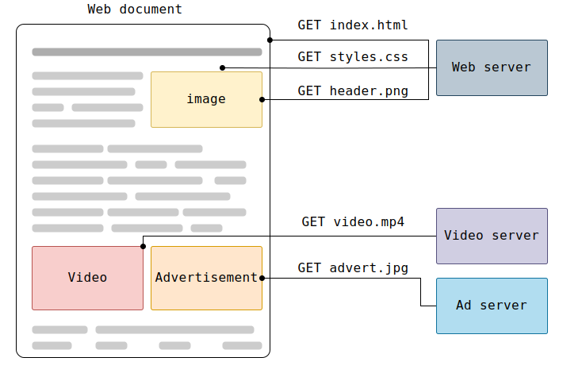
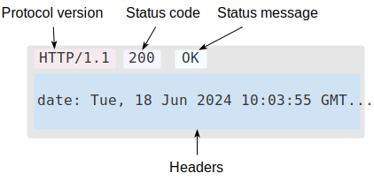

# HTTP: протокол и реализация в Go

## 1. Введение

HTTP (Hypertext Transfer Protocol) — прикладной протокол клиент-серверного взаимодействия. Клиент открывает соединение, отправляет запрос и получает ответ. Протокол не хранит состояние между запросами и работает поверх TCP/IP (или любого надёжного транспорта). Создан в начале 1990-х для передачи гипертекста, сегодня используется для всего: API, стриминг, загрузка файлов, real-time коммуникации.

В этом документе разобраны:

* эволюция протокола от HTTP/0.9 до HTTP/3
* семантика: ресурсы, методы, статус-коды, заголовки
* устройство HTTP/1.1 и HTTP/2 на уровне протокола
* безопасность: TLS, CORS, CSP, cookie-атрибуты
* архитектура `net/http`: `Server`, `Client`, `Transport`, `ServeMux`, `Handler`
* HTTP-сервер изнутри: от `Accept` до вызова handler'а
* конкурентность в сервере, middleware, тестирование, graceful shutdown

***

### Клиент, сервер и прокси

HTTP — клиент-серверный протокол. Клиент (браузер, `curl`, приложение) инициирует запрос, сервер обрабатывает и возвращает ответ. Сообщениями, а не потоком данных.



Между клиентом и сервером — прокси: кеширующие, балансирующие, фильтрующие. Прокси могут быть прозрачными (пробрасывают запрос) или активными (модифицируют).


> **Зачем это Go-разработчику.** `net/http` реализует все три роли: `Client` — клиент, `Server` — сервер, `ReverseProxy` из `net/http/httputil` — прокси. `Transport` умеет работать через HTTP-прокси (`Proxy`, `ProxyConnectHeader`).

***

### Ключевые свойства HTTP

**Простота.** Сообщения читаемы человеком — даже в HTTP/2 семантика осталась прежней.

**Расширяемость.** HTTP-заголовки позволяют добавлять функциональность без изменения протокола. CORS, кеширование, сжатие — всё через заголовки.

**Без состояния.** Сервер не хранит контекст между запросами. Сессии строятся поверх через куки (`http.Cookie`, `http.CookieJar` в Go).

**Эволюция соединений.** HTTP/1.0 — новое TCP-соединение на каждый запрос. HTTP/1.1 — keep-alive. HTTP/2 — мультиплексирование в одном соединении. HTTP/3 — QUIC поверх UDP.

> **Зачем это Go-разработчику.** Эволюция отражена в `Transport`: `DisableKeepAlives`, `MaxIdleConns`, `Protocols` — прямые аналоги ключевых изменений протокола.

***

### HTTP-сообщения

Два типа сообщений: **запрос** (request) и **ответ** (response).


Запрос: метод, путь, версия протокола, заголовки, тело (опционально).



Ответ: версия, код состояния, статусное сообщение, заголовки, тело.

> **Зачем это Go-разработчику.** Запрос — `*http.Request`, ответ — `http.ResponseWriter` (сервер) или `*http.Response` (клиент). Заголовки — `http.Header`. Коды — константы `http.StatusOK`, `http.StatusNotFound`.

***

## 2. Эволюция протокола

HTTP (HyperText Transfer Protocol) — это базовый протокол Всемирной паутины. Разработанный Тимом Бернерсом-Ли и его командой в период с 1989 по 1991 год, HTTP претерпел множество изменений, которые помогли сохранить его простоту, одновременно повысив его гибкость.

### Изобретение Всемирной паутины

В 1989 году, работая в ЦЕРНе, Тим Бернерс-Ли написал предложение о создании гипертекстовой системы через интернет. Построенная на основе TCP и IP, она состояла из четырёх компонентов:

- **HTML** — текстовый формат для гипертекстовых документов
- **HTTP** — протокол для обмена этими документами
- **WorldWideWeb** — первый веб-браузер (он же редактор)
- **httpd** — первый веб-сервер

К концу 1990 года все четыре компонента были завершены. 6 августа 1991 года Бернерс-Ли опубликовал сообщение в новостной группе alt.hypertext — эта дата считается официальным началом Всемирной паутины как публичного проекта.

Протокол HTTP на ранних этапах был очень простым. Позже он получил название HTTP/0.9 — «однострочный протокол».

***

### HTTP/0.9 — протокол в одну строку

Запрос состоял из единственного метода `GET` и пути к ресурсу:

```
GET /my-page.html
```

Ответ — только тело, без заголовков и кодов состояния:

```
<html>
  A text-only web page
</html>
```

Ни заголовков, ни статус-кодов, ни `Content-Type`. Передавались только HTML-файлы. При ошибке сервер генерировал HTML с описанием проблемы.

***

### HTTP/1.0 — расширение возможностей

Браузеры и серверы быстро добавили новые возможности:

- Версия протокола в строке запроса (`HTTP/1.0`)
- Коды состояния в ответе — браузер мог понять, успех или неудача
- HTTP-заголовки — метаданные в запросах и ответах
- `Content-Type` — возможность передавать не только HTML

Типичный обмен в HTTP/1.0:

```
GET /my-page.html HTTP/1.0
User-Agent: NCSA_Mosaic/2.0 (Windows 3.1)

HTTP/1.0 200 OK
Content-Type: text/html

<HTML>
A page with an image
  
</HTML>
```

Каждый ресурс (HTML, изображение, стили) требовал **отдельного TCP-соединения**. Для страницы с 10 картинками — 11 соединений. Проблемы совместимости между реализациями привели к публикации RFC 1945 в ноябре 1996 года, описавшего общепринятые практики.

***

### HTTP/1.1 — стандартизированный протокол

Первая стандартизированная версия опубликована в начале 1997 года (RFC 2068). Ключевые улучшения:

- **Keep-alive** — одно TCP-соединение для нескольких запросов
- **Пайплайнинг** — отправка второго запроса до получения ответа на первый
- **Чанкированная передача** — ответ по частям без заранее известного размера
- **Согласование контента** — клиент и сервер договариваются о формате, языке, кодировке
- **Заголовок `Host`** — несколько доменов на одном IP (виртуальный хостинг)

Типичный keep-alive обмен:

```
GET / HTTP/1.1
Host: example.com

HTTP/1.1 200 OK
Content-Length: 1234

<html>...</html>

GET /style.css HTTP/1.1     ← то же TCP-соединение
Host: example.com

HTTP/1.1 200 OK
Content-Length: 5678

body { ... }
```

HTTP/1.1 был пересмотрен в RFC 7230–7235 (2014), а затем в RFC 9110–9112 (2022), где спецификация впервые получила статус Internet Standard.

***

### Более десяти лет развития

**Спецификации.** HTTP/1.1 (RFC 2616, 1999) просуществовал почти без изменений 15 лет. В 2022 семантика HTTP выделена в отдельный RFC 9110, общий для всех версий.

**SSL/TLS.** В конце 1994 года Netscape добавил шифрованный слой SSL поверх TCP. Позже он стал TLS. По мере коммерциализации веба шифрование стало обязательным.

**REST и WebDAV.** В 1996 HTTP расширили для удалённого редактирования (WebDAV), но требовалась поддержка сервером. В 2000 появился REST — тот же HTTP/1.1, просто доступ к URI. С 2005 добавились Server-Sent Events и WebSocket.

**Безопасность.** Веб-модель безопасности (same-origin) появилась позже HTTP. Ограничения снимались через заголовки: CORS для междоменных запросов, CSP для контроля источников контента.

***

### HTTP/2 — протокол для повышения производительности

Рост сложности веб-страниц потребовал более эффективного протокола. В начале 2010-х Google разработал SPDY, который стал основой HTTP/2. Официально стандартизирован в мае 2015 года (RFC 9113).

Три главных отличия от HTTP/1.1: бинарный формат вместо текстового, мультиплексирование потоков в одном TCP-соединении и сжатие заголовков (HPACK). HTTP/2 не требовал изменений в приложениях — только обновлённый сервер и браузер.

***

### HTTP/3 — HTTP поверх QUIC

Следующая версия HTTP использует QUIC вместо TCP на транспортном уровне. QUIC работает поверх UDP, решает проблему TCP head-of-line blocking на уровне потоков и всегда зашифрован через TLS 1.3. Стандартизирован в RFC 9114.

> **Зачем это Go-разработчику.** Эволюция HTTP отражена в `net/http` напрямую:
> 
> * `http.Server` по умолчанию включает HTTP/2 при TLS. `Protocols` управляет HTTP/1, HTTP/2 и h2c.
> * `Transport` кэширует TCP-соединения (`MaxIdleConns`) — это и есть keep-alive из HTTP/1.1.
> * HTTP/2-фичи: `Pusher` для server push, `HTTP2Config` для настройки фреймов и потоков.
> * HTTP/3 пока не в stdlib, но доступен через `golang.org/x/net/quic`.

***

## 3. Семантика HTTP

Семантика HTTP — это набор правил, определяющих смысл каждого элемента протокола: что означают методы, коды состояния и заголовки. В 2022 году семантика выделена в отдельный RFC 9110, общий для HTTP/1.1, HTTP/2 и HTTP/3. Это значит: независимо от версии протокола, `GET /users` означает одно и то же.

***

### Ресурсы и URI

Центральное понятие HTTP — **ресурс**. Ресурсом может быть HTML-страница, изображение, результат поиска, запись в базе данных — всё, что можно идентифицировать. Каждый ресурс идентифицируется **URI** (Uniform Resource Identifier).

**URL** (Uniform Resource Locator) — подмножество URI, которое не только идентифицирует, но и указывает *местоположение* ресурса:

```
https://api.example.com:443/users/42?lang=en#profile
\____/  \____________/ \_/ \_______/ \_____/ \_____/
схема     хост         порт  путь     запрос   фрагмент
```

- **Схема** — `http` или `https`
- **Хост** — домен или IP
- **Порт** — по умолчанию 80 для HTTP, 443 для HTTPS
- **Путь** — иерархический идентификатор ресурса на сервере
- **Запрос (query)** — `?key=value&key2=value2`, опциональные параметры
- **Фрагмент** — `#section`, не отправляется на сервер, используется браузером для прокрутки

В Go URL представлен типом `*url.URL` из пакета `net/url`. Парсинг: `url.Parse(rawURL)`. В HTTP-обработчике URL доступен через `r.URL`.

> **Зачем это Go-разработчику.** `r.URL.Path` — путь без query-параметров, `r.URL.Query()` — разобранные параметры запроса. Никогда не склеивайте URL руками через `+` — используйте `url.JoinPath` или `url.URL.String()`.

***

### HTTP-методы

Метод — это глагол, определяющий желаемое действие над ресурсом. В Go методы представлены константами `http.MethodGet`, `http.MethodPost` и т.д.

#### Свойства методов

| Свойство | Значение |
|---|---|
| **Безопасный (safe)** | Не изменяет состояние сервера. GET, HEAD, OPTIONS |
| **Идемпотентный (idempotent)** | Повторный запрос даёт тот же результат. GET, PUT, DELETE, HEAD, OPTIONS |
| **Кешируемый (cacheable)** | Ответ можно сохранить и переиспользовать. GET, HEAD |

#### Основные методы

**GET** — получить ресурс. Безопасный, идемпотентный, кешируемый. Не имеет тела запроса. Параметры передаются в URL: `/search?q=golang`.

```go
resp, err := http.Get("https://api.example.com/users/42")
```

**HEAD** — то же, что GET, но без тела ответа. Используется для проверки существования ресурса или получения метаданных (заголовков).

```go
resp, err := http.Head("https://example.com/file.pdf")
// resp.ContentLength, resp.Header доступны, resp.Body пуст
```

**POST** — создать новый ресурс или выполнить действие. Не безопасный, не идемпотентный. Тело запроса содержит данные создаваемого ресурса.

```go
resp, err := http.Post(url, "application/json", body)
```

**PUT** — заменить ресурс целиком (или создать, если не существует). Идемпотентный: два одинаковых PUT дают тот же результат.

```go
req, _ := http.NewRequest(http.MethodPut, url, body)
req.Header.Set("Content-Type", "application/json")
resp, err := client.Do(req)
```

**PATCH** — частичное обновление ресурса. В отличие от PUT, не требует передачи всего объекта. Не идемпотентный.

**DELETE** — удалить ресурс. Идемпотентный: повторное удаление не меняет состояния.

**OPTIONS** — запросить поддерживаемые методы. Ответ содержит заголовок `Allow` со списком методов, доступных для данного URL. Автоматически обрабатывается `ServeMux` (если не задан `DisableGeneralOptionsHandler`).

**CONNECT** — установить туннель (обычно для HTTPS через прокси). Используется `Transport` для проксирования.

**TRACE** — эхо-запрос для диагностики. Возвращает то, что получил сервер, позволяя увидеть изменения, внесённые промежуточными узлами.

> **Зачем это Go-разработчику.** Выбор метода влияет на поведение `Transport`: только GET, HEAD, OPTIONS, TRACE автоматически повторяются при сетевых ошибках. POST/PATCH требуют явного `GetBody` для повторной отправки. Идемпотентность — ключевое свойство при проектировании API.

***

### Коды состояния

Код состояния — трёхзначное число в ответе сервера, сообщающее результат обработки запроса. В Go все коды — константы вида `http.StatusOK` (200), `http.StatusNotFound` (404) и т.д.

#### 1xx — Informational (информационные)

Промежуточный ответ, не финальный. Сервер продолжает обработку.

| Код | Значение | Когда используется |
|---|---|---|
| `100 Continue` | Продолжай | Клиент может отправлять тело запроса |
| `101 Switching Protocols` | Смена протокола | Апгрейд на WebSocket |
| `103 Early Hints` | Предварительные подсказки | Сервер сообщает заголовки до финального ответа |

#### 2xx — Success (успех)

Запрос успешно обработан.

| Код | Значение | Когда используется |
|---|---|---|
| `200 OK` | Успешно | Стандартный ответ на GET, PUT, PATCH |
| `201 Created` | Создано | Результат успешного POST, заголовок `Location` указывает URL нового ресурса |
| `202 Accepted` | Принято | Запрос принят, но ещё не обработан (асинхронная операция) |
| `204 No Content` | Нет содержимого | Успех без тела ответа (часто после DELETE) |

#### 3xx — Redirection (перенаправление)

Клиенту нужно выполнить дополнительное действие.

| Код | Значение | Особенность |
|---|---|---|
| `301 Moved Permanently` | Перемещено навсегда | Меняет метод на GET |
| `302 Found` | Найдено | Исторически меняет метод на GET |
| `303 See Other` | Смотри другое | Всегда GET |
| `307 Temporary Redirect` | Временно | Сохраняет метод и тело |
| `308 Permanent Redirect` | Навсегда | Сохраняет метод и тело |

> **Зачем это Go-разработчику.** `Client` по умолчанию следует 10 редиректам. 301/302/303 превращают POST в GET, а 307/308 сохраняют метод. `http.Redirect(w, r, url, http.StatusFound)` — стандартный способ редиректа на стороне сервера. `ErrUseLastResponse` запрещает следовать редиректам.

#### 4xx — Client Error (ошибка клиента)

Запрос некорректен.

| Код | Значение | Типичная причина |
|---|---|---|
| `400 Bad Request` | Плохой запрос | Невалидный синтаксис |
| `401 Unauthorized` | Не авторизован | Требуется аутентификация |
| `403 Forbidden` | Запрещено | Доступ запрещён независимо от аутентификации |
| `404 Not Found` | Не найдено | Ресурс не существует |
| `405 Method Not Allowed` | Метод не разрешён | Неправильный HTTP-метод |
| `408 Request Timeout` | Таймаут запроса | Сервер не дождался полного запроса |
| `409 Conflict` | Конфликт | Конфликт состояния (например, при PUT) |
| `429 Too Many Requests` | Слишком много запросов | Rate limiting |

#### 5xx — Server Error (ошибка сервера)

Сервер не смог обработать валидный запрос.

| Код | Значение | Типичная причина |
|---|---|---|
| `500 Internal Server Error` | Внутренняя ошибка | Паника в обработчике, необработанная ошибка |
| `502 Bad Gateway` | Плохой шлюз | Прокси получил некорректный ответ от upstream |
| `503 Service Unavailable` | Сервис недоступен | Сервер перегружен или на обслуживании |
| `504 Gateway Timeout` | Таймаут шлюза | Прокси не дождался ответа от upstream |

```go
// Отправка ошибки в Go
http.Error(w, "Resource not found", http.StatusNotFound)

// Ответ с произвольным кодом
w.WriteHeader(http.StatusCreated)
```

> **Зачем это Go-разработчику.** Не придумывайте свои коды. Весь Интернет понимает 429 как rate limit, а 503 как временную недоступность. `net/http` отправляет `400 Bad Request` при ошибке парсинга запроса и `100 Continue` при `Expect: 100-continue` автоматически. Коды-константы (`http.StatusOK`, а не `200`) делают код читаемым.

***

### HTTP-заголовки

Заголовки — это метаданные запроса или ответа в формате `Имя: Значение`. Регистр имени не важен, но `net/http` каноникализирует имена через `CanonicalHeaderKey`.

В Go заголовки представлены типом `http.Header` — это `map[string][]string`. Один ключ может иметь несколько значений.

```go
// Чтение заголовка запроса
auth := r.Header.Get("Authorization")
// Установка заголовка ответа
w.Header().Set("Content-Type", "application/json")
// Добавление (без перезаписи существующего)
w.Header().Add("Set-Cookie", "session=abc")
```

#### Категории заголовков

**Общие (General)** — применимы к запросам и ответам:
- `Cache-Control` — директивы кеширования
- `Connection` — управление соединением (`keep-alive`, `close`)
- `Date` — дата и время создания сообщения
- `Transfer-Encoding` — способ кодирования тела (`chunked`)

**Запроса (Request)** — только от клиента:
- `Host` — домен сервера (единственный обязательный в HTTP/1.1)
- `User-Agent` — информация о клиенте
- `Accept`, `Accept-Encoding`, `Accept-Language` — согласование контента
- `Authorization` — учётные данные
- `Cookie` — куки, сохранённые для этого домена
- `Content-Type`, `Content-Length` — описание тела запроса
- `If-Modified-Since`, `If-None-Match` — условные запросы

**Ответа (Response)** — только от сервера:
- `Content-Type`, `Content-Length`, `Content-Encoding` — описание тела
- `Set-Cookie` — установка куки у клиента
- `Location` — URL для редиректа (с 3xx или 201)
- `WWW-Authenticate` — схема аутентификации
- `ETag`, `Last-Modified` — версия ресурса для условных запросов
- `Access-Control-Allow-Origin` — CORS

```go
// Установка cookie
http.SetCookie(w, &http.Cookie{
    Name:     "session",
    Value:    "abc123",
    HttpOnly: true,
    Secure:   true,
    SameSite: http.SameSiteLaxMode,
})
```

> **Зачем это Go-разработчику.** `r.Header.Get("X-Forwarded-For")` ненадёжен — любой клиент может его подделать. Используйте `r.RemoteAddr` для IP клиента. `w.Header().Set()` должен вызываться до `w.WriteHeader()` или `w.Write()` — после записи заголовки менять нельзя. Автоматические заголовки (`Date`, `Content-Type` при sniffing) добавляются сервером, но их можно подавить, установив в `nil`.

***

## 4. HTTP/1.1: устройство

HTTP/1.1, стандартизированный в 1997 году (RFC 2068) и пересмотренный в RFC 9112 (2022), остаётся самой распространённой версией протокола. Его ключевые нововведения — постоянные соединения, чанкированная передача и согласование контента — сделали веб быстрее и гибче. `net/http` реализует HTTP/1.1 полностью.

***

### Формат сообщений

Сообщение HTTP/1.1 — это текст в кодировке ASCII, разделённый на стартовую строку, заголовки и тело.

**Запрос:**

```
METHOD /path HTTP/1.1\r\n        ← стартовая строка
Header-Name: value\r\n            ← заголовки (0 или более)
\r\n                              ← пустая строка-разделитель
body                              ← тело (опционально)
```

**Ответ:**

```
HTTP/1.1 200 OK\r\n               ← статусная строка
Header-Name: value\r\n            ← заголовки
\r\n
body
```

Разделитель строк — `\r\n` (CRLF). Пустая строка отделяет заголовки от тела.

```go
// В Go заголовки доступны как map[string][]string
r.Header.Get("Content-Type")
w.Header().Set("X-Custom", "value")
```

### Передача тела: Content-Length и чанки

Сервер должен сообщить клиенту, где заканчивается тело ответа. Есть два способа.

**Content-Length** — сервер заранее знает размер тела и указывает его в байтах:

```
HTTP/1.1 200 OK
Content-Length: 52

{"users": [{"id": 1}, {"id": 2}]}
```

Клиент читает ровно 52 байта и считает ответ завершённым.

**Chunked transfer encoding** — размер тела неизвестен заранее (потоковая передача). Тело разбивается на части (чанки), каждая предваряется своим размером в шестнадцатеричном виде:

```
HTTP/1.1 200 OK
Transfer-Encoding: chunked

1a\r\n                          ← размер чанка (26 байт в hex)
{"users": [{"id": 1}, {"\r\n    ← данные чанка
1a\r\n
id": 2}]}\r\n
0\r\n                           ← нулевой чанк = конец тела
\r\n
```

Каждый чанк: `размер-в-hex CRLF данные CRLF`. Завершающий нулевой чанк сигнализирует конец передачи. После него могут следовать трейлеры — дополнительные заголовки.

В Go чанковая передача включается автоматически, если обработчик не установил `Content-Length` и версия клиента ≥ HTTP/1.1. Сервер сам разбивает ответ на чанки через `chunkWriter`.

```go
// Включить чанки вручную (если нужно)
w.Header().Set("Transfer-Encoding", "chunked")
// Но обычно net/http делает это сам
```

> **Зачем это Go-разработчику.** `Content-Length` предпочтительнее для клиентов: они могут показать прогресс-бар и переиспользовать соединение. Чанки нужны для стриминга — когда ответ генерируется на лету. `net/http` выбирает автоматически: если обработчик вызвал `w.WriteHeader` с известным размером — Content-Length, иначе — chunked. Принудительно отключить чанки можно, установив `Content-Length` явно.

***

### Keep-alive: постоянные соединения

В HTTP/1.0 каждое соединение TCP закрывалось после одного ответа. Для страницы с 10 изображениями требовалось 11 TCP-соединений (HTML + 10 картинок). HTTP/1.1 по умолчанию держит соединение открытым — **keep-alive**.

Как это работает:

```
Клиент                    Сервер
  |                         |
  |--- GET /page.html ----->|
  |<--- 200 OK -------------|  ← то же TCP-соединение
  |--- GET /style.css ----->|
  |<--- 200 OK -------------|  ← то же TCP-соединение
  |--- GET /logo.png ------>|
  |<--- 200 OK -------------|  ← то же TCP-соединение
  |                         |
```

Преимущества постоянных соединений:

- Экономия на TCP-рукопожатии (3 пакета: SYN, SYN-ACK, ACK)
- Избегание медленного старта TCP — «прогретое» соединение быстрее
- Меньше нагрузки на сервер (не нужно создавать/закрывать сокеты)

Закрытие соединения происходит по:

- Заголовку `Connection: close` от клиента или сервера
- Idle-таймауту (сервер закрывает неактивное соединение)
- Исчерпанию лимита запросов на соединение (серверная настройка)

В Go keep-alive включён по умолчанию. Управляется флагами:

```go
server := &http.Server{
    Addr:        ":8080",
    IdleTimeout: 90 * time.Second, // таймаут неактивного соединения
}
// Принудительно отключить keep-alive
server.SetKeepAlivesEnabled(false)
```

Клиент управляет пулом соединений через `Transport`:

```go
client := &http.Client{
    Transport: &http.Transport{
        MaxIdleConns:        100,              // максимум простаивающих соединений всего
        MaxIdleConnsPerHost: 10,               // на один хост
        IdleConnTimeout:     90 * time.Second, // таймаут простаивающего соединения
        DisableKeepAlives:   false,           // false = keep-alive включён (по умолчанию)
    },
}
```

> **Зачем это Go-разработчику.** Всегда переиспользуйте `http.Client` — не создавайте новый на каждый запрос. Один клиент = один пул соединений. `DisableKeepAlives: true` заставляет открывать новое TCP-соединение для каждого запроса — полезно для тестов, убийственно для продакшена. `IdleConnTimeout` должен быть меньше таймаута на балансировщике, иначе клиент получит `ECONNRESET`.

***

### Пайплайнинг (HTTP pipelining)

В HTTP/1.1 клиент может отправить несколько запросов подряд, не дожидаясь ответов. Сервер обязан ответить в том же порядке:

```
Клиент:  GET /a HTTP/1.1
         GET /b HTTP/1.1
         GET /c HTTP/1.1

Сервер:  HTTP/1.1 200 OK (a)
         HTTP/1.1 200 OK (b)
         HTTP/1.1 404 Not Found (c)
```

Теоретически это снижает задержку. На практике пайплайнинг **не прижился**:

- Ответы должны приходить строго по порядку → медленный ответ на `/a` блокирует `/b` и `/c` (head-of-line blocking)
- Многие прокси и серверы некорректно его реализуют
- Браузеры никогда не включали его по умолчанию

Go **не поддерживает** пайплайнинг ни на стороне сервера, ни на стороне клиента. В `server.go` это решение зафиксировано в комментарии:

> «But we're not going to implement HTTP pipelining because it was never deployed in the wild and the answer is HTTP/2.»

HTTP/2 решает проблему head-of-line blocking через мультиплексирование потоков в одном соединении.

***

### Согласование контента

HTTP/1.1 позволяет клиенту и серверу договариваться о формате данных через заголовки:

**Клиент сообщает, что принимает:**

```
Accept: application/json, text/html;q=0.9, */*;q=0.1
Accept-Encoding: gzip, deflate, br
Accept-Language: en-US,en;q=0.5,ru;q=0.3
```

Параметр `q` (quality) — вес предпочтения от 0 до 1. `application/json` — приоритет 1 (по умолчанию), `text/html` — 0.9, всё остальное — 0.1.

**Сервер сообщает, что отдал:**

```
Content-Type: application/json; charset=utf-8
Content-Encoding: gzip
Content-Language: en-US
```

В Go сервер не делает автоматического согласования — решение за обработчиком:

```go
func handler(w http.ResponseWriter, r *http.Request) {
    accept := r.Header.Get("Accept")
    if strings.Contains(accept, "application/json") {
        w.Header().Set("Content-Type", "application/json")
        json.NewEncoder(w).Encode(data)
        return
    }
    http.Error(w, "Not Acceptable", http.StatusNotAcceptable)
}
```

Сжатие ответа тоже вручную или через middleware:

```go
// Клиент: Transport сжимает автоматически (Accept-Encoding: gzip)
// Сервер: нужно явно обернуть ResponseWriter в gzip.Writer
```

> **Зачем это Go-разработчику.** Сервер должен проверять `Accept` и возвращать `406 Not Acceptable`, если не может предоставить ни одного поддерживаемого клиентом формата. `Content-Encoding: gzip` на сервере нужно включать явно — `net/http` не сжимает ответы автоматически. Клиентский `Transport` по умолчанию добавляет `Accept-Encoding: gzip` и прозрачно распаковывает ответ.

***

## 5. HTTP/2: бинарный фрейминг и потоки

HTTP/2 (RFC 9113) вырос из протокола SPDY, разработанного Google. В отличие от текстового HTTP/1.1, это бинарный мультиплексированный протокол. Три главных отличия: бинарный формат, мультиплексирование потоков и сжатие заголовков. `net/http` поддерживает HTTP/2 прозрачно — достаточно включить TLS.

***

### Бинарный формат и фреймы

HTTP/2 работает не с текстовыми строками, а с бинарными **фреймами**. Все фреймы имеют единую 9-байтовую структуру заголовка:

- **Length** (24 бита) — длина полезной нагрузки
- **Type** (8 бит) — тип фрейма
- **Flags** (8 бит) — флаги, специфичные для типа
- **Stream ID** (31 бит) — идентификатор потока

В спецификации определено 10 типов фреймов. Два главных:

| Фрейм | Назначение |
|---|---|
| `HEADERS` | HTTP-заголовки (аналог стартовой строки + заголовков HTTP/1.1) |
| `DATA` | Тело запроса или ответа |
| `SETTINGS` | Параметры соединения (размер окна, лимит потоков) |
| `PRIORITY` | Приоритеты потоков |
| `RST_STREAM` | Принудительное завершение потока |
| `PUSH_PROMISE` | Обещание server push |
| `PING` | Проверка живости соединения |
| `GOAWAY` | Инициирование закрытия соединения |
| `WINDOW_UPDATE` | Управление потоком |
| `CONTINUATION` | Продолжение фрагментированного HEADERS |

Бинарный формат делает разбор однозначным: нет необязательных пробелов, разных способов записать одно и то же, путаницы между заголовками и телом.

***

### Потоки и мультиплексирование

**Поток** — независимая двунаправленная последовательность фреймов в рамках одного TCP-соединения. Каждый фрейм привязан к потоку через Stream ID.

Главное достижение HTTP/2: **мультиплексирование**. Фреймы разных потоков чередуются в одном TCP-соединении:

```
Соединение TCP:
  [HEADERS:1][HEADERS:3][DATA:1][HEADERS:5][DATA:3][DATA:1][DATA:5]...
```

Это решает проблему head-of-line blocking HTTP/1.1: медленный ответ на потоке 1 не блокирует поток 3. Порядок фреймов внутри одного потока сохраняется, но между потоками — нет.

Потоки могут быть открыты клиентом (нечётные ID) или сервером (чётные ID через server push). Обе стороны могут закрыть поток в любой момент через `RST_STREAM` — без разрыва TCP-соединения.

> **Зачем это Go-разработчику.** Мультиплексирование означает, что один `http.Client` с HTTP/2 отправляет множество параллельных запросов через одно TCP-соединение. `Transport` делает это автоматически. Лимит потоков настраивается через `HTTP2Config.MaxConcurrentStreams`.

***

### Приоритеты потоков

Каждый поток имеет **вес** (1–256), определяющий его важность. Клиент строит дерево зависимостей через фреймы `PRIORITY`: дочерние потоки ждут завершения родительских. Браузеры используют это для приоритизации видимых изображений над невидимыми, CSS над изображениями, активной вкладки над фоновой.

Приоритеты — рекомендация, сервер не обязан их соблюдать. На практике многие серверы (включая Go) реализуют упрощённую модель приоритетов или игнорируют их.

***

### Сжатие заголовков: HPACK

HTTP не имеет состояния, поэтому каждый запрос повторяет одни и те же заголовки (`User-Agent`, `Accept`, cookies). Вес заголовков рос и иногда превышал начальное окно TCP, вызывая лишний round-trip.

**HPACK** (Header Compression for HTTP/2) решает это двумя механизмами:

1. **Статическая таблица** — 61 предопределённый заголовок и значение (`:method: GET`, `:status: 200`, `content-type: text/html`). Передаются одним индексом.
2. **Динамическая таблица** — заголовки, встреченные ранее в соединении. Стороны синхронизируют словарь, и повторный заголовок отправляется ссылкой на индекс.

HPACK спроектирован устойчивым к атакам CRIME и BREACH: он сжимает только заголовки, а не весь поток данных, и исключает конфиденциальные значения из сжатия.

> **Зачем это Go-разработчику.** HPACK работает автоматически. Размер таблицы сжатия настраивается через `HTTP2Config.MaxDecoderHeaderTableSize` и `MaxEncoderHeaderTableSize`.

***

### Server push

Сервер может отправить ресурс клиенту *до того, как клиент его запросит*. Идея: клиент запрашивает `index.html`, сервер знает, что понадобится `style.css`, и отправляет его вместе с ответом.

Механизм: сервер отправляет фрейм `PUSH_PROMISE` (содержит заголовки обещаемого запроса), затем фреймы `DATA`. Клиент может отклонить push через `RST_STREAM`.

В Go server push доступен через интерфейс `Pusher`:

```go
func handler(w http.ResponseWriter, r *http.Request) {
    if pusher, ok := w.(http.Pusher); ok {
        pusher.Push("/style.css", &http.PushOptions{
            Header: http.Header{"Accept-Encoding": r.Header["Accept-Encoding"]},
        })
    }
    // основной ответ
}
```

Push работает только по HTTP/2. Большинство браузеров ограничивают его использование, поэтому на практике push применяется редко.

***

### Управление потоком (flow control)

HTTP/2 реализует управление потоком на двух уровнях: соединение и каждый отдельный поток. Принцип: получатель сообщает отправителю размер окна — сколько байт DATA-фреймов он готов принять.

```
Отправитель          Получатель
    |                   |
    |<--- WINDOW_UPDATE (окно: 65535 байт) ---|
    |--- DATA (65535 байт) ------------------->|
    |  (окно исчерпано, отправка блокирована)  |
    |<--- WINDOW_UPDATE (окно: 65535 байт) ---|
    |--- DATA (продолжение) ------------------>|
```

Если окно исчерпано, отправитель ждёт `WINDOW_UPDATE` — блокировки TCP-соединения не происходит, другие потоки продолжают передачу. Это контрастирует с TCP, где один потерянный пакет блокирует все потоки.

> **Зачем это Go-разработчику.** Управление потоком настраивается через `HTTP2Config.MaxReceiveBufferPerConnection` и `MaxReceiveBufferPerStream`. Значения по умолчанию достаточны для большинства случаев. Увеличивайте окно для высокоскоростных каналов с большой задержкой.

***

### HTTP/2 в Go: как включить и настроить

`net/http` включает HTTP/2 автоматически при использовании TLS. Никакого дополнительного кода не требуется.

**Настройка через `Server`:**

```go
server := &http.Server{
    Addr: ":443",
    HTTP2: &http.HTTP2Config{
        MaxConcurrentStreams: 250,              // лимит параллельных потоков
        MaxReceiveBufferPerConnection: 1 << 20, // окно соединения (1 MB)
        MaxReceiveBufferPerStream: 1 << 16,     // окно потока (64 KB)
        SendPingTimeout: 15 * time.Second,      // health-check соединения
    },
}
```

**Управление протоколами:**

```go
// Только HTTP/1
server.Protocols = &http.Protocols{}
server.Protocols.SetHTTP1(true)

// HTTP/1 + HTTP/2
server.Protocols = &http.Protocols{}
server.Protocols.SetHTTP1(true)
server.Protocols.SetHTTP2(true)

// Включая незашифрованный HTTP/2 (h2c)
server.Protocols.SetUnencryptedHTTP2(true)
```

**GODEBUG-флаги для отладки:**

```
GODEBUG=http2client=0   # отключить HTTP/2 на клиенте
GODEBUG=http2server=0   # отключить HTTP/2 на сервере
GODEBUG=http2debug=1    # логирование HTTP/2-фреймов
GODEBUG=http2debug=2    # ... включая дампы фреймов
```

> **Зачем это Go-разработчику.** HTTP/2 в Go работает «из коробки» при TLS — `http.ListenAndServeTLS` автоматически согласует протокол через ALPN. Для кастомных настроек используйте `HTTP2Config` внутри `Server` или `Transport`. h2c (HTTP/2 без TLS) включается флагом `SetUnencryptedHTTP2(true)`. GODEBUG-флаги незаменимы при отладке: `http2debug=2` покажет все фреймы, которыми обмениваются клиент и сервер.

## 6. HTTP/3 и QUIC

HTTP/3 (RFC 9114) — самая молодая версия протокола. Ключевое отличие: вместо TCP используется **QUIC** — транспортный протокол поверх UDP. Семантика HTTP (методы, заголовки, коды) не изменилась.

***

### Почему TCP стал узким местом

HTTP/2 решил head-of-line blocking на уровне HTTP, но не на уровне TCP. TCP гарантирует доставку пакетов строго по порядку: если пакет №5 потерян, пакеты №6 бесконечно ждут его повторной передачи. Все потоки HTTP/2 внутри одного TCP-соединения блокируются одновременно.

При 2% потери пакетов HTTP/2 может работать медленнее HTTP/1.1 — у того 6 параллельных TCP-соединений, и потеря в одном не затрагивает остальные.

QUIC решает это радикально: **независимые потоки**. Потеря пакета в потоке A блокирует только поток A, поток B продолжает передачу.

***

### QUIC: ключевые особенности

**Поверх UDP.** QUIC работает поверх UDP, а не TCP. Это позволяет развернуть его в пользовательском пространстве без изменения ядра ОС — не нужно ждать обновлений сетевого стека.

**Встроенный TLS 1.3.** QUIC всегда зашифрован. Нет версии в открытом виде. TLS 1.3 встроен в протокол: handshake и шифрование — часть QUIC, а не отдельный слой.

**0-RTT handshake.** При повторном соединении клиент может отправить данные немедленно, не дожидаясь handshake. Сервер использует сохранённые параметры из предыдущей сессии. Это устраняет один round-trip.

**Connection migration.** QUIC идентифицирует соединение не по IP-адресу, а по Connection ID. При переключении с Wi-Fi на мобильную сеть соединение не рвётся — пакеты продолжают идти по новому пути.

Сравнение round-trips до первых данных:

| Протокол | Транспорт | Handshake | Round-trips |
|---|---|---|---|
| HTTP/1.1 + TLS | TCP | тройное рукопожатие TCP + TLS | 2–3 |
| HTTP/2 + TLS 1.3 | TCP | рукопожатие TCP + TLS | 2 |
| HTTP/3 | QUIC (UDP) | 0-RTT (повторное соединение) | 0–1 |

***

### HTTP/3 в Go

HTTP/3 **не входит** в стандартную библиотеку на момент Go 1.26. Поддержка QUIC развивается в пакете `golang.org/x/net/quic` — он пока имеет статус экспериментального (pre-release).

Минимальный пример HTTP/3-сервера на Go (с использованием внешних библиотек):

```go
// Пакет golang.org/x/net/quic — экспериментальный, API может меняться
// Для HTTP/3 над QUIC потребуется сторонняя библиотека,
// например quic-go: github.com/quic-go/quic-go
```

До стабилизации QUIC в Go рекомендуется использовать HTTP/2 для внутренних сервисов (он уже в stdlib и работает отлично), а HTTP/3 — на граничных прокси (nginx, Caddy, Cloudflare), которые терминируют HTTP/3 и общаются с бэкендом по HTTP/2 или gRPC.

> **Зачем это Go-разработчику.** HTTP/3 в Go пока на стадии эксперимента — не используйте в продакшене. Следите за `golang.org/x/net/quic`. Типовая архитектура сегодня: HTTP/3 на границе (CDN/балансировщик), HTTP/2 или gRPC между внутренними сервисами. `net/http` полностью покрывает HTTP/2-часть этого сценария.

## 7. Безопасность HTTP

Безопасность в HTTP строится на трёх уровнях: шифрование соединения (TLS), ограничение источников (same-origin, CORS) и декларативные политики (HSTS, CSP, cookie-атрибуты). Go предоставляет инструменты для каждого уровня.

***

### TLS и HTTPS

**TLS** (Transport Layer Security) — протокол, обеспечивающий конфиденциальность и целостность данных через шифрование. HTTPS — это HTTP поверх TLS. Все браузеры переходят на HTTPS по умолчанию.

TLS-рукопожатие: клиент и сервер согласуют версию протокола, выбирают шифр, проверяют сертификаты и генерируют сессионные ключи. После этого весь HTTP-трафик шифруется.

В Go HTTPS включается через `ListenAndServeTLS`:

```go
server := &http.Server{
    Addr: ":443",
    TLSConfig: &tls.Config{
        MinVersion: tls.VersionTLS13, // минимум TLS 1.3
    },
}
log.Fatal(server.ListenAndServeTLS("cert.pem", "key.pem"))
```

Для клиента — `Transport` с TLS-конфигурацией:

```go
client := &http.Client{
    Transport: &http.Transport{
        TLSClientConfig: &tls.Config{
            MinVersion: tls.VersionTLS12,
        },
    },
}
```

> **Зачем это Go-разработчику.** `http.ListenAndServeTLS` — минимальный способ поднять HTTPS. В продакшене сертификаты обычно загружаются не из файлов, а через `tls.Config.GetCertificate`. `MinVersion: tls.VersionTLS13` отсекает устаревшие протоколы.

***

### HSTS: принудительный HTTPS

**HTTP Strict-Transport-Security** — заголовок, который приказывает браузеру всегда использовать HTTPS для этого домена, даже если пользователь ввёл `http://`.

```
Strict-Transport-Security: max-age=31536000; includeSubDomains; preload
```

- `max-age` — срок действия политики в секундах (год = 31536000)
- `includeSubDomains` — распространяется на поддомены
- `preload` — запрос на включение в preload-списки браузеров

В Go это просто заголовок:

```go
w.Header().Set("Strict-Transport-Security", "max-age=31536000; includeSubDomains")
```

> **Зачем это Go-разработчику.** HSTS-заголовок должен быть на каждом HTTPS-ответе. Без него атакующий может выполнить downgrade-атаку, заставив браузер перейти на HTTP. Добавляйте HSTS в middleware, общий для всех обработчиков.

***

### CORS: Cross-Origin Resource Sharing

**Same-origin policy** запрещает скриптам из одного источника обращаться к другому источнику. **CORS** ослабляет это ограничение через заголовки — сервер явно указывает, кому можно.

Источником считается комбинация схемы, хоста и порта. `https://api.example.com:443` и `https://api.example.com:8443` — разные источники.

Ключевые заголовки CORS:

| Заголовок ответа | Значение |
|---|---|
| `Access-Control-Allow-Origin` | Какие источники допущены (`*` или конкретный) |
| `Access-Control-Allow-Methods` | Разрешённые HTTP-методы |
| `Access-Control-Allow-Headers` | Разрешённые заголовки запроса |
| `Access-Control-Allow-Credentials` | Разрешить передачу cookies/Authorization |
| `Access-Control-Max-Age` | Время кеширования preflight-ответа |

Preflight-запрос: для нестандартных методов и заголовков браузер сначала отправляет `OPTIONS`, чтобы проверить разрешения.

В Go CORS реализуется middleware:

```go
func corsMiddleware(next http.Handler) http.Handler {
    return http.HandlerFunc(func(w http.ResponseWriter, r *http.Request) {
        w.Header().Set("Access-Control-Allow-Origin", "https://app.example.com")
        w.Header().Set("Access-Control-Allow-Methods", "GET, POST, PUT, DELETE")
        w.Header().Set("Access-Control-Allow-Headers", "Content-Type, Authorization")
        if r.Method == http.MethodOptions {
            w.WriteHeader(http.StatusNoContent)
            return
        }
        next.ServeHTTP(w, r)
    })
}
```

Начиная с Go 1.25, для защиты от CSRF-атак на стороне сервера доступен `CrossOriginProtection`:

```go
csrf := http.NewCrossOriginProtection()
csrf.AddTrustedOrigin("https://app.example.com")
handler := csrf.Handler(mux)
```

> **Зачем это Go-разработчику.** CORS настраивается middleware. Никогда не используйте `Access-Control-Allow-Origin: *` вместе с `Allow-Credentials: true` — браузеры это запрещают. Для публичных API без кук `*` допустим. Preflight-запросы кешируются через `Access-Control-Max-Age`.

***

### CSP: Content Security Policy

**Content Security Policy** — HTTP-заголовок, ограничивающий источники контента: скриптов, стилей, изображений, шрифтов. Защищает от XSS-атак.

```
Content-Security-Policy: default-src 'self'; script-src 'self' cdn.example.com
```

Директивы CSP:

| Директива | Что контролирует |
|---|---|
| `default-src` | Источник по умолчанию для всех ресурсов |
| `script-src` | Откуда можно загружать JavaScript |
| `style-src` | Откуда можно загружать CSS |
| `img-src` | Откуда можно загружать изображения |
| `connect-src` | Куда можно делать fetch/XHR-запросы |
| `frame-src` | Какие источники можно встраивать в iframe |

```go
w.Header().Set("Content-Security-Policy", "default-src 'self'; script-src 'self' cdn.example.com")
```

> **Зачем это Go-разработчику.** CSP — вторая линия защиты после санитизации ввода. `default-src 'self'` блокирует загрузку любых внешних ресурсов. Для API, которые не отдают HTML, CSP не нужен — он только для страниц, отображаемых в браузере.

***

### Cookie-атрибуты безопасности

Куки передаются с каждым запросом к домену, поэтому их защита критична. Три ключевых атрибута:

| Атрибут | Что делает |
|---|---|
| `Secure` | Кука отправляется только по HTTPS |
| `HttpOnly` | Кука недоступна JavaScript (`document.cookie`) |
| `SameSite` | Ограничивает отправку кук с кросс-сайтовых запросов |

`SameSite` имеет три режима:
- **Strict** — кука не отправляется с любых кросс-сайтовых запросов
- **Lax** (по умолчанию) — отправляется при навигации (переход по ссылке), но не в iframe или fetch
- **None** — отправляется всегда (требует `Secure`)

```go
http.SetCookie(w, &http.Cookie{
    Name:     "session",
    Value:    token,
    Secure:   true,
    HttpOnly: true,
    SameSite: http.SameSiteLaxMode,
})
```

> **Зачем это Go-разработчику.** Все сессионные куки должны иметь `Secure + HttpOnly + SameSite=Lax` как минимум. `SameSite=Strict` надёжнее, но ломает переходы по ссылкам с других сайтов (пользователь придёт без куки). Баланс — `Lax`.

***

## 8. Обзор пакета `net/http`

Пакет `net/http` построен вокруг трёх ключевых абстракций: **обработчик** (`Handler`), **мультиплексор** (`ServeMux`) и **транспорт** (`RoundTripper`/`Transport`). Все остальные типы — `Server`, `Client`, `Request`, `ResponseWriter` — обслуживают эти три.

***

### Карта типов

На стороне сервера цепочка выглядит так:

```
net.Listener           ← принимает TCP-соединения
    ↓
http.Server            ← настраивает таймауты, TLS, HTTP/2
    ↓
http.ServeMux          ← маршрутизирует запрос по паттерну
    ↓
http.Handler           ← ваш обработчик (интерфейс с одним методом)
    ↓
http.ResponseWriter    ← формирует HTTP-ответ
```

На стороне клиента:

```
http.Client            ← управляет куками, редиректами, таймаутами
    ↓
http.Transport         ← пул TCP-соединений, прокси, TLS
    ↓ (реализует http.RoundTripper)
http.Request           ← сериализуется в HTTP-запрос
    ↓
http.Response          ← читается из HTTP-ответа
```

Ключевое: `Server` и `Client` — это **фасады**. Вся магия в `Transport` (клиент) и `conn.serve` (сервер). `ServeMux` — опциональная прослойка; можно передать любой `Handler` напрямую в `Server.Handler`.

Центральные интерфейсы пакета:

```go
// Серверная сторона: любой обработчик HTTP
type Handler interface {
    ServeHTTP(ResponseWriter, *Request)
}

// Клиентская сторона: выполнить один HTTP-обмен
type RoundTripper interface {
    RoundTrip(*Request) (*Response, error)
}
```

`Handler` — это то, что вы пишете. `RoundTripper` — то, что вы обычно не трогаете (работает `DefaultTransport`). Но оба интерфейса — точка расширения: middleware оборачивают `Handler`, кастомные транспорты реализуют `RoundTripper`.

***

### Интерфейс `Handler`

`Handler` — интерфейс с одним методом. Любая функция или тип с методом `ServeHTTP` может быть HTTP-обработчиком.

```go
type Handler interface {
    ServeHTTP(w ResponseWriter, r *Request)
}
```

Минимальный обработчик — функция, преобразованная через `HandlerFunc`:

```go
func hello(w http.ResponseWriter, r *http.Request) {
    fmt.Fprintln(w, "hello")
}

// HandlerFunc(f) — адаптер, превращающий функцию в Handler
http.HandleFunc("/hello", hello)
```

`HandlerFunc` — ключевой адаптер пакета. Это функциональный тип, у которого есть метод, вызывающий сам себя:

```go
type HandlerFunc func(ResponseWriter, *Request)

func (f HandlerFunc) ServeHTTP(w ResponseWriter, r *Request) {
    f(w, r)
}
```

**Зачем это нужно.** Проблема: чтобы реализовать `Handler`, нужно объявить тип с методом `ServeHTTP`. Но писать `handler` — это естественно функция, а не тип. `HandlerFunc` — мост между миром функций и миром интерфейсов: берёт функцию с сигнатурой `func(ResponseWriter, *Request)` и «притворяется» `Handler`.

**Как это работает.** В Go можно объявить метод на любом типе, включая функциональный. `HandlerFunc` — это `type HandlerFunc func(...)`. Его метод `ServeHTTP` вызывает сам себя: `f(w, r)`. Когда вы пишете `http.HandlerFunc(myFunc)`, вы преобразуете функцию в значение типа `HandlerFunc`. Когда сервер вызывает `ServeHTTP` на этом значении, срабатывает метод, который дёргает исходную `myFunc`.

**Где используется.** Три места:

1. `http.HandleFunc("/path", handler)` — внутри вызывает `HandlerFunc(handler)`, регистрируя функцию как обработчик
2. Middleware — чтобы вернуть `http.Handler`, оборачивая замыкание:

```go
func middleware(next http.Handler) http.Handler {
    return http.HandlerFunc(func(w http.ResponseWriter, r *http.Request) {
        // pre
        next.ServeHTTP(w, r)
        // post
    })
}
```

3. Подстановка обработчика на лету без объявления нового типа

***

### Интерфейс `RoundTripper`

`RoundTripper` — клиентский аналог `Handler`. Выполняет один HTTP-обмен: берёт `*Request`, возвращает `*Response`.

```go
type RoundTripper interface {
    RoundTrip(*Request) (*Response, error)
}
```

`DefaultTransport` — глобальная переменная, используемая `DefaultClient`. Настроена на keep-alive, прокси из переменных окружения, TLS.

```go
// DefaultTransport — готовый RoundTripper с пулом соединений
var DefaultTransport RoundTripper = &Transport{
    Proxy: ProxyFromEnvironment,
    MaxIdleConns:          100,
    IdleConnTimeout:       90 * time.Second,
    TLSHandshakeTimeout:   10 * time.Second,
}
```

`Transport` — стандартная реализация. `Client` оборачивает `RoundTripper`, добавляя куки и редиректы. Если вам не нужны куки/редиректы, можно использовать `Transport.RoundTrip` напрямую.

***

### Взаимодействие типов: полный цикл одного запроса

```
Клиент                               Сервер
  |                                    |
  | http.Get(url)                      |
  |   ↓                                |
  | Client.Do(req)                     |
  |   ↓                                |
  | Transport.RoundTrip(req)           |
  |   ↓ (TCP-соединение)              |
  | --- GET /users HTTP/1.1 ---------> |
  |                                    | Server.Serve (Accept в цикле)
  |                                    |   ↓
  |                                    | conn.serve (горутина)
  |                                    |   ↓
  |                                    | readRequest (парсинг)
  |                                    |   ↓
  |                                    | ServeMux.Handler (маршрут?)
  |                                    |   ↓
  |                                    | handler.ServeHTTP(w, r)
  |                                    |   ↓
  | <--- HTTP/1.1 200 OK ------------ | w.Write(body)
  |   ↓                                |
  | Transport: response → пул соед.    | conn: keep-alive или close
```

> **Зачем это Go-разработчику.** Понимание двух интерфейсов — `Handler` и `RoundTripper` — открывает всю архитектуру. Middleware — это `func(http.Handler) http.Handler`. Кастомный HTTP-клиент — своя реализация `RoundTripper`. `httptest` подменяет `RoundTripper` на тестовый. Весь пакет построен на этих двух интерфейсах, остальное — реализации по умолчанию.

***

## 9. HTTP-сервер: от `Accept` до handler'а

Когда вы пишете `http.ListenAndServe(":8080", nil)`, за этой строкой скрывается цепочка: создание TCP-сокета, бесконечный цикл принятия соединений, запуск горутины на каждое соединение, парсинг HTTP-запроса и вызов вашего обработчика. Разберём каждый шаг.

***

### `ListenAndServe` → `Serve`

`ListenAndServe` — это тонкая обёртка над `Server.Serve`. Она создаёт TCP-listener и передаёт его в `Serve`:

```go
func (s *Server) ListenAndServe() error {
    addr := s.Addr
    if addr == "" {
        addr = ":http"  // порт 80 по умолчанию
    }
    ln, err := net.Listen("tcp", addr)
    if err != nil {
        return err
    }
    return s.Serve(ln)
}
```

`net.Listen("tcp", ":8080")` создаёт сокет, привязывает его к порту и начинает слушать. Сам `Serve` уже работает с готовым `net.Listener`.

***

### Цикл `Accept`

Сердце `Serve` — бесконечный цикл `Accept`. Каждый вызов `l.Accept()` блокируется до прихода нового TCP-соединения:

```go
func (s *Server) Serve(l net.Listener) error {
    // ...настройка HTTP/2, базовый контекст...

    for {
        rw, err := l.Accept()          // блокируется, ждёт клиента
        if err != nil {
            if ne, ok := err.(net.Error); ok && ne.Temporary() {
                // временная ошибка — exponential backoff
                time.Sleep(tempDelay)
                continue
            }
            return err                  // фатальная ошибка — выход
        }
        c := s.newConn(rw)             // оборачиваем TCP-соединение
        go c.serve(connCtx)            // горутина на каждое соединение!
    }
}
```

Временные ошибки (перегрузка, нехватка файловых дескрипторов) обрабатываются через exponential backoff: 5ms → 10ms → 20ms → ... → capped at 1s.

> **Зачем это Go-разработчику.** Это объясняет, почему сервер не падает при всплеске соединений — он замедляет `Accept`, но не роняет весь процесс. `Temporary()` — признак ошибки, после которой можно продолжать работу.

***

### `newConn` и `go c.serve()`

Каждое TCP-соединение оборачивается в структуру `conn` — приватный тип из `server.go`, хранящий всё состояние одного клиентского подключения:

```go
type conn struct {
    server   *Server           // ссылка на сервер
    rwc      net.Conn          // сырое TCP-соединение
    bufr     *bufio.Reader     // буферизованное чтение
    bufw     *bufio.Writer     // буферизованная запись
    curState atomic.Uint64     // состояние: new/active/idle/closed
    // ...
}
```

Ключевое — `go c.serve(connCtx)`. С этого момента каждое соединение живёт в **отдельной горутине**. Именно здесь HTTP-сервер Go становится конкурентным: тысячи клиентов обслуживаются тысячами горутин, каждая работает со своим `conn`.

Планировщик Go эффективно мультиплексирует горутины на потоки ОС. Блокировка на чтении из сокета (I/O wait) не блокирует поток — горутина «засыпает», а поток переключается на другую.

> **Зачем это Go-разработчику.** Модель «горутина на соединение» — причина, по которой Go-серверы держат десятки тысяч одновременных соединений без thread-per-connection накладных расходов. Но это же значит, что любые разделяемые данные в обработчиках требуют синхронизации — о чём раздел 13.

***

### `conn.serve()`: жизненный цикл соединения

`serve` — главный метод `conn`. Он делает всё: TLS-рукопожатие, чтение запросов, вызов обработчиков, keep-alive:

```go
func (c *conn) serve(ctx context.Context) {
    c.remoteAddr = c.rwc.RemoteAddr().String()

    // 1. TLS handshake (если соединение TLS)
    if tlsConn, ok := c.rwc.(*tls.Conn); ok {
        tlsConn.HandshakeContext(ctx)
        // если рукопожатие не удалось — закрываем соединение
    }

    // 2. HTTP/1.x — бесконечный цикл keep-alive
    for {
        w, err := c.readRequest(ctx)       // парсим запрос
        if err != nil {
            return                          // ошибка — закрываем соединение
        }

        // 3. Вызываем обработчик (синхронно, одна горутина на соединение)
        serverHandler{c.server}.ServeHTTP(w, w.req)

        // 4. Завершаем ответ и решаем: keep-alive или закрыть
        w.finishRequest()
        if !w.shouldReuseConnection() {
            return
        }

        // 5. Ждём следующий запрос в этом же соединении
        c.rwc.SetReadDeadline(time.Now().Add(idleTimeout))
        if _, err := c.bufr.Peek(4); err != nil {
            return
        }
    }
}
```

Важные детали:
- Обработчик вызывается **синхронно** в той же горутине, что читает запрос. Пока обработчик не вернёт управление, следующий запрос в этом соединении не будет прочитан.
- HTTP/2 работает иначе — там несколько потоков на одно TCP-соединение.
- `Peek(4)` в конце цикла ждёт первых байтов следующего запроса, не потребляя их. Если клиент молчит дольше `IdleTimeout` — соединение закрывается.

> **Зачем это Go-разработчику.** Обработчик выполняется синхронно — если он делает долгую работу, keep-alive-соединение простаивает. Выносите тяжёлые операции в отдельные горутины, если хотите обслуживать несколько запросов по одному TCP-соединению (HTTP/1.1) одновременно. HTTP/2 решает это мультиплексированием.

***

### `readRequest()`: парсинг HTTP-запроса

`readRequest` превращает сырые байты из TCP-соединения в `*http.Request`:

```go
func (c *conn) readRequest(ctx context.Context) (w *response, err error) {
    // 1. Устанавливаем дедлайн на чтение заголовков
    if d := c.server.ReadHeaderTimeout; d > 0 {
        c.rwc.SetReadDeadline(time.Now().Add(d))
    }

    // 2. Лимитируем размер заголовков (по умолчанию 1 MB + 4 KB)
    c.r.setReadLimit(c.server.initialReadLimitSize())

    // 3. Парсим HTTP/1.x запрос через bufio.Reader
    req, err := readRequest(c.bufr)
    if err != nil {
        return nil, err
    }

    // 4. Создаём response — структуру для формирования ответа
    w = &response{
        conn:    c,
        req:     req,
        handlerHeader: make(Header),
    }
    return w, nil
}
```

Парсинг через `readRequest(c.bufr)` (нижний регистр — приватная функция) делает:
- Читает строку запроса (`GET /path HTTP/1.1\r\n`)
- Парсит заголовки в `Header` (map[string][]string)
- Определяет наличие тела: `Content-Length` или `Transfer-Encoding: chunked`
- Создаёт `Request.Body` — `io.ReadCloser`, читающий из того же `conn`

Если клиент прислал `Expect: 100-continue`, сервер **автоматически** отправляет `100 Continue` при первом чтении из `Request.Body`.

> **Зачем это Go-разработчику.** `ReadHeaderTimeout` — ваш главный инструмент против slow-клиентов. Без него злоумышленник может открыть соединение и слать по одному байту в минуту, удерживая горутину и сокет. `ReadTimeout` защищает от медленного чтения тела. Всегда устанавливайте оба.

> **Зачем это Go-разработчику.** Весь путь запроса укладывается в пять шагов: `ListenAndServe` открывает сокет → `Serve` в цикле принимает соединения → `go c.serve()` запускает горутину → `readRequest` парсит запрос → ваш `Handler.ServeHTTP` формирует ответ. Понимание этой цепочки позволяет осмысленно настраивать таймауты, отлаживать утечки горутин и проектировать обработчики под конкурентную модель сервера.

***

## 10. `ServeMux` и маршрутизация

`ServeMux` — HTTP-мультиплексор. Он берёт входящий запрос, смотрит на метод, хост и путь, и выбирает обработчик по зарегистрированному паттерну. С Go 1.22 паттерны получили wildcard-синтаксис, что избавило от необходимости во внешних роутерах для большинства задач.

`DefaultServeMux` — глобальный экземпляр, используемый пакетными функциями `http.Handle` и `http.HandleFunc`. В продакшене лучше создавать свой через `http.NewServeMux()`.

***

### Паттерны (Go 1.22+)

Паттерн — строка вида `[METHOD ][HOST]/[PATH]`. Все три части опциональны:

```go
mux := http.NewServeMux()

// Только путь — любой метод, любой хост
mux.HandleFunc("/users", listUsers)

// Метод + путь
mux.HandleFunc("GET /users/{id}", getUser)

// Хост + путь
mux.HandleFunc("api.example.com/", apiHandler)

// Хост + метод + путь + wildcard
mux.HandleFunc("POST api.example.com/items/{id}/tags/{tag...}", addTag)
```

**Wildcards** — сегменты вида `{name}` и `{name...}`:
- `{name}` — захватывает один сегмент пути (до следующего `/`)
- `{name...}` — захватывает остаток пути, включая `/` (только в конце паттерна)
- `{$}` — специальный wildcard, обозначающий конец пути (запрещает `/users/extra` для паттерна `/users/{$}`)

Значения wildcard'ов доступны через `r.PathValue("name")` в обработчике:

```go
mux.HandleFunc("GET /users/{id}", func(w http.ResponseWriter, r *http.Request) {
    id := r.PathValue("id")   // "42" для /users/42
})
```

Трейлинг-слеш в конце паттерна действует как анонимный `{...}`: `/images/` совпадает с `/images/`, `/images/logo.png`, `/images/icons/small.png`.

```go
// Регистрация через пакетные функции (DefaultServeMux)
http.HandleFunc("GET /hello", func(w http.ResponseWriter, r *http.Request) {
    fmt.Fprintln(w, "hello")
})
```

> **Зачем это Go-разработчику.** До 1.22 без внешнего роутера можно было только `/prefix/` и точные пути. Теперь wildcard-паттерны покрывают 90% случаев REST API. `r.PathValue` — встроенная альтернатива `chi.URLParam` или `gin.Param`.

***

### Приоритеты и конфликты

Когда несколько паттернов подходят под запрос, выбирается **наиболее специфичный** (most specific). Правило: паттерн P1 специфичнее P2, если P1 совпадает с подмножеством запросов, которые совпадают с P2.

```
/images/thumbnails/   специфичнее, чем /images/
GET /                  специфичнее, чем /
example.com/           специфичнее, чем / (при совпадении хоста)
```

Пример без конфликта:

```go
mux.HandleFunc("/images/", handleImages)              // всё в /images/
mux.HandleFunc("/images/thumbnails/", handleThumbs)   // только /images/thumbnails/
// OK: /images/thumbnails/* идёт в handleThumbs, остальное в handleImages
```

Если два паттерна не являются подмножеством друг друга, они **конфликтуют** — `Handle`/`HandleFunc` вызывает panic при регистрации:

```go
mux.HandleFunc("GET /", handleGet)       // паникует!
mux.HandleFunc("/index.html", handleIdx) // конфликт: оба подходят под GET /index.html
```

Исключение для обратной совместимости: если конфликтуют паттерн с хостом и без хоста, паттерн **с хостом** приоритетнее без паники.

> **Зачем это Go-разработчику.** Конфликт паттернов — ошибка, которую `ServeMux` ловит на старте, а не во время выполнения. Это лучше, чем молчаливая отправка запросов не в тот обработчик.

***

### Trailing-slash редиректы

Если зарегистрирован паттерн с трейлинг-слешем или `{...}`, а клиент присылает тот же путь без слеша — `ServeMux` автоматически отвечает `301 Moved Permanently`, добавляя `/`:

```
GET /images  →  301 →  /images/
```

Это поведение отключается явной регистрацией паттерна без слеша:

```go
mux.HandleFunc("/images", handleImagesRoot)  // отдельный обработчик для /images
mux.HandleFunc("/images/", handleImagesSub)  // для /images/ и глубже
```

Аналогично, `ServeMux` редиректит `/path/` → `/path`, если зарегистрирован только `/path` (без трейлинг-слеша) и запрос не совпал.

***

### Санитизация пути

`ServeMux` автоматически чистит URL перед маршрутизацией через `path.Clean`:

- Убирает `.` и `..` сегменты: `/users/../photos/./cat` → `/photos/cat`
- Схлопывает повторные слеши: `//users///42` → `/users/42`

Если путь изменился в результате очистки, сервер отвечает редиректом на очищенный путь. CONNECT-запросы не санитизируются (они передаются как есть).

Экранированные спецсимволы (`%2e` для `.`, `%2f` для `/`) **не считаются** разделителями при санитизации — это защита от обхода путей.

> **Зачем это Go-разработчику.** Санитизация идёт до вашего обработчика. Если вы пишете своё промежуточное ПО для роутинга, помните: `r.URL.Path` может содержать `..` до того, как `ServeMux` его почистит. Используйте `path.Clean` явно.

> **Зачем это Go-разработчику.** `ServeMux` с паттернами Go 1.22+ закрывает потребности большинства REST-приложений без внешних роутеров. Главное ограничение — нет групп маршрутов с общими middleware (как в chi или Gin). Это решается композицией: общий middleware на уровне `Server.Handler`, специфичный — через `http.Handler`-обёртку для группы путей.

***

## 11. `ResponseWriter` и жизненный цикл ответа

`ResponseWriter` — интерфейс, через который обработчик формирует HTTP-ответ. За этим интерфейсом скрыта цепочка из шести слоёв буферизации, Content-Type sniffing, автоматическая чанкированная передача и трейлеры.

***

### Интерфейс `ResponseWriter`

```go
type ResponseWriter interface {
    Header() Header                 // заголовки, которые будут отправлены
    Write([]byte) (int, error)      // данные тела ответа
    WriteHeader(statusCode int)     // отправить статус-код и заголовки
}
```

Три метода — и масса автоматического поведения под капотом. Первый вызов `Write` без предварительного `WriteHeader` автоматически отправляет `200 OK`. После `WriteHeader` заголовки уже нельзя изменить (кроме трейлеров).

> **Зачем это Go-разработчику.** Порядок важен: `Header().Set` → `WriteHeader` → `Write`. Если вызвать `Set` после `WriteHeader`, заголовок молча проигнорируется. `WriteHeader(201)` после `Write` проигнорируется, потому что `Write` уже вызвал неявный `WriteHeader(200)`.

***

### Шесть слоёв буферизации

Путь одного байта от `w.Write(data)` до провода описан в `server.go` как «The Life Of A Write»:

```
Handler вызывает
    ↓
1.  response.Write          ← ResponseWriter (ваш код)
    ↓
2.  bufio.Writer (4 KB)     ← буфер перед чанк-врайтером
    ↓
3.  chunkWriter             ← добавляет чанк-заголовки, финализирует заголовки
    ↓
4.  conn.bufw (4 KB)        ← буфер записи соединения
    ↓
5.  checkConnErrorWriter    ← перехватывает ошибки записи, закрывает ctx при ошибке
    ↓
6.  rwc (net.Conn)          ← сырое TCP-соединение
```

Зачем столько слоёв:
- **Слой 2** — буферизует первые несколько KB, чтобы автоматически определить `Content-Length`, если ответ короткий
- **Слой 3** — если `Content-Length` не задан явно, переключается на chunked encoding, добавляет `Transfer-Encoding: chunked` и разбивает ответ на чанки
- **Слой 5** — отслеживает ошибки записи (клиент отвалился), вызывает `cancelCtx`, чтобы контекст запроса был отменён

```go
func (w *response) Write(data []byte) (n int, err error) {
    if !w.wroteHeader {
        w.WriteHeader(StatusOK)   // неявный 200 при первом Write
    }
    return w.w.Write(data)        // пишем в bufio.Writer
}
```

> **Зачем это Go-разработчику.** Шесть слоёв — это цена за автоматический выбор между `Content-Length` и chunked encoding. Не боритесь с системой: если знаете размер ответа заранее, установите `w.Header().Set("Content-Length", strconv.Itoa(len))` до `Write`, и чанки не включатся.

***

### `WriteHeader`: явный и неявный

`WriteHeader` отправляет статус-код и заголовки. Может вызываться явно или неявно:

```go
// Явно — для ошибок и 201/204
func handler(w http.ResponseWriter, r *http.Request) {
    w.WriteHeader(http.StatusCreated)
    // заголовки уже отправлены
}
```

Первый `Write` без явного `WriteHeader` вызывает `WriteHeader(200)` автоматически.

Информационные ответы (`1xx`) можно отправлять многократно:

```go
w.WriteHeader(http.StatusContinue)        // 100 — промежуточный
w.WriteHeader(http.StatusProcessing)      // 102 — ещё один промежуточный
w.WriteHeader(http.StatusOK)              // 200 — финальный
```

Но финальный (2xx–5xx) — только один. Повторный вызов логируется как предупреждение и игнорируется.

***

### Трейлеры

Трейлеры — заголовки, которые отправляются **после** тела ответа. Используются, когда значение заголовка неизвестно в момент отправки статуса (например, хеш тела при потоковой передаче).

Два способа задать трейлеры:

**1. Предварительное объявление** — через заголовок `Trailer`:

```go
func handler(w http.ResponseWriter, r *http.Request) {
    w.Header().Set("Trailer", "X-Hash")
    w.WriteHeader(http.StatusOK)

    // пишем тело...
    w.Write(data)

    // хеш становится известен — задаём трейлер
    w.Header().Set("X-Hash", fmt.Sprintf("%x", sha256.Sum256(data)))
}
```

**2. TrailerPrefix** — для трейлеров, неизвестных до отправки заголовков:

```go
w.Header().Set("Trailer:X-Hash", "")  // префикс "Trailer:" — ключ будет трейлером
// ...после WriteHeader и Write...
w.Header().Set("Trailer:X-Hash", hashValue)
```

HTTP/2 поддерживает трейлеры полноценно. В HTTP/1.1 они работают только с chunked encoding.

> **Зачем это Go-разработчику.** Трейлеры — редко используемая фича. Основной сценарий: подпись тела ответа или метрики, которые становятся известны после полной отправки. В обычных REST API трейлеры не нужны.

***

### Content-Type sniffing

Если обработчик не установил `Content-Type` явно, сервер **нюхает** первые 512 байт тела через `DetectContentType` и угадывает MIME-тип.

**MIME** (Multipurpose Internet Mail Extensions) — стандарт, изначально созданный для вложений в email, но переиспользованный в HTTP. MIME-тип (он же media type) — строка вида `text/html`, `application/json`, `image/png`, определяющая формат данных. Браузеры и HTTP-клиенты используют его, чтобы понять, как обрабатывать тело ответа: рендерить HTML, парсить JSON или сохранять как файл.

```go
func handler(w http.ResponseWriter, r *http.Request) {
    w.Write([]byte("<html><body>hello</body></html>"))
    // Content-Type → text/html; charset=utf-8 (автоматически)
}
```

Алгоритм — реализация [mimesniff.spec.whatwg.org](https://mimesniff.spec.whatwg.org/). Если тип не удалось определить — `application/octet-stream`.

Sniffing отключается явной установкой `Content-Type` в `nil`:

```go
w.Header()["Content-Type"] = nil  // подавить sniffing
```

> **Зачем это Go-разработчику.** Полагаться на sniffing в API — плохая практика. Всегда устанавливайте `Content-Type` явно: `w.Header().Set("Content-Type", "application/json")`. Sniffing полезен только для `ServeFile`, где тип определяется по расширению файла.

***

### Flusher и Hijacker

Два дополнительных интерфейса, которые `ResponseWriter` может (но не обязан) реализовывать:

**Flusher** — принудительная отправка буферизованных данных клиенту:

```go
func handler(w http.ResponseWriter, r *http.Request) {
    w.Header().Set("Content-Type", "text/event-stream")

    for _, event := range events {
        fmt.Fprintf(w, "data: %s\n\n", event)
        if flusher, ok := w.(http.Flusher); ok {
            flusher.Flush()  // отправить немедленно, не ждать заполнения буфера
        }
    }
}
```

Используется для Server-Sent Events, стриминга, long polling. По умолчанию HTTP/1.x и HTTP/2 поддерживают `Flusher`, но обёртки могут его потерять.

**Hijacker** — перехват TCP-соединения:

```go
func handler(w http.ResponseWriter, r *http.Request) {
    hj, ok := w.(http.Hijacker)
    if !ok {
        http.Error(w, "hijacking not supported", http.StatusInternalServerError)
        return
    }
    conn, bufrw, err := hj.Hijack()
    // conn — сырое TCP-соединение
    // теперь сервер больше не управляет этим соединением
    go handleWebSocket(conn, bufrw)
}
```

После `Hijack()` сервер полностью передаёт соединение. HTTP/2 **не поддерживает** hijacking — только HTTP/1.x.

Современная альтернатива прямому использованию интерфейсов — `ResponseController` (доступен через `http.NewResponseController(w)`), который предоставляет методы `Flush()`, `Hijack()`, `SetReadDeadline`, `SetWriteDeadline`, `EnableFullDuplex` с единообразной обработкой ошибок.

> **Зачем это Go-разработчику.** `Flusher` — основа для SSE и стриминга. `Hijacker` — для WebSocket и других протоколов, работающих поверх TCP. Проверяйте поддержку через type assertion (`w.(http.Flusher)`), потому что middleware-обёртки могут её сломать.

***

## 12. HTTP-клиент и `Transport`

`Client` — высокоуровневый HTTP-клиент: управляет куками, редиректами и таймаутами. `Transport` — низкоуровневый движок: пул TCP-соединений, прокси, TLS. Вместе они проходят путь от `http.Get(url)` до байтов в `Response.Body`.

`DefaultClient` использует `DefaultTransport`. Для продакшена всегда создавайте свой экземпляр с настроенными таймаутами.

***

### `Client` и его поля

```go
type Client struct {
    Transport     RoundTripper  // механизм отправки запросов (по умолчанию DefaultTransport)
    CheckRedirect func(req *Request, via []*Request) error
    Jar           CookieJar     // хранилище кук
    Timeout       time.Duration // общий таймаут на запрос (включая редиректы и чтение тела)
}
```

`Client` — фасад над `RoundTripper`. `Transport` добавляет куки и редиректы, которых нет в `RoundTrip`. Нулевое значение `&http.Client{}` работоспособно — использует `DefaultTransport`.

> **Зачем это Go-разработчику.** `Client` нужно создавать один раз и переиспользовать. Пул соединений живёт в `Transport` внутри `Client`. Если создавать новый `Client` на каждый запрос — теряется keep-alive, каждый раз открывается новое TCP-соединение.

***

### `Client.Do` — жизненный цикл запроса

`Do` выполняет всю механику HTTP-запроса: контекст, редиректы, куки, повтор при сетевых ошибках:

```go
func (c *Client) Do(req *Request) (*Response, error) {
    // 1. Таймаут: если c.Timeout > 0, создаём контекст с deadline
    // 2. Редиректы: до 10 редиректов, изменение метода для 301/302/303
    // 3. Куки: Jar.Cookies(req.URL) → req.Header; SetCookies после ответа
    // 4. Transport.RoundTrip(req) → *Response
    // 5. Ошибка сети — повтор для idempotent методов (GET, HEAD, OPTIONS, TRACE)
    // 6. Закрытие тела при ошибке редиректа
}
```

Ключевые детали:

- **Редиректы.** По умолчанию до 10. 301/302/303 превращают метод в GET, 307/308 сохраняют. `ErrUseLastResponse` останавливает редиректы.
- **Куки.** `Jar` автоматически добавляет куки перед запросом и извлекает из ответа. Nil-`Jar` — куки только из явного `req.AddCookie`.
- **Таймаут.** `Client.Timeout` охватывает весь путь: соединение → редиректы → чтение тела. Если истёк — контекст отменяется, `Transport` прерывает соединение.

```go
client := &http.Client{
    Timeout: 30 * time.Second,
    CheckRedirect: func(req *http.Request, via []*http.Request) error {
        if len(via) >= 5 {
            return fmt.Errorf("too many redirects")
        }
        return nil
    },
}
resp, err := client.Do(req)
```

> **Зачем это Go-разработчику.** `Client.Timeout` — грубый инструмент: один таймаут на ВСЁ. Если у вас разные эндпоинты с разными ожидаемыми задержками, используйте `context.WithTimeout` на уровне запроса: `req.WithContext(ctx)`. `Client.Timeout` и `context` на запросе работают вместе — сработает тот, что истечёт раньше.

***

### `Transport` и пул соединений

`Transport` — реализация `RoundTripper`. Это «двигатель» HTTP-клиента: управляет TCP-соединениями, TLS, прокси, сжатием.

```go
type Transport struct {
    Proxy                  func(*Request) (*url.URL, error) // прокси
    DialContext            func(ctx context.Context, network, addr string) (net.Conn, error)
    TLSClientConfig        *tls.Config

    MaxIdleConns           int           // макс. простаивающих соединений всего (0 = безлимит)
    MaxIdleConnsPerHost    int           // на один хост (по умолчанию 2)
    MaxConnsPerHost        int           // всего соединений на хост (активные + простаивающие)
    IdleConnTimeout        time.Duration // таймаут простаивания (по умолчанию 90s)

    DisableKeepAlives      bool          // true = новое TCP на каждый запрос
    DisableCompression     bool          // true = не добавлять Accept-Encoding: gzip
    ResponseHeaderTimeout  time.Duration // таймаут ожидания заголовков ответа
    ExpectContinueTimeout  time.Duration // таймаут ожидания 100 Continue
    TLSHandshakeTimeout    time.Duration // таймаут TLS-рукопожатия
}
```

**Пул соединений.** `Transport` кэширует TCP-соединения для переиспользования. Когда запрос завершён, соединение не закрывается, а возвращается в пул как «простаивающее» (idle). Следующий запрос к тому же хосту берёт его из пула — без нового TCP-рукопожатия.

```
Запрос → ищем idle-соединение в пуле
           ↓ есть? → используем
           ↓ нет?  → открываем новое (до MaxConnsPerHost)
                     ↓ если лимит исчерпан — блокируемся
           ↓
           RoundTrip завершён → возвращаем соединение в пул
```

`MaxIdleConnsPerHost` по умолчанию равен **2**. Это мало для приложения, активно работающего с одним хостом — увеличивайте.

> **Зачем это Go-разработчику.** `DefaultTransport.MaxIdleConnsPerHost = 2` — частая причина плохой производительности HTTP-клиента. Если ваше приложение ходит к одному внутреннему сервису сотнями запросов в секунду, поднимите до 50–100. `DisableKeepAlives: true` убивает пул — каждое соединение закрывается после запроса.

***

### Таймауты

HTTP-клиент имеет многоуровневую систему таймаутов. Они работают вместе, и срабатывает самый короткий:

| Таймаут | Уровень | Что контролирует |
|---|---|---|
| `Client.Timeout` | Client | Весь запрос: соединение + редиректы + чтение тела |
| `context.WithTimeout` | Request | Контекст конкретного запроса |
| `DialContext` timeout | Transport | Установка TCP-соединения |
| `TLSHandshakeTimeout` | Transport | TLS-рукопожатие (по умолчанию 10s) |
| `ResponseHeaderTimeout` | Transport | Ожидание заголовков ответа после отправки запроса |
| `ExpectContinueTimeout` | Transport | Ожидание `100 Continue` от сервера (по умолчанию 1s) |
| `IdleConnTimeout` | Transport | Сколько держать простаивающее соединение (по умолчанию 90s) |

Типичная настройка для внутренних сервисов:

```go
client := &http.Client{
    Timeout: 30 * time.Second,
    Transport: &http.Transport{
        MaxIdleConnsPerHost:   50,
        IdleConnTimeout:       90 * time.Second,
        TLSHandshakeTimeout:   5 * time.Second,
        ResponseHeaderTimeout: 10 * time.Second,
    },
}
```

Для внешних API таймауты должны быть жёстче:

```go
client := &http.Client{
    Timeout: 10 * time.Second,
    Transport: &http.Transport{
        TLSHandshakeTimeout:   3 * time.Second,
        ResponseHeaderTimeout: 5 * time.Second,
    },
}
```

> **Зачем это Go-разработчику.** По умолчанию `http.Client{}` **не имеет таймаутов вообще** — запрос может висеть вечно. Всегда задавайте хотя бы `Client.Timeout`. `IdleConnTimeout` на клиенте должен быть МЕНЬШЕ idle-таймаута на балансировщике/сервере — иначе клиент попытается использовать соединение, которое сервер уже закрыл, и получит `ECONNRESET`.

> **Зачем это Go-разработчику.** `Client` — фасад, `Transport` — двигатель. Всегда переиспользуйте клиент. Настраивайте `MaxIdleConnsPerHost` под свою нагрузку. Никогда не оставляйте клиент без таймаутов — `http.Client{}` не имеет их по умолчанию. Для разных эндпоинтов с разными требованиями используйте `context.WithTimeout` на уровне запроса, а не разные клиенты.

***

## 13. Конкурентность в сервере

Модель «горутина на соединение» (раздел 9) делает HTTP-сервер Go конкурентным по умолчанию. Но отсюда следует важный вывод: все ваши обработчики выполняются **параллельно** в разных горутинах. Любое разделяемое состояние требует синхронизации.

***

### Модель «горутина на соединение»: следствия

Каждый вызов `Handler.ServeHTTP` происходит в отдельной горутине. Миллион запросов = миллион горутин (не одновременно — планировщик мультиплексирует их на потоки ОС). Плюсы и минусы:

**Плюсы:**
- Простота кода: обработчик выглядит как последовательный код, параллелизм — за сервером
- Эффективность: горутины легковесны (~2 KB стека), не потоки ОС
- Масштабируемость: десятки тысяч одновременных соединений без thread-per-connection

**Минусы:**
- Разделяемые данные требуют синхронизации — гонки молчаливо разрушают состояние
- Если все горутины заблокированы на внешнем вызове без таймаута — сервер встаёт
- Нельзя полагаться на порядок выполнения обработчиков

> **Зачем это Go-разработчику.** Модель «горутина на соединение» уже работает — вам не нужно её реализовывать. Ваша задача — писать потокобезопасные обработчики.

***

### Гонки данных в обработчиках

Типичный сценарий: счётчик посещений, обновляемый из обработчика:

```go
type Server struct {
    hits int  // РАЗДЕЛЯЕМОЕ СОСТОЯНИЕ — ГОНКА!
}

func (s *Server) handler(w http.ResponseWriter, r *http.Request) {
    s.hits++  // data race: две горутины читают-изменяют-записывают
    fmt.Fprintf(w, "hits: %d", s.hits)
}
```

Go runtime обнаруживает гонку на map-операциях и паникует: `fatal error: concurrent map writes`. Но для целых чисел (`int`) гонка **молчалива** — данные повреждаются без падения. Запуск с `-race` обнаружит проблему.

Исправление — `sync.Mutex`:

```go
type Server struct {
    mu   sync.Mutex
    hits int
}

func (s *Server) handler(w http.ResponseWriter, r *http.Request) {
    s.mu.Lock()
    s.hits++
    count := s.hits
    s.mu.Unlock()
    fmt.Fprintf(w, "hits: %d", count)
}
```

Важно: **методы, изменяющие состояние, должны быть на pointer receiver**. Значение-ресивер копирует структуру, и мьютекс копируется вместе с ней — каждая копия имеет свой мьютекс, синхронизации нет.

```go
func (s Server) handler(w http.ResponseWriter, r *http.Request) {  // ОШИБКА!
    s.mu.Lock()  // блокирует копию, не оригинал
}
```

> **Зачем это Go-разработчику.** Всегда запускайте тесты с `-race`. Он находит гонки, даже если они не вызывают панику. Pointer receiver для методов, изменяющих состояние — не рекомендация, а требование корректности.

***

### Мьютексы vs каналы

Два подхода к синхронизации: мьютексы и каналы. Оба решают задачу, но у каждого своя область применения.

**Мьютексы** — защита разделяемой структуры данных:

```go
type CounterStore struct {
    mu    sync.Mutex
    items map[string]int
}

func (c *CounterStore) Inc(key string) {
    c.mu.Lock()
    c.items[key]++
    c.mu.Unlock()
}
```

**Каналы** — передача владения данными одной горутине:

```go
type Command struct {
    key       string
    replyChan chan int
}

func counterManager() chan<- Command {
    cmds := make(chan Command)
    counters := make(map[string]int)

    go func() {
        for cmd := range cmds {
            counters[cmd.key]++
            cmd.replyChan <- counters[cmd.key]
        }
    }()
    return cmds
}
// Одна горутина владеет map, остальные общаются через каналы
```

Когда что использовать:

| Ситуация | Инструмент |
|---|---|
| Защита структуры, к которой обращаются много горутин | `sync.Mutex` |
| Передача данных между горутинами | Канал |
| Координация/сигнализация (ожидание завершения) | Канал или `sync.WaitGroup` |
| Однократная блокировка ресурса | `sync.Mutex` |
| Поток данных от производителя к потребителю | Канал |

Правило из Go Wiki: «Use whichever is most expressive and/or most simple.» Для защиты разделяемой карты мьютекс проще. Для координации нескольких горутин — каналы.

> **Зачем это Go-разработчику.** Не бросайтесь переписывать всё на каналы ради идиоматичности. Мьютекс для защиты состояния обработчика — абсолютно нормальный Go-код. Каналы хороши для потоков данных и явной передачи владения.

***

### Rate limiting

Перегрузка сервера — реальная угроза. Даже если обработчики потокобезопасны, неограниченное количество одновременных запросов может исчерпать память или БД-соединения.

Ограничение количества одновременных обработчиков через буферизованный канал как **семафор**:

```go
func limitConcurrency(handler http.HandlerFunc, max int) http.HandlerFunc {
    sema := make(chan struct{}, max)  // буферизованный канал как семафор

    return func(w http.ResponseWriter, r *http.Request) {
        sema <- struct{}{}            // занять слот (блокируется, если все заняты)
        defer func() { <-sema }()     // освободить слот

        handler(w, r)
    }
}

http.HandleFunc("/expensive", limitConcurrency(expensiveHandler, 10))
```

Как это работает: канал ёмкостью `max` может принять `max` значений. Когда все слоты заняты, `sema <- struct{}{}` блокирует горутину — запрос ждёт освобождения слота. Это глобальный лимит на все запросы к данному обработчику.

Для более точного контроля — `context.Done()`:

```go
func limitConcurrency(handler http.HandlerFunc, max int) http.HandlerFunc {
    sema := make(chan struct{}, max)

    return func(w http.ResponseWriter, r *http.Request) {
        select {
        case sema <- struct{}{}:
            defer func() { <-sema }()
            handler(w, r)
        case <-r.Context().Done():
            // клиент отвалился, не ждём
            return
        }
    }
}
```

> **Зачем это Go-разработчику.** Rate limiting через семафор — самый простой способ защитить сервер от перегрузки. Не требует внешних библиотек. Добавьте его на ресурсоёмкие эндпоинты (генерация отчётов, загрузка файлов). Для per-IP лимитов используйте `golang.org/x/time/rate`.

> **Зачем это Go-разработчику.** Конкурентность в `net/http` — палка о двух концах. Она даёт производительность «из коробки», но требует дисциплины: защищайте разделяемое состояние мьютексами, проверяйте с `-race`, ограничивайте параллелизм через семафоры. Эти три привычки превращают «работает» в «работает надёжно».

***

## 14. Middleware

Middleware — это функция, принимающая `http.Handler` и возвращающая `http.Handler`. Она оборачивает следующий обработчик, добавляя поведение до и после его вызова. Вся мощь и гибкость `net/http` строится на этом одном паттерне.

```go
type Middleware func(http.Handler) http.Handler
```

***

### Паттерн `func(http.Handler) http.Handler`

Минимальный middleware — логирование каждого запроса:

```go
func loggingMiddleware(next http.Handler) http.Handler {
    return http.HandlerFunc(func(w http.ResponseWriter, r *http.Request) {
        start := time.Now()
        next.ServeHTTP(w, r)
        log.Printf("%s %s %v", r.Method, r.URL.Path, time.Since(start))
    })
}
```

Подключение:

```go
mux := http.NewServeMux()
mux.HandleFunc("/hello", helloHandler)

// Оборачиваем весь mux
loggedMux := loggingMiddleware(mux)
http.ListenAndServe(":8080", loggedMux)
```

Что здесь происходит: `loggingMiddleware` возвращает `http.HandlerFunc` — замыкание, которое засекает время, вызывает оригинальный обработчик и логирует. Ни `mux`, ни `helloHandler` не знают о логировании.

> **Зачем это Go-разработчику.** Паттерн middleware из `net/http` не требует фреймворков. Это просто композиция функций. В отличие от Gin/Chi, где middleware регистрируется через `r.Use()`, здесь вы сами управляете порядком оборачивания.

***

### Цепочки middleware

Несколько middleware объединяются последовательным оборачиванием — справа налево:

```go
// Порядок выполнения: logging → auth → handler
handler := loggingMiddleware(authMiddleware(mux))
```

Для удобства — вспомогательная функция:

```go
func chainMiddleware(handler http.Handler, middlewares ...func(http.Handler) http.Handler) http.Handler {
    for i := len(middlewares) - 1; i >= 0; i-- {
        handler = middlewares[i](handler)
    }
    return handler
}

handler := chainMiddleware(mux,
    loggingMiddleware,
    authMiddleware,
    corsMiddleware,
    recoveryMiddleware,
)
```

Порядок важен: `loggingMiddleware` выполняется ПЕРВЫМ (самым внешним), затем `authMiddleware`, и так до самого обработчика. При возврате — наоборот: сначала обработчик, потом auth, потом logging.

Типичный набор middleware для API:

```go
func recoveryMiddleware(next http.Handler) http.Handler {
    return http.HandlerFunc(func(w http.ResponseWriter, r *http.Request) {
        defer func() {
            if err := recover(); err != nil {
                log.Printf("panic: %v", err)
                http.Error(w, "Internal Server Error", http.StatusInternalServerError)
            }
        }()
        next.ServeHTTP(w, r)
    })
}

func authMiddleware(next http.Handler) http.Handler {
    return http.HandlerFunc(func(w http.ResponseWriter, r *http.Request) {
        token := r.Header.Get("Authorization")
        if token == "" {
            http.Error(w, "Unauthorized", http.StatusUnauthorized)
            return
        }
        // ...проверка токена...
        next.ServeHTTP(w, r)
    })
}
```

> **Зачем это Go-разработчику.** В отличие от Gin с `r.Use()`, порядок в цепочке `net/http` определяется порядком аргументов при оборачивании. Это прозрачнее, но требует внимательности. `recoveryMiddleware` — обязательно: без него паника в обработчике уронит всю горутину соединения (сервер перехватит, но залогирует стектрейс и закроет соединение).

***

### `ResponseController`

`ResponseController` — унифицированный доступ к расширенным возможностям `ResponseWriter`, появившийся в Go 1.20. Вместо type assertion к `Flusher`, `Hijacker` и ручной установки дедлайнов — один объект:

```go
func streamHandler(w http.ResponseWriter, r *http.Request) {
    rc := http.NewResponseController(w)

    // Flush: отправить буфер немедленно (SSE, стриминг)
    rc.Flush()

    // Hijack: перехватить TCP-соединение (WebSocket)
    conn, bufrw, err := rc.Hijack()

    // Дедлайны на чтение и запись
    rc.SetReadDeadline(time.Now().Add(30 * time.Second))
    rc.SetWriteDeadline(time.Now().Add(10 * time.Second))

    // Full Duplex: читать Request.Body и писать ответ одновременно (HTTP/1.x)
    rc.EnableFullDuplex()
}
```

Если `ResponseWriter` не поддерживает операцию, `ResponseController` возвращает ошибку `ErrNotSupported`, а не паникует.

Особенно полезен `EnableFullDuplex()`: по умолчанию сервер HTTP/1.x читает всё тело запроса до отправки ответа. `EnableFullDuplex()` разрешает чередовать чтение и запись в рамках одного запроса — нужно для интерактивных протоколов поверх HTTP.

> **Зачем это Go-разработчику.** `ResponseController` — современная альтернатива type assertion к `w.(http.Flusher)`. Он безопаснее (возвращает ошибку, а не false), унифицирует API и не теряется при оборачивании `ResponseWriter`. Используйте вместо прямых type assertion во всех новых проектах.

> **Зачем это Go-разработчику.** Middleware в `net/http` — это композиция функций, а не магия фреймворка. Три правила: middleware = `func(http.Handler) http.Handler`, порядок оборачивания определяет порядок выполнения, для расширенных возможностей используйте `ResponseController`. Всё остальное — соглашения.

***

## 15. Тестирование HTTP

Пакет `net/http/httptest` предоставляет два основных инструмента: `NewServer` для интеграционных тестов с настоящим HTTP-сервером и `NewRecorder` для модульных тестов отдельных обработчиков. `net/http/httptrace` добавляет трассировку клиентских запросов.

***

### `httptest.NewServer`

Запускает реальный HTTP-сервер на случайном порту. Подходит для интеграционных тестов — проверяется весь стек: маршрутизация, middleware, запись ответа:

```go
func TestGetUser(t *testing.T) {
    mux := http.NewServeMux()
    mux.HandleFunc("GET /users/{id}", func(w http.ResponseWriter, r *http.Request) {
        id := r.PathValue("id")
        w.Header().Set("Content-Type", "application/json")
        fmt.Fprintf(w, `{"id": %s, "name": "Alice"}`, id)
    })

    server := httptest.NewServer(mux)
    defer server.Close()

    resp, err := http.Get(server.URL + "/users/42")
    if err != nil {
        t.Fatal(err)
    }
    defer resp.Body.Close()

    if resp.StatusCode != http.StatusOK {
        t.Errorf("expected 200, got %d", resp.StatusCode)
    }
}
```

`server.URL` — адрес вида `http://127.0.0.1:54321`. `server.Close()` останавливает сервер. Каждый тест получает свой порт — тесты можно запускать параллельно.

Для тестирования клиента к внешнему API — `NewServer` подменяет реальный сервер:

```go
func TestClient(t *testing.T) {
    // Создаём фейковый API
    fakeAPI := httptest.NewServer(http.HandlerFunc(func(w http.ResponseWriter, r *http.Request) {
        w.Write([]byte(`{"status": "ok"}`))
    }))
    defer fakeAPI.Close()

    client := &MyAPIClient{BaseURL: fakeAPI.URL}
    status, err := client.GetStatus()
    if err != nil {
        t.Fatal(err)
    }
    if status != "ok" {
        t.Errorf("expected 'ok', got %q", status)
    }
}
```

> **Зачем это Go-разработчику.** `NewServer` тестирует реальный HTTP-обмен: клиент → сеть → сервер → сеть → клиент. Это ловит ошибки сериализации заголовков, таймаутов, закрытия тела — то, что `NewRecorder` не проверяет.

***

### `httptest.NewRecorder`

Тестирует обработчик изолированно, без сети. Быстрее `NewServer`, подходит для модульных тестов:

```go
func TestHelloHandler(t *testing.T) {
    handler := http.HandlerFunc(func(w http.ResponseWriter, r *http.Request) {
        w.WriteHeader(http.StatusCreated)
        w.Write([]byte("hello"))
    })

    req := httptest.NewRequest("GET", "/hello", nil)
    rec := httptest.NewRecorder()

    handler.ServeHTTP(rec, req)

    // Проверяем код
    if rec.Code != http.StatusCreated {
        t.Errorf("expected 201, got %d", rec.Code)
    }
    // Проверяем тело
    if rec.Body.String() != "hello" {
        t.Errorf("expected 'hello', got %q", rec.Body.String())
    }
    // Проверяем заголовки
    if ct := rec.Header().Get("Content-Type"); ct == "" {
        t.Error("Content-Type not set")
    }
}
```

`NewRecorder` реализует `http.ResponseWriter`, сохраняя код, заголовки и тело в памяти. После вызова `ServeHTTP` можно проверить всё: `rec.Code`, `rec.Body`, `rec.Header()`, `rec.Result()`.

`httptest.NewRequest` — аналог `http.NewRequest`, но для тестов. Принимает method, URL и тело, возвращает `*http.Request`.

> **Зачем это Go-разработчику.** `NewRecorder` для бизнес-логики обработчиков, `NewServer` для интеграционных проверок и тестирования middleware. Используйте `rec.Result()` для получения `*http.Response` — это даёт доступ к статусу, заголовкам и телу через стандартный интерфейс.

***

### Трассировка с `httptrace`

`httptrace` позволяет отслеживать этапы HTTP-запроса на стороне клиента: DNS-резолвинг, TCP-подключение, TLS-рукопожатие, отправка и получение данных. Встраивается через `httptrace.WithClientTrace` в контекст запроса:

```go
func TestTraceRequest(t *testing.T) {
    var dnsStart, dnsEnd time.Time
    var gotConn time.Time

    trace := &httptrace.ClientTrace{
        DNSStart: func(info httptrace.DNSStartInfo) {
            dnsStart = time.Now()
            log.Printf("DNS start: %s", info.Host)
        },
        DNSDone: func(info httptrace.DNSDoneInfo) {
            dnsEnd = time.Now()
            log.Printf("DNS done: %v, err: %v", dnsEnd.Sub(dnsStart), info.Err)
        },
        GotConn: func(info httptrace.GotConnInfo) {
            gotConn = time.Now()
            log.Printf("Got connection: reused=%v, wasIdle=%v", info.Reused, info.WasIdle)
            log.Printf("  DNS: %v, TCP: %v, TLS: %v",
                info.DNSDuration(), info.TCPDuration(), info.TLSDuration())
        },
    }

    req, _ := http.NewRequest("GET", "https://example.com", nil)
    ctx := httptrace.WithClientTrace(context.Background(), trace)
    req = req.WithContext(ctx)

    client := &http.Client{Timeout: 10 * time.Second}
    resp, err := client.Do(req)
    if err != nil {
        t.Fatal(err)
    }
    resp.Body.Close()
}
```

**Хуки** (hooks) — это callback-функции, которые `net/http` вызывает при наступлении определённых событий во время запроса. Вы регистрируете функцию в `ClientTrace`, а библиотека вызывает её в нужный момент — вам не нужно встраивать логику в жизненный цикл запроса вручную. Это реализация паттерна «инверсия управления»: не вы вызываете библиотеку, а библиотека вызывает вас.

Хуки `ClientTrace`:

| Хук | Когда вызывается |
|---|---|
| `DNSStart` / `DNSDone` | Начало и конец DNS-резолвинга |
| `ConnectStart` / `ConnectDone` | Установка TCP-соединения |
| `TLSHandshakeStart` / `TLSHandshakeDone` | TLS-рукопожатие |
| `GotConn` | Получение соединения из пула или создание нового |
| `WroteRequest` | Отправка запроса завершена |
| `GotFirstResponseByte` | Получен первый байт ответа |
| `PutIdleConn` | Соединение возвращено в пул |

`GotConnInfo` содержит тайминги в виде методов: `DNSDuration()`, `TCPDuration()`, `TLSDuration()`. Это позволяет измерить каждый этап без ручного хронометража.

> **Зачем это Go-разработчику.** `httptrace` незаменим для отладки медленных запросов. Один trace-лог показывает, где именно задержка: в DNS, в TCP-подключении или в ожидании ответа. `GotConnInfo.Reused` показывает, из пула ли соединение — если всегда `false`, проверяйте `MaxIdleConnsPerHost`.

> **Зачем это Go-разработчику.** `httptest.NewServer` для интеграционных тестов, `NewRecorder` для модульных тестов обработчиков, `httptrace` для отладки. Эти три инструмента покрывают все сценарии тестирования HTTP в Go. Не нужно мокать `http.Client` — достаточно подменить сервер на `httptest`.

***

## 16. Graceful shutdown

Остановка HTTP-сервера — не просто `Ctrl+C`. Нужно: перестать принимать новые соединения, дать текущим запросам завершиться и закрыть idle-соединения. `Server.Shutdown` делает это штатно, без потери данных.

`Server.Close` — жёсткий вариант: рвёт все соединения немедленно. Не используйте в продакшене.

***

### `Server.Shutdown`

`Shutdown` выполняет graceful shutdown в три шага:

1. Закрывает `net.Listener` — новые TCP-соединения не принимаются
2. Закрывает все idle-соединения (keep-alive без активного запроса)
3. Ждёт завершения активных запросов и закрывает соединения

```go
func main() {
    server := &http.Server{Addr: ":8080"}

    go func() {
        if err := server.ListenAndServe(); err != http.ErrServerClosed {
            log.Fatal(err)
        }
    }()

    // Ждём сигнала ОС
    quit := make(chan os.Signal, 1)
    signal.Notify(quit, syscall.SIGINT, syscall.SIGTERM)
    <-quit

    // Даём 30 секунд на завершение текущих запросов
    ctx, cancel := context.WithTimeout(context.Background(), 30*time.Second)
    defer cancel()

    if err := server.Shutdown(ctx); err != nil {
        log.Fatalf("forced shutdown: %v", err)
    }
    log.Println("server stopped gracefully")
}
```

Важно: `ListenAndServe` при shutdown возвращает `http.ErrServerClosed` — это не ошибка, а ожидаемое поведение. Не логируйте это как `Fatal`.

Если за время `ctx` запросы не завершились, `Shutdown` возвращает `context.DeadlineExceeded`. Сервер нужно останавливать жёстче (например, `server.Close()`), но это рискованно.

> **Зачем это Go-разработчику.** Graceful shutdown — не опция, а требование. Без него при деплое вы теряете текущие запросы: клиент получает `connection reset`, деньги в обработке платежа могут списаться, а ответ не отправиться. Всегда используйте `Shutdown`, никогда `Close`.

***

### `RegisterOnShutdown`

Для долгоживущих соединений (WebSocket, SSE) `Shutdown` не знает, когда их можно закрыть — соединение активно, но сервер не понимает, что внутри. `RegisterOnShutdown` регистрирует callback для уведомления таких соединений:

```go
server.RegisterOnShutdown(func() {
    // Оповещаем WebSocket-клиентов о скором закрытии
    hub.Broadcast("server shutting down in 30s")

    // Ждём, пока все WebSocket-соединения закроются
    hub.WaitAllClosed()
})
```

Callback выполняется в отдельной горутине. `Shutdown` не ждёт его завершения — если нужно дождаться, синхронизируйтесь через `sync.WaitGroup` внутри callback.

> **Зачем это Go-разработчику.** `RegisterOnShutdown` — мост между HTTP-сервером и долгоживущими протоколами. Без него WebSocket-соединения обрываются без предупреждения. Отправьте клиентам close frame, подождите подтверждения — и только потом сервер закроется чисто.

***

### Как `Shutdown` работает внутри

Понимание механики помогает отлаживать зависания при остановке:

1. `Shutdown` устанавливает `inShutdown = true` — `Serve` немедленно возвращает `ErrServerClosed`
2. Закрывает listener — новые `Accept()` не проходят
3. Вызывает `closeIdleConns()` — закрывает keep-alive соединения без активного запроса
4. Запускает цикл опроса: проверяет, остались ли активные соединения
5. Между опросами — exponential backoff: 1ms → 2ms → 4ms → ... → capped at 500ms
6. Когда активных соединений нет — возвращает `nil`

Если соединения не завершаются дольше `ctx` — `Shutdown` возвращает ошибку контекста, но соединения не рвёт. Повторный вызов `Shutdown` невозможен — сервер после shutdown нельзя переиспользовать.

> **Зачем это Go-разработчику.** Если `Shutdown` зависает, проверьте обработчики на бесконечные циклы и отсутствие таймаутов. `Shutdown` ждёт завершения `ServeHTTP` — если обработчик заблокирован на внешнем вызове без `context.WithTimeout`, сервер никогда не остановится.

***

## 17. HTTP/2 в Go

HTTP/2 включается в `net/http` автоматически при TLS — никакого дополнительного кода. Детали протокола разобраны в разделе 5. Здесь — практика: как управлять протоколами, настраивать фреймы и отлаживать.

***

### Включение и настройка протоколов

По умолчанию `Server` и `DefaultTransport` поддерживают HTTP/1 и HTTP/2 (через TLS). Управление через `Protocols`:

```go
// Только HTTP/1
server := &http.Server{Addr: ":8080"}
server.Protocols = &http.Protocols{}
server.Protocols.SetHTTP1(true)

// HTTP/1 + HTTP/2
server.Protocols.SetHTTP2(true)

// HTTP/2 без TLS (h2c)
server.Protocols.SetUnencryptedHTTP2(true)
```

На клиенте — симметрично:

```go
client := &http.Client{
    Transport: &http.Transport{
        Protocols: &http.Protocols{},
    },
}
client.Transport.Protocols.SetHTTP2(true)
```

Если задан кастомный `DialContext` или `TLSClientConfig`, HTTP/2 отключается. Чтобы вернуть — `ForceAttemptHTTP2: true`:

```go
transport := &http.Transport{
    TLSClientConfig:   &tls.Config{MinVersion: tls.VersionTLS13},
    ForceAttemptHTTP2: true,  // принудительно включить HTTP/2
}
```

> **Зачем это Go-разработчику.** `ForceAttemptHTTP2` — флаг, который часто ищут, когда HTTP/2 «внезапно пропадает» при добавлении кастомного TLS. Без него `Transport` консервативно отключает HTTP/2 при любом нестандартном `TLSClientConfig` или `DialContext`.

***

### Тонкая настройка через `HTTP2Config`

`HTTP2Config` (доступен с Go 1.24) — структура для точного контроля HTTP/2 на серверной и клиентской стороне:

```go
server := &http.Server{
    Addr: ":443",
    HTTP2: &http.HTTP2Config{
        MaxConcurrentStreams:         250,              // макс. параллельных потоков (по умолчанию ≥100)
        MaxReceiveBufferPerConnection: 1 << 20,         // окно соединения (1 MB)
        MaxReceiveBufferPerStream:     1 << 16,         // окно потока (64 KB)
        MaxDecoderHeaderTableSize:     4096,            // макс. размер таблицы HPACK
        MaxEncoderHeaderTableSize:     4096,
        MaxReadFrameSize:              1 << 20,         // макс. размер фрейма (1 MB)
        SendPingTimeout:               15 * time.Second, // health-check пингами
        PingTimeout:                   15 * time.Second, // таймаут ответа на пинг
        WriteByteTimeout:              0,               // таймаут записи байта (0 = безлимит)
    },
}
```

Для клиента — аналогично в `Transport.HTTP2`. `StrictMaxConcurrentRequests` (только для `Transport`) заставляет ждать освобождения потока вместо открытия нового TCP-соединения.

> **Зачем это Go-разработчику.** `MaxConcurrentStreams` — лимит параллельных запросов в одном TCP-соединении. По умолчанию ≥100, но сервер может установить ниже через `SETTINGS`. Если вы шлёте больше запросов, чем `MaxConcurrentStreams`, `Transport` по умолчанию откроет дополнительное TCP-соединение. `StrictMaxConcurrentRequests: true` запрещает это — запросы будут ждать освобождения потока.

***

### GODEBUG-флаги для отладки

Без перекомпиляции — через переменные окружения:

```
# Отключить HTTP/2 полностью
GODEBUG=http2client=0,http2server=0 go run .

# Только отладка: логирование фреймов
GODEBUG=http2debug=1 my-server   # события соединений и потоков
GODEBUG=http2debug=2 my-server   # + дамп содержимого фреймов
```

`http2debug=2` выводит HEX-дампы каждого фрейма — незаменимо при отладке проблем с HPACK или мультиплексированием.

> **Зачем это Go-разработчику.** `http2debug=2` — первое, что нужно включить при подозрении на проблемы с HTTP/2. Вы увидите каждый `HEADERS`, `DATA`, `RST_STREAM`, `GOAWAY` — и сразу поймёте, кто разрывает поток и почему.

> **Зачем это Go-разработчику.** HTTP/2 в Go работает «из коробки». Три вещи, которые обычно настраивают: `Protocols` для h2c, `ForceAttemptHTTP2` для кастомного TLS, `MaxConcurrentStreams` для нагрузки. Остальное — оптимизация под конкретный профиль трафика.

***

## 18. Продвинутые темы

Три возможности, которые редко нужны в повседневной работе, но критически важны в специфических сценариях: Hijack для протоколов поверх TCP, Full Duplex для интерактивных приложений и `CrossOriginProtection` для защиты от CSRF.

***

### Hijack: перехват TCP-соединения

`Hijack` позволяет обработчику полностью забрать TCP-соединение у HTTP-сервера. После hijack сервер больше не читает из соединения и не пишет в него — вся ответственность на вашем коде.

Зачем: WebSocket, TCP-туннели, любые не-HTTP протоколы, стартующие с HTTP-апгрейда.

```go
func handler(w http.ResponseWriter, r *http.Request) {
    rc := http.NewResponseController(w)
    conn, bufrw, err := rc.Hijack()
    if err != nil {
        http.Error(w, "hijack not supported", http.StatusInternalServerError)
        return
    }
    defer conn.Close()

    // conn — сырое net.Conn
    // bufrw — bufio.ReadWriter с данными, уже прочитанными из соединения

    // Дальше — любой протокол поверх TCP
    go handleCustomProtocol(conn, bufrw)
}
```

HTTP/2 **не поддерживает** hijack — только HTTP/1.x. WebSocket в Go реализован именно через hijack (пакет `golang.org/x/net/websocket` или `gorilla/websocket`).

После hijack `Request.Body` использовать нельзя — его данные могли быть частично прочитаны в `bufrw`.

> **Зачем это Go-разработчику.** Hijack — низкоуровневый инструмент. Вы вряд ли будете использовать его напрямую — для WebSocket есть библиотеки. Но понимание hijack объясняет, почему HTTP/2 не работает с WebSocket без промежуточного прокси.

***

### Full Duplex: одновременное чтение и запись

По умолчанию HTTP/1.x сервер читает всё тело запроса до отправки ответа. Это предотвращает дедлок: клиент может отправить тело до начала чтения ответа.

`EnableFullDuplex` разрешает чередовать чтение `Request.Body` и запись в `ResponseWriter` для HTTP/1.x (в HTTP/2 это работает всегда):

```go
func handler(w http.ResponseWriter, r *http.Request) {
    rc := http.NewResponseController(w)
    if err := rc.EnableFullDuplex(); err != nil {
        log.Printf("full duplex not supported: %v", err)
    }

    // Теперь можно читать и писать одновременно
    go func() {
        io.Copy(w, r.Body)  // эхо: читаем тело, пишем в ответ
    }()
}
```

Зачем: интерактивные протоколы, туннелирование, эхо-серверы. Если клиент и сервер обмениваются данными в реальном времени через HTTP/1.1, без Full Duplex каждая сторона ждала бы завершения передачи другой.

> **Зачем это Go-разработчику.** Full Duplex редко нужен в REST API. Он для протоколов, где клиент и сервер обмениваются данными одновременно: туннели, стриминг в обе стороны. В HTTP/2 это поведение по умолчанию — `EnableFullDuplex` не требуется.

***

### `CrossOriginProtection`: защита от CSRF (Go 1.25+)

`CrossOriginProtection` — встроенная защита от Cross-Site Request Forgery, добавленная в Go 1.25. Блокирует небезопасные кросс-сайтовые запросы, проверяя заголовки `Sec-Fetch-Site` и `Origin`:

```go
func main() {
    mux := http.NewServeMux()
    mux.HandleFunc("POST /transfer", transferHandler)

    csrf := http.NewCrossOriginProtection()
    csrf.AddTrustedOrigin("https://app.example.com")   // наш фронтенд
    csrf.AddInsecureBypassPattern("GET /health")        // health-check без проверки

    http.ListenAndServe(":8080", csrf.Handler(mux))
}
```

Как работает:
- `GET`, `HEAD`, `OPTIONS` — безопасные методы, всегда разрешены
- `POST`, `PUT`, `DELETE`, `PATCH` — проверяются на кросс-сайтовость
- Заголовок `Sec-Fetch-Site: same-origin` — разрешён
- Заголовок `Sec-Fetch-Site: cross-site` — заблокирован (403 Forbidden)
- `Origin` сверяется с `Host` — несовпадение блокируется
- Запросы без `Sec-Fetch-Site` и `Origin` считаются не-браузерными — разрешены

`AddInsecureBypassPattern` использует синтаксис паттернов `ServeMux` и применяет проверку дословно — без trailing-slash редиректов.

```go
// Кастомная страница ошибки вместо 403
csrf.SetDenyHandler(http.HandlerFunc(func(w http.ResponseWriter, r *http.Request) {
    w.WriteHeader(http.StatusForbidden)
    w.Write([]byte("CSRF check failed"))
}))
```

> **Зачем это Go-разработчику.** До Go 1.25 CSRF-защиту нужно было реализовывать вручную через токены или внешние библиотеки. `CrossOriginProtection` работает на уровне `Sec-Fetch-Site` (поддерживается браузерами с 2023 года) и `Origin` — прозрачно, без изменения клиентского кода. Добавьте его ко всем не-GET обработчикам, если ваш API используется браузером.

> **Зачем это Go-разработчику.** Три продвинутых инструмента для трёх сценариев: Hijack — когда HTTP уже не HTTP, Full Duplex — когда чтение и запись идут одновременно, CrossOriginProtection — когда API открыт браузеру и нужна защита от CSRF. В стандартном REST API они не нужны. Но когда нужны — альтернатив в stdlib нет.

***

## 19. Фреймворки над `net/http`

Все перечисленные фреймворки, кроме Fiber, построены поверх `net/http` — реализуют `http.Handler` и совместимы со стандартными middleware. Выбор между ними и чистым `net/http` — это вопрос компромисса между удобством и контролем.

| Фреймворк | Надстройка над | Ключевая особенность |
|---|---|---|
| **chi** | `net/http` | Идиоматичный, middleware-first, совместим со всей экосистемой stdlib |
| **Gin** | `net/http` | Самый популярный, производительный, валидация и binding из коробки |
| **Echo** | `net/http` | Минималистичный, встроенный JWT, HTTP/2, автоматический TLS |
| **Fiber** | `fasthttp` | Express.js-подобный API, НЕ совместим с `net/http` middleware |

***

### chi

Самый близкий к `net/http` фреймворк. Не добавляет своих контекстов и абстракций — использует стандартный `http.Handler`:

```go
r := chi.NewRouter()
r.Use(middleware.Logger)
r.Use(middleware.Recoverer)

r.Get("/users/{id}", func(w http.ResponseWriter, r *http.Request) {
    id := chi.URLParam(r, "id")  // до Go 1.22 — теперь есть r.PathValue
    w.Write([]byte("user: " + id))
})

http.ListenAndServe(":8080", r)
```

Сильные стороны: middleware-экосистема (логирование, CORS, rate limit, аутентификация), группы маршрутов с вложенными middleware, легковесность. Идеальный выбор, если вам нужно больше, чем `ServeMux`, но без магии Gin.

> **Когда выбрать.** Нужны группы маршрутов с разными middleware, но не хотите уходить от `net/http`-совместимости. Стандартные middleware из chi работают с любым `http.Handler`.

***

### Gin

Самый популярный Go-фреймворк. Свой контекст (`gin.Context`), высокая производительность за счёт пула объектов и внутреннего radix-дерева для маршрутов:

```go
r := gin.Default()
r.GET("/users/:id", func(c *gin.Context) {
    id := c.Param("id")
    c.JSON(http.StatusOK, gin.H{"id": id, "name": "Alice"})
})
r.Run(":8080")
```

Сильные стороны: binding и валидация JSON/формы из коробки, рендеринг JSON/XML/YAML/Protobuf, встроенное логирование и recovery. Подходит для быстрого прототипирования.

Слабая сторона: `gin.Context` — не `context.Context`, не `http.Handler`. Стандартные middleware требуют адаптера (`gin.WrapH`). Тестирование через `httptest` работает (`r.ServeHTTP`), но обработчики получают `gin.Context`.

> **Когда выбрать.** Быстрый старт, REST API с JSON, когда нужна встроенная валидация. Если проект маленький или прототип — Gin сэкономит время. Для долгоживущих сервисов — chi или чистый `net/http` дают больше контроля.

***

### Echo

Минималистичный фреймворк, похожий на Gin, но с более плоской кривой обучения:

```go
e := echo.New()
e.GET("/users/:id", func(c echo.Context) error {
    return c.JSON(http.StatusOK, map[string]string{"id": c.Param("id")})
})
e.Start(":8080")
```

Встроенная поддержка HTTP/2, автоматический TLS через Let's Encrypt (`e.StartAutoTLS`), JWT-middleware, группировка маршрутов.

> **Когда выбрать.** Нужен минималистичный фреймворк с HTTP/2 и автоматическим HTTPS из коробки. Echo хорошо подходит для микросервисов, где не нужна вся экосистема Gin.

***

### Fiber

Особняком: построен на **fasthttp**, а не на `net/http`. Express.js-подобный API для пришедших из Node.js:

```go
app := fiber.New()
app.Get("/users/:id", func(c *fiber.Ctx) error {
    return c.JSON(fiber.Map{"id": c.Params("id")})
})
app.Listen(":8080")
```

Плюсы: экстремальная производительность (fasthttp быстрее `net/http` в бенчмарках). Минусы: **не совместим** со стандартными middleware и `httptest`. Стандартный `http.Handler` не работает. `fasthttp` не поддерживает HTTP/2.

> **Когда выбрать.** Нужна максимальная производительность для HTTP/1.1, не нужны стандартные middleware. Риск: fasthttp имеет меньшее покрытие тестами и меньшее сообщество, чем `net/http`.

> **Зачем это Go-разработчику.** Чистый `net/http` покрывает большинство потребностей, особенно с паттернами Go 1.22+. Если не хватает — chi добавляет группы и middleware. Если нужно быстрое прототипирование — Gin. Fiber — только если пришли из Express.js и производительность критична, но помните о несовместимости с `net/http`.

***

## Ссылки

### Протокол HTTP

* [MDN: HTTP](https://developer.mozilla.org/ru/docs/Web/HTTP) — обзор протокола, эволюция, безопасность (на русском)
* [HTTP/2 Explained](https://daniel.haxx.se/http2-explained/) — Daniel Stenberg, бесплатная онлайн-книга об устройстве HTTP/2
* [HTTP/3 Explained](https://daniel.haxx.se/http3-explained/) — Daniel Stenberg, продолжение про QUIC и HTTP/3
* [High Performance Browser Networking](https://hpbn.co/) — Ilya Grigorik, главы 9–13: HTTP/1.X, HTTP/2, HTTP/3, оптимизация

### `net/http`

* [Writing Web Applications](https://go.dev/doc/articles/wiki/) — официальный туториал go.dev
* [pkg.go.dev/net/http](https://pkg.go.dev/net/http) — документация пакета
* [On concurrency in Go HTTP servers](https://eli.thegreenplace.net/2019/on-concurrency-in-go-http-servers/) — Eli Bendersky: конкурентная модель, `go c.serve()`, гонки данных, rate limiting
* [Life of an HTTP request in Go](https://eli.thegreenplace.net/2021/life-of-an-http-request-in-a-go-server/) — Eli Bendersky: трейсинг запроса от `Accept` до handler'а
* [The complete guide to Go net/http timeouts](https://blog.cloudflare.com/the-complete-guide-to-golang-net-http-timeouts/) — Cloudflare: все таймауты сервера и клиента
* [Routing Enhancements in Go 1.22](https://go.dev/blog/routing-enhancements) — Go Blog: паттерны, wildcards, `PathValue`

### Смежные темы

* [Making and using middleware in Go](https://www.alexedwards.net/blog/making-and-using-middleware) — Alex Edwards: паттерны middleware и цепочки
* [GopherCon 2016: Understanding net/http](https://www.youtube.com/watch?v=6UBSjPjL3Qw) — видео-доклад разработчиков пакета
