# gRPC: полное руководство для Go-разработчика

**Цель документа** — дать Go-разработчику исчерпывающее понимание gRPC: от фундаментальных концепций (RPC, Protobuf, HTTP/2) до практической реализации серверов, клиентов, стриминга и перехватчиков.

**Порядок изложения** выстроен от базовых идей к практике:

1. Концепции RPC и место gRPC среди них.
2. Protocol Buffers — язык контракта и сериализации.
3. HTTP/2 — транспортный уровень.
4. HTTP/2 в Go.
5. Генерация кода и реализация gRPC-сервисов на Go.
6. Метаданные, стриминг, обработка ошибок, перехватчики.

**Предполагаемый уровень читателя:** уверенное владение Go, базовое знакомство с HTTP и веб-сервисами.

***

## 1. RPC и gRPC: базовые концепции

### Что такое RPC

**RPC (Remote Procedure Call)** — модель взаимодействия, при которой вызов удалённой функции выглядит для разработчика как вызов локальной. Сетевые детали (установка соединения, сериализация, маршрутизация) скрыты за сгенерированным или библиотечным кодом.

### Контракт API

**API-контракт** — формальное описание интерфейса взаимодействия между клиентом и сервером, фиксирующее:

* имена доступных методов;
* структуры запросов и ответов;
* типы полей и правила их валидации;
* обязательность полей;
* возможные форматы ошибок.

Контракт обеспечивает независимую разработку клиента и сервера разными командами на разных языках программирования. Без контракта интеграция держится на устных договорённостях и чтении чужого кода.

### REST, CRUD и OpenAPI

**REST (Representational State Transfer)** — архитектурный стиль построения API, при котором взаимодействие происходит через стандартные HTTP-методы (GET, POST, PUT, DELETE). Каждый ресурс имеет свой URL, данные передаются в текстовом формате **JSON**.

С REST тесно связано понятие **CRUD** — базовый набор операций: **C**reate, **R**ead, **U**pdate, **D**elete. В REST они отображаются на HTTP-методы: POST → Create, GET → Read, PUT/PATCH → Update, DELETE → Delete.

Наиболее распространённый способ описания контракта для REST — **OpenAPI** (ранее Swagger). Это файл в формате JSON или YAML, описывающий endpoints, параметры и схемы ответов. Ключевая особенность подхода: контракт живёт **отдельно от кода**. Разработчик вручную пишет и серверную логику, и клиентский код HTTP-запросов. Синхронизация между контрактом и кодом держится исключительно на дисциплине команды.

### Что такое gRPC

**gRPC (Google Remote Procedure Call)** — высокопроизводительный RPC-фреймворк, в котором контракт является **основой всего процесса разработки**. Вместо отдельного документа-подсказки используется **.proto-файл**, из которого автоматически генерируется серверный и клиентский код на целевом языке программирования.

Ключевые компоненты gRPC:

* **Protocol Buffers (Protobuf)** — язык описания контракта и бинарный формат сериализации.
* **HTTP/2** — транспортный протокол с мультиплексированием потоков и сжатием заголовков.
* **Кодогенерация** — из .proto-файла генерируется типизированный код на Go, Java, Python, C#, TypeScript и других языках.

На стороне сервера разработчик дописывает бизнес-логику в сгенерированный интерфейс; на стороне клиента — вызывает методы как обычные локальные функции. Ошибки несовпадения типов отлавливаются компилятором целевого языка, а не на этапе исполнения.

Protobuf упаковывает данные в компактный бинарный формат — существенно меньший, чем текстовый JSON. HTTP/2 мультиплексирует множество запросов по одному TCP-соединению и поддерживает **стриминг** — непрерывные потоки сообщений в реальном времени.

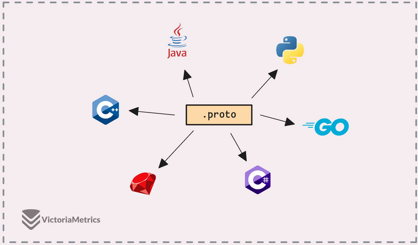

Пример .proto-файла с определением службы пользователей:

```proto
syntax = "proto3";
package example.app;
import "google/protobuf/timestamp.proto";
enum UserRole { USER = 0; ADMIN = 1; SUPER_ADMIN = 2; }
message User { int32 id = 1; string name = 2; optional string email = 3; UserRole role = 4; google.protobuf.Timestamp created_at = 5; }
message GetUserRequest { int32 user_id = 1; }
message GetUserResponse { User user = 1; }
service UserService { rpc GetUser(GetUserRequest) returns (GetUserResponse); rpc CreateUser(User) returns (GetUserResponse); }
```

### gRPC или REST: когда что выбирать

| Критерий             | gRPC                                | REST                            |
| -------------------- | ----------------------------------- | ------------------------------- |
| Производительность   | Высокая (бинарный Protobuf, HTTP/2) | Ниже (текстовый JSON, HTTP/1.1) |
| Типизация            | Строгая, проверяется компилятором   | Слабая, проверяется в runtime   |
| Стриминг             | Встроенная поддержка                | Требует WebSockets/SSE          |
| Читаемость человеком | Требует инструментов                | JSON читается напрямую          |
| Браузерная поддержка | Ограничена (нужен gRPC-web)         | Полная                          |
| Гибкость контракта   | Жёсткий контракт                    | Свободнее                       |
| Кодогенерация        | Автоматическая из .proto            | Ручная или через инструменты    |

**Выбирайте gRPC**, если важны производительность, низкая задержка, обмен в реальном времени или мультиязычная среда.

**Оставайтесь с REST**, если цените простоту, читаемость и браузерную совместимость, или API часто меняется без возможности обновить всех клиентов.

> **Зачем это Go-разработчику.** Понимание места gRPC среди других подходов помогает аргументировать выбор технологии в проекте. В экосистеме Go gRPC — стандарт де-факто для микросервисного взаимодействия.

***

## 2. Protocol Buffers (Protobuf)

**Protocol Buffers (Protobuf)** — языко-независимый формат сериализации данных от Google. Структура сообщения определяется в .proto-файле, после чего Protobuf преобразует его в компактный бинарный формат — значительно меньший, чем JSON или XML.

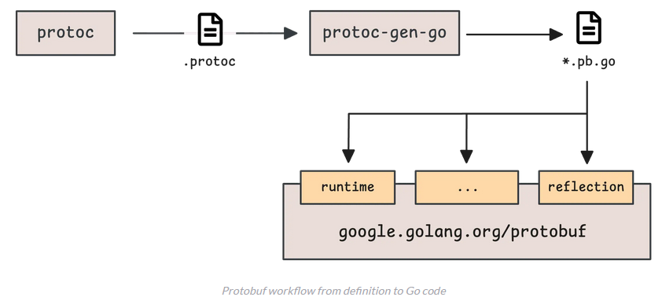

### Инструментарий Protobuf

* **protoc** — основной компилятор. Читает .proto-файлы и генерирует код на различных языках.
* **Плагины для конкретных языков** — например, `protoc-gen-go` для Go (генерирует `.pb.go`) или `protoc-gen-go-grpc` для gRPC-сервисов.
* **Библиотека runtime** — для Go это `google.golang.org/protobuf`, от которой зависят сгенерированные `.pb.go`-файлы.

### Сообщение (Message) и тег (Tag)

**Сообщение** — структура, определяющая данные, передаваемые между системами:

```proto
message Person {
  string name = 1;
  int32 id = 2;
  string email = 3;
}
```

Каждое поле состоит из **типа** и **номера тега**. Номер тега указывает Protobuf, где найти данные внутри сообщения. **Имя поля не участвует в бинарной сериализации** — две системы могут взаимодействовать, даже если имена полей различаются, при условии совпадения номеров тегов и типов:

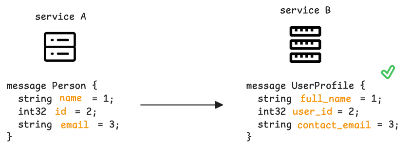

При удалении поля из .proto-файла старый код может всё ещё ожидать этот номер тега. Чтобы избежать конфликтов, номер тега (и имя поля) **резервируют** ключевым словом `reserved`:

```proto
message Person {
  reserved 2, 3;
  reserved "email", "id";
  string name = 1;
  int32 age = 4;
}
```

Повторное использование зарезервированного номера вызовет ошибку компиляции: «Field 'email' uses reserved number 3.»

> **Важно:** хотя Protobuf опирается на номера тегов, имена полей имеют значение при преобразовании в JSON (например, в gRPC-web). Номера тегов от 1 до 15 кодируются в один байт — используйте их для наиболее частотных полей. Для repeated-полей с большим количеством элементов это особенно критично.

### Скалярные типы

Protobuf поддерживает несколько семейств скалярных типов, различающихся способом сериализации:

| Семейство           | Типы                                         | Сериализация                         |
| ------------------- | -------------------------------------------- | ------------------------------------ |
| Переменная длина    | `int32`, `int64`, `uint32`, `uint64`         | Varint: малые значения → меньше байт |
| Фиксированная длина | `fixed32`, `fixed64`, `sfixed32`, `sfixed64` | Всегда 4 или 8 байт                  |
| ZigZag-кодирование  | `sint32`, `sint64`                           | Эффективно для отрицательных чисел   |
| С плавающей точкой  | `float`, `double`                            | Стандартное представление            |
| Булево              | `bool`                                       | 1 байт, varint-кодирование           |
| Строковое/байтовое  | `string`, `bytes`                            | UTF-8 / произвольные байты           |

Ключевое различие между `int32` и `fixed32`:

```
encode_int32(1 << 28) = [128 128 128 128 1]
encode_fixed32(1 << 28) = [0 0 0 16]
```

После \$2^{28}\$ (268 435 456) `int32` начинает использовать 5 байт, тогда как `fixed32` остаётся на 4 байтах. Для больших чисел (например, Unix timestamp в секундах) `fixed32` предпочтительнее.

Различие между `int32` и `sint32` при отрицательных значениях:

```
encode_int32(-1)  = [255 255 255 255 255 255 255 255 255 1]
encode_int64(-1)  = [255 255 255 255 255 255 255 255 255 1]
encode_sint32(-1) = [1]
```

`sint32` с ZigZag-кодированием требует 1 байт для −1, тогда как `int32` — 10 байт. Если диапазон значений неизвестен, `sint32`/`sint64` — более безопасный выбор.

### Enums (перечисления)

**Перечисление** задаёт набор именованных значений — читаемых меток для конкретных чисел:

```proto
enum Version {
  VERSION_UNSPECIFIED = 0;
  VERSION_PROTO1 = 1;
  VERSION_PROTO2 = 2;
  VERSION_PROTO3 = 3;
}
```

По умолчанию перечисления начинаются с 0. Рекомендуется резервировать 0 для неопределённого состояния (`VERSION_UNSPECIFIED`) как запасного варианта.

Более сложный пример с псевдонимами:

```proto
enum Version {
  option allow_alias = true;
  reserved 1;
  reserved "VERSION_PROTO1";
  VERSION_UNSPECIFIED = 0;
  VERSION_PROTO2 = 2;
  VERSION_PROTO3 = 3;
  VERSION_EDITION2023 = 4;
  VERSION_LATEST = 4;
}
```

**Псевдоним (alias)** — ситуация, когда разные имена имеют одно числовое значение (например, `VERSION_LATEST` = 4 и `VERSION_EDITION2023` = 4). По умолчанию Protobuf запрещает псевдонимы; чтобы включить, установите `allow_alias = true;`.

Сериализация перечислений аналогична семейству `int32` — отрицательные значения неэффективны.

Ключевое слово `reserved` работает и с перечислениями: резервируется само значение, а не номер тега. В `edition 2023` синтаксис: `reserved VERSION_PROTO1;` (без кавычек).

### Repeated (повторяющиеся поля)

**Поле repeated** содержит несколько значений одного типа, сохраняя порядок:

```proto
message Person {
  string name = 1;
  repeated string emails = 16;
}
```

Номера тегов за пределами диапазона 1–15 кодируются в большее количество байт, и для repeated-полей этот оверхед умножается на каждый элемент:

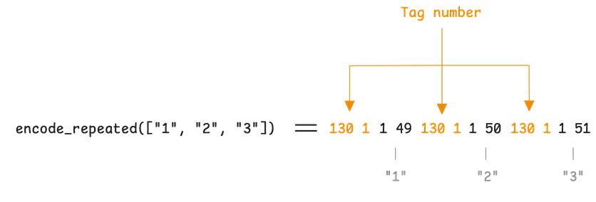

**Рекомендация:** размещайте repeated-поля с низкими номерами тегов (1–15).

**Упаковка (packing)** позволяет repeated-полям скалярных типов (кроме string и bytes) записывать номер тега только один раз. В proto3 и edition 2023 упаковка включена по умолчанию; в proto2 требует `[packed=true]`:

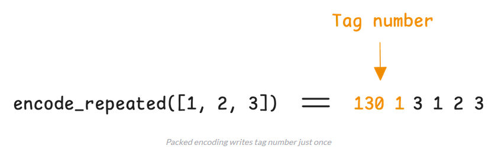

### Maps

**Map** хранит пары ключ-значение:

```proto
message Person {
  string name = 1;
  map<string, string> emails = 2;
}
```

Внутри Protobuf обрабатывает map как repeated-поле сообщения с двумя полями (ключ и значение):

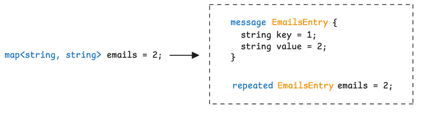

### Oneof

**oneof** определяет несколько полей, из которых в любой момент времени может быть задано только одно:

```proto
message Notification {
  string message = 1;
  oneof notification_type {
    string email = 2;
    string sms = 3;
    string push = 4;
  }
}
```

При установке одного поля остальные поля oneof автоматически очищаются. При сериализации в вывод попадает только заданное поле. Если в данных встретятся два поля из одного oneof, «побеждает» последнее.

### Версии Protobuf и наличие поля

Существует три публичные версии:

| Версия           | Особенности                                                                                               |
| ---------------- | --------------------------------------------------------------------------------------------------------- |
| **proto2**       | Явные значения по умолчанию, поля `required`/`optional`, расширения                                       |
| **proto3**       | Убраны пользовательские default, поля неявно optional, нет расширений (заменены на `Any`)                 |
| **edition 2023** | `edition = "2023"` вместо `syntax = "proto3"`. Возвращает расширения, явные default, чёткое наличие полей |

**Наличие поля (field presence)** определяет, установлено поле или нет. Три состояния:

* Присвоено значение — поле установлено.
* Присвоено пустое (нулевое) значение — поле установлено, но содержит ноль.
* Ничего не присвоено — поле отсутствует.

В **proto2** наличие поля явное по умолчанию. В **proto3** — неявное: нельзя отличить неустановленное поле от поля с нулевым значением (позже добавлено ключевое слово `optional`). В **edition 2023** явное наличие снова стало поведением по умолчанию — строковое поле становится `*string` в Go, позволяя отслеживать, установлено оно или нет.

### Сервисы в .proto

Protobuf позволяет определять сервисы и их методы:

```proto
service MonitoringService {
  rpc GetMetrics(MetricsRequest) returns (MetricsResponse);
}
```

Это определение описывает сервис с методом `GetMetrics`. Для генерации gRPC-кода из определений сервисов требуются соответствующие плагины (например, `protoc-gen-go-grpc` с флагом `--go-grpc_out=.`). Без таких плагинов определения сервисов не генерируют код.

### Well-known типы

Protobuf включает набор предопределённых типов в пакете `google.protobuf`:

* **`google.protobuf.Timestamp`** — момент времени с наносекундной точностью (секунды + наносекунды от Unix epoch).
* **`google.protobuf.Duration`** — временной интервал, не привязанный к календарю.
* **`google.protobuf.Int32Value`**, **`google.protobuf.Int64Value`** и аналоги — обёртки над примитивами (`int32`, `int64`, `string`, `bool`). В Go отображаются как указатели (можно отличить `nil` от нулевого значения).

### Расширения (Extensions) и Any

**Расширения** позволяют добавлять поля к существующему сообщению без изменения исходного определения. Поддерживаются в proto2 и edition 2023.

Исходное сообщение резервирует диапазон номеров тегов:

```proto
message MetricData {
  string service_name = 1;
  string metric_name = 2;
  double value = 3;
  extensions 100 to 199;
}
```

Другая команда может расширить сообщение, используя зарезервированные номера:

```proto
import "monitoring/metrics.proto";
package monitoring.extensions;
extend monitoring.MetricData {
  optional int32 error_code = 100;
  repeated string logs = 101;
}
```

Чтобы явно зафиксировать использованные номера расширений:

```proto
message MetricData {
  string service_name = 1;
  string metric_name = 2;
  double value = 3;
  extensions 100 to 199 [
    declaration = {number: 100, full_name: ".monitoring.extensions.error_code", type: "int32"},
    declaration = {number: 101, full_name: ".monitoring.extensions.logs", type: "string", repeated: true}
  ];
}
```

**Any** — альтернативный механизм (proto3+), позволяющий вложить любое сообщение без предварительного резервирования номеров:

```proto
import "google/protobuf/any.proto";
message MonitoringEvent {
  string event_id = 1;
  string source = 2;
  google.protobuf.Any payload = 3;
}
```

Пример использования Any с разными payload:

```proto
package metrics;
message MetricsPayload {
  string metric_name = 1;
  double value = 2;
}
```

```proto
package logs;
message LogPayload {
  string timestamp = 1;
  string message = 2;
}
```

В Go для работы с Any используется пакет `google.golang.org/protobuf/types/known/anypb`. Упаковка сообщения:

```go
metricsPayload, _ := anypb.New(&MetricsPayload{
  MetricName: "test",
  Value:      123,
})
p := &MonitoringEvent{
  EventId: "123",
  Source:  "test",
  Payload: metricsPayload,
}
```

Проверка типа содержимого — функция `MessageIs`:

```go
metricsPayload2 := &MetricsPayload{}
if p.Payload.MessageIs(metricsPayload2) {
  fmt.Println("Its indeed a MetricsPayload")
}
```

> **Зачем это Go-разработчику.** Protobuf — фундамент gRPC. Правильный выбор типов напрямую влияет на размер сериализованных сообщений. При миллионах запросов разница между `int32` и `sint32` для отрицательных чисел — это гигабайты трафика. Понимание `oneof` и `Any` необходимо при проектировании расширяемых API. Знание версий Protobuf помогает избежать неожиданных изменений в сгенерированном Go-коде (например, `string` → `*string`).

***

## 3. HTTP/2 — транспортный уровень gRPC

**HTTP/2** — значительное улучшение по сравнению с HTTP/1.1, практически везде используемое по умолчанию. В инструментах разработчика Chrome соединения HTTP/2 видны повсеместно.

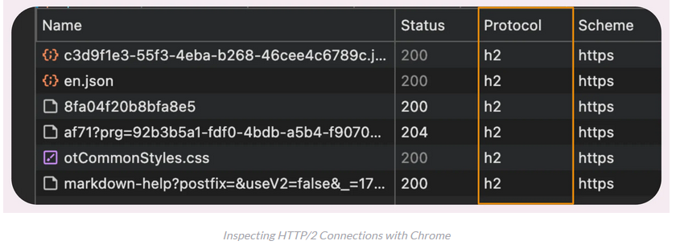

### Проблема HTTP/1.1: Head-of-Line blocking

В HTTP/1.1 появилась конвейерная обработка (pipelining): несколько запросов могут использовать одно соединение и запускаться без ожидания завершения предыдущего.

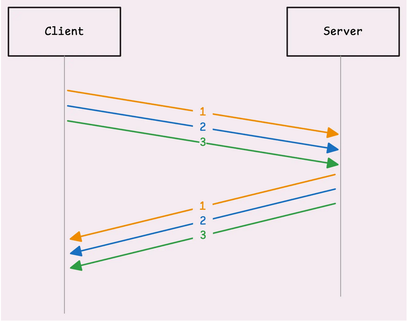

Проблема: запросы должны отправляться в порядке очереди, и **ответы обязаны возвращаться в том же порядке**. Если один ответ задерживается, все остальные ждут.

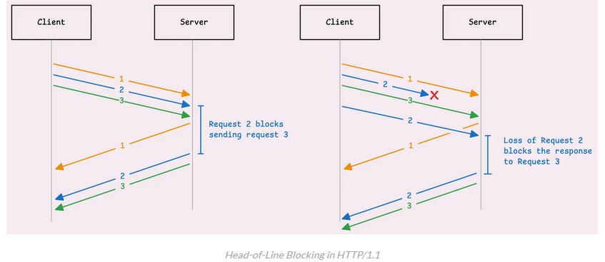

Эта проблема называется **Head-of-Line blocking (HoL)** — блокировка «начала очереди».

Обходной манёвр HTTP/1.1: открытие нескольких TCP-соединений к одному серверу. Это работает, но увеличивает расход ресурсов на обеих сторонах.

### Мультиплексирование в HTTP/2

HTTP/2 разделяет одно TCP-соединение на несколько независимых **потоков (streams)**. Каждый поток имеет уникальный **идентификатор (stream ID)** и работает параллельно с другими. Задержка одного потока не блокирует остальные — HoL решается на уровне приложения.

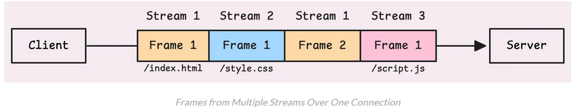

Однако HTTP/2 работает поверх TCP, поэтому полностью избежать HoL не удаётся. На транспортном уровне TCP настаивает на доставке пакетов в порядке их поступления. Если один пакет потерян, TCP заставляет все остальные ждать. Для полного устранения HoL требуется **QUIC** (на базе UDP), используемый в **HTTP/3**.

### Фреймы в HTTP/2

**Фрейм** — минимальная единица обмена в HTTP/2. Каждый фрейм включает 9-байтовый заголовок:

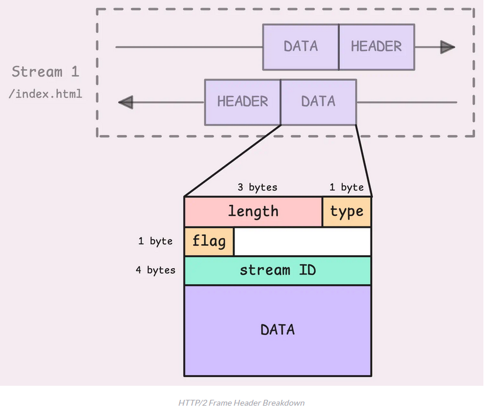

| Поле          | Описание                                                                                                  |
| ------------- | --------------------------------------------------------------------------------------------------------- |
| **Длина**     | Размер полезной нагрузки (payload) фрейма, исключая заголовок                                             |
| **Тип**       | DATA, HEADERS, PRIORITY, RST\_STREAM, SETTINGS, PING, GOAWAY, WINDOW\_UPDATE и др.                        |
| **Флаги**     | Дополнительные сведения. Например, `END_STREAM` (0x1) сигнализирует, что в потоке больше не будет фреймов |
| **Stream ID** | 32-битный идентификатор потока (старший бит всегда 0)                                                     |

**Payload (полезная нагрузка)** — фактические данные, передаваемые в сообщении, за исключением служебной информации заголовка.

### Установка соединения

1. Клиент отправляет TLS **ClientHello** с расширением **ALPN**, содержащим список поддерживаемых протоколов (`h2`, `http/1.1`).
2. Сервер в **ServerHello** подтверждает выбор `h2`.
3. Рукопожатие TLS завершается стандартно (ключи, сертификаты).
4. Клиент отправляет **вводное сообщение (connection preface)** — 24-байтовую последовательность `PRI * HTTP/2.0\r\n\r\nSM\r\n\r\n`.
5. Сразу после — кадр **SETTINGS** (управляющий кадр уровня соединения): параметры управления потоком, максимальный размер фрейма.
6. Сервер отвечает своим вводным сообщением и кадром SETTINGS.

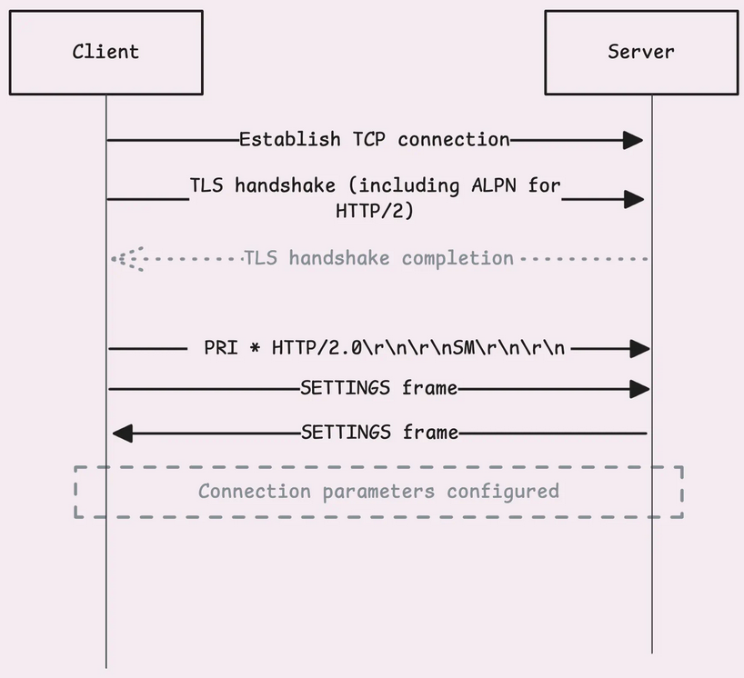

### HEADERS, HPACK-сжатие и DATA

Клиент создаёт новый поток с нечётным stream ID (1, 3, 5...) и отправляет **кадр HEADERS**. Правила stream ID:

* Нечётные — для потоков, инициированных клиентом.
* Чётные — для потоков, инициированных сервером (server push).
* Stream ID 0 — только для управляющих кадров уровня соединения.

HTTP/2 вводит **псевдозаголовки** — специальные заголовки, начинающиеся с двоеточия: `:method`, `:path`, `:scheme`, `:status`. Они всегда идут первыми и отделяют служебную информацию от обычных заголовков (`Accept`, `Host`, `Content-Type`):

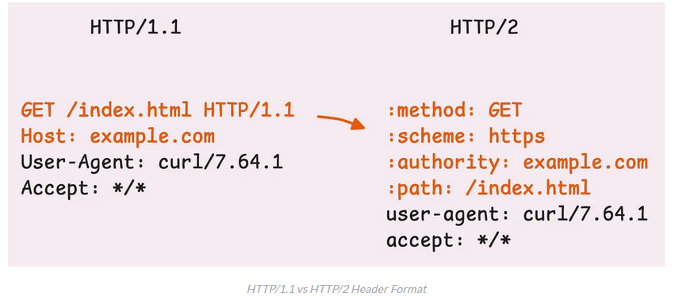

Заголовки сжимаются алгоритмом **HPACK**, использующим две таблицы:

**Статическая таблица** — общий словарь из 61 наиболее распространённого HTTP-заголовка, известный клиенту и серверу заранее:

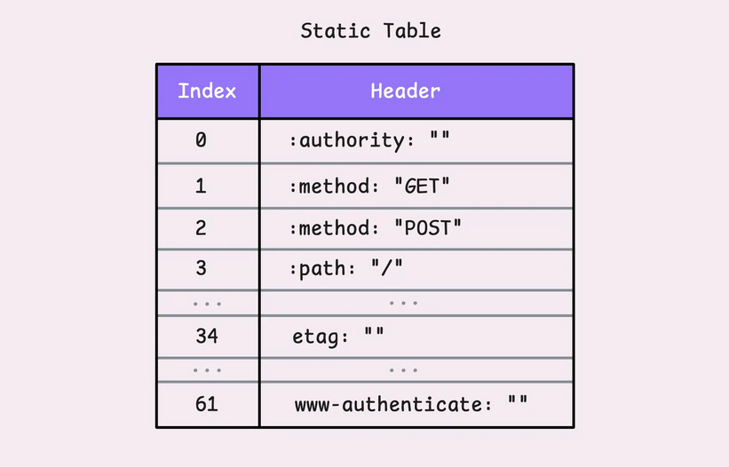

Вместо передачи `:method:GET` целиком HPACK отправляет индекс 2 (номер этой пары в статической таблице). Если ключ совпадает, а значение нет (например, `etag:some-random-value`), HPACK переиспользует индекс ключа и отправляет только значение в кодировке Хаффмана.

**Динамическая таблица** изначально пуста и пополняется по мере отправки новых заголовков. Индексы начинаются с 62. Динамическая таблица:

* **Разделяется всеми потоками** одного соединения.
* Ограничена размером по умолчанию **4 КБ** (настраивается через `SETTINGS_HEADER_TABLE_SIZE`).
* При переполнении старые заголовки вытесняются.

Тело запроса передаётся в **кадрах DATA**. Если тело превышает максимальный размер фрейма (по умолчанию 16 КБ), оно разбивается на несколько кадров с одним stream ID:

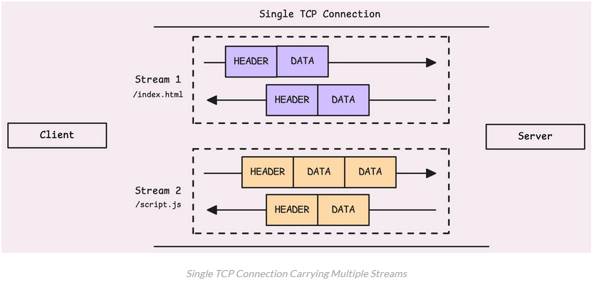

### Контроль потока и завершение

Когда приходит фрейм с флагом **END\_STREAM**, это сигнал: «В этом потоке больше не будет кадров». Сервер может отправить запрошенные данные и завершить поток своим флагом END\_STREAM. Соединение остаётся открытым для других потоков.

Для корректного закрытия всего соединения сервер использует кадр **GOAWAY**. Он включает идентификатор последнего обрабатываемого потока: «Потоки с более высокими ID не принимаются, текущие могут завершиться». После отправки GOAWAY сервер выжидает короткую паузу, чтобы избежать резкого сброса TCP (RST).

Другие управляющие кадры HTTP/2:

* **WINDOW\_UPDATE** — управление потоком на уровне соединения и потока.
* **PING** — проверка активности соединения.
* **PRIORITY** — настройка приоритетов потоков.
* **RST\_STREAM** — аварийная остановка отдельного потока без влияния на соединение.

> **Зачем это Go-разработчику.** Понимание фреймовой структуры HTTP/2 помогает при отладке gRPC-соединений (Wireshark, трассировка). Механика HPACK объясняет, почему gRPC эффективен при множественных вызовах: повторяющиеся заголовки не передаются заново. Знание HoL на уровне TCP важно при проектировании высоконагруженных систем — это прямой аргумент в пользу перехода на HTTP/3.

***

## 4. HTTP/2 в Go

Пакет `net/http` в Go поддерживает HTTP/2 по умолчанию — но только через HTTPS. Для обычного HTTP используется HTTP/1.1.

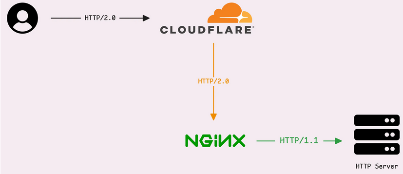

Базовый HTTP-сервер на порту 8080:

```go
func getRequestProtocol(w http.ResponseWriter, r *http.Request) {
  fmt.Fprintf(w, "Request Protocol: %s\n", r.Proto)
}
func main() {
  http.HandleFunc("/", getRequestProtocol)
  if err := http.ListenAndServe(":8080", nil); err != nil {
    fmt.Printf("Error starting server: %s\n", err)
  }
}
```

Простой HTTP-клиент:

```go
func main() {
  resp, _ := (&http.Client{}).Get("http://localhost:8080")
  defer resp.Body.Close()
  body, _ := io.ReadAll(resp.Body)
  fmt.Println("Response:", string(body))
}
// Response: Request Protocol: HTTP/1.1
```

Без HTTPS и клиент, и сервер используют HTTP/1.1.

`DefaultTransport` в Go уже настроен на обработку HTTP/1.1 и HTTP/2, с включённым полем `ForceAttemptHTTP2`:

```go
var DefaultTransport RoundTripper = &Transport{
  ForceAttemptHTTP2:     true,
  MaxIdleConns:          100,
  IdleConnTimeout:       90 * time.Second,
  TLSHandshakeTimeout:   10 * time.Second,
  ExpectContinueTimeout: 1 * time.Second,
}
```

Для включения HTTP/2 без TLS (h2c) нужна явная настройка:

```go
var protocols http.Protocols
protocols.SetUnencryptedHTTP2(true)
server := &http.Server{Addr: ":8080", Handler: http.HandlerFunc(rootHandler), Protocols: &protocols}
client := &http.Client{Transport: &http.Transport{ForceAttemptHTTP2: true, Protocols: &protocols}}
// Response: Request Protocol: HTTP/2.0
```

Вызов `protocols.SetUnencryptedHTTP2(true)` разрешает HTTP/2 поверх обычного HTTP. Это допустимо для внутренних микросервисов, но нестандартно для внешнего трафика.

Пакет `golang.org/x/net/http2` даёт ещё более тонкий контроль:

```go
h2s := &http2.Server{MaxConcurrentStreams: 250}
h2cHandler := h2c.NewHandler(handler, h2s)
server := &http.Server{Addr: ":8080", Handler: h2cHandler}
client := &http.Client{Transport: &http2.Transport{AllowHTTP: true, DialTLS: func(network, addr string, cfg *tls.Config) (net.Conn, error) { return net.Dial(network, addr) }}}
```

Если на сервере включён TLS, стандартный HTTP-клиент Go автоматически использует HTTP/2 и переключается на HTTP/1.1 при необходимости.

> **Зачем это Go-разработчику.** Понимание того, как именно Go включает HTTP/2, позволяет осознанно настраивать сервер. В production-среде большинство gRPC-сервисов работает через HTTPS — HTTP/2 включается автоматически, без дополнительных действий.

***

## 5. gRPC в Go: практика

**gRPC** — высокопроизводительный RPC-фреймворк, использующий Protobuf для сериализации и HTTP/2 для передачи. Если сетевые накладные расходы не критичны, реальное преимущество gRPC — в контрактной архитектуре, удобстве сопровождения и богатой экосистеме.

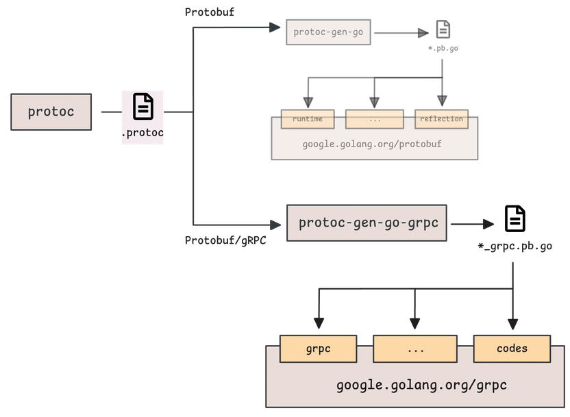

###

### Инструменты и плагины

`protoc` сам по себе — только компилятор Protobuf. Для Go необходимы два плагина:

* **`protoc-gen-go`** — генерирует Go-код для protobuf-сообщений (`.pb.go`).
* **`protoc-gen-go-grpc`** — генерирует gRPC-код: серверные интерфейсы, клиентские заглушки (`_grpc.pb.go`).

### Определение сервиса

Пример Echo-сервиса: принимает строку, возвращает ту же строку с префиксом «Echo:»:

```proto
syntax = "proto3";
option go_package = ".;echo";
service Echo { rpc EchoMessage(EchoRequest) returns (EchoReply) {} }
message EchoRequest { string message = 1; }
message EchoReply { string message = 1; }
```

Каждый RPC-метод должен иметь ровно один входной и один выходной параметр — оба в виде сообщений. Даже простая строка оборачивается в сообщение. Для методов без параметров используется `google.protobuf.Empty`.

### Генерация кода

Команда компиляции:

```
protoc --go_out=. --go_opt=paths=source_relative \
       --go-grpc_out=. --go-grpc_opt=paths=source_relative \
       echo.proto
```

Два плагина выполняют две задачи:

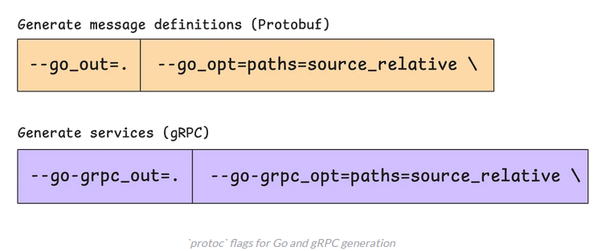

* `protoc-gen-go` генерирует код protobuf-сообщений в текущий каталог.
* `protoc-gen-go-grpc` генерирует gRPC-код: серверные интерфейсы и клиентские заглушки.

Результат: два файла — `echo.pb.go` и `echo_grpc.pb.go`.

### Опция go\_package и paths=source\_relative

Опция `go_package` в .proto определяет путь и имя пакета для сгенерированного Go-кода:

```proto
option go_package = ".;echo";
```

Формат: `full/import/path;packagename`

```proto
option go_package = "full/import/path;packagename";
```

Если имя пакета (после `;`) опущено, Protobuf использует последний сегмент пути.

Без `paths=source_relative` protoc создаёт структуру каталогов на основе пути импорта:

```
$ protoc --go_out=. --go-grpc_out=. proto/echo.proto
```

```
├── full
│   └── import
│       └── path
│           ├── echo.pb.go
│           └── echo_grpc.pb.go
└── proto
    └── echo.proto
```

С `paths=source_relative` сгенерированные файлы размещаются рядом с .proto-файлом:

```
├── proto
│   ├── echo.proto
│   ├── echo.pb.go
│   └── echo_grpc.pb.go
```

Варианты настройки пакета:

```proto
// Option 1:
option go_package = ".;echo";
// Option 2:
option go_package = "whatever/path/you/want/echo";
```

### Реализация сервера

Сгенерированный код предоставляет две ключевые вещи:

1. **Интерфейс** с методами сервиса:

```go
type EchoServiceServer interface {
  Echo(context.Context, *EchoRequest) (*EchoResponse, error)
  mustEmbedUnimplementedEchoServer()
}
```

1. **Функцию регистрации** реализации на gRPC-сервере:

```go
func RegisterEchoServer(s grpc.ServiceRegistrar, srv EchoServer) {
  s.RegisterService(&Echo_ServiceDesc, srv)
}
```

```go
RegisterEchoServer(grpcServer, &EchoService{})
```

Создание реализации и регистрация:

```go
type EchoService struct { UnimplementedEchoServer }
func (s *EchoService) EchoMessage(ctx context.Context, req *EchoRequest) (*EchoReply, error) {
  return &EchoReply{Message: "Echo: " + req.Message}, nil
}
func main() {
  lis, _ := net.Listen("tcp", ":9191")
  server := grpc.NewServer()
  RegisterEchoServer(server, &EchoService{})
  server.Serve(lis)
}
```

Проверка через grpcurl:

```
$ grpcurl -plaintext -d '{"message": "Hello from grpcurl"}' -proto echo.proto localhost:9191 Echo/EchoMessage
{"message": "Echo: Hello from grpcurl"}
```

### Unimplemented и Unsafe: обратная совместимость

Интерфейс `EchoServer` требует метод `mustEmbedUnimplementedEchoServer()`. Он автоматически обеспечивается встраиванием `UnimplementedEchoServer`.

Назначение: **обратная совместимость**. Если в .proto добавлен новый метод, а реализация его не включает, `UnimplementedEchoServer` предоставляет метод по умолчанию, возвращающий ошибку «Unimplemented»:

```go
func (s *EchoService) HelloMessage(ctx context.Context, req *HelloRequest) (*HelloResponse, error) {
  return nil, status.Errorf(codes.Unimplemented, "method HelloMessage not implemented")
}
```

При вызове неподдерживаемого метода:

```
ERROR:
  Code: Unimplemented
  Message: method HelloMessage not implemented
```

Встраивание структур автоматически связывает все компоненты:

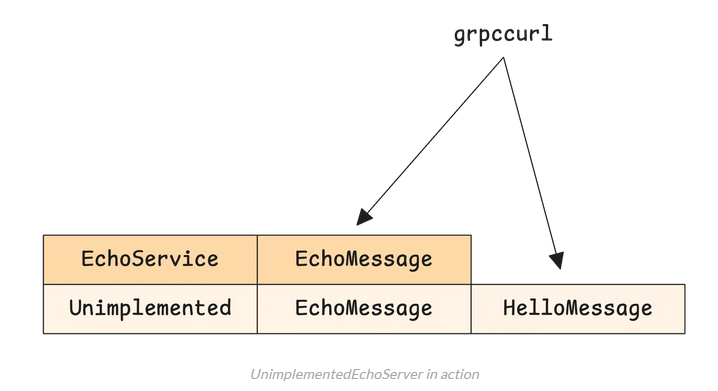

Альтернатива — `UnsafeEchoServer`:

```go
type EchoService struct { UnsafeEchoServer }
```

При использовании `Unsafe` разработчик берёт на себя полную ответственность: если .proto изменится, а метод не будет реализован, компилятор Go выдаст ошибку при регистрации сервиса. Это **проверка на этапе компиляции**, а не паника в runtime.

> **Зачем это Go-разработчику.** Разница между `Unimplemented` и `Unsafe` — это выбор стратегии эволюции API. `Unimplemented` подходит для постепенного развёртывания (новый метод появляется, старые серверы продолжают работать). `Unsafe` — для строгого контроля: никакой метод не останется незамеченным.

***

## 6. Метаданные (Metadata)

**Метаданные gRPC** — пары ключ-значение, передаваемые в HTTP/2-заголовках отдельно от protobuf-сообщений. Ключи регистронезависимы и приводятся к нижнему регистру. Метаданные несут контекстную информацию (авторизация, трассировка), не затрагивая структуру protobuf-сообщений.

Разделение ответственности: сообщения Protobuf — бизнес-логика, метаданные — сквозная информация. Без метаданных каждый тип сообщения пришлось бы дополнять полями для токенов и идентификаторов.

Два типа метаданных: **headers** и **trailers**.

### Заголовки (Headers)

**Заголовки** отправляются в начале запроса или ответа. Упрощённая схема потока gRPC:

1. Кадр HTTP/2 HEADERS (псевдозаголовки + пользовательские заголовки).
2. Один или несколько кадров DATA с protobuf-сообщением.
3. Завершающий кадр HEADERS с флагом END\_STREAM (содержит trailers).

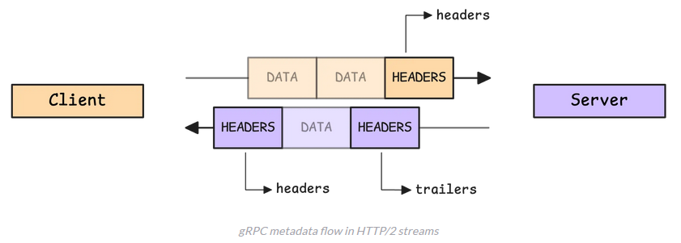

Метаданные — это `map[string][]string`:

```go
type Metadata map[string][]string
```

**Клиент** добавляет метаданные через контекст:

```go
md := metadata.Pairs("authorization", "Bearer my-secret-token")
ctx := metadata.NewOutgoingContext(context.TODO(), md)
```

Рекомендуется `AppendToOutgoingContext` вместо `NewOutgoingContext` — он объединяет новые метаданные с уже существующими.

**Сервер** извлекает заголовки из контекста:

```go
func (s *EchoService) EchoMessage(ctx context.Context, req *EchoRequest) (*EchoReply, error) {
  md, ok := metadata.FromIncomingContext(ctx)
  if ok { fmt.Printf("headers: %v\n", md) }
  header := metadata.Pairs("received-at", time.Now().Format(time.RFC3339))
  _ = grpc.SetHeader(ctx, header)
  return &EchoReply{Message: "Echo: " + req.GetMessage()}, nil
}
```

Многократный вызов `grpc.SetHeader` объединяет заголовки. Явный вызов `grpc.SendHeader()` немедленно отправляет все установленные заголовки.

### Трейлеры (Trailers)

**Трейлеры** — метаданные, отправляемые **после** передачи основного ответа. Используются для информации, доступной только после завершения обработки: контрольные суммы, отладочные данные.

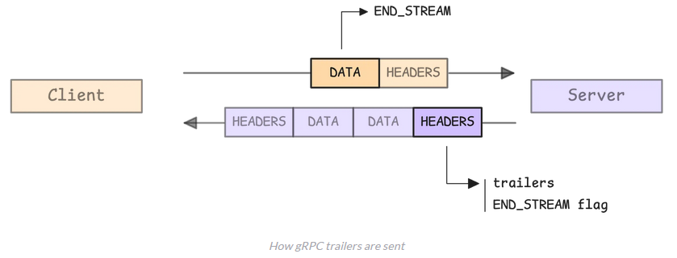

Трейлеры отправляются только сервером. Клиент их не отправляет (клиент не включает завершающий кадр HEADERS, как сервер).

Установка трейлеров:

```go
defer func(t time.Time) {
  _ = grpc.SetTrailer(ctx, metadata.Pairs("response-time", time.Since(t).String()))
}(time.Now())
```

Трейлеры отправляются автоматически после завершения RPC-вызова (не обязательно через `defer`). Для заголовков gRPC даёт методы `SetHeader()` и `SendHeader()` для контроля времени отправки; для трейлеров — только `SetTrailer()`, время определяет фреймворк.

Получение трейлеров клиентом:

```go
var trailer metadata.MD
resp, _ := client.EchoMessage(ctx, req, grpc.Trailer(&trailer))
```

> **Зачем это Go-разработчику.** Метаданные — стандартный способ проброса JWT-токенов, идентификаторов трассировки и request ID в gRPC-инфраструктуре. Правильная работа с трейлерами критична при стриминге: трейлеры доступны только после завершения потока.

***

## 7. Стриминг

Отправка большого объёма данных за один RPC-вызов неэффективна, а традиционный RPC не поддерживает обмен в реальном времени. gRPC решает это **стримингом** — клиент и сервер могут отправлять множество сообщений по одному соединению.

Три типа стриминга определяются расположением ключевого слова `stream` в .proto:

| Тип                 | Сигнатура в .proto                                     | Сценарий                                       |
| ------------------- | ------------------------------------------------------ | ---------------------------------------------- |
| **Серверный**       | `rpc Method(Request) returns (stream Response)`        | Лог-потоки, отчёты, большие наборы данных      |
| **Клиентский**      | `rpc Method(stream Request) returns (Response)`        | Загрузка файлов, пакетная обработка            |
| **Двунаправленный** | `rpc Method(stream Request) returns (stream Response)` | Чат, real-time коллаборация, длительные задачи |

### Серверный стриминг

Клиент отправляет один запрос, сервер отвечает серией сообщений:

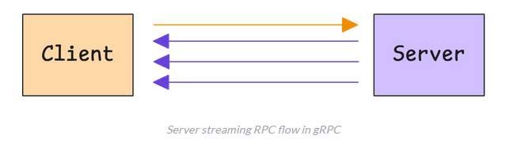

Определение в .proto — `stream` перед типом ответа:

```proto
rpc EchoServerStreaming(MyRequest) returns (stream MyResponse);
```

Клиент читает сообщения по одному, пока сервер не сигнализирует о завершении:

```go
stream, _ := client.EchoServerStreaming(ctx, req)
for {
  resp, err := stream.Recv()
  if err == io.EOF { break }
  fmt.Printf("Received: %s\n", resp.GetMessage())
}
```

После отправки запроса клиент устанавливает флаг END\_STREAM:

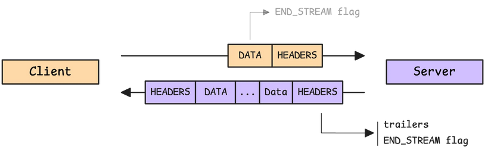

**Важно:** метод `stream.Trailer()` следует вызывать только после завершения потока — когда `stream.Recv()` вернёт ошибку (включая `io.EOF`). Это связано с тем, как HTTP/2 обрабатывает трейлеры: gRPC ждёт отправки последнего сообщения перед доставкой трейлеров.

Серверная реализация:

```go
func (s *EchoService) EchoServerStreaming(req *EchoRequest, stream Echo_EchoServerStreamingServer) error {
  for _, ch := range "Echo: " + req.GetMessage() {
    _ = stream.Send(&EchoReply{Message: string(ch)})
    time.Sleep(time.Second)
  }
  return nil
}
```

Сервер отправляет по одному сообщению, многократно вызывая `stream.Send()`. Поток остаётся открытым, пока функция не вернёт управление.

Закрытие потока:

* `return nil` — успешное завершение.
* `return error` — сбой с кодом статуса gRPC (пакеты `status` и `codes`).

На стороне клиента флаг END\_STREAM преобразуется транспортом в `io.EOF`.

### Клиентский стриминг

Клиент отправляет несколько сообщений и ожидает один ответ:

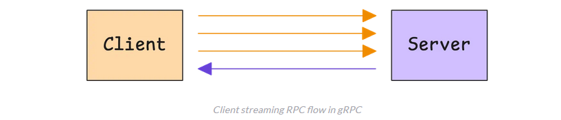

Определение — `stream` перед типом запроса:

```proto
rpc EchoClientStreaming(stream MyRequest) returns (MyResponse);
```

Клиент использует `CloseAndRecv()` для завершения отправки:

```go
stream, _ := client.EchoClientStreaming(ctx)
for _, msg := range "Hello" {
  _ = stream.Send(&EchoRequest{Message: string(msg)})
}
reply, _ := stream.CloseAndRecv()
fmt.Printf("Received: %s\n", reply.GetMessage())
```

`CloseAndRecv()` отправляет пустой кадр DATA с флагом END\_STREAM:

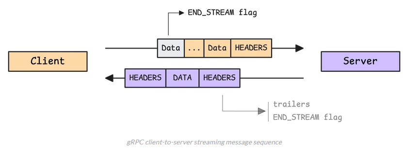

Сервер получает `io.EOF` при чтении из потока и отвечает через `SendAndClose()`, одновременно отправляя финальный ответ и закрывая поток:

```go
func (s *EchoService) EchoClientStreaming(stream Echo_EchoClientStreamingServer) error {
  msg := ""
  for {
    req, err := stream.Recv()
    if err == io.EOF { break }
    msg += req.GetMessage()
  }
  return stream.SendAndClose(&EchoReply{Message: "Echo: " + msg})
}
```

### Двунаправленный стриминг

Клиент и сервер отправляют сообщения независимо друг от друга:

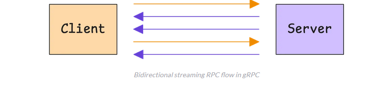

Определение — `stream` перед обоими типами:

```proto
rpc EchoBidirectionalStreaming(stream MyRequest) returns (stream MyResponse);
```

Клиентская сторона:

```go
stream, _ := client.EchoBidirectionalStreaming(ctx)
go func() {
  for { resp, err := stream.Recv(); err != nil { break }; fmt.Printf("Received: %s\n", resp.GetMessage()) }
}()
for _, msg := range "Hello" { stream.Send(&EchoRequest{Message: string(msg)}) }
stream.CloseSend()
```

Отправка и получение обычно обрабатываются в отдельных горутинах. Цикл приёма может запускать новые горутины для обработки сообщений, чтобы `Recv()` не блокировался.

Серверная сторона:

```go
func (s *EchoService) EchoBidirectionalStreaming(stream Echo_EchoBidirectionalStreamingServer) error {
  for {
    req, err := stream.Recv()
    if err == io.EOF { return nil }
    _ = stream.Send(&EchoReply{Message: "Echo: " + req.GetMessage()})
  }
}
```

Сообщения приходят в точном порядке отправки (`H`, `e`, `l`, `l`, `o`), что гарантируется протоколом HTTP/2. Однако реальное преимущество двунаправленного стриминга — сервер может отправлять данные в любое время без ожидания клиентских запросов (уведомления, трансляции, обновления статуса).

**Общая рекомендация:** избегайте прямого вызова `stream.RecvMsg()` и `stream.SendMsg()` — это внутренние механизмы gRPC. Используйте типобезопасные `stream.Send()` и `stream.Recv()`.

> **Зачем это Go-разработчику.** Серверный стриминг — основной паттерн для потоковой выдачи данных (логи, метрики, экспорт). Клиентский стриминг незаменим при пакетной загрузке. Двунаправленный стриминг — основа real-time фич. Правило «Trailer() только после EOF» — частая причина ошибок при отладке.

***

## 8. Обработка ошибок и deadlines

### Коды статусов gRPC

gRPC определяет стандартный набор кодов статусов в пакете `google.golang.org/grpc/codes`:

| Код                  | Назначение                                                |
| -------------------- | --------------------------------------------------------- |
| `OK`                 | Успешное завершение                                       |
| `Canceled`           | Операция отменена (обычно вызывающей стороной)            |
| `Unknown`            | Неизвестная ошибка                                        |
| `InvalidArgument`    | Некорректный аргумент                                     |
| `DeadlineExceeded`   | Превышен таймаут                                          |
| `NotFound`           | Запрошенный ресурс не найден                              |
| `AlreadyExists`      | Ресурс уже существует                                     |
| `PermissionDenied`   | Недостаточно прав                                         |
| `ResourceExhausted`  | Исчерпан лимит ресурсов                                   |
| `FailedPrecondition` | Операция отклонена из-за состояния системы                |
| `Aborted`            | Операция прервана (обычно из-за конфликта конкурентности) |
| `OutOfRange`         | Выход за допустимый диапазон                              |
| `Unimplemented`      | Метод не реализован                                       |
| `Internal`           | Внутренняя ошибка сервера                                 |
| `Unavailable`        | Сервис недоступен                                         |
| `DataLoss`           | Потеря или повреждение данных                             |
| `Unauthenticated`    | Не пройдена аутентификация                                |

### Формирование ошибок

Пакет `google.golang.org/grpc/status` создаёт gRPC-ошибки:

```go
st := status.New(codes.InvalidArgument, "field 'email' is required")
// добавление деталей через st.WithDetails(...)
return st.Err()
```

Сокращённая запись: `status.Errorf(codes.NotFound, "user %d not found", id)`.

### Маппинг ошибок Go → gRPC-статусы

gRPC автоматически преобразует стандартные ошибки Go в gRPC-статусы:

| Ошибка Go                       | gRPC-статус                         |
| ------------------------------- | ----------------------------------- |
| `fmt.Errorf("...")`             | `codes.Unknown`                     |
| `context.Canceled`              | `codes.Canceled`                    |
| `context.DeadlineExceeded`      | `codes.DeadlineExceeded`            |
| `io.EOF`                        | без изменений (передаётся как есть) |
| `io.ErrUnexpectedEOF`           | `codes.Internal`                    |
| Ошибка с методом `GRPCStatus()` | без изменений                       |

Эти правила работают одинаково для унарных и потоковых RPC.

### Deadlines и таймауты

**Deadline** — момент времени, после которого RPC-вызов автоматически отменяется. Устанавливается клиентом через контекст:

```go
ctx, cancel := context.WithTimeout(context.Background(), 2*time.Second)
defer cancel()
resp, err := client.Echo(ctx, &pb.EchoRequest{Message: "hello"})
```

Сервер проверяет, не истёк ли deadline:

```go
if ctx.Err() == context.DeadlineExceeded {
    return status.Error(codes.DeadlineExceeded, "request timed out")
}
```

Рекомендации:

* **Всегда устанавливайте deadline** для RPC-вызовов — иначе вызов может висеть бесконечно.
* Сервер должен проверять `ctx.Err()` перед выполнением дорогостоящих операций.
* При стриминге deadline применяется ко всему времени жизни потока.

> **Зачем это Go-разработчику.** Правильная обработка ошибок и deadlines — то, что отличает production-ready gRPC-сервис от прототипа. Маппинг ошибок Go → gRPC позволяет использовать стандартные ошибки и не думать о кодах, пока не потребуется специфичная логика. Пакет `status` с методом `WithDetails` даёт возможность пробрасывать структурированную информацию об ошибке клиенту.

***

## 9. Перехватчики (Interceptors)

**Перехватчик (interceptor)** — функция, оборачивающая вызов RPC-метода и выполняющая код до и после обработки запроса. Аналог middleware в HTTP-фреймворках, но с разделением на унарные и потоковые сценарии.

Перехватчики классифицируются по двум осям:

* **По стороне:** серверные (при поступлении запроса) и клиентские (перед отправкой / после получения ответа).
* **По типу вызова:** унарные (один запрос → один ответ) и потоковые (долгоживущие стримы).

Комбинация даёт **четыре типа** перехватчиков.

### Серверный унарный перехватчик

Функция получает контекст, запрос, информацию о вызове и обработчик. До вызова обработчика можно прочитать метаданные, проверить аутентификацию. После — обработать ответ или ошибку.

```go
func LoggingUnaryInterceptor(ctx context.Context, req any, info *grpc.UnaryServerInfo, handler grpc.UnaryHandler) (any, error) {
  start := time.Now()
  resp, err := handler(ctx, req)
  fmt.Printf("method=%s duration=%s error=%v\n", info.FullMethod, time.Since(start), err)
  return resp, err
}
```

```go
grpc.NewServer(grpc.UnaryInterceptor(LoggingUnaryInterceptor))
```

### Серверный потоковый перехватчик

Работает с интерфейсом `ServerStream`. Оборачивает стрим в свою структуру, переопределяя `Send` и `Recv` для перехвата каждого сообщения на протяжении всего времени жизни стрима.

```go
func AuthInterceptor(srv any, ss grpc.ServerStream, info *grpc.StreamServerInfo, handler grpc.StreamHandler) error {
  md, ok := metadata.FromIncomingContext(ss.Context())
  if !ok || len(md["token"]) == 0 {
    return status.Errorf(codes.Unauthenticated, "method %s requires authentication", info.FullMethod)
  }
  return handler(srv, ss)
}
```

### Клиентский унарный перехватчик

Получает контекст, имя метода, запрос, ответ, объект соединения и функцию-инвокер. До вызова инвокера можно добавить метаданные (токен), после — обработать ошибку или реализовать повторные попытки.

```go
func RetryUnaryInterceptor(ctx context.Context, method string, req, reply any, cc *grpc.ClientConn, invoker grpc.UnaryUnaryServerInterceptor) {
    maxRetries := 3
    for attempt := 0; attempt < maxRetries; attempt++ {
      err := invoker(ctx, method, req, reply, cc, opts...)
      if err == nil || !isRetryable(err) {
        return err
      }
      fmt.Printf("Retrying %s, attempt %d after error: %v\n", method, attempt+1, err)
    }
    return invoker(ctx, method, req, reply, cc, opts...)
}

func isRetryable(err error) bool {
    code := status.Code(err)
    return code == codes.Unavailable || code == codes.DeadlineExceeded
}
```

### Клиентский потоковый перехватчик

Работает с интерфейсом `ClientStream`, оборачивая стрим для перехвата отправки и получения сообщений.

```go
func TimeoutStreamInterceptor(ctx context.Context, desc *grpc.StreamDesc, cc *grpc.ClientConn, method string, stream *grpc.Stream, cancel <-context.WithTimeout(ctx, 5*time.Second)
  defer cancel()

  stream, err := streamer(timeoutCtx, desc, cc, method, opts...)
  if err != nil {
    return nil, fmt.Errorf("failed to create %s stream: %w", desc.StreamName, err)
  }

  return stream, nil
}
```

### Цепочки перехватчиков

В Go перехватчики реализуются как функции высшего порядка, принимающие следующий обработчик и возвращающие новый. Для построения цепочек используются функции вроде `ChainUnaryInterceptor` — перехватчики выполняются последовательно, передавая управление друг другу через вызов `handler`.

Различие с HTTP-middleware: в gRPC унарные перехватчики работают по принципу «до-и-после», а потоковые требуют обёртки над стримом для перехвата каждого сообщения.

### go-grpc-middleware

Пакет **`go-grpc-middleware`** предоставляет набор готовых перехватчиков:

**Серверные:**

* **Auth** — аутентификация через `AuthFunc`.
* **Recovery** — перехват паник и преобразование в gRPC-ошибки.
* **Validator / protovalidate** — автоматическая валидация входящих сообщений на основе определений Protobuf.
* **Rate limiting** — контроль скорости запросов.
* **Selector** — применение перехватчиков только к определённым RPC-методам.

**Клиентские:**

* **Retry** — повтор неудачных запросов на основе кодов ответов.
* **Timeout** — гарантия, что вызовы не зависнут.
* **Logging** — поддержка zap, logrus, slog.

**Мониторинг:** интеграция с Prometheus (метрики клиента и сервера) и OpenTelemetry (распределённая трассировка).

> **Зачем это Go-разработчику.** Перехватчики — основной механизм сквозной функциональности в gRPC. Вместо того чтобы дублировать логирование и аутентификацию в каждом обработчике, перехватчики централизуют эти задачи. `go-grpc-middleware` экономит часы разработки на типовых задачах. Разница между унарными и потоковыми перехватчиками критична: неверный тип не скомпилируется.

***

## Приложение: net/rpc в Go

Пакет **`net/rpc`** — часть стандартной библиотеки Go, реализующая RPC через собственный бинарный протокол поверх HTTP или TCP. Пакет **заморожен**: стабилен для базового использования, но активная разработка прекращена. Приведён для исторического контекста и понимания эволюции RPC в Go.

`net/rpc` не связан с gRPC и не использует HTTP/2 или Protobuf. Тем не менее, он демонстрирует идею RPC минимальными средствами.

```go
// Service is the struct defining the service.
type Service struct{}

// Hello is the method exposed to RPC clients.
func (h *Service) Hello(request string, reply *string) error {
    *reply = "Hello, " + request + "!"
    return nil
}

func main() {
    _ = rpc.Register(new(Service))

    listener, _ := net.Listen("tcp", ":8080")
    defer listener.Close()

    // Accept connections and serve them in separate goroutines.
    for {
    conn, _ := listener.Accept()
    go rpc.ServeConn(conn)
    }
}
```

Требования к сервису и его методам:

* Тип сервиса должен быть экспортирован.
* Метод должен быть экспортирован.
* Ровно два аргумента: первый — тип-значение (входные данные), второй — указатель (выходные данные).
* Возвращает только одно значение — `error`.

Сигнатура допустимого RPC-метода:

```go
func (t *Type) MethodName(argType Argument, replyType *Reply) error
```

### Кодирование gob

По умолчанию `net/rpc` использует **gob** — встроенный в Go формат сериализации. Gob преобразует структуры Go в компактный бинарный формат. Он ориентирован на Go, поэтому подходит, только если клиент и сервер написаны на Go.

### Создание клиента

```go
func main() {
    // Connect to the server at Localhost:8080.
    client, _ := rpc.Dial("tcp", "localhost:8080")
    defer client.Close()

    // Make a remote call to the Service.Hello method.
    var reply string
    _ = client.Call("Service.Hello", "World", &reply)

    fmt.Println(reply)
}

// Output:
// Hello, World!
```

Детали процесса:

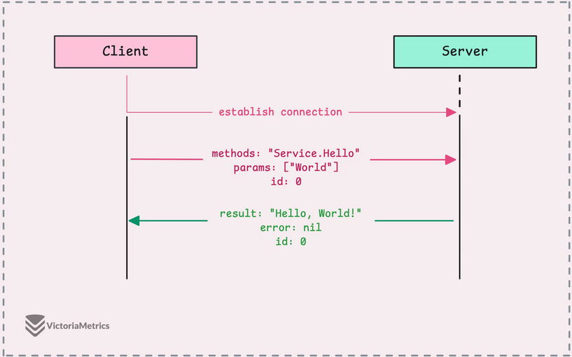

1. Клиент устанавливает TCP-соединение с сервером. `rpc.Dial` — аналог `net.Dial`, абстрагирующий низкоуровневую работу с сокетами.
2. Клиент формирует **запрос**: имя сервиса, имя метода, аргументы. Всё упаковывается в gob. Запросу присваивается **порядковый номер** (последовательное число, увеличивающееся с каждым запросом).
3. Одно TCP-соединение остаётся открытым для множества запросов.

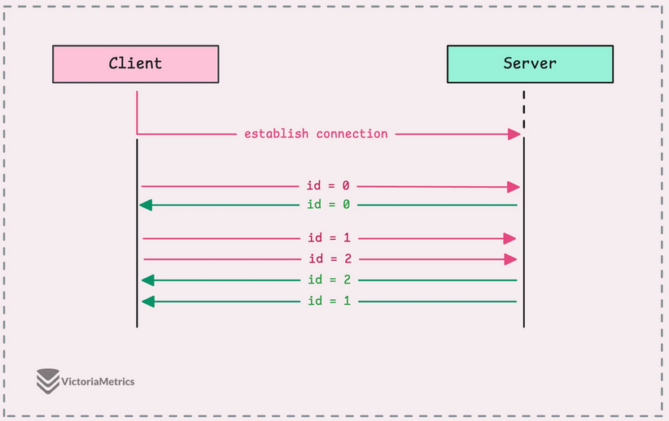

При параллельной отправке нескольких запросов ответы могут приходить в любом порядке. Порядковый номер гарантирует соответствие ответа запросу.

### Обработка на сервере

Сервер декодирует запрос, определяет сервис и метод, проверяет реестр зарегистрированных сервисов и запускает горутину для обработки.

Активно используется **рефлексия (reflection)** — механизм, позволяющий программе анализировать свою структуру и изменять поведение во время выполнения. Рефлексия задействована при регистрации сервиса, создании типов аргументов и вызове метода. Это одна из причин, почему gRPC с предварительно сгенерированным кодом производительнее `net/rpc`.

После выполнения метода сервер кодирует результат и ошибку через кодек (gob по умолчанию) и отправляет обратно по тому же соединению.

### JSON-кодек

`net/rpc` поддерживает замену кодека, включая встроенный JSON:

```go
// Server
go rpc.ServeCodec(jsonrpc.NewServerCodec(conn))

// Client
conn, _ := net.Dial("tcp", "localhost:8080")
defer conn.Close()
client := rpc.NewClientWithCodec(jsonrpc.NewClientCodec(conn))
```

`rpc.ServeCodec` позволяет указать собственный кодек — в данном случае JSON. Пример запроса:

```
{
  "method": "Service.Hello", "params": ["World"], "id": {}
}
```

Пример ответа:

```
{
  "id": 0,
  "result": "Hello, World!",
  "error": null
}
```

Пример ошибки (несуществующий метод):

```
{
    "id": 0,
    "result": null,
    "error": "rpc: can't find service Service.HelloFake"
}
```

> **Зачем это Go-разработчику.** `net/rpc` — компактный способ понять идею RPC без внешних зависимостей. Понимание сигнатуры RPC-метода (два аргумента, error) полезно, так как gRPC наследует эту модель. В production-проектах `net/rpc` практически не используется — для современных приложений gRPC является стандартным выбором.

***

## Глоссарий

| Термин             | Определение                                                                         |
| ------------------ | ----------------------------------------------------------------------------------- |
| **RPC**            | Remote Procedure Call — вызов удалённой функции, выглядящий как локальный           |
| **Protobuf**       | Protocol Buffers — формат сериализации и язык описания контракта от Google          |
| **gRPC**           | Google Remote Procedure Call — RPC-фреймворк на базе Protobuf и HTTP/2              |
| **HTTP/2**         | Вторая версия HTTP с мультиплексированием, сжатием заголовков и бинарным протоколом |
| **Фрейм**          | Минимальная единица обмена в HTTP/2: 9-байтовый заголовок + полезная нагрузка       |
| **Поток (stream)** | Независимая двунаправленная последовательность фреймов внутри HTTP/2-соединения     |
| **HoL**            | Head-of-Line blocking — блокировка очереди запросов из-за задержки одного           |
| **HPACK**          | Алгоритм сжатия заголовков в HTTP/2                                                 |
| **Метаданные**     | Пары ключ-значение, передаваемые в HTTP/2-заголовках отдельно от protobuf-сообщений |
| **Стриминг**       | Передача множества сообщений по одному RPC-соединению                               |
| **Перехватчик**    | Функция-обёртка над RPC-вызовом (аналог middleware)                                 |
| **Deadline**       | Момент времени, после которого RPC-вызов автоматически отменяется                   |

***

## Заключение

Документ провёл читателя по всем уровням gRPC: от базовых понятий (контракт, Protobuf) через устройство транспортного протокола (HTTP/2, фреймы, HPACK) до практической реализации на Go (генерация кода, сервер, клиент, метаданные, стриминг, перехватчики, обработка ошибок).

Дальнейшие темы для изучения:

* **gRPC-gateway** — автоматическая генерация REST-прокси для gRPC-сервисов.
* **Load balancing** — client-side и server-side балансировка в gRPC.
* **Service mesh** — Istio/Linkerd для управления gRPC-трафиком.
* **Буферизация и flow control** — настройка размера сообщений и окон HTTP/2 для оптимизации пропускной способности.

***

## Материалы для дальнейшего изучения

* [Go net/rpc](https://victoriametrics.com/blog/go-net-rpc/)
* [Go HTTP/2](https://victoriametrics.com/blog/go-http2/)
* [Go Protobuf basics](https://victoriametrics.com/blog/go-protobuf-basic/)
* [Go Protobuf advanced](https://victoriametrics.com/blog/go-protobuf/)
* [Go gRPC: basics, streaming, interceptors](https://victoriametrics.com/blog/go-grpc-basic-streaming-interceptor/)
