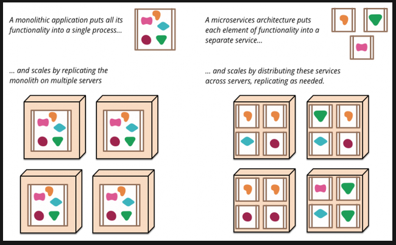
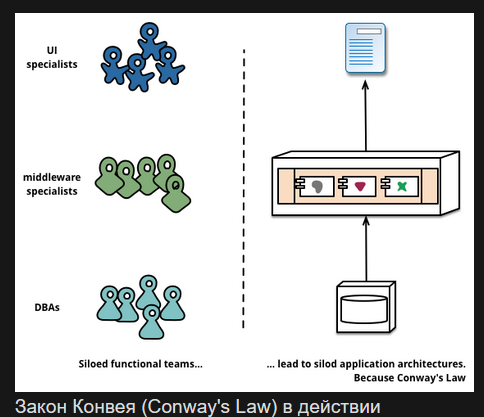
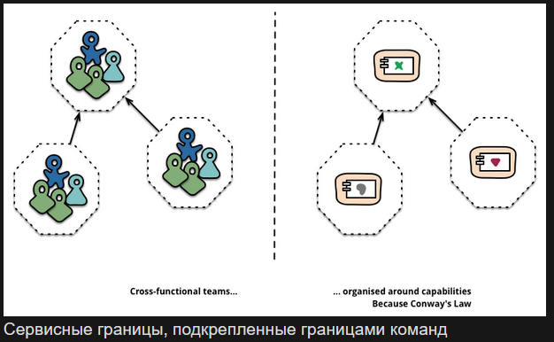
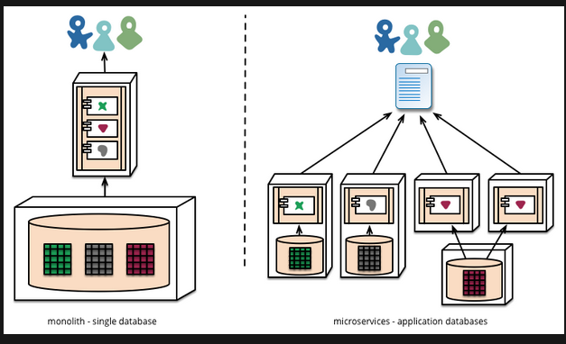
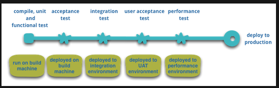
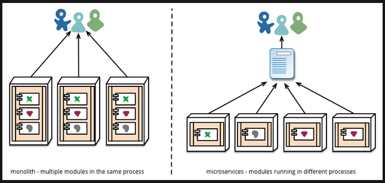

# Микросервисная архитектура (MSA)

***

## 1. Определение микросервисной архитектуры

**MSA, или микросервисная архитектура**, — это подход, при котором
единое приложение строится как набор небольших сервисов, каждый из
которых работает в собственном процессе и взаимодействует с остальными
через легковесные механизмы, как правило HTTP. Эти сервисы построены
вокруг бизнес-потребностей и развертываются независимо с использованием
полностью автоматизированной среды. Централизованное управление этими
сервисами сведено к абсолютному минимуму. Сами сервисы могут быть
написаны на разных языках и использовать разные технологии хранения
данных.

Для понимания микросервисного стиля удобно сравнить его с
**монолитом (monolithic style)** — приложением, построенным как единое
целое. Корпоративные приложения часто включают три основные части:
**пользовательский интерфейс** (как правило, HTML-страницы и JavaScript),
**база данных** (обычно реляционная, со множеством таблиц) и
**серверная часть**. Сервер обрабатывает HTTP-запросы, выполняет доменную
логику, запрашивает и обновляет данные в БД, формирует HTML-страницы и
отправляет их браузеру клиента. Любое изменение в системе приводит к
пересборке и развертыванию новой версии серверной части целиком.

**Монолитный сервер** — естественный способ построения подобных систем.
Вся логика обработки запросов выполняется в единственном процессе, и вы
можете использовать возможности языка программирования для разделения
приложения на классы, функции и пространства имён. Монолит легко
запускать и тестировать на машине разработчика, а стандартный процесс
развертывания позволяет проверять изменения перед выкаткой в продакшен.
Горизонтальное масштабирование достигается запуском нескольких экземпляров
за балансировщиком нагрузки.

Монолитная архитектура подразумевает объединение всех функциональных
модулей приложения в единый исполняемый процесс или развертываемый
артефакт. Вся бизнес-логика — обработка пользователей, управление
каталогом, расчёт платежей — существует в рамках одной кодовой базы и
взаимодействует через вызовы в общей памяти одного процесса.

По мере роста функциональности кодовая база монолита неизбежно
усложняется. Высокая связность компонентов приводит к тому, что
изменение в одном модуле может вызывать непредвиденные побочные эффекты
в других, часто логически не связанных с ним. Это снижает
предсказуемость системы и требует всё более объемного регрессионного
тестирования перед каждым релизом.

Процесс разработки и развертывания становится громоздким. Над разными
частями монолита могут работать разные команды, но их работа
пересекается в общем репозитории и общем процессе сборки. Для выпуска
обновления необходимо синхронизировать изменения всех команд и
пересобрать приложение целиком, что увеличивает время цикла разработки
и порождает конфликты при слиянии кода.

Масштабирование монолита происходит только целиком. При росте нагрузки
на определенную функцию (например, на каталог товаров) невозможно
масштабировать только этот компонент. Приходится развертывать
дополнительные экземпляры всего приложения, что приводит к
неэффективному использованию ресурсов: вычислительные мощности
выделяются в том числе для модулей, не испытывающих нагрузки.

Кроме того, монолит жестко привязывает разработку к одному
технологическому стеку. Все новые функции вынуждены использовать те же
языки программирования, фреймворки и библиотеки, что и исходный код,
даже если для конкретной задачи существует более подходящее решение.
Это ограничивает технологическое развитие проекта и затрудняет
внедрение современных инструментов.

Перечисленные проблемы монолита привели к архитектурному стилю
микросервисов: построению приложений в виде набора независимых сервисов.
Помимо возможности независимого развертывания и масштабирования, каждый
сервис получает четкую физическую границу, позволяющую писать разные
сервисы на разных языках и разными командами.

Формального определения микросервисного стиля не существует, но можно
выделить общие характеристики, присущие большинству таких систем. Не все
они встречаются одновременно, но типичное микросервисное приложение
обладает большинством из них.

> **Зачем это Go-разработчику.** Понимание структуры монолита и его
> ограничений — отправная точка для осмысленного перехода к
> микросервисам. Не каждый проект требует MSA, и разработчик должен
> уметь аргументировать выбор архитектуры.

***

## 2. Компоненты и сервисы

**Компонент** — единица программного обеспечения, которая может быть
независимо заменена или обновлена. Архитектура микросервисов использует
библиотеки, но основной способ разбиения — **деление приложения на
сервисы**. Библиотеки подключаются к программе и вызываются в том же
процессе, сервисы же выполняются в отдельных процессах и взаимодействуют
через веб-запросы или **remote procedure call (RPC)**.

Главная причина использования сервисов вместо библиотек —
**независимое развертывание**. Если приложение состоит из библиотек в
одном процессе, любое изменение требует переразвертывания всего
приложения. В микросервисной архитектуре переразвертывается только
изменившийся сервис. Изменения, затрагивающие интерфейсы, потребуют
координации, но цель хорошей архитектуры — минимизировать эту
необходимость через правильные границы сервисов и эволюцию контрактов.

Другое следствие использования сервисов как компонентов — более явный
интерфейс. Большинство языков не имеют хорошего механизма для объявления
Published Interface, и только документация и дисциплина предотвращают
нарушение инкапсуляции. Сервисы решают эту проблему через явный механизм
удаленных вызовов.

Однако у сервисного подхода есть недостатки. Удаленные вызовы медленнее
внутрипроцессных, поэтому API должен быть менее детализированным
(coarser-grained). Изменение распределения ответственностей между
компонентами усложняется необходимостью пересекать границы процессов.

В простейшем случае один сервис соответствует одному процессу, но сервис
может содержать несколько процессов, разрабатываемых и развертываемых
совместно — например, процесс приложения и процесс базы данных,
используемой только этим приложением.

> **Зачем это Go-разработчику.** В Go граница сервиса часто совпадает с
> границей одного бинарника. Правильное определение сервисных границ —
> ключевой навык: слишком мелкое дробление ведет к избыточным сетевым
> вызовам, слишком крупное — к монолиту в миниатюре.

***

## 3. Организация вокруг бизнес-потребностей

Когда большое приложение разбивается на части, часто менеджмент
фокусируется на технологиях, что приводит к образованию UI команды,
серверной команды и БД команды. Когда команды разбиты подобным образом,
даже небольшие изменения отнимают много времени из-за необходимости
кросс-командного взаимодействия. Это приводит к тому, что команды
размещают любую логику на тех слоях, к которым имеют доступ. Закон
Конвея (Conway's Law) в действии.

«Любая организация, которая проектирует какую-то систему (в широком
смысле) получит дизайн, чья структура копирует структуру команд в этой
организации»

— Melvyn Conway, 1967

Микросервисный подход к разбиению подразумевает разбиение на сервисы в
соответствии с **потребностями бизнеса**. Такие сервисы включают в себя
полный набор технологий, необходимых для этой бизнес-потребности, в том
числе пользовательский интерфейс, хранилище данных и любые внешние
взаимодействия. Это приводит к формированию кросс-функциональных команд,
имеющих полный набор необходимых навыков: user-experience, базы данных и
project management.

Крупные монолитные приложения тоже могут быть разбиты на модули вокруг
бизнес-потребностей, хотя на практике это происходит редко. Основная
проблема в том, что монолит, охватывающий множество бизнес-контекстов,
становится слишком большим для эффективной работы отдельных разработчиков.
Соблюдение модульных границ в монолите требует значительной дисциплины,
тогда как в микросервисах границы навязываются физически — на уровне
процессов.

> **Зачем это Go-разработчику.** Организация команды вокруг бизнес-доменов
> напрямую влияет на структуру кода. В Go это выражается в разбиении на
> отдельные сервисы с собственными `main.go`, каждый из которых
> соответствует одному Bounded Context.

***

## 4. Размер микросервиса

Хотя термин «микросервис» провоцирует споры о значении приставки
«микро», размер не является определяющей характеристикой. Наиболее
распространенный критерий: сервис должен быть настолько мал, чтобы
полностью «уместиться в голове разработчика», — независимо от
количества строк кода.

> **Зачем это Go-разработчику.** Организация команды вокруг бизнес-доменов напрямую влияет на структуру кода. В Go это выражается в разбиении на отдельные сервисы с собственными main.go, каждый из которых соответствует одному Bounded Context, то есть чётко ограниченной смысловой области внутри предметной области, где термины и правила имеют однозначное значение и не смешиваются с другими контекстами.

***

## 5. Продукты, а не проекты

Традиционная проектная модель предполагает, что команда разрабатывает
функциональность, передаёт её в поддержку и распускается. Микросервисный
подход заменяет это моделью продукта: **команда владеет сервисом на
протяжении всего его жизненного цикла**.

Этот принцип, популяризированный Amazon («вы разработали — вам и
поддерживать»), означает, что разработчики несут полную ответственность
за поведение сервиса в продакшене, регулярно наблюдают за его работой и
контактируют с пользователями.

Продуктовое мышление устанавливает прямую связь с потребностями бизнеса.
Продукт — это не набор реализованных фич, а непрерывные отношения с
пользователями, цель которых — расширение их бизнес-возможностей.

Высокая гранулярность микросервисов упрощает формирование персональной
ответственности разработчиков за свой сервис и его пользователей.

> **Зачем это Go-разработчику.** Модель «you build it, you run it»
> означает, что Go-разработчик должен уметь не только писать код, но и
> настраивать мониторинг, алерты и разбираться в продакшен-инцидентах
> своего сервиса.

***

## 6. Умные конечные точки и глупые каналы (Smart Endpoints, Dumb Pipes)

**Принцип Smart Endpoints, Dumb Pipes** утверждает, что вся
бизнес-логика должна находиться в самих сервисах, а каналы связи (HTTP,
очереди сообщений) — быть максимально простыми и не содержать никакой
логики маршрутизации или трансформации.

Исторический антипод этого принципа — **Enterprise Service Bus (ESB)**.
ESB-продукты помещали в канал передачи существенную часть логики:
маршрутизацию, оркестровку, трансформацию сообщений и даже применение
бизнес-правил. Это делало шину критическим компонентом, единой точкой
отказа и узким местом.

Микросервисный подход возвращается к Unix-философии: сервисы получают
запросы, применяют доменную логику и возвращают ответ — как фильтры в
конвейере. Приложения стремятся быть максимально **независимыми
(decoupled) и сфокусированными (cohesive)**. Вместо тяжелых протоколов
типа WS-\* или BPEL используются простые REST-протоколы.

Два основных инструмента коммуникации:

* **HTTP-запросы через API ресурсов** — синхронное взаимодействие по
  модели запрос-ответ. Часто запрашиваемые ресурсы легко кешируются.
* **Легковесная шина сообщений** (RabbitMQ, NATS, Kafka) —
  асинхронная фабрика, не содержащая доменной логики. Вся логика
  находится на концах шины — в отправляющих и принимающих сервисах.

При переходе от монолита к микросервисам главная ловушка — наивное
портирование внутрипроцессных вызовов методов в сетевые. Это порождает
избыточные (chatty) коммуникации. Необходимо укрупнять API и сокращать
количество межсервисных вызовов.

> **Зачем это Go-разработчику.** В Go типичный микросервис — это
> HTTP-сервер на `net/http` или gRPC-обработчик, взаимодействующий с
> соседними сервисами напрямую. Никакой «умной шины» между ними.
> Принцип напрямую связан с `database per service` и асинхронным обменом
> сообщениями (см. секцию 14).

***

## 7. Децентрализованное управление

Централизованное управление ведет к стандартизации платформ, что
ограничивает выбор инструментов. Микросервисный подход исходит из того,
что не всякая проблема — гвоздь, и не всякое решение — молоток:
для каждой задачи выбирается подходящий инструмент. Хотя монолиты тоже
могут использовать несколько языков, на практике это редкость.

Разбиение системы на независимые сервисы дает **возможность выбора**
технологий для каждой конкретной задачи.

Микросервисные команды предпочитают иной подход к стандартизации: вместо
предопределенных стандартов они создают полезные инструменты, извлеченные
из кода реальных проектов, и распространяют их между командами по модели
внутреннего open-source. С распространением Git и GitHub open-source
практики становятся стандартом и во внутренних проектах.

Микросервисное сообщество ценит сервисные контракты, но избегает
избыточных накладных расходов. Паттерны **Tolerant Reader** и
**Consumer-Driven Contracts** позволяют сервисам эволюционировать
независимо, а проверка контрактов на этапе сборки повышает уверенность
в корректной работе системы.

> **Зачем это Go-разработчику.** В Go-проектах внутренний open-source
> означает выделение общих библиотек (логирование, трассировка,
> middlewares) в отдельные модули, подключаемые через `go get` из
> внутреннего Git-репозитория.

***

## 8. Микросервисы и SOA

Закономерный вопрос: не является ли MSA тем же **Service Oriented
Architecture (SOA)**, которое продвигалось десять лет назад? Стиль
микросервисов действительно близок к тому, что предлагали некоторые
сторонники SOA. Проблема в том, что термин SOA приобрёл слишком много
значений, и на практике «SOA» обычно означает нечто иное — с
чрезмерным фокусом на ESB для интеграции монолитных приложений.

Множество провальных реализаций SOA — от сокрытия сложности за ESB до
многолетних инициатив, стоивших миллионы долларов без ощутимой пользы,
— сделали термин токсичным. При этом многие практики микросервисов
выросли из опыта интеграции сервисов в крупных организациях: Tolerant
Reader, простые протоколы — всё это реакция на избыточную сложность
централизованных стандартов SOA.

Одни сторонники микросервисов отвергают термин SOA, другие считают MSA
правильной реализацией SOA. В любом случае, размытость термина SOA
делает полезным отдельное название для этого архитектурного стиля.

> **Зачем это Go-разработчику.** Знание истории SOA помогает избежать
> повторения ошибок: никаких «умных шин», только простые протоколы
> (HTTP/gRPC) и легковесные брокеры (NATS, RabbitMQ). Go с его
> философией простоты — естественный выбор для такого подхода.

***

## 9. Децентрализованное управление данными

Децентрализация данных означает, что концептуальная модель мира у разных
систем различается. Это стандартная проблема интеграции: понятие
«Клиент» у отдела продаж отличается от того же понятия у техподдержки.
Атрибуты могут присутствовать в одном контексте и отсутствовать в
другом, а одинаково названные атрибуты — иметь разный смысл.

Эта проблема решается понятием **Bounded Context из Domain-Driven Design
(DDD)**. DDD делит сложную предметную область на изолированные контексты
с четкими связями между ними. Подход полезен и для монолитов, и для
микросервисов, но между сервисами и контекстами существует естественная
связь: границы сервисов помогают поддерживать границы контекстов.

Микросервисы также децентрализуют способы хранения данных. Вместо единой
БД для всего приложения каждый сервис управляет собственной базой
данных: это могут быть как отдельные экземпляры общей СУБД, так и
разные типы хранилищ. Такой подход называется **Polyglot Persistence**.
В монолитах он тоже возможен, но в микросервисах встречается чаще.

Децентрализация данных влияет на способ их изменения. Монолиты
используют ACID-транзакции для согласованности данных на нескольких
ресурсах. Этот подход гарантирует консистентность, но создает
**временную зависимость (temporal coupling)**, проблемную при работе с
множеством сервисов. Распределенные транзакции чрезвычайно сложны в
реализации, поэтому микросервисная архитектура делает ставку на
**итоговую согласованность (eventual consistency)** и компенсирующие
операции.

Управление несогласованностями через компенсацию — вызов для команд,
но это соответствует бизнес-практикам: компании часто предпочитают
быструю реакцию на действия пользователя с возможностью отмены, если
стоимость исправления ошибки ниже стоимости потерь от медленных, но
строго согласованных процессов.

> **Зачем это Go-разработчику.** В Go-микросервисе каждый сервис
> подключается к своей БД через `database/sql` или драйвер (PostgreSQL,
> MongoDB, Redis). Никаких общих схем и `JOIN` через сервисы. Паттерн
> Saga и eventual consistency — необходимые инструменты при
> распределенных операциях.

***

## 10. Проверенные стандарты против навязанных

Команды, использующие микросервисную архитектуру, избегают жестких
стандартов, навязанных группами корпоративных архитекторов, и отдают
предпочтение открытым стандартам (HTTP, ATOM, gRPC).

Ключевое различие — в способе разработки и принятия стандартов.
Стандарты, управляемые организациями вроде IETF, принимаются только
после появления нескольких успешных реализаций в open-source проектах.
Корпоративные же стандарты часто разрабатываются людьми с недостаточным
опытом реальной разработки или под сильным влиянием вендоров.

> **Зачем это Go-разработчику.** Go-экосистема построена на открытых
> стандартах: `net/http` для HTTP, gRPC для RPC, OpenTelemetry для
> трассировки. Выбор проверенных стандартов вместо корпоративных
> фреймворков снижает vendor lock-in.

***

## 11. Автоматизация инфраструктуры

**Автоматизация инфраструктуры** — это прежде всего CI/CD. При
пятидесяти сервисах ручное развертывание невозможно: настраивается
конвейер «запушил код в Git → сервер собрал бинарник → сервер
перезапустил сервис».

Развитие облачных технологий, особенно AWS, существенно снизило
операционную сложность построения и функционирования микросервисов.
Команды с опытом в **Continuous Delivery и Continuous Integration**
интенсивно используют автоматизацию на всех этапах.

Автоматические тесты запускаются на каждом шаге, а приложение
разворачивается в отдельной среде через **автоматизированное
развертывание (automated deployment)**.

После инвестиций в автоматизацию развертывания разница между одним
монолитом и десятком сервисов стирается: цель Continuous Delivery —
сделать развертывание рутинным, независимо от количества компонентов.

Другая область интенсивной автоматизации — управление микросервисами в
продакшене. В отличие от развертывания, которое у монолитов и
микросервисов в итоге выравнивается, способ функционирования
существенно различается.

Побочный эффект автоматизации — удобные инструменты для разработчиков
и администраторов: управление кодом, развертывание сервисов, мониторинг
и логирование становятся стандартной практикой.

> **Зачем это Go-разработчику.** Go-бинарник — статически
> скомпилированный файл, который тривиально упаковывается в Docker-образ
> (`FROM scratch`). Стандартный CI/CD-конвейер для Go: `go test` →
> `go build` → `docker build` → `kubectl apply`. Никаких рантаймов и
> зависимостей на целевой машине.

***

## 12. Проектирование под отказ (Design for Failure)

В MSA ошибка — это не вопрос «если», а вопрос «когда». Код должен
корректно обрабатывать недоступность соседнего сервиса: возвращать
«сервис временно недоступен» или брать данные из кеша, а не падать.

Использование сервисов как компонентов требует, чтобы приложение
продолжало работу при отказе отдельных частей. Любой вызов к сервису
может завершиться ошибкой из-за его недоступности — клиент обязан
реагировать на это максимально терпимо. Это добавляет сложности по
сравнению с монолитом.

Поскольку сервисы могут отказать в любой момент, критически важны
быстрое обнаружение неполадок и, где возможно, автоматическое
восстановление. Микросервисная архитектура делает акцент на мониторинге
в реальном времени: отслеживаются как технические метрики (запросов в
секунду к БД), так и бизнес-метрики (заказов в минуту). Семантический
мониторинг служит системой раннего предупреждения.

Мониторинг особенно важен в микросервисах, потому что разбиение на
отдельные процессы и событийная коммуникация порождают неожиданное
поведение. Монолиты тоже должны быть прозрачными, но в микросервисах
знать о нарушениях взаимодействия между процессами намного критичнее.

Микросервисные команды создают развитые системы мониторинга и
логирования для каждого сервиса: консоли со статусом (онлайн/оффлайн),
пропускной способностью, временем обработки запросов.

> **Зачем это Go-разработчику.** В Go паттерны отказоустойчивости —
> это context.Context для таймаутов, `circuitbreaker`-библиотеки,
> retry с exponential backoff. Стандартный подход: оборачивать каждый
> внешний вызов в timeout через `context.WithTimeout`.

***

## 13. Опасность синхронных цепочек вызовов

Каждый набор синхронных вызовов между сервисами порождает эффект
**мультипликации времени простоя (downtime)**. Время недоступности
системы становится произведением времени недоступности отдельных
компонентов. Выбор: либо делать вызовы асинхронными, либо мириться с
простоями.

> **Зачем это Go-разработчику.** Длинные цепочки синхронных
> HTTP/gRPC-вызовов — главный источник хрупкости. Go-решение:
> асинхронная коммуникация через очереди (NATS, Kafka) и
> событийно-ориентированная архитектура.

***

## 14. Эволюционный дизайн

Микросервисная архитектура рассматривает декомпозицию как инструмент
контроля над изменениями: разработчики могут рефакторить приложение, не
замедляя процесс разработки. При правильном подходе возможны частые,
быстрые и хорошо контролируемые изменения.

Ключевой принцип разбиения: **компонент должен быть независимо заменяем
или обновляем**, вплоть до полного переписывания без влияния на соседей.
Многие команды явно планируют, что часть сервисов со временем будет
выброшена, а не эволюционирует.

Упор на заменяемость — частный случай модульного дизайна: модульность
определяется скоростью изменения. Вещи, меняющиеся вместе, должны
находиться в одном модуле. Редко изменяемые части не должны жить рядом
с быстро эволюционирующими. Если вы регулярно меняете два сервиса
одновременно — вероятно, их стоит объединить.

Вынос компонентов в сервисы дает **более гранулярное планирование
релизов**. В монолите любое изменение требует полной пересборки и
развертывания. В микросервисах переразвертываются только изменившиеся
сервисы, что упрощает и ускоряет релизы. Недостаток — риск сломать
потребителей изменившегося сервиса. Вместо версионирования, которое
используется только в крайнем случае, микросервисы полагаются на
толерантность потребителей к изменениям (Tolerant Reader).

> **Зачем это Go-разработчику.** В Go эволюционный дизайн означает
> обратную совместимость API: добавлять поля в gRPC/protobuf-сообщения
> можно, удалять или переименовывать — нет. Контракты проверяются на
> CI через `protolint` или `buf breaking`.

***

## 15. Основные паттерны MSA

### Service Registry (Реестр сервисов)

**Service Registry** — один из фундаментальных паттернов MSA, решающий
проблему динамических сетевых адресов. В микросервисной среде
(особенно с оркестраторами вроде Kubernetes) экземпляры сервисов
постоянно появляются и исчезают: сбои, балансировка, обновление версий
— каждое событие меняет IP-адрес. Жесткая привязка адресов в конфигах
потребовала бы бесконечных ручных обновлений.

Реестр сервисов действует как централизованный справочник: хранит
актуальную информацию о доступных экземплярах и их сетевых адресах.
Работа строится на двух процессах:

* **Регистрация:** при запуске сервис отправляет в Registry свое имя,
  IP, порт и метаданные (зона доступности, версия).
* **Обнаружение:** перед вызовом сервис-потребитель запрашивает у
  Registry список доступных экземпляров целевого сервиса и выбирает
  конкретный экземпляр (как правило, с client-side балансировкой).

Registry регулярно проверяет жизнеспособность зарегистрированных
экземпляров через health check-запросы и автоматически удаляет
переставшие отвечать. Это обеспечивает слабую связанность и
отказоустойчивость: клиенты не используют упавшие инстансы.

> **Go:** в Kubernetes-окружении роль Service Registry выполняет встроенный Service API; для развертываний на физических серверах используют Consul, etcd или библиотеки вроде `go-kit/sd`.

### API Gateway (API-шлюз)

**API Gateway** —  единая точка входа для всех внешних клиентов. Без
шлюза клиентскому приложению пришлось бы знать адреса десятков
микросервисов и выполнять множество запросов для отображения одной
страницы (сервис товаров, сервис отзывов, сервис корзины и т.д.). Это
создает избыточный сетевой трафик и тесно связывает клиента с внутренней
структурой системы.

API Gateway принимает запрос от клиента, маршрутизирует его к нужному
микросервису и при необходимости агрегирует ответы нескольких сервисов
в один. Клиент не знает о внутренней структуре системы за шлюзом.

Помимо маршрутизации, шлюз является естественным местом для сквозной
(cross-cutting) функциональности:

* **Аутентификация и авторизация** — единая проверка JWT-токенов
  вместо дублирования в каждом сервисе.
* **Балансировка нагрузки** и **rate limiting** — защита от
  перегрузок и DDoS-атак.
* **Протокольная трансляция** — внешние клиенты работают по
  HTTP/JSON, внутренние сервисы — по gRPC; шлюз преобразует запросы.

Популярные реализации: Kong (на базе Nginx, богатая экосистема
плагинов), Traefik (тесная интеграция с Kubernetes). API Gateway должен
быть высокодоступным — его недоступность означает недоступность всей
системы для внешних клиентов.

> **Go:** собственный API Gateway на Go часто пишут с использованием
> `net/http` + `httputil.ReverseProxy`; для продакшена чаще берут
> готовые решения (Kong, Envoy, Traefik).

### Circuit Breaker (Предохранитель)

**Circuit Breaker** предотвращает каскадные отказы. Когда один сервис
начинает тормозить или отвечать ошибками, клиенты зависают в ожидании
ответа, исчерпывая свои ресурсы (потоки, соединения). Эта цепная реакция
— каскадный отказ — может обрушить всю систему.

Предохранитель действует как конечный автомат с тремя состояниями:

* **Замкнут (Closed):** штатный режим, запросы проходят к целевому
  сервису, счетчик ошибок накапливается.
* **Разомкнут (Open):** при превышении порога ошибок вызовы к сервису
  немедленно прерываются с ошибкой или fallback-ответом, не тратя
  ресурсы на заведомо безнадежные попытки.
* **Полуоткрыт (Half-Open):** через заданный таймаут пропускается
  ограниченное число пробных запросов. При успехе — переход в Closed,
  при неудаче — возврат в Open.

Тонкая настройка порогов срабатывания критична: слишком чувствительный
предохранитель отключает сервисы без необходимости, слишком инертный
пропускает каскадный сбой.

> **Go:** популярные реализации — `sony/gobreaker`, `afex/hystrix-go`,
> `cockroachdb/circuitbreaker`. Часто комбинируется с Retry.

### Bulkhead (Отсек)

**Bulkhead** изолирует ресурсы системы в независимые пулы, чтобы сбой
или перегрузка в одной части не привела к коллапсу остальных. Название
заимствовано из кораблестроения: переборки не дают затопить весь корабль
из-за пробоины в одном отсеке.

В микросервисах паттерн применяется на уровне потоков и соединений.
Если все вызовы используют общий пул, один «зависший» сервис исчерпает
его целиком, и здоровые сервисы станут недоступны. Решение: отдельные
пулы потоков для каждого внешнего сервиса или типа клиентов.

Тот же принцип применим к подключениям к БД: каждому сервису — свой
пул соединений. Реализация требует поддержки со стороны используемых
библиотек и фреймворков.

> **Go:** изоляция горутин — нативная возможность; паттерн реализуется
> через раздельные `http.Client` с разными пулами соединений или через
> каналы как семафоры для ограничения конкурентных запросов к сервису.

### Saga (Сага)

**Saga** реализует распределенную бизнес-транзакцию, охватывающую
несколько микросервисов, без использования распределенных транзакций
(2PC). Вместо одной большой ACID-транзакции Saga разбивает операцию на
последовательность локальных транзакций, каждая из которых фиксируется
в своей БД немедленно.

Шаги связаны через обмен сообщениями. Управление может быть
организовано двумя способами:

* **Хореография:** каждый сервис сам знает, какое событие публиковать
  дальше; сервисы слушают события друг друга.
* **Оркестрация:** выделенный координатор (orchestrator) указывает
  каждому сервису, что и когда делать.

Ключевая особенность — **компенсирующие транзакции** вместо отката.
Если на шаге N произошла ошибка, отменить предыдущие шаги через обычный
ROLLBACK нельзя (данные уже зафиксированы). Вместо этого запускаются
компенсирующие операции: списание денег компенсируется зачислением,
резервирование товара — снятием резерва. Компенсации должны быть
идемпотентными и надежными.

Saga принимает **итоговую согласованность** (eventual consistency):
система будет консистентной не мгновенно, а через некоторое время, и для
исправления ошибок нужны целенаправленные компенсирующие действия.

> **Go:** оркестрацию удобно реализовать через конечные автоматы;
> хореографию — через NATS/Kafka с гарантией доставки. Библиотеки:
> `temporalio/sdk-go` (Temporal), `uber/cadence-client`.

### Event Sourcing (Источник событий)

**Event Sourcing** меняет подход к хранению данных: вместо текущего
состояния объекта сохраняется **последовательность неизменяемых событий**,
которые к этому состоянию привели. Изменение имени пользователя — не
перезапись поля в БД, а новое событие «Пользователь изменил имя с X на
Y».

Текущее состояние вычисляется последовательным применением всех событий
от начала и до текущего момента. Это дает полную историю изменений для
аудита и расследования инцидентов.

Event Sourcing — идеальный фундамент для CQRS: события со стороны
записи направляются в шину данных для обновления читающих проекций.
Сложности: со временем накапливается огромное количество событий
(требуются снапшоты для ускорения загрузки), а эволюция структуры
событий требует обратной совместимости со всеми когда-либо
существовавшими версиями.

> **Go:** событие — обычно `interface{}` или строго типизированная
> структура; снапшоты — сериализованное состояние (protobuf/json).
> Библиотеки: `temporalio/sdk-go`, нативная реализация через
> `database/sql` с таблицей events.

### CQRS (Разделение команд и запросов)

**CQRS (Command Query Responsibility Segregation)** разделяет операции
чтения и записи на две разные модели, оптимизированные каждая под свою
задачу:

* **Модель команд** (запись) — принимает команды («Добавить товар в
  корзину», «Оформить заказ»), проверяет бизнес-правила, сохраняет
  результат. Не используется для чтения.
* **Модель запросов** (чтение) — оптимизирована под быструю выдачу
  данных в формате, удобном для UI. Хранит денормализованные проекции,
  собранные из нескольких агрегатов и сервисов.

Синхронизация между моделями обычно происходит через события: командная
модель публикует событие («Заказ оформлен»), обработчики на стороне
чтения обновляют свои проекции. Возникает итоговая согласованность:
между выполнением команды и доступностью обновленных данных для чтения
есть задержка (обычно миллисекунды).

Выигрыш в производительности и масштабируемости часто перевешивает этот
недостаток, особенно в системах с многократным преобладанием чтения над
записью. Модель чтения можно разместить в быстрой in-memory БД (Redis) и
реплицировать, в то время как командная модель остается в надежной
реляционной БД.

> **Go:** команды — типизированные структуры, обработчики — методы
> с проверкой бизнес-правил; проекции — отдельные таблицы/коллекции,
> заполняемые через подписку на события (NATS/Kafka).

### Data Sharding (Шардинг данных)

**Data Sharding** — стратегия горизонтального масштабирования БД:
данные делятся на независимые части (шарды) и распределяются по
нескольким серверам. Каждый шард — полноценная БД, отвечающая за свою
порцию данных.

Ключевое решение — **выбор ключа шардинга**: атрибута, по которому
определяется целевой шард. Например, в e-commerce данные пользователей
и их заказов шардируются по `user_id`, чтобы все данные одного
пользователя попадали на один шард.

В микросервисах шардинг применяется на двух уровнях:

* Внутри сервиса — для масштабирования его собственного хранилища.
* На уровне архитектуры — сам принцип «каждому сервису своя БД» можно
  рассматривать как шардинг по бизнес-функции.

Сложности: JOIN между шардами невозможен — агрегация переносится на
уровень приложения; изменение количества шардов требует перебалансировки
данных. Выбор правильной стратегии шардинга — одно из ключевых
архитектурных решений.

> **Go:** ключ шардинга вычисляется на уровне приложения
> (hash(user\_id) % shard\_count); для маршрутизации используют прокси
> вроде `vitess` или кастомные middleware.

### Polyglot Persistence (Многовариантное хранение)

**Polyglot Persistence** — выбор системы хранения данных под конкретную
задачу каждого микросервиса, а не единая БД для всего приложения.

* Сервис заказов (строгая схема, согласованность) → PostgreSQL.
* Сервис каталога (гибкая структура, быстрые чтения) → MongoDB.
* Сервис сессий (быстрые чтение/запись, TTL) → Redis.
* Сервис аналитики (агрегации по временным рядам) → ClickHouse.

Преимущества: оптимальная производительность для каждой задачи,
технологическая гибкость. Недостатки: усложнение инфраструктуры
(администрирование, мониторинг, бэкапы разных СУБД), сложность
аналитических запросов, объединяющих данные из разных хранилищ.

> **Go:** каждый сервис подключается к своей БД через соответствующий
> драйвер (`pgx`, `mongo-go-driver`, `go-redis`). Переключение
> хранилища для одного сервиса не затрагивает остальные.

### Retry (Повторная попытка)

**Retry** — простейший механизм повышения отказоустойчивости: многие
сетевые сбои носят временный характер (кратковременный разрыв, сборка
мусора у целевого сервиса), и повторная отправка запроса через короткий
промежуток часто решает проблему.

Паттерн реализуется как обертка вокруг операции: при временной ошибке
(таймаут, 503) она не пробрасывается наверх, а выполняется повторно.
Однако бесконечные мгновенные повторы только усугубят перегрузку,
поэтому Retry практически всегда сочетается с **exponential backoff**:
задержка между попытками растет экспоненциально (100 мс → 200 мс →
400 мс → ...).

Retry работает в паре с Circuit Breaker: Retry спасает при временных
сбоях, Circuit Breaker — при затяжных. Важнейшее требование —
**идемпотентность** повторяемой операции: двойное списание средств
недопустимо. Либо операция идемпотентна по природе, либо клиент
передает уникальный идентификатор запроса для дедупликации на сервере.

> **Go:** `cenkalti/backoff` для exponential backoff в связке с
> `context.WithTimeout`; на уровне gRPC —встроенный механизм retry
> в конфигурации service config.

### Sidecar (Вспомогательный сервис)

**Sidecar** — дополнительный контейнер или процесс, развертываемый
вместе с основным сервисом и разделяющий его жизненный цикл. Оба
контейнера запускаются и останавливаются вместе, разделяя сетевое
пространство (общение через localhost).

Назначение — вынос сквозной инфраструктурной функциональности из
бизнес-логики:

* Сбор и отправка логов в централизованную систему.
* Терминация TLS и проверка API-ключей (прозрачно для приложения).
* Подключение к service mesh (Istio/Linkerd) для управления трафиком.

Особую ценность Sidecar представляет в гетерогенных средах: один и тот
же sidecar-контейнер обеспечивает логирование, метрики и service
discovery для сервисов на Go, Python и Java, избавляя от дублирования
кода на каждом языке.

> **Go:** основной сервис пишет логи в stdout — Sidecar (например,
> Fluent Bit) подхватывает и отправляет в Elasticsearch/Loki.
> Стандартный паттерн в Kubernetes-подах.

### Backends for Frontends (BFF)

**BFF (Backends for Frontends)** — развитие идеи API Gateway:
создается отдельный бэкенд-сервис для каждого типа клиентского
интерфейса (мобильное приложение, веб, сторонние API). Каждый BFF знает
особенности своего клиента и адаптирует ответы внутренних микросервисов
под конкретный UI.

* BFF для мобильного приложения может агрегировать множество вызовов в
  один денормализованный JSON-ответ, экономя трафик.
* BFF для веб-приложения — тонкий прокси с аутентификацией.

Критическое ограничение: **BFF не должен содержать бизнес-логику**. Его
задача — быть адаптером между универсальными API микросервисов и
специфичными потребностями клиента.

> **Go:** BFF — обычный HTTP-сервер, агрегирующий ответы соседних
> сервисов. Часто используется с GraphQL (библиотека `graphql-go`)
> для гибкой выборки данных клиентом.

### Shadow Deployment (Теневое развертывание)

**Shadow Deployment** — тестирование новой версии сервиса на реальном
продакшен-трафике без влияния на пользователей. Параллельно со
стабильной версией разворачивается новая (теневая), и копия трафика
направляется на неё. Ответы теневой версии не возвращаются пользователю,
а логируются или сравниваются с ответами стабильной версии.

Это позволяет обнаружить проблемы, проявляющиеся только на реальном
трафике (странные краевые случаи, неожиданные комбинации параметров),
ещё до полноценного выката.

Требования к реализации: все побочные эффекты теневого трафика (запросы к
БД, вызовы других сервисов) должны быть изолированы, чтобы не изменить
реальные данные. Дублирование трафика удваивает нагрузку на
инфраструктуру.

> **Go:** реализуется на уровне service mesh (Istio) или кастомным
> `httputil.ReverseProxy`, дублирующим запросы на теневой инстанс.

### Consumer-Driven Contracts (Контракты, определяемые потребителем)

**Consumer-Driven Contracts** — подход, при котором не поставщик API
диктует формат, а потребители формально описывают свои ожидания от
сервиса-поставщика в виде контрактов (тестов).

Каждый потребитель пишет тесты, фиксирующие его требования: какие
запросы отправляются, какие поля ожидаются в ответе и в каком формате.
Эти контракты становятся частью CI/CD: при изменении API поставщик
прогоняет контракты всех потребителей. Если все прошли — изменения
обратно совместимы. Если какой-то контракт упал — поставщик немедленно
получает сигнал о несовместимости.

Этот подход заменяет хаотичное согласование в чатах на автоматизированную
проверку совместимости, значительно повышая надежность эволюции системы.

> **Go:** контракты реализуются через интеграционные тесты в CI; для
> gRPC — `buf breaking` проверяет обратную совместимость protobuf;
> для HTTP — pact-тесты через `pact-go`.

### Smart Endpoints, Dumb Pipes (Умные конечные точки и глупые каналы)

Фундаментальный принцип MSA, подробно рассмотренный в [секции 6](#6-умные-конечные-точки-и-глупые-каналы-smart-endpoints-dumb-pipes). Вся
бизнес-логика — в сервисах, каналы связи — максимально простые
(HTTP, легковесные брокеры). Никакой «умной шины».

### Database per Service (База данных для каждого сервиса)

**Database per Service** — один из основополагающих принципов MSA:
каждый микросервис владеет своим хранилищем данных эксклюзивно. Никакой
другой сервис не имеет прямого доступа к этой БД — ни на чтение, ни на
запись. Единственный способ получить или изменить данные — через
публичное API сервиса-владельца.

Преимущества:

* Автономность команд: изменение схемы, миграция на другую СУБД,
  оптимизация запросов — без оглядки на другие сервисы.
* Технологическая гибкость: выбор БД под задачу (реляционная для
  заказов, документная для каталога).

Недостатки:

* JOIN между таблицами разных сервисов невозможен на уровне БД —
  агрегация на уровне приложения или через CQRS.
* Распределенные ACID-транзакции недоступны — используется Saga с
  итоговой согласованностью.

> **Go:** каждый сервис подключается к своей БД через отдельный
> `*sql.DB`. Строгое правило: нет общих схем и нет прямых запросов к
> чужой БД.

### Async Messaging (Асинхронный обмен сообщениями)

**Async Messaging** — альтернативная модель коммуникации, разрывающая
жесткую временную связь между сервисами. В синхронном HTTP-мире сервис
A блокируется в ожидании ответа от сервиса B, и общее время равно сумме
времён всех участников цепочки.

В асинхронной модели сервис-отправитель публикует сообщение в очередь/
топик **брокера сообщений** (NATS, RabbitMQ, Kafka) и немедленно
продолжает работу. Брокер гарантирует доставку сообщения одному или
нескольким подписчикам, которые обрабатывают его в своем темпе.

Преимущества:

* **Отзывчивость:** сервисы не ждут друг друга.
* **Устойчивость к сбоям:** сообщения накапливаются в очереди и
  доставляются после восстановления получателя.
* **Масштабируемость:** добавление экземпляров потребителя увеличивает
  скорость разбора очереди.
* **Слабая связанность:** сервисы реагируют на события, не зная друг о
  друге напрямую.

Сложности: нелинейная модель взаимодействия, необходимость
распределенной трассировки, требование идемпотентности обработчиков
(сообщение может быть доставлено дважды).

> **Go:** основные брокеры — NATS (легковесный, Go-нативный), Kafka
> (через `segmentio/kafka-go` или `twmb/franz-go`). Асинхронный
> пайплайн удобно строить через каналы и горутины.

### Stateless Services (Сервисы без состояния)

**Stateless Services** — принцип проектирования, при котором каждый
экземпляр сервиса обрабатывает запрос изолированно, не храня в
локальной памяти информацию о предыдущих взаимодействиях с клиентом.
Всё необходимое (данные пользователя, контекст сессии) извлекается из
запроса или внешнего хранилища (БД, распределенный кеш).

Преимущества:

* **Горизонтальное масштабирование:** любой экземпляр может
  обработать любой запрос — достаточно запустить больше экземпляров
  за балансировщиком. Никаких sticky sessions.
* **Отказоустойчивость:** падение экземпляра не влияет на
  пользователей — балансировщик перенаправляет запросы на живые.
* **Простое обновление:** постепенная замена старых экземпляров
  новыми без потери состояния.

Полностью stateless могут быть только сервисы бизнес-логики. Сервисы,
работающие с БД, по определению имеют дело с состоянием, но само
состояние вынесено во внешние хранилища, а сервис остается
взаимозаменяемым и масштабируемым.

> **Go:** stateless-сервис на Go — HTTP-обработчик без глобального
> состояния; JWT-токен или заголовок запроса содержит всю необходимую
> информацию для обработки. Сессии и кеш — в Redis, а не в памяти
> процесса.

***

## 16. Когда микросервисы не нужны

Микросервисная архитектура — мощный, но не универсальный инструмент.
Преждевременный переход на MSA может создать больше проблем, чем решить.

**Признаки, что MSA пока не нужна:**

* **Ранняя стадия продукта.** На старте бизнес-логика и границы доменов
  ещё не устоялись. Разбиение на сервисы в этот момент приведет к
  постоянному пересмотру границ и дорогим миграциям данных между
  сервисами.
* **Небольшая команда (до 5–7 разработчиков).** Накладные расходы на
  инфраструктуру, CI/CD, мониторинг и отладку распределенной системы
  превышают выгоды от независимости сервисов.
* **Отсутствие опыта эксплуатации.** Если команда никогда не работала с
  контейнерами, оркестрацией, распределенной трассировкой — MSA
  умножит проблемы.
* **Низкие требования к масштабированию.** Если монолит справляется с
  нагрузкой, а рост не прогнозируется взрывным — усложнять систему
  неоправданно.

**Разумная стратегия: «монолит сначала» (Monolith First):**

* Начать с хорошо структурированного модульного монолита.
* Выделить Bounded Contexts внутри монолита (пакеты/модули, а не
  сетевые вызовы).
* Выносить модули в отдельные сервисы только при появлении конкретных
  проблем: независимое масштабирование, разные скорости разработки
  разными командами, потребность в разных технологических стеках.

> **Зачем это Go-разработчику.** В Go модульный монолит реализуется
> через отдельные пакеты с четкими интерфейсами. Когда приходит время
> выделять сервис, `internal/` пакет выносится в отдельный `main.go` с
> HTTP/gRPC-интерфейсом, а вызовы в процессе заменяются на сетевые.
> Начинать с микросервисов на старте проекта — самая частая
> архитектурная ошибка в Go-комьюнити.

***

## 17. Заключение

Микросервисная архитектура — не серебряная пуля, а набор компромиссов.
Она даёт независимость развертывания, технологическую гибкость и
устойчивость к отказам ценой роста операционной сложности,
распределенных системных проблем и необходимости зрелой инфраструктуры.

**Ключевые выводы:**

* Разбиение должно идти по бизнес-границам (Bounded Contexts), а не по
  техническим слоям.
* Каждый сервис — продукт, за который команда отвечает от разработки
  до эксплуатации.
* Данные децентрализованы: каждый сервис владеет своей БД; строгая
  консистентность заменяется итоговой с компенсирующими операциями.
* Коммуникация — через простые протоколы (HTTP/gRPC) и легковесные
  брокеры, без «умных» промежуточных слоев.
* Отказ отдельных сервисов — норма, система должна быть спроектирована
  с учетом этого (Circuit Breaker, Retry, Bulkhead, Stateless-сервисы).
* Автоматизация (CI/CD, контейнеризация, оркестрация) — не
  опциональная, а обязательная часть MSA.

**Что изучать дальше:**

* **Domain-Driven Design** — для правильного выделения Bounded
  Contexts и агрегатов.
* **Kubernetes** — стандарт оркестрации контейнеров.
* **Service Mesh (Istio, Linkerd)** — управление трафиком,
  наблюдаемость и безопасность на уровне инфраструктуры.
* **OpenTelemetry** — единый стандарт распределенной трассировки,
  метрик и логов.
* **Go-инструменты для MSA:** `go-kit` и `go-micro` (микросервисные
  фреймворки), `connectrpc` (gRPC-совместимый HTTP-фреймворк),
  `watermill` (событийно-ориентированные пайплайны).

***

## Ссылки

* [Martin Fowler — Microservices (русский
  перевод)](https://habr.com/ru/articles/249183/) — оригинальная
  статья, вокруг которой построены первые девять секций документа.
* [18 основных паттернов микросервисной
  архитектуры](https://proglib.io/p/18-osnovnyh-patternov-mikroservisnoy-arhitektury-2024-07-23)
  — источник описания паттернов.
