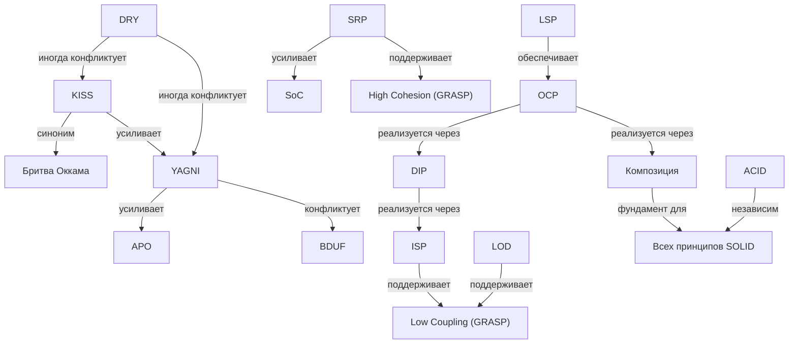

# Основные принципы разработки

## Введение

**Принципы проектирования** — это не жёсткие правила, а накопленный индустрией опыт, упакованный в краткие формулировки. Их цель — снизить **стоимость изменений** (cost of change) на всём жизненном цикле программы. Код, написанный без оглядки на принципы, работает до первой серьёзной правки, после которой начинается лавинообразный рост сложности.

Каждый принцип в этом документе решает конкретную проблему: одни помогают организовать код так, чтобы его не ломали изменения в соседнем модуле; другие удерживают от добавления ненужной функциональности; третьи защищают целостность данных.

***

## 1. SOLID — Принципы объектно-ориентированного дизайна

**SOLID** — это аббревиатура, представляющая собой пять основных принципов объектно-ориентированного программирования и проектирования. Эти принципы были сформулированы **Робертом Мартином (Uncle Bob)** и стали стандартом в индустрии программной разработки.

История SOLID началась с публикации Мартином книги «Объектно-ориентированный анализ и проектирование с примерами приложений» в 2000 году. С тех пор SOLID стал широко распространённым набором принципов, который используется для повышения качества и надёжности кода.

> **Зачем это Go-разработчику.** SOLID применим к Go, несмотря на отсутствие классических классов. Роль «класса» выполняют **структуры с методами** и **интерфейсы**. Каждый принцип ниже переосмыслен именно в Go-контексте.

### S — Принцип единственной ответственности (SRP)

**Принцип единственной ответственности (SRP, Single Responsibility Principle)** утверждает, что каждый объект должен иметь одну и только одну причину для изменения, то есть быть ответственным ровно за одну задачу.

Разбор названия:

* **S — Single (Единственная):** один объект отвечает только за один аспект функциональности программы.
* **R — Responsibility (Ответственность):** каждый объект несёт ровно одну обязанность.

**Контекст Go.** В Go SRP естественно выражается через разделение на **пакеты**. Хороший пакет делает ровно одну вещь: `net/http` обслуживает HTTP, но не лезет в JSON-сериализацию — для этого есть `encoding/json`. На уровне структур SRP означает, что `UserService` не должен одновременно ходить в базу, валидировать email и отправлять приветственное письмо.

**Плюсы и минусы**

Плюсы:

* Улучшение читаемости и понимаемости кода.
* Уменьшение связанности между классами.
* Упрощение тестирования и отладки.

Минусы:

* Возможное увеличение количества типов и интерфейсов.
* Не всегда явно определяется, что именно является «одной обязанностью».

> **Зачем это Go-разработчику.** Если ваш пакет называется `utils` или `helpers` — скорее всего, SRP нарушен. В Go приняты узкие, целенаправленные пакеты. При рефакторинге дробите пакет, как только замечаете, что он делает больше одной вещи.

### O — Принцип открытости/закрытости (OCP)

**Принцип открытости/закрытости (OCP, Open/Closed Principle)** сформулирован **Бертраном Майером**. Он утверждает, что программные сущности (классы, модули, функции) должны быть открыты для расширения, но закрыты для модификации. Новый функционал добавляется **расширением**, а не изменением существующего кода.

Разбор названия:

* **O — Open (Открытость):** сущность готова принять новое поведение.
* **C — Closed (Закрытость):** существующий, отлаженный код не трогают.

**Контекст Go.** Главный механизм OCP в Go — **интерфейсы**. Вы пишете функцию, которая принимает `io.Reader`, а не `*os.File`. Когда появляется новый источник данных (сеть, буфер, bytes.Buffer), вы просто реализуете интерфейс — функция не меняется. Аналогично работают **middleware** в HTTP-серверах: каждый новый middleware добавляет поведение, не трогая существующие.

**Плюсы и минусы**

Плюсы:

* Снижение риска регрессии: проверенный код не меняется.
* Упрощение добавления нового функционала.
* Повышение модульности системы.

Минусы:

* Требует проектирования точек расширения заранее.
* Может привести к избыточной абстракции, если точек расширения слишком много.

> **Зачем это Go-разработчику.** Весь стандартный пакет `io` построен на OCP: `io.Reader`, `io.Writer` — интерфейсы из одного метода. Любой ваш тип может стать `io.Reader` — и сразу заработает со всей экосистемой (`json.Decoder`, `gzip.Reader`, HTTP-клиенты). Проектируйте свои пакеты так же: принимайте интерфейсы, возвращайте конкретные типы.

### L — Принцип подстановки Барбары Лисков (LSP)

**Принцип подстановки Барбары Лисков (LSP, Liskov Substitution Principle)** введён Барбарой Лисков в 1987 году. Он утверждает, что объекты в программе должны быть заменяемыми на экземпляры их подтипов без изменения правильности выполнения программы.

Разбор названия:

* **L — Liskov:** в честь Барбары Лисков, исследовательницы в области языков программирования и распределённых систем.
* **S — Substitution (Подстановка):** подтип обязан быть полноценной заменой базового типа с точки зрения корректности, а не только синтаксиса.

**Контекст Go.** В Go нет классического наследования, но LSP нарушить можно — и часто это связано с тем, как используются **интерфейсы и встраивание**. Если метод интерфейса предполагает возврат определённого типа, а ваша реализация паникует или возвращает ошибку там, где контракт не предполагает ошибки — это нарушение LSP.

Классический пример: интерфейс `io.Reader` предполагает, что `Read` возвращает `(n int, err error)`. Если реализация возвращает отрицательное `n` или не соблюдает контракт `io.EOF` — код, полагающийся на `io.Reader`, сломается.

**Плюсы и минусы**

Плюсы:

* Повышение гибкости и расширяемости программного кода.
* Сохранение принципа подстановки позволяет безопасно использовать подтипы вместо их базовых типов.
* Улучшение тестируемости кода.

Минусы:

* Не всегда легко определить, является ли подтип действительно заменяемым.
* Необходимость строгого следования контракту базового типа при создании подтипа.

> **Зачем это Go-разработчику.** Каждый раз, реализуя интерфейс, проверяйте: соблюдаете ли вы **контракт**, а не только сигнатуру? Контракт `io.Closer` — «после Close вызов Close может вернуть ошибку, но повторный вызов не должен паниковать». Документируйте контракты своих интерфейсов в комментариях — Go не проверит их за вас.

### I — Принцип разделения интерфейса (ISP)

**Принцип разделения интерфейса (ISP, Interface Segregation Principle)** утверждает, что клиенты не должны зависеть от методов, которые они не используют. Следует создавать узкоспециализированные интерфейсы, содержащие только те методы, которые необходимы клиенту.

Разбор названия:

* **I — Interface (Интерфейс):** контракт между поставщиком и потребителем.
* **S — Segregation (Разделение):** разбиение крупного контракта на мелкие, целевые.

**Контекст Go.** В Go принцип ISP соблюдается почти автоматически благодаря **имплицитным (неявным) интерфейсам**. В Java вы обязаны реализовать весь интерфейс целиком; в Go вы объявляете маленький интерфейс ровно с теми методами, которые нужны потребителю, и передаёте туда любой объект, у которого эти методы есть. Это поощряет создание интерфейсов из одного-двух методов.

Пример из стандартной библиотеки: `io.Reader` (1 метод), `io.Writer` (1 метод), `io.Closer` (1 метод). Вместо одного `io.ReadWriteCloser` на все случаи жизни.

**Плюсы и минусы**

Плюсы:

* Уменьшение связанности между компонентами.
* Повышение читаемости и понимаемости кода.
* Улучшение тестируемости: маленькие интерфейсы легко замокать.

Минусы:

* Необходимость создания большего количества интерфейсов.
* Дополнительная сложность при проектировании архитектуры.

> **Зачем это Go-разработчику.** Правило большого пальца: интерфейс из более чем трёх методов — кандидат на разделение. Определяйте интерфейсы **на стороне потребителя**, а не поставщика. Если вашему `service` нужен только `Save`, объявите `type Saver interface { Save(...) error }` прямо в пакете `service` — не тащите за собой весь `Repository` с 10 методами.

### D — Принцип инверсии зависимостей (DIP)

**Принцип инверсии зависимостей (DIP, Dependency Inversion Principle)** утверждает, что зависимости внутри системы должны строиться на основе **абстракций**, а не конкретных реализаций. Модули верхнего уровня не должны зависеть от модулей нижнего уровня. Оба типа модулей должны зависеть от абстракций.

Разбор названия:

* **D — Dependency (Зависимость):** связь между компонентами, где один использует другой.
* **I — Inversion (Инверсия):** переворот направления зависимости — теперь оба зависят от абстракции.

**Контекст Go.** В Go DIP реализуется через **интерфейсы и внедрение зависимостей (dependency injection)**. Бизнес-логика (`service`) не импортирует пакет базы данных и не создаёт соединение сама — она объявляет интерфейс `UserRepository` и принимает его через конструктор. Конкретная реализация (`postgres.UserRepo`) живёт в другом пакете и подставляется на этапе сборки приложения.

Классический приём в Go: конструктор `NewService(repo UserRepository) *Service` — простая инъекция через параметр, без фреймворков.

**Плюсы и минусы**

Плюсы:

* Уменьшение связанности между модулями.
* Повышение гибкости и расширяемости системы.
* Улучшение тестируемости: моки подставляются вместо реальных зависимостей.

Минусы:

* Дополнительная сложность внедрения зависимостей и настройки системы.
* Необходимость более тщательного проектирования архитектуры.

> **Зачем это Go-разработчику.** DIP — основа тестируемого Go-кода. Если ваш `OrderService` создаёт `PostgresOrderRepo` внутри себя через `sql.Open`, вы не сможете протестировать бизнес-логику без поднятой базы. Принимайте интерфейсы в конструкторе — и в тестах подставляйте мок. Никаких фреймворков: Go-конструктор решает DI «из коробки».

***

## 2. Принципы простоты и прагматизма

### KISS — Keep It Simple, Stupid

**Принцип KISS (Keep It Simple, Stupid)** подчёркивает, что в разработке следует стремиться к максимальной простоте решений. Простые решения легче понять, сопровождать и развивать, чем сложные.

Принцип возник из понимания, что инженерная сложность — не достоинство, а **технический долг**, который придётся обслуживать.

Философской формулировкой того же принципа является **бритва Оккама (Occam's Razor)**: среди конкурирующих гипотез следует выбирать ту, что делает меньше предположений. В программировании это означает выбор наиболее простого и понятного решения. Оба принципа — KISS и бритва Оккама — по сути синонимичны.

**Значение простоты:**

* **Простота проектирования:** отсутствие излишней сложности и лишних деталей. Простой дизайн легче понимать и изменять.
* **Простота кода:** код написан ясно и лаконично, легко читается другими разработчиками.
* **Простота использования:** интерфейс не загромождён лишними элементами, интуитивно понятен.

**Контекст Go.** Go как язык спроектирован в духе KISS: минимум ключевых слов (25), отсутствие исключений, отсутствие классического ООП с наследованием, явная обработка ошибок вместо неявных механизмов. Идиоматичный Go-код избегает «умных» решений: горутины — да, но не ради экономии трёх строк; `interface{}` — только когда действительно нужно.

**Плюсы и минусы**

Плюсы:

* Улучшение понимания и читаемости кода.
* Уменьшение затрат на разработку и сопровождение.
* Повышение эффективности и надёжности решений.

Минусы:

* Риск упрощения до уровня, когда функциональность становится недостаточной.
* Не всегда легко определить оптимальную степень простоты для конкретного проекта.

> **Зачем это Go-разработчику.** Три принципа работают в связке. **KISS**: избегайте фреймворков «на все случаи жизни» — в Go приняты библиотеки, решающие одну задачу. **YAGNI**: не пишите дженерик-утилиту «на будущее» — правило трёх использований: дублирование допустимо дважды, на третьем повторении выносите. **APO**: оптимизируйте только горячие пути на основе бенчмарков (`pprof`, `trace`, `benchstat`), начиная с чистого читаемого кода.

### YAGNI — You Aren't Gonna Need It

**Принцип YAGNI (You Aren't Gonna Need It)** призывает избегать добавления функциональности, которая не требуется прямо сейчас. Суть: не вносить излишнюю сложность в проект, предполагая, что функциональность «может пригодиться в будущем». Сосредоточьтесь на решении текущих задач и добавляйте новое только при необходимости.

**Основные идеи:**

* **Отсроченное решение проблемы:** решение откладывается до тех пор, пока проблема не станет актуальной.
* **Минимализм в решениях:** предпочтение отдаётся простым решениям, которые решают текущую задачу без лишней функциональности.
* **Реактивный подход:** решения разрабатываются в ответ на реальные потребности, а не на гипотетические сценарии.

**Контекст Go.** В Go YAGNI естественно поддерживается культурой языка: нетворкинговые горутины под капотом `net/http`, отсутствие геттеров/сеттеров по умолчанию, экспорт полей структур напрямую. Не пишите дженерик-утилиту «на будущее» — дождитесь второго использования паттерна перед тем, как выносить его в общий код.

**Плюсы и минусы**

Плюсы:

* Уменьшение сложности программного обеспечения.
* Улучшение скорости разработки.
* Более гибкое и адаптивное решение проблем.

Минусы:

* Риск недооценки будущих потребностей.
* Не всегда легко определить, какая функциональность излишняя прямо сейчас.

### APO — Avoid Premature Optimization

**Принцип APO (Avoid Premature Optimization)** призывает избегать оптимизации кода до тех пор, пока она не станет необходимой. Преждевременная оптимизация — источник излишней сложности, замедления разработки и снижения читаемости без существенного выигрыша в производительности.

Знаменитая цитата Дональда Кнута: «Преждевременная оптимизация — корень всех зол» (при этом Кнут не отрицал оптимизацию как таковую — он говорил об оптимизации **без данных**).

**Основные идеи:**

* **Фокус на функциональности:** главный приоритет — корректность, а не скорость.
* **Измерение производительности:** оптимизация должна основываться на реальных данных профилирования, а не на догадках.
* **Разумный баланс:** чистый код важнее микрооптимизированного кода — до тех пор, пока бенчмарки не покажут обратное.

**Контекст Go.** В Go для измерения производительности есть встроенные `go test -bench` и пакет `net/http/pprof`. Прежде чем заменять понятный код на битовые трюки или ручное управление памятью, запустите бенчмарк. Часто узким местом оказывается не цикл, а сетевая задержка или неоптимальный запрос к базе.

**Плюсы и минусы**

Плюсы:

* Уменьшение риска излишней сложности кода.
* Увеличение скорости разработки за счёт сосредоточения на функциональности.
* Улучшение читаемости и поддерживаемости кода.

Минусы:

* Риск упустить важные для производительности оптимизации.
* Необходимость пересмотра и оптимизации кода позже, когда это станет необходимым.

***

## 3. Принципы организации кода

### DRY — Don't Repeat Yourself

**Принцип DRY (Don't Repeat Yourself)** подчёркивает важность избегания дублирования кода. Каждый фрагмент знаний должен иметь единственное, неизменное представление в системе. Дублирование приводит к проблемам с поддержкой: изменение логики требует правок в нескольких местах, и одно из них обязательно забудут.

**Основные идеи:**

* **Избегайте дублирования кода:** не повторяйте одни и те же фрагменты в разных частях программы — выносите общую логику в отдельные функции, методы или модули.
* **Переиспользуйте код:** функции, типы и пакеты — основные механизмы повторного использования.
* **Создавайте абстракции:** обобщайте повторяющиеся конструкции в абстракции, пригодные для разных контекстов.

**Контекст Go.** В Go DRY реализуется через **функции**, **встраивание структур (struct embedding)** и **дженерики** (с Go 1.18+). Дженерики позволяют написать один тип `Stack[T]` вместо отдельных `IntStack`, `StringStack` и т.д. Встраивание позволяет переиспользовать поля и методы без явного делегирования.

Важное предостережение: DRY-абстракция, использованная лишь однажды, — не DRY, а избыточное усложнение (см. YAGNI).

**Плюсы и минусы**

Плюсы:

* Улучшение поддерживаемости кода.
* Сокращение вероятности ошибок — правка в одном месте.
* Увеличение скорости разработки за счёт повторного использования.

Минусы:

* Введение абстракций может усложнить понимание кода.
* Стремление к DRY может привести к излишней связности, если вынесенная логика используется только в одном месте.

> **Зачем это Go-разработчику.** Три принципа организации кода. **DRY**: выносите повторяющийся код, но дождитесь второго использования — не создавайте абстракцию ради одной строки. **LOD (Закон Деметры)**: избегайте цепочек `user.Profile.Address.City` — инкапсулируйте доступ через методы. **SoC (Separation of Concerns)**: разделяйте handler, service, repository — не пропускайте слои, интерфейсы храните там, где их используют.

### LOD — Law of Demeter

**Принцип LOD (Law of Demeter)**, также известный как **принцип минимальной связности**, утверждает, что объект должен иметь доступ только к своим непосредственным «друзьям» (непосредственным членам), а не к «друзьям друзей» (через цепочки полей и методов).

Правило формулируется как «говори только с ближайшими друзьями»: метод `M` объекта `O` может вызывать методы только самого `O`, параметров `M`, объектов, созданных внутри `M`, и непосредственно содержащихся в `O` компонентов.

**Основные идеи:**

* **Минимизация связей:** объект взаимодействует только с теми объектами, которые он непосредственно содержит.
* **Уменьшение зависимостей:** снижение уровня связанности делает программу более гибкой и менее уязвимой к изменениям.
* **Использование интерфейсов:** взаимодействие через интерфейсы снижает зависимость от конкретной реализации.

**Контекст Go.** В Go нарушение LOD выглядит как цепочка вызовов: `a.B().C().D()`. Каждое звено цепочки раскрывает внутреннюю структуру, и изменение любого звена ломает вызывающий код. Вместо этого создавайте методы, которые инкапсулируют всю цепочку: `a.GetD()`.

**Плюсы и минусы**

Плюсы:

* Уменьшение связности и зависимостей между компонентами.
* Увеличение гибкости и поддерживаемости.
* Улучшение тестируемости кода за счёт уменьшения зависимостей.

Минусы:

* Возможно увеличение количества методов-делегатов.
* Некоторые сценарии требуют больше усилий для соблюдения LOD.

### Separation of Concerns (SoC)

**Принцип разделения ответственностей (SoC, Separation of Concerns)** — один из старейших принципов проектирования, сформулированный **Эдсгером Дейкстрой** в 1974 году. Он утверждает, что программа должна быть разделена на независимые части, каждая из которых решает свою **отдельную задачу (concern)**.

SoC работает на разных уровнях: на уровне архитектуры это разделение на **слои** (handler → service → repository), на уровне модуля — разделение бизнес-логики и инфраструктуры, на уровне функции — выполнение ровно одной операции.

Отличие от SRP: SRP говорит об ответственности **одного класса/типа**, SoC — о разделении ответственностей на **уровне архитектуры** всей системы.

**Основные идеи:**

* **Слоистая архитектура:** каждый слой отвечает за свой аспект — HTTP-транспорт, бизнес-логика, хранение данных.
* **Изоляция изменений:** изменение в одном concern не затрагивает другие.
* **Независимая разрабатываемость:** разные concern могут разрабатываться и тестироваться независимо.

**Контекст Go.** Идиоматичная структура Go-приложения отражает SoC через **пакеты**: `handler/` (HTTP), `service/` (бизнес-логика), `repository/` (данные). Каждый пакет импортирует только тот слой, который непосредственно под ним. Интерфейсы определяются на границах слоёв: `service` объявляет `UserRepository` интерфейс, `repository` его реализует.

**Плюсы и минусы**

Плюсы:

* Каждый компонент можно тестировать изолированно.
* Изменения локализованы в одном слое.
* Код проще понимать — разработчик видит только один concern за раз.

Минусы:

* Увеличивается количество пакетов и файлов.
* Требует дисциплины при проектировании границ слоёв.
* Может привести к избыточности для маленьких проектов.

***

## 4. Принципы процесса разработки

### BDUF — Big Design Up Front

**Принцип BDUF (Big Design Up Front)** — это методология, предполагающая создание подробного и обширного дизайна до начала фактической разработки. Основная идея: спроектировать все аспекты системы — структуру, архитектуру, интерфейсы — прежде чем писать код.

BDUF может быть полезен при работе над крупными и сложными проектами, особенно в регулируемых отраслях (банкинг, авиация), где цена ошибки архитектуры высока. Однако важно учитывать его ограничения и искать баланс между предварительным проектированием и гибкостью.

**Основные идеи:**

* **Предварительное планирование:** весь дизайн системы выполняется до начала разработки — это выявляет и учитывает все аспекты проекта заранее.
* **Детальное специфицирование:** каждая часть системы детально описывается, включая функциональные и нефункциональные требования.
* **Минимизация изменений:** после завершения дизайна изменения в архитектуре минимизируются, чтобы избежать перепроектирования.

**Плюсы и минусы**

Плюсы:

* Полное понимание требований и архитектуры системы до начала разработки.
* Уменьшение риска возникновения проблем и ошибок в процессе разработки.
* Возможность более эффективного планирования и управления проектом.

Минусы:

* Риск недостаточной гибкости и адаптивности к изменяющимся требованиям.
* Затраты времени и ресурсов на создание подробного дизайна, который может потребовать переработки.

> **Зачем это Go-разработчику.** Для больших Go-проектов BDUF применим на уровне **архитектурных решений** (выбор between монорепо и микросервисами, определение границ сервисов, протоколы взаимодействия), но не на уровне каждого пакета. Архитектуру проектируйте заранее, детали реализации — итеративно.

### Конфликт принципов: BDUF и YAGNI

BDUF («спроектируй всё заранее») и YAGNI («не добавляй, пока не нужно») находятся в прямом противоречии. Абсолютизация любого из них ведёт к проблемам:

* **Чистый BDUF** — паралич анализа: бесконечное проектирование без обратной связи от кода, риск спроектировать то, что никогда не понадобится.
* **Чистый YAGNI** — хаотичный рост: отсутствие архитектурного видения приводит к системе, которую невозможно развивать после третьей итерации.

Здравый подход — **Just Enough Design Up Front (JEDUF)**:

* Зафиксируйте ключевые архитектурные решения до начала разработки: границы сервисов, протоколы, модель данных верхнего уровня.
* Детали реализации оставьте на итерации.
* Пересматривайте архитектуру при появлении новых существенных требований.
* Не проектируйте то, что **может** понадобиться — проектируйте то, что **точно** понадобится на горизонте ближайших двух-трёх итераций.

> **Зачем это Go-разработчику.** В Go-проектах JEDUF означает: определите основные интерфейсы между слоями и сервисами заранее (это ваша архитектура), но реализацию конкретного репозитория или хендлера пишите итеративно, по мере необходимости. Go с его интерфейсами позволяет менять реализацию без изменения контракта — пользуйтесь этим.

***

## 5. Принципы работы с данными

### ACID

Требования **ACID (Atomicity, Consistency, Isolation, Durability)** — набор требований к транзакционной системе, обеспечивающий надёжную и предсказуемую работу, а также сохранность данных.

#### Атомарность (Atomicity)

**Атомарность** гарантирует, что никакая транзакция не будет зафиксирована в системе частично. Будут выполнены либо все её подоперации, либо ни одной. На практике вводится понятие **отката (rollback)**: если транзакцию не удаётся полностью завершить, результаты всех уже произведённых действий отменяются и система возвращается во «внешне исходное» состояние.

#### Согласованность (Consistency)

Транзакция, достигающая нормального завершения и фиксирующая свои результаты, сохраняет согласованность базы данных. Каждая успешная транзакция по определению фиксирует только допустимые результаты.

**Согласованность** — более широкое понятие. Например, в банковской системе существует требование равенства суммы, списываемой с одного счёта, сумме, зачисляемой на другой. Это бизнес-правило, которое не может быть гарантировано только проверками целостности — его должны соблюсти программисты в коде транзакций.

В ходе выполнения транзакции согласованности не требуется: между списанием и зачислением будет промежуточное несогласованное состояние. Благодаря изолированности другие транзакции эту несогласованность не видят, а атомарность гарантирует, что транзакция либо полностью завершится, либо полностью откатится.

#### Изоляция (Isolation)

Во время выполнения транзакции параллельные транзакции не должны оказывать влияния на её результат. **Изолированность** — дорогое требование, поэтому в реальных базах данных существуют режимы, не полностью изолирующие транзакцию (**уровни изолированности**), допускающие фантомное чтение и ниже.

#### Устойчивость (Durability)

Независимо от проблем на нижних уровнях (обесточивание системы, сбои оборудования) изменения, сделанные успешно завершённой транзакцией, должны остаться сохранёнными после возвращения системы в работу. Если пользователь получил подтверждение, что транзакция выполнена, он может быть уверен, что сделанные изменения не будут отменены из-за сбоя.

**Контекст Go.** В Go транзакции реализуются через `database/sql` с методом `Begin()`: `tx, _ := db.Begin(); defer tx.Rollback(); /* ... */ tx.Commit()`. Драйверы вроде `pgx` поддерживают настройку уровней изоляции: `tx.BeginTx(ctx, pgx.TxOptions{IsoLevel: pgx.Serializable})`. Для распределённых транзакций между сервисами используйте паттерн **Saga** или **Outbox**.

**Ссылки:**

* [Хабр: ACID простыми словами](https://habr.com/ru/articles/810941/)
* [Wikipedia: ACID](http://ru.wikipedia.org/wiki/ACID)

> **Зачем это Go-разработчику.** При работе с базой всегда используйте транзакции для операций, затрагивающих больше одной строки/таблицы. Паттерн с `defer tx.Rollback()` страхует от забытой незавершённой транзакции. Помните: даже `SELECT` без `FOR UPDATE` не блокирует строки — для конкурентного доступа к данным нужно явно выбирать уровень изоляции.

***

## 6. Дополнительные принципы

### Composition over Inheritance

**Композиция вместо наследования (Composition over Inheritance)** — принцип, утверждающий, что для повторного использования кода следует предпочитать **композицию** объектов (один объект содержит другой и делегирует ему работу) вместо **наследования** (один класс расширяет другой).

Классическое наследование создаёт жёсткую иерархию, которую трудно менять. Композиция даёт гибкость: поведение собирается из независимых компонентов, которые можно комбинировать и заменять по отдельности.

**Контекст Go.** Этот принцип фундаментален для Go: в языке **нет классического наследования**. Вместо него используются:

* **Встраивание структур (struct embedding):** `type Server struct { http.Server }` — встраивание `http.Server` в свою структуру даёт доступ к его полям и методам, но это не наследование, а синтаксический сахар над композицией.
* **Интерфейсы:** поведение определяется не через иерархию типов, а через контракты, которые тип реализует неявно.

Композиция напрямую поддерживает SOLID: SRP (каждый компонент делает своё), OCP (новое поведение — новый компонент), ISP (маленькие интерфейсы), DIP (зависимость от абстракций).

**Плюсы и минусы**

Плюсы:

* Гибкость: поведение легко менять, комбинируя компоненты.
* Тестируемость: компоненты можно тестировать независимо.
* Отсутствие жёстких иерархий, которые ломаются при изменении требований.

Минусы:

* Требует написания делегирующих методов (в некоторых языках — в Go встраивание решает эту проблему).
* Может привести к большему количеству мелких типов.

> **Зачем это Go-разработчику.** Go буквально не даёт вам выбора: композиция — единственный путь. Не пытайтесь имитировать наследование через встраивание интерфейсов «на всякий случай». Встраивайте конкретные структуры для переиспользования полей и методов, используйте интерфейсы для полиморфизма. Это и есть идиоматичный Go.

### GRASP

**GRASP (General Responsibility Assignment Software Patterns)** — набор из девяти паттернов, определяющих, как распределять обязанности между классами и объектами. Сформулированы **Крэгом Ларманом** в книге «Applying UML and Patterns».

GRASP помогает ответить на главный вопрос проектирования: «Куда положить этот метод?».

**Девять паттернов GRASP:**

| Паттерн                                         | Суть                                                                              |
| ----------------------------------------------- | --------------------------------------------------------------------------------- |
| **Information Expert** (Информационный эксперт) | Обязанность назначается тому, у кого есть данные для её выполнения.               |
| **Creator** (Создатель)                         | Кто создаёт объект? Тот, кто его содержит, агрегирует или активно использует.     |
| **Controller** (Контроллер)                     | Первый за линией UI: обработчик запроса, координирующий работу системы.           |
| **Low Coupling** (Низкая связанность)           | Распределение обязанностей должно минимизировать связи между классами.            |
| **High Cohesion** (Высокое зацепление)          | Обязанности одного класса должны быть тесно связаны между собой.                  |
| **Polymorphism** (Полиморфизм)                  | Поведение, зависящее от типа, выносится в полиморфные операции (интерфейсы).      |
| **Pure Fabrication** (Чистая выдумка)           | Когда некуда поместить обязанность, создаётся искусственный класс.                |
| **Indirection** (Косвенность)                   | Промежуточный объект для связи между компонентами, чтобы снизить coupling.        |
| **Protected Variations** (Защищённые вариации)  | Изолировать точки изменений за интерфейсами, чтобы изменения не распространялись. |

**Связь с SOLID:**

| GRASP                | Поддерживает принципы SOLID                          |
| -------------------- | ---------------------------------------------------- |
| Information Expert   | SRP — эксперт отвечает за свою область               |
| Low Coupling         | DIP, ISP — зависимости через абстракции              |
| High Cohesion        | SRP — связанные обязанности в одном месте            |
| Polymorphism         | OCP, LSP — расширение через подтипы                  |
| Protected Variations | OCP — точки расширения за интерфейсами               |
| Indirection          | DIP — инверсия зависимостей через промежуточный слой |

**Контекст Go.** GRASP напрямую применим к Go-проектированию. Information Expert подсказывает: данные и методы работы с ними должны быть в одном пакете. Controller — это ваш HTTP-хендлер. Polymorphism — ваши интерфейсы. Low Coupling и High Cohesion — критерии качества пакета.

> **Зачем это Go-разработчику.** Когда не знаете, в какой пакет положить новую функцию, спросите: у кого данные? (Information Expert). Не создаст ли это лишнюю зависимость? (Low Coupling). Логически ли функция связана с остальными в этом пакете? (High Cohesion). GRASP даёт чёткий мыслительный каркас для таких решений.

***

## Заключение

Принципы, изложенные в этом документе, не существуют в вакууме — они поддерживают, дополняют, а иногда и конфликтуют друг с другом. Ниже — карта их взаимосвязей.

### Итоговая таблица: принципы в повседневной Go-разработке

| Принцип        | Суть одной фразой              | Проявление в Go                                 | Приоритет          |
| -------------- | ------------------------------ | ----------------------------------------------- | ------------------ |
| **SRP**        | Одна причина для изменения     | Пакет делает ровно одну вещь                    | Всегда             |
| **OCP**        | Расширяй, не меняй             | Интерфейсы как точки расширения                 | Всегда             |
| **LSP**        | Подтип заменяет базовый тип    | Соблюдай контракт интерфейса                    | Всегда             |
| **ISP**        | Маленькие целевые интерфейсы   | Интерфейсы из 1–3 методов                       | Всегда             |
| **DIP**        | Зависи от абстракций           | Принимай интерфейсы в конструкторе              | Всегда             |
| **KISS**       | Делай просто                   | Идиоматичный Go без «умных» абстракций          | Всегда             |
| **YAGNI**      | Не добавляй лишнего            | Правило трёх использований                      | При рефакторинге   |
| **APO**        | Оптимизируй по данным          | `go test -bench` + `pprof`                      | При нагрузке       |
| **DRY**        | Не повторяйся                  | Функции, встраивание, дженерики                 | При рефакторинге   |
| **LOD**        | Не лезь в чужие внутренности   | Инкапсуляция через методы                       | При рефакторинге   |
| **SoC**        | Разделяй ответственности       | `handler` → `service` → `repository`            | При проектировании |
| **BDUF**       | Проектируй архитектуру заранее | Границы сервисов и протоколы                    | Крупные проекты    |
| **ACID**       | Транзакции надёжны             | `database/sql`, `pgx`                           | При работе с БД    |
| **Композиция** | Собирай поведение из частей    | Встраивание структур, интерфейсы                | Всегда             |
| **GRASP**      | Куда положить метод?           | Information Expert, Low Coupling, High Cohesion | При проектировании |

### Что читать дальше

* **Роберт Мартин.** «Чистая архитектура» (Clean Architecture) — углублённое изложение SOLID и архитектурных принципов.
* **Бертран Майер.** «Object-Oriented Software Construction» — первоисточник принципа OCP.
* **Крэг Ларман.** «Applying UML and Patterns» — подробный разбор GRASP.
* **Эрик Гамма, Ричард Хелм, Ральф Джонсон, Джон Влиссидес.** «Design Patterns» (GoF) — классические паттерны проектирования.
* **Go Blog:&#x20;****[Effective Go](https://go.dev/doc/effective_go)** — идиоматичный Go и лучшие практики.
* **Go Wiki:&#x20;****[CodeReviewComments](https://go.dev/wiki/CodeReviewComments)** — принятые в сообществе Go-рекомендации по ревью кода.
