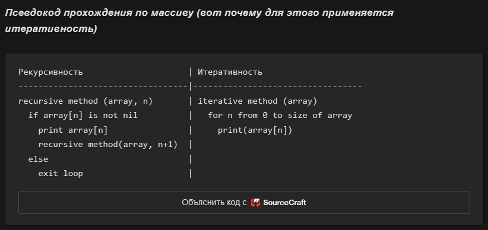

# Алгоритмы и структуры данных

## 1. Введение

### Что такое структуры данных и алгоритмы

**Структура данных** — это способ организации и хранения данных, обеспечивающий эффективный доступ и модификацию. Структура определяет не только то, как данные лежат в памяти, но и то, какие операции над ними возможны и насколько они быстры.

**Алгоритм** — это конечная последовательность однозначно определённых шагов, которая решает вычислительную задачу. Алгоритм принимает входные данные, выполняет над ними операции и выдаёт результат.

Структура данных и алгоритм неразрывно связаны: выбор структуры диктует, какой алгоритм будет эффективен. Например, поиск элемента в массиве — $O(n)$, но если массив отсортирован, бинарный поиск даёт $O(\log n)$. А если данные лежат в хэш-таблице, поиск занимает $O(1)$ в среднем.

> **Зачем это Go-разработчику.** Знание структур данных и алгоритмов — не академическая абстракция. Когда вы выбираете между `[]int` и `map[int]bool` для хранения набора идентификаторов, вы принимаете решение о компромиссе между памятью и скоростью.

### «О» большое: как измеряют эффективность

**«О» большое** (Big O notation) — это математическая нотация, описывающая асимптотическую верхнюю границу роста времени выполнения или потребляемой памяти алгоритма при стремлении размера входных данных $n$ к бесконечности.

Иными словами, Big O отвечает на вопрос: «как быстро растёт время работы, если я увеличу объём данных в 10 раз?» Константы и младшие члены отбрасываются, потому что при больших $n$ решающее значение имеет только самый быстрорастущий член.

Основные классы сложности:

| Класс         | Название         | Характеристика                                | Пример                                          |
| ------------- | ---------------- | --------------------------------------------- | ----------------------------------------------- |
| $O(1)$        | Константная      | Время не зависит от $n$                       | Доступ к элементу массива по индексу            |
| $O(\log n)$   | Логарифмическая  | При удвоении $n$ добавляется один шаг         | Бинарный поиск                                  |
| $O(n)$        | Линейная         | Время растёт пропорционально $n$              | Линейный поиск, обход массива                   |
| $O(n \log n)$ | Квазилинейная    | Чуть хуже линейной                            | Эффективные сортировки (Merge Sort, Quick Sort) |
| $O(n^2)$      | Квадратичная     | При удвоении $n$ время учетверяется           | Пузырьковая сортировка, вложенные циклы         |
| $O(2^n)$      | Экспоненциальная | Каждый дополнительный элемент удваивает время | Наивное решение задачи коммивояжёра             |

Кроме **временной сложности** (time complexity), оценивают **пространственную сложность** (space complexity) — сколько дополнительной памяти требует алгоритм сверх самих входных данных. Например, сортировка слиянием требует $O(n)$ дополнительной памяти, а быстрая сортировка — $O(\log n)$.

Важный нюанс: Big O описывает асимптотическое поведение. На малых объёмах данных алгоритм с $O(n^2)$ может обгонять $O(n \log n)$ из-за меньшей константы. Именно поэтому на практике профилируют реальный код, а не только считают сложность.

> **Зачем это Go-разработчику.** Выбор `map` vs `slice` для поиска, понимание того, почему `append` иногда вызывает дорогое копирование, профилирование с `pprof` — всё это опирается на Big O. Без этого навыка невозможно аргументированно обсуждать производительность на code review.

### Как устроен этот документ

Документ построен от простого к сложному:

* **Раздел 2** — фундамент: структуры данных, их устройство и свойства.
* **Раздел 3** — алгоритмы поиска: от линейного до обхода графов.
* **Раздел 4** — алгоритмы сортировки: три классических алгоритма и сравнительный анализ.
* **Раздел 5** — парадигмы алгоритмов: рекурсия, итерация, жадные алгоритмы и другие общие подходы.
* **Раздел 6** — прикладной: как каждая структура данных из раздела 2 реализована (или может быть реализована) в Go, со ссылками на стандартную библиотеку и сторонние пакеты.

В каждом подразделе раздела 2 вы найдёте блок «Зачем это Go-разработчику», связывающий теорию с практикой. Рекомендуется читать разделы последовательно, но при необходимости можно использовать документ как справочник — каждый подраздел самодостаточен.

***

## 2. Структуры данных

### Массив

**Определение**

**Массив** — это непрерывная область памяти, в которой элементы одного типа хранятся последовательно и доступны по числовому индексу. Индексация чаще всего начинается с нуля.

Массив — одна из старейших структур данных. Математически он опирается на понятие кортежа из теории множеств.

Физически доступ к элементу по индексу $i$ вычисляется как:

$\text{address} = \text{base\_address} + i \times \text{element\_size}$

Именно поэтому индексация занимает $O(1)$ — это одна операция умножения и сложения, выполняемая процессором за считанные такты.

**Что нужно знать**

* Массив оптимален для индексирования по номеру; плох для поиска значения, вставки и удаления (кроме операций в самом конце).
* **Статический массив** — размер фиксирован при создании и не может быть изменён.
* **Динамический массив** — резервирует память «с запасом». При заполнении выделяется новый, более вместительный блок памяти, и все элементы копируются в него. Это даёт амортизированное $O(1)$ на вставку в конец.
* **Амортизированный анализ** означает, что дорогая операция (перевыделение памяти и копирование $n$ элементов) происходит редко — раз в $O(n)$ вставок в конец. Равномерно распределённая по всем операциям, стоимость одной вставки составляет $O(1)$.
* **Двумерный массив** — массив массивов, доступ по двум индексам $(i, j)$. Может храниться как единый блок памяти (row-major / column-major) или как массив указателей на строки.

**Эффективность**

| Операция                | Статический массив | Динамический массив     |
| ----------------------- | ------------------ | ----------------------- |
| Доступ по индексу       | $O(1)$             | $O(1)$                  |
| Поиск значения          | $O(n)$             | $O(n)$                  |
| Поиск в отсортированном | $O(\log n)$        | $O(\log n)$             |
| Вставка в конец         | Недопустимо        | $O(1)$ амортизированное |
| Вставка в середину      | Недопустимо        | $O(n)$                  |
| Удаление из середины    | Недопустимо        | $O(n)$                  |

> **Зачем это Go-разработчику.** Слайс (`[]T`) в Go — это динамический массив. Понимание амортизации объясняет, почему `append` иногда вызывает аллокацию и копирование всего содержимого. Стратегия роста слайса в Go (удвоение до определённого порога, затем плавный рост) напрямую следует из амортизированного анализа. Пакет `slices` из стандартной библиотеки предоставляет утилиты для работы со слайсами: `Contains`, `Delete`, `Insert`, `BinarySearch` и другие.

***

### Связный список

**Определение**

**Связный список** — это структура данных, в которой элементы (узлы) хранятся в произвольных участках памяти и связаны друг с другом указателями (ссылками). Каждый **узел** содержит:

* Данные (значение).
* Ссылку на следующий узел (в односвязном списке) или на следующий и предыдущий (в двусвязном).

Связный список разработан для оптимизации вставки и удаления элементов в середине последовательности — в отличие от массива, не нужно сдвигать остальные элементы.

**Что нужно знать**

Разновидности связных списков:

* **Односвязный список** — каждый узел содержит ссылку только на следующий узел. Обход возможен только в одном направлении.
* **Двусвязный список** — каждый узел содержит ссылки на предыдущий и следующий узлы. Обход возможен в обе стороны.
* **Кольцевой связный список** — хвост ссылается на голову, образуя цикл. Полезен для циклических структур (round-robin планировщик).

Связный список — основа для реализации **стека** (LIFO — last in, first out) и **очереди** (FIFO — first in, first out), которые подробно рассмотрены в следующих подразделах.

Сравнение массива и связного списка:

| Критерий             | Массив (слайс)              | Связный список                 |
| -------------------- | --------------------------- | ------------------------------ |
| Доступ по индексу    | $O(1)$                      | $O(n)$                         |
| Вставка в середину   | $O(n)$ (сдвиг)              | $O(1)$ (замена ссылок)         |
| Удаление из середины | $O(n)$ (сдвиг)              | $O(1)$ (замена ссылок)         |
| Память               | Только данные               | Данные + 1–2 указателя на узел |
| Кэш-локальность      | Отличная (непрерывный блок) | Плохая (узлы разбросаны)       |

**Эффективность**

| Операция                                    | Сложность                       |
| ------------------------------------------- | ------------------------------- |
| Доступ по индексу                           | $O(n)$ — нужно пройти от головы |
| Поиск значения                              | $O(n)$                          |
| Вставка (при наличии указателя на позицию)  | $O(1)$                          |
| Удаление (при наличии указателя на позицию) | $O(1)$                          |

> **Зачем это Go-разработчику.** `container/list` в стандартной библиотеке — двусвязный список. На практике он используется редко: из-за плохой кэш-локальности слайс почти всегда предпочтительнее. Связный список оправдан, когда в середине последовательности происходит много вставок/удалений и при этом нужны стабильные указатели на элементы (указатель на узел списка не инвалидируется при модификации других узлов, в отличие от указателя на элемент слайса).

***

### Хэш-таблица

**Определение**

**Хэш-таблица** — это структура данных, хранящая пары «ключ-значение» и обеспечивающая быстрый доступ к значению по ключу. В основе лежит **хэш-функция** — функция, принимающая ключ произвольной природы и возвращающая целое число (хэш-код), которое используется как индекс в нижележащем массиве.

Требования к хэш-функции:

* **Детерминированность** — одинаковый ключ всегда даёт одинаковый хэш.
* **Равномерность** — хэш-коды должны быть равномерно распределены по диапазону, чтобы минимизировать коллизии.
* **Скорость** — вычисление хэша должно быть быстрым, иначе теряется смысл.

**Что нужно знать**

* **Хэш-коллизия** — ситуация, когда два разных ключа дают одинаковый хэш-код. Коллизии неизбежны (по принципу Дирихле), поэтому любая хэш-таблица должна иметь стратегию их разрешения.

Два основных метода разрешения коллизий:

* **Метод цепочек (chaining)** — каждая ячейка массива содержит связный список всех элементов с данным хэшем. При коллизии элемент добавляется в список.
* **Открытая адресация (open addressing)** — все элементы хранятся в самом массиве. При коллизии ищется следующая свободная ячейка по определённому правилу (линейное, квадратичное пробирование, двойное хэширование). Go использует именно открытую адресацию.
* **Коэффициент заполнения (load factor)** — отношение количества хранимых элементов к размеру массива. При превышении порога таблица перестраивается (rehash): выделяется массив большего размера, и все элементы перехэшируются заново. Это дорогая операция, но она происходит редко, что даёт амортизированное $O(1)$ для вставки.
* Хэш-таблицы — основа **ассоциативных массивов**, **множеств** (set), индексирования в базах данных, кэшей.

**Эффективность**

| Операция | Средний случай | Худший случай |
| -------- | -------------- | ------------- |
| Вставка  | $O(1)$         | $O(n)$        |
| Поиск    | $O(1)$         | $O(n)$        |
| Удаление | $O(1)$         | $O(n)$        |

Худший случай $O(n)$ наступает при большом количестве коллизий (плохая хэш-функция или переполнение таблицы). Хорошая хэш-функция и адекватный load factor делают его маловероятным.

> **Зачем это Go-разработчику.** `map[K]V` — встроенная хэш-таблица Go. Рантайм автоматически управляет ростом map, и разработчику не нужно думать о load factor. Важно знать: итерация по map недетерминирована (порядок может меняться от запуска к запуску) — это следствие внутреннего устройства хэш-таблицы. Map небезопасна для конкурентного доступа: одновременные чтение и запись из разных горутин приведут к панике. Для конкурентного доступа используйте `sync.Map` или `sync.RWMutex` вокруг обычной map.

***

### Двоичное дерево поиска (BST)

**Определение**

**Двоичное дерево** — это иерархическая структура данных, в которой каждый узел имеет не более двух дочерних узлов: левый и правый. Узлы без детей называются **листьями**. Единственный узел без родителя — **корень**.

**Двоичное дерево поиска** (Binary Search Tree, BST) — это двоичное дерево, удовлетворяющее свойству упорядоченности:

* Ключ **левого** дочернего узла **меньше** ключа родителя.
* Ключ **правого** дочернего узла **больше** ключа родителя.
* Дубликаты ключей, как правило, не допускаются.

Это свойство позволяет находить элемент за $O(\log n)$, на каждом шаге спускаясь в левое или правое поддерево в зависимости от сравнения ключей.

**Что нужно знать**

* BST разработано для оптимизации поиска, вставки и удаления с сохранением сортированного порядка — в отличие от хэш-таблицы, где порядок не определён.
* **Вырожденное (несбалансированное) дерево** — дерево, в котором элементы вставлялись в отсортированном порядке, и каждый узел имеет только одного потомка. Такое дерево по сути является связным списком, и все операции деградируют до $O(n)$.
* **Сбалансированность** — свойство дерева, при котором высота левого и правого поддеревьев любого узла примерно равна. Сбалансированные деревья гарантируют $O(\log n)$ для всех операций и рассмотрены в следующем подразделе.

**Эффективность (для BST)**

| Операция | Средний случай | Худший случай |
| -------- | -------------- | ------------- |
| Поиск    | $O(\log n)$    | $O(n)$        |
| Вставка  | $O(\log n)$    | $O(n)$        |
| Удаление | $O(\log n)$    | $O(n)$        |

> **Зачем это Go-разработчику.** BST — основа для sorted map и sorted set. В стандартной библиотеке Go реализации BST нет. Понимание BST необходимо для работы с индексами баз данных (B-деревья — обобщение BST, см. следующий подраздел) и для алгоритмических собеседований. На практике в Go для сортированного хранения чаще используют отсортированный слайс с бинарным поиском (`sort.Search`), если данные не меняются часто.

***

### Сбалансированные деревья поиска

**Определение**

**Сбалансированное дерево поиска** — это двоичное (или n-арное) дерево поиска, которое автоматически поддерживает высоту, близкую к минимально возможной ($\sim \log n$), при выполнении операций вставки и удаления. Это гарантирует, что производительность всех операций не деградирует до $O(n)$.

**Что нужно знать**

Основные типы сбалансированных деревьев:

* **AVL-дерево** — названо в честь Адельсон-Вельского и Ландиса. Строго сбалансировано: для любого узла разница высот левого и правого поддеревьев не превышает 1. Обеспечивает максимально быстрый поиск ценой более частых балансировок (вращений) при вставке и удалении.
* **Красно-чёрное дерево** (Red-Black Tree) — менее строгие правила балансировки, чем у AVL. Каждый узел окрашен в красный или чёрный цвет, и набор правил окраски гарантирует, что самый длинный путь от корня до листа не более чем вдвое длиннее самого короткого. Требует меньше вращений, чем AVL, но поиск может быть чуть медленнее. Широко используется в стандартных библиотеках: `std::map` в C++, `TreeMap` в Java.
* **B-дерево** — обобщение двоичного дерева: каждый узел может содержать много ключей (не два, а десятки или сотни) и иметь много дочерних узлов. Оптимизировано для систем с блочным чтением: один узел занимает ровно один блок диска, и чтение этого блока даёт доступ сразу к большому количеству ключей. Минимизирует количество обращений к медленной памяти.
* **B+-дерево** — вариант B-дерева, в котором все данные хранятся только в листьях, а внутренние узлы содержат только ключи-указатели. Листья связаны в список, что позволяет эффективный последовательный обход (range queries). Это стандартная структура для индексов в реляционных базах данных (PostgreSQL, MySQL/InnoDB).

Сравнительная таблица:

| Свойство         | AVL                | Красно-чёрное     | B-дерево / B+                 |
| ---------------- | ------------------ | ----------------- | ----------------------------- |
| Балансировка     | Строгая            | Мягкая            | Мягкая (по высоте)            |
| Поиск            | Быстрее            | Чуть медленнее    | Быстрый (много ключей в узле) |
| Вставка/удаление | Больше вращений    | Меньше вращений   | Расщепление узлов             |
| Применение       | Поисковые нагрузки | Общего назначения | Базы данных, ФС               |

**Эффективность (для всех сбалансированных деревьев)**

| Операция             | Сложность   |
| -------------------- | ----------- |
| Поиск                | $O(\log n)$ |
| Вставка              | $O(\log n)$ |
| Удаление             | $O(\log n)$ |
| Обход всех элементов | $O(n)$      |

> **Зачем это Go-разработчику.** В стандартной библиотеке Go сбалансированных деревьев нет. Сторонние библиотеки: `github.com/google/btree` (B-дерево для in-memory использования). B+-деревья — основа индексов PostgreSQL и SQLite, с которыми Go-приложения взаимодействуют через `database/sql`. Понимание того, как устроен индекс, помогает писать эффективные запросы и интерпретировать `EXPLAIN`.

***

### Стек (Stack)

**Определение**

**Стек** — это линейная структура данных, работающая по принципу **LIFO** (Last In, First Out — «последним пришёл, первым ушёл»). Элементы добавляются и извлекаются только с одного конца, называемого **вершиной** стека.

Основные операции:

* **push** — добавить элемент на вершину.
* **pop** — снять элемент с вершины.
* **peek** (или top) — посмотреть элемент на вершине, не снимая его.

**Что нужно знать**

* Стек может быть реализован поверх массива (слайса) или односвязного списка. Реализация на массиве проще и быстрее за счёт кэш-локальности.
* Доступ к произвольному элементу невозможен без снятия всех элементов над ним.
* **Стек вызовов** (call stack) — центральное понятие в рантайме любого языка: каждый вызов функции создаёт **стековый кадр** (stack frame) с локальными переменными и адресом возврата. Когда функция завершается, её кадр снимается. Переполнение стека (stack overflow) — результат слишком глубокой рекурсии без достижения базового случая.
* Стек используется для:
  * Управления вызовами функций и хранения контекстов.
  * Алгоритмов обхода графов в глубину (DFS).
  * Проверки сбалансированности скобок.
  * Реализации отмены действий (undo).
  * Вычисления выражений в обратной польской нотации.

**Эффективность**

| Операция                                | Сложность |
| --------------------------------------- | --------- |
| Добавление (push)                       | $O(1)$    |
| Удаление (pop)                          | $O(1)$    |
| Просмотр вершины (peek)                 | $O(1)$    |
| Поиск / Доступ к произвольному элементу | $O(n)$    |

> **Зачем это Go-разработчику.** Стек на слайсе — идиоматичный паттерн: `s = append(s, x)` (push), `s = s[:len(s)-1]` (pop). Операция среза `s[:len(s)-1]` не аллоцирует новую память — только двигает границу слайса, поэтому pop стоит $O(1)$. Стек вызовов горутин в Go начинается с 2 КБ и растёт динамически — поэтому глубокие рекурсии могут работать там, где в языках с фиксированным стеком случился бы stack overflow. Но злоупотреблять этим не стоит.

***

### Очередь (Queue)

**Определение**

**Очередь** — это линейная структура данных, работающая по принципу **FIFO** (First In, First Out — «первым пришёл, первым ушёл»). Элементы добавляются в конец очереди и извлекаются из начала.

Основные операции:

* **enqueue** (или push) — добавить элемент в конец.
* **dequeue** (или pop) — извлечь элемент из начала.
* **peek** (или front) — посмотреть на первый элемент, не извлекая.

**Что нужно знать**

* Очередь может быть реализована на базе массива (кольцевой буфер), двусвязного списка или двух стеков.
* **Кольцевой буфер** (circular buffer) — массив фиксированного размера, в котором указатели начала и конца «заворачиваются» при достижении границы. Это самая эффективная реализация очереди по памяти и скорости.
* Разновидности:
  * **Дек** (Deque, double-ended queue) — двусторонняя очередь: вставка и удаление возможны с обоих концов. Комбинирует свойства стека и очереди.
  * **Приоритетная очередь** (Priority Queue) — элемент с наивысшим приоритетом извлекается первым, независимо от порядка поступления. Реализуется на базе кучи (см. следующий подраздел).
* Очереди используются для:
  * Планирования задач (процессор, принтер, сетевые пакеты).
  * Буферизации данных (стриминг, каналы в Go).
  * Обхода графов в ширину (BFS).

**Эффективность (для простой очереди на двусвязном списке или кольцевом буфере)**

| Операция               | Сложность |
| ---------------------- | --------- |
| Добавление (enqueue)   | $O(1)$    |
| Удаление (dequeue)     | $O(1)$    |
| Просмотр начала (peek) | $O(1)$    |
| Поиск значения         | $O(n)$    |

> **Зачем это Go-разработчику.** Буферизованный канал (`make(chan T, n)`) — это очередь на кольцевом буфере. Каналы идеальны, когда писатель и читатель — разные горутины. Для однопоточной очереди в стандартной библиотеке отдельной реализации нет. Популярные сторонние библиотеки: `github.com/gammazero/deque` (высокопроизводительный дек на кольцевом буфере).

***

### Куча (Heap)

**Определение**

**Куча** (heap) — это специализированная древовидная структура данных, удовлетворяющая **свойству кучи**:

* В **max-куче** ключ каждого узла $\ge$ ключей его дочерних узлов. В корне — максимум.
* В **min-куче** ключ каждого узла $\le$ ключей его дочерних узлов. В корне — минимум.

Важно: термин «куча» в контексте структур данных не имеет отношения к динамической памяти программы (memory heap) — это разные понятия. В английском языке оба называются «heap», что может сбивать с толку.

**Что нужно знать**

* Куча обычно реализуется на основе массива, что позволяет быстро находить родителей и потомков узла с индексом $i$:
  * Родитель: $(i - 1) / 2$ (целочисленное деление).
  * Левый потомок: 2i + 1.
  * Правый потомок: 2i + 2.
* Куча не является полностью отсортированной — гарантируется только отношение «родитель $\ge$ (или $\le$) потомок». Нельзя, например, найти второй по величине элемент за $O(1)$.
* Основная операция поддержания свойства кучи — **просеивание**:
  * **sift-up** (всплытие): новый элемент добавляется в конец массива и «всплывает», меняясь с родителем, пока свойство кучи не восстановится.
  * **sift-down** (погружение): после удаления корня (замены его последним элементом) новый корень «погружается», меняясь с наибольшим (или наименьшим) из потомков.
* Куча используется для:
  * Реализации приоритетных очередей.
  * Алгоритма сортировки Heapsort.
  * Алгоритма Дейкстры для поиска кратчайшего пути.
  * Слияния K отсортированных списков.

**Эффективность**

| Операция                                   | Сложность   |
| ------------------------------------------ | ----------- |
| Вставка (insert)                           | $O(\log n)$ |
| Извлечение корня (extract-min/extract-max) | $O(\log n)$ |
| Просмотр корня без удаления                | $O(1)$      |
| Поиск произвольного элемента               | $O(n)$      |

> **Зачем это Go-разработчику.** `container/heap` — адаптер, превращающий любой тип, реализующий `heap.Interface` (`sort.Interface` + `Push`/`Pop`), в кучу. Используется для приоритетных очередей: планировщик задач, очередь событий, алгоритм Дейкстры. Важно: методы `Push` и `Pop` вызываются самим пакетом `heap`, а не пользователем напрямую — пользователь вызывает `heap.Push(&h, x)` и `heap.Pop(&h)`.

***

### Граф (Graph)

**Определение**

**Граф** — это абстрактная структура данных, состоящая из:

* **Вершин** (узлов, vertices, $V$) — объектов любой природы.
* **Рёбер** (связей, edges, $E$) — пар вершин, обозначающих связь между ними.

Граф моделирует отношения между объектами; это одна из самых универсальных и выразительных структур данных.

**Что нужно знать**

Разновидности графов:

* **Неориентированный граф** — рёбра не имеют направления: связь $(A, B)$ эквивалентна $(B, A)$.
* **Ориентированный граф** (digraph) — рёбра (называемые дугами) имеют направление: $(A \to B)$ не означает $(B \to A)$.
* **Взвешенный граф** — каждому ребру присвоен числовой вес (стоимость, расстояние, пропускная способность).

Два основных способа представления графа в памяти:

| Критерий                | Матрица смежности                                                           | Список смежности                                          |
| ----------------------- | --------------------------------------------------------------------------- | --------------------------------------------------------- |
| Устройство              | $V \times V$ матрица: `a[i][j] = 1` (или вес), если есть ребро из $i$ в $j$ | Массив списков: для каждой вершины — список смежных с ней |
| Проверка ребра $(i, j)$ | $O(1)$                                                                      | $O(\deg(i))$ в худшем $O(V)$                              |
| Перебор соседей вершины | $O(V)$                                                                      | $O(\deg(i))$ — пропорционально числу соседей              |
| Память                  | $O(V^2)$ — даже если рёбер мало                                             | $O(V + E)$ — пропорционально количеству рёбер             |

Список смежности почти всегда предпочтительнее для разреженных графов, характерных для реальных задач (социальные сети, дорожные карты, ссылки между страницами).

Основные алгоритмы на графах:

* **BFS** (поиск в ширину) — кратчайший путь в невзвешенном графе, обход по уровням. Рассмотрен в разделе 3.
* **DFS** (поиск в глубину) — топологическая сортировка, поиск циклов, компоненты связности. Рассмотрен в разделе 3.
* **Алгоритм Дейкстры** — кратчайший путь от одной вершины до всех остальных во взвешенном графе с неотрицательными весами. Сложность: $O((V+E) \log V)$ с приоритетной очередью.

Графы используются для:

* Социальных сетей (вершины — люди, рёбра — дружба/подписка).
* Карт и навигации (вершины — перекрёстки, рёбра — дороги, веса — расстояния).
* Сетей компьютеров и маршрутизации.
* Зависимостей пакетов, модулей, задач (топологическая сортировка).

> **Зачем это Go-разработчику.** Стандартной библиотеки графов в Go нет. Популярны `gonum/graph` для математических графов и ручные реализации на слайсах и map. Типичная Go-реализация списка смежности: `graph := make(map[string][]string)` или `graph := make([][]int, n)`. Графы возникают повсеместно: зависимости пакетов (решает `go mod`), граф вызовов функций, топология микросервисов, DAG в CI/CD-пайплайнах.

***

### Префиксное дерево (Trie)

**Определение**

**Префиксное дерево** (Trie, от «retrieval») — это древовидная структура данных для хранения набора строк. Каждый узел представляет один символ, а путь от корня до узла образует строку-префикс. Узлы, соответствующие концам хранимых строк, помечаются как терминальные.

В отличие от BST, где ключ сравнивается целиком, Trie разбивает ключ на символы и использует каждый символ как шаг при спуске по дереву.

**Что нужно знать**

* Поиск строки (или префикса) выполняется за $O(k)$, где $k$ — длина строки, независимо от количества строк в дереве.
* Память может быть проблемой: если алфавит большой (Unicode), каждый узел потенциально содержит много указателей. На практике дочерние узлы хранят в map, а не в массиве фиксированного размера.
* Вариант: **сжатое префиксное дерево** (Radix Tree, Patricia Trie) — цепочки узлов с единственным потомком сливаются в один узел. Это экономит память и ускоряет обход. Используется в маршрутизаторах HTTP (например, `gin`, `chi`).
* Trie применяется для:
  * Автодополнения (autocomplete) и поисковых подсказок.
  * Проверки орфографии.
  * Хранения словарей для полнотекстового поиска.
  * Маршрутизации URL в веб-фреймворках.

**Эффективность**

| Операция                              | Сложность                                   |
| ------------------------------------- | ------------------------------------------- |
| Поиск строки                          | $O(k)$                                      |
| Вставка строки                        | $O(k)$                                      |
| Поиск всех строк с заданным префиксом | $O(k + m)$, где $m$ — количество совпадений |

> **Зачем это Go-разработчику.** HTTP-роутеры в Go (`gin`, `chi`, `httprouter`) используют Radix Tree для быстрой маршрутизации URL. Если вы пишете автодополнение или поисковый сервис, Trie — естественный выбор. Стандартной реализации в stdlib нет, но написать Trie на Go — компактная задача (~50 строк кода).

***

## 3. Алгоритмы поиска

### Линейный поиск

**Линейный поиск** — простейший алгоритм: последовательный перебор элементов от первого до последнего, пока не будет найден искомый или не закончатся элементы.

Подходит только для неотсортированных данных или малых объёмов. Применение к сортированным данным — напрасная трата потенциала (лучше использовать бинарный поиск).

Сложность: $O(n)$ — в худшем случае просматриваются все $n$ элементов.

В Go линейный поиск — это обычный цикл `for range` с проверкой условия. Для слайсов также доступен `slices.Contains`.

***

### Бинарный поиск

**Бинарный поиск** — алгоритм поиска в **отсортированном** массиве, на каждом шаге отбрасывающий половину оставшихся элементов.

Алгоритм:

1. Сравниваем искомый ключ со средним элементом массива.
2. Если ключ равен среднему — поиск завершён.
3. Если ключ меньше — продолжаем поиск в левой половине.
4. Если ключ больше — продолжаем в правой половине.
5. Повторяем, пока не найдём элемент или пока диапазон поиска не станет пустым.

Сложность: $O(\log n)$ — при каждом сравнении область поиска сокращается вдвое. Для массива из 10^9 элементов потребуется не более 30 сравнений.

Обязательное условие: массив должен быть отсортирован. Стоимость предварительной сортировки ($O(n \log n)$) окупается, если поиск выполняется многократно.

> **Зачем это Go-разработчику.** `sort.Search(n int, f func(int) bool) int` в стандартной библиотеке — это обобщённый бинарный поиск. Он не требует передачи самого массива: достаточно функции-предиката, которая возвращает `true` для «достаточно больших» индексов. Для числовых слайсов пакет `slices` предоставляет `BinarySearch` и `BinarySearchFunc`. Бинарный поиск — основа диапазонных запросов и поиска в отсортированных структурах.

***

### Поиск в ширину (BFS)

**Определение**

**Поиск в ширину** (Breadth-First Search, BFS) — это алгоритм обхода дерева или графа, который исследует вершины по уровням: сначала корень, затем все его соседи, затем соседи соседей, и так далее. На каждом уровне вершины обычно просматриваются слева направо.

Алгоритм по шагам:

1. Поместить начальную вершину в очередь.
2. Пока очередь не пуста:
   * Извлечь вершину из очереди.
   * Обработать её.
   * Поместить в очередь всех её непосещённых соседей.

**Что нужно знать**

* BFS использует очередь (FIFO), что гарантирует обход по уровням.
* Из-за хранения очереди BFS может потреблять значительный объём памяти — до $O(V)$ в худшем случае.
* BFS оптимален для поиска по дереву или графу, чья ширина превышает глубину.
* Применение: поиск кратчайшего пути в невзвешенном графе, обход по уровням, поиск друзей на расстоянии $k$ в социальном графе.

**Эффективность**

Сложность BFS: $O(|E| + |V|)$, где $|E|$ — количество рёбер, $|V|$ — количество вершин. Каждая вершина и каждое ребро обрабатываются один раз.

***

### Поиск в глубину (DFS)

**Определение**

**Поиск в глубину** (Depth-First Search, DFS) — это алгоритм обхода дерева или графа, который идёт как можно глубже по одной ветви, прежде чем вернуться и исследовать следующую.

Алгоритм по шагам (стековый вариант):

1. Поместить начальную вершину в стек.
2. Пока стек не пуст:
   * Снять вершину со стека.
   * Обработать её.
   * Поместить в стек всех её непосещённых соседей.

Рекурсивный вариант — тот же самый алгоритм, но стек заменяется стеком вызовов.

**Что нужно знать**

* DFS использует стек (LIFO), что даёт глубокое продвижение по одной ветви перед возвратом.
* Поскольку стек не обязан хранить все вершины уровня (как очередь в BFS), DFS обычно потребляет меньше памяти — $O(h)$, где $h$ — глубина дерева.
* DFS оптимален для поиска по дереву или графу, чья глубина превышает ширину.
* Применение: топологическая сортировка, поиск циклов, поиск компонент связности, поиск мостов и точек сочленения, генерация лабиринтов.

**Эффективность**

Сложность DFS: $O(|E| + |V|)$, так же как у BFS — каждая вершина и каждое ребро обрабатываются один раз.

**Нюансы**

* BFS — циклический алгоритм (явная очередь), DFS — рекурсивный или стековый.
* На очень глубоком графе рекурсивный DFS может вызвать переполнение стека (stack overflow). В Go горутины имеют растущий стек, что снижает риск, но не исключает его полностью при экстремальной глубине.
* BFS на очень широком графе может исчерпать доступную память из-за размера очереди.

> **Зачем это Go-разработчику.** BFS и DFS — основа обхода графов. В Go-разработке они возникают при анализе дерева зависимостей пакетов, обходе вложенных конфигурационных структур (JSON/YAML), парсинге AST (абстрактного синтаксического дерева), анализе графа вызовов. Идиоматическая Go-реализация BFS — цикл со слайсом в качестве очереди; DFS — рекурсивная функция или цикл со слайсом в качестве стека.

***

## 4. Алгоритмы сортировки

### Общие принципы сортировки

Прежде чем рассматривать конкретные алгоритмы, зафиксируем ключевые понятия:

* **Устойчивая сортировка** (stable sort) — элементы с одинаковым ключом сохраняют относительный порядок после сортировки. Например, если в списке сотрудников отсортировать сначала по отделу, а потом устойчиво по зарплате, то внутри каждого отдела сохранится сортировка по зарплате.
* **Сортировка на месте** (in-place) — алгоритм использует $O(1)$ дополнительной памяти (или $O(\log n)$ для стека рекурсии). Не создаёт копию данных.
* **Сравнительная сортировка** — алгоритм принимает решения только на основе попарного сравнения элементов. Теоретический нижний предел сложности для таких алгоритмов — $O(n \log n)$.

Сравнительная таблица трёх рассматриваемых алгоритмов:

| Алгоритм               | Лучший случай | Средний случай | Худший случай | Память      | Устойчивость |
| ---------------------- | ------------- | -------------- | ------------- | ----------- | ------------ |
| Сортировка слиянием    | $O(n \log n)$ | $O(n \log n)$  | $O(n \log n)$ | $O(n)$      | Да           |
| Быстрая сортировка     | $O(n \log n)$ | $O(n \log n)$  | $O(n^2)$      | $O(\log n)$ | Нет          |
| Пузырьковая сортировка | $O(n)$        | $O(n^2)$       | $O(n^2)$      | $O(1)$      | Да           |

> **Зачем это Go-разработчику.** `sort.Slice` и `slices.Sort` в стандартной библиотеке используют **pdqsort** (pattern-defeating quicksort) — гибридный алгоритм, сочетающий Quick Sort, Heap Sort и Insertion Sort. Для продакшена всегда используйте стандартную сортировку, а не пишите свою. Но понимание алгоритмов необходимо для собеседований и для случаев, где стандартная сортировка неприменима: внешняя сортировка больших файлов, частичная сортировка, потоковая обработка.

***

### Сортировка слиянием (Merge Sort)

**Определение**

Сортировка слиянием — это рекурсивный алгоритм, работающий по принципу «разделяй и властвуй»:

1. Разделить массив на две половины.
2. Рекурсивно отсортировать каждую половину.
3. Слить две отсортированные половины в один отсортированный массив.

Слияние — ключевая операция: два указателя идут по двум отсортированным массивам, и на каждом шаге меньший из двух текущих элементов записывается в результат.

**Что нужно знать**

* Это один из фундаментальных алгоритмов сортировки.
* Гарантирует $O(n \log n)$ во всех случаях — время не зависит от входных данных.
* Устойчива: равные элементы сохраняют порядок.
* Требует $O(n)$ дополнительной памяти для слияния — это главный недостаток.
* Хорошо подходит для сортировки связанных списков (не требует дополнительной памяти для слияния списков) и для внешней сортировки (данные не помещаются в оперативную память).

**Эффективность**

| Сценарий  | Сложность     |
| --------- | ------------- |
| Наилучший | $O(n \log n)$ |
| Средний   | $O(n \log n)$ |
| Худший    | $O(n \log n)$ |

***

### Быстрая сортировка (Quick Sort)

**Определение**

Быстрая сортировка — это рекурсивный алгоритм, также основанный на «разделяй и властвуй»:

1. Выбрать **опорный элемент** (pivot).
2. **Разделить** (partition) массив: элементы меньше опорного — влево, больше — вправо.
3. Рекурсивно применить алгоритм к левой и правой частям.

**Что нужно знать**

* Несмотря на худший случай $O(n^2)$, на практике Quick Sort часто быстрее Merge Sort. Причины: лучшая кэш-локальность (работает на месте, не аллоцирует дополнительный массив), меньшая константа.
* Худший случай $O(n^2)$ наступает при неудачном выборе опорного элемента на уже отсортированных данных. Борьба с этим: случайный выбор pivot, медиана из трёх, переход на Heap Sort при обнаружении паттерна (pdqsort).
* Quick Sort не является устойчивым — равные элементы могут поменяться местами при разделении.
* Требует $O(\log n)$ памяти для стека рекурсии.

**Эффективность**

| Сценарий  | Сложность     |
| --------- | ------------- |
| Наилучший | $O(n \log n)$ |
| Средний   | $O(n \log n)$ |
| Худший    | $O(n^2)$      |

***

### Пузырьковая сортировка (Bubble Sort)

**Определение**

Пузырьковая сортировка итерирует по массиву слева направо, сравнивая соседние пары и меняя их местами, если левый элемент больше правого. После каждого прохода наибольший неотсортированный элемент «всплывает» в конец. Алгоритм повторяется, пока массив не будет полностью отсортирован.

**Что нужно знать**

* Самый простой в реализации алгоритм сортировки — и самый неэффективный из рассматриваемых.
* Квадратичная сложность в среднем и худшем случаях делает его непригодным для реальных данных любого значимого размера.
* Исторически важен как педагогический пример, но **никогда не должен использоваться в продакшене**.

**Эффективность**

| Сценарий                     | Сложность |
| ---------------------------- | --------- |
| Наилучший (уже отсортирован) | $O(n)$    |
| Средний                      | $O(n^2)$  |
| Худший                       | $O(n^2)$  |

***

## 5. Парадигмы алгоритмов

Парадигма алгоритма — это общий подход к построению решения, шаблон мышления, применимый к целым классам задач. Один и тот же алгоритм может сочетать несколько парадигм.

### Рекурсивные алгоритмы

**Определение**

**Рекурсивный алгоритм** — это алгоритм, который вызывает сам себя для решения подзадачи меньшего размера.

Любой рекурсивный алгоритм состоит из двух частей:

* **Базовый случай** (base case) — условие, при котором рекурсия прекращается. Без него рекурсия бесконечна.
* **Рекурсивный случай** (recursive case) — шаг, на котором задача сводится к подзадаче меньшего размера.

**Что нужно знать**

* Каждый рекурсивный вызов создаёт новый кадр в стеке вызовов. Слишком глубокая рекурсия может привести к **переполнению стека** (stack overflow) — это означает, что базовый случай не был достигнут до исчерпания доступной памяти стека.
* **Хвостовая рекурсия** (tail recursion) — частный случай, когда рекурсивный вызов является последней операцией функции. Некоторые компиляторы оптимизируют хвостовую рекурсию, заменяя её циклом и не расходуя стек. Компилятор Go **не оптимизирует** хвостовую рекурсию — каждый рекурсивный вызов расходует стек, независимо от позиции.
* Рекурсивные алгоритмы часто элегантнее и проще в реализации, чем итеративные аналоги.
* Функциональные языки (Haskell, Erlang) активно используют рекурсию как основной механизм повторения.

Рекурсия — естественный выбор для:

* Обхода древовидных структур (DFS).
* Алгоритмов «разделяй и властвуй» (Merge Sort, Quick Sort).
* Парсинга рекурсивных грамматик.

> **Зачем это Go-разработчику.** Go поддерживает рекурсию, но без оптимизации хвостовых вызовов. Глубокие рекурсии (миллионы вызовов) приведут к панике `runtime: goroutine stack exceeds...`. Для production-кода на Go часто предпочитают итеративные решения или явный стек (слайс). Однако рекурсия остаётся лучшим выбором для задач с логарифмической глубиной: обход сбалансированного дерева, бинарный поиск, Quick Sort с глубиной $\log n$.

***

### Итеративные алгоритмы

**Определение**

**Итеративный алгоритм** — это алгоритм, который многократно выполняет один и тот же блок кода (итерацию), изменяя состояние на каждом шаге, пока не будет достигнуто условие завершения.

**Что нужно знать**

* Итерации оформляются в виде циклов: `for`, `while`, `until`.
* Каждая итерация — однократный проход по набору данных или однократное приближение к решению.
* Итеративные алгоритмы потребляют меньше памяти, чем рекурсивные — не расходуют стек вызовов на каждый шаг.
* Любой рекурсивный алгоритм можно переписать в итеративной форме, используя явный стек (слайс) или очередь.
* Императивные языки (Go, C, Java) склонны к итеративному стилю.

Сравнение рекурсии и итерации:

| Критерий           | Рекурсия                            | Итерация                             |
| ------------------ | ----------------------------------- | ------------------------------------ |
| Выразительность    | Часто проще и читаемее              | Может быть громоздкой (явный стек)   |
| Память             | Расходует стек вызовов ($O(depth)$) | Обычно $O(1)$, если без явного стека |
| Производительность | Накладные расходы на вызовы         | Минимальные накладные расходы        |
| Риски              | Stack overflow                      | Бесконечный цикл                     |



***

### Жадные алгоритмы

**Определение**

**Жадный алгоритм** — это алгоритм, который на каждом шаге принимает **локально оптимальное** решение, надеясь, что оно приведёт к глобально оптимальному результату. Жадный алгоритм никогда не пересматривает ранее принятые решения.

Пять компонентов жадного алгоритма:

* **Набор кандидатов** (candidate set) — множество возможных вариантов выбора.
* **Функция выбора** — определяет, какой кандидат является лучшим на текущем шаге.
* **Функция обоснования** (feasibility function) — проверяет, может ли кандидат быть частью решения.
* **Целевая функция** (objective function) — оценивает качество текущего частичного решения.
* **Функция решения** (solution function) — определяет, является ли текущее частичное решение полным.

**Что нужно знать**

* Жадные алгоритмы не всегда дают оптимальный ответ. Они работают только для задач, обладающих **свойством жадного выбора**: локально оптимальный выбор на каждом шаге ведёт к глобально оптимальному решению.
* Классический пример: задача о выдаче сдачи минимальным количеством монет. Для канонических монетных систем жадный алгоритм даёт оптимум; для произвольных — не всегда.
* Жадные алгоритмы применяются, когда лишь малая часть обработанной информации даёт желаемый результат.
* Часто жадный алгоритм может служить эвристикой для улучшения Big O другого, более точного алгоритма.

Примеры жадных алгоритмов:

* Алгоритм Дейкстры (кратчайший путь).
* Алгоритм Прима и Краскала (минимальное остовное дерево).
* Кодирование Хаффмана (сжатие данных).

> **Зачем это Go-разработчику.** Жадные алгоритмы естественны в планировщиках и системах распределения ресурсов. Планировщик горутин Go использует элементы жадной стратегии (work-stealing). Преждевременная оптимизация — тоже жадный подход: выбирать «самое медленное место» и оптимизировать его — это локально оптимальное решение, которое может не дать глобального эффекта.

***

### Разделяй и властвуй (Divide and Conquer)

**Определение**

**Разделяй и властвуй** — это парадигма, в которой задача рекурсивно разбивается на две или более подзадачи того же типа, но меньшего размера. Решения подзадач затем комбинируются в решение исходной задачи.

Три шага:

1. **Divide** — разбить задачу на подзадачи.
2. **Conquer** — решить подзадачи рекурсивно.
3. **Combine** — объединить решения подзадач.

**Что нужно знать**

* Это одна из самых мощных парадигм, лежащая в основе эффективных алгоритмов сортировки и поиска.
* Ключевое отличие от динамического программирования (см. ниже): подзадачи в Divide and Conquer **не перекрываются** — каждая решается независимо.
* Классические примеры: Merge Sort, Quick Sort, бинарный поиск, быстрое преобразование Фурье (FFT).

> **Зачем это Go-разработчику.** Divide and Conquer естественно сочетается с конкурентностью в Go: подзадачи можно раздавать горутинам и собирать результаты через каналы или `sync.WaitGroup`. Параллельная сортировка слиянием — хрестоматийный пример.

***

### Динамическое программирование

**Определение**

**Динамическое программирование** (Dynamic Programming, DP) — это парадигма решения задач путём разбиения на **перекрывающиеся** подзадачи. В отличие от Divide and Conquer, одни и те же подзадачи могут возникать многократно. DP решает каждую подзадачу один раз и сохраняет результат (**мемоизация**), избегая повторных вычислений.

Два подхода:

* **Top-down** (мемоизация) — рекурсивное решение, которое кэширует результаты уже решённых подзадач.
* **Bottom-up** (табуляция) — итеративное построение решения от малых подзадач к большим, с заполнением таблицы.

**Что нужно знать**

* DP — это не конкретный алгоритм, а метод проектирования алгоритмов.
* Классический пример: числа Фибоначчи. Наивная рекурсия — $O(2^n)$; DP (мемоизация или bottom-up) — $O(n)$.
* DP применимо, когда задача обладает:
  * **Оптимальной подструктурой** — оптимальное решение задачи содержит оптимальные решения подзадач.
  * **Перекрывающимися подзадачами** — одни и те же подзадачи возникают многократно.
* DP — обширная тема, заслуживающая отдельного изучения. Здесь дано только введение, чтобы читатель узнал термин и понимал, куда копать.

> **Зачем это Go-разработчику.** Задачи на DP — классика алгоритмических собеседований. В реальной Go-разработке DP встречается при вычислении расстояния Левенштейна (нечёткий поиск), оптимизации SQL-запросов (планировщик), парсинге (CYK-алгоритм), выравнивании последовательностей (биоинформатика). Реализация в Go не имеет особенностей: мемоизация — map + рекурсия; bottom-up — слайсы и циклы.

***

## 6. Структуры данных в Go

Этот раздел показывает, как теоретические структуры данных из раздела 2 отображаются на код Go. Для каждой структуры указан аналог из стандартной библиотеки C++ (std) для тех, кто переходит с C++, и приведены идиоматичные Go-реализации или ссылки на популярные пакеты.

### Динамический непрерывный массив

Аналог `std::vector` в C++. Поддерживает обращение к элементу по индексу за константное время в несколько тактов процессора. Можно увеличить или уменьшить вместительность. Это встроенный **слайс** (`[]T`):

```go
s := make([]int, 3)

s[0] = 1
s[1] = 2
s[2] = 3

s = append(s, 4, 5, 6)

```

См. теоретический подраздел «Массив» в разделе 2.

***

### Стек

Аналог `std::stack`. Упорядоченный набор, в котором добавление новых элементов и удаление существующих производится с одного конца. Первым из стека удаляется элемент, который был помещён туда последним (LIFO). Это снова встроенный слайс. Из проекта в проект копируются сниппеты:

```go
var stack []int

// Push
stack = append(stack, x)

// Top
peek := stack[len(stack)-1]

// Pop
stack = stack[:len(stack)-1]

```

Операция среза `s[:len(s)-1]` не аллоцирует новую память — только двигает границу слайса.

См. теоретический подраздел «Стек» в разделе 2.

***

### Очередь

Аналог `std::queue` и `std::deque`. Очереди реализуют операции извлечения и добавления для начала и конца за константное время. Первым из очереди удаляется элемент, который был первым помещён (FIFO). Буферизованный канал является очередью на кольцевом буфере — можно использовать его, когда читатель и писатель — разные горутины. Но отдельной реализации очереди в стандартной библиотеке нет. Список awesome-go рекомендует библиотеку [gammazero/deque](https://github.com/gammazero/deque).

```go
import "github.com/gammazero/deque"

q := deque.New[int]()
q.PushBack(1)
q.PushFront(0)
q.PopFront()
q.PopBack()

```

См. теоретический подраздел «Очередь» в разделе 2.

***

### Двусвязный список

Аналог `std::list`. Состоит из элементов, содержащих помимо собственных данных ссылки на следующий и предыдущий элемент списка. Доступен в стандартной библиотеке как `container/list`:

```go
import "container/list"

l := list.New()
e4 := l.PushBack(4)
e1 := l.PushFront(1)
l.InsertBefore(3, e4)
l.InsertAfter(2, e1)

```

Поддерживает операции вставки (в начало, в конец, до и после элемента, указатель на который передан) и удаления:

```go
l.MoveToFront(e)
l.MoveToBack(e)
l.MoveBefore(e, mark)
l.MoveAfter(e, mark)
l.Remove(e)

```

Go не предоставляет специфического синтаксиса для итераторов. Поэтому следующий/предыдущий элемент можно получить из указателя на любой узел. Эти методы не инвалидируются после добавления/удаления элемента в список:

```go
e = e.Next()
e = e.Prev()

```

См. теоретический подраздел «Связный список» в разделе 2.

***

### Хэш-таблица

Она же словарь и ассоциативный массив. Аналог `std::unordered_map`. Позволяет добавлять пару «ключ-значение», удалять значение по ключу и проверять наличие элемента за $O(1)$ в среднем. `map` встроена в язык:

```go
m := make(map[string]int)

m["route"] = 66
m["root"] = 55

```

Результат `make(map[K]V)` является указателем, и способ работы немного отличается от стандартных контейнеров — например, при чтении несуществующего ключа возвращается нулевое значение, а не паника:

```go
v, ok := m["route"]
_, exists := m["root"]
delete(m, "root")

```

`runtime/map`, в отличие от `std::unordered_map`, заботится о программисте — удалять значения во время итерации по ним безопасно (в C++ это неопределённое поведение).

См. теоретический подраздел «Хэш-таблица» в разделе 2.

***

### Множество

Аналог `std::unordered_set`. Почти то же самое, что и хэш-таблица, но без сохранения значения. Если нужна только быстрая проверка вхождения, можно снова использовать встроенный `map`. Нужно лишь указать пустое значение (`struct{}`), чтобы подчеркнуть, что важен только ключ:

```go
// Множество через map с пустым значением
set := make(map[string]struct{})

// Добавление
set["a"] = struct{}{}

// Проверка
if _, ok := set["a"]; ok {
    fmt.Println("exists")
}

```

Эта реализация не поддерживает теоретико-множественных операций. Для объединения, пересечения, разности «из коробки» понадобятся сторонние библиотеки. Самая используемая, судя по количеству звёзд: [deckarep/golang-set](https://github.com/deckarep/golang-set).

```go
import "github.com/deckarep/golang-set/v2"

requiredClasses := mapset.NewSet[string]()
requiredClasses.Add("Cooking")
requiredClasses.Add("English")
requiredClasses.Add("Math")
requiredClasses.Add("Biology")

scienceClasses := mapset.NewSet[string]()
scienceClasses.Add("Biology")
scienceClasses.Add("Chemistry")

// Объединение
allClasses := requiredClasses.Union(scienceClasses)

// Проверка вхождения
scienceClasses.Contains("Cooking")

```

***

### Множество int (битовое)

В экспериментальной части стандартной библиотеки (`x/exp/bitset` или аналогичный пакет) есть оптимизированное множество целых чисел, экономящее каждый бит (bitset):

```go
import "github.com/bits-and-blooms/bitset"

var b bitset.BitSet
b.Set(10).Set(11)

if b.Test(1000) {
    b.Clear(1000)
}

for i, e := b.NextSet(0); e; i, e = b.NextSet(i+1) {
    fmt.Println("The following bit is set:", i)
}

```

Оно также поддерживает объединение, пересечение, разность множеств — эффективно, на битовых операциях.

***

### Очередь с приоритетом

Аналог `std::priority_queue`. Позволяет складывать элементы в любом порядке, а доставать в любой момент времени самый приоритетный из оставшихся. Применяется, например, в алгоритме построения минимального покрывающего дерева, когда на очередном шаге алгоритм выбирает самое короткое ребро из всех, одним концом начинающихся в уже покрытых вершинах.

В стандартной библиотеке есть адаптер `container/heap`, превращающий любой сортируемый контейнер (реализующий `sort.Interface` + `Push`/`Pop`) в кучу:

```go
import "container/heap"

type IntHeap []int

func (h IntHeap) Len() int           { return len(h) }
func (h IntHeap) Less(i, j int) bool { return h[i] < h[j] }
func (h IntHeap) Swap(i, j int)      { h[i], h[j] = h[j], h[i] }

func (h *IntHeap) Push(x any) {
    *h = append(*h, x.(int))
}

func (h *IntHeap) Pop() any {
    old := *h
    n := len(old)
    x := old[n-1]
    *h = old[:n-1]
    return x
}

// Использование
h := &IntHeap{2, 1, 5}
heap.Init(h)
heap.Push(h, 3)
fmt.Printf("min: %d\n", (*h)[0])
for h.Len() > 0 {

    fmt.Printf("%d ", heap.Pop(h))
}

```

См. теоретический подраздел «Куча» в разделе 2.

***

### Двоичные деревья поиска

Аналоги `std::set` и `std::map`. Могут показаться новичку плохими аналогами хэш-таблиц: также поддерживают добавление, удаление и проверку вхождения, но за $O(\log n)$. Однако деревья хранят узлы **отсортированными по ключу** — это их главное преимущество перед хэш-таблицами.

В стандартной библиотеке Go деревьев нет. Широко используется репозиторий [google/btree](https://github.com/google/btree), содержащий реализацию B-дерева для in-memory использования, а также другие библиотеки с AVL, красно-чёрными и B-деревьями:

```go
import "github.com/google/btree"

tr := btree.New(2)
tr.ReplaceOrInsert(btree.Int(1))
tr.ReplaceOrInsert(btree.Int(2))
tr.ReplaceOrInsert(btree.Int(3))

// Итерация в порядке убывания
tr.Descend(func(i btree.Item) bool {
    fmt.Println(i)
    return true
})

// Поиск
if tr.Has(btree.Int(2)) {
    fmt.Println("found")
}

// Удаление
tr.Delete(btree.Int(2))

```

См. теоретические подразделы «Двоичное дерево поиска» и «Сбалансированные деревья поиска» в разделе 2.

***

## 7. Заключение

Вы познакомились с фундаментальными структурами данных — от простого массива до графов и префиксных деревьев — и с ключевыми алгоритмами поиска и сортировки. Теперь вы знаете:

* Как устроены базовые структуры и какие компромиссы заложены в каждую из них.
* Что такое Big O и как оценивать эффективность алгоритмов, не запуская код.
* Какие парадигмы (рекурсия, жадность, разделяй и властвуй, динамическое программирование) стоят за большинством известных алгоритмов.
* Как все эти концепции отображаются на конкретные инструменты и пакеты в Go.

### Что изучать дальше

* **«Алгоритмы: построение и анализ»** (Кормен, Лейзерсон, Ривест, Штайн; CLRS) — фундаментальный учебник. Главы по динамическому программированию, жадным алгоритмам и графам обязательны к прочтению.
* **Визуализаторы алгоритмов**: [Visualgo](https://visualgo.net/), [Algorithm Visualizer](https://algorithm-visualizer.org/) — помогают «увидеть» работу алгоритма.
* **Алгоритмы на графах**: алгоритм Дейкстры, A\*, алгоритм Беллмана-Форда, поиск максимального потока.
* **Динамическое программирование**: задачи о рюкзаке, расстояние Левенштейна, наибольшая общая подпоследовательность (LCS).
* **Go-библиотеки**: [gonum](https://github.com/gonum/gonum) (научные вычисления и графы), [google/btree](https://github.com/google/btree), [yourbasic/graph](https://github.com/yourbasic/graph).

Полезные статьи:

* [Структуры данных в Go](https://habr.com/ru/companies/vk/articles/350326/)
* [Алгоритмы и структуры данных в Go](https://habr.com/ru/articles/456194/)
