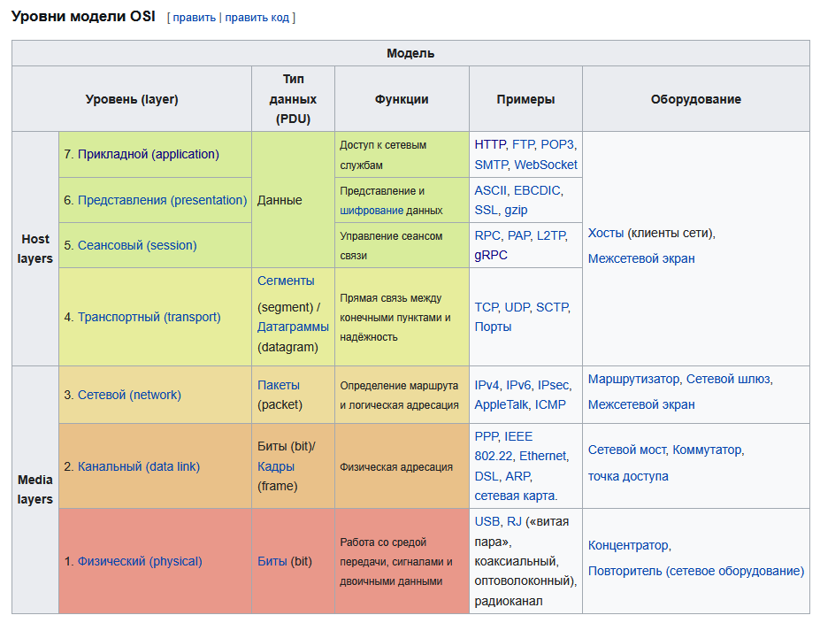
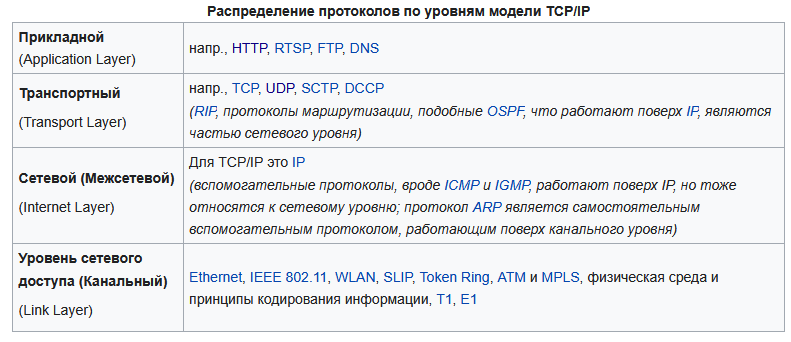
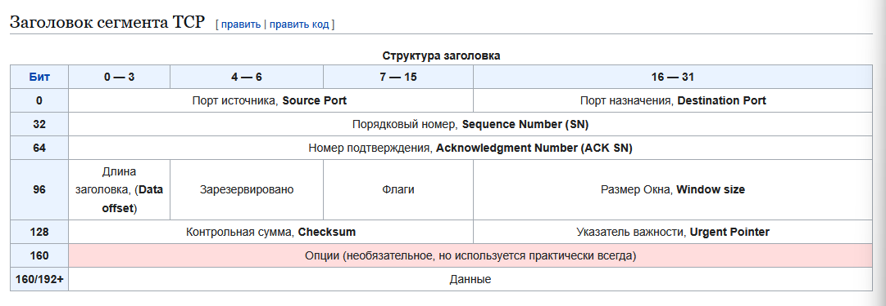
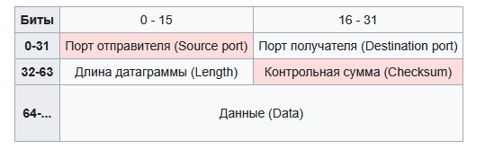
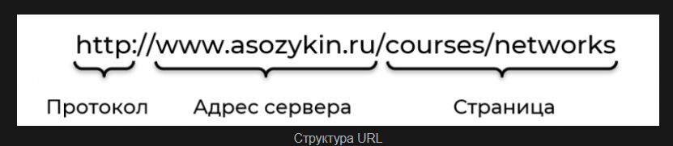
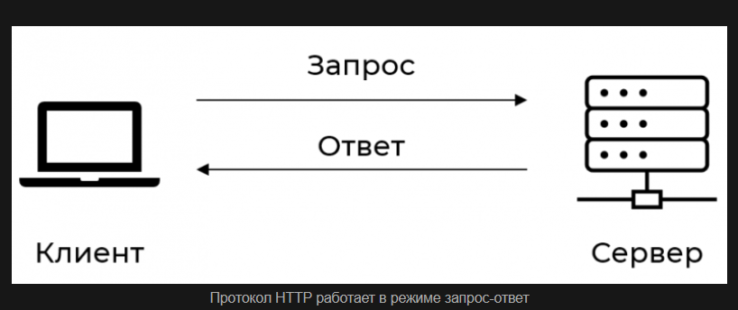
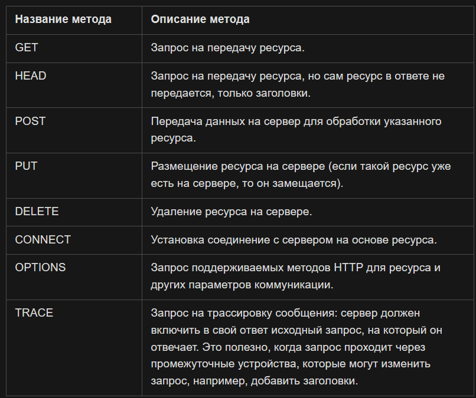
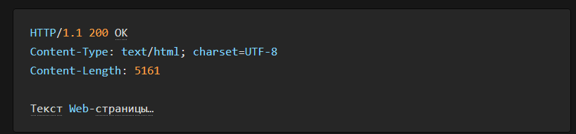

# Основные сетевые понятия

## 1. Сетевая модель OSI

Сетевая модель **OSI (The Open Systems Interconnection model)** — сетевая модель стека сетевых протоколов OSI/ISO. Посредством данной модели различные сетевые устройства могут взаимодействовать друг с другом. Модель определяет различные уровни взаимодействия систем. Каждый уровень выполняет определенные функции при таком взаимодействии.

Модель OSI была разработана в конце 1970-х годов для поддержания разнообразных методов компьютерных сетей, которые в это время конкурировали за применение в крупных национальных сетевых взаимодействиях. В 1980-х годах она стала рабочим продуктом группы взаимодействия открытых систем **Международной организации по стандартизации (ISO)**. Модель не смогла дать полное описание сети и не получила поддержку архитекторов на заре Интернета, который впоследствии нашёл отражение в менее предписывающем **TCP/IP**, в основном под руководством **Инженерного совета Интернета (IETF)**.

### Основные принципы

Протоколы связи позволяют структуре на одном хосте взаимодействовать с соответствующей структурой того же уровня на другом хосте.

На каждом уровне N два объекта обмениваются **блоками данных (PDU)** с помощью протокола данного уровня на соответствующих устройствах. Каждый PDU содержит **блок служебных данных (SDU)**, связанный с верхним или нижним протоколом.

Обработка данных двумя взаимодействующими OSI-совместимыми устройствами происходит следующим образом:

1. Передаваемые данные составляются на самом верхнем уровне передающего устройства (уровень N) в протокольный блок данных (PDU).
2. PDU передается на уровень N-1, где он становится **сервисным блоком данных (SDU)**.
3. На уровне N-1 SDU объединяется с верхним, нижним или обоими уровнями, создавая слой N-1 PDU. Затем он передается в слой N-2.
4. Процесс продолжается до достижения самого нижнего уровня, с которого данные передаются на принимающее устройство.
5. На приемном устройстве данные передаются от самого низкого уровня к самому высокому в виде серии SDU, последовательно удаляясь из верхнего или нижнего колонтитула каждого слоя до достижения самого верхнего уровня, где принимаются последние данные.

### Уровни модели OSI



Любой протокол модели OSI должен взаимодействовать либо с протоколами своего уровня, либо с протоколами на единицу выше и/или ниже своего уровня. Взаимодействия с протоколами своего уровня называются **горизонтальными**, а с уровнями на единицу выше или ниже — **вертикальными**. Любой протокол модели OSI может выполнять только функции своего уровня и не может выполнять функций другого уровня, что не выполняется в протоколах альтернативных моделей.

Каждому уровню с некоторой долей условности соответствует свой **операнд** — логически неделимый элемент данных, которым на отдельном уровне можно оперировать в рамках модели и используемых протоколов: на физическом уровне мельчайшая единица — **бит**, на канальном уровне информация объединена в **кадры**, на сетевом — в **пакеты** (датаграммы), на транспортном — в **сегменты**. Любой фрагмент данных, логически объединенных для передачи — кадр, пакет, датаграмма — считается **сообщением**. Именно сообщения в общем виде являются операндами сеансового, представления и прикладного уровней.

К базовым сетевым технологиям относятся физический и канальный уровни.

### Физический уровень

**Физический уровень (англ. physical layer)** — нижний уровень модели, который определяет метод передачи данных, представленных в двоичном виде, от одного устройства (компьютера) к другому. Осуществляет передачу электрических или оптических сигналов в кабель или в радиоэфир и, соответственно, их приём и преобразование в биты данных в соответствии с методами кодирования цифровых сигналов.

На этом уровне работают концентраторы, повторители сигнала и медиаконвертеры.

Функции физического уровня реализуются на всех устройствах, подключенных к сети. Со стороны компьютера функции физического уровня выполняются сетевым адаптером или последовательным портом. К физическому уровню относятся физические, электрические и механические интерфейсы между двумя системами. Физический уровень определяет такие виды сред передачи данных как оптоволокно, витая пара, коаксиальный кабель, спутниковый канал передач данных и т. п.

Стандартными типами сетевых интерфейсов, относящимися к физическому уровню, являются: V.35, RS-232, RS-485, RJ-11, RJ-45, разъемы AUI и BNC.

При разработке стеков протоколов на этом уровне решаются задачи синхронизации и линейного кодирования. К таким способам кодирования относится код NRZ, код RZ, MLT-3, PAM5, Манчестер II.

Протоколы физического уровня: IEEE 802.15 (Bluetooth), IRDA, EIA RS-232, EIA-422, EIA-423, RS-449, RS-485, DSL, ISDN, SONET/SDH, 802.11 Wi-Fi, Etherloop, GSM Um radio interface, ряд протоколов МСЭ-Т G.hn, TransferJet, ARINC 818, G.hn/G.9960, Modbus Plus.

> **Зачем это Go-разработчику.** На практике вы редко соприкасаетесь с физическим уровнем напрямую, но понимание среды передачи важно при поиске причин задержек, потери пакетов и проблем с пропускной способностью. При развёртывании серверов знание различий между оптоволокном и медью помогает оценить задержки.

### Канальный уровень

**Канальный уровень (англ. data link layer)** предназначен для обеспечения взаимодействия сетей на физическом уровне и контроля ошибок, которые могут возникнуть. Полученные с физического уровня данные, представленные в битах, он упаковывает в кадры, проверяет их на целостность и, если нужно, исправляет ошибки (либо формирует повторный запрос поврежденного кадра) и отправляет на сетевой уровень. Канальный уровень может взаимодействовать с одним или несколькими физическими уровнями, контролируя и управляя этим взаимодействием.

На этом уровне работают коммутаторы, мосты и другие устройства. При разработке стеков протоколов на этом уровне решаются задачи помехоустойчивого кодирования.

Спецификация IEEE 802 разделяет этот уровень на два подуровня:

* **MAC (Media Access Control)** — регулирует доступ к разделяемой физической среде. Отвечает за адресацию на уровне физических устройств через **MAC-адрес** — уникальный 48-битный идентификатор сетевого интерфейса.
* **LLC (Logical Link Control)** — обеспечивает обслуживание сетевого уровня, мультиплексирование протоколов и контроль потока.

Протоколы канального уровня: ARCnet, ATM, Controller Area Network (CAN), Econet, IEEE 802.3 (Ethernet), Ethernet Automatic Protection Switching (EAPS), Fiber Distributed Data Interface (FDDI), Frame Relay, High-Level Data Link Control (HDLC), IEEE 802.2, Link Access Procedures D channel (LAPD), IEEE 802.11 wireless LAN, LocalTalk, Multiprotocol Label Switching (MPLS), Point-to-Point Protocol (PPP), Point-to-Point Protocol over Ethernet (PPPoE), Serial Line Internet Protocol (SLIP, устарел), StarLan, Token ring, Unidirectional Link Detection (UDLD), X.25, ARP.

В программировании этот уровень представляет **драйвер сетевой платы**, в операционных системах имеется программный интерфейс взаимодействия канального и сетевого уровней между собой. Примеры таких интерфейсов: ODI, NDIS, UDI.

> **Зачем это Go-разработчику.** На этом уровне живёт **ARP** — протокол, преобразующий IP-адреса в MAC-адреса. Понимание ARP-таблиц и MAC-адресации полезно при отладке сетевых проблем на низком уровне. В Go прямой доступ к канальному уровню возможен через пакет `syscall` и библиотеки типа `gopacket`.

### Сетевой уровень

**Сетевой уровень (англ. network layer)** модели предназначен для определения пути передачи данных. Отвечает за трансляцию логических адресов и имён в физические, определение кратчайших маршрутов, отслеживание неполадок и «заторов» в сети. Протоколы сетевого уровня маршрутизируют данные от источника к получателю.

На этом уровне работают маршрутизаторы. Ключевой протокол — **IP (Internet Protocol)**, который обеспечивает логическую адресацию (IP-адреса) и фрагментацию пакетов.

Протоколы сетевого уровня: IP/IPv4/IPv6 (Internet Protocol), IPX (Internetwork Packet Exchange), X.25 (частично реализован на уровне 2), CLNP (сетевой протокол без организации соединений), IPsec (Internet Protocol Security).

Протоколы маршрутизации: RIP (Routing Information Protocol), OSPF (Open Shortest Path First), BGP (Border Gateway Protocol).

> **Зачем это Go-разработчику.** Сетевой уровень — то, с чем вы работаете постоянно: IP-адреса, CIDR-нотация, маршруты. В Go пакет `net` предоставляет функции для разрешения имён (`net.LookupHost`), парсинга IP (`net.ParseIP`), работы с подсетями (`net.IPNet`). Понимание сетевого уровня необходимо для конфигурации серверов и диагностики связности.

### Транспортный уровень

**Транспортный уровень (англ. transport layer)** модели предназначен для обеспечения надежной передачи данных от отправителя к получателю. При этом уровень надежности может варьироваться в широких пределах. Существует множество классов протоколов транспортного уровня, начиная от протоколов, предоставляющих только основные транспортные функции (например, функции передачи данных без подтверждения приема), и заканчивая протоколами, которые гарантируют доставку в пункт назначения нескольких пакетов данных в надлежащей последовательности, мультиплексируют несколько потоков данных, обеспечивают механизм управления потоками данных и гарантируют достоверность принятых данных.

Ключевые протоколы: **TCP** (гарантированная доставка с соединением) и **UDP** (быстрая доставка без гарантий). Подробно они рассмотрены в разделе 6.

Протоколы транспортного уровня: ATP (AppleTalk Transaction Protocol), CUDP (Cyclic UDP), DCCP (Datagram Congestion Control Protocol), FCP (Fibre Channel Protocol), IL (IL Protocol), NBF (NetBIOS Frames protocol), NCP (NetWare Core Protocol), SCTP (Stream Control Transmission Protocol), SPX (Sequenced Packet Exchange), SST (Structured Stream Transport), TCP (Transmission Control Protocol), UDP (User Datagram Protocol).

> **Зачем это Go-разработчику.** Это ваш основной рабочий уровень. В Go TCP-сервер создаётся через `net.Listen("tcp", ":8080")`, UDP — через `net.ListenPacket("udp", ":8080")`. Понимание гарантий доставки, буферизации и управления потоком напрямую влияет на архитектуру ваших сервисов.

### Сеансовый уровень

**Сеансовый уровень (англ. session layer)** модели обеспечивает поддержание сеанса связи, позволяя приложениям взаимодействовать между собой длительное время. Уровень управляет созданием/завершением сеанса, обменом информацией, синхронизацией задач, определением права на передачу данных и поддержанием сеанса в периоды неактивности приложений.

Протоколы сеансового уровня: H.245 (Call Control Protocol for Multimedia Communication), ISO-SP (OSI Session Layer Protocol (X.225, ISO 8327)), iSNS (Internet Storage Name Service), L2F (Layer 2 Forwarding Protocol), L2TP (Layer 2 Tunneling Protocol), NetBIOS (Network Basic Input Output System), PAP (Password Authentication Protocol), PPTP (Point-to-Point Tunneling Protocol), RPC (Remote Procedure Call Protocol), RTCP (Real-time Transport Control Protocol), SMPP (Short Message Peer-to-Peer), SCP (Session Control Protocol), ZIP (Zone Information Protocol), SDP (Sockets Direct Protocol).

> **Зачем это Go-разработчику.** В TCP/IP сеансовый уровень встроен в прикладной. В Go концепция сессии проявляется в cookie-менеджменте HTTP, WebSocket-соединениях, gRPC-стримах. Пакеты `net/http` и `gorilla/sessions` реализуют сессионную логику на прикладном уровне.

### Уровень представления

**Уровень представления (англ. presentation layer)** обеспечивает преобразование протоколов и кодирование/декодирование данных. Запросы приложений, полученные с прикладного уровня, на уровне представления преобразуются в формат для передачи по сети, а полученные из сети данные преобразуются в формат приложений. На этом уровне может осуществляться сжатие/распаковка или шифрование/дешифрование, а также перенаправление запросов другому сетевому ресурсу, если они не могут быть обработаны локально.

Уровень представлений обычно представляет собой промежуточный протокол для преобразования информации из соседних уровней. Это позволяет осуществлять обмен между приложениями на разнородных компьютерных системах прозрачным для приложений образом. Уровень представлений обеспечивает форматирование и преобразование кода.

Другой функцией, выполняемой на уровне представлений, является шифрование данных, которое применяется в тех случаях, когда необходимо защитить передаваемую информацию от доступа несанкционированными получателями. На этом уровне существуют и другие подпрограммы, которые сжимают тексты и преобразовывают графические изображения в битовые потоки.

Стандарты уровня представлений также определяют способы представления графических изображений и звука. Для изображений могут использоваться форматы PICT, TIFF или JPEG, а для звука — MPEG, QuickTime и т.д.

Протоколы уровня представления: AFP (Apple Filing Protocol), ICA (Independent Computing Architecture), LPP (Lightweight Presentation Protocol), NCP (NetWare Core Protocol), NDR (Network Data Representation), XDR (eXternal Data Representation), X.25 PAD (Packet Assembler/Disassembler Protocol).

> **Зачем это Go-разработчику.** В TCP/IP этот уровень слит с прикладным. В Go сериализация (JSON, Protobuf, XML), сжатие (gzip) и шифрование (TLS) — это функции уровня представления. Пакет `encoding/json`, `google.golang.org/protobuf` и `crypto/tls` — ваши инструменты для этого уровня.

### Прикладной уровень

**Прикладной уровень (англ. application layer)** — верхний уровень модели, обеспечивающий взаимодействие пользовательских приложений с сетью:

* позволяет приложениям использовать сетевые службы: удалённый доступ к файлам и базам данных, пересылка электронной почты;
* отвечает за передачу служебной информации;
* предоставляет приложениям информацию об ошибках;
* формирует запросы к уровню представления.

Протоколы прикладного уровня: RDP, HTTP, SMTP, SNMP, POP3, FTP, XMPP, OSCAR, Modbus, SIP, TELNET и другие.

Определения протокола прикладного уровня и уровня представления очень размыты, и принадлежность протокола к тому или иному уровню, например, протокола HTTPS, зависит от конечного сервиса, который предоставляет приложение.

> **Зачем это Go-разработчику.** Это ваш основной уровень разработки. HTTP-серверы (`net/http`), gRPC-сервисы, клиенты к базам данных, очереди сообщений — всё это прикладной уровень. Вы определяете протоколы взаимодействия и форматы данных.

***

## 2. Сетевая модель TCP/IP

**TCP/IP** — сетевая модель передачи данных, представленных в цифровом виде. Модель описывает способ передачи данных от источника информации к получателю. В модели предполагается прохождение информации через четыре уровня, каждый из которых описывается **правилом (протоколом передачи)**. Наборы правил, решающих задачу по передаче данных, составляют стек протоколов передачи данных, на которых базируется Интернет. Название TCP/IP происходит из двух важнейших протоколов семейства — **Transmission Control Protocol (TCP)** и **Internet Protocol (IP)**, которые были первыми разработаны и описаны в данном стандарте.

Стек протоколов TCP/IP включает в себя четыре уровня:

* **канальный уровень (Link Layer)**;
* **межсетевой уровень (Internet Layer)**;
* **транспортный уровень (Transport Layer)**;
* **прикладной уровень (Application Layer)**.

Протоколы этих уровней полностью реализуют функциональные возможности модели OSI. На стеке протоколов TCP/IP построено всё взаимодействие пользователей в IP-сетях. Стек является независимым от физической среды передачи данных, благодаря чему, в частности, обеспечивается полностью прозрачное взаимодействие между проводными и беспроводными сетями.



### Канальный уровень

**Канальный уровень (Link layer)** описывает способ кодирования данных для передачи пакета данных на физическом уровне (то есть специальные последовательности бит, определяющих начало и конец пакета данных, а также обеспечивающие помехоустойчивость). Ethernet, например, в полях заголовка пакета содержит указание того, какой машине или машинам в сети предназначен этот пакет.

Канальный уровень иногда разделяют на 2 подуровня — **подуровень управления доступом к среде** (MAC, Media Access Control) и **подуровень управления логической связью** (LLC, Logical Link Control).

Примеры протоколов: Ethernet, IEEE 802.11 (WLAN), SLIP, Token Ring, ATM и MPLS. PPP не совсем вписывается в такое определение, поэтому обычно описывается в виде пары протоколов HDLC/SDLC. MPLS занимает промежуточное положение между канальным и сетевым уровнем и, строго говоря, его нельзя отнести ни к одному из них.

Канальный уровень также описывает среду передачи данных (коаксиальный кабель, витая пара, оптическое волокно или радиоканал), физические характеристики такой среды и принцип передачи данных (разделение каналов, модуляцию, амплитуду сигналов, частоту сигналов, способ синхронизации передачи, время ожидания ответа и максимальное расстояние).

При проектировании стека протоколов на канальном уровне рассматривают помехоустойчивое кодирование — позволяющее обнаруживать и исправлять ошибки в данных вследствие воздействия шумов и помех на канал связи.

> **Зачем это Go-разработчику.** Этот уровень абстрагирован сетевым стеком ОС и редко требует прямого вмешательства. Однако при работе с высоконагруженными серверами параметры канального уровня (MTU, фрагментация) могут влиять на производительность TCP-соединений.

### Межсетевой уровень

**Межсетевой уровень (Internet layer)** изначально разработан для передачи данных из одной сети в другую. На этом уровне работают маршрутизаторы, которые перенаправляют пакеты в нужную сеть путём расчёта адреса сети по маске сети. Примерами такого протокола является X.25 и IPC в сети ARPANET.

С развитием концепции глобальной сети в уровень были внесены дополнительные возможности по передаче из любой сети в любую сеть, независимо от протоколов нижнего уровня, а также возможность запрашивать данные от удалённой стороны, например в протоколе ICMP (используется для передачи диагностической информации IP-соединения) и IGMP (используется для управления multicast-потоками).

ICMP и IGMP расположены над IP и должны попасть на следующий — транспортный — уровень, но функционально являются протоколами сетевого уровня, и поэтому их невозможно вписать в модель OSI.

Пакеты сетевого протокола IP могут содержать код, указывающий, какой именно протокол следующего уровня нужно использовать, чтобы извлечь данные из пакета. Это число — уникальный **IP-номер протокола**. ICMP и IGMP имеют номера, соответственно, 1 и 2.

К этому уровню относятся: DVMRP, ICMP, IGMP, MARS, PIM, RIP, RIP2, RSVP.

> **Зачем это Go-разработчику.** Ключевой уровень для понимания маршрутизации. В Go пакет `net` работает с IP-адресами и CIDR. ICMP (ping) доступен через `golang.org/x/net/icmp`. Диагностика сетевых проблем начинается именно с этого уровня.

### Транспортный уровень

Протоколы **транспортного уровня (Transport layer)** могут решать проблему негарантированной доставки сообщений, а также гарантировать правильную последовательность прихода данных. В стеке TCP/IP транспортные протоколы определяют, для какого именно приложения предназначены эти данные.

Протоколы автоматической маршрутизации, логически представленные на этом уровне (поскольку работают поверх IP), на самом деле являются частью протоколов сетевого уровня; например OSPF. На этом уровне работают TCP и UDP. И TCP, и UDP используют для определения протокола верхнего уровня число, называемое **портом**.

> **Зачем это Go-разработчику.** Транспортный уровень — ваш главный инструмент. TCP для надёжных соединений (HTTP, gRPC, базы данных), UDP для быстрых и loss-tolerant сервисов (DNS, стриминг, игры). В Go: `net.Dial("tcp", "host:port")` и `net.Dial("udp", "host:port")`.

### Прикладной уровень

На **прикладном уровне (Application layer)** работает большинство сетевых приложений. Эти программы имеют свои собственные протоколы обмена информацией, например, Интернет-браузер для протокола HTTP, ftp-клиент для протокола FTP (передача файлов), почтовая программа для протокола SMTP (электронная почта), SSH (безопасное соединение с удалённой машиной), DNS (преобразование символьных имён в IP-адреса) и многие другие.

В массе своей эти протоколы работают поверх TCP или UDP и привязаны к определённому порту, например HTTP на TCP-порт 80 или 8080.

К этому уровню относятся: Echo, Finger, Gopher, HTTP, HTTPS, IMAP, IMAPS, IRC, NNTP, NTP, POP3, POPS, QOTD, RTSP, SNMP, SSH, Telnet, XDMCP.

> **Зачем это Go-разработчику.** Весь ваш код работает на этом уровне. HTTP-сервер на `net/http`, gRPC на `google.golang.org/grpc`, WebSocket на `gorilla/websocket` — всё это прикладной уровень. Понимание нижележащих уровней помогает проектировать устойчивые и производительные сервисы.

***

## 3. Сравнение моделей OSI и TCP/IP

Модель OSI — теоретическая, описательная модель из 7 уровней. Она детально разделяет функции, но на практике не реализована полностью. Модель TCP/IP — практическая, реализованная модель из 4 уровней, на которой построен Интернет.

Сопоставление уровней:

| Уровень OSI      | Уровень TCP/IP           | Ключевые протоколы TCP/IP      |
| ---------------- | ------------------------ | ------------------------------ |
| 7. Прикладной    | Прикладной (Application) | HTTP, FTP, DNS, SMTP, SSH      |
| 6. Представления | Прикладной               | TLS, MIME, кодировки           |
| 5. Сеансовый     | Прикладной               | RPC, NetBIOS (поверх TCP)      |
| 4. Транспортный  | Транспортный (Transport) | TCP, UDP, SCTP                 |
| 3. Сетевой       | Межсетевой (Internet)    | IP, ICMP, IGMP, IPSec          |
| 2. Канальный     | Канальный (Link)         | Ethernet, ARP, PPP             |
| 1. Физический    | Канальный (Link)         | Спецификации кабелей, сигналов |

Ключевые различия:

* **OSI** разделяет прикладной, представления и сеансовый уровни (7, 6, 5) — в **TCP/IP** всё это объединено в один прикладной уровень, где каждый протокол сам решает вопросы форматирования и сессий.
* **OSI** разделяет канальный и физический уровни (2, 1) — в **TCP/IP** это один канальный уровень, абстрагированный от физической среды.
* **OSI** предписывает строгое вертикальное взаимодействие — **TCP/IP** допускает «перепрыгивание» (например, ICMP работает поверх IP, но функционально относится к сетевому уровню).
* **OSI** — модель «до реализации» (сначала стандарт, потом имплементация). **TCP/IP** — модель «после реализации» (сначала работающий код, потом формализация).

На практике при обсуждении сетей часто используют терминологию OSI («это проблема на третьем уровне», «L2-коммутатор», «L7-балансировщик»), но работают по модели TCP/IP.

> **Зачем это Go-разработчику.** Понимание различий помогает читать техническую документацию: когда говорят «L4-балансировщик» — это TCP/UDP уровни, «L7-балансировщик» — это HTTP/gRPC. В Go вы работаете преимущественно на L4 (net) и L7 (net/http). Знание того, где заканчивается один уровень и начинается другой, помогает быстрее локализовать проблемы.

***

## 4. IP-адресация

IP-адресация — фундамент сетевого взаимодействия. Каждое устройство в IP-сети идентифицируется **IP-адресом**. Наиболее распространён **IPv4**, постепенно внедряется **IPv6**.

### IPv4

**IPv4-адрес** — 32-битное число, записываемое как четыре десятичных октета через точку: `192.168.1.1`. Каждый октет — 8 бит, диапазон значений от 0 до 255.

Адрес делится на две логические части: **адрес сети** (network) и **адрес хоста** (host). Граница между ними задаётся **маской подсети**.

#### Маска подсети и CIDR

**Маска подсети** определяет, сколько бит адреса отводится под сеть, а сколько — под хост. Записывается двумя способами:

* Классическая запись: `255.255.255.0`
* **CIDR-нотация (Classless Inter-Domain Routing)**: `/24` (первые 24 бита — сеть, оставшиеся 8 — хост)

| CIDR | Маска           | Хостов в сети | Пример сети     |
| ---- | --------------- | ------------- | --------------- |
| /8   | 255.0.0.0       | 16 777 214    | 10.0.0.0/8      |
| /16  | 255.255.0.0     | 65 534        | 192.168.0.0/16  |
| /24  | 255.255.255.0   | 254           | 192.168.1.0/24  |
| /32  | 255.255.255.255 | 1             | Конкретный хост |

**Адрес сети** — первый адрес диапазона (все биты хоста = 0). **Broadcast-адрес** — последний (все биты хоста = 1). Они не назначаются устройствам.

#### Классы адресов (исторически)

До CIDR адреса делились на классы:

| Класс | Диапазон                    | Маска по умолчанию | Назначение      |
| ----- | --------------------------- | ------------------ | --------------- |
| A     | 1.0.0.0 – 126.255.255.255   | /8                 | Крупные сети    |
| B     | 128.0.0.0 – 191.255.255.255 | /16                | Средние сети    |
| C     | 192.0.0.0 – 223.255.255.255 | /24                | Малые сети      |
| D     | 224.0.0.0 – 239.255.255.255 | —                  | Multicast       |
| E     | 240.0.0.0 – 255.255.255.255 | —                  | Зарезервировано |

С введением CIDR классовая адресация устарела, но понимание классов остаётся полезным.

### Публичные и частные адреса

**Публичные (глобальные) адреса** маршрутизируются в Интернете и уникальны во всём мире. Выдаются региональными интернет-регистраторами.

**Частные (private) адреса** не маршрутизируются в Интернете и используются внутри локальных сетей. Определены в RFC 1918:

| Диапазон                      | CIDR           | Размер      |
| ----------------------------- | -------------- | ----------- |
| 10.0.0.0 – 10.255.255.255     | 10.0.0.0/8     | 16M адресов |
| 172.16.0.0 – 172.31.255.255   | 172.16.0.0/12  | 1M адресов  |
| 192.168.0.0 – 192.168.255.255 | 192.168.0.0/16 | 65K адресов |

### Специальные адреса IPv4

| Адрес           | Назначение                                                      |
| --------------- | --------------------------------------------------------------- |
| 127.0.0.0/8     | Loopback — отправка «самому себе». `127.0.0.1` (localhost)      |
| 0.0.0.0         | «Любой адрес» — слушать все интерфейсы, или «неизвестный адрес» |
| 255.255.255.255 | Limited broadcast — всем в текущей сети                         |
| 169.254.0.0/16  | Link-local — автоматическая самоприсвоенная адресация (APIPA)   |

### IPv6

**IPv6** — 128-битный адрес, записывается как 8 групп по 4 шестнадцатеричных символа через двоеточие: `2001:0db8:85a3:0000:0000:8a2e:0370:7334`. Можно сокращать (ведущие нули и одна группа нулей `::`): `2001:db8:85a3::8a2e:370:7334`.

Основные мотивации перехода на IPv6:

* **Расширение адресного пространства**: 2¹²⁸ ≈ 3,4 × 10³⁸ против 2³² (~4,3 млрд) в IPv4.
* **Упрощение заголовка**: фиксированный 40-байтный заголовок против переменного в IPv4.
* **Встроенная безопасность**: IPsec обязателен.
* **Автоконфигурация**: SLAAC (Stateless Address Autoconfiguration) — устройства сами назначают себе адреса.
* **Отказ от NAT**: достаточно адресов для сквозной адресации.

Типы IPv6-адресов:

| Тип              | Префикс   | Аналог в IPv4       |
| ---------------- | --------- | ------------------- |
| Unicast (Global) | 2000::/3  | Публичный IP        |
| Unique Local     | fc00::/7  | Private IP          |
| Link-Local       | fe80::/10 | 169.254.0.0/16      |
| Multicast        | ff00::/8  | Multicast (класс D) |
| Loopback         | ::1       | 127.0.0.1           |

> **Зачем это Go-разработчику.** IP-адресация — ежедневная практика: конфигурация серверов, фаерволы, CORS, вайтлистинг. В Go: `net.ParseIP("192.168.1.1")`, `net.IPv4(192, 168, 1, 1)`, работа с `net.IPNet` для проверки вхождения в подсеть. При проектировании микросервисов нужно понимать, в каких подсетях они живут и как маршрутизируется трафик.

***

## 5. Маршрутизация, NAT и ARP

### Маршрутизация

**Маршрутизация** — процесс определения пути пакета от источника к получателю через промежуточные узлы (маршрутизаторы).

Каждое сетевое устройство имеет **таблицу маршрутизации**, которая сопоставляет сети назначения с интерфейсами и шлюзами:

| Destination         | Gateway     | Interface | Metric |
| ------------------- | ----------- | --------- | ------ |
| 192.168.1.0/24      | 0.0.0.0     | eth0      | 0      |
| 0.0.0.0/0 (default) | 192.168.1.1 | eth0      | 1      |

**Шлюз по умолчанию (default gateway)** — маршрут `0.0.0.0/0`, через который идут все пакеты, не попавшие в более специфичные маршруты. Обычно это IP-адрес роутера в локальной сети.

Протоколы динамической маршрутизации (OSPF, BGP, RIP) автоматически обмениваются маршрутной информацией между роутерами. **BGP (Border Gateway Protocol)** — основной протокол маршрутизации Интернета, связывающий автономные системы (AS).

### NAT

**NAT (Network Address Translation)** — механизм трансляции сетевых адресов, позволяющий устройствам с частными IP-адресами выходить в Интернет через один публичный адрес.

Принцип работы NAT:

1. Устройство в локальной сети (192.168.1.10) отправляет пакет на внешний сервер.
2. Роутер заменяет исходный адрес 192.168.1.10 на свой публичный адрес (например, 203.0.113.5) и запоминает соответствие в **таблице трансляции**.
3. Ответ от внешнего сервера приходит на 203.0.113.5, роутер по таблице находит исходное устройство и пересылает ответ ему.

Типы NAT:

| Тип                                | Описание                                                                   |
| ---------------------------------- | -------------------------------------------------------------------------- |
| **SNAT (Source NAT)**              | Трансляция исходящего адреса — классический NAT для выхода в Интернет      |
| **DNAT (Destination NAT)**         | Трансляция входящего адреса — проброс портов (port forwarding)             |
| **PAT (Port Address Translation)** | Множество локальных устройств за одним публичным IP — разделение по портам |

NAT не является безопасностью как таковой (это не файрвол), но создаёт естественный барьер: внешние устройства не могут инициировать соединение с устройством за NAT без явного проброса портов.

> **Зачем это Go-разработчику.** NAT — причина, по которой ваш локальный сервер на `localhost:8080` не виден в Интернете. Понимание NAT необходимо при настройке серверов, пробросе портов, работе с Docker (docker-proxy), настройке VPN и отладке проблем соединения. В Go при написании P2P-приложений нужно учитывать ограничения NAT и использовать техники обхода (STUN, TURN, ICE).

### ARP

**ARP (Address Resolution Protocol)** — протокол, преобразующий IP-адрес в MAC-адрес устройства в локальной сети. Без ARP устройство знает IP-адрес получателя, но не знает, на какой физический интерфейс отправить кадр.

Принцип работы:

1. Устройство A хочет отправить пакет устройству B (знает его IP, но не MAC).
2. A отправляет широковещательный **ARP-запрос**: «У кого IP 192.168.1.5? Сообщи свой MAC.»
3. B отвечает **ARP-ответом** со своим MAC-адресом напрямую устройству A.
4. A сохраняет пару (IP, MAC) в **ARP-таблицу** (кэш), чтобы не повторять запрос.

ARP работает только в пределах одного широковещательного домена (L2-сегмента). Для связи с устройствами в другой сети используется MAC-адрес шлюза по умолчанию.

> **Зачем это Go-разработчику.** ARP обычно не требует вмешательства, но проблемы с ARP-кэшем (spoofing, starvation) — распространённый вектор атак в локальных сетях. При отладке сетевых проблем в Docker/Kubernetes полезно проверять ARP-таблицу (`arp -a`).

***

## 6. Транспортный уровень: порты, TCP, UDP

### Порты

**Порт** — 16-битное число (0–65535), идентифицирующее конкретное приложение или службу на хосте. Связка **IP-адрес + порт** образует **сокет** — конечную точку сетевого соединения.

Диапазоны портов:

| Диапазон      | Название                         | Назначение                                                |
| ------------- | -------------------------------- | --------------------------------------------------------- |
| 0 – 1023      | Well-known (системные)           | Зарезервированы для стандартных служб (HTTP: 80, SSH: 22) |
| 1024 – 49151  | Registered (пользовательские)    | Регистрируются в IANA, могут использоваться приложениями  |
| 49152 – 65535 | Dynamic/Ephemeral (динамические) | Временные порты для исходящих соединений                  |

Известные порты:

| Порт   | Протокол | Служба                |
| ------ | -------- | --------------------- |
| 20, 21 | TCP      | FTP                   |
| 22     | TCP      | SSH                   |
| 25     | TCP      | SMTP                  |
| 53     | TCP/UDP  | DNS                   |
| 80     | TCP      | HTTP                  |
| 443    | TCP      | HTTPS                 |
| 5432   | TCP      | PostgreSQL            |
| 6379   | TCP      | Redis                 |
| 8080   | TCP      | HTTP (альтернативный) |

Один хост может одновременно обслуживать множество соединений на разных портах. Комбинация (IP-источника, порт источника, IP-назначения, порт назначения, протокол) уникально идентифицирует каждое TCP/UDP-соединение.

> **Зачем это Go-разработчику.** В Go каждое сетевое приложение слушает порт: `http.ListenAndServe(":8080", nil)` — это захват TCP-порта 8080. Конфликты портов, выбор непривилегированных портов (>1024) для пользовательских приложений, настройка фаерволов — ежедневная практика.

### TCP

**TCP (Transmission Control Protocol)** — протокол транспортного уровня, обеспечивающий надёжную, упорядоченную доставку потока байт с предварительной установкой соединения.



#### Установка соединения: тройное рукопожатие

Перед передачей данных TCP устанавливает соединение через **трёхэтапное рукопожатие (three-way handshake)**:

1. **SYN (Synchronization)**: Клиент → Сервер: «Хочу установить соединение, мой начальный номер последовательности — X.»
2. **SYN-ACK**: Сервер → Клиент: «Принял, мой номер последовательности — Y, подтверждаю твой X.»
3. **ACK (Acknowledgment)**: Клиент → Сервер: «Принял твой Y, соединение установлено.»

После этого начинается передача данных.

#### Гарантии TCP

* **Гарантированная доставка**: каждый сегмент подтверждается (ACK). Если подтверждение не пришло — сегмент переотправляется.
* **Сохранение порядка**: сегменты нумеруются, получатель восстанавливает исходный порядок.
* **Контроль потока (Flow Control)**: через **скользящее окно (sliding window)** получатель сообщает отправителю, сколько данных готов принять. Предотвращает переполнение буфера.
* **Контроль перегрузки (Congestion Control)**: отправитель адаптирует скорость под пропускную способность сети (алгоритмы: slow start, congestion avoidance, fast retransmit).

#### Завершение соединения

Четырёхэтапное завершение (FIN от каждой стороны + ACK):

1. FIN от инициатора → ACK от получателя
2. FIN от получателя → ACK от инициатора

Реализации TCP обычно встроены в ядра ОС. Существуют реализации TCP, работающие в пространстве пользователя.

> **Зачем это Go-разработчику.** TCP — ваш основной транспортный протокол. В Go: `net.Dial("tcp", "host:port")` для клиента, `net.Listen("tcp", ":port")` для сервера. Понимание рукопожатия важно для оценки latency (один RTT или Round-Trip Time на установку соединения), а знание завершения соединения — для обработки gracefully shutdown в `net/http.Server.Shutdown()`.

### UDP

**UDP (User Datagram Protocol)** — протокол транспортного уровня без установки соединения, без гарантий доставки и порядка.



UDP использует простую модель передачи, без явных «рукопожатий» для обеспечения надежности, упорядочивания или целостности данных. Датаграммы могут прийти не по порядку, дублироваться или вовсе исчезнуть без следа, но гарантируется, что если они придут, то в целостном состоянии. UDP подразумевает, что проверка ошибок и исправление либо не нужны, либо должны исполняться в приложении.

**Сценарии применения UDP:**

* DNS-запросы (маленькие, помещаются в одну датаграмму, потеря — просто повтор).
* Потоковое мультимедиа (IPTV, VoIP) — сбросить пакет лучше, чем ждать переотправки.
* Онлайн-игры — состояние быстро устаревает.
* DHCP — клиент ещё не имеет IP, поэтому не может установить TCP-соединение.
* Протоколы туннелирования (VPN).

> **Зачем это Go-разработчику.** UDP в Go: `net.Dial("udp", "host:port")` или `net.ListenPacket("udp", ":port")`. Используется для DNS-клиентов, логирования (syslog), метрик (StatsD), игровых серверов. QUIC (HTTP/3) работает поверх UDP. Помните: при использовании UDP вы сами отвечаете за таймауты, ретраи и порядок.

### Сравнение TCP и UDP

| Характеристика      | TCP                                   | UDP                             |
| ------------------- | ------------------------------------- | ------------------------------- |
| Соединение          | Устанавливается (connection-oriented) | Без соединения (connectionless) |
| Надёжность          | Гарантированная доставка              | Не гарантирована                |
| Порядок             | Сохраняется                           | Не сохраняется                  |
| Скорость            | Ниже (накладные расходы)              | Выше (минимальный заголовок)    |
| Заголовок           | 20–60 байт                            | 8 байт                          |
| Поток/границы       | Поток байт (stream)                   | Границы сообщений (datagram)    |
| Применение          | HTTP, gRPC, БД, SSH, почта            | DNS, VoIP, стриминг, игры, DHCP |
| Контроль перегрузки | Есть                                  | Нет (реализуется в приложении)  |

> **Зачем это Go-разработчику.** Выбор TCP vs UDP — архитектурное решение. TCP для всего, где целостность важнее скорости. UDP для real-time и loss-tolerant сценариев. В Go оба протокола используют схожий API через `net.Conn`, что упрощает смену транспорта.

***

## 7. DNS

**DNS (Domain Name System)** — компьютерная распределённая система для получения информации о доменах. Чаще всего используется для получения IP-адреса по имени хоста, получения информации о маршрутизации почты и/или обслуживающих узлах для протоколов в домене (SRV-запись).

Распределенная база данных DNS поддерживается с помощью **иерархии DNS-серверов**, взаимодействующих по определённому протоколу.

### Иерархия доменов

Доменное имя состоит из уровней, разделённых точкой, и читается справа налево:

`www.example.com.`

* `.` — корневой домен (root), обычно опускается.
* `com` — **домен верхнего уровня (TLD, Top-Level Domain)**.
* `example` — домен второго уровня.
* `www` — поддомен (домен третьего уровня).

TLD бывают:

* **gTLD (generic)**: `.com`, `.org`, `.net`, `.gov`, `.edu`
* **ccTLD (country-code)**: `.ru`, `.uk`, `.de`, `.jp`
* **New gTLD**: `.app`, `.dev`, `.blog`, `.tech`

### Зоны и делегирование

Каждый сервер, отвечающий за имя, может передать ответственность за дальнейшую часть домена другому серверу (с административной точки зрения — другой организации или человеку), что позволяет возложить ответственность за актуальность информации на серверы различных организаций, отвечающих только за «свою» часть доменного имени. Этот механизм называется **делегированием**.

**Зона** — часть доменного пространства, за которую отвечает конкретный DNS-сервер. Зона `example.com` может включать записи `www.example.com`, `mail.example.com`, но делегировать `dev.example.com` на другой сервер.

### Процесс разрешения (Resolution)

Когда вы вводите `www.example.com` в браузере, происходит **рекурсивное разрешение**:

1. Клиент → **DNS-резолвер** (обычно ваш роутер или публичный DNS вроде `8.8.8.8`): «Какой IP у [www.example.com?»](http://www.example.com?»)
2. Резолвер → **Корневой сервер**: «Кто отвечает за .com?»
3. Корневой сервер → Резолвер: «Спроси у TLD-серверов .com, вот их адреса.»
4. Резолвер → **TLD-сервер .com**: «Кто отвечает за example.com?»
5. TLD-сервер → Резолвер: «Спроси у authoritative-серверов example.com, вот их адреса.»
6. Резолвер → **Authoritative-сервер example.com**: «Какой IP у [www.example.com?»](http://www.example.com?»)
7. Authoritative-сервер → Резолвер: «Вот A-запись: 93.184.216.34, TTL = 3600.»
8. Резолвер → Клиент: «93.184.216.34.»

Результат кэшируется на каждом уровне на время **TTL (Time To Live)**.

### Типы DNS-записей

| Тип записи                   | Назначение                                  | Пример                                                   |
| ---------------------------- | ------------------------------------------- | -------------------------------------------------------- |
| **A** (Address)              | IPv4-адрес для домена                       | `example.com. A 93.184.216.34`                           |
| **AAAA** (Quad-A)            | IPv6-адрес для домена                       | `example.com. AAAA 2606:2800:220:1:248:1893:25c8:1946`   |
| **CNAME** (Canonical Name)   | Алиас (псевдоним) для другого домена        | `www.example.com. CNAME example.com.`                    |
| **MX** (Mail Exchange)       | Почтовый сервер для домена                  | `example.com. MX 10 mail.example.com.`                   |
| **NS** (Name Server)         | DNS-сервер, обслуживающий зону              | `example.com. NS ns1.example.com.`                       |
| **TXT** (Text)               | Произвольный текст (SPF, DKIM, верификация) | `example.com. TXT "v=spf1 ..."`                          |
| **SRV** (Service)            | Сервер для конкретного сервиса              | `_sip._tcp.example.com. SRV 10 60 5060 sip.example.com.` |
| **PTR** (Pointer)            | Обратная запись: IP → имя (reverse DNS)     | `34.216.184.93.in-addr.arpa. PTR example.com.`           |
| **SOA** (Start of Authority) | Административная информация о зоне          | Содержит primary NS, email админа, serial                |

> **Зачем это Go-разработчику.** DNS — критическая зависимость любого веб-сервиса. В Go: `net.LookupHost("example.com")`, `net.LookupMX("example.com")`, `net.LookupTXT("example.com")`. Настройка DNS для своих сервисов (A/AAAA/CNAME-записи), верификация доменов через TXT-записи, настройка почты через MX — постоянная практика. Медленный DNS = медленный сервис.

***

## 8. HTTP

**HTTP (Hypertext Transfer Protocol)** — сетевой протокол прикладного уровня, который изначально предназначался для получения с серверов гипертекстовых документов в формате HTML, а с течением времени стал универсальным средством взаимодействия между узлами как Всемирной паутины, так и изолированных веб-инфраструктур.

Определение по основным документациям: HTTP — протокол уровня приложений для распределённых, объединённых, гипермедийных информационных систем.

На транспортном уровне HTTP использует протокол TCP (кроме HTTP/3, в котором применяется QUIC), порт Web-сервера по умолчанию: 80.

### URL

**URL (Uniform Resource Locator)** — единообразный определитель местонахождения ресурса. Именно URL используется для того, чтобы указать, к какой странице мы хотим получить доступ.



URL состоит из трёх основных частей:

* Название протокола, в примере на рисунке протокол HTTP.
* Адрес сервера, на котором размещен ресурс. Можно использовать IP-адрес или доменное имя. Адрес сервера отделяется от названия протокола двоеточием и двумя слешами.
* Адрес ресурса на сервере. Это может быть HTML-страница, изображение, видео или ресурс другого типа. В примере на рисунке адрес страницы: `/courses/networks`.

В URL не обязательно использовать только протокол HTTP:

* `https://ya.ru`
* `ftp://example.com`

Также URL не обязательно должен указывать на HTML-страницы:

* Текст: `https://www.ietf.org/rfc/rfc959.txt`
* Изображение: `https://habr.com/img/maskable_icon.png`

URL может включать достаточно большое количество других компонентов, кроме протокола, адреса сервера и адреса ресурса. Более подробно о них можно почитать в документе RFC 1738, Uniform Resource Locators (URL).

### Модель запрос-ответ

Протокол HTTP работает в режиме запрос-ответ. Клиент, например, браузер, передает на сервер запрос к определенному ресурсу, например, Web-странице. Сервер в ответ отправляет клиенту этот ресурс или сообщение об ошибке, если ресурс передать нельзя.



HTTP/1.1 использует текстовый режим работы, то есть от клиента к серверу и обратно передаются обычные строки. Это просто и удобно для людей, которые могут понять, что именно передается без использования дополнительных инструментов. Однако для компьютеров это не самый удобный формат, т.к. приходится заниматься парсингом строк. Поэтому HTTP/2 и HTTP/3 используют бинарный режим работы.

### Запрос HTTP

Запрос HTTP состоит из трёх основных частей:

* Запрос
* Заголовки (не обязательно)
* Тело сообщения (не обязательно)

Пример простого запроса HTTP в текстовом режиме:


В первой строке указывается сам запрос, который также состоит из трёх частей:

* **Метод HTTP** `GET` — указывает, какое действие требуется выполнить с ресурсом. В примере метод GET говорит о том, что мы хотим получить (загрузить) ресурс.
* **Адрес ресурса** `/courses/networks` — путь к странице на Web-сервере, которую мы хотим загрузить.
* **Версия протокола** `HTTP/1.1`.

Во второй строке указывается заголовок `Host`. Этот заголовок является обязательным в версии HTTP/1.1, в нем задается доменное имя сервера, к которому направлен запрос. Сейчас активно используется **виртуальный хостинг**: один Web-сервер на одном IP-адресе может обслуживать несколько сайтов с разными доменными именами. Чтобы понять, какому именно сайту предназначен запрос, нужно указать доменное имя сайта в заголовке Host.

В HTTP используется следующий **формат заголовка**: `Название заголовка: значение заголовка`. В примере название заголовка `Host`, значение — `asozykin.ru` (доменное имя сайта, к которому направлен запрос). Если заголовков в запросе несколько, то каждый указывается в отдельной строке.

### Методы HTTP

Метод HTTP говорит о том, какое действие с ресурсом мы хотим совершить. Наиболее важные методы определены в документе RFC 9110 HTTP Semantics.



Следует отметить, что методы HTTP и соответствующие им действия — это соглашения, которые желательно, но не обязательно соблюдать. Вполне возможно, что некоторая реализация Web-сервера в ответ на запрос GET будет удалять запрошенный ресурс. Однако большая часть реализаций соблюдает соглашения.

На практике в Web чаще всего используются два метода: GET для запроса Web-страниц и POST для передачи данных из браузера на сервер, например, после заполнения формы.

Другие важные методы:

| Метод       | Действие                                 | Идемпотентность |
| ----------- | ---------------------------------------- | --------------- |
| **GET**     | Получить ресурс                          | Да              |
| **POST**    | Создать новый ресурс / передать данные   | Нет             |
| **PUT**     | Заменить ресурс (или создать)            | Да              |
| **PATCH**   | Частично обновить ресурс                 | Нет             |
| **DELETE**  | Удалить ресурс                           | Да              |
| **HEAD**    | Только заголовки (без тела)              | Да              |
| **OPTIONS** | Узнать доступные методы (CORS preflight) | Да              |

### Ответ HTTP

Ответ HTTP, как и запрос, состоит из трёх частей:

* Статус ответа
* Заголовки (не обязательно)
* Тело сообщения (не обязательно)

Пример ответа на запрос выше:



В HTTP/1.1 ответ, также как и запрос, представляет собой обычные текстовые строки.

Первая строка ответа состоит из двух частей:

* Версия протокола, в примере `HTTP/1.1`.
* **Код статуса ответа**, в примере `200 ОК` — запрос обработан успешно.

Ответ содержит два заголовка, которые следуют после строки с кодом статуса:

* `Content-Type` — тип содержимого, которое передается в теле сообщения.
* `Content-Length` — размер содержимого, в байтах.

После заголовков в теле ответа находится запрошенная Web-страница (в примере она не показана для сокращения объема). Тело сообщения отделено от заголовков пустой строкой.

### Коды статусов ответов HTTP

Первая строка ответа HTTP содержит код статуса ответа — число в диапазоне от 100 до 599, которое характеризует результат выполнения запроса. Возможные коды статусов ответов описаны в документе RFC 9110 HTTP Semantics.

Коды статусов ответов разделены на пять классов, которые определяются по первой цифре кода:

| Класс | Диапазон | Значение            | Примеры                                                                                |
| ----- | -------- | ------------------- | -------------------------------------------------------------------------------------- |
| 1xx   | 100–199  | Информационные      | 100 Continue, 101 Switching Protocols                                                  |
| 2xx   | 200–299  | Успешное выполнение | 200 OK, 201 Created, 204 No Content                                                    |
| 3xx   | 300–399  | Перенаправление     | 301 Moved Permanently, 302 Found, 304 Not Modified                                     |
| 4xx   | 400–499  | Ошибка клиента      | 400 Bad Request, 401 Unauthorized, 403 Forbidden, 404 Not Found, 429 Too Many Requests |
| 5xx   | 500–599  | Ошибка сервера      | 500 Internal Server Error, 502 Bad Gateway, 503 Service Unavailable                    |

### Заголовки HTTP

HTTP-заголовки — метаданные запроса или ответа. Ключевые заголовки:

| Заголовок                     | Направление | Назначение                                      |
| ----------------------------- | ----------- | ----------------------------------------------- |
| `Host`                        | Запрос      | Доменное имя сервера                            |
| `Content-Type`                | Оба         | MIME-тип тела (`text/html`, `application/json`) |
| `Content-Length`              | Оба         | Размер тела в байтах                            |
| `User-Agent`                  | Запрос      | Информация о клиенте                            |
| `Accept`                      | Запрос      | Какие типы контента клиент принимает            |
| `Authorization`               | Запрос      | Данные аутентификации (Bearer, Basic)           |
| `Cookie`                      | Запрос      | Сохранённые куки                                |
| `Set-Cookie`                  | Ответ       | Установить куку у клиента                       |
| `Cache-Control`               | Оба         | Директивы кэширования                           |
| `Location`                    | Ответ       | URL для перенаправления (3xx)                   |
| `Origin`                      | Запрос      | Источник запроса (для CORS)                     |
| `Access-Control-Allow-Origin` | Ответ       | Разрешённый источник (для CORS)                 |

### CORS

**CORS (Cross-Origin Resource Sharing)** — механизм, позволяющий веб-страницам запрашивать ресурсы с другого домена (origin), отличного от домена самой страницы. Без CORS браузеры блокируют cross-origin запросы согласно **Same-Origin Policy**.

**Origin** — комбинация протокола, домена и порта: `https://example.com:443`.

CORS-запросы бывают:

* **Простые (simple)**: метод GET/POST/HEAD, безопасные заголовки — браузер просто добавляет `Origin` и проверяет `Access-Control-Allow-Origin` в ответе.
* **Preflight**: для «сложных» запросов (PUT, DELETE, кастомные заголовки) — браузер сначала отправляет `OPTIONS`-запрос для проверки разрешений, и только потом основной запрос.

Ключевые CORS-заголовки ответа:

| Заголовок                      | Назначение                                  |
| ------------------------------ | ------------------------------------------- |
| `Access-Control-Allow-Origin`  | Какие origin разрешены (`*` или конкретный) |
| `Access-Control-Allow-Methods` | Разрешённые HTTP-методы                     |
| `Access-Control-Allow-Headers` | Разрешённые кастомные заголовки             |
| `Access-Control-Max-Age`       | Время кэширования preflight-ответа (сек)    |

> **Зачем это Go-разработчику.** HTTP — протокол, с которым вы будете работать ежедневно. REST API, микросервисы, отдача статики — всё через HTTP. В Go: `net/http` — стандартный пакет для HTTP-серверов и клиентов. CORS настраивается middleware (например, `github.com/rs/cors`). Коды статусов, заголовки, методы — ваш рабочий инструментарий.

### HTTP/1.1 vs HTTP/2 vs HTTP/3

| Характеристика        | HTTP/1.1          | HTTP/2                 | HTTP/3                         |
| --------------------- | ----------------- | ---------------------- | ------------------------------ |
| Формат                | Текстовый         | Бинарный (HPACK)       | Бинарный (QPACK)               |
| Транспорт             | TCP               | TCP                    | QUIC (UDP)                     |
| Мультиплексирование   | Нет (одно за раз) | Да (стримы)            | Да (без head-of-line blocking) |
| Сжатие заголовков     | Нет               | HPACK                  | QPACK                          |
| Server Push           | Нет               | Да                     | Да                             |
| Шифрование            | Опционально (TLS) | Обязательно (TLS 1.2+) | Обязательно (TLS 1.3 в QUIC)   |
| Head-of-line blocking | Есть (TCP)        | Есть (TCP)             | Нет (независимые стримы)       |

HTTP/2 и HTTP/3 значительно ускоряют загрузку веб-страниц за счёт мультиплексирования и сжатия заголовков. QUIC (на котором базируется HTTP/3) работает поверх UDP, что устраняет проблему head-of-line blocking на транспортном уровне.

**Head-of-Line Blocking** (блокировка головы очереди, **HoL blocking**) — это ситуация, когда первый пакет (или задача) в очереди блокирует все остальные, даже если они готовы к обработке.

> **Зачем это Go-разработчику.** `net/http` в Go поддерживает HTTP/2 из коробки (через `golang.org/x/net/http2`). HTTP/3 требует внешней библиотеки (например, `github.com/quic-go/quic-go`). Для публичных API важно понимать разницу: HTTP/2 эффективнее для множества мелких запросов.

### HTTPS и TLS

**HTTPS (HTTP Secure)** — HTTP поверх **TLS (Transport Layer Security)**. Обеспечивает:

* **Шифрование**: данные между клиентом и сервером зашифрованы.
* **Аутентификацию**: клиент уверен, что общается с настоящим сервером (через сертификат).
* **Целостность**: данные не изменены при передаче.

#### TLS-рукопожатие (Handshake)

Упрощённая схема TLS 1.3:

1. **Client Hello**: Клиент → Сервер: «Поддерживаю такие-то шифры, вот мой ключ (в Diffie-Hellman).»
2. **Server Hello**: Сервер → Клиент: «Выбираю этот шифр, вот мой сертификат и мой ключ DH.»
3. На этом этапе обе стороны вычислили общий сессионный ключ.
4. **Finished**: Обмен зашифрованными сообщениями — рукопожатие завершено, начинается передача данных.

TLS 1.3 требует всего 1 RTT (round-trip time) для рукопожатия (против 2 RTT в TLS 1.2).

**Сертификат** — электронный документ, связывающий открытый ключ с доменным именем. Выдаётся **Центром сертификации (CA, Certificate Authority)**. Цепочка доверия: корневой CA → промежуточный CA → сертификат сервера.

> **Зачем это Go-разработчику.** В продакшене HTTPS обязателен. В Go: `http.ListenAndServeTLS(":443", "cert.pem", "key.pem", nil)`. Let's Encrypt через `golang.org/x/crypto/acme/autocert` для автоматических сертификатов. Для внутренних сервисов — mTLS (взаимная аутентификация) через `tls.Config{ClientAuth: tls.RequireAndVerifyClientCert}`.

***

## 9. DHCP и ICMP

### DHCP

**DHCP (Dynamic Host Configuration Protocol)** — протокол, позволяющий устройствам автоматически получать IP-адрес и другие сетевые параметры (маску подсети, шлюз, DNS-серверы).

Принцип работы — процесс **DORA** (Discover, Offer, Request, Acknowledge):

1. **Discover**: Клиент (ещё без IP) → Широковещательно в сеть: «Есть ли DHCP-сервер? Мне нужен IP-адрес.»
2. **Offer**: DHCP-сервер → Клиенту: «Вот, могу выдать тебе IP 192.168.1.50 на 24 часа.»
3. **Request**: Клиент → DHCP-сервер: «Согласен, беру 192.168.1.50.»
4. **Acknowledge**: DHCP-сервер → Клиенту: «IP 192.168.1.50 закреплён за тобой, вот маска, шлюз и DNS.»

Выданный адрес называется **lease** (аренда) и имеет срок действия. По истечении половины срока клиент пытается продлить аренду.

DHCP работает поверх UDP (порты 67 — сервер, 68 — клиент). Клиент использует broadcast, потому что на момент запроса у него ещё нет IP-адреса.

> **Зачем это Go-разработчику.** DHCP объясняет, почему ваш сервер в облаке получает IP автоматически, и зачем нужны статические IP для важных сервисов. В Docker сети с драйвером `bridge` имеют встроенный DHCP-подобный механизм назначения адресов контейнерам.

### ICMP

**ICMP (Internet Control Message Protocol)** — протокол сетевого уровня для диагностики и сообщений об ошибках. Не передаёт пользовательские данные, только служебную информацию.

Основные применения:

#### Ping

**Ping** использует ICMP Echo Request и Echo Reply для проверки доступности хоста и измерения RTT (round-trip time):

```

$ ping -c 4 google.com
64 bytes from 142.250.74.206: icmp_seq=1 ttl=118 time=17.2 ms
64 bytes from 142.250.74.206: icmp_seq=2 ttl=118 time=16.8 ms

```

#### Traceroute

**Traceroute** использует ICMP (или UDP) с увеличивающимся TTL (Time To Live) для определения маршрута. Каждый маршрутизатор, получая пакет с TTL=1, отбрасывает его и отправляет обратно ICMP Time Exceeded:

```

$ traceroute google.com
 1  192.168.1.1     2.1 ms
 2  10.0.0.1        5.4 ms
 3  203.0.113.1     12.8 ms
 ...

```

Другие ICMP-сообщения: Destination Unreachable (нет маршрута, порт закрыт), Redirect (есть лучший маршрут), Source Quench (перегрузка, устарел).

> **Зачем это Go-разработчику.** Ping и traceroute — первые инструменты диагностики: «сервер жив?», «где теряются пакеты?». В Go ICMP доступен через `golang.org/x/net/icmp`. Для мониторинга сервисов (health check) ping — простейший способ проверки доступности.

***

## 10. WebSocket

**WebSocket** — протокол полнодуплексной связи поверх TCP, разработанный для real-time взаимодействия между браузером и сервером. В отличие от HTTP (запрос-ответ), WebSocket позволяет серверу отправлять данные клиенту в любой момент без предварительного запроса.

### Зачем WebSocket, если есть HTTP

HTTP — полудуплексный протокол: клиент запрашивает, сервер отвечает. Для real-time сценариев (чат, биржевые котировки, игры) приходилось использовать обходные пути:

* **Polling**: клиент регулярно опрашивает сервер — высокие накладные расходы.
* **Long Polling**: клиент держит соединение открытым, сервер отвечает когда есть данные — лучше, но всё ещё неудобно.

WebSocket решает это: одно TCP-соединение, двунаправленный обмен без оверхеда HTTP-заголовков на каждое сообщение.

### Установка соединения

WebSocket начинается с HTTP-запроса, который «апгрейдится» до WebSocket:

1. Клиент отправляет HTTP GET с заголовками:

```

GET /chat HTTP/1.1
Host: example.com
Upgrade: websocket
Connection: Upgrade
Sec-WebSocket-Key: dGhlIHNhbXBsZSBub25jZQ==

```

1. Сервер отвечает 101 Switching Protocols:

```

HTTP/1.1 101 Switching Protocols
Upgrade: websocket
Connection: Upgrade
Sec-WebSocket-Accept: s3pPLMBiTxaQ9kYGzzhZRbK+xOo=

```

После этого TCP-соединение переходит в режим WebSocket: обмен бинарными или текстовыми **фреймами** (frames) в обе стороны.

### Модель сообщений

WebSocket — message-oriented протокол. Каждое сообщение может быть текстовым или бинарным. Фреймы могут фрагментироваться, собираясь в сообщение на приёмной стороне.

У WebSocket есть встроенный **ping/pong** для поддержания соединения (keep-alive), который работает на уровне протокола, а не приложения.

> **Зачем это Go-разработчику.** WebSocket — стандарт для real-time фич: чаты, уведомления, live-обновления, коллаборативное редактирование. В Go: `github.com/gorilla/websocket` — основная библиотека. Типичный паттерн: HTTP-сервер для обычных запросов + WebSocket-эндпоинт для real-time. В микросервисной архитектуре WebSocket-соединения требуют особого подхода к масштабированию (sticky sessions, message broker).

***

## Ссылки

* [Хабр: Сети для самых маленьких](https://habr.com/ru/articles/820419/)
* [Хабр: Компьютерные сети, фундаментальные основы](https://habr.com/ru/articles/711578/)
* [Хабр: Сетевая модель OSI](https://habr.com/ru/articles/813395/)
* [Wikipedia: Сетевая модель OSI](https://ru.wikipedia.org/wiki/%D0%A1%D0%B5%D1%82%D0%B5%D0%B2%D0%B0%D1%8F_%D0%BC%D0%BE%D0%B4%D0%B5%D0%BB%D1%8C_OSI)
* [Wikipedia: TCP/IP](https://ru.wikipedia.org/wiki/TCP/IP)
* [Wikipedia: IP](https://ru.wikipedia.org/wiki/IP)
* [Wikipedia: HTTP](https://ru.wikipedia.org/wiki/HTTP)
* [Wikipedia: DNS](https://ru.wikipedia.org/wiki/DNS)
