# Компьютерные системы: фундамент для разработчика

**Целевая аудитория:** Junior Go-разработчик.

**Назначение:** понять, как устроен компьютер на всех уровнях — от битов до операционной системы. Этот фундамент необходим перед глубоким изучением Go.

> **Как читать этот документ.** Мы идём от простого к сложному: сначала разберёмся, как программа вообще попадает в компьютер, затем — что происходит при её запуске (процессы и ОС), как устроена работа с памятью, и наконец — как процессор всё это выполняет. В конце каждого раздела — блок «Зачем это Go-разработчику»: он связывает тему с тем, что вы будете изучать в Go позже.

***

## 1. Информация — это биты + контекст

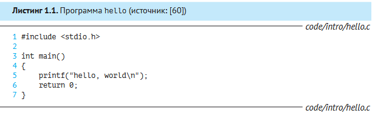

Любая программа начинает свою жизнь как **исходный код** — текст, который разработчик создаёт в редакторе и сохраняет в файле. Но компьютер не понимает текст. Для компьютера всё — это последовательность **битов** (0 или 1), организованных в 8-битные блоки — **байты**.

Большинство систем представляют текстовые символы в стандарте **ASCII** (American Standard Code for Information Interchange), где каждый символ — это уникальное однобайтное число.

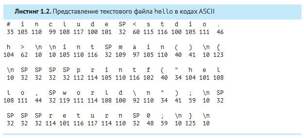

Файлы, содержащие только символы (как `hello.c`), называются **текстовыми файлами**. Все остальные — **двоичными файлами** (исполняемые программы, изображения, видео).

> **Ключевая идея:** всё в системе — файлы на диске, программы и данные в памяти, информация в сети — это просто битовые блоки. Единственное, что отличает разные виды данных, — **контекст**, в котором мы их рассматриваем. Одни и те же байты могут быть и текстом, и картинкой, и машинной инструкцией.

### Как программа превращается в исполняемый файл

Исходный код на языке высокого уровня (например, C) понятен человеку, но не процессору. Чтобы запустить программу, её нужно преобразовать в **машинный код** — последовательность низкоуровневых инструкций. Этим занимается **система компиляции** — набор из четырёх программ:

* **Препроцессор** — обрабатывает директивы `#include`, `#define` и другие, подставляя содержимое заголовочных файлов прямо в текст программы. Результат: файл `.i`.
* **Компилятор** — переводит программу с языка C на **язык ассемблера** (`.s`). Ассемблер — это общий «выходной язык» для компиляторов разных языков высокого уровня.
* **Ассемблер** — переводит ассемблерный код в машинные инструкции и упаковывает их в **перемещаемый объектный файл** (`.o`).
* **Компоновщик (линковщик)** — объединяет объектный файл программы с объектными файлами библиотек (например, `printf.o`) в один **исполняемый файл**, готовый к запуску.

> **Зачем это Go-разработчику.** Go компилируется в машинный код напрямую, без виртуальной машины. `go build` выполняет компиляцию и компоновку в один шаг: компилятор Go преобразует каждый пакет в объектный файл (`.a`), а компоновщик Go (`cmd/link`) собирает их в статически слинкованный исполняемый файл — без внешних зависимостей от динамических библиотек. Отсюда важное следствие: один бинарник можно просто скопировать на другой сервер и запустить — ему не нужны `.so`-файлы.

### Представление чисел в памяти

Компьютер хранит не только текст, но и числа. Понимание того, как именно они представлены, критически важно для любого разработчика.

#### Порядок байтов (endianness)

Когда число не помещается в один байт (например, 32-битное целое), его байты размещаются в памяти в определённом порядке:

* **Little-endian** — младший байт по младшему адресу (используется в x86, x86-64, большинстве ARM).
* **Big-endian** — старший байт по младшему адресу (сетевые протоколы, некоторые RISC-архитектуры).

Например, 32-битное число `0x0A0B0C0D` в little-endian хранится как `0D 0C 0B 0A`, а в big-endian — как `0A 0B 0C 0D`.

> **Зачем это Go-разработчику.** При чтении бинарных форматов и сетевых протоколов порядок байтов критичен. Пакет `encoding/binary` в Go позволяет явно указать порядок: `binary.LittleEndian` или `binary.BigEndian`. Если перепутать — данные будут прочитаны неверно, и вы получите трудновоспроизводимые баги.

#### Дополнительный код (two's complement)

Отрицательные целые числа представляются в **дополнительном коде**: старший бит — знаковый, а значение вычисляется как `−xₙ₋₁·2ⁿ⁻¹ + xₙ₋₂·2ⁿ⁻² + … + x₀·2⁰`.

На практике:

* `int8`: от −128 до 127 (8 бит, 2⁷ = 128).
* `int16`: от −32 768 до 32 767.
* `int32` (rune): от −2 147 483 648 до 2 147 483 647.
* `int64`: от −9,2·10¹⁸ до 9,2·10¹⁸.

Беззнаковые типы (`uint8`…`uint64`) используют весь диапазон битов для положительных чисел.

> **Зачем это Go-разработчику.** Понимание дополнительного кода объясняет, почему `int8(127) + int8(1)` даёт `-128` — это **целочисленное переполнение**. В Go, в отличие от C, переполнение знаковых целых — не undefined behavior, но результат может быть неожиданным. Для критичных случаев используйте пакет `math/bits` с методами `Add`, `Sub`, `Mul` с проверкой переполнения.

***

## 2. Аппаратная организация системы

Прежде чем разбираться, как программа выполняется, нужно понять, из чего состоит компьютер. Вот его ключевые компоненты:

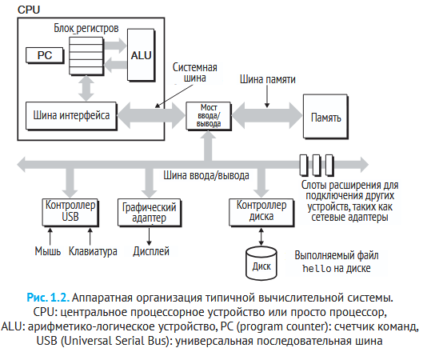

### Шины

**Шина** — это набор электрических проводников, по которым байты перемещаются между компонентами системы. Данные передаются порциями фиксированного размера — **словами**. Размер слова — фундаментальный параметр системы: 4 байта (32 бита) или 8 байт (64 бита). Чем шире слово, тем больше данных процессор может обработать за одну операцию.

### Устройства ввода/вывода

Это средства связи компьютера с внешним миром: клавиатура, мышь, дисплей, диски, сетевые карты. Каждое устройство подключается к шине через **контроллер** или **адаптер**.

* **Контроллер** — микросхема на материнской плате или самом устройстве.
* **Адаптер** — плата, вставляемая в разъём материнской платы.

Назначение одно: передавать данные между шиной и устройством в обоих направлениях.

### Основная память

**Основная память** (ОЗУ, RAM) — временное хранилище, где находятся программа и её данные во время выполнения. Физически это микросхемы **DRAM** (Dynamic Random Access Memory). Логически — линейный массив байтов, каждый с уникальным **адресом** (индексом), начиная с нуля.

### Процессор (CPU)

**Центральный процессор (CPU)** — это «мозг» компьютера, который выполняет инструкции из памяти. Его ключевые части:

* **Счётчик команд (Program Counter, PC)** — регистр, хранящий адрес следующей инструкции.
* **Блок регистров** — сверхбыстрая память внутри процессора (ёмкостью в сотни байт).
* **Арифметико-логическое устройство (ALU)** — выполняет вычисления.

Цикл работы процессора прост: прочитать инструкцию из памяти (по адресу в PC) → выполнить её → обновить PC (перейти к следующей). Этот цикл повторяется от включения до выключения.

Основные операции процессора: **загрузка** (из памяти в регистр), **сохранение** (из регистра в память), **арифметико-логическая операция** (вычисление в ALU), **переход** (изменение PC).

> **Зачем это Go-разработчику.** Понимание архитектуры процессора и регистровой модели поможет вам осознать, почему одни операции в Go быстрее других (например, передача по значению vs по указателю), и как работает встраивание функций (inlining) при компиляции.

***

## 3. Что происходит при запуске программы: процессы и ОС

Теперь соберём всё вместе и проследим, что происходит при запуске программы `./hello`.

### Пошаговое выполнение программы hello

**Шаг 1.** Командная оболочка ждёт ввода. Когда вы набираете `./hello`, она читает символы в регистр и сохраняет их в памяти.

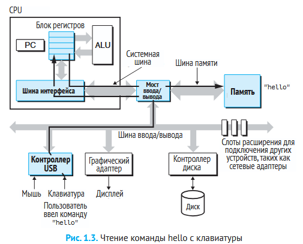

**Шаг 2.** После нажатия Enter оболочка загружает исполняемый файл `hello` с диска в основную память. Данные перемещаются через **прямой доступ к памяти (DMA)** — минуя процессор, напрямую с диска в ОЗУ.

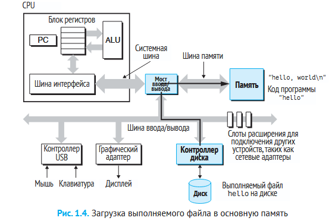

**Шаг 3.** Процессор начинает выполнять машинные инструкции программы `hello`. Они копируют байты строки `"hello, world\n"` из памяти в регистры, а оттуда — на дисплей.

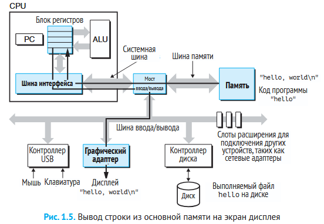

> **Зачем это Go-разработчику.** DMA — это то, что происходит «под капотом» при вызове `os.ReadFile` или `f.Read`. Ядро настраивает DMA-передачу с диска в буфер, а горутина в это время может быть вытеснена планировщиком. Именно поэтому операции ввода/вывода в Go всегда выполняются в неблокирующем режиме: горутина не простаивает, ожидая диск.

### Операционная система как посредник

Прикладные программы не работают с аппаратурой напрямую. Все операции идут через **операционную систему (ОС)** — слой программного обеспечения между программой и «железом».

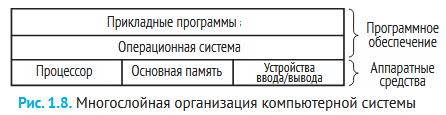

У ОС две главные задачи: (1) защищать аппаратуру от некорректных действий программ и (2) давать программам простые и единообразные способы работы с разным оборудованием. Для этого ОС предоставляет три фундаментальные **абстракции**:

| Абстракция             | Что она скрывает                                    |
| ---------------------- | --------------------------------------------------- |
| **Процесс**            | Процессор, основная память, устройства ввода/вывода |
| **Виртуальная память** | Основная память и диски                             |
| **Файл**               | Устройства ввода/вывода                             |

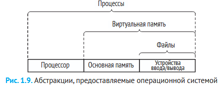

### Процессы

**Процесс** — это абстракция выполняющейся программы. Когда вы запускаете программу, ОС создаёт иллюзию, что она — единственная программа в системе: только она владеет процессором, памятью и устройствами.

На самом деле процессов много, а процессор (или ядер) — мало. ОС создаёт иллюзию одновременной работы через **переключение контекста**: быстрое переключение процессора между процессами.

**Контекст процесса** — это вся информация о его состоянии: значение PC, содержимое регистров, содержимое памяти. При переключении ОС сохраняет контекст текущего процесса и восстанавливает контекст нового

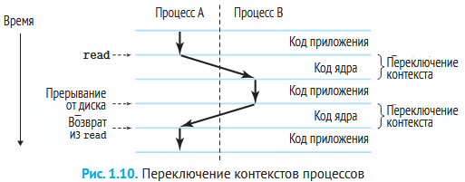

В примере с `hello`: сначала работает процесс оболочки. Когда она получает команду запустить `hello`, она вызывает **системный вызов (syscall)** — специальную инструкцию, передающую управление ядру ОС. Ядро сохраняет контекст оболочки, создаёт новый процесс `hello` и передаёт управление ему. Когда `hello` завершается, ядро восстанавливает контекст оболочки.

### Ядро операционной системы

**Ядро** — это часть кода ОС, которая всегда находится в памяти. Это не отдельный процесс, а набор кода и структур данных для управления всеми процессами. Когда программа делает системный вызов (например, для чтения файла), управление передаётся ядру, которое выполняет операцию и возвращает результат.

> **Зачем это Go-разработчику.** Понимание процессов и системных вызовов критически важно для Go. Горутины Go — это легковесные потоки, которые работают поверх потоков ОС. Планировщик Go переключает горутины в пользовательском пространстве, не делая системный вызов — поэтому переключение горутины занимает наносекунды, а не микросекунды, как переключение потоков ОС.

***

## 4. Как программа работает с памятью

### Виртуальная память

**Виртуальная память** — это абстракция, создающая у каждого процесса иллюзию, что он один владеет всей памятью. Каждый процесс видит одинаковую структуру — **виртуальное адресное пространство**.

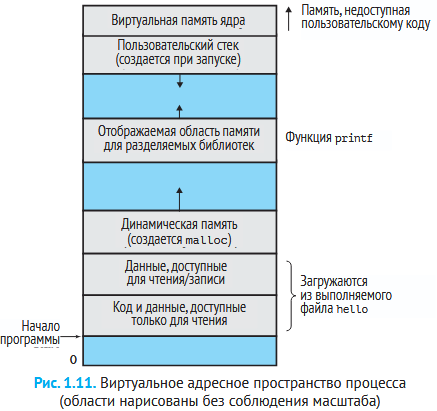

Виртуальное адресное пространство (в Linux) состоит из нескольких областей:

| Область                    | Описание                                                                          |
| -------------------------- | --------------------------------------------------------------------------------- |
| **Код (text)**             | Машинные инструкции программы. Начинается с адреса `0x400000`. Размер фиксирован. |
| **Данные (data)**          | Глобальные и статические переменные. Размер фиксирован.                           |
| **Куча (heap)**            | Динамическая память. Растёт вверх при вызове `malloc`.                            |
| **Разделяемые библиотеки** | Код и данные общих библиотек (например, libc).                                    |
| **Стек (stack)**           | Локальные переменные, адреса возврата из функций. Растёт вниз.                    |
| **Память ядра**            | Зарезервирована для ОС, недоступна программам.                                    |

> **Зачем это Go-разработчику.** Go-рантайм резервирует регионы виртуального адресного пространства под арены кучи (heap arenas) и стеки горутин. Стек каждой горутины начинается с \~2 КБ и растёт динамически — это возможно именно благодаря виртуальной памяти: физические страницы выделяются только при касании. Виртуальное адресное пространство — это «песочница», в которой работает ваша Go-программа.

### Стек и куча

**Стек** — это область памяти, работающая по принципу LIFO (Last In, First Out — последним пришёл, первым ушёл). Каждый раз, когда функция вызывается, на стеке создаётся **стековый кадр** с её локальными переменными, аргументами и адресом возврата. Когда функция завершается, кадр удаляется. Стек растёт «вниз» (в сторону меньших адресов).

**Куча (динамическая память)** — это область памяти для данных, размер которых неизвестен на этапе компиляции. Программа запрашивает память через `malloc` и освобождает через `free`. Куча растёт «вверх» (в сторону больших адресов).

| Характеристика     | Стек                        | Куча                                 |
| ------------------ | --------------------------- | ------------------------------------ |
| Скорость выделения | Мгновенно (сдвиг указателя) | Медленно (поиск свободного блока)    |
| Управление         | Автоматическое (компилятор) | Ручное (`malloc`/`free`) или GC      |
| Размер             | Ограничен (\~8 МБ в Linux)  | Ограничен объёмом виртуальной памяти |
| Фрагментация       | Нет                         | Возможна                             |

> **Зачем это Go-разработчику.** Различие между стеком и кучей — одна из важнейших тем в Go. Компилятор Go выполняет **escape analysis** — определяет, может ли переменная «убежать» из функции. Если нет — она размещается на стеке (быстро, автоматическая очистка). Если да — на куче (медленнее, участвует в сборке мусора). Понимание этого механизма поможет вам писать производительный код на Go.

### Трансляция адресов: MMU, страницы и таблицы

#### Физическая и виртуальная адресация

Основная память — это массив байтов с **физическими адресами** (0, 1, 2, …). Раньше процессоры обращались к памяти по физическим адресам напрямую. Современные процессоры используют **виртуальную адресацию**: программа работает с виртуальными адресами, а специальный модуль — **MMU (Memory Management Unit)** — преобразует их в физические.

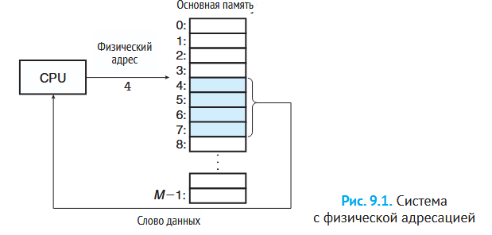

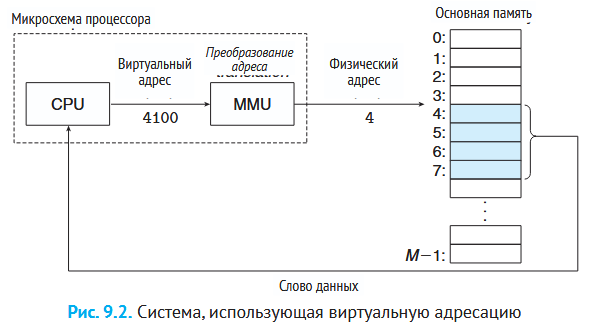

**Пространство адресов** — упорядоченное множество адресов. Виртуальное адресное пространство размером 2ⁿ адресов (32- или 64-разрядное). Физическое адресное пространство соответствует реальному объёму ОЗУ.

#### Виртуальная память как кэш для диска

Концептуально виртуальная память — это массив байтов на диске. Основная память (DRAM) служит **кэшем** для этого массива. Данные разбиты на блоки фиксированного размера — **виртуальные страницы** (обычно 4 КБ). Физическая память разбита на такие же блоки — **физические страницы (фреймы)**.

В каждый момент времени виртуальные страницы делятся на три группы:

* **Незанятые** — ещё не выделялись.
* **Кэшированные** — находятся в DRAM.
* **Некэшированные** — выделены, но на диске, ждут загрузки.

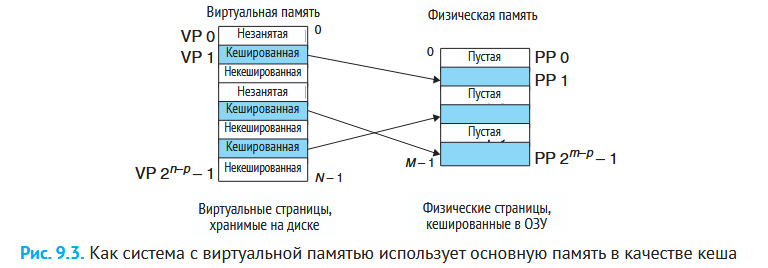

#### Таблицы страниц

**Таблица страниц** — это структура данных, отображающая виртуальные страницы в физические. Каждая запись (**PTE — Page Table Entry**) содержит бит достоверности (1 = страница в DRAM) и адрес физической страницы.

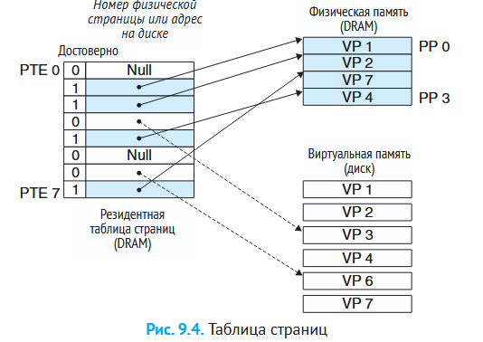

Когда программа обращается к виртуальному адресу, MMU смотрит в таблицу страниц. Если страница в DRAM — трансляция происходит на аппаратном уровне. Если нет — генерируется **страничное исключение (page fault)** и ядро ОС загружает страницу с диска (**замещение страниц по требованию**, demand paging).

**Рабочий набор** — набор активных страниц, с которыми программа работает в данный момент. Если рабочий набор помещается в DRAM — всё работает быстро. Если нет — возникает **пробуксовка (thrashing)**: страницы непрерывно загружаются и выгружаются, производительность падает катастрофически.

#### TLB: ускорение трансляции

Обращение к таблице страниц — дополнительный доступ к памяти, а это медленно. Для ускорения в MMU встроен **TLB (Translation Lookaside Buffer)** — небольшой сверхбыстрый кэш недавно использованных PTE-записей.

Если нужная запись есть в TLB — трансляция за один такт. Если нет — MMU идёт в кэш L1/L2 или память.

> **Зачем это Go-разработчику.** Промахи TLB — скрытая цена фрагментации адресного пространства. Когда Go-рантайм выделяет память из разных арен кучи, страницы могут быть разбросаны, увеличивая TLB-промахи. На серверах с huge pages (2 МБ или 1 ГБ на страницу) одна TLB-запись покрывает больший объём — это может заметно ускорить Go-программы, работающие с большими объёмами памяти.

#### Многоуровневые таблицы страниц

Одноуровневая таблица страниц для 64-битного адресного пространства была бы огромной. Вместо этого используют **многоуровневые таблицы** — древовидную структуру, где верхние уровни ссылаются на нижние.

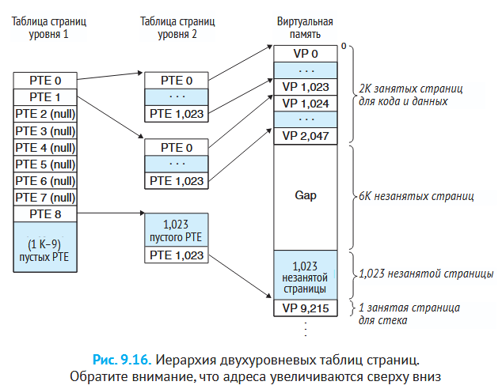

#### Полный цикл трансляции адреса

Программа выдаёт виртуальный адрес → MMU ищет в TLB → если промах, идёт по многоуровневым таблицам страниц → если страницы нет в DRAM, исключение → ядро загружает страницу с диска → запись сохраняется в TLB → получен физический адрес → поиск в кэшах L1/L2/L3 → если промах, обращение к DRAM.

### Защита памяти

ЗащитаКаждая PTE-запись содержит биты разрешений. **SUP** определяет, требуется ли режим ядра. **READ** и **WRITE** управляют доступом на чтение и запись.

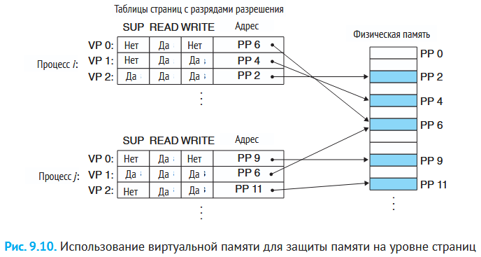

Если программа пытается нарушить права доступа (например, записать в read-only страницу), процессор генерирует исключение, и ядро посылает процессу сигнал `SIGSEGV` — знаменитая **ошибка сегментации (segmentation fault)**.

> **Зачем это Go-разработчику.** В Go `SIGSEGV` превращается в `panic: runtime error: invalid memory address or nil pointer dereference`. Go-рантайм перехватывает сигнал и преобразует его в панику, которую можно отловить через `recover`. Но важно понимать: паника от повреждения памяти — это не та паника, которую стоит «восстанавливать». Если вы видите nil pointer dereference в логах — ищите баг, а не добавляйте `recover`.

### Отображение памяти (memory mapping)

Linux инициализирует области виртуальной памяти, связывая их с объектами на диске:

* **Обычный файл** — например, исполняемый файл. Страницы загружаются по требованию.
* **Анонимный файл** — созданный ядром, заполнен нулями (для кучи, стека). При первом касании ядро выделяет физическую страницу, заполненную нулями (**demand-zero pages**).

Объекты могут быть **разделяемыми** (изменения видны другим процессам) или **закрытыми** (изменения не видны). Закрытые объекты используют технику **copy-on-write**: копия страницы создаётся только при попытке записи.

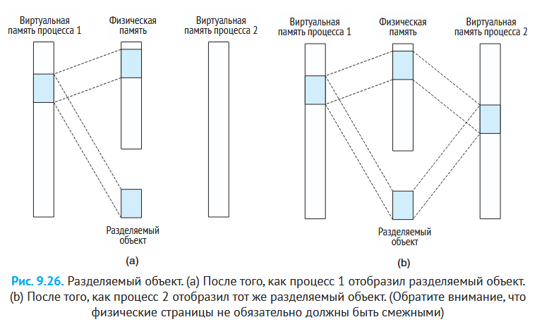

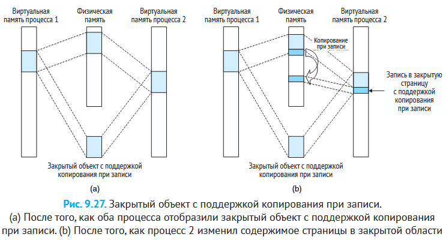

> **Зачем это Go-разработчику.** `mmap` доступен в Go через `golang.org/x/sys/unix.Mmap`. Он используется для эффективного файлового ввода/вывода: вместо `read`/`write` (копирование через буфер ядра) страницы файла напрямую отображаются в память процесса. Внутренне Go-рантайм использует `mmap` для выделения арен кучи. Copy-on-write — это также механизм, стоящий за форком процессов и эффективным клонированием данных.

### Динамическое распределение памяти

**Куча (heap)** — область виртуальной памяти для данных, размер которых неизвестен заранее. Ядро поддерживает переменную `brk`, указывающую на вершину кучи.

Существует два типа распределителей:

* **Явные (explicit allocator)** — программа сама вызывает `malloc`/`free` (C) или `new`/`delete` (C++).
* **Неявные (implicit allocator)** — **сборщики мусора (garbage collector)** автоматически освобождают неиспользуемую память (Java, Go, Python).

#### Фрагментация

**Внутренняя фрагментация** — выделенный блок больше, чем запрошено (из-за выравнивания или минимального размера блока).

**Внешняя фрагментация** — суммарно свободной памяти достаточно, но нет непрерывного блока нужного размера.

#### Как работают malloc и free

**malloc** не обращается к ядру напрямую. Он работает с кучей через библиотеку времени выполнения. При запросе библиотека ищет подходящий свободный блок. Если находит — помечает как занятый и возвращает указатель. Физические страницы выделяются позже, при первом касании.

**free** возвращает блок в пул свободной памяти. Информация о размере блока хранится в скрытом заголовке перед самим блоком.

> **Зачем это Go-разработчику.** Аллокатор Go устроен иначе, чем классический `malloc`. Он использует трехуровневую иерархию: каждый P (виртуальный процессор) имеет локальный кэш `mcache`, из которого горутина выделяет память без блокировок. Если `mcache` пуст — пополняется из `mcentral`, а тот — из глобальной `mheap`. Это даёт очень быстрые аллокации в типичном случае. Но важно: каждая аллокация в куче — это будущая работа для сборщика мусора. Переиспользуйте буферы (`sync.Pool`) и по возможности оставайтесь на стеке.

#### Сборка мусора

**Сборщик мусора** автоматически находит и освобождает блоки, которые больше не нужны программе. Он рассматривает память как **граф достижимости**: узлы — блоки памяти, рёбра — ссылки между ними. Узел **достижим**, если до него можно добраться от корневых узлов (регистры, стек, глобальные переменные). Недостижимые узлы — **мусор**.

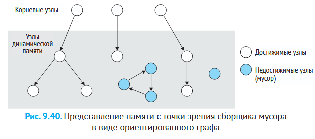

**Алгоритм Mark & Sweep:**

1. **Маркировка (mark)** — рекурсивно обходится граф от корней, помечая все достижимые блоки.
2. **Очистка (sweep)** — освобождаются все неотмеченные блоки.

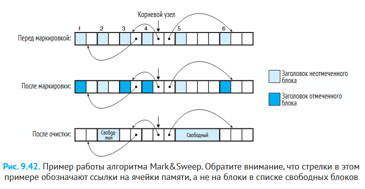

> **Зачем это Go-разработчику.** В Go встроенный сборщик мусора с очень низкими задержками. Он использует трёхцветный алгоритм mark-and-sweep, работающий конкурентно с программой. Понимание принципов работы GC поможет вам писать код с меньшей нагрузкой на сборщик (например, минимизировать аллокации в куче, переиспользовать буферы).

***

## 5. Иерархия памяти и кэши

### Почему нельзя сделать всю память быстрой

Есть фундаментальный компромисс: **чем больше память, тем она медленнее и дешевле за байт**. Регистры процессора — сверхбыстрые, но их всего несколько сотен байт. DRAM — гигабайты, но доступ к ней в 100 раз медленнее, чем к регистрам. Разрыв между скоростью процессора и памяти продолжает расти.

Решение — **иерархия памяти**: разместить маленькую быструю память (кэш SRAM) между процессором и большой медленной памятью (DRAM). Кэш хранит данные, которые, вероятно, скоро понадобятся.

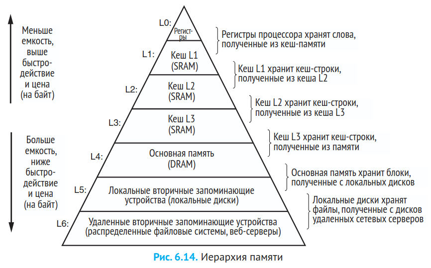

| Уровень | Тип памяти     | Объём        | Время доступа   |
| ------- | -------------- | ------------ | --------------- |
| L0      | Регистры       | \~сотни байт | 1 такт          |
| L1      | SRAM-кэш       | \~десятки КБ | \~4 такта       |
| L2      | SRAM-кэш       | \~сотни КБ   | \~10 тактов     |
| L3      | SRAM-кэш       | \~единицы МБ | \~50 тактов     |
| L4      | DRAM (ОЗУ)     | \~ГБ         | \~сотни тактов  |
| L5      | Диск (SSD/HDD) | \~ТБ         | миллионы тактов |

### Как работает кэш

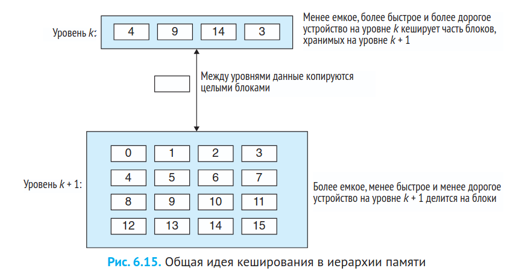

Данные копируются между уровнями целыми блоками — **кэш-линиями** (cache lines), обычно по 64 байта. Когда процессор запрашивает данные:

* **Попадание в кэш (cache hit)** — данные найдены на верхнем уровне, получены быстро.
* **Промах кэша (cache miss)** — данных нет на верхнем уровне, приходится идти на уровень ниже.

Идея: хранить в кэше часто используемые данные, чтобы большинство обращений к памяти было попаданиями.

### Принцип локальности

Кэши эффективны благодаря **принципу локальности** — программы склонны обращаться к ограниченному набору данных:

* **Временнáя локальность** — если к данным обратились один раз, к ним, вероятно, обратятся снова в ближайшее время.
* **Пространственная локальность** — если к данным обратились, вероятно, скоро понадобятся соседние данные.

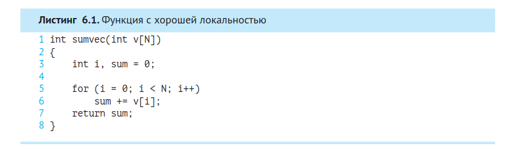

Рассмотрим функцию, суммирующую элементы вектора: переменная `sum` имеет хорошую временнýю локальность (используется на каждой итерации), а вектор `v` — хорошую пространственную локальность (читается последовательно).

**Шаблон обращений с шагом 1 (последовательный доступ)** — самый эффективный для кэшей. Чтение массива по строкам (в C массивы хранятся построчно) даёт шаг 1. Чтение по столбцам даёт шаг N — пространственная локальность резко ухудшается.

> **Зачем это Go-разработчику.** В Go слайсы и массивы — это непрерывные области памяти, что даёт отличную пространственную локальность. Но есть нюанс: слайс указателей на структуры теряет локальность, потому что сами структуры могут быть разбросаны по куче. Понимание локальности помогает писать cache-friendly код в Go.

### Типы памяти: SRAM vs DRAM

**SRAM (Static RAM)** — быстрая, дорогая, используется для кэшей. Каждый бит хранится в бистабильной ячейке из 6 транзисторов. Данные держатся, пока есть питание.

**DRAM (Dynamic RAM)** — медленнее, дешевле, используется как основная память. Каждый бит — заряд конденсатора. Конденсаторы разряжаются за 10–100 мс, поэтому DRAM нужно периодически обновлять (перечитывать и перезаписывать).

### Доступ к основной памяти

Процессор и DRAM обмениваются данными через **шину**. Передача данных — **транзакция шины**: чтение (из DRAM в CPU) и запись (из CPU в DRAM).

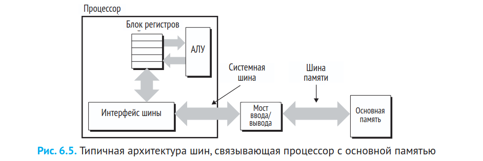

**Мост ввода/вывода (I/O bridge)** соединяет системную шину (CPU) с шиной памяти и шиной ввода/вывода.

### Сквозная запись и обратная запись

* **Сквозная запись (write-through)** — данные пишутся и в кэш, и на уровень ниже одновременно. Надёжно, но медленно.
* **Обратная запись (write-back)** — данные пишутся только в кэш, страница помечается как «грязная» (dirty). На диск сбрасывается позже, при вытеснении. Значительно быстрее.

***

## 6. Конкуренция и параллелизм

**Конкуренция (concurrency)** — общая идея одновременного выполнения множества действий. **Параллелизм (parallelism)** — использование конкуренции для ускорения работы системы. Параллелизм проявляется на нескольких уровнях:

### Конкуренция на уровне потоков

Раньше конкурентное выполнение только **моделировалось** — процессор быстро переключался между процессами, создавая иллюзию одновременности. Это **однопроцессорная система**.

**Многопроцессорная система** имеет несколько процессоров (или ядер), управляемых одним ядром ОС. **Многоядерный процессор** — несколько ядер на одном кристалле.

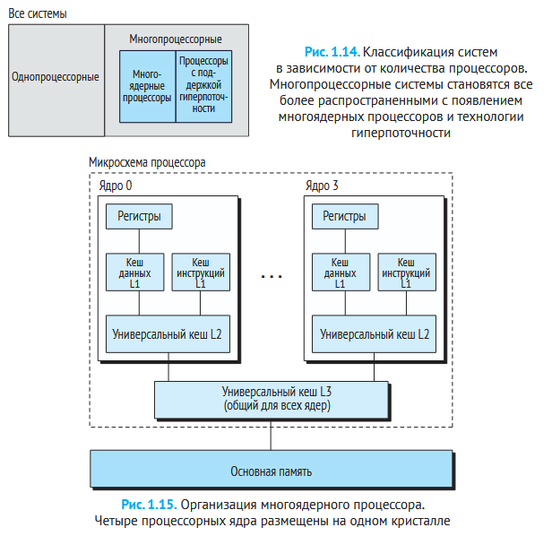

**Гиперпоточность (hyperthreading)** — технология, позволяющая одному физическому ядру выполнять несколько потоков одновременно. Ядро имеет несколько наборов регистров и PC, но общие исполнительные блоки. Переключение между потоками — за такты, а не за десятки тысяч тактов, как у обычного переключения контекста.

### Параллелизм на уровне инструкций (ILP) и SIMD

Современные процессоры могут выполнять несколько инструкций одновременно (Instruction Level Parallelism — конвейеризация, суперскалярность).

**SIMD (Single Instruction, Multiple Data)** — одна инструкция выполняет одну и ту же операцию над несколькими данными параллельно. Например, сложить 8 пар чисел с плавающей точкой за одну инструкцию. Активно используется для обработки изображений, звука, видео.

### Модели конкурентного программирования

Современные ОС поддерживают три основных механизма:

#### Процессы

Процессы изолированы: у каждого своё адресное пространство. Для обмена данными нужны механизмы **межпроцессного взаимодействия (IPC)**: каналы, очереди сообщений, разделяемая память, сокеты. Надёжно, но медленно (накладные расходы на IPC и переключение контекста).

#### Мультиплексирование ввода/вывода (событийно-ориентированное)

Вся работа в одном процессе и одном потоке. Программа отслеживает множество **файловых дескрипторов** через `select`/`poll`/`epoll` и реагирует, когда они готовы к чтению/записи. Логические потоки моделируются как **конечные автоматы**. Очень эффективно по ресурсам, но сложно в программировании: все операции должны быть неблокирующими.

#### Потоки (threads)

**Поток** — логический поток управления внутри процесса. У каждого потока — свой стек, PC и регистры. Все потоки процесса разделяют общее адресное пространство.

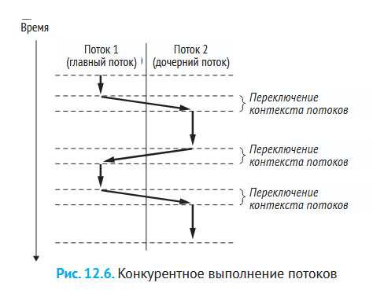

Потоки сочетают плюсы процессов (планируются ядром) и мультиплексирования (общее адресное пространство). Переключение между потоками быстрее, чем между процессами, потому что контекст потока меньше. Но общая память создаёт главную проблему — **необходимость синхронизации**.

#### Ложное разделение (false sharing)

Когда разные потоки работают с разными переменными, оказавшимися в одной **кэш-линии** (64 байта), возникает проблема: изменение одной переменной заставляет другие ядра перезагружать всю линию. Это может резко ухудшить производительность.

> **Зачем это Go-разработчику.** Горутины Go — это легковесные потоки, которые мультиплексируются на потоки ОС планировщиком Go. Планировщик Go работает в пользовательском пространстве, поэтому переключение горутин стоит единицы наносекунд. Каналы Go — это высокоуровневая абстракция над IPC и синхронизацией. Понимание потоков, ложного разделения и синхронизации поможет вам писать эффективный конкурентный код на Go.

### Атомарные операции и модель памяти

Наличие нескольких потоков с общей памятью ставит фундаментальный вопрос: **в каком порядке изменения, сделанные одним потоком, становятся видны другому?**

**Модель памяти** языка определяет эти гарантии. В Go модель памяти описана в [официальной спецификации](https://go.dev/ref/mem). Её ключевое правило: если две горутины обращаются к одной переменной и хотя бы одна из них пишет, доступ должен быть **синхронизирован**.

Механизмы синхронизации в Go:

* **Каналы (channels)** — отправка и получение создают отношение **happens-before**: запись в канал происходит-до чтения из него.
* **Мьютексы (****`sync.Mutex`****)** — разблокировка `Unlock` происходит-до следующей блокировки `Lock`. Мьютекс — не просто блокировка, а **барьер памяти**: он гарантирует, что все записи до `Unlock` видны после `Lock`.
* **`sync/atomic`** — атомарные операции без блокировок. `atomic.AddInt64`, `atomic.LoadPointer` и подобные гарантируют, что операция выполнится целиком, без гонки.

**Атомарность** операции означает, что она не может быть прервана на середине. Например, запись 64-битного значения на 32-битной платформе может быть неатомарной (две 32-битные записи), если не использовать `atomic`.

#### Барьеры памяти

На уровне процессора записи в память не становятся видимыми другим ядрам мгновенно — они проходят через буферы записи (store buffers) и протоколы когерентности кэшей. **Барьер памяти** (memory fence) — инструкция процессора, заставляющая «сбросить» буферы и обеспечить видимость записей.

В Go вам не нужно думать о барьерах явно — их вставляют компилятор и рантайм при использовании `sync.Mutex`, `sync/atomic` и каналов. Но понимание того, что они существуют, помогает осознать: синхронизация — это не «замедление», а корректность.

> **Зачем это Go-разработчику.** Go предоставляет встроенный детектор гонок (`go test -race`), который в реальном времени находит несинхронизированные доступы к памяти. В отличие от C/C++, где гонка — undefined behavior и может привести к любым последствиям, в Go гонка обычно «всего лишь» приводит к неверным данным. Но и этого достаточно, чтобы сломать логику. Всегда включайте `-race` в CI. Если вы пишете lock-free структуру данных (что редко нужно) — используйте `sync/atomic` и тщательно тестируйте.

***

## 7. Сигналы и системные вызовы

### Системные вызовы (syscall)

**Системный вызов** — единственный легальный способ для программы запросить услугу у ядра ОС. При системном вызове процессор переключается из пользовательского режима в режим ядра.

Системные вызовы охватывают: управление процессами, файловые операции, межпроцессное взаимодействие, управление памятью, сетевые операции.

Важно: код ядра выполняется в контексте вызвавшего процесса и имеет доступ к его адресному пространству. Если операция требует ожидания (чтение с диска), ядро может заблокировать процесс и переключиться на другой.

### Сигналы

**Сигнал** — короткое сообщение, уведомляющее процесс о наступлении события. Например, Ctrl+C посылает `SIGINT`. Процесс может: игнорировать сигнал, выполнить стандартное действие, или обработать пользовательским обработчиком.

Обработка сигнала прерывает нормальный поток выполнения — это как аппаратное прерывание на уровне процесса.

### Логические потоки управления

Последовательность значений счётчика команд (PC), соответствующая одной программе, называется **логическим потоком управления**. Физический поток процессора делится на логические потоки процессов.

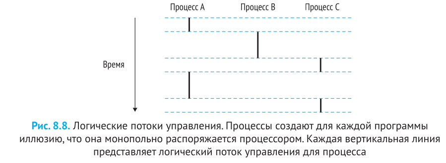

Два потока **конкурентны**, если их выполнение перекрывается во времени. Период, в течение которого процесс выполняет часть своего потока — **квант времени**. Конкурентные потоки, выполняющиеся одновременно на разных ядрах — **параллельные потоки**.

> **Зачем это Go-разработчику.** Горутины Go — это логические потоки управления, а не потоки ОС. Они могут быть конкурентными (перекрываются во времени на одном ядре) или параллельными (выполняются на разных ядрах). Ключевое слово `go` запускает новую горутину, а планировщик Go прозрачно распределяет их по потокам ОС.

***

## 8. Абстракции в компьютерных системах

**Абстракция** — одна из важнейших концепций в компьютерных науках. Суть: скрыть сложность за простым интерфейсом.

**Архитектурный набор команд (ISA)** — абстракция процессора. Программе кажется, что инструкции выполняются строго по одной. Физический процессор намного сложнее: он выполняет их параллельно, переупорядочивает, предсказывает переходы — но результат тот же, что при последовательной модели.

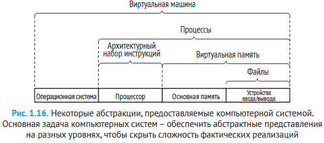

На уровне ОС мы видели три ключевые абстракции: **файлы** (ввод/вывод), **виртуальная память** (память), **процессы** (выполнение). К ним добавляется **виртуальная машина** — абстракция целого компьютера.

> **Зачем это Go-разработчику.** Go сам является абстракцией над системными вызовами и потоками ОС. Горутины абстрагируют потоки, каналы абстрагируют IPC, сборщик мусора абстрагирует управление памятью. Понимание того, что скрывается под этими абстракциями, — ключ к осознанному использованию Go.

***

## 9. Закон Амдала

**Закон Амдала** описывает предел ускорения системы при оптимизации одной её части. Если доля α системы ускорена в k раз, общее ускорение:

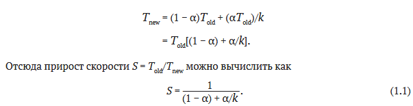

Предельный случай — когда k → ∞ (оптимизируемая часть стала бесконечно быстрой):

$S_∞ = \frac{1}{1 - \alpha}$

Это означает: даже если вы сделаете оптимизируемую часть мгновенной, общее ускорение ограничено оставшейся долей (1−α).

> **Зачем это Go-разработчику.** Закон Амдала — ключ к пониманию пределов параллелизма. Если 10% программы не параллелится, максимальное ускорение от распараллеливания — не более 10×. Прежде чем добавлять горутины, убедитесь, что распараллеливаемая часть занимает значительную долю времени.
