# Параллельное программирование в Go: фундаментальные понятия

Этот документ даёт системное представление о конкурентном программировании в Go. Здесь собраны базовые концепции — от различия между конкурентностью и параллелизмом до низкоуровневых проблем вроде False Sharing, — а также описание встроенных инструментов диагностики и практические рекомендации. Материал рассчитан на Go-разработчиков, которые уже знакомы с синтаксисом языка и хотят осмысленно работать с горутинами, каналами и примитивами синхронизации.

***

## 1. Конкурентность, параллелизм и асинхронность

Когда мы говорим о многопоточной разработке, нужно прежде всего развести три понятия: **конкурентность (Concurrency)**, **параллелизм (Parallelism)** и **асинхронность (Asynchrony)**.

### Конкурентность и параллелизм

В мире Go есть выражение **«Concurrency is not Parallelism»**. Суть в том, что **Concurrency** — это о дизайне: о том, как мы проектируем программу, разбивая её на независимые логические блоки. **Parallelism** — это способ выполнения: несколько потоков инструкций действительно исполняются одновременно на разных ядрах.

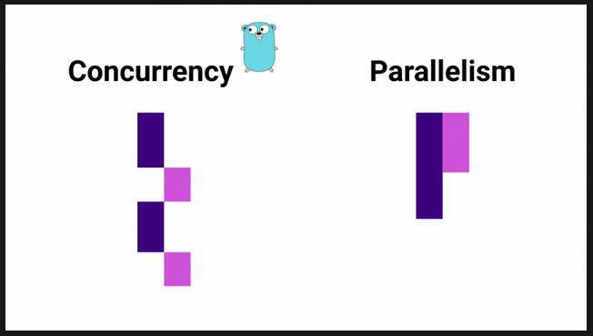

**Parallelism требует конкурентности.** Без конкурентного дизайна распараллелить программу не получится. При этом конкурентность не требует параллелизма: программа, способная работать на многих ядрах, может работать и на одном — планировщик будет чередовать выполнение конкурентных блоков.

> **Зачем это Go-разработчику.** Конкурентность, параллелизм и асинхронность — три разных понятия, которые в Go реализованы иначе, чем в других языках. Конкурентность — про структуру программы (горутины и каналы), параллелизм — про одновременное исполнение на нескольких ядрах. Асинхронность в Go достигается не через callback/async-await, а через блокирующие операции на горутинах: заблокированная горутина не занимает поток ОС, рантайм переключается на другую. Понимание этих различий определяет, *когда* применять параллелизм и *какой* выигрыш от него ожидать.

### Конкурентные, параллельные и асинхронные вычисления

| Понятие                     | Определение                                                                                         |
| --------------------------- | --------------------------------------------------------------------------------------------------- |
| **Конкурентные вычисления** | Несколько задач обрабатываются одним ядром; переключение контекста создаёт иллюзию одновременности. |
| **Параллельные вычисления** | Несколько задач выполняются одновременно разными ядрами процессора.                                 |
| **Асинхронные вычисления**  | Код не ждёт ответа от функции и продолжает выполнение; ответ обрабатывается по поступлении.         |

В модели конкурентного выполнения имеет место **переключение контекста** между задачами: приложение работает с несколькими задачами, но ядро одно, и переключение происходит настолько быстро, что создаётся ощущение одновременности.

Ключевая разница между асинхронностью и параллелизмом: асинхронность подразумевает отсутствие ожидания ответа — программа продолжает работу после асинхронного вызова и обрабатывает результат по приходу ответа. Например, запрос к API: мы ждём ответа от сервера, но сайт не перестаёт работать, потому что метод получения данных асинхронный. Асинхронность часто *может* подразумевать параллелизм, но это более широкий термин — вычисления могут происходить вообще на другом устройстве.

***

## 2. Закон Амдала

Мы хотим утилизировать ядра процессора и пишем для этого конкурентный код. Но какое увеличение производительности мы получим при увеличении количества ядер? Ответ ограничен **законом Амдала**.

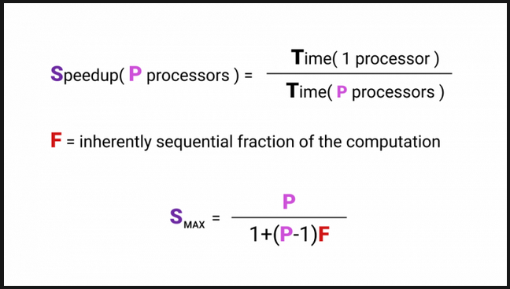

**Ускорение (Speedup)** — это время выполнения программы на одном процессоре, делённое на время выполнения на $P$ процессорах. Буквой **$F$****&#x20;(Fraction)** обозначена та часть программы, которая *обязана* выполниться последовательно.

Главное следствие: от $F$ сильно зависит максимальное ускорение с ростом числа ядер. Даже если всего лишь 5% программы должно выполняться последовательно, максимальное ускорение резко ограничено.

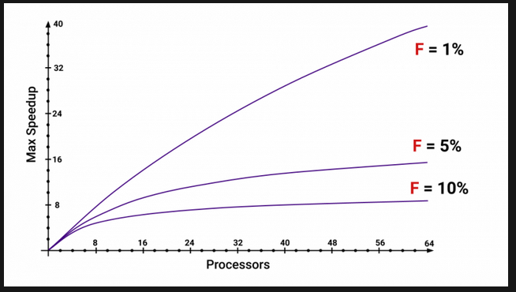

Факторы, увеличивающие $F$:

* Последовательные участки кода (инициализация, финальная сборка результата).
* Синхронизация — блокировки, ожидание каналов.
* Разделяемые структуры данных, к которым нужен эксклюзивный доступ.

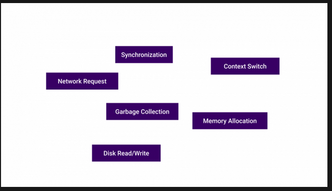

> **Зачем это Go-разработчику.** Закон Амдала даёт трезвую оценку: бесконечно наращивать число горутин и ядер бессмысленно. Узким местом становится последовательная часть. Прежде чем распараллеливать, стоит оценить долю $F$ — это убережёт от напрасных усилий.

***

## 3. CPU Bound vs I/O Bound

Не всегда имеет смысл использовать многопоточность. Сначала нужно определить тип нагрузки.

| Тип нагрузки  | Характеристика                                                                          |
| ------------- | --------------------------------------------------------------------------------------- |
| **CPU Bound** | Производительность ограничена скоростью процессора.                                     |
| **I/O Bound** | Производительность ограничена скоростью (временем ожидания) I/O-подсистемы: сеть, диск. |

Поход в сеть — ждём ответа. Поход на диск — опять ждём ответа. Одно ядро или тысяча — при I/O Bound нагрузке увеличения производительности от распараллеливания мы не получим. При CPU Bound нагрузке шанс получить ускорение есть.

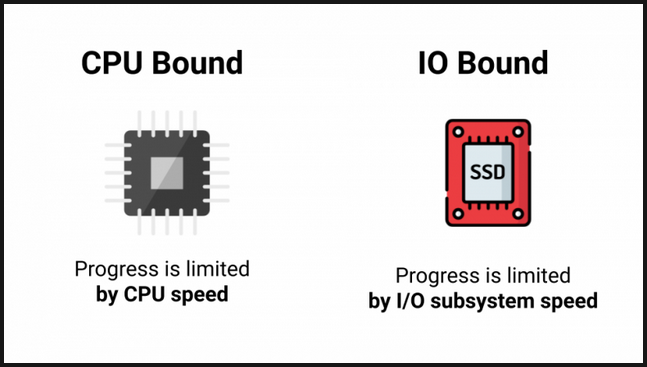

Бывают ситуации, когда кажущаяся CPU Bound нагрузка на деле вырождается в I/O Bound. Например, мы хотим просуммировать все элементы большого массива: пишем цикл, всё работает. Затем делим массив на чанки и распараллеливаем. В итоге процессор обрабатывает данные быстрее, чем они успевают приходить из памяти. Большую часть времени мы ждём данные из памяти — нагрузка, казавшаяся CPU Bound, оказывается I/O Bound.

> **Зачем это Go-разработчику.** Перед распараллеливанием всегда профилируйте: `go test -bench . -cpuprofile cpu.out`. Если большую часть времени программа ждёт сеть или диск, добавление горутин не поможет. Если упираетесь в процессор — параллелизм может дать выигрыш, но помните о законе Амдала и накладных расходах на синхронизацию.

***

## 4. Горутины и примитивы синхронизации — что нужно знать

Прежде чем разбирать ошибки конкурентности и работу планировщика, зафиксируем базовые инструменты, которыми оперирует Go-разработчик.

### Горутина

**Горутина (goroutine)** — это легковесный поток выполнения, управляемый рантаймом Go. Запускается ключевым словом `go`:

```go
go func() {
    // этот код выполняется конкурентно
}()

```

Горутины не являются потоками ОС. Рантайм Go отображает множество горутин на меньшее число потоков ОС (модель **M:N scheduling**). Создание горутины дёшево — стек начинается с нескольких килобайт и растёт динамически. На одной машине можно запустить сотни тысяч горутин.

### Каналы

**Канал (channel)** — типизированный механизм коммуникации между горутинами. Каналы обеспечивают синхронизацию и передачу данных:

```go
ch := make(chan int)      // небуферизированный канал
ch := make(chan int, 10)  // буферизированный канал ёмкостью 10

```

* **Небуферизированный канал**: отправитель блокируется, пока получатель не прочитает значение, и наоборот. Это средство не только передачи данных, но и синхронизации.
* **Буферизированный канал**: отправитель блокируется, только когда буфер заполнен; получатель — когда буфер пуст.

### sync.Mutex и sync.WaitGroup

**`sync.Mutex`** — мьютекс (взаимная блокировка), обеспечивающий эксклюзивный доступ к критической секции:

```go
var mu sync.Mutex
var counter int

func increment() {
    mu.Lock()
    counter++
    mu.Unlock()
}

```

**`sync.WaitGroup`** — ожидание завершения группы горутин:

```go
var wg sync.WaitGroup
for i := 0; i < 5; i++ {
    wg.Add(1)
    go func() {
        defer wg.Done()
        // работа
    }()
}
wg.Wait()

```

Существуют и другие примитивы: `sync.RWMutex` (читатели не блокируют друг друга), `sync.Once` (однократное выполнение), `sync.Cond` (условная переменная).

> **Зачем это Go-разработчику.** Горутины, каналы и примитивы `sync` — три кита конкурентного кода в Go. Выбор между каналами и мьютексами определяется задачей: каналы хороши для *коммуникации* между горутинами, мьютексы — для *защиты разделяемого состояния*. Идиома Go: «Do not communicate by sharing memory; instead, share memory by communicating».

***

## 5. Планировщик Go

Когда мы работаем с конкурентным кодом, в игру вступают планировщики. В Go есть **user-space scheduler**, который оперирует горутинами. В операционной системе — свой планировщик, оперирующий потоками ОС. В процессоре — свои механизмы вроде **branch prediction**, способные нарушить нашу картину линеаризуемости.

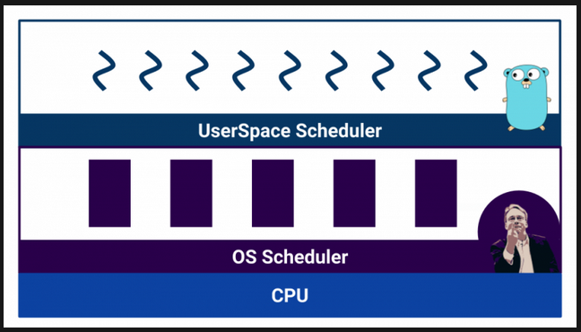

### Кооперативная и вытесняющая многозадачность

Планировщики разделяют по типу многозадачности:

| Тип                                                          | Описание                                                                                                              |
| ------------------------------------------------------------ | --------------------------------------------------------------------------------------------------------------------- |
| **Кооперативная многозадачность (cooperative multitasking)** | Выполняющийся процесс сам решает, когда передать управление другому.                                                  |
| **Вытесняющая многозадачность (preemptive multitasking)**    | Внешний компонент — scheduler — контролирует, сколько ресурса отведено процессу, и может прервать его в любой момент. |

Кооперативная многозадачность позволяет одному процессу монополизировать CPU, зато переключение контекста эффективнее: процесс точно знает, в какой момент уступить. В вытесняющей многозадачности такого не произойдёт — контролирующий орган гарантирует справедливость, но переключение может случиться в неудобный момент.

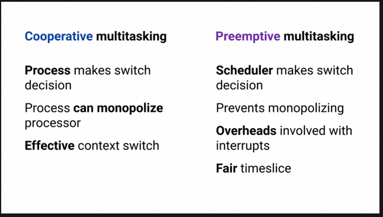

**В операционной системе используется вытесняющая многозадачность**, потому что ОС обязана гарантировать равные условия каждому пользователю.

### Как устроен планировщик Go

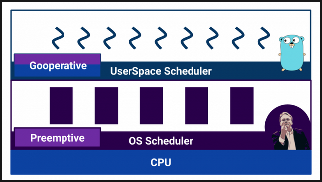

Формально планировщик Go — **вытесняющий**. Но внешнего компонента-планировщика в рантайме нет. Вместо этого **компилятор Go расставляет точки переключения контекста** — вызовы `runtime.morestack()` и `runtime.newstack()` при вызовах функций. Дополнительно `runtime.Gosched()` позволяет явно запросить переключение, а блокировки, сетевые вызовы и системные вызовы также приводят к смене горутины.

Такой подход делает переключение горутин очень эффективным, но непонимание этого механизма может привести к неожиданному поведению.

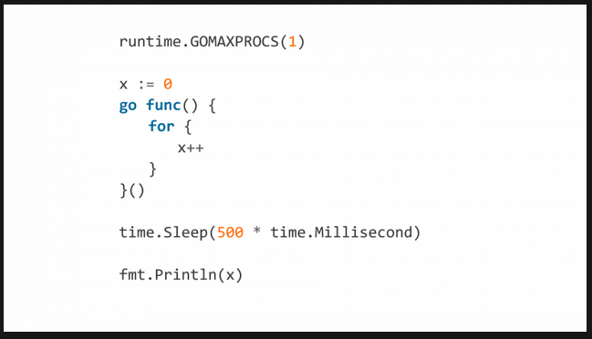

Этот код зависнет: `GOMAXPROCS=1` заставляет программу использовать одно ядро. Бесконечный цикл внутри одной горутины не содержит вызовов функций — компилятор не вставит точку переключения контекста. После `time.Sleep` горутина запустится, но выхода из цикла уже не будет.

Если внутрь цикла добавить `runtime.Gosched()`, всё заработает — мы явно просим переключить контекст.

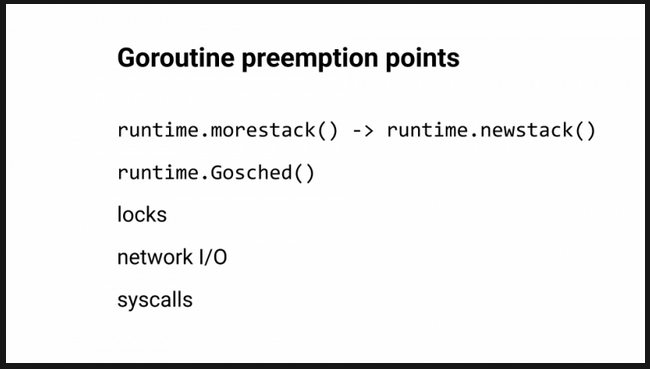

Точки переключения контекста в Go:

* Вызов функции (`runtime.morestack()`, `runtime.newstack()`).
* Явный вызов `runtime.Gosched()`.
* Блокирующие операции: каналы, мьютексы, сетевые и системные вызовы.

> **Зачем это Go-разработчику.** Понимание работы планировщика объясняет, почему `GOMAXPROCS` и отсутствие вызовов функций могут приводить к зависанию. На практике: не полагайтесь на то, что планировщик «сам разберётся», особенно в tight loops. Если цикл не содержит вызовов — дайте планировщику шанс через `runtime.Gosched()` или вызов функции.

***

## 6. Модель памяти Go и отношение happens-before

Чтобы понимать причины гонок и смысл атомарных операций, нужно знать, как Go определяет порядок выполнения операций в конкурентной программе.

### Модель памяти

**Модель памяти Go** определяет условия, при которых чтение переменной в одной горутине гарантированно наблюдает запись в ту же переменную, сделанную в другой горутине. Ключевое понятие — **happens-before** (происходит-до).

Если событие $A$происходит до события $B$, то $B$ «видит» результаты $A$. Если два события не связаны отношением happens-before (в обе стороны), то они конкурентны — их порядок не определён, и результат программы может быть разным при разных запусках.

### Синхронизированные и несинхронизированные обращения

Happens-before возникает в следующих случаях:

* **Инициализация пакета**: инициализация одного пакета происходит до main.
* **Создание горутины**: `go` вызывается до начала выполнения горутины.
* **Завершение горутины**: не гарантирует happens-before ни с чем, если нет явной синхронизации (отсюда и нужен `sync.WaitGroup`).
* **Каналы**: отправка в канал происходит до получения из него.
* **Мьютексы**: `Unlock` происходит до последующего `Lock`.
* **`sync/atomic`**: атомарные операции устанавливают happens-before между записью и чтением.

### Почему компилятор и процессор переупорядочивают инструкции

И компилятор Go, и процессор могут менять порядок выполнения инструкций ради производительности — при условии, что в *одной* горутине наблюдаемое поведение не меняется. Но в конкурентной программе переупорядочивание может привести к тому, что другая горутина увидит частично выполненные изменения:

```go
var a, done int

// Горутина 1
a = 42
done = 1

// Горутина 2
if done == 1 {
    fmt.Println(a) // может напечатать 0!
}

```

Компилятор может поменять местами присваивания `a` и `done`, и тогда горутина 2 увидит `done == 1` до того, как `a` получит значение 42.

> **Зачем это Go-разработчику.** Модель памяти — не абстракция, а практический инструмент. Без понимания happens-before Race Detector остаётся «магией», а атомарные операции — «странным синтаксисом». Правило: любое разделяемое состояние, к которому обращаются несколько горутин, должно быть либо защищено мьютексом/каналом, либо изменяться через атомарные операции.

> Разделяемое состояние (shared state) — это данные (переменная, поле структуры, элемент слайса/мапа, буфер канала и т.д.), к которым одновременно обращаются (читают или записывают) две или более горутин без явной синхронизации. Простыми словами: это «общая память», которую несколько горутин видят и изменяют.

***

## 7. Race Condition (Состояние гонки)

Одна из самых частых ошибок конкурентного программирования — **Race Condition (состояние гонки)**. Суть в том, что операция, выглядящая как одно действие, на деле состоит из нескольких шагов. Например, инкремент:

1. Процессор читает данные из памяти в регистр.
2. Обновляет регистр.
3. Пишет данные обратно в память.

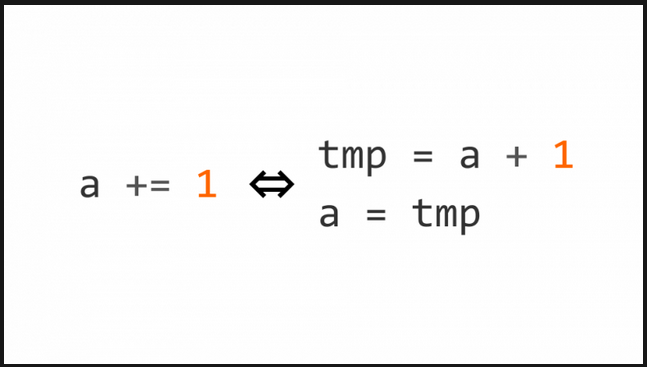

Эти три операции выполняются **не атомарно**. Планировщик может вытеснить горутину на любом шаге. Если вторая горутина прочитает то же значение до того, как первая запишет обновлённое, — один инкремент потеряется.

Вот пример кода — инкремент разложен на несколько операций:

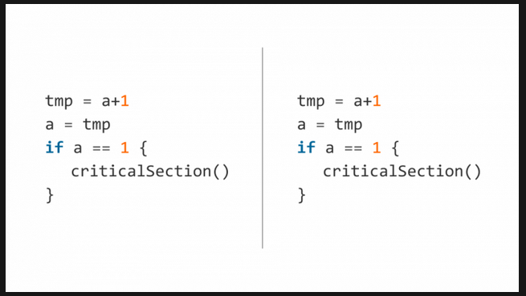

Планировщик может вытеснить первый поток после первой строки, а второй поток — уже после проверки условия. Тогда оба потока попадут в **критическую секцию** — участок кода, куда одновременный доступ запрещён.

### Защита мьютексом

Мы можем защитить критическую секцию с помощью **`sync.Mutex`**:

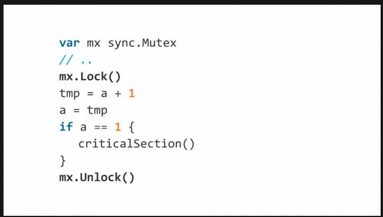

`Lock()` и `Unlock()` явно указывают: этот код должен выполняться только одной горутиной единовременно.

### Атомарные операции

Блокировки — достаточно дорогая операция. На уровне процессора существуют **атомарные операции** — инструкции, выполняющиеся за один неделимый шаг. Инкремент можно сделать атомарным через `atomic.AddInt64` из пакета `sync/atomic`:

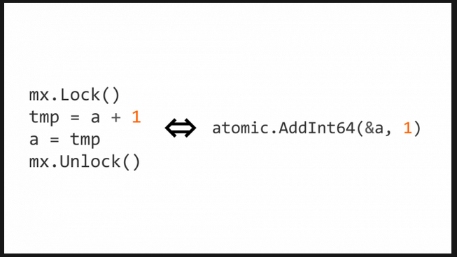

Важно: при использовании атомарных операций и чтение должно быть атомарным — через `atomic.LoadInt64`. Смешивание атомарных и неатомарных обращений к одной переменной ведёт к гонкам.

> **Зачем это Go-разработчику.** Выбор между мьютексом и атомиком — это выбор между простотой и производительностью. Мьютекс проще в использовании и защищает целые блоки кода. Атомики быстрее, но ограничены отдельными переменными и требуют дисциплины: все обращения к переменной должны быть атомарными. Для простых счётчиков и флагов — атомики. Для сложных структур данных — мьютекс.

***

## 8. False Sharing

**False Sharing** — ситуация, когда ядра процессора начинают мешать друг другу на уровне кэша.

У каждого ядра есть свой **L1 Cache**, поделённый на **кэш-линии (Cache Line)** по **64 байта**. Когда процессор читает данные из памяти, он всегда получает не меньше 64 байт. Когда он *изменяет* эти данные, кэш-линия инвалидируется во всех остальных ядрах.

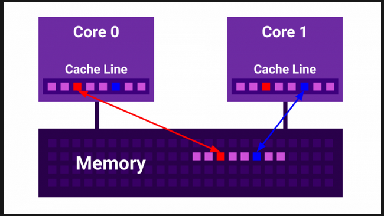

Если две переменные, изменяемые разными ядрами, попадают в одну кэш-линию (расстояние между ними меньше 64 байт), ядра начинают постоянно инвалидировать кэши друг друга. В результате последовательная версия программы может работать *быстрее*, чем многопоточная. Чем больше ядер — тем хуже производительность.

> **Зачем это Go-разработчику.** False Sharing проявляется в высокопроизводительном коде: пулы объектов, кольцевые буферы, счётчики в массиве. Защита: разносить часто изменяемые разными горутинами поля структур с помощью **padding** — добавить неиспользуемые байты между полями, чтобы гарантировать их попадание в разные кэш-линии. В Go для этого используют `_ [64]byte` или `_ cpu.CacheLinePad` из `golang.org/x/sys/cpu`.

***

## 9. Deadlock

**Deadlock (взаимная блокировка)** — ситуация, когда две или более горутин навсегда застывают в ожидании ресурсов, которыми владеют друг друга.

### Классический deadlock на мьютексах

Есть два ресурса — два `sync.Mutex`. Первая горутина захватывает первый мьютекс, вторая — второй. Затем первая пытается захватить второй (занят), вторая — первый (занят). Обе заблокированы навсегда:

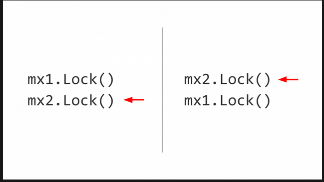

Решение: брать и отдавать блокировки в одинаковом порядке *во всей программе*. Простое правило, но поддерживать его на всём жизненном цикле продукта непросто.

### Deadlock на каналах

Deadlock не ограничивается мьютексами. Вот пример из кода проекта **etcd**:

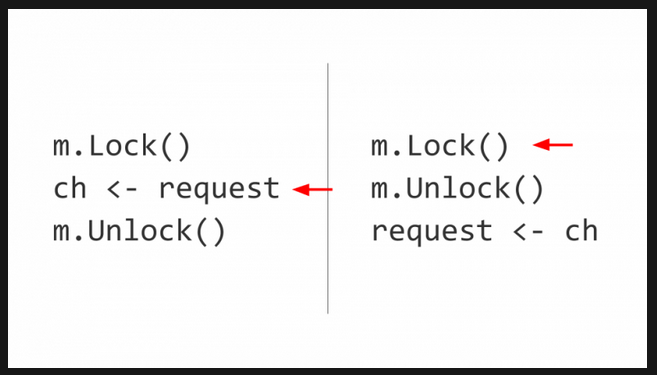

Запись в небуферизированный канал — блокирующая: чтобы записать, нужен читатель с другой стороны. Здесь горутина захватывает мьютекс и пытается писать в канал, ожидая читателя. Вторая горутина не может захватить мьютекс (он занят первой), чтобы стать читателем. Deadlock.

> **Зачем это Go-разработчику.** Deadlock легче предотвратить, чем исправить. Три правила: (1) всегда берите блокировки в одном порядке; (2) не держите мьютекс во время операций с каналами; (3) если программа зависла — запустите `go tool pprof` с goroutine profile, чтобы увидеть, где застряли горутины.

***

## 10. Другие проблемы конкурентности: Livelock, Starvation, Lock Contention

Помимо гонок и deadlock'ов, существуют менее очевидные, но столь же опасные проблемы.

### Livelock

**Livelock** — родственник deadlock'а, но с важным отличием: горутины *не заблокированы*. Они активны, меняют свои состояния, совершают действия — но полезная работа не прогрессирует. Часто возникает, когда алгоритмы обнаружения конфликтов заставляют горутины постоянно отступать и повторять попытки, а из-за неудачной синхронизации они снова и снова сталкиваются.

### Starvation (голодание)

**Starvation** — ситуация, когда горутина не может получить доступ к ресурсу в течение длительного времени, в то время как другие получают его регулярно. В Go голодание может случиться, если:

* Горутина выполняет тяжёлые вычисления без переключения контекста.
* Приоритеты выстроены так, что одни задачи постоянно вытесняют другие.
* Мьютекс постоянно захватывается «шустрыми» горутинами, не оставляя шанса «медленным».

Программа продолжает работать, но для некоторых операций время отклика становится катастрофически большим.

### Lock Contention (борьба за блокировку)

**Lock Contention** — проблема производительности при активном использовании блокировок. Множество горутин пытаются захватить один и тот же мьютекс, выстраиваются в очередь и большую часть времени проводят не за полезной работой, а в ожидании. Процессоры простаивают или тратят ресурсы на переключение контекста.

Сигнал к тому, что выбрана слишком грубая гранулярность блокировок: один большой мьютекс защищает слишком много данных. Решения:

* Разбить структуру данных на независимые части с отдельными блокировками.
* Использовать `sync.RWMutex` там, где много читателей и мало писателей.
* Перейти на атомарные операции там, где это возможно.

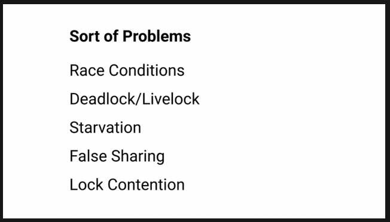

> **Зачем это Go-разработчику.** Livelock и starvation сложнее поймать, чем deadlock: программа не зависает, а просто работает медленно или «странно». Lock contention диагностируется через block profile и mutex profile. Общее правило: чем меньше общих данных и чем реже блокировки, тем меньше проблем.

***

## 11. Опасности оптимизаций

Блокировки надёжны, но могут быть дороги. Атомики дёшевы, но ограничены. Желание «ускорить» код приводит к опасным оптимизациям.

Рассмотрим классический паттерн **double-checked locking** — проверка флага без синхронизации, а затем перепроверка под мьютексом:

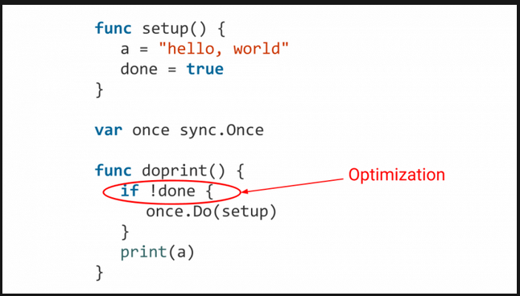

На первый взгляд всё корректно. Но компилятор может поменять местами инструкции присваивания — `done = true` до присваивания `a = value`. В результате другая горутина увидит `done == true` и прочитает `a`, которая ещё не получила значение.

### Когда lock-free оправдан

Lock-free код (без блокировок, на атомарных операциях) оправдан, когда:

* Профилирование показало, что узкое место — именно contention на мьютексе.
* Операции действительно простые (один счётчик, один указатель).
* Вы понимаете модель памяти Go и гарантии, которые даёт `sync/atomic`.

Неоправданный lock-free код — источник трудновоспроизводимых багов.

> **Зачем это Go-разработчику.** Правило: не жертвуйте корректностью ради производительности, пока профилирование не доказало, что это необходимо. Если упираетесь в мьютекс — сначала попробуйте уменьшить гранулярность блокировок или перейти на `sync.RWMutex`. Lock-free — крайняя мера.

***

## 12. Инструменты диагностики

Go предоставляет мощные инструменты для поиска и исправления проблем конкурентности. Два главных — **Race Detector** (обнаруживает некорректность) и **Block Profile** (обнаруживает неэффективность).

### Race Detector

**Race Detector** встроен в инструментарий Go и запускается флагом `-race`:

```shellscript
go test -race ./...
go run -race main.go
go build -race -o myapp .

```

Он отслеживает все обращения к памяти и фиксирует ситуацию, когда две горутины обращаются к одной переменной без синхронизации, и хотя бы одно обращение — запись.

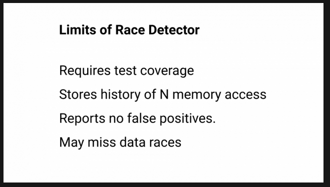

**Ограничения Race Detector:**

1. **Проверяется только исполненный код.** Если ветка кода не выполнилась — Race Detector её не проверит. Поэтому покрытие тестами должно быть высоким.
2. **Ограниченная глубина истории.** Race Detector запоминает историю обращений к каждому слову в памяти. В Go глубина этой истории равна четырём — четыре последних доступа. Если гонка не попала в это окно, она не будет обнаружена.
3. **Замедление.** Программа под Race Detector работает в 5–10 раз медленнее и потребляет больше памяти. Не используйте в продакшене.

**Race Detector никогда не ошибается:** если он сообщил о гонке — гонка есть. Но он **поймает не все ошибки** — отсутствие сообщений не гарантирует отсутствия гонок.

### Block Profile

**Block Profile** отвечает на вопрос: «Где горутины проводят время в ожидании и почему это тормозит работу?» В отличие от CPU-профиля, который показывает процессорное время, block profile фокусируется на блокировках:

* Ожидание захвата мьютекса.
* Операции с каналами (отправка/получение, когда горутина вынуждена ждать).
* Ожидание на некоторых других синхронизирующих конструкциях.

**Block profile не включается по умолчанию.** Его нужно явно активировать:

```go
runtime.SetBlockProfileRate(rate)

```

Параметр `rate` определяет частоту сэмплирования. При `rate = 1` профилируется каждое событие блокировки. При `rate = 10000` события сэмплируются с вероятностью, стремясь записывать одно событие на каждые `rate` наносекунд ожидания. Значение `rate <= 0` отключает профилирование.

Использовать можно:

* В бенчмарках: `go test -bench . -blockprofile block.out`
* На боевой нагрузке: через `net/http/pprof`, эндпоинт `/debug/pprof/block`

Для каждого места блокировки профиль показывает два числа: количество блокировок и суммарное время ожидания.

**Ограничения Block Profile:**

* Не показывает блокировки на системных вызовах (чтение файла, сетевой ввод-вывод).
* Не отслеживает `time.Sleep` — это осознанное ожидание.
* Суммарное заблокированное время может превышать реальное время работы программы — несколько горутин могут быть заблокированы одновременно, и их время суммируется.
* Показывает только *завершившиеся* блокировки. Если горутина зависла намертво — используйте **goroutine profile** (`/debug/pprof/goroutine`).


### Другие профили

* **Mutex profile** (`/debug/pprof/mutex`) — показывает contention на мьютексах. Включается через `runtime.SetMutexProfileFraction(rate)`.
* **Goroutine profile** (`/debug/pprof/goroutine`) — показывает стек всех горутин. Незаменим для поиска deadlock'ов и утекших горутин.

> **Зачем это Go-разработчику.** Race Detector и block/mutex/goroutine-профили — обязательные инструменты каждого Go-разработчика, работающего с конкурентностью. Race Detector стоит включить в CI-пайплайн (`go test -race ./...`). Профили помогают находить не только ошибки, но и узкие места по производительности.

***

## 13. Практические рекомендации

Сводка ключевых правил, вытекающих из всего изложенного выше.

### Когда применять параллелизм

* **CPU Bound нагрузка** — параллелизм может дать ускорение, но помните о законе Амдала.
* **I/O Bound нагрузка** — параллелизм не ускорит вычисления, но горутины помогут не блокировать обработку *других* запросов (конкурентность ради пропускной способности).
* Перед распараллеливанием — всегда профилируйте.

### Мьютексы vs атомики

| Критерий                | `sync.Mutex`                            | `sync/atomic`                 |
| ----------------------- | --------------------------------------- | ----------------------------- |
| Что защищает            | Блок кода (критическая секция)          | Отдельная переменная          |
| Производительность      | Выше накладные расходы                  | Минимальные накладные расходы |
| Сложность использования | Ниже                                    | Выше (нужна дисциплина)       |
| Когда применять         | Сложные структуры, несколько переменных | Счётчики, флаги, указатели    |

### Каналы vs мьютексы

* **Каналы** — для коммуникации между горутинами, передачи владения данными.
* **Мьютексы** — для защиты разделяемого состояния, к которому обращаются много горутин.
* Идиома Go: «Do not communicate by sharing memory; instead, share memory by communicating». Но это не догма — для счётчиков и кэшей мьютекс/атомик часто уместнее каналов.

### Порядок захвата блокировок

* Всегда берите и отдавайте блокировки в одном порядке во всей программе.
* Не держите мьютекс во время операций с каналами и сетевых вызовов.
* Если блокировок несколько — выносите захват во вспомогательные функции и документируйте порядок.

### Инструменты в CI

* `go test -race ./...` — обязательный шаг в CI-пайплайне.
* Периодический запуск бенчмарков с `-blockprofile` и `-mutexprofile` для выявления деградации производительности.

### Типовые паттерны конкурентности в Go

| Паттерн                  | Описание                                                                                                    |
| ------------------------ | ----------------------------------------------------------------------------------------------------------- |
| **Fan-out**              | Несколько горутин читают из одного канала и обрабатывают данные параллельно.                                |
| **Fan-in**               | Несколько горутин пишут в один канал; один читатель агрегирует результаты.                                  |
| **Pipeline**             | Цепочка горутин, соединённых каналами: каждая выполняет свой этап обработки и передаёт результат следующей. |
| **Worker pool**          | Фиксированное число горутин-воркеров обрабатывают задания из общего канала.                                 |
| **Context cancellation** | `context.Context` для передачи сигнала отмены и дедлайнов через цепочку горутин.                            |

> **Зачем это Go-разработчику.** Конкурентность в Go — мощный, но опасный инструмент. Зная фундаментальные ограничения (закон Амдала, CPU vs I/O, False Sharing), владея примитивами (горутины, каналы, мьютексы, атомики) и используя инструменты диагностики (Race Detector, профили), вы можете писать корректный и эффективный конкурентный код. А типовые паттерны уберегут от изобретения велосипеда.

***

## Ссылки

* [Параллелизм и конкурентность в Go (habr.com/avito)](https://habr.com/ru/companies/avito/articles/466495/)
* [Deadlocks, Livelocks, Starvation (medium.com)](https://medium.com/german-gorelkin/deadlocks-livelocks-starvation-ccd22d06f3ae)
