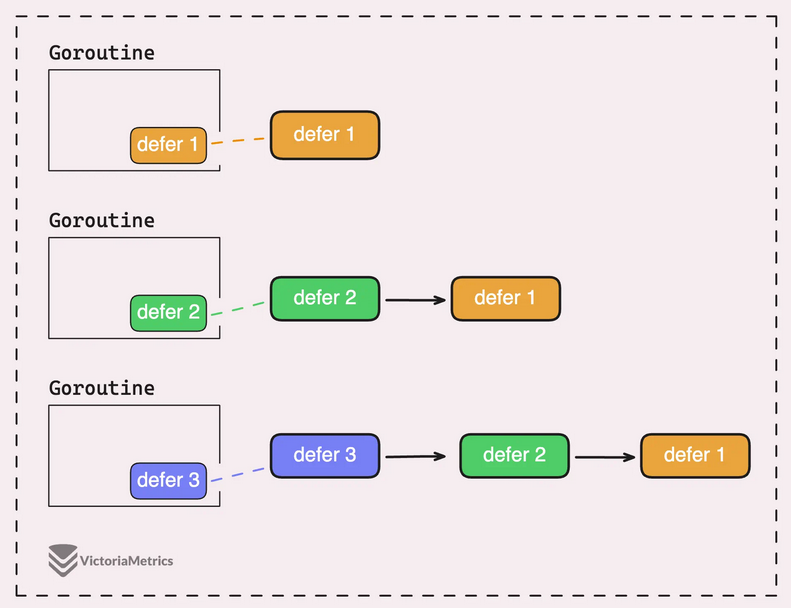
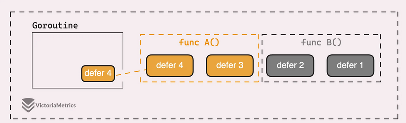
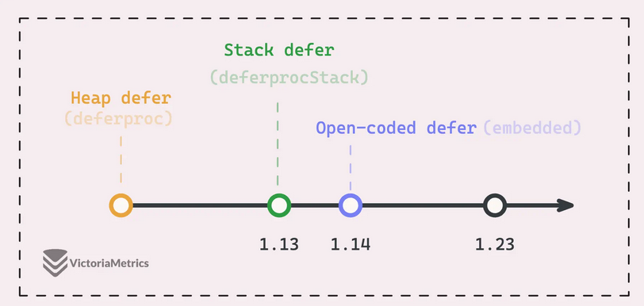

# Defer в Go

Ключевое слово **`defer`** — это механизм Go для гарантированного выполнения операции очистки перед выходом из функции, независимо от того, как именно функция завершилась: через обычный `return`, из-за **паники (panic)** или даже после восстановления через **`recover`**.

Проблема, которую решает `defer`: парные вызовы вида `Open`/`Close`, `Lock`/`Unlock`, `Acquire`/`Release` легко забыть или пропустить при досрочном `return`. `defer` действует по принципу «запланируй сейчас — исполнится позже», избавляя разработчика от необходимости дублировать код очистки во всех точках выхода.

Синтаксис:

```go
defer functionCall(args)

```

Базовый пример:

```go
defer fmt.Println("hello")

```

В этом фрагменте `defer fmt.Println("hello")` планирует выполнение печати в самом конце `main`. Таким образом, `fmt.Println("world")` вызывается немедленно, и сначала печатается `«world»`, а затем `«hello»`.

> **Зачем это Go-разработчику.** `defer` — идиоматичный способ управления ресурсами в Go. Он применяется для закрытия файлов, освобождения соединений с базой данных, снятия блокировок мьютексов, замера времени выполнения и многого другого. Правильное использование `defer` делает код чище и безопаснее.

***

## 1. Порядок выполнения нескольких defer

При использовании нескольких операторов `defer` в одной функции они выполняются в порядке **LIFO (Last In, First Out)** — последний задекларированный `defer` выполняется первым.

```go
defer fmt.Println("first")
defer fmt.Println("second")
defer fmt.Println("third")
// Output: third, second, first

```

Внутри рантайма Go каждое объявление `defer` добавляет объект **`_defer`** в начало односвязного списка текущей горутины. Принцип «добавляем в голову — читаем с головы» естественно даёт обратный порядок обхода:



Когда функция возвращается, рантайм проходит по цепочке `_defer` и выполняет каждый элемент. Однако важно понимать: выполняются **не все** отложенные вызовы в цепочке горутины, а только те, что относятся к возвращаемой функции. Цепочка может содержать `defer`-ы из множества разных функций — по одному звену для каждого активного вызова:

```go
func B() {
    defer fmt.Println(1)
    defer fmt.Println(2)
    A()
}

func A() {
    defer fmt.Println(3)
    defer fmt.Println(4)
}

```

Таким образом, при нормальном возврате выполняются только отложенные функции текущего **стекового кадра (stack frame)**:



Исключение составляет ситуация **паники**: в этом случае рантайм проходит по всем отложенным вызовам текущей горутины, разматывая стек вызовов до самого верха (или до `recover`).

> **Зачем это Go-разработчику.** Порядок LIFO естественен для очистки ресурсов: мы освобождаем их в порядке, обратном захвату. Например, сначала закрываем результат, потом транзакцию, потом соединение — именно в таком порядке они и должны «убираться».

***

## 2. Аргументы: захват по значению

Ключевое правило: **аргументы отложенного вызова вычисляются немедленно — в момент выполнения&#x20;****`defer`****, а не в момент вызова отложенной функции.** Это называется **захватом по значению**.

### Переменные

Пример:

```go
x := 10
defer fmt.Println(x) // 10 — аргумент вычислен здесь
x = 20

```

Результат выполнения — `10`, а не `20`. Причина: `defer` фиксирует значение `a` в момент своего объявления. Даже если `a` изменится позже, отложенный вызов по-прежнему держит старую копию.

Есть два способа получить актуальное значение переменной на момент выполнения `defer`.

**Способ 1: замыкание (closure).** Анонимная функция внутри `defer` не получает копию значения — она захватывает саму переменную и обращается к ней в момент выполнения:

```go
x := 10
defer func() { fmt.Println(x) }() // 20 — замыкание, видит текущее значение
x = 20

```

**Способ 2: передача указателя.** Вместо значения передаём адрес переменной в памяти:

```go
x := 10
defer func(x *int) { fmt.Println(*x) }(&x) // 20 — указатель
x = 20

```

Оба метода решают проблему, но замыкание считается более идиоматичным в Go для простого захвата переменных.

### Получатель метода — это тоже аргумент

Правило захвата по значению распространяется и на получателя метода. Пример с ловушкой:

```go
d := &Data{Value: 10}
defer fmt.Println(d.Value) // 10 — значение вычислено при defer
d.Value = 20

```

Результат — `10`. Причина: `defer` немедленно вычисляет получатель `d`, фиксируя значение поля `Amount` на момент объявления. По сути, получатель — это скрытый аргумент функции:

```go
// Метод: func (d Data) Print()
defer d.Print() // d — копия значения при defer

```

Замена `Data{}` на `&Data{}` не помогает — отложенная функция всё равно получит разыменованное значение на момент `defer`:

```go
d := &Data{Value: 10}
defer fmt.Println(d.Value) // всё равно 10 — значение разыменовано при defer

```

Правильное решение — сменить получатель метода со значения на указатель:

```go
d := &Data{Value: 10}
defer func() { fmt.Println(d.Value) }() // 20 — замыкание через указатель
d.Value = 20

```

Теперь `defer` фиксирует не копию структуры, а сам указатель. При выполнении отложенного вызова метод читает актуальное значение поля через указатель.

> **Зачем это Go-разработчику.** Непонимание захвата по значению — одна из самых частых причин трудноуловимых багов в продакшене, особенно когда `defer` используется с методами структур или с переменными, изменяемыми в цикле.

***

## 3. Panic и recover

**Паника (panic)** — это встроенный механизм Go, который останавливает нормальное выполнение текущей горутины и начинает **размотку стека**. Помимо ошибок компиляции, в рантайме могут возникать: деление на ноль (для целых чисел), выход за пределы диапазона, разыменование нулевого указателя и другие. Все они приводят к панике.

В процессе размотки выполняются **все** отложенные функции, зарегистрированные через `defer` в текущей горутине — в отличие от нормального возврата, где выполняются только `defer`-ы текущего стекового кадра.

**`recover`** — встроенная функция, которая перехватывает панику и возвращает значение, переданное в `panic`. Если паники нет, `recover` возвращает `nil`. Использовать `recover` имеет смысл **только внутри отложенной функции, вызванной напрямую**.

Корректный пример:

```go
defer func() {
    if r := recover(); r != nil {
        fmt.Println("recovered:", r)
    }
}()
panic("something went wrong")

```

В `panic` можно передать что угодно: строку, целое число, произвольный тип — `recover` вернёт именно это значение.

### Типичные ошибки при использовании recover

**Ошибка 1:&#x20;****`recover`****&#x20;передан непосредственно в&#x20;****`defer`****.**

```go
defer recover() // НЕПРАВИЛЬНО — recover() выполнен при defer, а не во время паники

```

Этот код всё равно вызывает панику — так задумано архитектурой рантайма Go. За кулисами `recover` вызывает **`runtime.gorecover`**, который проверяет, происходит ли вызов из правильного контекста: непосредственно из отложенной функции, активной в момент паники. Передача `recover` как аргумента `defer` лишает его этого контекста.

**Ошибка 2:&#x20;****`recover`****&#x20;во вложенной функции.**

```go
defer func() {
    func() {
        if r := recover(); r != nil {} // НЕ работает — recover не в defer-функции
    }()
}()

```

`recover` должен вызываться **напрямую** в теле отложенной функции, а не во вложенном вызове. В примере выше `recover` находится внутри анонимной функции, вложенной в `defer` — это нарушает требование рантайма.

**Ошибка 3: попытка перехватить панику в другой горутине.**

```go
go func() {
    defer func() {
        if r := recover(); r != nil {} // НЕ ловит панику из main
    }()
}()
panic("boom")

```

Цепочки отложенных вызовов привязаны к конкретной горутине. Одна горутина не может вмешаться в стек другой для обработки паники — у каждой свой независимый стек. Паника, возникшая в горутине без собственного `recover`, приводит к аварийному завершению всей программы.

> **Зачем это Go-разработчику.** `recover` критически важен в HTTP-обработчиках, фоновых воркерах и любых долгоживущих горутинах. Без него одна паника может уронить всё приложение. Типичный паттерн — `defer` с `recover` на верхнем уровне горутины, логирование ошибки и продолжение работы.

***

## 4. Defer и обработка ошибок

При использовании `defer` для вызова методов, возвращающих ошибку, легко потерять эту ошибку:

```go
defer f.Close() // ошибка Close() игнорируется

```

Проблема: `f.Close()` возвращает `error`, но `defer f.Close()` её игнорирует. Если метод `Close` возвращает ошибку (например, из-за прерванного системного вызова или ошибки ввода-вывода), эта информация теряется.

Для систем, требующих высокой доступности и надёжности, такое поведение неприемлемо.

**Решение: именованное возвращаемое значение +&#x20;****`errors.Join`****.**

```go
func processFile(name string) (err error) {
    f, err := os.Open(name)
    if err != nil { return err }
    defer func() {
        err = errors.Join(err, f.Close())
    }()
    // ...
    return nil
}

```

Этот подход:

* Использует **именованное возвращаемое значение** `err` — оно доступно отложенной функции через замыкание.
* Применяет **`errors.Join`** для объединения исходной ошибки и ошибки закрытия. Значения `nil` в `errors.Join` автоматически отбрасываются, поэтому код безопасен в одну строку.
* Сохраняет `defer`-стиль и при этом пробрасывает ошибку вызывающей стороне.

Альтернативный подход — логировать ошибку закрытия на месте, не пробрасывая её выше. Это проще, но менее гибко: вызывающая сторона не узнает о проблеме и не сможет принять решение (например, пометить операцию как сомнительную даже при успешном основном результате).

> **Зачем это Go-разработчику.** В production-системах потеря ошибок закрытия ресурсов может приводить к утечке дескрипторов, повреждению данных и трудновоспроизводимым сбоям. Именованное возвращаемое значение с `errors.Join` — идиоматичный способ решить эту проблему, не отказываясь от `defer`.

***

## 5. Внутреннее устройство defer

### Объект `_defer` и цепочка горутины

При вызове `defer` рантайм создаёт структуру **`_defer`**, содержащую всю необходимую информацию об отложенном вызове: указатель на функцию, сохранённые аргументы, ссылку на следующий `_defer` в цепочке и служебные флаги.

Этот объект добавляется в голову односвязного списка текущей горутины. При завершении функции (нормальном или из-за паники) компилятор обеспечивает вызов **`runtime.deferreturn`**, который проходит по цепочке и выполняет отложенные функции в правильном порядке.

### Аллокация: куча vs стек

До Go 1.13 все объекты `_defer` размещались исключительно в **куче (heap)**. Это универсально, но относительно медленно.

Начиная с Go 1.13 добавлена оптимизация, позволяющая выделять некоторые `_defer` прямо на **стеке (stack)** горутины, что значительно быстрее:



```go
for i := 0; i < 1000; i++ {
    defer mu.Unlock() // куча — каждый defer аллоцируется
}

```

Ключевой фактор, определяющий место аллокации — **контекст вызова&#x20;****`defer`**:

* **Внутри цикла** — гарантированно **куча**. Количество отложенных вызовов в цикле меняется динамически; куча, в отличие от стека, справляется с произвольным количеством объектов без риска переполнения.
* **Внутри&#x20;****`if`** — зависит от динамики. Если `defer` вызывается ровно один раз за время жизни функции и не в цикле, применяется стековая оптимизация. Если условие может выполниться несколько раз — компилятор не может гарантировать безопасность и размещает `_defer` в куче.

Для смягчения накладных расходов кучи рантайм использует **пул объектов&#x20;****`_defer`** с двумя уровнями:

* **Локальный кэш-пул** каждого логического процессора (P) — избегает блокировок между процессорами.
* **Глобальный пул**, разделяемый всеми горутинами — резервный источник.

Горутина сначала пытается взять `_defer` из локального пула своего P, и только при необходимости обращается к глобальному. После использования объект возвращается обратно в локальный пул, что сокращает количество выделений памяти и снижает нагрузку на сборщик мусора.

### Open-coded defer

Начиная с Go 1.13 также добавлена оптимизация **open-coded defer**. Вместо создания объекта `_defer` с последующим вызовом `runtime.deferreturn`, компилятор **встраивает код отложенной функции непосредственно в конец функции**, а также перед каждым оператором `return`.

Это позволяет избежать накладных расходов на аллокацию и вызовы рантайма. Ориентировочная производительность:

* Прямой вызов функции: \~6 нс
* Open-coded defer: \~35 нс
* Defer на куче (Go 1.12): \~50 нс

Однако у этой оптимизации есть **ограничения**:

1. Если в функции есть **хотя бы один** `defer`, размещаемый в куче, **ни один** `defer` в этой функции не будет оптимизирован open-coded способом.
2. Произведение количества `defer` на количество `return` не должно превышать **15** — иначе бинарный код слишком раздувается из-за дублирования перед каждой точкой выхода.
3. Максимальное количество `defer` в функции — **8**. Это связано с тем, что реализация использует битовую маску размером 8 бит для отслеживания выполненных `defer`.

```go
// Open-coded defer: компилятор встраивает defer напрямую
// Условия: не более 8 defer в функции, нет цикла,
// return не последняя инструкция

```

Приведённый фрагмент кода остаётся актуальным и для Go 1.23.

Open-coded defer эффективен в небольших функциях с простой структурой выходов и приближает производительность `defer` к производительности прямого вызова.

> **Зачем это Go-разработчику.** В критически горячих циклах, где важна каждая наносекунда, стоит оценить необходимость `defer` — возможно, ручной вызов очистки будет оправдан. Однако для подавляющего большинства прикладного кода накладные расходы `defer` пренебрежимо малы, а выигрыш в читаемости и безопасности огромен.

***

## 6. Итоги: лучшие практики

* Используйте `defer` для любых парных операций очистки — это идиоматично и безопасно.
* Помните о **захвате по значению**: если отложенной функции нужно актуальное значение переменной — используйте замыкание или передавайте указатель.
* Получатель метода — такой же аргумент с точки зрения `defer`. Для захвата актуального состояния структуры переходите на указательный получатель.
* `recover` размещайте **напрямую** в теле `defer`-функции, а не во вложенном вызове и не как аргумент `defer`.
* Паника не пересекает границы горутин — каждая горутина должна обрабатывать свои паники самостоятельно.
* Не игнорируйте ошибки из `Close`: используйте именованное возвращаемое значение с `errors.Join`.
* В критичных по производительности горячих циклах оценивайте необходимость `defer` — иногда ручная очистка оправдана.
* Для всего остального кода `defer` — выбор по умолчанию: накладные расходы минимальны, а выигрыш в надёжности значителен.

***

**Ссылки:**

[VictoriaMetrics: Defer in Go](https://victoriametrics.com/blog/defer-in-go/)
