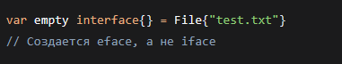
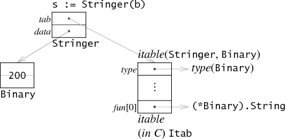

# Интерфейсы в Go

## 1. Введение: зачем нужны интерфейсы

При разработке на Go мы часто сталкиваемся с ситуацией, когда функция жёстко привязана к конкретному типу: она принимает `*UserService`, работает с `*PostgresDB`, возвращает `*JSONRenderer`. Такой код трудно тестировать — нельзя подменить реальную базу данных заглушкой. Его трудно расширять — чтобы добавить новое хранилище, придётся переписывать сигнатуры всех функций.

**Интерфейс** решает эту проблему. Вместо того чтобы говорить: «мне нужен именно `*PostgresDB`», код говорит: «мне нужен любой тип, который умеет сохранять и загружать данные». Интерфейс описывает **поведение**, а не конкретную реализацию. Это и есть **абстракция** — отделение контракта (что тип должен уметь) от реализации (как именно он это делает).

В этом документе мы разберём интерфейсы в Go на всех уровнях:

* Синтаксис и семантика — как объявить, как использовать.
* Практические приёмы — полиморфизм, type assertion, type switch.
* Подводные камни — пустой интерфейс, nil-интерфейсы.
* Внутреннее устройство — как интерфейс устроен «под капотом», структуры `iface` и `eface`.
* Идиомы и лучшие практики, принятые в Go-сообществе.

> **Зачем это Go-разработчику.** Интерфейсы — главный механизм абстракции в Go. Без них невозможны модульное тестирование (подмена зависимостей), инверсия зависимостей и построение расширяемых API. Понимание интерфейсов на всех уровнях — от синтаксиса до `unsafe.Pointer` — отделяет пишущего на Go от владеющего Go.

***

## 2. Определение интерфейса в Go

**Интерфейс в языке Go** — это специальный тип, который определяет набор сигнатур методов, но не содержит их реализацию. Интерфейсы позволяют описывать поведение типов, что делает код более гибким. Они добавляют абстракцию, позволяя работать с различными типами, не заботясь о конкретных реализациях.

```go
type Speaker interface {
    Speak() string
}
```

### Встраивание (композиция) интерфейсов

В Go интерфейсы поддерживают **встраивание**. Для этого в объявлении нового интерфейса нужно указать название другого интерфейса. Композиция позволяет собирать большие интерфейсы из маленьких, не дублируя сигнатуры методов:

```go
type ReadWriter interface {
    Reader
    Writer
}
```

Встраивание — одна из ключевых идиом Go. Стандартная библиотека активно использует этот приём: например, `io.ReadWriter` встраивает `io.Reader` и `io.Writer`, `io.ReadWriteCloser` добавляет к ним `io.Closer`. Такой подход позволяет клиентскому коду требовать ровно те методы, которые ему нужны — не больше и не меньше.

Интерфейс, полученный встраиванием, наследует все сигнатуры методов встроенных интерфейсов. Тип, реализующий составной интерфейс, должен реализовать все методы всех встроенных интерфейсов.

> **Зачем это Go-разработчику.** Интерфейс в Go — поведенческий тип: он описывает, что тип умеет делать, а не чем он является. Начинайте с маленьких одно-двух-методных интерфейсов и собирайте из них более specialised через композицию (`type ReadWriter interface { Reader; Writer }`). Это противоположно подходу «один большой интерфейс на все случаи жизни», который делает код жёстким для тестирования и расширения.

***

## 3. Неявная имплементация интерфейсов

В Go используется **неявная имплементация интерфейсов**. В других языках программирования требуется ключевое слово. В Go применяется **концепция утиной типизации** (*duck typing*): «если что-то выглядит как утка, плавает как утка и крякает как утка — это, вероятно, утка». Для того чтобы тип реализовывал интерфейс, ему необходимо реализовать все его методы. При этом можно реализовать больше методов, чем требуется, но меньше нельзя. Один тип может реализовывать несколько интерфейсов одновременно.

Неявная имплементация означает, что тип и интерфейс могут быть определены в разных пакетах, и автор типа может даже не знать о существовании интерфейса. Это даёт гибкость: вы можете определить интерфейс в своём пакете под свои нужды, и любой существующий тип из любого пакета, удовлетворяющий сигнатурам, автоматически станет его реализацией.

> **Зачем это Go-разработчику.** Неявная имплементация — осознанное проектное решение языка. Она поощряет определение маленьких интерфейсов в пакете-потребителе, а не в пакете-поставщике. Вы не обязаны объявлять «мой тип реализует такой-то интерфейс» — достаточно просто написать нужные методы. Это снижает связанность между пакетами и упрощает рефакторинг.

***

## 4. Полиморфизм через интерфейсы

**Полиморфизм** — это концепция, позволяющая объектам разных типов быть обработанными через единый интерфейс. Это даёт возможность писать более гибкий и расширяемый код: вы можете добавлять новые типы, реализующие интерфейс, без необходимости изменять существующий код, который работает с этим интерфейсом. С помощью интерфейсов мы абстрагируемся от конкретных типов.

Рассмотрим пример. У нас есть интерфейс `Animal` с методом `Speak() string` и три конкретных типа — `Dog`, `Cat` и `Cow`:

```go
type Animal interface {
    Speak() string
}

type Dog struct{}
func (d Dog) Speak() string { return "Гав!" }

type Cat struct{}
func (c Cat) Speak() string { return "Мяу!" }

type Cow struct{}
func (c Cow) Speak() string { return "Муу!" }
```

Функция, работающая с интерфейсом, не знает и не должна знать, какой конкретный тип перед ней:

```go
func MakeSound(a Animal) {
    fmt.Println(a.Speak())
}

func main() {
    animals := []Animal{Dog{}, Cat{}, Cow{}}
    for _, a := range animals {
        MakeSound(a) // Гав! Мяу! Муу!
    }
}
```

Ключевое преимущество: чтобы добавить четвёртое животное, достаточно создать новый тип с методом `Speak()` — функция `MakeSound` и цикл в `main` не требуют ни одной правки. Это и есть полиморфизм: разные типы взаимозаменяемы, если они удовлетворяют одному контракту.

> **Зачем это Go-разработчику.** Полиморфизм через интерфейсы — основа расширяемой архитектуры. Вы проектируете систему вокруг контрактов (интерфейсов), а не вокруг конкретных типов. При добавлении новой функциональности вы реализуете интерфейс новым типом — и весь существующий код продолжает работать без изменений. Это ключевой принцип, делающий возможным внедрение зависимостей (DI), стратегию (strategy pattern) и другие порождающие шаблоны в Go.

***

## 5. Type Assertion

**Type Assertion** позволяет нам вызывать только те методы, которые существуют у данного конкретного типа. Она возвращает две переменные: значение конкретного типа и флаг, указывающий на успешность преобразования значения интерфейсного типа в конкретный тип. После успешного преобразования мы можем вызывать методы, специфичные для этого конкретного типа.

Для каждой структуры `Dog` и `Cat` мы добавили уникальные методы:

```go
type Dog struct{}

func (d Dog) Speak() string { return "Гав!" }
func (d Dog) Guard()         { fmt.Println("Охраняю дом") }

type Cat struct{}

func (c Cat) Speak() string { return "Мяу!" }
func (c Cat) CatchMouse()   { fmt.Println("Ловлю мышей") }
```

Создадим функцию `processAnimalTypeAssertion`, которая принимает на вход интерфейс `Animal` и выполняет type assertion для проверки конкретного типа, чтобы вызвать его уникальные методы:

```go
func processAnimalTypeAssertion(a Animal) {
    if dog, ok := a.(Dog); ok {
        dog.Guard()
    } else if cat, ok := a.(Cat); ok {
        cat.CatchMouse()
    } else {
        fmt.Println("Неизвестное животное")
    }
}
```

При выполнении этого кода получим следующий вывод:

```
Охраняю дом
Ловлю мышей
```

### Безопасная и небезопасная форма

Type assertion существует в двух формах:

* **Безопасная (comma-ok):** `val, ok := iface.(ConcreteType)` — если приведение невозможно, `ok == false`, паники не происходит.
* **Небезопасная:** `val := iface.(ConcreteType)` — если приведение невозможно, возникает **паника** (panic). Используйте эту форму только когда вы абсолютно уверены в конкретном типе.

> **Зачем это Go-разработчику.** Type assertion — инструмент «последней мили», когда абстракции интерфейса недостаточно и нужен доступ к специфике конкретного типа. Типичные сценарии: обработка ошибок (type assertion к конкретному типу ошибки для извлечения дополнительной информации), работа с `interface{}` при десериализации JSON, реализация кастомных коллекций.

***

## 6. Type Switch

**Type Switch** предоставляет синтаксический сахар для работы с Type Assertion. Он позволяет проверить конкретный тип интерфейсного значения сразу на несколько типов, избегая цепочки `if-else` с type assertion. Таким образом можно заменить функцию `processAnimalTypeAssertion` функцией `processAnimalTypeSwitch`:

```go
func processAnimalTypeSwitch(a Animal) {
    switch v := a.(type) {
    case Dog:
        v.Guard()
    case Cat:
        v.CatchMouse()
    default:
        fmt.Println("Неизвестное животное")
    }
}
```

Синтаксис `switch v := x.(type)` — специальная конструкция, работающая только с интерфейсами. Переменная `v` в каждой ветке `case` имеет тип, указанный в этой ветке, и к ней можно обращаться напрямую, без дополнительного приведения.

Type switch компактнее, чем цепочка из нескольких type assertion, и лучше читается, когда количество проверяемых типов больше двух.

> **Зачем это Go-разработчику.** Type switch — основной инструмент для диспетчеризации по типу в Go. Он широко применяется в обработчиках форматов (JSON, XML, YAML), при реализации шаблона «посетитель» (visitor), в кодогенерации и в любых сценариях, где логика ветвится в зависимости от конкретного типа значения за интерфейсом.

***

## 7. Пустой интерфейс

**Пустой интерфейс** — это интерфейс, у которого отсутствуют методы. Для имплементации интерфейса нужно реализовать все его методы. Для имплементации пустого интерфейса не нужно реализовывать никаких методов. Соответственно, **любой тип в Go имплементирует пустой интерфейс**.

В других языках программирования такое называется **any**. В Go тоже есть `any` — это **алиас (псевдоним)** на пустой интерфейс:

```go
type any = interface{}
```

При создании переменной пустого интерфейса в дальнейшем мы можем присвоить ей значение любого типа:

```go
var i interface{}
i = 42
i = "hello"
i = struct{ name string }{name: "Go"}
```

### Когда использовать пустой интерфейс

**Пустой интерфейс ни о чём не говорит (interface{} says nothing).** Этот постулат означает, что интерфейсы — «поведенческие типы» — должны что-то означать. Если вы создаёте интерфейс, он служит конкретной цели и описывает конкретное поведение. Пустой же интерфейс (`interface{}`) не описывает никакого поведения и не несёт смысловой нагрузки.

Тем не менее, есть оправданные сценарии использования:

* Приём и возврат значений произвольного типа (JSON-десериализация, `fmt.Println`).
* Контейнеры общего назначения (связные списки, деревья — до появления дженериков это был единственный способ).
* Сигнатуры функций из стандартной библиотеки (`encoding/json.Marshal`, `sync.Map.Store`).

Общее правило: **не используйте&#x20;****`interface{}`****&#x20;без повода.** Если вам нужен всего один-два метода — объявите конкретный интерфейс. С появлением дженериков в Go 1.18 многие сценарии, где раньше требовался `interface{}`, теперь покрываются ти́повыми параметрами, которые безопаснее и выразительнее.


> **Зачем это Go-разработчику.** Видя `interface{}` в чужом коде, сразу задавайте вопрос: «а нельзя ли здесь обойтись конкретным интерфейсом или дженериком?» Пустой интерфейс сдвигает проверку типов с compile-time на runtime, а это прямой путь к паникам и трудноотлавливаемым багам.

***

## 8. nil-интерфейсы в Go

Мы можем создать переменную пустого интерфейса, и при сравнении с `nil` мы получаем `true` — это означает, что `interface == nil`. Далее мы можем создать указатель на структуру и снова сравнить его с `nil` — мы получаем `true`. Всё логично.

Теперь присвоим переменной интерфейса указатель на структуру. Сравнение с `nil` даёт `false`. Почему так происходит? После присвоения у интерфейса появляется конкретный тип — это значит, что значение интерфейса уже не равно `nil`. Поэтому при сравнении мы получаем `false`.

```go
var i interface{}    // i == nil → true
var p *int = nil     // p == nil → true
i = p                // i != nil → false! (тип *int, значение nil)
fmt.Println(i == nil) // false
```

**Интерфейс равен&#x20;****`nil`****&#x20;только тогда, когда и тип, и значение у него&#x20;****`nil`****.** Это одно из самых важных правил при работе с интерфейсами в Go.


### Типичная ловушка

```go
func getError() error {
    var err *MyError = nil
    return err // возвращаем nil-указатель конкретного типа
}

func main() {
    err := getError()
    if err != nil {
        fmt.Println("ошибка:", err) // напечатается, хотя err — nil-указатель!
    }
}
```

Функция `getError` возвращает `nil`-указатель типа `*MyError`, упакованный в интерфейс `error`. Интерфейс `error` при этом не `nil`, потому что его часть `type` содержит `*MyError`. Мораль: возвращайте из функций явный `nil`, а не `nil`-указатель конкретного типа, обёрнутый в интерфейс.

> **Зачем это Go-разработчику.** Это, пожалуй, самая распространённая ошибка с интерфейсами в Go. Запомните: `nil`-интерфейс ≠ интерфейс, содержащий `nil`-указатель. Всегда делайте `return nil` (без типа), а не `return (*MyError)(nil)`. Правило простое: если функция возвращает интерфейс, возвращайте нетипизированный `nil`.

***

## 9. Устройство интерфейса «под капотом»

Этот раздел описывает внутреннее устройство интерфейсов в рантайме Go. Понимание этих деталей не обязательно для повседневного программирования, но полезно для осознания производительности и поведения в граничных случаях.


### Интерфейс как пара (value, type)

Значение интерфейса можно рассматривать как кортеж из **значения** и **конкретного типа**: **(value, type)**.

* **Тип** — конкретный тип данных, к которому принадлежит значение (строка, число, структура и т.д.). Тип определяет, какие методы доступны для вызова на этом значении.
* **Значение** — конкретное значение, принадлежащее базовому типу (строка `"Hello"`, число `123`, экземпляр `Dog` и т.д.).

В Go есть два основных типа внутренних структур для интерфейсов:

* **`iface`** — для непустых интерфейсов (с методами).
* **`eface`** — для пустых интерфейсов (`interface{}`).


### Структура iface

```go
type iface struct {
    tab  *itab
    data unsafe.Pointer
}
```)

* **`tab *itab`** — указатель на **таблицу интерфейса (itable)**, которая содержит информацию о типе и методах, необходимых для реализации интерфейса. Эта таблица помогает Go определить, какие методы доступны для данного интерфейсного значения и как их вызывать.
* **`data unsafe.Pointer`** — указатель на конкретные данные или значение, которые реализуют интерфейс. Использование `unsafe.Pointer` позволяет интерфейсу ссылаться на данные произвольного типа, сохраняя при этом информацию о том, как к ним обращаться через `itab`.


### Структура itab

```go
type itab struct {
    inter *interfacetype
    _type *_type
    fun   [1]uintptr
}
```)

* **`inter *interfacetype`** — метаданные интерфейса.
* **`_type *_type`** — указатель на информацию о конкретном типе, который реализует интерфейс. Это позволяет Go знать, как обращаться с данными, которые реализуют интерфейс.
* **`fun [1]uintptr`** — массив указателей на функции, которые должны быть реализованы для удовлетворения интерфейса. Это позволяет динамически вызывать методы на интерфейсных значениях. `uintptr` — целочисленное представление адреса в памяти, указатель на первый элемент массива, который содержит указатели на методы. Размер массива `[1]` — чтобы сохранить указатель на первый элемент массива.


### Структура eface (пустой интерфейс)

В Go пустой интерфейс реализован структурой `eface`:

```go
type eface struct {
    _type *_type
    data  unsafe.Pointer
}
```)

`eface` проще, чем `iface`: в нём нет `itab`, поскольку нет методов для диспетчеризации. Остаются только указатель на информацию о типе и указатель на данные:




### Пример создания интерфейсного значения

```go
var w Writer
f := File{}
w = f
```

Что происходит при `w = f`:

1. Создаётся `itab` с информацией:
   * `inter` — тип `Writer`
   * `type` — тип `File`
   * `fun` — указатель на метод `File.Write`
2. Создаётся `iface`:
   * `tab` — указатель на созданный `itab`
   * `data` — указатель на копию `f`


### Иллюстрация хранения значений интерфейсного типа

Создадим пользовательский тип `Binary` с двумя методами: `String() string` и `Get() uint64`:

```go
type Binary uint64

func (b Binary) String() string { return fmt.Sprint(b) }
func (b Binary) Get() uint64    { return uint64(b) }
```

Создадим экземпляр структуры `Binary` и присвоим ему значение:

```go
b := Binary(200)
var s fmt.Stringer = b
```

Значение интерфейса представлено в виде пары из двух машинных слов: указатель на информацию о типе, хранящемся в интерфейсе, и указатель на связанные данные:



Первое слово в значении интерфейса указывает на таблицу интерфейсов `itable`. В ней хранится информация о конкретном типе `type` и списке указателей на методы `fun[0]`. В нашем случае `type` — `Binary`, методы — `String() string` и `Get() uint64`. Второе слово указывает на значение `data` — в нашем случае `200`.

> **Зачем это Go-разработчику.** Знание внутреннего устройства помогает понимать накладные расходы интерфейсов (два машинных слова на значение, динамическая диспетчеризация через `itab`) и избегать ошибок, связанных с `nil`-интерфейсами. Также это полезно при чтении исходного кода рантайма Go и при оптимизации критических по производительности участков.

***

## 10. Популярные интерфейсы стандартной библиотеки

Стандартная библиотека Go содержит множество интерфейсов, которые служат образцом дизайна и активно используются в повседневной разработке. Знание этих интерфейсов — часть базовой грамотности Go-разработчика.


### io.Reader и io.Writer

Одни из самых фундаментальных интерфейсов в Go:

```go
type Reader interface {
    Read(p []byte) (n int, err error)
}

type Writer interface {
    Write(p []byte) (n int, err error)
}
```

`io.Reader` представляет **источник данных**: файл, сетевое соединение, тело HTTP-ответа, буфер в памяти. `io.Writer` представляет **приёмник данных**: файл на запись, сетевое соединение на отправку, `os.Stdout`.

Мощь этих интерфейсов — в простоте: всего один метод в каждом. Благодаря этому весь код стандартной библиотеки, работающий с вводом-выводом (`io.Copy`, `io.ReadAll`, `io.TeeReader`), принимает не `*os.File`, а `io.Reader`/`io.Writer` — и работает с любым типом, который их реализует.


### fmt.Stringer

```go
type Stringer interface {
    String() string
}
```

Один из самых часто реализуемых интерфейсов. Определяет, как тип будет представлен в виде строки. Пакет `fmt` использует `Stringer` для всех функций печати (`Println`, `Sprintf` и т.д.). Если ваш тип реализует `String() string`, `fmt.Println(myValue)` автоматически вызовет этот метод.


### error

```go
type error interface {
    Error() string
}
```

Самый известный интерфейс в Go — и он состоит всего из одного метода. Простота `error` позволяет любому типу стать ошибкой. Стандартный паттерн:

```go
type MyError struct {
    Code int
    Msg  string
}

func (e *MyError) Error() string {
    return fmt.Sprintf("code %d: %s", e.Code, e.Msg)
}
```


### sort.Interface

```go
type Interface interface {
    Len() int
    Less(i, j int) bool
    Swap(i, j int)
}
```

Пример композитного интерфейса из трёх методов. Реализовав эти три метода для своего слайса, вы получаете доступ ко всей функциональности пакета `sort`: `sort.Sort()`, `sort.Reverse`, `sort.IsSorted`. Это яркий пример того, как стандартная библиотека предоставляет алгоритмы (сортировку), параметризованные интерфейсом.

> **Зачем это Go-разработчику.** Перечисленные интерфейсы — каркас, на котором держится огромная часть экосистемы Go. Реализовав `io.Reader`/`io.Writer`, ваш тип немедленно становится совместимым с сотнями функций stdlib и сторонних библиотек. Реализовав `error` — участвует в унифицированной обработке ошибок. Реализовав `fmt.Stringer` — получает человекочитаемое представление везде, где используется `fmt`. Стандартная библиотека Go проектировалась вокруг маленьких интерфейсов — это не случайность, а осознанный дизайн.

***

## 11. Лучшие практики

Этот раздел суммирует идиомы, принятые в Go-сообществе и подтверждённые опытом стандартной библиотеки.


### Принимай интерфейсы, возвращай структуры

Одна из главных поговорок Go: **«Accept interfaces, return structs»**. Функция должна принимать интерфейс (чтобы быть гибкой и не привязываться к конкретному типу), но возвращать конкретный тип (чтобы вызывающая сторона не теряла информацию о типе и могла использовать все методы возвращённого значения без type assertion).

```go
// Хорошо: принимает интерфейс, возвращает структуру
func NewServer(db Database) *Server { ... }

// Плохо: принимает структуру, возвращает интерфейс
func NewServer(db *PostgresDB) Database { ... }
```

Исключение — когда функция действительно должна вернуть разные типы в зависимости от входных данных (например, фабрика), но такие случаи редки и должны быть явно обоснованы.


### Чем больше интерфейс, тем слабее абстракция

**«The bigger the interface, the weaker the abstraction».** Интерфейс с десятью методами практически невозможно переиспользовать — очень немногие типы смогут его удовлетворить, да и клиенту вряд ли нужны все десять сразу. Маленький интерфейс (1–3 метода) легко реализовать, легко замокать в тестах, легко понять.

Стандартная библиотека — эталон этого принципа: `io.Reader` — 1 метод, `io.Writer` — 1 метод, `error` — 1 метод. Даже `sort.Interface` — 3 метода.


### Определяй интерфейс там, где он используется

В отличие от Java или C#, где интерфейс часто определяется рядом с реализацией, в Go интерфейс определяется **в пакете-потребителе**, а не в пакете-поставщике. Это следствие неявной имплементации: пакет, который использует абстракцию, сам решает, какие методы ему нужны.

```go
// В пакете, использующем хранилище (например, service)
type UserRepository interface {
    FindByID(id string) (*User, error)
    Save(u *User) error
}
```

Такой подход минимизирует зависимости между пакетами и позволяет разным потребителям определять свои «срезы» от одного и того же конкретного типа.


### Именование одно-методных интерфейсов

Одно-методный интерфейс принято называть по имени метода с суффиксом `-er`:

| Интерфейс   | Метод     |
| ----------- | --------- |
| `Reader`    | `Read`    |
| `Writer`    | `Write`   |
| `Stringer`  | `String`  |
| `Closer`    | `Close`   |
| `Marshaler` | `Marshal` |

Это не жёсткое правило, но устойчивая конвенция. Для интерфейсов с несколькими методами используют описательные имена: `ReadWriter`, `ReadWriteCloser`.

> **Зачем это Go-разработчику.** Эти практики — не догма, а выжимка коллективного опыта. Следование им делает код предсказуемым для других Go-разработчиков, упрощает код-ревью и снижает когнитивную нагрузку. Главное, что нужно запомнить: **интерфейсы в Go — про поведение, а не про данные. Маленькие, точечные, определённые потребителем.**

***

## 12. Ссылки

* [Go 101: Interfaces in Go](https://go101.org/article/interface.html) — исчерпывающий справочник по интерфейсам, включая внутреннее устройство и граничные случаи.
* [Russ Cox: Go Interfaces](https://research.swtch.com/interfaces) — статья Расса Кокса (одного из создателей Go) о дизайне и имплементации интерфейсов в рантайме.
* [Effective Go: Interfaces and Types](https://go.dev/doc/effective_go#interfaces_and_types) — раздел официального руководства, описывающий идиоматичное использование интерфейсов.
* [Go Interfaces Deep Dive](https://tul.github.io/2018/07/23/go-interfaces-deep-dive.html) — подробный разбор внутреннего устройства с диаграммами и пошаговыми объяснениями.
