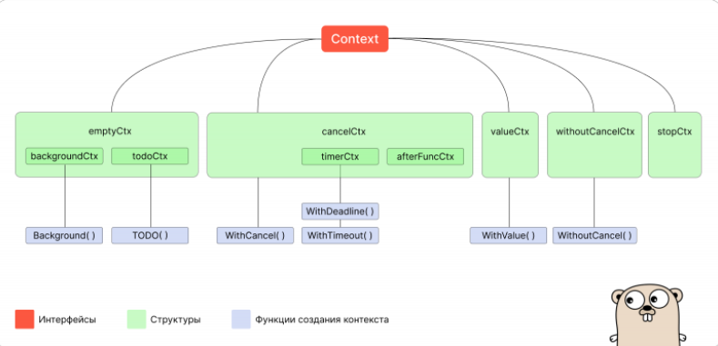
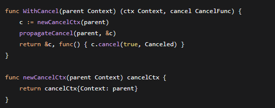
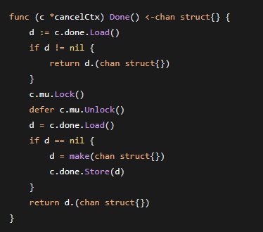
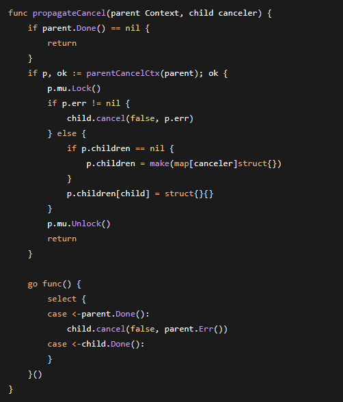
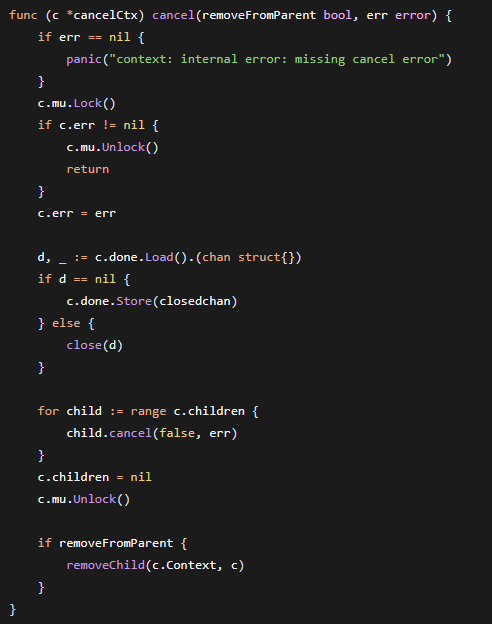

# Пакет Context в Go

## 1. Введение: зачем нужен контекст

Пакет **context** в Go — это механизм передачи сигналов отмены, дедлайнов и сквозных значений через цепочку вызовов функций и горутин. Он незаменим при взаимодействии с API, медленными процессами и в production-grade системах, обрабатывающих веб-запросы.

Основная задача контекста — дать горутине знать, что пора завершить работу. Контекст выступает в роли таймаута, дедлайна или канала, который сигнализирует о прекращении работы и вызывает `return`.

Представьте типичный сценарий: веб-сервер обрабатывает запрос, внутри которого вызывается внешнее API. Если API отвечает медленно, сервер накапливает открытые соединения — растёт нагрузка, падает производительность, возникает каскадный эффект. Контекст с таймаутом решает эту проблему: операция прерывается по истечении заданного времени, ресурсы освобождаются.

Пакет `context` глубоко интегрирован в экосистему Go: его принимают `net/http` (через `*http.Request`), `database/sql` (через `*sql.DB`), gRPC и большинство современных библиотек. Понимание контекста — обязательное требование к Go-разработчику.

> **Зачем это Go-разработчику.** Контекст — стандартный способ управлять жизненным циклом операций. Без него невозможно построить надёжный сервис с контролем таймаутов, graceful shutdown и распределённой трассировкой.

***

## 2. Корневые контексты: Background и TODO

Любое контекстное дерево начинается с корневого контекста. Пакет `context` предоставляет две функции для его создания.


### Background

`context.Background()` возвращает пустой контекст — корень всех производных контекстов в приложении. Используется на верхнем уровне: в `main`, в обработчиках запросов верхнего уровня, в тестах.

```go
ctx := context.Background()
```

Background никогда не отменяется, не имеет дедлайна и не хранит значений. Это чистый фундамент, от которого строятся все остальные контексты.


### TODO

`context.TODO()` также возвращает пустой контекст. Семантически он означает: «я пока не знаю, какой контекст здесь использовать, но оставляю заготовку на будущее».


```go
ctx := context.TODO()
```

Технически Background и TODO — экземпляры одного и того же внутреннего типа `emptyCtx`. Разница только в семантике: инструменты статического анализа (например, `go vet`) различают их и могут предупреждать о `TODO` в коде, помогая выявлять незавершённые участки на ранней стадии. Это особенно ценно в CI/CD-пайпланах.

> **Зачем это Go-разработчику.** `Background` — стартовая точка любого контекстного дерева. `TODO` — маркер того, что код ещё не финализирован. Не оставляйте `TODO` в production-коде.

***

## 3. Отмена контекста: WithCancel

`context.WithCancel(parent Context)` создаёт производный контекст от родительского и возвращает его вместе с функцией отмены `cancel`.


### Как работает отмена

Когда вызывается `cancel`, закрывается канал, возвращаемый методом `Done()` контекста. Все горутины, читающие этот канал, получают сигнал к завершению. Отмена распространяется каскадно: закрытие `Done()` родительского контекста автоматически закрывает `Done()` всех дочерних контекстов.


### Правило владения

Функцию `cancel` должна вызывать только та функция, которая создала контекст. Передача `cancel` в другие функции настоятельно не рекомендуется — это ведёт к неожиданным отменам и утечкам незакрытых контекстов.


### Метод Done()

Метод `Done()` возвращает канал типа `<-chan struct{}`. Этот канал закрывается в тот момент, когда контекст должен быть отменён — либо потому что была вызвана функция отмены, либо истёк таймаут, либо наступил дедлайн. Чтение из этого канала позволяет горутине узнать, что нужно завершить свою работу. Сам по себе канал `Done()` только читает сигнал, но не может его создать или изменить.

Вызов `cancel` закрывает канал, возвращаемый методом `Done()`. Также канал `Done()` дочернего контекста закрывается, если закрывается канал `Done()` родительского контекста.

```go
ctx, cancel := context.WithCancel(context.Background())
defer cancel()
```

> **Зачем это Go-разработчику.** `WithCancel` — основной механизм ручного управления жизненным циклом. Всегда используйте `defer cancel()` сразу после создания, чтобы гарантировать освобождение ресурсов.

***

## 4. Контекст с ограничением по времени: WithTimeout и WithDeadline

### WithDeadline

`context.WithDeadline(parent Context, d time.Time)` создаёт контекст, который автоматически отменяется в указанный момент времени или при вызове `cancel`.

```go
deadline := time.Now().Add(5 * time.Second)
ctx, cancel := context.WithDeadline(context.Background(), deadline)
defer cancel()
```

Метод `Deadline()` возвращает `time.Time` и `ok`. Если дедлайн установлен, `ok` равно `true`. Если передан уже прошедший момент времени, контекст создаётся сразу отменённым с ошибкой `DeadlineExceeded`.


### WithTimeout

`context.WithTimeout(parent Context, timeout time.Duration)` — обёртка над `WithDeadline`, принимающая не момент времени, а длительность.

```go
ctx, cancel := context.WithTimeout(context.Background(), 2*time.Second)
defer cancel()
```

Контекст отменяется по истечении `timeout` автоматически, но даже в этом случае **обязательно** вызывать `cancel` через `defer` — иначе таймер и связанные с ним ресурсы не освобождаются до срабатывания таймера. Допустимо делать отмену несколько раз: после первого вызова все последующие игнорируются.

```go
ctx, cancel := context.WithTimeout(context.Background(), 2*time.Second)
defer cancel() // обязательно, даже с авто-таймаутом
```

> **Зачем это Go-разработчику.** Таймауты — первая линия защиты от каскадных отказов. Каждый внешний вызов (HTTP, БД, gRPC) должен иметь разумный таймаут. `defer cancel()` обязателен всегда — автоотмена не заменяет ручную очистку.

***

## 5. Передача значений через контекст: WithValue

`context.WithValue(parent Context, key, val interface{})` создаёт контекст, в котором значение `val` связано с ключом `key` и доступно всем производным контекстам.

```go
type key int
const requestIDKey key = 0
ctx := context.WithValue(context.Background(), requestIDKey, "abc-123")
```


### Требования к ключу

Ключ не должен быть одним из встроенных типов — это предотвращает коллизии между разными пакетами. Ключ должен поддерживать операторы сравнения `==` и `!=`. Рекомендуется использовать неэкспортируемый пользовательский тип:

```go
type contextKey string
const traceIDKey contextKey = "trace_id"
```


### Когда использовать

WithValue уместен для **сквозных** данных, которые проходят через всю цепочку вызовов: идентификатор запроса, трассировочная информация, аутентификационные токены.


### Когда НЕ использовать

Категорически не рекомендуется передавать через контекст критические параметры функции — они должны быть явно указаны в сигнатуре. Передача параметров через контекст делает API непрозрачным и может привести к ошибкам.

```go
// АНТИПАТТЕРН: не передавайте бизнес-параметры через контекст
ctx = context.WithValue(ctx, "userID", 42) // плохо
```

> **Зачем это Go-разработчику.** WithValue — инструмент для сквозных данных, а не для неявной передачи параметров. Злоупотребление им делает код непонятным и труднотестируемым.

***

## 6. AfterFunc: отложенные действия при отмене

`context.AfterFunc(ctx Context, f func()) (stop func() bool)` появилась в Go 1.21 и решает задачу, которая раньше требовала неоправданно сложных решений.


### Проблема

Иногда нужно отменить блокирующую операцию (например, чтение из сетевого соединения), которая не поддерживает стандартный механизм отмены через контекст. До Go 1.21 приходилось запускать отдельную горутину, ожидающую `<-ctx.Done()`, и уже из неё прерывать операцию. Для быстрых операций накладные расходы на целую горутину были слишком велики.


### Решение

`AfterFunc` регистрирует функцию `f`, которая автоматически вызывается при отмене контекста (в том числе по таймауту или дедлайну). Если контекст уже отменён, `f` выполняется немедленно. Сама функция всегда запускается в отдельной горутине, а если вызвать `AfterFunc` несколько раз на одном контексте, каждая зарегистрированная функция выполняется независимо.

```go
stop := context.AfterFunc(ctx, func() {
    fmt.Println("cleanup on cancel")
})
defer stop() // отмена регистрации
```


### Стоп-функция

`AfterFunc` возвращает стоп-функцию, которая разрывает связь между контекстом и `f`:

* `true` — отмена регистрации прошла успешно, `f` не будет вызвана.
* `false` — контекст уже отменён, `f` либо выполняется, либо уже завершилась, либо стоп-функцию уже вызывали.

**Важно:** стоп-функция не дожидается завершения `f`. Если `f` уже запущена, вызов стоп-функции её не остановит. Для управления состоянием `f` нужны дополнительные механизмы синхронизации (`sync.WaitGroup`, каналы).

> **Зачем это Go-разработчику.** `AfterFunc` заменяет ручной запуск горутины для отмены блокирующих операций. Эффективнее по памяти и проще в использовании. Незаменима при работе с низкоуровневыми операциями ввода-вывода.

***

## 7. Контекст без отмены: WithoutCancel

`context.WithoutCancel(parent Context)` появилась в Go 1.21.

### Проблема

Классический сценарий: HTTP-сервер обрабатывает запрос и запускает фоновую операцию — отправку аналитики или запись в лог. Клиент разрывает соединение, контекст запроса отменяется, и фоновая операция аварийно завершается, хотя должна была продолжиться.

### Решение

`WithoutCancel` создаёт контекст, который:

* Наследует **значения** от родителя (через делегирование `Value`).
* Наследует **дедлайн** от родителя (через делегирование `Deadline`).
* **НЕ наследует отмену** — `Done()` всегда возвращает `nil`, `Err()` всегда возвращает `nil`.

Это избавляет от ручного копирования значений из исходного контекста в новый `context.Background()`.

> **Зачем это Go-разработчику.** `WithoutCancel` — чистый способ запустить фоновую операцию, сохранив сквозные данные запроса, но отвязавшись от его жизненного цикла.

***

## 8. Внутреннее устройство

### Иерархия типов

Пакет `context` в Go 1.21+ содержит следующие типы, реализующие интерфейс `Context`: `emptyCtx`, `backgroundCtx`, `todoCtx`, `cancelCtx`, `timerCtx`, `afterFuncCtx`, `valueCtx`, `withoutCancelCtx`, `stopCtx`. Большинство из них ассоциированы с функциями, создающими контекст.




### Интерфейс Context

В основе всей системы лежит интерфейс **Context**, определяющий контракт для всех реализаций:

```go
type Context interface {
    Deadline() (deadline time.Time, ok bool)
    Done() <-chan struct{}
    Err() error
    Value(key any) any
}
```

* `Deadline()` — узнать дедлайн.
* `Done()` — получить канал уведомления об отмене.
* `Err()` — выяснить причину отмены.
* `Value()` — извлечь связанное с контекстом значение.

Контексты передаются как неизменяемые объекты, формируя древовидную структуру. Корнем обычно служит `Background()`.


### emptyCtx — пустой контекст как фундамент

**emptyCtx** — простейший тип контекста: не хранит данных, не имеет срока действия, никогда не отменяется.

```go
type emptyCtx int
func (*emptyCtx) Deadline() (time.Time, bool) { return time.Time{}, false }
func (*emptyCtx) Done() <-chan struct{}             { return nil }
func (*emptyCtx) Err() error                       { return nil }
func (*emptyCtx) Value(key any) any                { return nil }
```

* `Done()` всегда возвращает `nil` — отмена невозможна.
* `Err()` всегда возвращает `nil`.
* `Value()` всегда возвращает `nil`.

Background и TODO — два разных экземпляра одного типа `emptyCtx`. Разделение сделано для статического анализа.

```go
var (
    background = new(emptyCtx)
    todo       = new(emptyCtx)
)
```


### cancelCtx — механизм отмены

Когда вызывается `WithCancel`, создаётся **cancelCtx**. Он встраивает родительский контекст и добавляет поля для управления отменой.



Внутренняя структура `cancelCtx`:

```go
type cancelCtx struct {
    Context
    mu       sync.Mutex
    done     atomic.Value // of chan struct{}
    children map[canceler]struct{}
    err      error
    cause    error
}
```

* `mu` — мьютекс, защищает критические секции (работа с дочерними контекстами, ошибка).
* `done` — атомарное значение, хранящее канал закрытия. Атомарность позволяет читать канал без захвата мьютекса в большинстве случаев.
* `children` — множество дочерних контекстов, отменяемых вместе с текущим.
* `err` — причина отмены (если уже произошла).

Тип `canceler` — внутренний интерфейс для типов, поддерживающих прямую отмену. Его реализации: `*cancelCtx` и `*timerCtx`.

```go
type canceler interface {
    cancel(removeFromParent bool, err, cause error)
    Done() <-chan struct{}
}
```


### Ленивая инициализация Done

Канал `Done` создаётся не в момент создания контекста, а при первом вызове метода `Done()`. Это экономит память: для контекстов, которые никогда не отменяются и чей канал никто не читает, канал не создаётся вообще.

Процесс при первом вызове:

1. Атомарная проверка: существует ли уже канал? Если да — немедленный возврат.
2. Захват мьютекса для защиты от гонок.
3. Повторная проверка под мьютексом (канал могли создать в другой горутине между шагами 1 и 2).
4. Создание канала и сохранение в атомарное поле.
5. Освобождение мьютекса, возврат канала.




### Метод Err

Метод `Err` захватывает мьютекс и возвращает сохранённую ошибку. Это гарантирует, что читатель увидит актуальное значение в момент чтения, даже при параллельной отмене.


### Связывание с родительским контекстом: propagateCancel

**propagateCancel** находит в цепочке родителей ближайший `cancelCtx` и добавляет новый контекст в его множество детей. Если родитель уже отменён, новый контекст отменяется немедленно с той же ошибкой



Особый случай: если в цепочке нет ни одного `cancelCtx` (родитель — пользовательская реализация `Context`), `propagateCancel` запускает отдельную горутину, ожидающую `Done()` родителя. Эта горутина живёт до отмены родителя или ребёнка — потенциальная утечка при массовом создании контекстов с кастомными родителями.


### Процесс отмены: метод cancel

Метод `cancel` (вызывается при ручном `cancel()` или срабатывании таймера):

1. Захват мьютекса, проверка на повторную отмену.
2. Сохранение ошибки.
3. Закрытие канала `done` (если создан) — **до** отмены детей.
4. Проход по всем дочерним контекстам с вызовом их `cancel`.
5. Освобождение мьютекса.




### Удаление из родителя: removeChild

**removeChild** находит родительский `cancelCtx` и удаляет текущий контекст из его множества детей

```go
func (c *cancelCtx) removeChild(child canceler) {
    c.mu.Lock()
    delete(c.children, child)
    c.mu.Unlock()
}
```


### timerCtx — контекст с таймером

**timerCtx** расширяет `cancelCtx`, добавляя таймер и дедлайн:


```go
type timerCtx struct {
    *cancelCtx
    timer    *time.Timer
    deadline time.Time
}
```

При создании через `WithDeadline` пакет проверяет, не имеет ли родитель более раннего дедлайна. Если имеет — создаётся не `timerCtx`, а обычный `cancelCtx` (оптимизация).

```go
func WithDeadline(parent Context, d time.Time) (Context, CancelFunc) {
    if cur, ok := parent.Deadline(); ok && cur.Before(d) {
        return WithCancel(parent) // родитель истекает раньше
    }
    // ... создаём timerCtx
}
```

Если дедлайн новый — создаётся `timerCtx` с таймером через `time.AfterFunc`. При ручном вызове `cancel` таймер останавливается во избежание двойной отмены.

Функция WithTimeout является простой оберткой над WithDeadline:

```go
ctx, cancel := context.WithTimeout(context.Background(), 2*time.Second)
defer cancel()
```


### valueCtx — контекст со значением

**valueCtx** — простая структура, встраивающая родителя и хранящая одну пару ключ-значение:

```go
type valueCtx struct {
    Context
    key, val any
}
```

Метод `Value` проверяет ключ текущего `valueCtx`. При совпадении возвращает значение, иначе делегирует родителю.

```go
func (c *valueCtx) Value(key any) any {
    if c.key == key {
        return c.val
    }
    return c.Context.Value(key)
}
```

Функция `value` рекурсивно поднимается по цепочке родителей, пока не найдёт ключ или не достигнет корневого контекста (возвращающего `nil`).

```go
func value(c Context, key any) any {
    for {
        switch ctx := c.(type) {
        case *valueCtx:
            if ctx.key == key { return ctx.val }
            c = ctx.Context
        default:
            return nil
        }
    }
}
```

`valueCtx` не имеет собственного механизма отмены и полностью полагается на встроенный родительский контекст.


### withoutCancelCtx — контекст без наследования отмены

**withoutCancelCtx** встраивает родительский контекст и переопределяет `Done` и `Err`, возвращая `nil`. При этом `Value` и `Deadline` делегируются родителю.

```go
type withoutCancelCtx struct {
    Context
}

func (withoutCancelCtx) Done() <-chan struct{} { return nil }
func (withoutCancelCtx) Err() error            { return nil }
```

Это позволяет наследовать значения и дедлайн, но не отмену — идеально для фоновых операций, которые должны пережить отмену родительского контекста.


### afterFuncCtx — отложенная регистрация функций

До Go 1.21 единственным способом выполнить действие при отмене контекста был `select` в отдельной горутине.

```go
type afterFuncCtx struct {
    cancelCtx
    once sync.Once
    f    func()
}
```

`AfterFunc` использует `sync.Once` для гарантии однократного выполнения зарегистрированной функции, даже при одновременной отмене из нескольких горутин.

> **Зачем это Go-разработчику.** Понимание внутреннего устройства позволяет предвидеть поведение в нестандартных ситуациях, оценивать накладные расходы и отлаживать проблемы с утечками горутин.

***

## 8. Подводные камни

### exec.CommandContext и форки процессов

`exec.CommandContext` не закрывает канал чтения до тех пор, пока команда не завершит все форки, созданные процессом. Отмена контекста не приводит к немедленному возврату из функции, если вы ждёте через `cmd.Wait()`, пока все форки не отработают.


### Утечка горутин при кастомных родителях

Функция `propagateCancel` ищет в цепочке родителей ближайший `cancelCtx`. Если родитель — пользовательская реализация `Context` (не из пакета `context`), `propagateCancel` вынуждена запустить отдельную горутину, ожидающую сигнала от родительского `Done()`. Эта горутина живёт до отмены родителя или ребёнка. Массовое создание отменяемых контекстов с кастомными родителями может привести к утечке горутин.


### Передача cancel в другие функции

Функция `cancel` должна вызываться только создателем контекста. Передача `cancel` в другую функцию нарушает владение и может привести к неожиданной отмене контекста, на который полагаются другие части программы. Это частая причина трудноуловимых багов.


### Таймауты vs time.After

Если функция использует таймаут или дедлайн с максимальным временем выполнения, он может работать не так, как ожидается. В некоторых случаях лучше реализовать таймауты через `time.After` в сочетании с `select`.

> **Зачем это Go-разработчику.** Знание подводных камней экономит часы отладки. Особенно критичны утечки горутин при кастомных родителях — они могут проявляться только под нагрузкой.

***

## 9. Лучшие практики

* `context.Background()` следует использовать только на самом высоком уровне, как корень всех производных контекстов.
* `context.TODO()` должен использоваться, когда вы не уверены, какой контекст применить, или если функция будет использовать контекст в будущем.
* Отмены контекста рекомендуются, но эти функции могут занимать время на очистку и выход. Учитывайте это при проектировании.
* `context.WithValue` следует использовать как можно реже. Не применяйте его для передачи необязательных параметров — они должны передаваться как аргументы.
* Не храните контексты в структурах — передавайте их явно в функциях, предпочтительно первым аргументом.
* Никогда не передавайте `nil`-контекст в качестве аргумента. Если сомневаетесь, используйте `context.TODO()`.
* Структура `Context` не имеет метода `cancel`, потому что только функция, порождающая контекст, должна его отменять.
* После отмены контекста проверяйте `ctx.Err()` для определения причины: `context.Canceled` или `context.DeadlineExceeded`.
* Всегда вызывайте `defer cancel()` после создания контекста с таймаутом или дедлайном, даже если контекст отменяется автоматически.

> **Зачем это Go-разработчику.** Эти правила — результат многолетнего опыта сообщества. Их соблюдение избавляет от утечек ресурсов, неожиданных отмен и трудновоспроизводимых багов.

***

## 11. Ссылки

* [Хабр: Пакет context в Go](https://habr.com/ru/companies/nixys/articles/461723/)
* https://pkg.go.dev/context
* https://purpleschool.ru/knowledge-base/article/context-package
* https://vishnubharathi.codes/blog/go-contexts/
* https://habr.com/ru/companies/pt/articles/764850/
