# Мапы в Go

**Мапа** (**map**) — это встроенный тип данных в Go, реализующий **ассоциативный массив**: хранилище пар «ключ-значение». В отличие от массивов и слайсов, где ключами являются предопределённые возрастающие индексы (0, 1, 2, …), в мапе ключ может быть любым значением **сопоставимого (comparable)** типа.

Мапа — одна из самых часто используемых структур данных в Go. Она лежит в основе бесчисленного множества программ: от простых счётчиков и кешей до сложных индексов и таблиц маршрутизации.

Этот документ охватывает обе реализации map в Go:

* **Историческую** (до Go 1.24) — на основе `hmap` и цепочек бакетов (bmap). Понимание этой реализации важно, потому что она всё ещё встречается в кодовых базах на старых версиях Go и закладывает фундаментальные концепции.
* **Актуальную** (Go 1.24+) — на основе **Swiss Table** с открытой адресацией, SIMD-оптимизациями и расширяемым хешированием.

К концу чтения вы будете понимать, как мапа устроена «под капотом», почему одни операции быстрее других и как выбирать стратегию работы с мапами под свою задачу.

***

## 1. Основы работы с мапами

### Создание мап

Мапа создаётся либо через встроенную функцию `make()`, либо с помощью **литерала мапы** — синтаксиса, позволяющего инициализировать пары «ключ-значение» прямо при объявлении.

```go
m := make(map[string]int)

```

Здесь `make()` создаёт пустую мапу, где ключами являются строки, а значениями — целые числа.

Вместо того чтобы вручную назначать каждый ключ, можно использовать литерал мапы — он задаёт все пары сразу:

```go
m := map[string]int{
    "a": 1,
    "b": 2,
}

```

### Базовые операции

Чтение значения по ключу выполняется привычным синтаксисом `m[key]`. Запись — присваиванием `m[key] = value`. Для удаления пары служит встроенная функция **`delete`**: `delete(m, "a")`.

### Nil-мапы и пустые мапы

Нулевое значение мапы — **`nil`**. Nil-мапа в некотором смысле похожа на пустую: из неё можно читать (Go вернёт **нулевое значение** для типа значений мапы), и программа не упадёт. Однако **добавлять новые пары в nil-мапу нельзя** — это вызовет панику.

Go обрабатывает мапы примерно так же, как слайсы: и те и другие изначально имеют значение `nil`, и рантайм не паникует при «безобидных» операциях с nil-значениями. Например, пройтись `for-range` по nil-слайсу или nil-мапе — допустимо.

### Проверка наличия ключа

Проверить, есть ли ключ в мапе, можно через идиому **comma ok**:

```go
_, ok := m[key]

```

Переменная `ok` равна `true`, если ключ присутствует, и `false` в противном случае.

### Тип ключа

Тип ключа для мапы должен быть **сопоставимым (comparable)**. Это означает, что значения этого типа можно сравнивать операторами `==` и `!=`. К сопоставимым типам относятся: числа, строки, булевы значения, указатели, каналы, интерфейсы, структуры из сопоставимых полей, а также массивы с сопоставимыми элементами. Слайсы, мапы и функции не могут быть ключами.

### Итерация по мапе

Цикл `for-range` по мапе **не возвращает ключи в каком-либо определённом порядке**. Более того, порядок намеренно рандомизирован: два последовательных прохода по одной и той же мапе могут выдать ключи в разной последовательности. Это сделано для того, чтобы разработчики не полагались на недокументированный порядок.

### Потокобезопасность

Мапы в Go **не являются потокобезопасными**. Рантайм вызовет фатальную ошибку, если одна горутина пишет в мапу, а другая одновременно читает или итерирует её. Для конкурентного доступа используйте примитивы синхронизации (`sync.RWMutex`, `sync.Map`).

> **Зачем это Go-разработчику.** Базовые операции — это 90% всей работы с мапами. Понимание разницы между nil-мапой и пустой мапой, привычка проверять наличие ключа через comma ok и знание об отсутствии потокобезопасности предотвращают три самых частых бага, связанных с map в Go.

***

## 2. Устройство мап (до Go 1.24)

### Структура hmap

Мапа в Go реализована как **указатель на структуру&#x20;****`runtime.hmap`**. Основные поля `hmap`:

```go
type hmap struct {
    count    int    // текущее количество элементов в map - len(map)
    flags    uint8  // флаги состояния (итерация, запись и т.д.)
    B    uint8  // log_2 от количества бакетов (2^B бакетов)
    noverflow uint16 // приблизительное количество переполненных бакетов
    hash0    uint32 // seed для хэш-функции

    buckets    unsafe.Pointer // указатель на массив бакетов
    oldbuckets unsafe.Pointer // указатель на старый массив бакетов во время роста
    nevacuate uintptr    // счетчик прогресса эвакуации

    extra *mapextra // опциональные поля для дополнительной оптимизации
}

```

### Бакеты (bmap)

Мапа состоит из множества более мелких единиц — **бакетов** (buckets), представленных структурой **`bmap`**:

```go
type bmap struct {
    // 1. Tophash массив
    tophash [bucketCnt]uint8

    // 2. Далее в памяти следуют (не явно объявлены в структуре):
    keys   [bucketCnt]keyType   // массив ключей
    values [bucketCnt]valueType // массив значений

    // 3. Указатель на переполнение
    overflow *bmap    // указатель на следующий бакет в цепочке
}

```

Каждый бакет вмещает **не более 8 пар «ключ-значение»**. Поле `tophash` хранит первые 8 бит хеша каждого ключа для быстрой предварительной проверки (подробнее — ниже).

Мапа содержит указатель на массив бакетов. Именно поэтому, когда вы присваиваете мапу переменной или передаёте её в функцию, и переменная, и аргумент используют один и тот же указатель на `hmap`:

```go
func changeMap(m2 map[string]int) {
    m2["hello"] = 2
}

func main() {
    m1 := map[string]int{"hello": 1}
    changeMap(m1)
    println(m1["hello"]) // 2
}

```

### Передача мапы в функцию

Важно: мапы — это указатели на `hmap`, но они **не являются ссылочными типами** и не передаются по ссылке (как, например, `ref` в C#). В Go **всё передаётся по значению**.

Когда вы передаёте мапу `m1` в функцию `changeMap`, Go создаёт **копию указателя** `*hmap`. Таким образом, `m1` в `main()` и `m2` в `changeMap()` — это два разных указателя, ссылающихся на одну и ту же структуру `hmap`. Если внутри функции изменить отдельные элементы мапы (добавить/удалить пары), изменения отразятся на исходной мапе. Но если присвоить переменной `m2` новую мапу целиком — исходная `m1` не изменится:

```go
func changeMap(m2 map[string]int) {
    m2["new_key"] = 100 // отразится на m1
}

func changeMap(m2 map[string]int) {
    m2 = map[string]int{"only_in_func": 999} // не затронет m1
}

```

Пример мапы с двумя бакетами, где `len(map) = 6`:

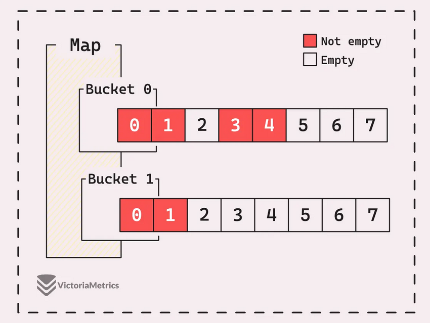

### Хеширование и размещение по бакетам

Когда вы добавляете пару «ключ-значение» в мапу, Go помещает её в один из бакетов на основе **хеш-значения** ключа: `hash(key, seed)`.

**Хеш-функция** — это математический алгоритм, преобразующий входные данные произвольного размера в выходную строку фиксированной длины (хеш-код). Свойства хеш-функции:

1. **Детерминированность.** Один и тот же вход всегда даёт одинаковый выход.
2. **Фиксированный размер выхода.** Независимо от размера входа, выход всегда одной длины.
3. **Быстрое вычисление.** Хеш-функция должна вычисляться быстро.

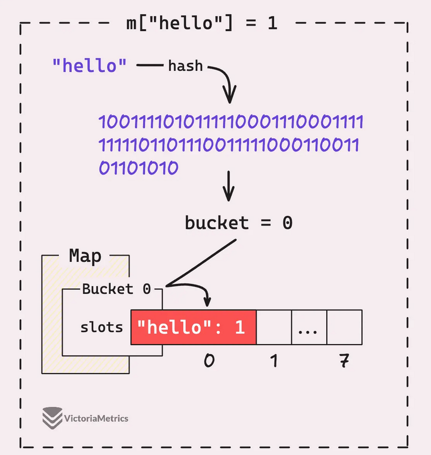

Рассмотрим вставку ключа `"hello"` со значением `1` в пустую мапу:

1. Ключ `"hello"` проходит через хеш-функцию, генерирующую псевдослучайное число.
2. Для определения целевого бакета используется операция: `bucket_index = hash % bucket_count`.
3. В начальном состоянии мапа имеет только один бакет, поэтому `bucket_count = 1`.
4. Любое число по модулю 1 равно 0 — значит, индекс целевого бакета всегда 0.
5. Все добавляемые элементы направляются в бакет 0 до тех пор, пока мапа не вырастет.

Если целевой слот в бакете занят или содержит другой ключ, запись перемещается в следующий свободный слот этого же бакета.

### Seed и порядок итерации

Хеш-функция, используемая для мап в Go, одинакова для всех мап с одним и тем же типом ключа, но **seed** (начальное значение), подаваемый на вход хеш-функции, **различается для каждого экземпляра мапы**. При создании новой мапы Go генерирует случайный seed только для неё. Именно поэтому `for-range` по двум мапам с одинаковыми ключами выдаёт их в разном порядке — у каждой мапы свой seed, а значит, и своё распределение ключей по бакетам.

### Tophash-оптимизация

Go использует умную оптимизацию для ускорения поиска внутри бакета. **Tophash** — это первые 8 бит (один байт) полного хеша ключа, которые сохраняются непосредственно в структуре бакета. Например, если полный хеш — `0x5F3A7C1B`, то tophash — `0x5F`.

При поиске или добавлении ключа процесс выглядит так:

1. **Быстрая предварительная проверка:** Go сравнивает tophash искомого ключа с tophash-значениями, сохранёнными в бакете. Это невероятно быстро, потому что:
   * Tophash занимает всего 1 байт.
   * Сравнение байтов — одна из самых быстрых операций процессора.
   * Можно сравнивать несколько tophash-значений одновременно с помощью векторных инструкций.
2. **Полная проверка только при необходимости:** Если tophash-значения не совпали — это гарантированно не наш ключ, переходим к следующему. Только если tophash совпал, выполняется более дорогостоящая операция — полное сравнение самих ключей.

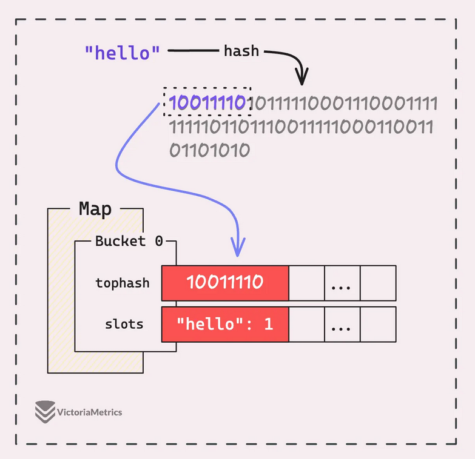

### Hint при создании мапы

При создании мапы можно указать параметр **hint**: `make(map[K]V, hint)`. Он сообщает Go ожидаемое начальное количество элементов. Hint помогает минимизировать количество операций роста, поскольку каждая из них включает выделение нового массива бакетов и копирование существующих элементов.

**Ёмкость (capacity)** мапы — это максимальное число элементов, которое она может вместить до роста при текущем количестве бакетов. Рассчитывается как:

$\text{bucket\_count} \times 8\ \text{(itemsPerBucket)}$

Как увеличивается размер мапы по мере добавления элементов в зависимости от hint:

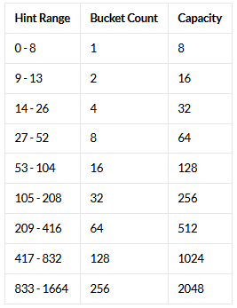

Почему `hint=14` ведёт к 4 бакетам? Здесь вступает в игру **коэффициент загрузки**. При `hint=13` у нас 2 бакета, что даёт коэффициент загрузки 13 / 2 = 6.5, что соответствует пороговому значению, но не превышает его. При `hint=14` коэффициент загрузки превысит 6.5, что потребует увеличения.

### Рост мапы и коэффициент загрузки

Для старых мап **коэффициент загрузки установлен на уровне 6.5**. Это означает, что мапа рассчитана на поддержание в среднем 6.5 элементов на бакет — около **80% ёмкости**. Когда коэффициент загрузки превышает это значение, мапа считается перегруженной и инициирует **рост (эвакуацию)**, при котором количество бакетов удваивается.

Причина, по которой мапа растёт до полного заполнения бакетов — **производительность**. Чем больше слотов в бакете занято, тем медленнее становится работа: при добавлении пары нужно не только проверить наличие места, но и сравнить ключ с каждым существующим ключом в бакете.

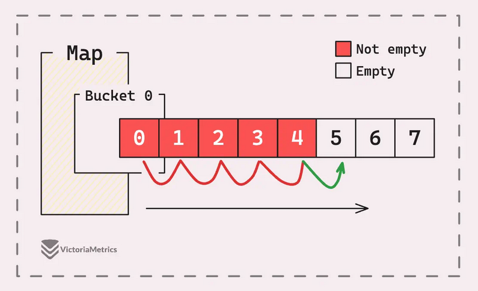

### Дополнительные бакеты (overflow buckets)

Понятие **основных бакетов** тесно связано с понятием **дополнительных бакетов (overflow buckets)**. Они возникают в ситуации с высоким уровнем коллизий. Представьте: у вас 4 бакета, но один из них полностью заполнен 8 парами из-за высокого уровня коллизий, а остальные 3 бакета пустуют:

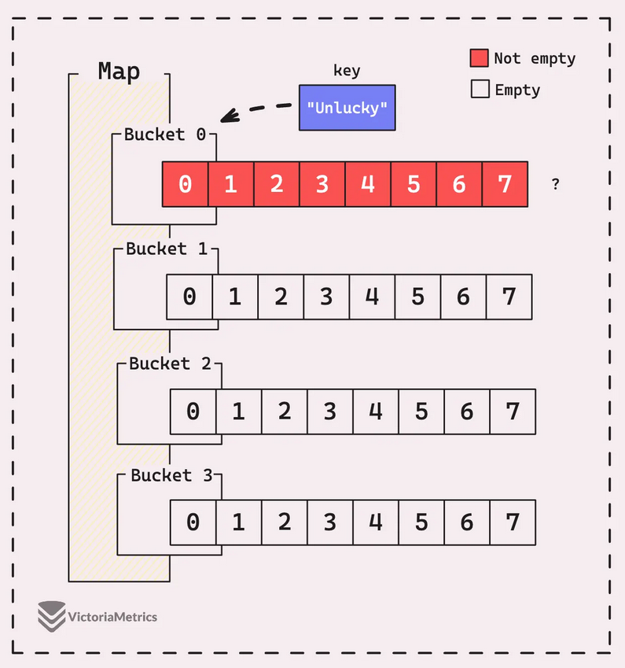

Расширять мапу до 8 бакетов в этой ситуации было бы неэффективно. Вместо этого Go создаёт дополнительные бакеты, связанные с переполненным бакетом. Новая пара «ключ-значение» сохраняется в дополнительном бакете:

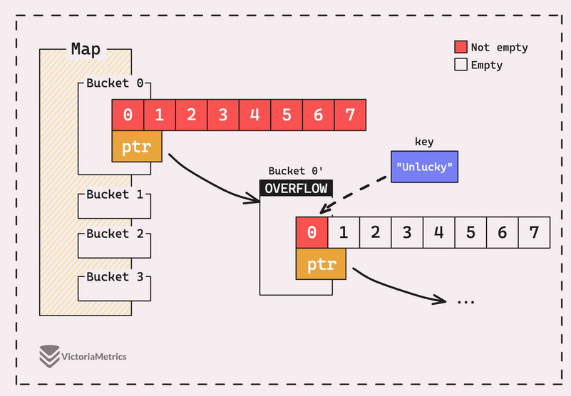

Когда есть overflow-бакеты, ситуация с производительностью становится ещё хуже — приходится проверять каждый слот не только в основном, но и в дополнительных бакетах. Это замедляет операции доступа, вставки и удаления.

### Два типа роста

Мапа растёт при выполнении одного из двух условий:

* **Слишком высокий коэффициент загрузки** (перегрузка) — количество бакетов **удваивается**, элементы перераспределяются.
* **Слишком много overflow-бакетов** — размер сохраняется, но записи перераспределяются для устранения неравномерности.

### Инкрементальная эвакуация

Если в мапе, скажем, 1000 пар «ключ-значение», одновременное перемещение всех ключей при росте было бы затратной операцией, потенциально блокирующей горутину на заметное время. Чтобы избежать этого, Go использует **инкрементальный рост**: за один раз перехешируется только часть элементов (минимум один бакет). Процесс становится распределённым, и программа работает плавно, без внезапных задержек.

Инкрементальный рост запускается в двух сценариях: при присваивании новой пары или при удалении ключа. В любом случае инициируется эвакуация минимум одного старого бакета.

Когда вы пишете `m["Hello"] = 2`, и мапа находится в процессе роста, первым делом эвакуируется старый бакет, содержащий ключ `Hello`. Каждый элемент из старого бакета перемещается в один из двух новых.

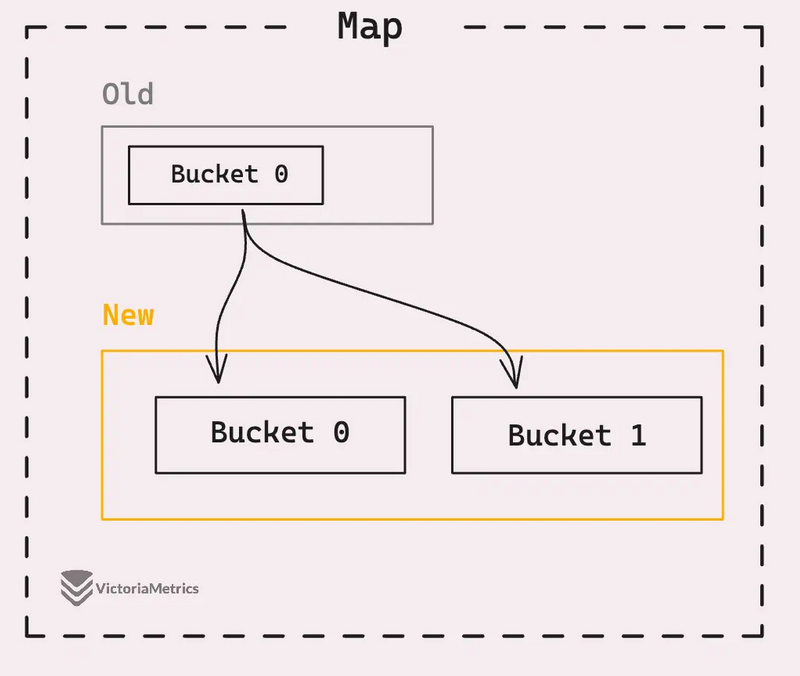

### Бинарная система и адресация бакетов

Адресация бакетов опирается на свойство деления на степень двойки. В бинарной системе деление на степень двойки эквивалентно **сдвигу**, а остаток от деления — **битовой маске**. Для любого $N$, являющегося степенью двойки:

$\text{hash} \mathbin{\%} N = \text{hash} \mathbin{\&} (N - 1)$

### Процесс эвакуации

При увеличении размера мапы выделяется новый массив бакетов, вдвое превышающий старый. Все позиции элементов в старых бакетах становятся недействительными — их необходимо перенести в новые бакеты с новыми адресами памяти.

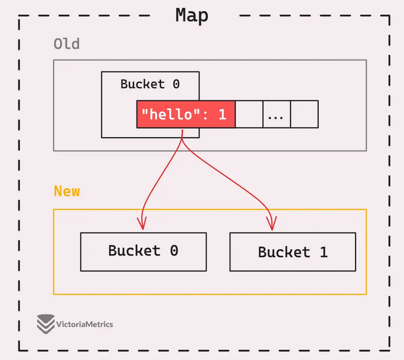

Визуализация перераспределения:

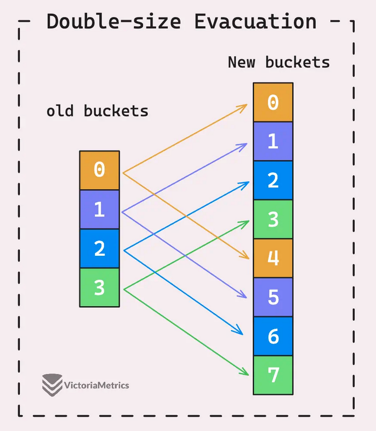

Если у старого бакета есть дополнительные бакеты, мапа также переносит элементы из них в новые бакеты. После перемещения всех элементов старый бакет помечается как «эвакуированный» через специальное значение в поле `tophash`:

```

// Специальные значения tophash:
emptyRest    = 0 // ячейка пуста и все последующие тоже
emptyOne    = 1 // только эта ячейка пуста
evacuatedX    = 2 // ячейка эвакуирована, новый индекс = старый индекс
evacuatedY    = 3 // ячейка эвакуирована, новый индекс = старый индекс + старый размер
evacuatedEmpty = 4 // ячейка эвакуирована и пуста
minTopHash    = 5 // минимальное нормальное значение tophash

```

> **Зачем это Go-разработчику.** Мапа — это указатель на `hmap`: при передаче в функцию копируется указатель, не данные. Бакеты вмещают до 8 пар; tophash ускоряет поиск, избегая полного сравнения ключей. Hint при создании помогает избежать раннего роста. Рост инкрементальный: часть ключей мигрирует в новые бакеты, часть остаётся в старых — поэтому одна операция `m[key] = value` может неожиданно занять больше времени, если запускает эвакуацию.

***

## 3. Мапы на Swiss Table (Go 1.24+)

В Go 1.24 встроенная реализация map была полностью переработана и теперь основана на **Swiss Table** — разновидности хеш-таблицы с открытой адресацией, разработанной в Google и популяризированной библиотекой Abseil (C++).

### Хеш-таблица с открытой адресацией

**Swiss Table** — это разновидность **хеш-таблиц с открытой адресацией (open-addressed hash table)**. В такой таблице все элементы хранятся в одном резервном массиве. Каждую ячейку массива называют **слотом**. Слот, к которому принадлежит ключ, определяется хеш-функцией `hash(key)`.

Отличительная особенность открытой адресации — разрешение коллизий путём сохранения ключа в другом месте того же массива. Если слот уже заполнен, используется **последовательное пробирование (probe sequence)** для поиска других слотов, пока не будет найден пустой.

#### Пример на 16 слотах

Ниже — 16-слотовый резервный массив и ключ (если есть), хранящийся в каждом слоте. Значения не показаны, так как они не имеют отношения к примеру.

{width="6.267716535433071in"
height="0.2916666666666667in"}

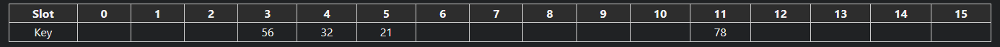

Вставим ключ 98: `hash(98) % 16 = 7`. Слот 7 пуст — просто вставляем туда 98.

Теперь вставим ключ 25: `hash(25) % 16 = 3`. Слот 3 — коллизия (уже содержит 56). Запускаем **линейное пробирование** — проверяем последовательные слоты:

* Слот 4 — занят.
* Слот 5 — занят.
* Слот 6 — пуст. Сохраняем 25 сюда.

Поиск работает аналогично. Поиск ключа 25 начинается со слота 3, затем 4, 5, и наконец ключ находится в слоте 6.

#### Коэффициент загрузки

Хеш-таблицы с открытой адресацией не ждут полного заполнения массива для роста. По мере заполнения средняя длина последовательного пробирования увеличивается. Если бы в массиве оставался только один пустой слот, в худшем случае пришлось бы просканировать весь массив — сложность $O(n)$.

Доля используемых слотов называется **коэффициентом загрузки (load factor)**. Большинство хеш-таблиц определяют максимальный коэффициент загрузки (обычно 70–90%), при достижении которого начинают расти.

### Устройство Swiss Table

Swiss Table сохраняет принцип одного резервного массива, но разбивает его на **логические группы по 8 слотов**. Кроме того, каждая группа имеет 64-битное **управляющее слово (control word)** для метаданных. Каждый из 8 байтов управляющего слова соответствует одному из слотов в группе и содержит:

* Признак: пуст ли слот, удалён или используется.
* Если слот используется — младшие 7 бит хеша ключа этого слота (называемые **h2**).

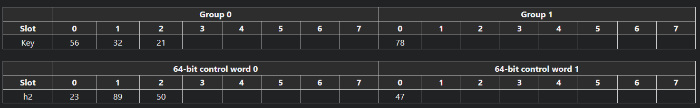

#### Алгоритм вставки

1. Вычислить `hash(key)` и разбить хеш на две части: **старшие 57 бит (h1)** и **младшие 7 бит (h2)**.
2. h1 используется для выбора первой группы: `h1 % число_групп`.
3. Внутри группы проверить, есть ли уже такой ключ (обновление, а не вставка).
4. Если ключа нет — найти пустой слот для размещения.
5. Если все слоты заняты — продолжить пробирование в следующей группе.

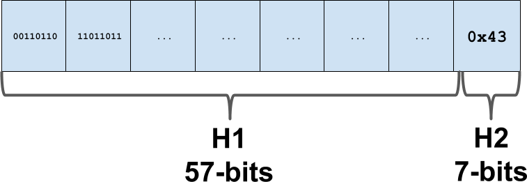

Поиск работает по тому же алгоритму. Если на шаге 4 найден пустой слот — ключа в таблице нет, поиск прекращается.

#### Магия управляющего слова

Ключевая оптимизация Swiss Table — на шаге 3. Нужно проверить, содержит ли какой-либо из 8 слотов группы искомый ключ. Наивный подход — последовательно сравнить все 8 ключей. Но управляющее слово позволяет сделать это эффективнее.

Каждый байт управляющего слова содержит h2 для своего слота. Определив, какие байты содержат искомый h2, мы получаем набор **слотов-кандидатов** — и отбрасываем все остальные. Это побайтовое сравнение на равенство внутри 64-битного слова:

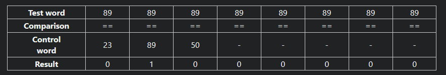

Эта операция поддерживается **SIMD-аппаратурой**: одна инструкция выполняет параллельные сравнения над независимыми значениями внутри вектора. Если специализированное SIMD-оборудование недоступно, операция реализуется через стандартные арифметические и побитовые операции.

Результат — набор слотов-кандидатов. Слоты с несовпадающим h2 пропускаются. Для слотов с совпавшим h2 выполняется полное сравнение ключа, поскольку **вероятность коллизии с 7-битным хешем составляет 1/128** (достаточно мала).

Эта операция очень мощная: мы выполняем 8 шагов последовательного пробирования **параллельно, за одну инструкцию**. Это ускоряет поиск и вставку, сокращая среднее количество сравнений. Улучшенное поведение пробирования позволило реализации Abseil и Go **увеличить максимальный коэффициент загрузки** по сравнению с предыдущими мапами, снижая средний объём потребляемой памяти.

### Детали реализации в Go

#### Слоты и группы

**Слот** — это структура из двух полей: ключ и значение. **Группа** — это 8 слотов плюс метаинформация (`ctrl` в коде). Каждый слот даёт 1 байт метаинформации — так набирается 8 байт (тип `uint64`) на группу.

#### Значения контрольного байта

| Значение    | Смысл                                                     |
| ----------- | --------------------------------------------------------- |
| `0x80`      | Слот **пустой** (empty) — никогда не использовался        |
| `0xFE`      | Слот **удалён** (tombstone) — был занят, но потом удалили |
| `0x00–0x7F` | Слот **занят**: младшие 7 бит содержат h2 ключа           |

Если старший бит контрольного байта равен единице — слот свободен (empty или tombstone). Если ноль — слот занят. На практике ситуация, когда в одной группе есть и empty, и tombstone, встречаться не должна.

#### Квадратичное пробирование

Хеш-таблица в новой реализации использует **открытую адресацию с квадратичным пробированием** — шаг меняется по степеням двойки:

```

step = (i * (i + 1)) / 2

```

#### Поиск

Стартовую ячейку выбираем по последним битам h1, затем начинаем поиск ключа в таблице. Ищем, пока не найдём нужный ключ или группу с пустым слотом — это означает, что ключа в мапе нет.

#### Удаление ключа

Запускаем обычный поиск ключа. Если находим:

* Если в группе есть пустые слоты — помечаем этот слот как пустой.
* Если пустых слотов нет — помечаем как удалённый (**tombstone**).

Причина: мы не знаем, какие цепочки поиска проходят через эту группу. Если пометим слот как пустой, группа станет последней в чьём-то поиске, и это сломает другой поиск. Поэтому в группе без пустых слотов используется только tombstone.

#### Вставка

Запускаем обычный поиск ключа. Если ключ уже есть — просто изменяем значение. Если нет — записываем на первое свободное место. Оптимизация: при поиске запоминаем позицию первого tombstone и, если он есть, записываем новое значение в него, а не в пустой слот. Это помогает бороться с накоплением tombstone.

### Рост и масштабирование

#### Коэффициент загрузки 7/8

Благодаря ускоренному сравнению через управляющее слово, Swiss Table использует более высокий максимальный коэффициент загрузки — 7/8 против 6.5/8 в старых мапах. Это снижает потребление памяти.

На примере ниже коэффициент загрузки группы 0 равен 8/8, группы 1 - 2/8:

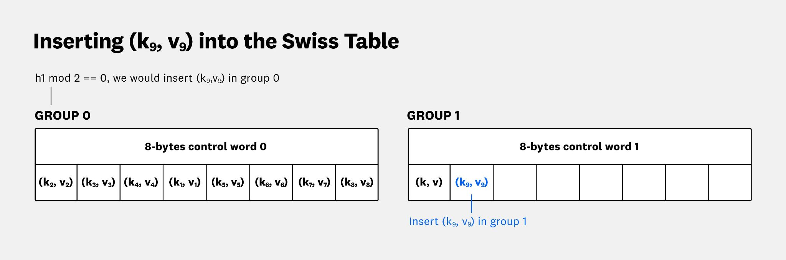

В коэффициент загрузки входят не только занятые слоты, но и tombstone. Теоретически может возникнуть ситуация, когда таблица забита tombstone на 7/8, а занятых полей почти нет — и таблица всё равно вырастет (при росте все tombstone вычищаются).

Когда средний коэффициент загрузки строго превышает 7/8, при следующей вставке происходит перераспределение в таблицу удвоенного размера.

#### Защита от хвостовой задержки

Если бы мапа содержала тысячи групп, расширение из-за одной вставки заняло бы много времени — пришлось бы переносить всю таблицу целиком:

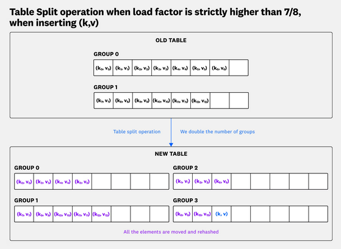

В Go 1.24 эта проблема решена ограничением: одна Swiss Table может хранить **не более 128 групп (1024 слота)**.

#### Расширяемое хеширование и каталог

Если нужно хранить более 1024 элементов, вступает в игру **расширяемое хеширование (extensible hashing)**. Вместо единой Swiss Table, реализующей всю мапу, **каждая мапа представляет собой каталог (directory) из одной или нескольких независимых Swiss Table**.

**Каталог** — это верхняя структура в иерархии, по сути — хеш-таблица с закрытой адресацией, но с оптимизацией. Размер каталога также равен 2^N, ячейку выбираем по первым битам h1:

```

// directory (globalDepth=2)
// +---+
// | 00 | --\
// +---+  +--> table (localDepth=1)

// | 01 | --/
// +---+
// | 10 | ---> table (localDepth=2)

// +---+
// | 11 | ---> table (localDepth=2)

// +---+

```

Переменное количество старших битов хеша определяет, к какой таблице принадлежит ключ:

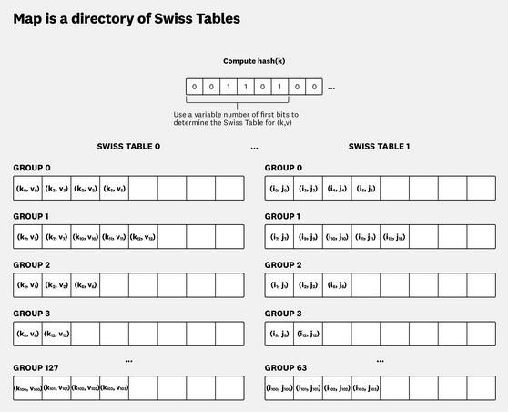

Возможности расширяемого хеширования:

* **Ограниченное копирование:** максимальный размер одной Swiss Table ограничен 128 группами — ограничено и количество элементов, копируемых при добавлении новых групп.
* **Независимое разделение:** когда таблица достигает 128 групп, она разделяется на две по 128 групп. Это самая затратная операция, но она ограничена и выполняется независимо для каждой таблицы.

На одну хеш-таблицу могут ссылаться несколько ячеек каталога, поэтому при сплите таблицы указатели на новые таблицы записываются в каталог.

В худшем случае за время одной вставки выполняются:

* Сплит хеш-таблицы на 2 и перенос данных.
* Удвоение каталога и перенос указателей.

Каталог не сокращается, поэтому сложность — амортизированное $O(1)$. Одна конкретная вставка может быть долгой, но это компенсируется тем, что остальные операции быстрые.

### Хеш-функция новых мап

Хеш-функция внутри называется **`memhash`**. Ей передаётся указатель на начало структуры и размер в байтах; на выходе — 64-битный хеш. Если тип данных содержит указатели (например, строки), на этапе компиляции строится функция, рекурсивно вызывающая `memhash` для всех указателей.

Хеш-функция использует **seed**. При создании мапы генерируется случайное число, которое хранится в мапе и каждый раз передаётся на вход `memhash`. Seed случаен — подобрать данные так, чтобы сломать мапу, практически невозможно. При следующем запуске будет другой seed и другие значения хешей.

В Go используется два алгоритма:

| Алгоритм   | Когда применяется                    |
| ---------- | ------------------------------------ |
| **AES**    | При наличии аппаратной поддержки AES |
| **wyhash** | На платформах без аппаратного AES    |

Хеш-функции доступны и в пользовательском коде через пакет **`hash/maphash`**.

Разделение 64-битного хеша:

* **h1** — старшие 57 бит. Младшие биты h1 адресуют слот в хеш-таблице, старшие — слот в каталоге.
* **h2** — младшие 7 бит. Используются внутри группы слотов для поиска кандидатов.

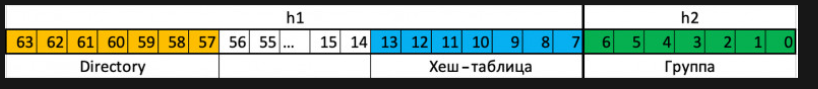

> **Зачем это Go-разработчику.** Новая реализация map в Go 1.24 принесла более эффективное использование памяти (выше load factor) и ускорение операций (\~1,5%) без изменения API. Переход прозрачен для пользовательского кода, но понимание внутреннего устройства помогает интерпретировать бенчмарки и предвидеть поведение под нагрузкой.

***

## 4. Сравнение реализаций

### Плюсы Swiss Table (Go 1.24+)

* **Эффективнее использует память.** Выше коэффициент загрузки 7/8 против 6.5/8, нет расхода памяти на цепочки overflow-бакетов и на поддержку инкрементальной эвакуации.
* **Быстрее работают.** Ускорение порядка 1,5% за счёт параллельного сравнения через управляющее слово (SIMD/битовые маски).
* **Предсказуемая хвостовая задержка.** Ограничение в 128 групп на таблицу предотвращает катастрофически долгие операции роста.

### Минусы Swiss Table (Go 1.24+)

* **Не отдают память обратно.** Каталог не сокращается — занятая память не возвращается ОС, даже если мапа опустела. В теории можно было бы объединять пустые таблицы и делать rehash.
* **Баг с&#x20;****`map[int]struct{}`****.** Мапа `map[int]int{}` потребляет столько же памяти, сколько `map[int]struct{}{}`, хотя пустая структура не должна занимать места.
* **SIMD не везде.** Не на всех платформах используются SIMD-инструкции, даже если они аппаратно доступны.
* **Длинные хвостовые задержки при некоторых вставках.** Отдельная операция вставки может быть значительно медленнее средней. Это критично для latency-sensitive кода. Но такие задачи (например, HFT — высокочастотный трейдинг) обычно не пишут на Go.

### Когда разница имеет значение

| Ситуация                                     | Какая реализация критична                  |
| -------------------------------------------- | ------------------------------------------ |
| Код на Go < 1.24                             | Старая (hmap) — единственный вариант       |
| Код на Go ≥ 1.24                             | Swiss Table — прозрачно, без изменения API |
| Высоконагруженный сервис с миллионами ключей | Swiss Table: меньше памяти, быстрее        |
| Чувствительный к задержкам код               | Обе имеют негарантированное время операций |
| Микробенчмарки                               | Swiss Table покажет лучшие цифры           |

> **Зачем это Go-разработчику.** При переходе на Go 1.24 никаких действий не требуется — новая реализация включается автоматически. Но при интерпретации бенчмарков и профилировании памяти полезно знать, какая реализация работает под капотом. Если ваш сервис держит в памяти десятки миллионов ключей, Swiss Table даст заметную экономию памяти.

***

## 5. Практические рекомендации

### Использование hint

Всегда указывайте hint при создании мапы, если заранее известно примерное количество элементов:

```go
m := make(map[string]int, expectedSize)

```

Это минимизирует количество дорогостоящих операций роста и эвакуации. В новых мапах (Swiss Table) это также помогает избежать лишних сплитов таблиц и удвоений каталога.

### Мапа как множество (set)

В Go нет встроенного типа «множество», но мапа с пустой структурой в качестве значения отлично выполняет эту роль:

```go
set := make(map[string]struct{})
set["apple"] = struct{}{}
if _, ok := set["apple"]; ok {
    // элемент присутствует
}

```

`struct{}` не занимает памяти в значении мапы (идиоматично, хотя в Swiss Table сейчас есть баг с этим).

### Выбор типа ключа

* **Строки** — хешируются посегментно; длинные строки могут давать заметный оверхед.
* **Целые числа** — хешируются максимально быстро, особенно `int` и `uint`.
* **Структуры** — хешируются по всем полям рекурсивно; избегайте структур со слайсами и мапами (они не comparable и не могут быть ключами).
* Если ключом служит строка, но её можно заменить на число (например, enum), предпочтите числовой ключ — хеширование быстрее.

### Потокобезопасный доступ

Для конкурентного доступа к мапе из нескольких горутин используйте:

* **`sync.RWMutex`****&#x20;+ map** — если операций чтения значительно больше, чем записи. `RLock` для чтения, `Lock` для записи.
* **`sync.Map`** — если ключи стабильны (пишутся один раз, читаются многократно) или если горутины работают с непересекающимися наборами ключей. В общем случае `sync.Map` может быть медленнее связки `RWMutex + map`.

### Когда map может быть не лучшим выбором

* **Фиксированный набор ключей.** Если набор ключей известен на этапе компиляции и невелик, простая структура с полями или `switch` по ключу могут быть быстрее.
* **Необходимы гарантии по задержке.** И старые, и новые мапы могут давать выбросы по времени операции из-за эвакуации/роста. Если latency критичен (например, HFT), мапы Go — не лучший выбор.
* **Последовательный доступ.** Если данные обходятся в известном порядке, слайс пар или отсортированный слайс ключей с бинарным поиском может быть эффективнее.

> **Зачем это Go-разработчику.** Мапа — мощный инструмент, но не серебряная пуля. Правильный выбор начальной ёмкости, типа ключа и стратегии конкурентного доступа напрямую влияет на производительность и стабильность production-кода.

***

## Ссылки

* [Go 101: Map Optimizations](https://go101.org/optimizations/6-map.html)
* [VictoriaMetrics: Go Map Internals](https://victoriametrics.com/blog/go-map/)
* [Go Blog: Swiss Table](https://go.dev/blog/swisstable)
* [DataDog: Go Swiss Tables](https://www.datadoghq.com/blog/engineering/go-swiss-tables/)
* [Habr: Устройство map в Go 1.24](https://habr.com/ru/companies/ru_mts/articles/915880/)
