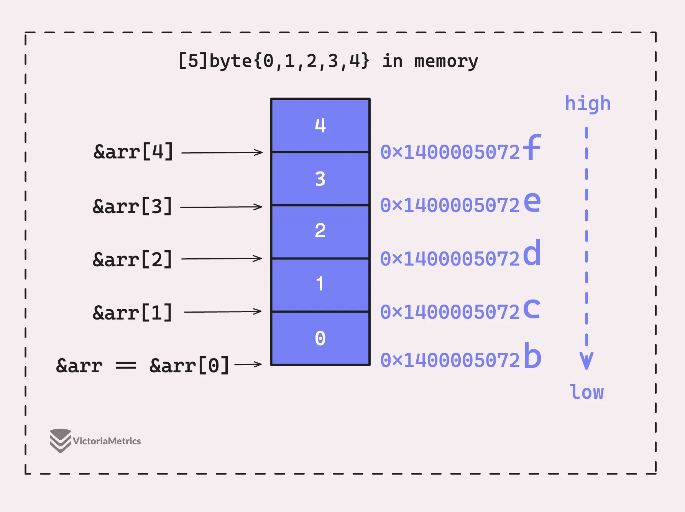
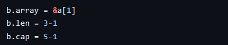
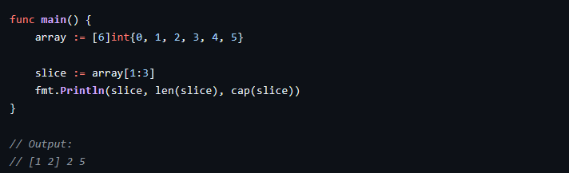
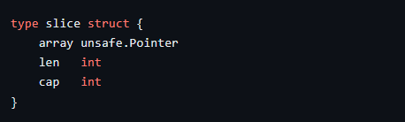
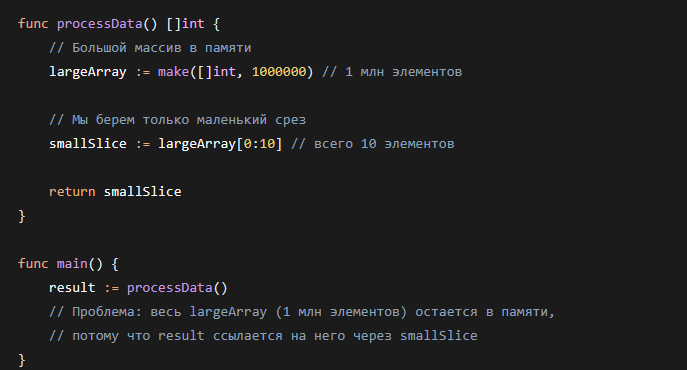
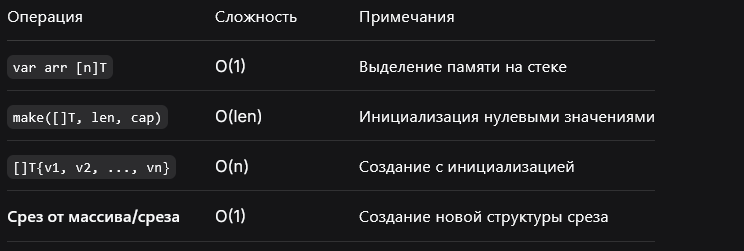
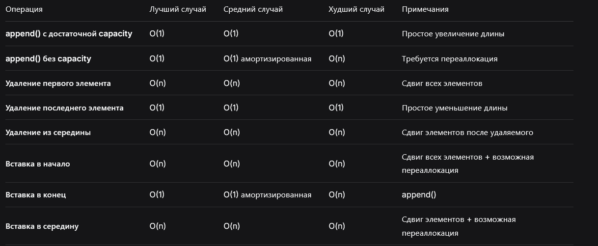

# Массивы и срезы в Go

## 1. Введение: массивы и срезы — два взгляда на последовательности

Go предоставляет два встроенных механизма для работы с последовательностями однотипных элементов: **массивы** и **срезы**. Они решают принципиально разные задачи.

**Массив** — это значение фиксированного размера, определяемое на этапе компиляции. Размер является частью типа, поэтому `[3]int` и `[4]int` — разные типы. Массив хранит элементы в смежных ячейках памяти и передаётся по значению.

**Срез** — это динамическое «окно» в базовый массив. Он состоит из трёх компонентов: указателя на базовый массив, длины и ёмкости. Срез не владеет данными — он ссылается на существующий массив или на новый, созданный рантаймом через `make`.

> **Зачем это Go-разработчику.** Массивы нужны, когда размер известен на этапе компиляции и не меняется (например, `[32]byte` для SHA-256). Срезы — основной инструмент для большинства задач: параметры функций, возвращаемые значения, динамические коллекции. Понимание их внутреннего устройства позволяет избегать лишних аллокаций и проблем с GC.

***

## 2. Массивы

### Что такое массив

**Массивы** имеют фиксированный размер и хранят элементы одного типа в смежных ячейках памяти. Go может быстро ($O(1)$) получить доступ к каждому элементу, поскольку их адреса рассчитываются на основе начального адреса массива и индекса элемента.

Важные моменты:

* Адрес массива совпадает с адресом первого элемента.
* Адреса каждого элемента отличаются друг от друга на размер, занимаемый типом элементов массива. Так, адреса каждого элемента массива байт будут отличаться друг от друга на 1 байт.



На риcунке видно, что стек растёт сверху вниз от большего адреса к меньшему. Порядок хранения элементов массива в памяти всегда линейный и последовательный, независимо от архитектуры или направления роста стека. Первый элемент (`arr[0]`) имеет младший адрес, а последний (`arr[len(arr)-1]`) — старший.

В Go массив определяется не просто типом, но и его размером.

```go
var a [3]byte
var b [4]byte
```

Несмотря на то что `a` и `b` являются массивами байтов, компилятор Go видит их как совершенно разные типы, потому что у них разный размер.

```go
a = b // cannot use b (type [4]byte) as type [3]byte in assignment
```

Длина массива «закодирована» в самом типе, поэтому компилятор определяет длину массива по его типу. Попытка присвоить массив одного размера другому или сравнить их приведёт к ошибке несоответствия типов.


### Литералы массивов и стратегии инициализации

```go
arr := [4]int{1, 2, 3, 4}
```

Когда мы создаём массив менее чем с четырьмя элементами, Go генерирует инструкции для последовательного помещения значений в массив. Так что `arr := [4]int{1, 2, 3, 4}` на самом деле работает так, как описано в листинге 4.

```go
arr := [4]int{1, 2, 3, 4}
// Компилятор генерирует инструкции присваивания для каждого элемента
// (до 4 элементов — локальная инициализация)
```

Эта стратегия называется **локальной инициализацией**. Код инициализации генерируется и выполняется в рамках конкретной функции, а не является частью глобального или статического кода.

Если число элементов больше 4, компилятор создаёт статическое представление массива в двоичном файле — это **статическая инициализация**. Значения элементов массива хранятся в разделе двоичного файла, доступном только для чтения, и внедряются в бинарник во время компиляции.

```go
var arr = [5]int64{1, 2, 3, 4, 5}
// Данные хранятся в статической секции данных (stmp_1)
```

Данные хранятся в **stmp\_1** — это статические данные, доступные только для чтения. Размер составляет 40 байт (по 8 байт на каждый `int64`), и адрес этих данных жёстко прописан в двоичном файле. При запуске приложение напрямую использует эти предварительно инициализированные данные, не требуя дополнительного кода для настройки массива.

Ситуация с массивом длины 5 и 3 инициализированными элементами (`[5]int{1,2,3}`) подпадает под стратегию локальной инициализации.

Говоря об инициализации массивов, следует отметить, что не каждый массив выделяется в стеке. Если он слишком большой, он перемещается в кучу. Начиная с версии Go 1.23, если размер переменной превышает константу **MaxStackVarSize** (10 МБ), она считается слишком большой для стека и будет перемещена в кучу.


### Операции с массивами: `len`, `cap` и получение среза

**`len`****&#x20;и&#x20;****`cap`****:**

Длина массива закодирована в типе. Вместимость (`cap`) равна длине (`len`). `len(a)` не имеет смысла для компилятора как свойство рантайма — компилятор Go знает значение во время компиляции и автоматически превращает его в константу.

**Получение среза из массива:**

**Срез** — это способ получения части из массива, и его полная форма обозначается синтаксисом `[start:end:capacity]`. Обычно встречаются варианты: `[start:end]`, `[:end]`, `[start:]`, `[:]`. **start** — индекс первого элемента, включаемого в новый срез (включительно), **end** — индекс последнего элемента, исключаемого из нового среза (не включая его), **capacity** — необязательный аргумент, задающий ёмкость нового среза.

Компилятор оценивает индексы среза (начало, конец и ёмкость), чтобы определить границы нового среза.

```go
arr := [5]int{1, 2, 3, 4, 5}
s := arr[1:3]   // [2, 3], len=2, cap=4
s := arr[1:3:4] // [2, 3], len=2, cap=3
```

Если какой-либо из индексов отсутствует, по умолчанию используются следующие значения:

* start — 0;
* end — длина исходного среза или массива;
* capacity — ёмкость исходного среза или длина исходного массива.

Новая длина при срезе определяется вычитанием начального индекса из конечного, а новая вместимость — вычитанием начального индекса из аргумента вместимости (если он указан) или исходной вместимости (в случае массива — равной его длине).



Можно указать верхнюю границу среза как длину исходного массива или среза, так как верхняя граница исключается. Однако если указать эту длину как нижнюю границу, получится пустой срез без длины и без ёмкости. Go использует специальные правила для таких случаев — срез окажется бесполезным, но не будет указывать на значение вне исходного массива или среза. Общее правило проверки границ среза:

$0 \le \text{start} \le \text{end} \le \text{cap(source)}$

```go
// 0 ≤ start ≤ end ≤ cap(source)
```


### Массив как тип-значение

В некоторых других языках переменная массива — это, по сути, указатель на первый элемент массива, однако Go рассматривает массивы как типы-значения. Это означает, что переменная массива в Go представляет весь массив, а не только ссылку на его первый элемент, хотя вывод ссылки на массив `&a` даёт тот же адрес, что и ссылки на его первый элемент `&a[0]`. Массивы в Go передаются по значению, а не по ссылке.


### Нюанс `for-range` с массивами

Есть один хитрый момент, связанный с циклом `for-range`. При запуске кода ниже выведется `1, 2, 3`, а не `1, 2, 6`, так как переменная `v` на самом деле ссылается на невидимую нам копию массива. При этом массив `a`, который мы используем в цикле, по-прежнему является исходным.

```go
func main() {
    a := [3]int{1, 2, 3}
    for i, v := range a {
        fmt.Println(v)
    }
}
```

```
1
2
3
```

Это означает, что `for-range` работает как передача по значению. Если массив намного больше, чем несколько элементов, такое копирование будет неэффективным. Разработчики Go оптимизировали это, разрешив `for-range` с указателем на массив

```go
func main() {
    a := [3]int{1, 2, 3}
    for i, v := range &a {
        fmt.Println(v)
    }
    a[2] = 6
    fmt.Println(a) // [1 2 6]
}
```


### Сравнение массивов

Массивы в Go поддерживают оператор `==`, если тип их элементов сравним. Сравнение массивов — поэлементное и глубокое: проверяется равенство каждого элемента на соответствующей позиции.

```go
a := [3]int{1, 2, 3}
b := [3]int{1, 2, 3}
fmt.Println(a == b) // true
```

Массивы несравнимых типов (например, содержащие срезы, мапы или функции) не могут быть сравнены через `==`. В таких случаях используется `reflect.DeepEqual`.

```go
type T struct{ s []int }
// a := [2]T{{s: []int{1}}, {s: []int{2}}}
// a[0] == a[1] // ошибка компиляции: T нельзя сравнивать
```

***


> **Зачем это Go-разработчику.** Массивы в Go — редко используемый напрямую, но фундаментальный тип. Их размер — часть типа, что даёт статическую проверку компилятором, но делает массивы негибкими для обобщённого кода. При инициализации до 4 элементов компилятор генерирует локальные инструкции, а свыше — закладывает данные в статическую секцию бинарника. Срез из массива — дешёвая операция (24 байта на заголовок, без копирования данных). Массив передаётся по значению — для больших массивов используйте указатель или срез. `for-range` копирует массив — итерируйтесь по `&arr` для больших массивов. Сравнение массивов поэлементное и быстрое, но для срезов `==` не определён вовсе.

## 3. Срезы

### Что такое срез — определение и семантика

**Срез** (`slice`) — это динамическое представление непрерывного сегмента базового массива. Он описывает, какую часть массива «видит» программа, но не владеет самими данными.

Три фундаментальных свойства среза:

* **Указатель** (`array`) — адрес первого элемента среза в базовом массиве.
* **Длина** (`len`) — количество элементов, доступных через срез.
* **Ёмкость** (`cap`) — максимальное количество элементов от начала среза до конца базового массива.

Срез — это всего лишь способ описания «окна» в базовый массив. Например, срез `a[1:3]` начинается с индекса 1 и заканчивается непосредственно перед индексом 3, поэтому его длина равна 3 - 1 = 2.




### Внутреннее устройство

Срез — это структура с тремя полями: `array` — указатель на базовый массив, `len` — длина среза и `cap` — ёмкость среза.



**Длина среза (len)** — это количество элементов в нём. В примере `a[1:3]` это 2 элемента: `[1, 2]`. **Ёмкость среза (cap)** в этом случае — количество элементов от начала среза до конца базового массива. Однако это верно не всегда: ёмкость среза меняется динамически при расширении.

На этом этапе, поскольку срез указывает на базовый массив, любые изменения, вносимые в срез, также приведут к изменению базового массива. Однако в коде ниже видно, что адрес внутреннего для среза массива отличается от адреса исходного массива. Срез указывает непосредственно на `array[1]`, как показано на рисунке 5.

```go
array := [5]int{0, 1, 2, 3, 4}
slice := array[1:3]

fmt.Printf("array:    %p\n", &array)
fmt.Printf("slice:    %p\n", slice)
fmt.Printf("&array[1]: %p\n", &array[1])
```

```
array:    0xc000010030
slice:    0xc000010038
&array[1]: 0xc000010038
```

Чтобы доказать, что срез ссылается на `array[1]`, можно получить указатель на базовый массив среза, используя `unsafe.SliceData`, как показано ниже.

```go
ptr := unsafe.SliceData(slice)
fmt.Printf("unsafe.SliceData: %p\n", ptr)
// unsafe.SliceData: 0xc000010038
```

Когда вы передаёте срез в `unsafe.SliceData`, функция выполняет несколько проверок:

* Если ёмкость среза больше 0, возвращается указатель на первый элемент среза (в данном случае `array[1]`).
* Если срез равен `nil`, возвращается `nil`.
* Если срез не `nil`, но имеет нулевую ёмкость (пустой срез), возвращается указатель на «неопределённый адрес памяти» (`unspecified memory address`).

Касательно **«неопределённого адреса памяти»**: в Go могут существовать типы нулевого размера, например, `struct{}` или `[0]int`. Когда рантайм выделяет память для этих типов, вместо присваивания каждому уникального адреса, он возвращает адрес специальной переменной, называемой **zerobase**.


### Длина и ёмкость среза

```go
a := [4]int{1, 2, 3, 4}
s := a[1:3]

fmt.Println(len(s)) // 2
fmt.Println(cap(s)) // 3
```

По умолчанию, если не указать третий параметр в операции среза, **ёмкость** берётся как `cap(source) - low`, где `low` — индекс начала среза, а `cap(source)` — ёмкость исходного массива (т. е. его длина) или среза. В примере из листинга 15 ёмкость среза увеличивается до индекса 4 (исключая, как и длина) исходного массива.

```go
// cap(s) = cap(a) - low = 4 - 1 = 3
```

```
2
3
```

**Ёмкость среза** — это максимальное количество элементов, которое он может содержать, прежде чем ему потребуется увеличиться.


### Создание срезов: `make`, литералы, срез массива

**Срезы** гораздо более гибкие, чем массивы, поскольку они представляют собой слой поверх массива. Их размер может динамически изменяться, и для добавления элементов можно использовать `append()`.

```go
s := make([]int, 0, 3)
s = append(s, 1)
s = append(s, 2)
s = append(s, 3)
fmt.Println(s) // [1 2 3]
```

В массивах компилятор Go заранее знает длину и ёмкость и даже включает эти данные в ассемблерный код, но в случае срезов `len` и `cap` являются динамическими — они могут изменяться во время выполнения.

Основные способы создания среза:

| Способ                     | Пример                     | Когда использовать         |
| -------------------------- | -------------------------- | -------------------------- |
| Литерал                    | `s := []int{1, 2, 3}`      | Фиксированные значения     |
| `make` с длиной            | `s := make([]int, 5)`      | Известна точная длина      |
| `make` с длиной и ёмкостью | `s := make([]int, 0, 100)` | Известна ожидаемая ёмкость |
| Срез массива               | `s := arr[1:4]`            | Данные уже в массиве       |
| Срез другого среза         | `s2 := s1[2:5]`            | Переиспользование данных   |
| `nil`-срез                 | `var s []int`              | Ещё нет данных             |


### `nil`-срез и пустой срез: в чём разница

В Go существует два разных состояния «отсутствия элементов»:

```go
var nilSlice []int           // nil-срез: len=0, cap=0, array=nil
emptySlice := []int{}         // пустой срез: len=0, cap=0, array=zerobase
emptyMake := make([]int, 0)   // пустой срез: len=0, cap=0, array=zerobase
```

Ключевые различия:

| Свойство          | `nil`-срез | Пустой срез |
| ----------------- | ---------- | ----------- |
| `s == nil`        | `true`     | `false`     |
| `len(s)`          | `0`        | `0`         |
| `cap(s)`          | `0`        | `0`         |
| JSON-сериализация | `null`     | `[]`        |
| Можно `append`    | Да         | Да          |
| `for range`       | 0 итераций | 0 итераций  |

```go
var nilSlice []int
emptySlice := []int{}

data, _ := json.Marshal(nilSlice)  // null
data, _ := json.Marshal(emptySlice) // []
```


### Функция `copy` и её поведение

Встроенная функция `copy(dst, src)` копирует элементы из `src` в `dst` и возвращает количество скопированных элементов — минимум из `len(dst)` и `len(src)`.

```go
src := []int{1, 2, 3, 4, 5}
dst := make([]int, 3)
n := copy(dst, src) // n=3, dst=[1,2,3]
```

Важный нюанс: `copy` корректно обрабатывает перекрывающиеся срезы (один и тот же базовый массив). Копирование происходит так, как будто данные сначала читаются во временный буфер, а затем записываются — перезаписи «под ногами» не происходит.

```go
s := []int{1, 2, 3, 4, 5}
copy(s[2:], s[:3]) // s = [1, 2, 1, 2, 3] — корректно, без гонки данных
```


### `append`: механика расширения

Функция `append` добавляет элементы в срез. Если в базовом массиве достаточно места (`len + новые элементы ≤ cap`), элементы записываются в существующий массив, и длина среза увеличивается. Если места недостаточно, `append` создаёт новый, больший массив, копирует в него существующие элементы и добавляет новые.

**Стратегия роста ёмкости:**

Когда срез небольшой, удвоение ёмкости обеспечивает быстрый рост. Однако бесконечное удвоение привело бы к выделению огромных объёмов памяти. Go корректирует скорость роста, когда срез достигает порога (около 256 элементов). На больших размерах рост замедляется по формуле:

$\text{newCap} = \text{oldCap} + (\text{oldCap} + 3 \times 256) / 4$

Если нужно увеличить длину существующего среза, не всегда обязательно использовать `append()` или создавать новый срез. Можно просто расширить срез через операцию среза, указав длину, превышающую текущую, — пока новая длина не превышает ёмкость.

**Подводный камень:&#x20;****`append`****&#x20;на срез-аргумент функции:**

```go
func addItem(s []int, v int) {
    s = append(s, v) // меняет локальную копию заголовка!
}

func main() {
    s := make([]int, 0, 3)
    addItem(s, 1)
    fmt.Println(s) // [] — пусто! Вызывающий код не видит изменений
}
```

Решение: либо возвращать новый срез из функции, либо передавать указатель на срез.

***


> **Зачем это Go-разработчику.** Срез — основной рабочий тип для последовательностей в Go. Это «окно» в базовый массив: несколько срезов могут ссылаться на одни данные, и изменение через один видно через другой. Slice-header (24 байта: ptr + len + cap) передаётся по значению, но указывает на общий массив. Различайте nil-срез (nil, len=0) и пустой срез (не nil, len=0): они по-разному сериализуются в JSON. Используйте `make` с указанием capacity, чтобы избежать лишних аллокаций при append. `copy` безопасна и копирует минимум из длин источника и приёмника. При превышении capacity append аллоцирует новый массив — учитывайте это при проектировании.

## 4. Аллокация срезов: стек vs куча

Обычно всё динамическое или неизвестного размера оказывается в куче, но ошибочно полагать, что срезы в Go всегда выделяются там. Необходимо рассматривать два аспекта отдельно: сам срез (заголовок) и лежащий в его основе массив.


### Случай 1: срез и базовый массив в стеке

```go
func main() {
    a := [3]int{1, 2, 3} // массив на стеке
    s := a[:]                 // срез на тот же массив
    fmt.Printf("&a[0]: %p\n", &a[0])
    fmt.Printf("&s[0]: %p\n", &s[0])
    // оба адреса совпадают
}
```

Локальная переменная `a`, срез `s` и базовый массив `s.array` размещены в стеке — их адреса расположены близко друг к другу. Срез — это простая структура с 3 полями, поэтому он обычно размещается в стеке, если только вы не сделаете что-то, что заставит сам срез пережить функцию. Базовый массив аллоцирован в стеке, поскольку его размер известен во время компиляции, и Go оптимизирует выделение памяти.


### Случай 2: базовый массив начинает в стеке, но перерастает в кучу

```go
func main() {
    s := make([]int, 2)
    s = append(s, 1, 2, 3, 4, 5) // превышает cap → новый массив в куче
    fmt.Printf("&s[0]: %p\n", &s[0])
}
```

Адрес базового массива значительно меняется после того, как срез превышает ёмкость. В этот момент он выходит из стека горутины.

Вот почему установка предопределённой ёмкости — хорошая идея, чтобы избежать ненужного выделения кучи. Даже если вы не знаете точный размер во время компиляции, лучше задать срезу предполагаемую ёмкость, чем оставить её равной нулю.

Рост среза в активном потоке (hot path) приводит к дополнительным накладным расходам: выделение новой памяти, перемещение данных и дополнительная работа сборщика мусора.


### Случай 3: базовый массив в куче

```go
func main() {
    sliceA := make([]int, 1000)   // ≤ 64 KB — базовый массив на стеке
    sliceB := make([]int, 100000) // > 64 KB — базовый массив в куче
    fmt.Printf("sliceA: %p\n", &sliceA[0])
    fmt.Printf("sliceB: %p\n", &sliceB[0])
}
```

Даже если вы заранее определяете ёмкость, известную во время компиляции, всё равно бывают ситуации, когда базовый массив оказывается в куче. Одна из них — использование `make()`, если ёмкость превышает **64 КБ**. Базовый массив `sliceA` (меньше 64 КБ) размещён в стеке, но в случае `sliceB` базовый массив размещён в куче. Escape-анализ показывает, что в куче выделена память для внутреннего массива `sliceB`, но не для заголовка среза.

Принудительно разместить базовый массив в куче легко — всё динамическое во время компиляции окажется там:

```go
func main() {
    n := 100000
    s := make([]int, n) // n неизвестно на этапе компиляции → куча
    fmt.Printf("&s[0]: %p\n", &s[0])
}
```

Поскольку размер стека определяется во время компиляции, базовый массив среза окажется в куче, так как его размер равен `n`, который определяется во время выполнения.

> **Зачем это Go-разработчику.** Используйте `make()` с ёмкостью, известной во время выполнения, чтобы снизить вероятность дополнительных выделений памяти в куче в дальнейшем. Избежать размещения базового массива в куче с первого раза сложно, но можно минимизировать повторные аллокации.

***

## 5. Срезы и сборщик мусора

Когда срез ссылается на большой массив, но использует только небольшую его часть, весь исходный массив продолжает удерживаться в памяти, даже если большая часть данных уже не нужна.



Эта проблема становится критичной при обработке больших файлов или объёмов данных, для долгоживущих срезов и при разработке сервисов с высокими требованиями по памяти.

Решение — явное копирование нужных данных в новый срез:

```go
func readData() []byte {
    data := make([]byte, 1<<30) // 1 GB
    // ... обработка первых 10 байт ...
    needed := make([]byte, 10)
    copy(needed, data[:10])
    return needed // data освободится сборщиком мусора
}
```

> **Зачем это Go-разработчику.** После выделения маленького подсреза из большого массива, если большой массив больше не нужен, скопируйте данные: `newSlice := append([]T(nil), bigSlice[:needed]...)`. Это освободит память, занятую большим массивом.

***

## 6. Алгоритмические сложности операций

Сводка алгоритмических сложностей для массивов и срезов — справочный материал для оценки производительности операций в критических участках кода.

**Основные операции:**


**Операции создания:**




**Операции добавления и удаления для среза:**




**Операции копирования и преобразования:**


> **Зачем это Go-разработчику.** Вставка и удаление из середины среза — $O(n)$, так как требуют сдвига элементов. Если нужны частые вставки/удаления в середине, рассмотрите связный список или другие структуры данных.

***

## 7. Пакет `slices` стандартной библиотеки

Начиная с Go 1.21, пакет `slices` предоставляет набор функций для типичных операций над срезами. Он использует дженерики и избавляет от написания шаблонного кода.


### Основные функции

| Функция                  | Назначение                           |
| ------------------------ | ------------------------------------ |
| `Contains(s, v)`         | Проверка наличия элемента в срезе    |
| `Delete(s, i, j)`        | Удаление диапазона `[i, j)`          |
| `Insert(s, i, v...)`     | Вставка элементов в позицию `i`      |
| `Replace(s, i, j, v...)` | Замена диапазона `[i, j)` на `v...`  |
| `Clip(s)`                | Обрезка ёмкости до длины             |
| `Grow(s, n)`             | Увеличение ёмкости минимум на `n`    |
| `Sort(s)`                | Сортировка (обёртка над `sort`)      |
| `Concat(slices...)`      | Объединение нескольких срезов в один |
| `Repeat(s, count)`       | Повторение среза `count` раз         |
| `Compact(s)`             | Удаление последовательных дубликатов |
| `Compare(s1, s2)`        | Лексикографическое сравнение         |

### Примеры

```go
import "slices"

// Поиск элемента
if slices.Contains([]string{"a", "b", "c"}, "b") {
    // найдено
}

// Удаление — эффективнее, чем ручное копирование
s := []int{1, 2, 3, 4, 5}
s = slices.Delete(s, 1, 3) // [1, 4, 5]

// Безопасная вставка
s = slices.Insert(s, 1, 10, 20) // [1, 10, 20, 4, 5]

// Обрезка лишней ёмкости — освобождение памяти
s = slices.Clip(s)

// Объединение без лишних аллокаций
combined := slices.Concat(a, b, c)
```

> **Зачем это Go-разработчику.** `slices.Delete` и `slices.Insert` безопасно работают с памятью и минимизируют копирования. `slices.Clip` — идиоматичный способ освободить неиспользуемую ёмкость (аналог решения проблемы из раздела 5, но без ручного `append`). Всегда предпочитайте пакет `slices` ручным манипуляциям — меньше ошибок, понятнее код.

***

## 8. Итоги: массив или срез

| Критерий           | Массив                     | Срез                                              |
| ------------------ | -------------------------- | ------------------------------------------------- |
| Размер             | Фиксирован, часть типа     | Динамический                                      |
| Передача в функцию | По значению (копия)        | По значению (копия заголовка, данные — по ссылке) |
| Сравнение `==`     | Да, если элементы сравнимы | Нет                                               |
| Выделение памяти   | Стек (если не большой)     | Гибко (стек/куча)                                 |
| Длина              | Константа компиляции       | Значение рантайма                                 |
| Гибкость           | Минимальная                | Максимальная                                      |
| JSON               | `[1,2,3]`                  | `[1,2,3]` или `null`                              |

**Правила выбора:**

* Используйте **массив**, когда размер фиксирован и является частью спецификации: `[32]byte` для хешей, `[16]byte` для UUID, `[4]byte` для IP-адреса.
* Используйте **срез** во всех остальных случаях: параметры функций, возвращаемые значения, динамические коллекции.
* Если срез растёт через `append`, задавайте начальную ёмкость через `make([]T, 0, expectedCap)`.
* Для операций над срезами используйте пакет `slices` стандартной библиотеки.

***

## Ссылки

* [Go Slices and Arrays — VictoriaMetrics Blog](https://victoriametrics.com/blog/go-array/)
* [Go Slices — VictoriaMetrics Blog](https://victoriametrics.com/blog/go-slice/index.html)
* [Go 101: Containers](https://go101.org/article/container.html)
