# Синхронизация в Go

## Введение

**Синхронизация** в контексте конкурентного программирования — это координация доступа нескольких горутин к общим ресурсам. Когда две или более горутины одновременно читают и пишут в одну и ту же область памяти, возникает **состояние гонки данных (data race)** — одна из самых трудновоспроизводимых и опасных ошибок. Модель памяти Go определяет, при каких условиях запись в одной горутине гарантированно видна другой горутине; центральным понятием здесь является отношение **happens-before** — если операция A happens-before операции B, то B гарантированно видит результаты A.

Go предлагает богатый арсенал примитивов синхронизации, который можно разделить на три уровня:

* **Пакет&#x20;****`sync/atomic`** — самый низкоуровневый слой: атомарные операции над целыми числами, указателями и произвольными значениями. На них построены все остальные примитивы.
* **Пакет&#x20;****`sync`** — стандартные примитивы: `Mutex`, `RWMutex`, `WaitGroup`, `Pool`, `Cond`, `Map`, `Once`. Каждый оптимизирован под свой класс задач.
* **Каналы** — нативная конструкция языка, которая может выступать и как средство коммуникации, и как примитив синхронизации (бинарный и счётный семафор).

Документ построен от фундамента к надстройке: сначала рассматриваются атомарные операции и CAS — кирпичики, из которых собраны все остальные примитивы, — затем мьютексы, каналы и далее по нарастанию сложности. Каждый раздел сопровождается блоком практической значимости, который поможет выбрать правильный инструмент под конкретную задачу.

> **Зачем это Go-разработчику.** Понимание внутреннего устройства примитивов синхронизации — это не академический интерес. Оно позволяет избегать типичных ошибок (deadlock, starvation, копирование sync-структур), осознанно выбирать между `Mutex` и `RWMutex`, между каналом и `Cond`, между `sync.Map` и `map+mutex`, а также писать производительный код под высокой нагрузкой.

***

## 1. Атомарные операции и Compare-and-Swap (CAS)

**Атомарные операции** — это фундамент, на котором построены все остальные примитивы синхронизации в Go. Они не требуют блокировок и реализуются непосредственно на аппаратном уровне через специальные инструкции процессора.

### Обзор атомиков: современный подход (Go 1.19+)

В Go 1.19 были введены типы-обёртки для атомарных операций, которые заменили функции уровня пакета как рекомендуемый способ работы с атомиками. Основные типы:

| Тип                              | Назначение                                           |
| -------------------------------- | ---------------------------------------------------- |
| `atomic.Int32`, `atomic.Int64`   | Атомарные операции над знаковыми целыми              |
| `atomic.Uint32`, `atomic.Uint64` | Атомарные операции над беззнаковыми целыми           |
| `atomic.Uintptr`                 | Атомарные операции над `uintptr`                     |
| `atomic.Bool`                    | Атомарные операции над булевыми значениями           |
| `atomic.Pointer[T]`              | Атомарные операции над указателями (обобщённый)      |
| `atomic.Value`                   | Атомарные операции над значениями произвольного типа |

Методы типа `atomic.Int32` (и аналогично для остальных целочисленных типов):

```go
func (x *Int32) Add(delta int32) (new int32)
func (x *Int32) Load() int32
func (x *Int32) Store(val int32)
func (x *Int32) Swap(new int32) (old int32)
func (x *Int32) CompareAndSwap(old, new int32) (swapped bool)
```

Методы обобщённого типа `atomic.Pointer[T]`:

```go
func (x *Pointer[T]) Load() *T
func (x *Pointer[T]) Store(val *T)
func (x *Pointer[T]) Swap(new *T) (old *T)
func (x *Pointer[T]) CompareAndSwap(old, new *T) (swapped bool)
```

Методы `atomic.Value`:

```go
func (v *Value) Load() (val any)
func (v *Value) Store(val any)
func (v *Value) Swap(new any) (old any)
func (v *Value) CompareAndSwap(old, new any) (swapped bool)
```

### Атомарные операции для целочисленных значений

Следующий пример демонстрирует, как выполнить атомарную операцию сложения над переменной типа `atomic.Int32`. Основная горутина создаёт 1000 новых параллельных горутин, каждая увеличивает счётчик `n` на единицу. Атомарные операции гарантируют отсутствие гонок данных — итог всегда равен 1000.

```go
package main

import (
	"fmt"
	"sync"
	"sync/atomic"
)

func main() {
	var n atomic.Int32
	var wg sync.WaitGroup

	for i := 0; i < 1000; i++ {
		wg.Add(1)
		go func() {
			n.Add(1)
			wg.Done()
		}()
	}
	wg.Wait()
	fmt.Println(n.Load()) // always 1000
}
```

Если заменить `n.Add(1)` на `n++`, результат может отличаться от 1000 — неатомарный инкремент не защищён от гонок.

Атомарные методы `Store` и `Load` часто используются для реализации потокобезопасных геттеров и сеттеров:

```go
type Counter struct {
	n atomic.Int32
}

func (c *Counter) Inc() {
	c.n.Add(1)
}

func (c *Counter) Value() int32 {
	return c.n.Load()
}

func (c *Counter) Set(v int32) {
	c.n.Store(v)
}
```

До версии Go 1.25 атомарные операции для 64-битных слов (`int64`, `uint64`) требовали выравнивания по 8 байтам. В Go 1.19+ типы-обёртки (`atomic.Int64` и т. д.) гарантируют это выравнивание автоматически на всех архитектурах.

### Атомарные операции над указателями

Следующий пример демонстрирует атомарные операции с указателями (тип `T` может быть произвольным):

```go
type Config struct {
	Host string
	Port int
}

func main() {
	var cfg atomic.Pointer[Config]

	// Store
	cfg.Store(&Config{Host: "localhost", Port: 8080})

	// Load
	c := cfg.Load()
	fmt.Println(c.Host, c.Port)

	// Swap
	old := cfg.Swap(&Config{Host: "0.0.0.0", Port: 9090})
	fmt.Println("old:", old.Host)

	// CAS
	swapped := cfg.CompareAndSwap(
		&Config{Host: "0.0.0.0", Port: 9090},
		&Config{Host: "127.0.0.1", Port: 3000},
	)
	fmt.Println("swapped:", swapped)
}
```

### Атомарные операции для значений произвольных типов

Тип `atomic.Value` позволяет атомарно сохранять и загружать значения любого типа. Методы: `Load`, `Store`, `Swap` и `CompareAndSwap`. Важное ограничение: после первого вызова `Store(v)` все последующие вызовы методов должны принимать аргументы того же конкретного типа, иначе произойдёт паника. Аргумент `nil` также вызовет панику.

```go
func main() {
	var v atomic.Value

	v.Store("hello")
	fmt.Println(v.Load()) // "hello"

	v.Swap("world")
	fmt.Println(v.Load()) // "world"

	swapped := v.CompareAndSwap("world", "golang")
	fmt.Println(v.Load(), swapped) // "golang", true
}
```

Фактически, вместо `atomic.Value` можно использовать `atomic.Pointer` с дополнительным уровнем косвенности — оба подхода имеют свои компромиссы по производительности и удобству.

### Устройство атомиков: путь от кода до процессора

Когда вы вызываете `atomic.AddInt64(&counter, 1)`, запускается многоуровневый процесс, цель которого — свести операцию к одной атомарной инструкции процессора.

**Путь компиляции.** Компилятор Go (gc) на этапе генерации кода (SSA — Static Single Assignment) встраивает (inlines) тело функции прямо в место вызова, а затем генерирует конкретную инструкцию ассемблера для целевой архитектуры. Например, для amd64 вызов `atomic.AddInt64(&x, 1)` превращается в:

```go
func CompareAndSwapInt64(addr *int64, old, new int64) (swapped bool)
```

Здесь `R8` — регистр с адресом `x`. Аналогично, CAS транслируется в `LOCK CMPXCHG`. Если компилятор не может встроить операцию, управление передаётся runtime-функциям, но основная магия всё равно на уровне процессора.

**Аппаратный фундамент: LOCK-префикс и MESI.** Инструкции с префиксом `LOCK` (например, `LOCK XADD`) дают процессору команду выполнить чтение-изменение-запись как единое неделимое действие. В современных процессорах `LOCK` не блокирует системную шину, а блокирует конкретную **строку кэша (cache line)**. Это реализуется протоколом когерентности кэша **MESI** (Modified, Exclusive, Shared, Invalid):

* **M (Modified):** строка изменена текущим ядром, данные в памяти устарели.
* **E (Exclusive):** строка есть только в текущем ядре, не изменена.
* **S (Shared):** строка есть в нескольких ядрах (копии).
* **I (Invalid):** строка недействительна.

При выполнении `LOCK XADD` ядро получает эксклюзивный доступ, переводит строку в M, рассылает другим ядрам `Invalidate`, выполняет операцию и снимает блокировку. Никакое другое ядро не может изменить или прочитать эту память до завершения.

**Store Buffer, Invalid Queue и барьеры памяти.** Протокол MESI требует времени, поэтому в CPU добавлены оптимизации: **Store Buffer** (буфер записи) и **Invalid Queue** (очередь инвалидации). Они ускоряют работу, но порождают эффект псевдо-переупорядочивания: другие ядра могут временно видеть старые данные.

Для решения этой проблемы используются **барьеры памяти (memory fences)**. Модель памяти Go — **последовательно-согласованная (Sequential Consistency)**: операции каждого потока выполняются в порядке кода, и все потоки видят единый глобальный порядок операций. Компилятор Go и рантайм обеспечивают это, вставляя барьеры:

* На x86/amd64 инструкции с `LOCK` имеют встроенный полный барьер.
* На arm64 (более слабая модель памяти) компилятор явно вставляет `DMB ISH` (Data Memory Barrier).

### Compare-and-Swap (CAS)

**CAS (Compare-and-Swap)** — это атомарная инструкция процессора, основа lock-free программирования. Она принимает три аргумента: адрес в памяти, ожидаемое значение и новое значение. Атомарно сравнивает текущее значение с ожидаемым: если совпадают — заменяет на новое, иначе — оставляет память без изменений. Сравнение и обмен происходят как единая неделимая операция.

```

### `NAZzwaQCO3-Yeg8RJy0wDTsqV2hlLs-6hZrPH10BO-8=` — **CODE**
CAS pseudocode:
```

Семантика в псевдокоде:

```go
// atomic.CompareAndSwapInt64(addr, old, new)
// Pseudocode:
if *addr == old {
    *addr = new
    return true
}
return false
```

### Как работает CAS на уровне процессора

На x86/x64 используется инструкция `CMPXCHG`, на ARM — пара `LDREX`/`STREX` (загрузка/сохранение эксклюзивного кэша). Эти инструкции координируются с протоколом когерентности кэша:

1. Ядро запрашивает эксклюзивный доступ к кэш-линии.
2. Другие ядра аннулируют свои копии (MESI).
3. Сравнение и условный обмен выполняются атомарно.
4. Другие ядра перезагружают кэш-линию при следующем обращении.

{width="5.105725065616798in" height="3.8220002187226596in"}

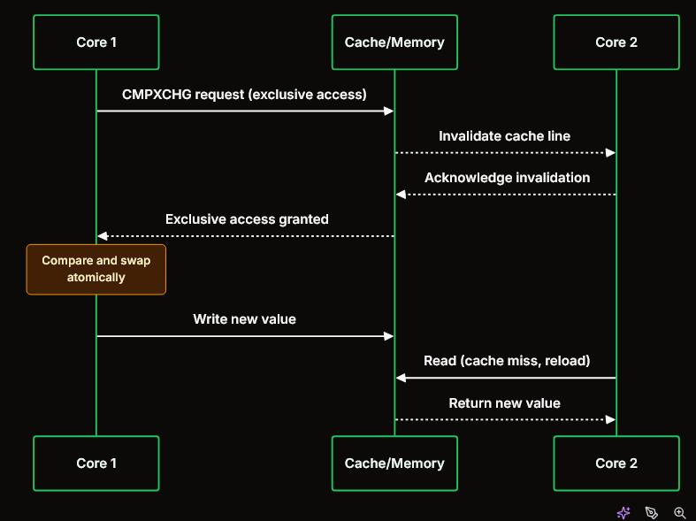

### Паттерн цикла CAS

На практике CAS почти всегда оборачивают в цикл повторных попыток — **lock-free update loop**:

```go
for {
    old := atomic.LoadInt64(&value)
    new := old + 1
    if atomic.CompareAndSwapInt64(&value, old, new) {
        break
    }
}
```

Поток считывает текущее значение, вычисляет новое и пытается выполнить CAS. Если другой поток изменил значение, CAS завершается неудачей, и цикл повторяется с новым текущим значением.

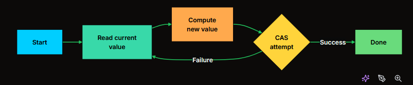

Цикл повторных попыток — это то, что отличает lock-free алгоритмы от алгоритмов с блокировками: поток может повторить попытку несколько раз, но никогда не блокируется бесконечно.

### Слабый и строгий CAS

* **Строгий (strong) CAS:** сбой только при реальном изменении значения.
* **Слабый (weak) CAS:** может дать ложный сбой даже при совпадении значений.

Слабый CAS существует потому, что на ARM реализация без ложных сбоев требует дорогой дополнительной синхронизации. Если вы уже в цикле повторных попыток, слабый CAS часто быстрее.

### Проблема ABA

**Проблема ABA** — это скрытая ошибка lock-free алгоритмов на основе CAS:

1. Поток 1 читает значение `A`.
2. Поток 1 прерывается.
3. Поток 2 меняет `A → B`.
4. Поток 2 меняет `B → A`.
5. Поток 1 возобновляется, выполняет CAS (ожидает `A`, видит `A`) — успех, но состояние изменилось!

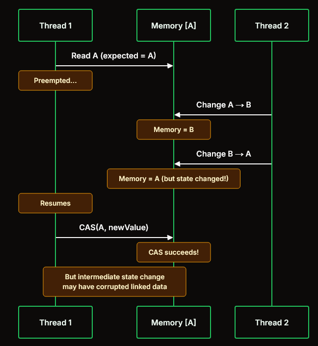

Проблема наиболее опасна для структур на указателях: lock-free стеки, очереди, пулы памяти. Для целочисленных счётчиков обычно не критична.

**Решения проблемы ABA:**

1. **Помеченные указатели / номера версий** — добавить счётчик версий, который увеличивается при каждом изменении:

```go
type TaggedPointer struct {
    ptr     unsafe.Pointer
    version uintptr
}
```

2. **Указатели опасности (hazard pointers)** — потоки публикуют указатели, которые используют; другие потоки проверяют их перед освобождением памяти.
3. **Освобождение на основе эпох (epoch-based reclamation)** — память освобождается только когда все потоки покинут эпоху.

> **Зачем это Go-разработчику.** Атомарные операции — это самый быстрый способ синхронизации, но и самый низкоуровневый. Они незаменимы для высокопроизводительных счётчиков, флагов состояния, реализации lock-free структур данных и — что важнее — являются фундаментом всех вышележащих примитивов (`Mutex`, `WaitGroup`, `Once` и т. д.). Понимание CAS и проблемы ABA необходимо при построении собственных конкурентных структур данных. В повседневной разработке чаще используются готовые примитивы `sync`, но знание их внутреннего устройства позволяет принимать верные решения при падении производительности.

***

## 2. sync.Mutex и sync.RWMutex

**Mutex** ­— это блокировка взаимного исключения. Нулевым значением
мьютекса является разблокированный мьютекс. У мьютекса есть 3 метода:

* **Lock()** — блокирует мьютек
* **TryLock()** — пытается заблокировать мьютекс и возвращает true в случае успех
* **Unlock()** — разблокирует мьютекс

**RWMutext** — это блокировка взаимного исключения для чтения/записи.
Блокировать мьютекс могут одновременно несколько читателей, но только
один писатель. У rw-мьютекса есть 7 методов:

* **Lock()** — блокирует мьютекс для записи
* **TryLock()** — пытается заблокировать мьютекс для записи и возвращает true в случае успеха
* **Unlock()** — разблокирует мьютекс для записи
* **RLock()** — блокирует мьютекс для чтения (рекурсивный вызов приводит к блокировке)
* **RUnlock()** — отменяет один вызов RLock(), это не влияет надругих читателей. Если при вызове RUnlock мьютекс не заблокирован через RLock, происходит ошибка рантайма.
* **TryRLock()** — пытается заблокировать мьютекс для чтения и возвращает true в случае успеха
* **RLocker()** — возвращает интерфейс Locker

```go
func (m *Mutex) Lock()
func (m *Mutex) TryLock() bool
func (m *Mutex) Unlock()

// RWMutex
func (rw *RWMutex) Lock()
func (rw *RWMutex) TryLock() bool
func (rw *RWMutex) Unlock()
func (rw *RWMutex) RLock()
func (rw *RWMutex) TryRLock() bool
func (rw *RWMutex) RUnlock()
func (rw *RWMutex) RLocker() sync.Locker
```

Значение мьютекса часто называют **блокировкой взаимного исключения**.
Нулевое значение мьютекса означает разблокированный мьютекс. Значение
мьютекса может быть заблокировано только тогда, когда оно находится в
разблокированном состоянии. Другими словами, как только адресуемое
значение мьютекса m успешно заблокировано (т.е., вызов метода m.Lock()
возвращает управление), новая попытка горутины заблокировать значение
мьютекса приведет к переходу горутины в блокирующее состояние, пока
значение мьютекса не будет разблокировано (путем последующего вызова
метода m.Unlock()).

Обратите внимание, что m.Lock() и m.Unlock() являются сокращенными
обозначениями (\&m).Lock() и (\&m).Unlock() соответственно.

### Устройство sync.Mutex

```go
type Mutex struct {
    state int32
    sema  uint32
}
```

По сути, мьютекс в Go имеет два поля: **state** и **sema**. На первый
взгляд они могут показаться простыми числами, но за этим скрывается
нечто большее.

Поле **state** — это 32-битное целое число, отображающее текущее
состояние мьютекса. Фактически оно разделено на несколько битов,
кодирующих различную информацию о мьютексе.

{width="6.267716535433071in"
height="2.75in"}

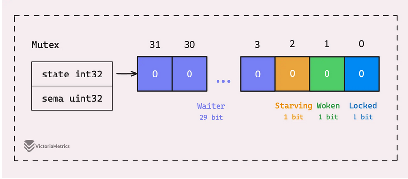

* **Заблокировано (Locked) (бит 0 (1 << 0)):** Указывает, заблокирован ли мьютекс в данный момент. Если установлено значение 1, мьютекс заблокирован, и никакая другая горутина не может его захватить.
* **Пробуждено (Woken) (бит 1 (1 << 1):** Устанавливается в 1, если какая-либо горутина была разбужена и пытается захватить мьютекс. Другие горутины не должны быть разбужены без необходимости.
* **Голодание (Starving) (бит 2 (1 << 2)):** Этот бит показывает, находится ли мьютекс в режиме голодания (установлен в 1).
* **Ожидающий (Waiter) (биты 3-31 (сдвиг на 3)):** Остальные биты отслеживают, сколько горутин ожидает мьютекс.

Другое поле, **sema**, представляет собой uint32, которое действует как
семафор для управления и сигнализации ожидающим горутинам. Когда мьютекс
разблокируется, одна из ожидающих горутин разбужается, чтобы захватить
блокировку.

В отличие от поля состояния, семафор не имеет специфической битовой
структуры и полагается на внутренний код среды выполнения для обработки
логики семафоров.

Поле sema (uint32) используется не как счётчик, а как уникальный
идентификатор очереди ожидания внутри рантайма Go. Когда горутина не
может захватить мьютекс, она вызывает runtime\_Semacquire(\&m.sema),
передавая указатель на это поле. Рантайм связывает адрес sema с
внутренней очередью спящих горутин и переводит текущую горутину в
состояние ожидания — она блокируется до пробуждения.

При разблокировке мьютекса вызывается runtime\_Semrelease(\&m.sema),
который извлекает одну горутину из очереди, связанной с этим адресом, и
делает ее готовой к выполнению. Разбуженная горутина не получает
блокировку автоматически: она возобновляет выполнение в точке после
Semacquire и снова пытается атомарно захватить состояние мьютекса,
возможно конкурируя с другими горутинами (в том числе с теми, что
выполняют спин-блокировку, или с новыми претендентами). Таким образом,
sema играет роль точки рандеву, через которую планировщик эффективно
ставит горутины в ожидание и пробуждает ровно одну из них при
освобождении ресурса.

### Поток блокировки мьютекса

В функции mutex.Lock есть два пути: **быстрый путь** для обычного случая
и **медленный путь** для обработки необычного случая.

```go
func (m *Mutex) Lock() {
    // Fast path: grab unlocked mutex.
    if atomic.CompareAndSwapInt32(&m.state, 0, mutexLocked) {
    if race.Enabled {
    race.Acquire(unsafe.Pointer(m))
    }
    return
    }
    // Slow path (outlined so that the fast path can be inlined)
    m.lockslow()
}
```

**Быстрый путь** — это попытка захватить мьютекс без ожидания, одной
атомарной операцией. Если это удаётся — отлично, функция Lock()
возвращается мгновенно. Если не удаётся — значит, мьютекс уже занят, и
нужно переходить к «медленному пути». Быстрый путь предназначен для
действительно быстрой работы и, как ожидается, будет обрабатывать
большинство случаев получения блокировок, когда мьютекс еще не
используется. Этот путь также является встраиваемым, то есть он встроен
непосредственно в вызывающую функцию:

```
$ go build -gcflags="-m"

./main.go:13:12: inlining call to sync.(*Mutex).Lock
./main.go:15:14: inlining call to sync.(*Mutex).Unlock
```

К сведению, этот встроенный быстрый путь — это интересный трюк,
использующий оптимизацию встраивания кода Go, и он часто используется в
исходном коде Go.

Когда операция **CAS (сравнение и обмен)** в быстром пути завершается
неудачей, это означает, что поле состояния не равно 0, поэтому мьютекс в
данный момент заблокирован.

Настоящая проблема здесь — медленный путь **m.lockSlow**, где горутина
вместо того чтобы сразу перейти в очередь ожидания, начинает активно
**спин-ожидать (spinning)** в **плотном цикле (tight loop)**, пытаясь
захватить мьютекс. Этот спин-цикл представляет собой не обычный цикл
for, а небольшой фрагмент низкоуровневого ассемблерного кода, который
выполняется в течение примерно 30 тактов процессора, многократно
проверяя состояние мьютекса, не освобождая при этом процессор. После
завершения такого цикла горутина снова пытается получить блокировку, и
если попытка не удается, у нее остается еще три подобных попытки, то
есть всего до 120 тактов спин-ожидания.

Смысл этого механизма в том, чтобы избежать дорогостоящего переключения
контекста и перевода горутины в состояние сна с последующим
пробуждением, если мьютекс освободится в ближайшее время. Горутина как
бы ненадолго задерживается в активном состоянии, используя легковесные
инструкции вроде YIELD, которые позволяют временно уступить процессорное
время другим задачам, но не уходить в сон. Если же после всех попыток
мьютекс так и не удалось захватить, горутина увеличивает счетчик
ожидающих, помещает себя в очередь ожидания и переходит в **спящий
режим**, ожидая сигнала на пробуждение, чтобы затем попробовать снова.
Важно, что спин-ожидание работает только на многоядерных системах — на
одноядерном процессоре оно не включается, поскольку в таком случае
активный спин не имел бы смысла и лишь бесполезно тратило бы ресурсы.
Также спин-ожидание не работает в режиме голодания.

Но что, если другая горутина уже ждет мьютекса? Кажется несправедливым,
если эта горутина первой займет блокировку. Вот почему у нашего мьютекса
два режима: **обычный и режим «голодания» (normal and starvation)**.

В **обычном режиме** горутины, ожидающие мьютекса, организованы в
очередь по принципу «первым вошел — первым вышел» (FIFO). Когда
горутина просыпается, чтобы попытаться захватить мьютекс, она не
получает управление немедленно. Вместо этого ей приходится конкурировать
с любыми новыми горутинами, которые также хотят захватить мьютекс в
данный момент.

Эта конкуренция смещена в пользу новых горутин, потому что они уже
работают на ЦП и могут быстро попытаться захватить мьютекс, пока
горутина в очереди еще просыпается.

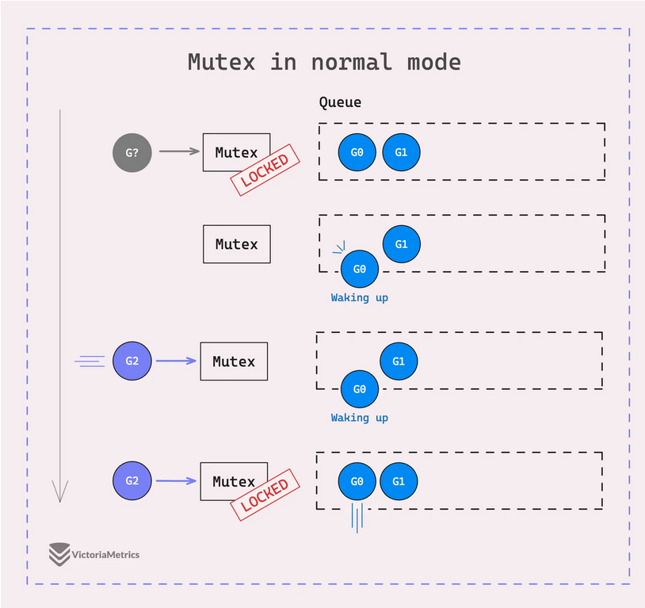

В результате, только что проснувшаяся горутина может часто проигрывать
гонку новым претендентам и возвращаться в начало очереди.

Если горутине не повезет, и она всегда просыпается, когда приходит новая
горутина, то она никогда не получит блокировку. Вот почему нам нужно
перевести мьютекс в режим «голодания».

**Режим «голодания»** включается, если горутина не может получить
блокировку более 1 миллисекунды. Он предназначен для того, чтобы
ожидающие горутины в конечном итоге получили справедливый шанс получить
мьютекс.

В этом режиме, когда горутина освобождает мьютекс, она напрямую передаёт
управление горутине в начале очереди. Это означает отсутствие
конкуренции, отсутствие гонки со стороны новых горутин. Они даже не
пытаются его приобрести, а просто встают в конец очереди.

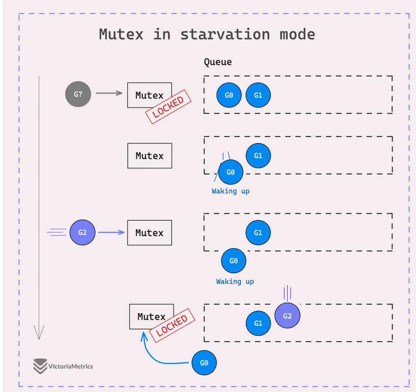

Mutex переключается из режима голодания в нормальный режим если
ожидающая горутина, получившая блокировку, находится последней в очереди
или ожидает менее 1 миллисекунды.

### Поток разблокировки мьютекса

**Процесс разблокировки** проще, чем процесс блокировки. У нас
по-прежнему есть два пути: **быстрый путь**, который встраивается в код,
и **медленный путь**, который обрабатывает необычные случаи.

Быстрый путь сбрасывает бит блокировки в состоянии мьютекса. Если вы
помните структуру мьютекса, это первый бит mutex.state. Если сброс этого
бита обнуляет состояние, это означает, что никакие другие флаги не
установлены (например, ожидающие горутины), и наш мьютекс теперь
полностью свободен.

Но что, если состояние не равно нулю? Вот тут-то и вступает в игру
**медленный путь**, которому нужно знать, находится ли наш мьютекс в
обычном режиме или в режиме голодания. Вот реализация медленного пути:

```go
func (m *Mutex) unlockSlow(new int32) {
    if (new+1)&mutexStarving == 0 {
        // Normal mode
        old := new
        for {
            if old>>mutexWaiterShift == 0 || old&(mutexLocked|mutexWoken|mutexStarving) != 0 {
                return
            }
            new = (old - 1<<mutexWaiterShift) | mutexWoken
            if atomic.CompareAndSwapInt32(&m.state, old, new) {
                runtime_Semrelease(&m.sema, false, 1)
                return
            }
            old = m.state
        }
    } else {
        // Starving mode: handoff ownership directly
        runtime_Semrelease(&m.sema, true, 1)
    }
}
```

В обычном режиме, если есть ожидающие горутины и ни одна другая горутина
не была разбужена или не получила блокировку, мьютекс пытается атомарно
уменьшить счетчик ожидающих горутин и включить флаг **mutexWoken**. В
случае успеха он освобождает семафор, чтобы разбудить одну из ожидающих
горутин и получить блокировку.

В режиме голодания он атомарно увеличивает значение семафора (mutex.sem)
и передает право собственности на мьютекс непосредственно первой
ожидающей горутине в очереди. Второй аргумент функции
**runtime\_Semrelease** определяет, выполняется ли передача.

### Пример использования sync.Mutex

```go
type Counter struct {
    mu sync.Mutex
    n  int64
}

func (c *Counter) Inc() {
    c.mu.Lock()
    c.n++
    c.mu.Unlock()
}

func (c *Counter) Value() int64 {
    c.mu.Lock()
    defer c.mu.Unlock()
    return c.n
}
```

В приведенном выше примере значение счетчика использует поле Mutex,
чтобы гарантировать, что поле n значения счетчика никогда не будет
использоваться несколькими горутинами одновременно.

### Устройство sync.RWMutex

В отличие от sync.Mutex, который предоставляет эксклюзивную блокировку,
**sync.RWMutex** реализует более сложную модель синхронизации: он
позволяет нескольким читателям одновременно удерживать блокировку, но
при этом гарантирует эксклюзивный доступ для писателя. Внутренне RWMutex
состоит из нескольких полей:

* **w Mutex** — обычный мьютекс, используемый для сериализации писателей;
* **writerSem uint32** — семафор для ожидания писателей;
* **readerSem uint32** — семафор для ожидания читателей;
* **readerCount atomic.Int32** — счетчик активных читателей;
* **readerWait atomic.Int32** — счетчик читателей, которых должен дождаться писатель

```go
type RWMutex struct {
    w           Mutex
    writerSem   uint32
    readerSem   uint32
    readerCount atomic.Int32
    readerWait  atomic.Int32
}
```

Основная логика RWMutex строится вокруг счётчика readerCount:

* если readerCount >= 0 — активны читатели, писателя нет;
* если readerCount < 0 — есть ожидающий писатель, и новые читатели блокируются.

Для этого используется специальное большое отрицательное смещение
(константа rwmutexMaxReaders), которое «резервирует» диапазон значений
для сигнализации о наличии писателя.

#### Как работает RLock

При вызове RLock():

1. атомарно увеличивается readerCount;
2. если результат остаётся ≥ 0:
   * читатель получает доступ сразу (быстрый путь);
3. если результат < 0:
   * значит, писатель уже ожидает или активен;
   * горутина блокируется через runtime\_Semacquire(\&rw.readerSem).

Таким образом:

* чтения в отсутствие писателей выполняются без блокировок;
* при появлении писателя новые читатели начинают блокироваться.

#### Как работает RUnlock

При вызове RUnlock():

1. атомарно уменьшается readerCount;
2. если результат всё ещё ≥ 0:

* ничего делать не нужно;

1. если результат < 0:

* значит, есть ожидающий писатель;
* уменьшается readerWait;
* если это был последний активный читатель (readerWait == 0), то пробуждается писатель через runtime\_Semrelease(\&rw.writerSem).

#### Как работает Lock (захват на запись)

Операция записи устроена значительно сложнее:

1. сначала захватывается rw.w.Lock():
   * это гарантирует, что только один писатель проходит дальше;
2. затем:
   * из readerCount вычитается rwmutexMaxReaders (большое число);
   * это делает значение отрицательным и блокирует новых читателей;
3. текущее количество активных читателей сохраняется;
4. если есть активные читатели:
   * их число записывается в readerWait;
   * писатель блокируется через runtime\_Semacquire(\&rw.writerSem).

Таким образом писатель:

* блокирует вход новым читателям;
* дожидается завершения уже работающих читателей;
* получает эксклюзивный доступ.

#### Как работает Unlock (освобождение записи)

При вызове Unlock():

1. в readerCount возвращается rwmutexMaxReaders:
   * это снимает запрет на новые чтения;
2. пробуждаются все ожидающие читатели:
   * через последовательные вызовы runtime\_Semrelease(\&rw.readerSem);
3. освобождается rw.w:
   * позволяя другим писателям конкурировать за блокировку.

#### Семафоры в RWMutex

Как и в Mutex, поля readerSem и writerSem:

* не являются счетчиками в прямом смысле;
* используются как идентификаторы очередей ожидания в рантайме;
* работают через:
  * runtime\_Semacquire — усыпление горутины;
  * runtime\_Semrelease — пробуждение.

#### Важные особенности работы

1\. Приоритет писателей (writer preference)

Как только появляется писатель:

* новые читатели перестают проходить;
* это предотвращает бесконечное «голодание» писателя.

2\. Нет рекурсивности

повторный RLock() возможен (как отдельные независимые захваты); но:

* нельзя безопасно «повысить» RLock → Lock;
* попытка сделать это приведёт к deadlock.

3\. Нет upgrade/downgrade

RWMutex не поддерживает:

* апгрейд read → write;
* даунгрейд write → read.

Это нужно реализовывать вручную (обычно через освобождение и повторный
захват).

4\. Возможна деградация при write-heavy нагрузке

при частых писателях:

* читатели начинают блокироваться;
* преимущества RWMutex исчезают;

в таких случаях обычный Mutex может быть быстрее.

> **Зачем это Go-разработчику.** Используйте `sync.Mutex` для защиты общих данных в подавляющем большинстве случаев. `sync.RWMutex` даёт выигрыш только при значительном перевесе операций чтения над записью (read-heavy). При частых записях издержки на управление счётчиками читателей могут сделать RWMutex медленнее обычного Mutex — всегда проверяйте бенчмарками. Не пытайтесь делать upgrade с RLock до Lock — это deadlock.

***

## 3. Применение каналов для синхронизации

**Бинарный семафор** — это примитив синхронизации, который может
находиться только в одном из двух состояний:

* **0 (занят / заблокирован)**
* **1 (свободен / разблокирован)**

**Принцип работы:**

* **wait() (или P, acquire):** Поток проверяет семафор. Если значение = 1, он уменьшает его до 0 и продолжает работу. Если значение уже = 0, поток блокируется и ждёт.
* **signal() (или V, release):** Поток увеличивает значение семафора с 0 до 1. Это разблокирует один из ожидающих потоков (если они есть).

Ключевое назначение бинарного семафора - обеспечение **взаимного
исключения (Mutex)** для доступа к общему ресурсу. Только один поток
может захватить семафор и получить доступ к критической секции.

Каналы с буферизацией в одну емкость могут использоваться в качестве
одноразовых бинарных семафоров. На самом деле, такие каналы также могут
использоваться в качестве многократных бинарных семафоров, также
известных как **мьютексы**, хотя такие мьютексы не так эффективны, как
мьютексы, предоставляемые стандартным пакетом синхронизации.

Существует два способа использования каналов с буферизацией в одну
емкость в качестве мьютексов:

* Блокировка через отправку, разблокировка через прием.
* Блокировка через прием, разблокировка через отправку.

Ниже приведен пример блокировки через отправку.

```go
func main() {
    mutex := make(chan struct{}, 1)

    // Lock: send to channel
    mutex <- struct{}{}

    // critical section

    // Unlock: receive from channel
    <-mutex
}
```

Ниже приведён пример блокировки по принципу приема. Он демонстрирует
лишь изменённую часть, основанную на приведённом выше примере блокировки
по принципу отправки.

```go
func main() {
    mutex := make(chan struct{}, 1)
    mutex <- struct{}{} // initialize with one token

    // Lock: receive
    <-mutex

    // critical section

    // Unlock: send back
    mutex <- struct{}{}
}
```

Буферизованные каналы можно использовать в качестве счетных семафоров.
**Счетные семафоры** можно рассматривать как блокировки с несколькими
владельцами. Если пропускная способность канала равна N, то его можно
рассматривать как блокировку, которая может иметь не более N владельцев
в любой момент времени. **Бинарные семафоры (мьютексы)** — это особые
счетные семафоры, каждый из которых может иметь не более одного
владельца в любой момент времени.

Счетные семафоры часто используются для ограничения максимального
количества одновременных запросов.

Как и в случае использования каналов в качестве мьютексов, существует
два способа получения права собственности на канальный семафор:

* Получение права собственности путем отправки, освобождение путем получения.
* Получение права собственности путем получения, освобождение путем отправки.

> **Зачем это Go-разработчику.** Каналы — идиоматичный способ синхронизации в Go, но не всегда самый эффективный. Используйте каналы когда синхронизация неразрывно связана с передачей данных (например, fan-in/fan-out, pipeline). Для чистой синхронизации без передачи данных предпочтительнее примитивы `sync`. Счётный семафор на буферизованном канале — простой и эффективный способ ограничения конкурентности без внешних зависимостей.

***

## 4. sync.WaitGroup

**WaitGroup** ожидает завершения выполнения набора горутин.

### Методы WaitGroup

* **Add()** — увеличивает счетчик (counter). Можно передавать отрицательно число;
* **Done()** — уменьшает счетчик на один (внутри просто вызов Add(-1));
* **Wait()** — блокирует горутины, пока счетчик не будет равен 0;

Каждое значение sync.WaitGroup поддерживает внутренний счетчик.
Начальное значение счетчика равно нулю.

Обратите внимание, что wg.Add(delta), wg.Done() и wg.Wait() — это
сокращенные обозначения (\&wg).Add(delta), (\&wg).Done() и (\&wg).Wait()
соответственно.

```go
func (wg *WaitGroup) Add(delta int)
func (wg *WaitGroup) Done()
func (wg *WaitGroup) Wait()
```

В Go легко скопировать структуру, просто присвоив её другой переменной.
Но некоторые структуры, например WaitGroup, копировать не следует.

Копирование WaitGroup может привести к проблемам, поскольку внутреннее
состояние, отслеживающее горутины и их синхронизацию, может
рассинхронизироваться между копиями.

### noCopy

Структура **noCopy** включена в WaitGroup как способ предотвращения
ошибок копирования, не путем генерации ошибок, а в качестве
предупреждения.

Структура noCopy фактически не влияет на работу вашей программы. Вместо
этого она служит маркером, который такие инструменты, как go vet, могут
обнаружить, когда структура была скопирована ненадлежащим образом.

```go
type noCopy struct{}

func (*noCopy) Lock()   {}
func (*noCopy) Unlock() {}
```

Его структура предельно проста:

* В нём нет полей, поэтому он не занимает значительного места в памяти.
* У него есть два метода, Lock и Unlock, которые ничего не делают (no-op). Эти методы нужны только для работы с проверкой -copylocks в инструменте go vet.

Когда вы запускаете go vet на своём коде, он проверяет, были ли
скопированы какие-либо структуры с полем noCopy, например WaitGroup,
способом, который может вызвать проблемы.

Он выдаст ошибку, чтобы сообщить вам о возможной проблеме. Это даст вам
возможность исправить её до того, как она превратится в ошибку:

```go
type WaitGroup struct {
    noCopy noCopy
    state1 [12]byte
    sema   uint32
}
```

В этом случае go vet предупредит вас о трех разных местах, где
происходит копирование.

### Внутреннее состояние

**Состояние (поле state)** WaitGroup хранится в переменной типа
**atomic.Uint64**. В этом единственном значении заключено несколько
важных параметров.

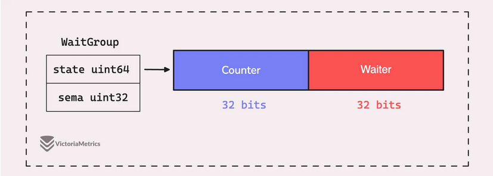

* **Счетчик (Counter) (старшие 32 бита):** Эта часть отслеживает количество горутин, ожидающих завершения WaitGroup. При вызове wg.Add() с положительным значением этот счетчик увеличивается, а при вызове wg.Done() он уменьшается на единицу.
* **Ожидающее (Waiter) (младшие 32 бита):** Эта часть отслеживает количество горутин, ожидающих, пока счетчик (старшие 32 бита) достигнет нуля. Каждый раз при вызове wg.Wait() счетчик «ожидающих» увеличивается. Как только счетчик достигает нуля, он
  освобождает все ожидающие горутины.

Затем следует последнее поле, **sema uint32**, которое представляет
собой внутренний семафор, управляемый средой выполнения Go.

Когда горутина вызывает wg.Wait(), и счетчик не равен нулю, она
увеличивает счетчик waiter, а затем блокируется, вызывая
**runtime\_Semacquire(\&wg.sema)**. Этот вызов функции переводит горутину
в спящий режим, пока она не будет разбужена соответствующим вызовом
**runtime\_Semrelease(\&wg.sema)**.

### Проблема выравнивания

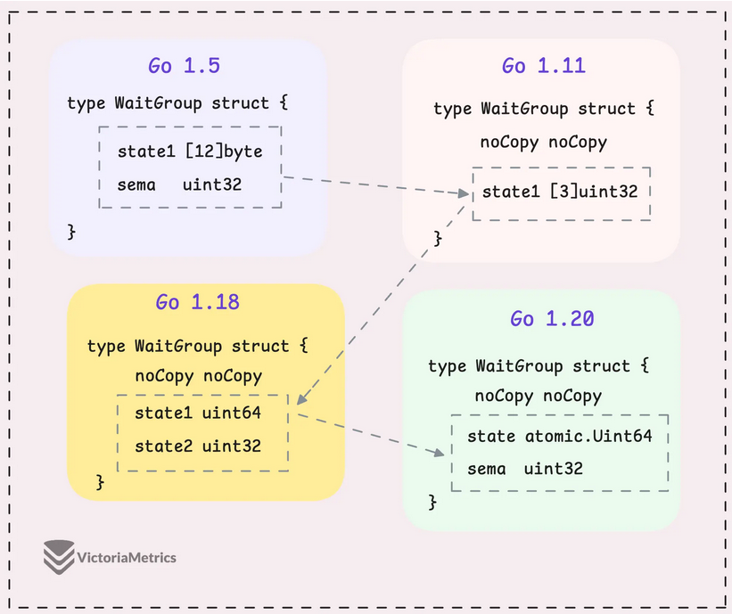

Ядро ​​WaitGroup (счетчик, ожидающий объект и семафор) практически не
менялось в разных версиях Go. Однако структура этих элементов
многократно модифицировалась.

Когда мы говорим о **выравнивании (alignment)**, мы имеем в виду
необходимость хранения типов данных по определенным адресам памяти для
обеспечения эффективного доступа.

Например, в 64-битной системе 64-битное значение, такое как uint64, в
идеале должно храниться по адресу памяти, кратному 8 байтам. Причина в
том, что процессор может получить выровненные данные за один раз, но
если данные не выровнены, для доступа к ним может потребоваться
несколько операций.

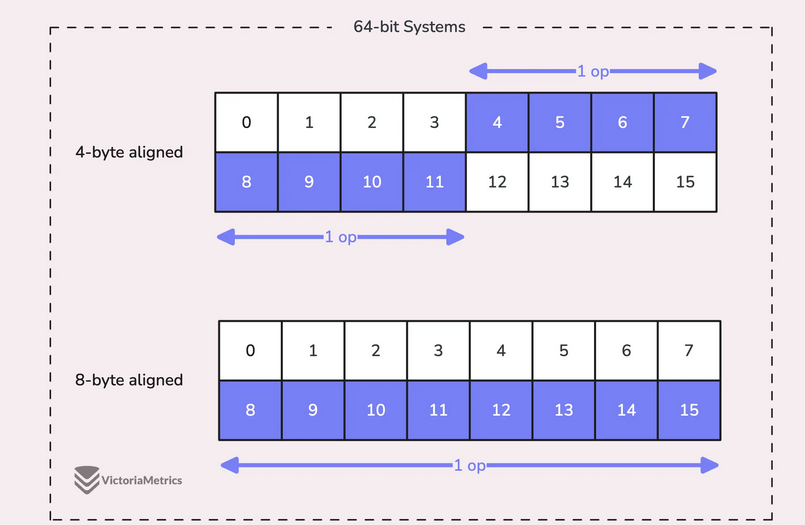

На 32-битных архитектурах возникают сложности: компилятор не гарантирует
выравнивание 64-битных значений по 8-байтовой границе. Вместо этого они
могут быть выровнены только по 4-байтовой границе.

Это становится проблемой при использовании пакета atomic для выполнения
операций над переменной состояния. В пакете atomic специально
отмечается:

«На ARM, 386 и 32-битных MIPS ответственность за обеспечение 64-битного
выравнивания 64-битных слов, к которым осуществляется атомарный доступ с
помощью примитивных атомарных функций, лежит на вызывающей стороне».

Поэтому, если мы не выровняем переменную состояния uint64 по 8-байтовой
границе на этих 32-битных архитектурах, это может привести к сбою
программы.

Давайте посмотрим, как это решается в разных версиях Go.

#### Go 1.5: state1 \[12]byte

```go
type WaitGroup struct {
    state1 [12]byte
    sema uint32
}

func (wg *WaitGroup) state() *uint64 {
    if uintptr(unsafe.Pointer(&wg.state1))%8 == 0 {
    return (*uint64)(unsafe.Pointer(&wg.state1))
    } else {
    return (*uint64)(unsafe.Pointer(&wg.state1[4]))
    }
}
```

Вместо прямого использования типа uint64 для состояния, WaitGroup
выделяет **12 байт в массиве (state1 \[12]byte)**. Это может показаться
избыточным, но этому есть причина.

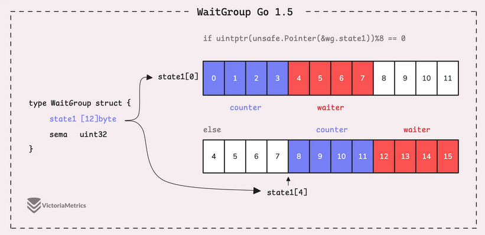

Цель использования 12 байтов — обеспечить достаточно места для поиска
правильно выровненного 8-байтового сегмента.

Выравнивание структуры зависит от типа ее поля, поэтому оно может быть
либо 8-байтовым, либо 4-байтовым в зависимости от архитектуры. Если
начальный адрес состояния 1 не выровнен, код может просто сдвинуться на
несколько байтов (в данном случае на 4 байта), чтобы найти в пределах
этих 12 байтов выровненный участок.

#### Go 1.11: state1 \[3]uint32

Использование 12 байт было избыточным, поскольку 4 байта, по сути,
ничего не делали. В Go 1.11 решением стало упрощение за счет объединения
state (включая счетчик (counter) и ожидающий (waiter)) и sema в всего
лишь 3 поля типа uint32.

```go
type WaitGroup struct {
    noCopy noCopy
    state1 [3]uint32
}
```

Итак, как же теперь избежать проблемы выравнивания состояний? Ответ
кроется в методе **state()**.

Поскольку state1 теперь представляет собой массив uint32, он начинается
с адреса, кратного 4 байтам.

Для переменной типа массива его выравнивание соответствует выравниванию
типа его элемента.

Вот как работает метод state(), если адрес wg.state1 не выровнен по 8
байтам:

* Первый элемент (state1\[0]) используется для sema.
* Второй элемент (state1\[1]) используется для отслеживания количества ожидающих.
* Третий элемент (state1\[2]) используется для счетчика.

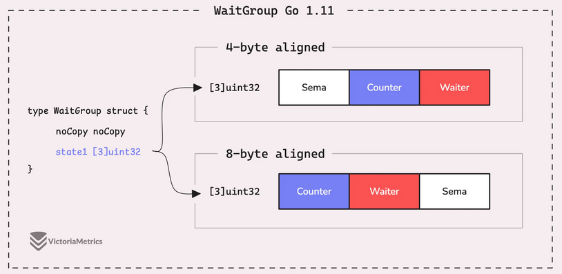

А если адрес wg.state1 выровнен по 8 байтам, то элементы в state1
перестраиваются между state и sema, как показано на изображении выше.

#### Go 1.18: state1 uint64; state2 uint32

Проблема предыдущего подхода заключалась в том, что независимо от того,
работали ли мы с 64-битным или 32-битным выравниванием, нам все равно
приходилось манипулировать состоянием и семафором в 12-байтовом массиве.
Но поскольку большинство современных систем 64-битные, имело смысл
оптимизировать их для более распространенного сценария.

Идея в Go 1.18 проста: в 64-битной системе нам не нужно делать ничего
особенного, state1 хранит состояние, а state2 используется для семафора:

```go
type WaitGroup struct {
    noCopy noCopy
    state1 uint64
    state2 uint32
}
```

Однако в системе с 4-байтовым выравниванием код возвращается к
предыдущему решению Go 1.11. Метод state() преобразует state1 и state2 в
3-элементный массив uint32 и переставляет элементы, чтобы сохранить
правильное выравнивание state и sema.

```go
func (wg *WaitGroup) state() (statep *uint64, semap *uint32) {
    if unsafe.Alignof(wg.state1) == 8 || uintptr(unsafe.Pointer(&wg.state1))%8 == 0 {
        return &wg.state1, &wg.state2
    }
    // 32-bit: re-interpret as [3]uint32
    state := (*[3]uint32)(unsafe.Pointer(&wg.state1))
    return (*uint64)(unsafe.Pointer(&state[1])), &state[0]
}
```

Самое интересное началось в Go 1.20, где решили использовать
atomic.Uint64 для обработки состояния, полностью устранив необходимость
в методе state().

#### Go 1.20: state atomic.Uint64

В Go 1.19 была введена ключевая оптимизация, гарантирующая, что значения
uint64, используемые в атомарных операциях, всегда выравниваются по
8-байтовым границам, даже на 32-битных архитектурах.

Для достижения этой цели Расс Кокс ввёл специальную структуру
**atomic.Uint64**, которая, по сути, является оберткой над uint64:

```go
type Uint64 struct {
    _ align64
    v uint64
}
```

Когда вы включаете **align64** в структуру, это сигнализирует
компилятору Go о том, что вся структура должна быть выровнена по
8-байтовой границе в памяти.

На самом деле, **align64** — это просто пустая структура. У неё нет
никаких методов или специального поведения, как у структуры noCopy, о
которой мы говорили ранее.

Само поле align64 не занимает никакого места, но оно действует как
«маркер», который сообщает компилятору Go, как обрабатывать структуру.
Компилятор Go распознаёт align64 и автоматически корректирует
расположение структуры в памяти с необходимым заполнением, гарантируя,
что вся структура начинается с 8-байтовой границы. Благодаря этому
структура WaitGroup становится намного проще:

```go
type WaitGroup struct {
    noCopy noCopy
    state  atomic.Uint64
    sema   uint32
}
```

Благодаря atomic.Uint64 гарантируется выравнивание состояния по 8
байтам, поэтому вам не нужно беспокоиться о проблемах выравнивания,
которые могут нарушить атомарные операции с 64-битными переменными.

### Внутренняя работа sync.WaitGroup:

Теперь давайте разберем, как работает каждый метод в WaitGroup, и
поймем, как Go реализует алгоритм без блокировок, используя состояние.

#### wg.Add(delta int)

Когда мы передаем значение методу **wg.Add(?)**, он соответствующим
образом корректирует счетчик (counter).

Если вы укажете положительное значение, оно будет добавляться к
счетчику. Интересно, что вы также можете передать отрицательное
значение, которое будет вычитаться из счетчика.

Как вы, возможно, догадались, **wg.Done()** — это просто сокращение
для wg.Add(-1):

```go
func (wg *WaitGroup) Done() {
    wg.Add(-1)
}
```

Однако, если отрицательное значение дельты приведет к тому, что счетчик
упадет ниже нуля, программа выдаст ошибку. WaitGroup не проверяет
счетчик перед его обновлением, а сначала обновляет его, а затем
проверяет. Это означает, что если счетчик станет отрицательным после
вызова wg.Add(?), он останется отрицательным до тех пор, пока не
произойдет ошибка.

Поэтому, если вы обнаружили эту ошибку и планируете повторно
использовать WaitGroup, будьте осторожны.

```go
func (wg *WaitGroup) Add(delta int) {
    state := wg.state.Add(uint64(delta) << 32)
    v := int32(state >> 32)
    w := uint32(state)
    if v < 0 {
        panic("sync: negative WaitGroup counter")
    }
    if w != 0 && delta > 0 && v == int32(delta) {
        panic("sync: WaitGroup misuse: Add called concurrently with Wait")
    }
    if v > 0 || w == 0 {
        return
    }
    // Reset state and wake all waiters
    wg.state.Store(0)
    for ; w != 0; w-- {
        runtime_Semrelease(&wg.sema, false, 0)
    }
}
```

Обратите внимание, как можно атомарно увеличить счетчик, вызвав
wg.state.Add(uint64(delta) << 32).

Вот что, возможно, не всем известно: добавление положительной дельты для
обозначения начала новых задач или горутин должно происходить до вызова
wg.Wait().

Таким образом, если вы повторно используете WaitGroup или хотите
дождаться завершения одной партии задач, сбросить состояние, а затем
дождаться следующей партии, необходимо убедиться, что все вызовы wg.Wait
завершены до начала новых вызовов wg.Add(positive) для следующего раунда
задач.

Это позволяет избежать путаницы относительно того, какими задачами в
данный момент управляет WaitGroup.

С другой стороны, вы можете вызвать wg.Add(?) с отрицательной дельтой в
любое время, если это не приведет к отрицательному значению счетчика.

#### wg.Wait()

О функции **wg.Wait()** особо нечего сказать. По сути, она зацикливается
и пытается увеличить количество ожидающих с помощью атомарной операции
CAS (Compare-And-Swap).

**CAS (Compare-and-Swap, «сравнение и обмен»)** — это атомарная
инструкция процессора для безопасного обновления данных в многопоточной
среде. Она сравнивает значение в памяти с ожидаемым старым значением:
если они совпадают, ячейка обновляется новым значением, иначе операция
не выполняется. Это основа «неблокирующей» (lock-free) синхронизации,
обеспечивающая высокую производительность. CAS работает как атомарная
инструкция, выполняющая три действия за одну неделимую операцию:

1. Сравнивает текущее значение в ячейке памяти с ожидаемым старым значением.
2. Если значения совпадают — обновляет ячейку новым значением и сообщает об успехе.
3. Если не совпадают — ничего не меняет и сообщает о неудаче.

В контексте wg.Wait() это позволяет выполняющей спин-блокировку (spinning) безопасно
увеличивать счетчик ожидающих goroutine без блокировок: каждая goroutine
пробует атомарно увеличить счетчик с помощью CAS; если операция не
удалась (значение изменилось конкурентом), она повторяет попытку, пока
не достигнет цели.

```go
func (wg *WaitGroup) Wait() {
    for {
        state := wg.state.Load()
        v := int32(state >> 32)
        if v == 0 {
            return
        }
        // CAS: increment waiter count
        if wg.state.CompareAndSwap(state, state+1) {
            runtime_Semacquire(&wg.sema)
            if wg.state.Load() != 0 {
                panic("sync: WaitGroup is reused before previous Wait has returned")
            }
            return
        }
    }
}
```

Если операция CAS завершается неудачей, это означает, что другая
горутина изменила состояние, возможно, счетчик достиг нуля или был
увеличен/уменьшен. В этом случае wg.Wait() не может просто предположить,
что все осталось как было, поэтому он повторяет попытку.

Когда операция CAS проходит успешно, wg.Wait() увеличивает счетчик
ожидающих горутин, а затем переводит горутину в спящий режим с помощью
семафора.

Как вы помните, в конце wg.Add() проверяются два условия: равен ли
счетчик counter нулю и больше ли счетчик waiter чем ноль. Если оба
условия выполняются, он пробуждает все ожидающие горутины и сбрасывает
состояние до 0.

### Пример использования WaitGroup

Как правило, значение WaitGroup используется в случае, когда одна
горутина ожидает завершения своих задач несколькими другими горутинами.
Пример:

```go
func main() {
    var wg sync.WaitGroup
    N := 10
    values := make([]int, N)

    for i := 0; i < N; i++ {
        wg.Add(1)
        go func(idx int) {
            defer wg.Done()
            values[idx] = idx * idx
        }(i)
    }
    wg.Wait()
    fmt.Println(values)
}
```

В приведенном выше примере основная горутина ждет, пока все остальные N
горутин не заполнят значения своих элементов в массиве values. Вот один
из возможных результатов:

```
Done: 4
Done: 1
Done: 3
Done: 0
Done: 2
values: [71 89 50 62 60]
```

В приведенном выше примере единственный вызов метода Add можно разделить
на несколько отдельных вызовов.

```go
wg.Add(1)
go func() { defer wg.Done(); /* ... */ }()
wg.Add(1)
go func() { defer wg.Done(); /* ... */ }()
wg.Wait()
```

Метод Wait можно вызывать в нескольких горутинах. Когда счетчик
достигнет нуля, все они получат уведомление в широковещательной
рассылке.

```go
var wg sync.WaitGroup
wg.Add(3)

for i := 0; i < 3; i++ {
    go func() {
        defer wg.Done()
        // work
    }()
}

// Multiple waiters
for i := 0; i < 3; i++ {
    go func() {
        wg.Wait()
        fmt.Println("all done")
    }()
}
```

Значение WaitGroup можно использовать повторно после одного вызова
метода Wait, который возвращает значение из этого объекта. Однако
обратите внимание, что каждый вызов метода Add с положительным значением
дельты, происходящий, когда счетчик равен нулю, должен выполняться до
начала любого вызова Wait, иначе могут возникнуть состояния гонки
данных.

> **Зачем это Go-разработчику.** `sync.WaitGroup` — стандартный инструмент для ожидания завершения группы горутин. Никогда не копируйте WaitGroup после использования. Вызов `Add` всегда должен происходить до `Wait`. Для сценариев с обработкой ошибок рассмотрите `errgroup.Group` из `golang.org/x/sync`.

***

## 5. sync.Pool

**sync.Pool** — это набор временных объектов, предназначенных для
сохранения и повторного извлечения. Его главная цель — кэшировать
аллоцированные, но неиспользуемые элементы для последующего повторного
использования, что значительно снижает нагрузку на сборщик мусора (GC).
Это делает Pool удобным инструментом для построения эффективных,
потокобезопасных **списков свободных элементов (free lists)**.

Pool идеально подходит для управления группой временных объектов,
которые неявно разделяются и потенциально повторно используются
параллельными клиентами, что позволяет амортизировать накладные расходы
на выделение памяти. Классический пример — пакет fmt, который
поддерживает динамически изменяющийся набор временных буферов вывода,
масштабируясь при нагрузке и сжимаясь в состоянии покоя. Однако Pool не
подходит для списков свободных элементов, поддерживаемых как часть
короткоживущего объекта, так как в этом случае накладные расходы не
амортизируются эффективно.

Pool потокобезопасен и может использоваться несколькими горутинами
одновременно. Важно помнить, что любой элемент, хранящийся в Pool, может
быть автоматически удален в любое время без уведомления. Если Pool
содержал единственную ссылку на такой объект, он может быть
деаллоцирован. Также Pool нельзя копировать после первого использования.

В контексте модели памяти Go, вызов Put(x) "синхронизируется перед"
вызовом Get(), возвращающим то же значение . Аналогично, вызов New(),
возвращающий , "синхронизируется перед" вызовом Get(), возвращающим.

```go
var pool = sync.Pool{
    New: func() any {
        return &Object{
            data: make([]byte, 0, 1024),
        }
    },
}

type Object struct {
    data []byte
}
```

Для создания пула можно указать функцию **\`New()\`**, которая
возвращает новый объект, когда пул пуст. Эта функция необязательна; если
вы её не укажете, пул просто вернет \`nil\`, если он пуст.

В приведенном выше фрагменте кода цель состоит в повторном использовании
экземпляра структуры **\`Object\`**, а именно среза внутри него.
Повторное использование среза помогает уменьшить ненужный рост.

Например, если размер среза увеличивается до 8192 байт во время
использования, вы можете сбросить его длину до нуля, прежде чем вернуть
его в пул. Базовый массив по-прежнему имеет емкость 8192 байта, поэтому
в следующий раз, когда он вам понадобится, эти 8192 байта будут готовы к
повторному использованию.

```go
func process() {
    obj := pool.Get().(*Object)
    defer pool.Put(obj)

    obj.data = obj.data[:0] // reset length
    // use obj.data...
    obj.data = append(obj.data, "hello"...)
}
```

Процесс довольно понятен: вы получаете объект из пула, используете его,
сбрасываете его, а затем возвращаете обратно в пул. Сброс объекта можно
выполнить либо до того, как вернуть его обратно, либо сразу после
получения из пула, но это не обязательно, это распространенная практика.

Если вам не нравится использовать утверждения типов с помощью
\`pool.Get().(\*Object)\`, есть несколько способов этого избежать:

1\. Используйте отдельную функцию для получения объекта из пула:

```go
func getObject() *Object {
    return pool.Get().(*Object)
}

func putObject(obj *Object) {
    obj.data = obj.data[:0]
    pool.Put(obj)
}
```

2\. Создайте собственную универсальную (generic) версию sync.Pool:

```go
type Pool[T any] struct {
    p    sync.Pool
    New  func() T
}

func (p *Pool[T]) Get() T {
    v := p.p.Get()
    if v == nil {
        if p.New != nil {
            return p.New()
        }
        var zero T
        return zero
    }
    return v.(T)
}

func (p *Pool[T]) Put(v T) {
    p.p.Put(v)
}
```

**Универсальная обертка (generic wrapper)** обеспечивает более
типобезопасный способ работы с пулом, избегая утверждений типов.

Однако следует отметить, что она добавляет небольшие накладные расходы
из-за дополнительного уровня косвенного доступа. В большинстве случаев
эти накладные расходы минимальны, но если вы работаете в среде, сильно
зависящей от процессора, стоит провести бенчмарки, чтобы оценить, стоит
ли это того.

### Пример использования

Он широко используется в стандартной библиотеке. Например, в пакете
encoding/json:

```go
var encodeStatePool = sync.Pool{
    New: func() any {
        return new(encodeState)
    },
}

func (e *encodeState) Marshal(v any) ([]byte, error) {
    // ...
}

func Marshal(v any) ([]byte, error) {
    e := encodeStatePool.Get().(*encodeState)
    defer encodeStatePool.Put(e)
    e.Reset()
    // ...
}
```

В данном случае sync.Pool используется для повторного использования
объектов \*encodeState, которые обрабатывают процесс кодирования JSON в
bytes.Buffer.

Вместо того чтобы просто удалять эти объекты после каждого
использования, что только увеличило бы нагрузку на сборщик мусора, мы
сохраняем их в пуле (sync.Pool). В следующий раз, когда нам понадобится
что-то подобное, мы просто возьмём это из пула, вместо того чтобы
создавать новый с нуля.

### sync.Pool и ловушка аллокации

В пуле обычно хранится не сам объект, а указатель на него.

```go
// Works: pointer goes through interface{} without extra allocation
pool.Put(&myStruct{})
```

Мы используем пул из \[]]byte. Как правило (хотя и не всегда), при
передаче значения в интерфейс это значение может быть помещено в кучу.
Здесь это тоже происходит, не только со срезами, но и со всем, что вы
передаете в pool.Put(), кроме указателя. Если проверите с помощью эскейп
анализна:

```go
pool.Put(&bytes) // pointer — no escape to heap
```

Можно сказать: «значение bytes выходит в кучу через интерфейс».

Однако, если мы передадим указатель в pool.Put(), дополнительного
выделения памяти не произойдет:

```

### `m_IbjidGyj2sPo2ic7RWcl2WDcqEKX_4I5VnmvQvhsk=` — **DIAGRAM**
Pool local per-P architecture

### `j3F6GE_zqXl51tohzDOKu14KLDtedgSXYVMu6NtZUS4=` — **DIAGRAM**
Pool local: private + shared chain

### `HYrVEn_GS8jeMghISoXfkh3qJsB1fT8l7u50-vuj9Fg=` — **CODE**
poolLocal struct definition:
```

В этом случае данные больше не уходят в кучу.

### Устройство sync.Pool

В Go sync.Pool — это не просто один большой пул, а фактически
несколько «локальных» пулов, каждый из которых привязан к определенному
контексту **процессора (P из модели GMP)**, которым управляет среда
выполнения Go в любой момент времени.

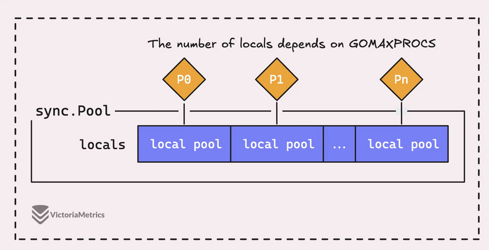

Когда горутина, работающая на процессоре (P), нуждается в объекте из
пула, она сначала проверяет свой собственный локальный пул P, прежде чем
искать его где-либо ещё.

Это разумное проектное решение, поскольку оно означает, что каждый
логический процессор (P) имеет свой собственный набор объектов для
работы. Это уменьшает конкуренцию между горутинами, поскольку только
одна горутина может одновременно обращаться к своему локальному пулу P.

Таким образом, процесс происходит очень быстро, поскольку нет
вероятности того, что две горутины попытаются одновременно получить один
и тот же объект из одного и того же локального пула.

### Локальный пул и проблема ложного разделения

Взгляните на диаграмму ниже: каждый локальный пул P фактически состоит
из двух основных частей: **цепочки общего пула (shared) и приватного
объекта (private object)**.

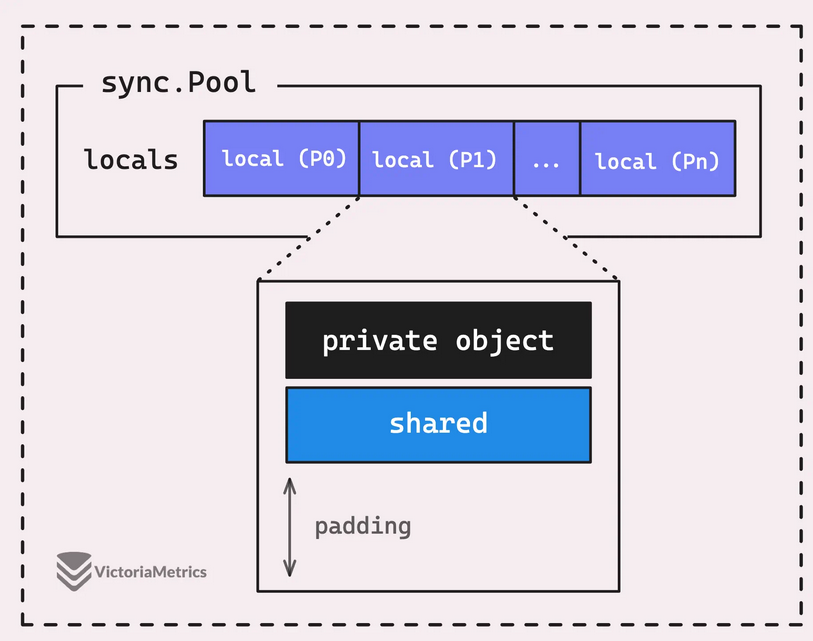

Вот определение локального пула в исходном коде Go:

```go
type poolLocal struct {
    poolLocalInternal
    pad [128 - unsafe.Sizeof(poolLocalInternal{})%128]byte
}

type poolLocalInternal struct {
    private any
    shared  poolChain
}
```

**Приватное поле (private field)** — это место, где хранится
единственный объект, и доступ к нему имеет только тот P, которому
принадлежит этот локальный пул, назовем его приватным объектом.

Оно предназначено для того, чтобы горутина могла быстро получить доступ
к многократно используемому объекту (который является приватным
объектом) без необходимости использовать мьютексы или синхронизацию.
Другими словами, только одна горутина может получить доступ к своему
собственному приватному объекту, никакая другая горутина не может с ним
конкурировать.

Но если приватный объект недоступен, вступает в действие **цепочка общих
пулов (shared)**.

Доступ к приватному объекту P может получить только одна горутина
одновременно, есть один нюанс. Если горутина A захватывает приватный
объект, а затем блокируется или прерывается, горутина B может начать
выполнение на том же самом объекте P. В этом случае горутина B не сможет
получить доступ к приватному объекту, потому что он всё ещё находится у
горутины A.

Теперь, в отличие от простого приватного объекта, цепочка совместно
используемых пулов (shared) немного сложнее.

Таким образом, поток Get() можно представить следующим образом:

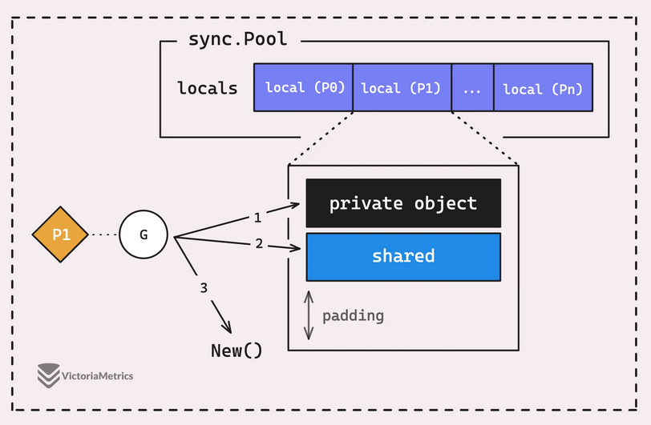

Приведённая выше диаграмма не совсем точна, поскольку она не учитывает
**пул жертв (victim pool)**.

Если цепочка общего пула также пуста, sync.Pool либо создаст новый
объект (при условии, что вы предоставили функцию New()), либо просто
вернёт nil.

```go
type Pool struct {
    noCopy noCopy
    local     unsafe.Pointer
    localSize uintptr
    victim     unsafe.Pointer
    victimSize uintptr
    New        func() any
}
```

Это поле **pad** предназначено для предотвращения проблемы, которая
может возникнуть на современных многоядерных процессорах, — **ложного
разделения памяти**.

Современные процессоры используют компонент, называемый кэшем ЦП, для
ускорения доступа к памяти. Этот кэш разделен на блоки, называемые
**кэш-линиями**, которые обычно содержат либо 64, либо 128 байт данных.
Когда процессору нужно обратиться к памяти, он не просто захватывает
один байт или слово — он загружает всю кэш-линию целиком.

Это означает, что если два фрагмента данных находятся близко друг к
другу в памяти, они могут оказаться на одной и той же кэш-линии, даже
если они логически разделены.

В контексте Go, в классе sync.Pool, каждый логический процессор (P)
имеет свой собственный **poolLocal**, который хранится в массиве. Если
структура poolLocal меньше размера кэш-линии, несколько экземпляров
poolLocal от разных P могут оказаться на одной и той же кэш-линии.
Именно здесь могут возникнуть проблемы. Если два P, работающие на разных
ядрах ЦП, пытаются одновременно получить доступ к своим собственным
poolLocal, они могут непреднамеренно мешать друг другу.

Даже несмотря на то, что каждый P работает только со своим собственным
poolLocal, эти структуры могут использовать одну и ту же кэш-линию.

Когда один процессор изменяет что-либо в кэш-линии, вся кэш-линия
становится недействительной (invalid) в кэшах других процессоров, даже
если они работают с разными переменными в пределах одной и той же линии.
Это может привести к серьезному снижению производительности из-за
ненужных аннулирований кэша и дополнительного трафика памяти.

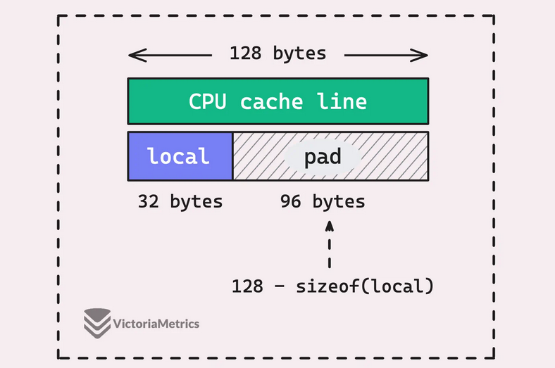

Вот тут-то и пригодится 128 - unsafe.Sizeof(poolLocalInternal{})%128.
Она вычисляет количество байтов, необходимых для заполнения пула
P-local, чтобы его общий размер был кратен 128 байтам. Это заполнение
помогает каждому poolLocal получить свою собственную кэш-линию,
предотвращая ложное разделение и обеспечивая более быструю работу без
конфликтов.

### Цепочка пулов (Pool Chain) и снятие пула с очереди (Pool Dequeue)

Цепочка общего (shared) пула в sync.Pool представлена ​​типом с именем
**poolChain**.

Из названия можно предположить, что это двусвязный список (dequeue), и
вы будете правы. Но вот в чем загвоздка: каждый узел в этом списке —
это не просто многократно используемый объект. Вместо этого это другая
структура, называемая **очередью пула** (**poolDequeue**).

```go
type poolChain struct {
    head *poolChainElt
    tail atomic.Pointer[poolChainElt]
}

type poolChainElt struct {
    poolDequeue
    next, prev *poolChainElt
}
```

Конструкция PoolChain довольно стратегически продумана, об этом
свидетельствует приведенная ниже диаграмма:

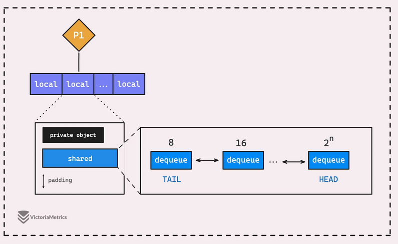

Когда текущая очередь пула (pool dequeue) (тот, что находится в начале
списка) заполняется, создаётся новый пул, размер которого вдвое больше
предыдущего. Этот новый, больший пул затем добавляется в цепочку.

Если вы посмотрите на структуру poolChain, вы заметите, что у неё есть
два поля: **указатель head \*poolChainElt** и **атомарный указатель tail
atomic.Pointer\[poolChainElt]**.

Эти поля показывают, как работает механизм:

* Производитель (P, которому принадлежит текущий локальный пул) добавляет новые элементы только в самый последний пул, который мы называем головным. Поскольку только производитель обращается к головному пулу, нет необходимости в блокировках или каких-либо сложных синхронизационных уловках, поэтому это очень быстро.
* Потребители (другие P) берут элементы из пула в хвосте списка. Поскольку несколько потребителей могут пытаться извлечь элементы одновременно, доступ к хвосту синхронизируется с помощью атомарных операций для поддержания порядка.

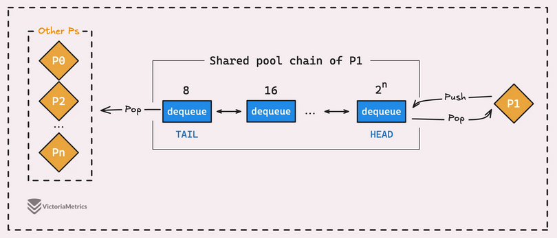

Но вот ключевой момент:

* Когда очередь в хвосте полностью опустошается, она удаляется из списка, и следующая очередь в очереди становится новой хвостовой. Но ситуация в голове немного другая.
* Когда в очереди в голове заканчиваются предметы, она не удаляется. Вместо этого она остается на месте, готовая к пополнению при добавлении новых предметов.

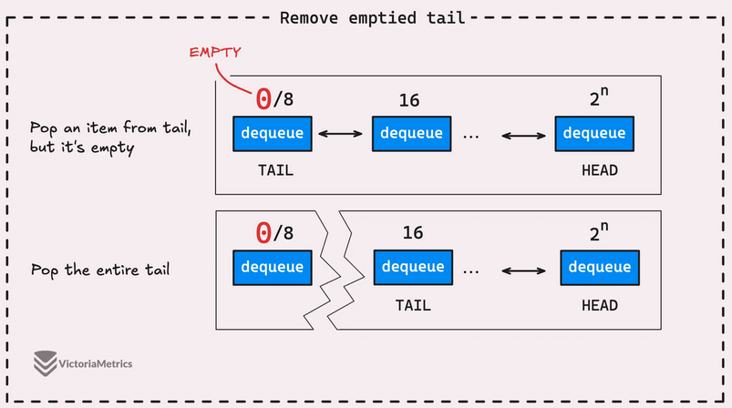

Теперь давайте рассмотрим, как определяется очередь (dequeue) в пуле.
Как следует из названия, это очередь с двумя концами.

В отличие от обычной очереди, где можно добавлять элементы только в
конец и удалять их из начала, очередь с двумя концами позволяет
вставлять и удалять элементы как в начале, так и в конце.

Ее механизм на самом деле очень похож на цепочку пула. Она разработана
таким образом, что один производитель может добавлять или удалять
элементы из начала очереди, в то время как несколько потребителей могут
брать элементы из конца.

```go
type poolDequeue struct {
    headTail atomic.Uint64
    vals []eface
}
```

Производитель (который в данный момент является P) может добавлять новые
элементы в начало очереди или брать элементы из неё.

В то же время потребители берут элементы только из конца очереди. Эта
очередь не использует блокировки, то есть для управления координацией
между производителем и потребителями не используются блокировки, а
только атомарные операции.

Эту очередь можно представить как своего рода кольцевой буфер.

**Кольцевой буфер** — это структура данных, которая использует массив
фиксированного размера для хранения элементов в циклическом порядке. Он
называется «кольцом», потому что, в некотором смысле, конец буфера
замыкается, чтобы встретиться с началом, что делает его похожим на круг.

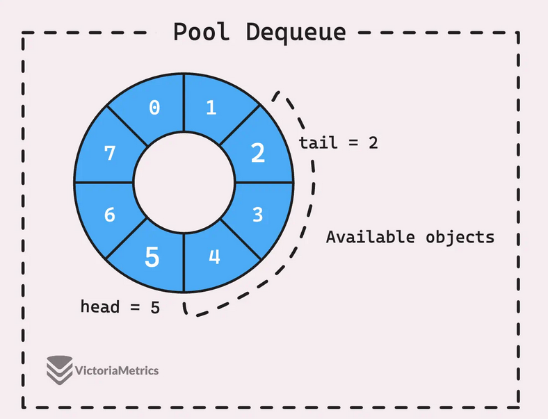

В контексте операции извлечения данных из пула, о которой мы говорим,
поле **headTail** представляет собой 64-битное целое число, которое
объединяет два 32-битных индекса в одно значение.

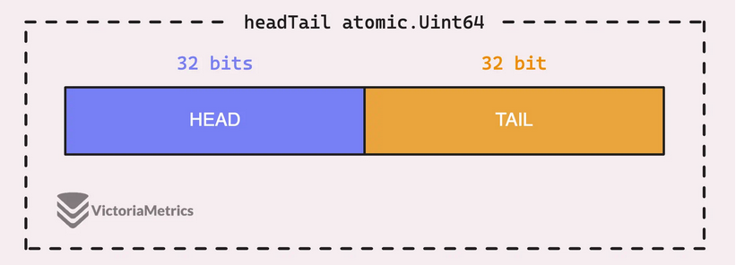

Эти индексы представляют собой начало и конец очереди и помогают
отслеживать, где данные хранятся и к каким элементам обращаются в
буфере.

Индекс конца очереди указывает на местоположение самого старого элемента
в буфере, и когда потребители (как и другие горутины) считывают данные
из буфера, они начинают отсюда и двигаются дальше.

Индекс начала очереди указывает, куда будет записан следующий фрагмент
данных. По мере поступления новых данных они помещаются в этот индекс
начала очереди, а затем индекс перемещается к следующему доступному
слоту.

Упаковав индексы начала и конца очереди в одно 64-битное значение, код
может обновлять оба индекса за один раз, делая операцию атомарной.

Это особенно полезно, когда два потребителя (или потребитель и
производитель) пытаются одновременно извлечь элемент из очереди.
Операция CompareAndSwap (CAS), **d.headTail.CompareAndSwap(ptrs,
ptrs2)**, гарантирует, что только один из них выполнит операцию успешно.
Второй вариант завершается неудачей и повторяется, поддерживая порядок
без сложных блокировок.

Фактические данные в очереди хранятся в кольцевом буфере, называемом
**vals**, размер которого должен быть степенью двойки.

Такое проектное решение упрощает обработку переполнения очереди при
достижении ею конца буфера. Каждый слот в этом буфере представляет собой
значение **eface**, так Go представляет пустой интерфейс (interface{})
внутри себя.

```go
type poolDequeue struct {
    headTail atomic.Uint64
    vals     []eface
}

type eface struct {
    typ, val unsafe.Pointer
}
```

Слот в буфере остается «используемым» до тех пор, пока не произойдут два
события:

* Индекс хвоста переместится за пределы слота, что означает, что данные в этом слоте были использованы одним из потребителей.
* Потребитель, обратившийся к этому слоту, устанавливает его в nil, сигнализируя, что производитель теперь может использовать этот слот для хранения новых данных.

Вкратце, цепочка пулов объединяет связанный список и кольцевой буфер для
каждого узла. Когда один из буферов заполняется, создается новый,
больший буфер, который связывается с началом цепочки. Такая структура
помогает эффективно управлять большим объемом объектов.

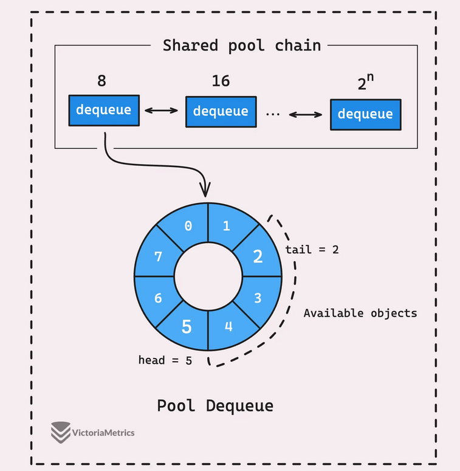

#### sync.Pool.Put():

Когда горутина вызывает метод **Put()** для sync.Pool, первое, что она
пытается сделать, это сохранить объект в приватном слоте локального пула
для текущего P. Если этот приватный слот уже занят, объект помещается в
начало цепочки пулов, то есть в разделяемую часть.

```go
func (p *Pool) Put(x any) {
    if x == nil {
        return
    }
    l, _ := p.pin()
    if l.private == nil {
        l.private = x
    } else {
        l.shared.pushHead(x)
    }
    runtime_procUnpin()
}
```

Начиная с Go 1.14, Go ввёл вытесняющее планирование, что означает, что
среда выполнения может приостановить горутину, если она слишком долго
работает на процессоре P, обычно около 10 мс, чтобы дать другим
горутинам возможность выполниться.

Это, как правило, хорошо для обеспечения справедливости и отзывчивости,
но может вызвать проблемы при работе с sync.Pool.

Операции, такие как Put() и Get() в sync.Pool, предполагают, что
горутина остаётся на одном и том же процессоре (например, P1) на
протяжении всей операции. Если горутина прерывается в середине этих
операций, а затем возобновляется на другом процессоре (P2), локальные
данные, с которыми она работала, могут оказаться полученными с
неправильного процессора.

```go
func (p *Pool) pin() (*poolLocal, int) {
    pid := runtime_procPin()
    // ...
}
```

По сути, функция **pin()** временно отключает возможность планировщика
прерывать выполнение горутины, пока она помещает объект в пул.

Хотя в описании говорится «привязывает текущую горутину к P», на самом
деле происходит следующее: текущий поток (M) блокируется процессором
(P), что предотвращает его прерывание. В результате горутина,
выполняющаяся в этом потоке, также не будет прерываться.

В качестве побочного эффекта функция pin() также обновляет количество
процессоров (P), если вы изменяете GOMAXPROCS(n) (который управляет
количеством процессоров) во время выполнения.

```go
func (c *poolChain) pushHead(val any) {
    d := c.head
    if d == nil {
        // Initialize chain with buffer size 8
        const initSize = 8
        d = new(poolChainElt)
        d.vals = make([]eface, initSize)
        c.head = d
        c.tail.Store(d)
    } else if d.pushHead(val) {
        return
    }
    // Buffer full: create new node with double size
    d2 := new(poolChainElt)
    d2.vals = make([]eface, len(d.vals)*2)
    d2.prev = d
    d.next = d2
    c.head = d2
    d2.pushHead(val)
}
```

А как насчет цепочки общих пулов? Когда вам нужно добавить элемент в
цепочку, операция сначала проверяет начало цепочки. Помните указатель
**\*poolChainElt** на начало? Это самый последний элемент пула в списке,
который был извлечен из очереди.

В зависимости от ситуации может произойти следующее:

* Если буфер начала цепочки равен nil, то есть в цепочке еще нет элементов пула, создается новый элемент пула с начальным размером буфера 8. Затем элемент помещается в этот новый элемент пула.
* Если буфер начала цепочки не равен nil и не заполнен, элемент просто добавляется в буфер в позиции начала.
* Если буфер начала цепочки не равен nil, но заполнен, то есть индекс начала переполнился и совпал с индексом конца, то создается новый элемент пула. Размер буфера этого нового пула вдвое больше размера текущего начала. Элемент помещается в новый пул, извлекается из очереди, и заголовок цепочки пулов обновляется, указывая на этот новый пул.

#### sync.Pool.Get()

На первый взгляд, функция **Get()** кажется очень похожей на Put(). Она
начинает с привязки текущей горутины к её пулу P, чтобы предотвратить
вытеснение, затем проверяет и извлекает приватный объект из своего
локального пула P без необходимости синхронизации. Если приватного
объекта там нет, она проверяет цепочку общего пула и удаляет начало
цепочки.

Только горутина, работающая в текущем локальном пуле P, может получить
доступ к началу цепочки, поэтому мы используем **popHead()**:

```go
func (p *Pool) Get() any {
    l, pid := p.pin()
    x := l.private
    l.private = nil
    if x == nil {
        x, _ = l.shared.popHead()
        if x == nil {
            x = p.getSlow(pid)
        }
    }
    runtime_procUnpin()
    if x == nil && p.New != nil {
        x = p.New()
    }
    return x
}
```

В отличие от p.pin() для Put(), здесь мы также получаем pid, то есть
идентификатор процессора (P), на котором выполняется текущая горутина.
Он необходим для **процесса кражи (stealing)**, который вступает в
действие, если **быстрый путь** не срабатывает.

**Быстрый путь** — это когда объект доступен в кэше текущего
процессора (P). Но если это не срабатывает, то есть закрытый объект и
начало общей цепочки пусты, вступает в действие **медленный путь
(getSlow)**.

На медленном пути мы пытаемся забрать объекты из пулов кэша других
процессоров (P).

Идея кражи заключается в повторном использовании объектов, которые могут
простаивать в кэшах других процессоров, вместо создания новых объектов с
нуля. Если у другого процессора (P) есть лишние объекты в его пуле кэша,
текущий процессор (P) может забрать эти объекты и использовать их.

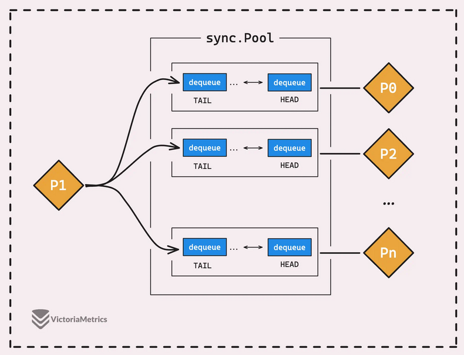

Процесс кражи, по сути, проходит по всем P, кроме текущего (pid), и
пытается захватить объект из цепочки общих пулов каждого P:

```go
func (p *Pool) getSlow(pid int) any {
    size := runtime_LoadAcquintptr(&p.localSize)
    locals := p.local
    // Try to steal from other P's
    for i := 0; i < int(size); i++ {
        l := indexLocal(locals, (pid+i+1)%int(size))
        if x, _ := l.shared.popTail(); x != nil {
            return x
        }
    }
    // Try victim cache
    size = atomic.LoadUintptr(&p.victimSize)
    if size > 0 {
        // ...
    }
    return nil
}
```

Как мы уже говорили ранее, в poolChain поставщик (текущий P) добавляет и
удаляет элементы из начала списка, в то время как несколько потребителей
(другие P) удаляют элементы из конца списка.

Таким образом, **popTail** проверяет последний элемент пула в очереди
(dequeue) и пытается получить данные из конца этой очереди.

* Если данные найдены, кража считается успешной, и данные возвращаются.
* Если данных в этой очереди пула не найдено, индекс конца увеличивается, и эта очередь пула удаляется из цепочки.

Этот процесс продолжается до тех пор, пока либо не будет успешно
получено какое-либо количество данных, либо не закончатся варианты во
всех цепочках пулов.

Если после всех попыток кражи данные по-прежнему не найдены, функция
пытается получить данные от так называемой **«жертвы»**.

```go
// Try victim
if x, _ := victim.shared.popTail(); x != nil {
    return x
}
```

Мы пытаемся получить объект всеми возможными способами, и если ничего не
находится, в конечном итоге создаётся новый объект с помощью метода
New(). Но если New() равен nil, то он просто возвращает nil.

Теперь, после попытки доступа к пулу жертв, он атомарно помечается как
пустой (хотя одновременные обращения всё ещё могут извлекать из него
данные). Последующие операции Get() будут пропускать проверку кэша
жертв, пока он снова не заполнится.

#### Пул жертва (victim pool)

Несмотря на то, что sync.Pool создан для более эффективного управления
ресурсами, он не предоставляет разработчикам прямых инструментов для
очистки или управления жизненным циклом объектов. Вместо этого sync.Pool
выполняет очистку в фоновом режиме, чтобы избежать неконтролируемого
роста, который может привести к утечкам памяти. Основной способ этой
очистки — сборщик мусора Go (GC).

У функции pin() есть ещё один побочный эффект. Каждый раз, когда
sync.Pool вызывает pin() в первый раз (или после того, как количество P
изменилось с помощью GOMAXPROCS), он добавляется в глобальный срез под
названием **allPools** в пакете sync:

```go
var allPools []*Pool

func (p *Pool) pin() (*poolLocal, int) {
    // ...
    if p.local == nil {
        allPools = append(allPools, p)
    }
    // ...
}
```

Этот срез allPools \[]\*Pool отслеживает все активные экземпляры
sync.Pool в вашем приложении.

Перед началом каждого цикла сборки мусора (GC) среда выполнения Go
запускает процесс очистки, который очищает срез allPools. Вот как это
работает:

1. Перед запуском GC вызывается метод **clearPool**, который переносит все объекты в sync.Pool, включая приватные объекты и цепочки общих пулов, в так называемую область жертвы.
2. Эти объекты не удаляются сразу, они пока хранятся в этой области жертвы.
3. Тем временем объекты, которые уже находились в области жертвы с предыдущего цикла GC, полностью удаляются во время текущего цикла GC.

```go
func poolcleanup() {
    // Drop victim caches from all pools.
    for _, p := range oldPools {
    p.victim = nil
    p.victimSize = 0
    }

    // Move primary cache to victim cache.
    for _, p := range allPools {
    p.victim = p.local
    p.victimSize = p.localSize
    p.local = nil
    p.localSize = 0
    }

    // The pools with non-empty primary caches now have non-empty
    // victim caches and no pools have primary caches.
    oldPools, allPools = allPools, nil
}
```

Причина использования **механизма жертвы** в sync.Pool заключается в
предотвращении внезапного и полного опустошения пула сразу после цикла
сборщика мусора. Если бы пул был опустошен сразу, это могло бы привести
к проблемам с производительностью, поскольку любые новые запросы к
объектам потребовали бы их создания с нуля. Поэтому мы сначала
перемещаем объекты в область жертвы, sync.Pool обеспечивает буферный
период, в течение которого объекты могут быть повторно использованы,
прежде чем они будут полностью удалены.

В итоге, для полного удаления объекта из sync.Pool требуется как минимум
2 цикла сборщика мусора.

Это может стать проблемой для программ с низким значением GOGC, которое
контролирует частоту запуска сборщика мусора для очистки неиспользуемых
объектов. Если GOGC установлен слишком низко, процесс очистки может
удалять неиспользуемые объекты слишком быстро, что приведет к большему
количеству промахов кэша.

В заключение: даже при использовании sync.Pool, если вы имеете дело с
чрезвычайно высокой параллельностью и медленной сборкой мусора, вы
можете столкнуться с дополнительными накладными расходами. В этом случае
хорошим решением может стать ограничение скорости использования
sync.Pool.

> **Зачем это Go-разработчику.** `sync.Pool` — мощный инструмент оптимизации выделения памяти в высоконагруженных сервисах. Эффективен когда объекты дороги в создании и часто переиспользуются. Помните: пул может быть очищен сборщиком мусора в любой момент. Не храните в пуле объекты, требующие явного освобождения (например, file handles). Сбрасывайте состояние объекта перед возвратом в пул. Всегда передавайте в `Put` указатель, чтобы избежать лишних аллокаций при упаковке в `interface{}`.

***

## 6. sync.Cond

**sync.Cond** — это синхронизационная примитивная структура из пакета
sync, предназначенная для реализации условной синхронизации между
горутинами. Она позволяет одной или нескольким горутинам ожидать
наступления события и уведомлять другие горутины, когда это событие
произошло.

**Cond** — реализует **переменную условия (condition variable)**,
точку встречи для горутин, ожидающих или объявляющих о наступлении
события.

Когда одна горутина ожидает, пока что-то произойдет (ожидает, пока
определенное условие станет истинным), она может вызвать Wait(). Другая
горутина, как только узнает, что условие может быть выполнено, может
вызвать Signal() или Broadcast(), чтобы разбудить ожидающую горутину.

```go
func NewCond(l Locker) *Cond

func (c *Cond) Wait()
func (c *Cond) Signal()
func (c *Cond) Broadcast()
```

```go
type Cond struct {
    noCopy noCopy
    L      Locker
    notify notifyList
    checker copyChecker
}
```

В Go для синхронизации горутин можно использовать sync.Cond. Проблема
использования сигналов в том, что между отправкой сигнала и пробуждением
ожидающей горутины может пройти время, за которое общее состояние
изменится, поэтому ожидание всегда должно быть организовано в цикле с
повторной проверкой условия — горутина блокирует мьютекс, в цикле
проверяет нужное состояние, и если условие еще не выполнено, вызывает
Wait, который атомарно отпускает блокировку и переводит горутину в сон,
а при пробуждении снова захватывает блокировку перед продолжением
работы.

Хотя для подобных задач часто предпочитают каналы, у них есть
ограничения: канал может либо отправлять сигнал одному получателю через
значение, либо оповещать всех через закрытие, но нельзя гибко
комбинировать эти подходы, а закрытый канал нельзя переиспользовать.
Кроме того, каналы сами по себе не защищают общие данные, требуя
отдельного мьютекса.

sync.Cond дает более тонкое управление: Signal будит одного ожидающего,
Broadcast — всех, и вызывать их можно многократно. Встроенная
блокировка в Cond упрощает код, избавляя от необходимости вручную
управлять мьютексом до и после Wait, что снижает риск ошибок. Хотя
технически условие могло бы существовать без встроенной блокировки,
именно такой дизайн делает паттерн с проверкой состояния в цикле более
чистым и безопасным.

### Пример использования

```go
func main() {
    cond := sync.NewCond(&sync.Mutex{})
    found := ""

    // Consumer
    go func() {
        cond.L.Lock()
        defer cond.L.Unlock()
        for found != "Pikachu" {
            cond.Wait()
        }
        fmt.Println("Caught:", found)
    }()

    // Producer
    pokemons := []string{"Pikachu", "Bulbasaur", "Charmander"}
    for _, p := range pokemons {
        cond.L.Lock()
        found = p
        cond.L.Unlock()
        cond.Signal()
        time.Sleep(100 * time.Millisecond)
    }
}
```

В этом примере одна горутина ждет появления Пикачу, а другая
(производитель) случайным образом выбирает покемона из списка и подает
сигнал потребителю, когда появляется новый.

Когда производитель отправляет сигнал, потребитель просыпается и
проверяет, появился ли нужный покемон. Если да, мы ловим покемона, если
нет, потребитель снова засыпает и ждет следующего.

### Принцип работы

#### cond.Wait()

Когда мы вызываем **Wait()** для sync.Cond, мы указываем текущей
горутине оставаться в режиме ожидания, пока не будет выполнено
определенное условие.

Вот что происходит за кулисами:

1. Горутина добавляется в список других горутин, которые также ожидают выполнения этого же условия. Все эти горутины блокируются, то есть они не могут продолжить работу, пока их не «разбудят» вызовом Signal() или Broadcast().
2. Ключевой момент здесь заключается в том, что мьютекс должен быть заблокирован перед вызовом Wait(), потому что Wait() делает важную вещь: он автоматически освобождает блокировку (вызывает Unlock()) перед тем, как перевести горутину в спящий режим. Это позволяет другим горутинам захватить блокировку и выполнять свою работу, пока исходная горутина ожидает.
3. Когда ожидающая горутина пробуждается (с помощью Signal() или Broadcast()), она не сразу возобновляет работу. Сначала ей нужно снова получить блокировку (Lock()).

```go
func (c *Cond) Wait() {
    c.checker.check()
    t := runtime_notifyListAdd(&c.notify)
    c.L.Unlock()
    runtime_notifyListWait(&c.notify, t)
    c.L.Lock()
}
```

```go
func (c *Cond) Wait() {
    // Check if Cond has been copied
    c.checker.check()

    // Get the ticket number
    t := runtime_notifyListAdd(&c.notify)

    // Unlock the mutex
    c.L.Unlock()

    // Suspend the goroutine until being woken up
    runtime_notifyListWait(&c.notify, t)

    // Re-Lock the mutex
    c.L.Lock()
}
```

Несмотря на простоту, можно выделить 4 основных момента:

1. Существует проверка, предотвращающая копирование экземпляра Cond; в противном случае это вызовет панику.
2. Вызов cond.Wait() немедленно разблокирует мьютекс, поэтому мьютекс должен быть заблокирован перед вызовом cond.Wait(), иначе произойдет паника.
3. После пробуждения cond.Wait() снова блокирует мьютекс, а это значит, что его нужно будет разблокировать снова после завершения работы с общими данными.
4. Большая часть функциональности sync.Cond реализована в среде выполнения Go с помощью внутренней структуры данных **notifyList**, которая использует систему уведомлений на основе тикетов.

Из-за такого поведения блокировки/разблокировки при использовании
sync.Cond.Wait() следует придерживаться определенной последовательности
действий, чтобы избежать распространенных ошибок:

```go
c.L.Lock()
for !condition() {
    c.Wait()
}
// use shared data
c.L.Unlock()
```

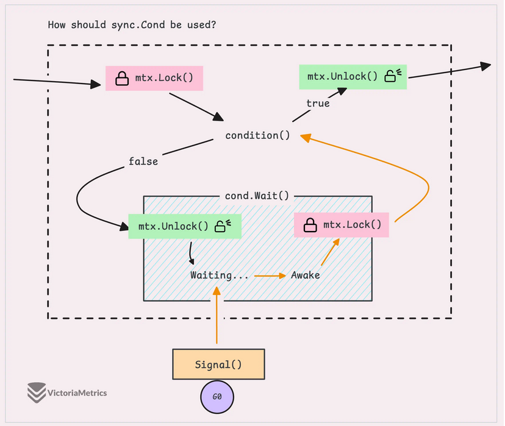

Когда Wait() возвращает управление, нельзя просто предполагать, что
ожидаемое условие уже выполнено. Пока горутина пробуждалась, другие
горутины могли изменить общее состояние, и условие могло снова стать
ложным. Именно поэтому Wait() всегда вызывается внутри цикла — цикл
гарантирует повторную проверку условия, и только когда оно действительно
истинно, горутина продолжает выполнение.

#### Cond.Signal() и Cond.Broadcast()

Метод **Signal()** используется для пробуждения одной горутины, которая
в данный момент ожидает выполнения условия, заданного переменной.

* Если в данный момент нет ожидающих горутин, Signal() ничего не делает, по сути, это ничего не меняет.
* Если же горутины ожидают, Signal() пробуждает первую из них в очереди. Таким образом, если вы запустили множество горутин, например, от 0 до n, то нулевая горутина будет первой, которую разбудит вызов Signal().

Пример:

```go
var cond = sync.NewCond(&sync.Mutex{})
var done bool

func worker(id int) {
    cond.L.Lock()
    for !done {
        cond.Wait()
    }
    fmt.Println("worker", id, "woke up")
    cond.L.Unlock()
}

func main() {
    for i := 0; i < 5; i++ {
        go worker(i)
    }
    time.Sleep(time.Second)
    cond.L.Lock()
    done = true
    cond.L.Unlock()
    cond.Signal() // wakes only ONE worker
}
```

Идея заключается в том, что функция Signal() используется для
пробуждения одной горутины и сообщения ей о том, что условие может быть
выполнено. Вот как выглядит реализация Signal():

```go
func (c *Cond) Signal() {
    c.checker.check()
    runtime_notifyListNotifyOne(&c.notify)
}
```

Блокировать мьютекс перед вызовом Signal() необязательно, но обычно это
хорошая идея, особенно если вы изменяете общие данные и к ним
осуществляется одновременный доступ.

А так выглядит реализация **cond.Broadcast()**:

```go
func (c *Cond) Broadcast() {
    c.checker.check()
    runtime_notifyListNotifyAll(&c.notify)
}
```

При вызове функции Broadcast() происходит пробуждение всех ожидающих
горутин и удаление их из очереди. Внутренняя логика здесь по-прежнему
довольно проста и скрыта за функцией **runtime\_notifyListNotifyAll()**.

```go
// Same worker pattern as above but with:
cond.Broadcast() // wakes ALL workers
```

На этот раз все горутины пробуждаются в течение 100 миллисекунд, но нет
определённого порядка их пробуждения.

Когда вызывается Broadcast(), он помечает все ожидающие горутины как
готовые к выполнению, но они не запускаются немедленно, их выбор
осуществляется на основе базового алгоритма планировщика Go, который
может быть несколько непредсказуемым.

### Внутреннее устройство

#### Copy Checker

**Проверка копирования (copyChecker)** в пакете sync предназначена для
обнаружения случаев копирования объекта Cond после его первого
использования. «Первым использованием» может быть любой из открытых
методов, таких как Wait(), Signal() или Broadcast().

Если объект Cond копируется после первого использования, программа
выдаст ошибку: «sync.Cond is copied».

В отличие от поля noCopy в WaitGroup() это просто позволяет избежать
проблемы, не вызывая паники.

На самом деле, **copyChecker** — это просто uintptr, который, по сути,
является целочисленным значением, хранящим адрес в памяти. Вот как это
работает:

* После первого использования sync.Cond, copyChecker сохраняет свой собственный адрес в памяти, указывая на объект cond.copyChecker.
* Если объект копируется, адрес в памяти copyChecker (\&cond.copyChecker) изменяется (поскольку новая копия находится в другом месте в памяти), но uintptr, который хранит copyChecker, не изменяется.

Проверка проста: сравните адреса в памяти. Если они отличаются,
происходит паника.

```go
type copyChecker uintptr

func (c *copyChecker) check() {
    if uintptr(*c) != uintptr(unsafe.Pointer(c)) &&
        !atomic.CompareAndSwapUintptr((*uintptr)(c), 0, uintptr(unsafe.Pointer(c))) &&
        uintptr(*c) != uintptr(unsafe.Pointer(c)) {
        panic("sync.Cond is copied")
    }
}
```

Давайте разберем это на две основные проверки, поскольку первая и
последняя проверки делают практически одно и то же.

Первая проверка, **uintptr(\*c) != uintptr(unsafe.Pointer(c))**,
проверяет, изменился ли адрес в памяти. Если да, то объект скопирован.
Но есть нюанс: если copyChecker используется впервые, значение будет
равно 0, поскольку он еще не инициализирован.

Вторая проверка, **!atomic.CompareAndSwapUintptr((\*uintptr)(c), 0,
uintptr(unsafe.Pointer(c)))**, — это операция сравнения и обмена
(CAS), которая обрабатывает как инициализацию, так и проверку:

Если CAS проходит успешно, это означает, что copyChecker только что
инициализирован, поэтому объект еще не скопирован, и все в порядке.

Если проверка CAS завершается неудачей, это означает, что copyChecker
уже был инициализирован, и нам необходимо выполнить окончательную
проверку (uintptr(\*c) != uintptr(unsafe.Pointer(c))), чтобы убедиться,
что объект не был скопирован.

Окончательная проверка **uintptr(\*c) != uintptr(unsafe.Pointer(c))**
(она аналогична первой проверке) гарантирует, что объект не был
скопирован после всех этих действий.

Причина третьей проверки заключается в том, что первая и вторая проверки
не являются атомарными.

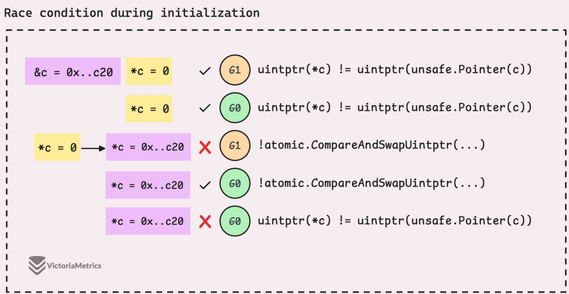

Если copyChecker используется впервые, он еще не инициализирован, и его
значение будет равно нулю. В этом случае проверка пройдет некорректно,
даже если объект не был скопирован, а просто не был инициализирован.

#### **notifyList — Список уведомлений на основе тикетов**

Помимо механизмов блокировки и проверки копирования, важной частью
sync.Cond является **notifyList**.

```go
type notifyList struct {
    wait   uint32
    notify uint32
    head   *sudog
    tail   *sudog
}
```

Теперь, объекты notifyList в пакете sync и в пакете runtime отличаются,
но имеют одинаковое имя и структуру памяти. Чтобы действительно понять,
как это работает, нам нужно посмотреть на версию в пакете runtime:

```go
type notifyList struct {
    wait   uint32
    notify uint32
    lock   mutex
    head   *sudog
    tail   *sudog
}
```

Это связанный список (linked list) sudog (сокращение от
«псевдо-горутина»), которая представляет собой горутину, ожидающую
событий синхронизации, например, ожидающую получения или отправки данных
по каналу или ожидающую изменения переменной условия.

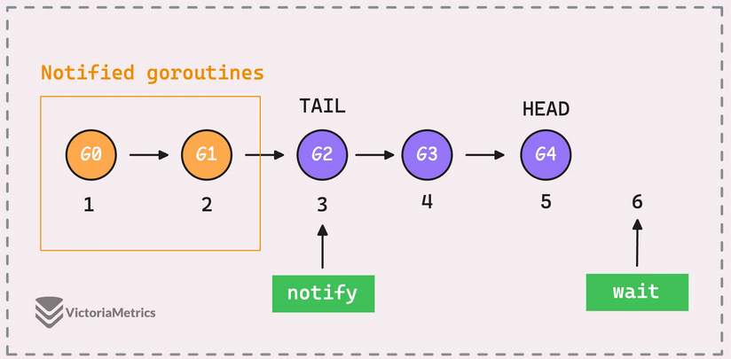

**Head и tail** — это указатели на первую и последнюю горутину в этом
списке. Поля **wait и notify**, в свою очередь, выступают в роли
постоянно увеличивающихся номеров **«тикетов»,** каждый из которых
представляет позицию в очереди ожидающих горутин.

* **wait:** Этот номер представляет следующий тикет, который будет выдан ожидающей горутине.
* **notify:** Этот номер отслеживает следующий тикет, который должен быть уведомлен или активирован.

#### notifyListAdd()

Когда горутина собирается ожидать уведомления, она вызывает
**notifyListAdd()**, чтобы получить свой тикет первой.

```go
func notifyListAdd(l *notifyList) uint32 {
    return atomic.Xadd(&l.wait, 1) - 1
}
```

Назначение тикетов осуществляется с помощью атомарного счетчика. Таким
образом, когда горутина вызывает notifyListAdd(), этот счетчик
увеличивается, и горутина получает следующий доступный номер тикета.

Каждая горутина получает свой уникальный номер тикета, и этот процесс
происходит без блокировки. Это означает, что несколько горутин могут
запрашивать тикеты одновременно, не дожидаясь друг друга.

Поскольку множество горутин могут получить тикет одновременно,
существует небольшой промежуток между моментом вызова notifyListAdd() и
моментом фактического вызова notifyListWait(). Их порядок не
гарантирован, даже если номера билетов выдаются последовательно.

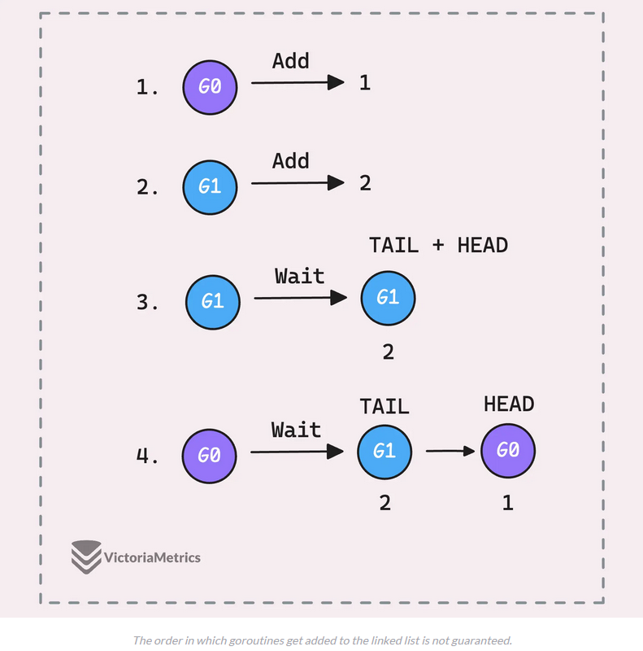

После получения тикета следующим шагом для горутины является «ожидание»
своей очереди на получение уведомления. Это происходит, когда горутина
вызывает notifyListWait(t), где t — номер только что полученного
тикета.

```go
func notifyListWait(l *notifyList, t uint32) {
    if less(t, l.notify) {
        return
    }
    // Add sudog to list and park
    // ...
}
```

Прежде чем что-либо делать, горутина проверяет, было ли уже отправлено
уведомление по ее тикету.

Она сравнивает свой тикет (t) с текущим номером уведомления. Если номер
уведомления уже превысил номер тикета горутины, ей не нужно ждать —
она может сразу перейти к общему ресурсу и приступить к работе.

Оказывается, эта быстрая проверка действительно важна, особенно когда мы
углубляемся в работу Signal() и Broadcast(). Но если тикет горутины еще
не был уведомлен, она добавляет себя в список ожидания, а затем
переходит в спящий режим, или «паркуется», до получения уведомления.

#### notifyListNotifyOne()

Когда приходит время уведомить ожидающие горутины, система начинает с
наименьшего номера тикета, который еще не был уведомлен; это
отслеживается с помощью **l.notify**.

```go
func notifyListNotifyOne(l *notifyList) {
    if atomic.Load(&l.wait) == atomic.Load(&l.notify) {
        return
    }
    // Increment notify and scan for matching ticket
    atomic.Store(&l.notify, atomic.Load(&l.notify)+1)
    // Find sudog with matching ticket and ready it
    // ...
}
```

Порядок тикетов не гарантирован, поэтому, когда система готова запустить
горутину, она проходит по связанному списку, ища горутину, содержащую
следующий тикет в очереди (первый). Как только она его находит, она
удаляет горутину из списка и помечает ее как готовую к выполнению.

Но иногда возникает проблема с синхронизацией. Допустим, горутина
получила билет, но к моменту выполнения этой функции она ещё не
добавлена ​​в список ожидающих горутин. Например, последовательность может
выглядеть так: notifyListAdd() -> notifyListNotifyOne() ->
notifyListWait().

В этом случае функция сканирует список, но не находит горутину с
соответствующим билетом. Однако не беспокойтесь, функция
notifyListWait() позаботится об этой ситуации, когда горутина в конечном
итоге вызовет её.

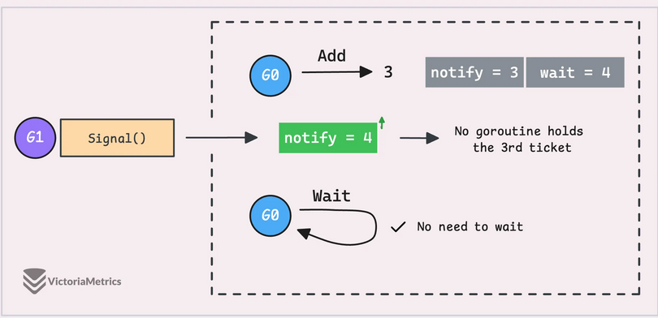

Проверка в функции notifyListWait(): **if less(t, l.notify) { ... }**
важна, потому что она позволяет горутине, хранящей тикет с номером
меньше текущего значения l.notify, понять: «Эй, моя очередь уже прошла,
я могу идти». В этом случае горутина пропускает ожидание и немедленно
переходит к доступу к общему ресурсу.

Таким образом, даже если горутина еще не вошла в связанный список, она
все равно может получить уведомление о наличии у нее действительного
тикета. Именно это делает дизайн таким плавным: каждая горутина может
сразу же получить свой тикет, не дожидаясь других или добавления своей
очереди в список. Это обеспечивает бесперебойную работу без лишних
блокировок.

#### notifyListNotifyAll()

Теперь поговорим о последней части, **функции Broadcast() или
notifyListNotifyAll()**. Она намного проще по сравнению с
notifyListNotifyOne():

```go
func notifyListNotifyAll(l *notifyList) {
    s := l.head
    l.head = nil
    l.tail = nil
    atomic.Store(&l.notify, atomic.Load(&l.wait))
    // Ready all sudogs in the list
    for s != nil {
        next := s.next
        s.next = nil
        readyWithTime(s, 0)
        s = next
    }
}
```

По сути, метод Broadcast() проходит по всему списку ожидающих горутин,
помечает их все как готовые и очищает список.

> **Зачем это Go-разработчику.** `sync.Cond` — наименее используемый примитив синхронизации в Go. В большинстве случаев каналы или `sync.Once` справляются лучше. Cond оправдан когда нужна множественная сигнализация (Signal/Broadcast) одному или нескольким ожидающим, и при этом условие ожидания сложнее чем просто «данные готовы». Wait ВСЕГДА должен быть в цикле с повторной проверкой условия. Не забывайте блокировать мьютекс перед Wait.

***

## 7. sync.Map

Обычная map-а Go небезопасна для параллельного использования при
одновременном чтении и записи.

Для обеспечения потокобезопасности обычные map-ы часто используются в
сочетании с sync.Mutex или sync.RWMutex.

**sync.Map** — это не универсальная замена для всех сценариев
параллельной работы с map-ами. В большинстве случаев предпочтительнее
использовать обычную map-у Go с блокировкой.

**Когда использовать sync.Map:**

Тип sync.Map оптимизирован для двух распространенных случаев
использования:

1. Когда запись для заданного ключа записывается только один раз, но читается многократно. Типичный пример — кеш, где записи добавляются, но никогда не удаляются и не изменяются.
2. Разные горутины работают с разными, непересекающимися наборам ключей. Например, Горутина A работает только с ключами, начинающимися на "A", а Горутина B — с ключами, начинающимися на "B".

В этих двух случаях использование sync.Map позволяет значительно снизить
**конфликты блокировок (lock contention)** по сравнению с обычным map +
sync.Mutex или sync.RWMutex, что приводит к лучшей общей
производительности в условиях высокой конкуренции.

**Когда стоит избегать sync.Map:**

* Если в сервисе больше операций записи, чем чтения.
* Если требуются более сложные операции, которые sync.Map плохо поддерживает.
* В таких случаях sync.Map может привести к снижению производительности (как по памяти, так и по CPU), поскольку внутренне она использует две map-ы.

**Недостаток sync.Map:**

* Потеря типобезопасности: sync.Map хранит ключи и значения как nterface{}, в отличие от обычных мап, где выше типобезопасность.

### Что такое sync.Map

Когда несколько горутин записывают или читают, sync.Map берет на себя
все блокирующие (или атомарные) операции, без необходимости ручной
блокировки и гонки данных. Вдобавок, операции чтения, записи и удаления
работают быстрее, чем в обычной map с мьютексом.

Запись в sync.Map всегда синхронизируется перед последующим чтением. Это
гарантирует, что читатели не увидят старое значение.

Все методы sync.Map являются атомарными (т.е. потокобезопасными).

**Основные операции:**

* **Load(key):** Извлечение значения по ключу.
* **Store(key, value):** Сохранение пары ключ-значение.
* **Delete(key):** Удаление пары по ключу.
* **Clear() (Go 1.23+):** Удаляет все элементы из мапы.
* **Swap(key, value) (Go 1.20+)**: Заменяет старое значение и возвращает его.

**Условные операции:**

* **LoadOrStore(key, value):** Возвращает существующее значение, если ключ есть; иначе сохраняет новое. Удобно для операций "get or create".
* **LoadAndDelete(key):** Извлекает значение по ключу, а затем удаляет его.
* **CompareAndDelete(key, old) (Go 1.20+):** Удаляет ключ, только если его текущее значение совпадает с old.
* **CompareAndSwap(key, old, new) (Go 1.20+):** Обновляет значение, только если текущее значение совпадает с old.

**Итерация (Range):**

* **Range(f func(key, value any) bool):** Метод для итерации по мапе.
* Он решает проблему фатальной ошибки при итерации (fatal error: concurrent map iteration and map write) по обычной мапе, в которую одновременно идет запись.
* Range не блокирует мапу на все время итерации. Это позволяет другим горутинам одновременно добавлять, обновлять или удалять записи.
* Компромисс: Из-за отсутствия полной блокировки, итерация может не предоставить абсолютно согласованный ("идеальный") снимок мапы на момент начала обхода.
* Итерация останавливается, если функция f возвращает false.

### Как устроен sync.Map

sync.Map использует две отдельные **нативные мапы (native map)**:
read-мапа и грязная мапа.

```go
type Map struct {
    mu Mutex
    read atomic.Pointer[readOnly]
    dirty map[any]*entry
    misses int
}
```

**read-мапа&#x20;**— это место, где происходит быстрый поиск без блокировок.

Она построена на основе атомарного указателя (atomic.Pointer), который
позволяет нескольким горутинам обращаться к ней без необходимости
блокировать что-либо. Это делает её идеальной для сценариев, где данные
в основном читаются и не часто изменяются. Но вот в чём загвоздка:
read-мапа может не всегда содержать самые актуальные данные, особенно
когда новые данные только что добавлены.

Вот тут-то и пригодится **«грязная мапа» (dirty map)**. Грязная мапа
хранит все новые записи, которые добавляются, пока read-мапа всё ещё
используется для поиска. Когда вам нужно прочитать или изменить данные,
которые находятся только в грязной мапе, требуется использовать мьютекс
для предотвращения состояний гонки, как видно из структуры sync.Map,
грязная мапа — это обычная мапа Go без какой-либо встроенной защиты от
параллельного доступа.

```go
type Map struct {
    mu     Mutex
    read   atomic.Pointer[readOnly]
    dirty  map[any]*entry
    misses int
}

type readOnly struct {
    m       map[any]*entry
    amended bool
}
```

Read-мапа имеет дополнительную функцию: **флаг (amended)**, который
сообщает, если она устарела. Если флаг установлен в значение true, это
означает, что в грязной мапе есть как минимум одна пара ключ-значение,
которой еще нет в read-мапе.

```go
type readOnly struct {
    m    map[any]*entry
    amended bool // true if the dirty map contains some key not in m.
}
```

sync.Map стремится обеспечить высокую скорость и отсутствие блокировок в
read-мапе, в то время как грязная мапа обрабатывает новые данные,
переключаясь на блокировки мьютексов в более медленных случаях.

Грязная мапа содержит все данные из read-мапы, а также любые новые
записи, которые еще не были переведены в read-мапу. Однако это не
означает, что вам нужно обновлять обе мапы отдельно при изменении
значения в read-мапе или в грязной мапе.

Это потому, что Go не хранит тип значения непосредственно в мапе. Вместо
этого Go использует указатель на структуру **entry** для хранения
значения, которая выглядит следующим образом:

```go
type entry struct {
    p atomic.Pointer[any]
}
```

Эта структура entry содержит указатель (p) на фактические данные.

Таким образом, при обновлении значения вам нужно всего лишь обновить
этот указатель. Поскольку и read-мапа, и грязная мапа указывают на одну
и ту же entry, они обе автоматически увидят обновленное значение.

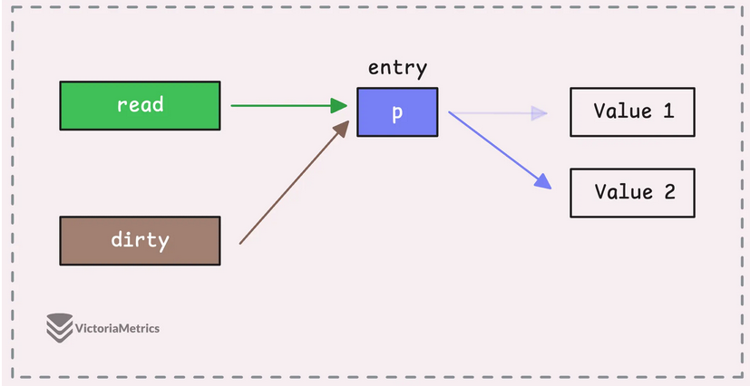

Поведение указателя в структуре entry определяет состояние записи в
карте, и существует 3 возможных состояния:

* **Normal state:** это состояние, когда запись действительна. Указатель p указывает на реальное значение, и запись существует в этих мапах, то есть она активно используется и может быть прочитана без каких-либо проблем.
* **Deleted state:** когда запись удаляется из sync.Map, она не удаляется немедленно из read-мап. Вместо этого указатель p просто устанавливается в nil, сигнализируя о том, что запись была удалена, но все еще существует в мапах.
* **Expunged state:** это особое состояние, когда ключ полностьюудален. Запись помечается специальным сигнальным значением, указывающим на то, что она была полностью удалена.

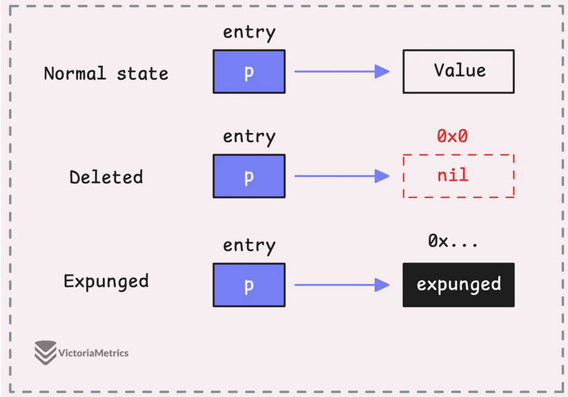

```go
var expunged = new(any) // sentinel value

// Normal:   p points to actual value
// Deleted:  p is nil
// Expunged: p points to expunged sentinel
```

Чтобы разобраться в различиях между этими состояниями, рассмотрим их
свойства:

1. **Normal state:** Это активное состояние. И read-мапа, и грязная мапа содержат одни и те же активные записи, хотя грязная мапа может содержать больше активных записей, чем read-мапа. Когда активная запись удаляется, она переходит в состояние deleted.
2. **Deleted state:** Запись в состоянии deleted используется как read-мапа, так и грязной мапой. Внутри системы существует механизм, который в конечном итоге перемещает все удаленные записи в состояние expunged .
3. **Expunged state:** Как только запись достигает состояния expunged, она существует только в read-мапе, а не в грязной мапе. Когда грязная мапа заменяет read-мапу (т.е., чтение = удаление), эти удаленные записи полностью удаляются.
4. **Восстановление (Revival):** Как deleted, так и expunged записи могут быть восстановлены, если тот же ключ будет добавлен снова. Это означает, что они возвращаются в нормальное состояние и снова становятся активными.
5. Ключ не может перейти напрямую из обычного состояния в состояние expunged или наоборот. Сначала он должен пройти через состояние deleted.

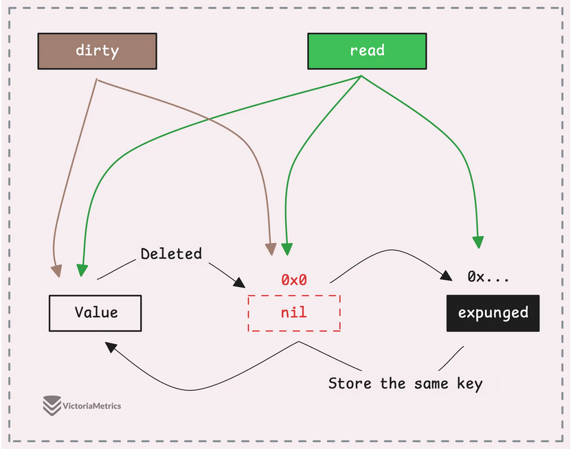

#### Загрузка (Load): Как sync.Map загружает данные и продвигает "грязную мапу"

При загрузке (или получении) данных из sync.Map всегда сначала
проверяется read-мапа.

Если ключ там найден, отлично — всё готово, и значение возвращается
немедленно. Но если ключ не найден, ситуация немного усложняется. На
этом этапе система проверяет, была ли read-мапа **«изменена»
(amended)**, то есть, возможно, в грязной карте находятся какие-то
данные.

Теперь мы идём по медленному пути: sync.Map захватывает мьютекс и
проверяет грязную мапу, чтобы увидеть, есть ли там ключ.

```go
func (m *Map) Load(key any) (value any, ok bool) {
    read := m.loadReadOnly()
    e, ok := read.m[key]
    if !ok && read.amended {
        m.mu.Lock()
        read = m.loadReadOnly()
        e, ok = read.m[key]
        if !ok && read.amended {
            e, ok = m.dirty[key]
            m.missLocked()
        }
        m.mu.Unlock()
    }
    if !ok {
        return nil, false
    }
    return e.load()
}
```

Каждый раз, когда системе приходится обращаться к грязной мапе
(независимо от того, находит она данные или нет), это засчитывается как
«промах» («miss»). Функция sync.Map отслеживает эти промахи с помощью
счетчика map.misses.

Если промахов слишком много, это сигнал о том, что read-мапа устарела
— она устарела и в ней отсутствует слишком много запросов. В этот
момент система решает повысить статус грязной мапы, то есть грязная
карта становится новой read-мапой, а старая read-мапа заменяется.

```go
func (m *Map) missLocked() {
    m.misses++
    if m.misses < len(m.dirty) {
        return
    }
    m.read.Store(&readOnly{m: m.dirty})
    m.dirty = nil
    m.misses = 0
}
```

Затем грязная мапа сбрасывается до значения nil.

Как только найденный ключ будет удален (указатель записи установлен в
nil или удален), операция загрузки проигнорирует эту запись и вернется,
как будто ключа не существует, что логично, поскольку ключ больше
недействителен.

Вывод: Если вы часто добавляете новые пары ключ-значение, read-мапа в
конечном итоге устареет. Когда это произойдет, системе придется
многократно переключаться на медленный путь для обработки запросов, что
вызовет множество задач по обслуживанию в фоновом режиме.

#### Хранение/Обмен(Store/Swap): Expunged state

При использовании Store (или Swap) в sync.Map, либо добавитьcя новый
ключ, либо обновиться существующий, в зависимости от того, находится ли
он уже в этих мапах (он может быть в состоянии deleted, но при этом
оставаться в них).

Как и при загрузке, существует быстрый и медленный пути.

Если ключ, к счастью, находится в read-мапе и не был удален окончательно
(expunged), это **быстрый путь** — все происходит без блокировки, и
все в порядке.

Но если ключ находится в read-мапе и был полностью удален (expunged),
нам нужно **«восстановить» (revive)** или вернуть ключ в исходное
состояние. Это означает, что сначала мы устанавливаем его указатель в
nil и добавляем его обратно в грязную мапу, прежде чем присвоить новое
значение.

```go
func (m *Map) Store(key, value any) {
    read := m.loadReadOnly()
    if e, ok := read.m[key]; ok && e.tryStore(&value) {
        return
    }
    m.mu.Lock()
    read = m.loadReadOnly()
    if e, ok := read.m[key]; ok {
        if e.unexpungeLocked() {
            m.dirty[key] = e
        }
        e.storeLocked(&value)
    } else if e, ok := m.dirty[key]; ok {
        e.storeLocked(&value)
    } else {
        if !read.amended {
            m.dirtyLocked()
            m.read.Store(&readOnly{m: read.m, amended: true})
        }
        m.dirty[key] = newEntry(value)
    }
    m.mu.Unlock()
}
```

Удаленный ключ может находиться в одном из следующих состояний:

* **Недавно удаленный (deleted):** указатель p элемента установлен в nil, что означает, что ключ был удален недавно, но все еще существует как в read-мапе, так и в грязной мапе.
* **Полностью удаленный (expunged):** это когда ключ был удален уже некоторое время назад и полностью удален из грязной мапы. Восстановление (revive) полностью удаленного ключа требует немного больше усилий по сравнению с недавно удаленным, потому что он больше не находится в грязной мапе.

Есть две основные причины для существования состояния expunged ключа:

Во-первых, когда ключ удаляется, он представляется указателем nil, но
сам ключ все еще существует как в мапе только для чтения, так и в
грязной мапе. Со временем эти «мягко удаленные» ключи могут
накапливаться и раздувать sync.Map, и нет способа освободить занимаемое
ими пространство. Вот тут-то и вступает в игру состояние expunged, оно
служит промежуточным этапом, позволяющим очистить эти записи. Как только
ключ помечен как expunged, он существует только в read-мапе, и когда
впоследствии грязная мапа становится новой мапой только для чтения, эти
удаленные ключи полностью отбрасываются, поскольку не были скопированы в
грязную мапу.

Во-вторых, вместо немедленного удаления этих ключей из обеих мап,
sync.Map использует более ленивую стратегию, позволяя очищать их
партиями позже, а не по одному. Если ключ отсутствует как в read-мапе,
так и в грязной мапе, новая пара ключ-значение добавляется в грязную
мапу. Это то, о чем мы уже упоминали ранее: read-мапа не всегда
актуальна, поэтому новые записи сначала попадают в грязную мапу.

Грязная мапа — это расширенная версия read-мапы, включающая как
старые, так и новые записи. Когда впервые обнаруживается, что грязная
мапа отсутствует, она создается на основе read-мапы. При этом все ключи,
которые в read-мапе имеют значение nil (то есть были удалены), не
копируются в грязную мапу, а вместо этого помечаются как expunged в
read-мапе. Ключи, уже имевшие статус expunged, в грязную мапу не
попадают вовсе.

```go
func (m *Map) dirtyLocked() {
    if m.dirty != nil {
        return
    }

    read := m.loadReadOnly()
    m.dirty = make(map[any]*entry, len(read.m))
    for k, e := range read.m {
        if !e.tryExpungeLocked() { // nil -> expunged
            m.dirty[k] = e
        }
    }
}
```

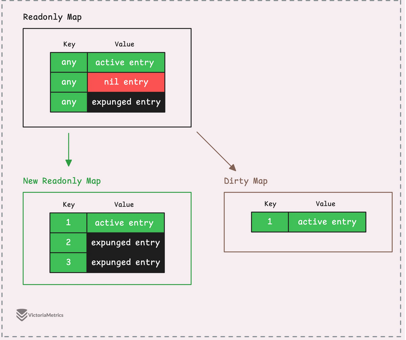

После этого грязная мапа становится чистой, без deleted ключей, а все
deleted ключи в read-мапе помечены как expunged.

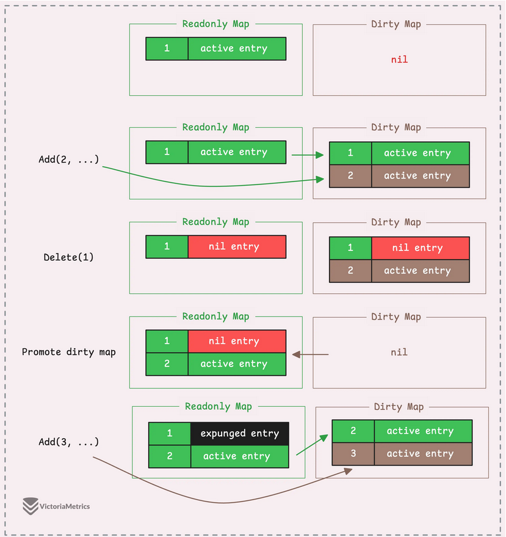

#### Удаление (Delete): как sync.Map удаляет данные

Когда вам нужно удалить пару ключ-значение из read-мапы нет
необходимости захватывать какие-либо блокировки.

Благодаря пакету atomic в Go и небольшому трюку со **спин-блокировкой
(spinlock)**, указатель обновляется до nil в цикле до тех пор, пока
операция не будет успешно завершена (или не завершится неудачей, если
другая горутина уже удалила его).

Это делается без блокировок:

```go
func (m *Map) Delete(key any) {
    read := m.loadReadOnly()
    e, ok := read.m[key]
    if !ok && read.amended {
        m.mu.Lock()
        read = m.loadReadOnly()
        e, ok = read.m[key]
        if !ok && read.amended {
            delete(m.dirty, key)
        }
        m.mu.Unlock()
    }
    if ok {
        e.delete()
    }
}

func (e *entry) delete() (hadValue bool) {
    for {
        p := e.p.Load()
        if p == nil || p == expunged {
            return false
        }
        if e.p.CompareAndSwap(p, nil) {
            return true
        }
    }
}
```

В этом коде e.p — это указатель на запись в read-мапе. Когда при
удалении находится пара ключ-значение, код пытается установить этот
указатель в nil. Если это удаётся, ключ переходит в состояние deleted.

Если же удаляемая пара ключ-значение находится в грязной мапе, механизм
работает иначе. Вместо установки указателя в nil или состояния expunged
запись просто удаляется из грязной мапы с помощью встроенной функции
delete(m, key). Такой подход выбран не случайно. Если бы удаление из
грязной мапы тоже выполнялось через установку указателя в nil с
последующим превращением в expunged и сборкой мусора, возникла бы
проблема разрастания грязной мапы. При постоянном удалении и последующем
сохранении ключей, но без вызова метода Load(), грязная мапа может
неограниченно разрастаться, потому что преобразование грязной мапы в
read-мапу запускается именно счётчиком промахов, который увеличивается
при вызовах Load() (или других методов LoadXXX). Если Load() не
вызывается, преобразование может никогда не произойти, и грязная мапа
продолжит расти.

С этим связана важная особенность: ключи в sync.Map никогда не будут
удалены сборщиком мусора в том смысле, что удалённые записи остаются в
read-мапе в виде nil или expunged указателей. Это означает, что если
программа активно сохраняет и удаляет ключи, но редко выполняет чтение
через Load(), грязная мапа может сильно разрастаться.

Преобразование грязной мапы в read-мапу может быть вызвано не только
методом Load(), но и методом **Range()**. При итерации через Range()
сначала проверяется актуальность read-мапы. Если read-мапа актуальна,
итерация выполняется по ней. Если же read-мапа устарела (то есть была
изменена), система вместо итерации одновременно по read-мапе и грязной
мапе заменяет read-мапу на актуальную версию, а затем выполняет итерацию
уже по ней.

Реализация метода **Len()** для sync.Map, аналогичного по поведению
Range(), сталкивается со сложностями. Проблема в том, что нулевые
указатели и удалённые записи в состоянии expunged остаются в read-мапе и
не считаются фактическими данными. Для получения точного количества
элементов потребовалась бы дополнительная фильтрация этих удаленных
ключей, что снижает производительность и нарушает принцип простоты.
Аналогичная сложность возникает при попытке итерации по мапе с
одновременным подсчетом живых данных.

### Новый sync.Map в Go 1.25

В Go 1.25 реализация sync.Map была существенно переработана. Вместо
прежней схемы с двумя внутренними map (read и dirty) и сложной логикой
их синхронизации теперь используется единая структура — хеш-префиксное
дерево, реализованное как **HashTrieMap**. Эта структура концептуально
близка к **HAMT (Hash Array Mapped Trie)**, но адаптирована под
особенности рантайма Go, включая сборщик мусора и модель атомарных
операций.

Новая структура организует данные в виде дерева, где путь к элементу
определяется частями хеша ключа. На каждом уровне из хеша извлекается
фиксированное количество бит (stride), по которым выбирается следующий
узел. Узлы могут быть как внутренними (с массивом ссылок на потомков),
так и листовыми, содержащими пары «ключ--значение». Такая организация
естественным образом распределяет доступ по различным веткам дерева,
снижая конкуренцию между горутинами.

Ключевая идея реализации — сочетание атомарных операций и частичного
Copy-On-Write. При записи не происходит копирования всей структуры:
пересоздается только путь от корня до изменяемого узла, тогда как
остальная часть дерева переиспользуется. После построения новой версии
пути она атомарно устанавливается с помощью Compare-And-Swap (CAS). Если
в процессе другая горутина уже изменила соответствующий участок дерева,
операция повторяется (retry loop).

Это означает, что:

* чтения в большинстве случаев выполняются без блокировок и работают с консистентным снимком структуры;
* записи не являются строго lock-free (из-за возможных ретраев и аллокаций), но избегают глобальных блокировок и лучше масштабируются при конкуренции по сравнению со старой реализацией;
* вместо прежней механики «промахов» (misses) и продвижения данных из dirty в read теперь используется оптимистичная модель с CAS, где конкуренция разрешается через повтор операций.

Важно отметить, что реализация не является «чистым» HAMT в классическом
функциональном смысле. Она упрощена и оптимизирована:

* структура узлов и способ адресации подобраны с учетом эффективности работы GC;
* используются атомарные указатели (atomic.Pointer) вместо полностью неизменяемых структур;
* добавлены оптимизации для компактного хранения (например, узлы с одним элементом и обработка коллизий хеша).

#### Внутреннее устройство HashTrieMap

Внутренние узлы дерева используют компактное представление, близкое к
классическому HAMT:

* каждый узел хранит битовую маску (bitmap), которая указывает, какие позиции (ветви) реально заняты;
* вместо полного массива потомков используется сжатый массив указателей, индекс в котором вычисляется через popcount (количество установленных битов до нужной позиции);
* это позволяет уменьшить потребление памяти и улучшить локальность кэша.

На каждом уровне:

1. из хеша ключа извлекается несколько бит;
2. по ним определяется позиция в bitmap;
3. если бит установлен — происходит переход к соответствующему потомку;
4. если нет — элемент отсутствует (для Load) или сюда будет вставка (для Store).

Листовые узлы могут:

* хранить один элемент (ключ-значение),
* либо небольшую группу элементов при коллизии хеша (обычно в виде компактного списка).

#### Как выполняется Load

Операция чтения идёт по дереву без модификаций:

1. атомарно считывается указатель на корень;
2. вычисляется хеш ключа;
3. происходит спуск по дереву по частям хеша;
4. при достижении листа:

* либо находится нужный ключ,
* либо возвращается отсутствие значения.

Ключевые свойства:

* нет блокировок;
* структура не изменяется во время чтения;
* читается консистентный снимок (даже если параллельно идут записи).

#### Как выполняется Store

Операция записи использует Copy-On-Write и CAS:

1. читается текущий корень;
2. рекурсивно копируется путь до изменяемого узла:
   * создаются новые версии узлов вдоль пути;
   * остальные ветви переиспользуются;
3. в нужном месте вставляется или обновляется значение;
4. новый корень пытаются установить через CAS;
5. если CAS не удался (кто-то успел изменить структуру) операция повторяется с новым корнем.

Особенности:

* при высокой конкуренции возможны повторные попытки (retry loop);
* каждое изменение создает новые узлы (аллокации);
* нет глобальной блокировки, но есть стоимость атомарных операций и копирования пути.

#### Производительность новой sync.Map

С точки зрения производительности:

* в read-heavy сценариях sync.Map по-прежнему показывает очень хорошие результаты;
* по сравнению со старой версией значительно улучшено поведение при смешанных нагрузках (read/write);
* при write-heavy нагрузке сохраняется стоимость Copy-On-Write (аллокации и CAS-ретраи), поэтому в таких случаях map + mutex всё ещё может быть предпочтительнее.

> **Зачем это Go-разработчику.** `sync.Map` — не замена обычной map. Используйте его ТОЛЬКО в двух случаях: (1) ключ пишется один раз, читается много раз (кеш), или (2) горутины работают с непересекающимися наборами ключей. Во всех остальных случаях `map + sync.RWMutex` проще и часто быстрее. Помните о потере типобезопасности — ключи и значения имеют тип `any`. Если вы часто добавляете новые ключи, грязная мапа будет расти, а частые промахи приведут к её продвижению, что снизит производительность.

***

## 8. sync.Once

**Once** — это примитив синхронизации, который гарантирует, что
некоторая функция выполнится только один раз.

Это идеально подходит для инициализации ресурса-синглтона, чего-то, что
должно происходить только один раз за весь жизненный цикл вашего
приложения, например, для настройки пула соединений с базой данных,
инициализации логгера или, возможно, настройки системы метрик и т. д.

```go
var once sync.Once

func GetConfig() *Config {
    once.Do(fetchConfig)
    return config
}
```

Если метод GetConfig() вызывается несколько раз, метод fetchConfig()
выполняется только один раз.

Реальное преимущество sync.Once заключается в том, что он откладывает
определенные операции до момента их первой необходимости (**ленивая
загрузка или lazy-loading**), что может улучшить производительность во
время выполнения и уменьшить первоначальное использование памяти.
Например, если большая таблица поиска создается только при первом
обращении к ней, то память и время обработки для создания таблицы
экономятся до этого момента.

В большинстве случаев это лучше для инициализации (внешних) ресурсов,
чем использование init().

Теперь важно помнить: как только вы использовали объект sync.Once для
выполнения функции, это всё — вы не можете использовать его повторно.
Как только это сделано, это сделано навсегда.

После того, как sync.Once успешно запустит функцию с помощью **Do(f)**,
он внутренне помечает себя как **«завершенный» (complete)** с помощью
**флага done**, и с этого момента любые дальнейшие вызовы Do(f) не будут
запускать эту функцию снова, даже если это другая функция.

```go
var once sync.Once

once.Do(func() { fmt.Println("first") })
once.Do(func() { fmt.Println("second") }) // never prints
```

Интересный нюанс. Если функция, переданная в Once.Do, вызывает панику во
время выполнения, sync.Once всё равно будет рассматривать это как
«задача выполнена». Это означает, что будущие вызовы Do(f) не будут
запускать эту функцию снова. Это может быть сложно, особенно если вы
пытаетесь перехватить панику и обработать ошибку после этого, повторной
попытки нет.

Кроме того, если вам нужно обрабатывать ошибки, которые могут возникнуть
из f, может быть немного неудобно писать:

```go
var once sync.Once

func GetConfig() (*Config, error) {
    var err error
    once.Do(func() {
        config, err = fetchConfig()
    })
    return config, err // err only set on first call
}
```

Это хорошо работает, но только в первый раз.

Дело в том, что если fetchConfig() завершится неудачей, ошибка будет
получена только при первом вызове. Все последующие вызовы не вернут эту
ошибку. Чтобы поведение было согласованным между вызовами, нам нужно
сделать err переменной, находящейся в области видимости пакета, вот так:

```go
var (
    once   sync.Once
    config *Config
    err    error
)

func GetConfig() (*Config, error) {
    once.Do(func() {
        config, err = fetchConfig()
    })
    return config, err
}
```

Начиная с Go 1.21, мы получаем OnceFunc, OnceValue и OnceValues. По
сути, это удобные обертки над sync.one, которые упрощают работу без
ущерба для производительности.

**OnceFunc** довольно прост: он берет вашу функцию f и оборачивает ее в
другую функцию, которую вы можете вызывать сколько угодно раз, но сама
функция f будет выполняться только один раз:

```go
func main() {
    printOnce := sync.OnceFunc(func() {
        fmt.Println("printed only once")
    })
    printOnce()
    printOnce() // no-op
}
```

Даже если вы вызываете wrapper() много раз, printOnce() выполняется
только при первом вызове.

Теперь, если f() вызывает панику во время первого выполнения, каждый
последующий вызов wrapper() также вызовет панику с той же ошибкой. Это
как блокировка состояния ошибки, поэтому ваше приложение не продолжит
работу, как будто ничего не произошло, если что-то критическое не было
инициализировано правильно.

Но это не решает проблему удобной обработки ошибок.

Перейдём к чему-то еще более полезному: **OnceValue и OnceValues**. Они
хороши тем, что запоминают результат f после первого выполнения и просто
возвращают кэшированный результат при последующих вызовах.

```go
func main() {
    getConfigOnce := sync.OnceValues(func() (*Config, error) {
        return fetchConfig()
    })
    cfg, err := getConfigOnce()
    cfg2, err2 := getConfigOnce() // returns cached
}
```

Теперь getConfigOnce() ведёт себя как обычная функция — она
по-прежнему безопасна для параллельного выполнения, кэширует результат и
требует выполнения функции только один раз. После этого каждый
последующий вызов обходится дешево.

К сожалению если происходит ошибка, то она тоже кэшируется. Независимо
от того, является ли это паника или ошибка, кэшируются как результат,
так и состояние сбоя. Поэтому вызывающий код должен знать, что он может
иметь дело с кэшированной ошибкой или сбоем. Если вам нужно повторить
попытку, вам придётся создать новый экземпляр из sync.OnceValues, чтобы
повторно запустить инициализацию.

Кроме того, в примере мы возвращаем ошибку в качестве второго значения,
чтобы соответствовать типичной сигнатуре функции, к которой мы привыкли,
но, честно говоря, это может быть что угодно в зависимости от ваших
потребностей.

### Как устроен sync.Once()

Это действительно просто по сравнению с чем-то вроде sync.Mutex, одним
из самых сложных инструментов синхронизации в Go.

Вот базовая структура sync.Once:

```go
type Once struct {
    done atomic.Uint32
    m    Mutex
}
```

Поле **done** расположено в самом верху структуры не случайно. На многих
архитектурах ЦП (например, x86-64) доступ к первому полю структуры
происходит быстрее, поскольку оно находится по базовому адресу блока
памяти. Эта небольшая оптимизация позволяет ЦП загружать первое поле
более непосредственно, без вычисления смещений памяти. Кроме того,
размещение его вверху помогает оптимизировать встраивание кода, к чему
мы вернемся чуть позже.

```go
func (o *Once) Do(f func()) {
    o.m.Lock()
    defer o.m.Unlock()
    if o.done.Load() == 0 {
        o.done.Store(1)
        f()
    }
}
```

Идея функции **Do(f func())** заключается в том, что **мьютекс
(o.m.Lock())** позволяет только одной горутине одновременно войти в
критическую секцию. Затем, если done по-прежнему равно 0 (что означает,
что функция еще не выполнилась), он устанавливает done в 1 и запускает
функцию f().

Это, по сути, оригинальная версия sync.Once, написанная Робом Пайком еще
в 2010 году.

Сейчас версия, которую мы только что рассмотрели, работает нормально, но
она не самая производительная. Даже после первого вызова, каждый раз,
когда вызывается Do(f), он все равно захватывает блокировку, а это
значит, что горутины ждут друг друга. Мы определенно можем улучшить
производительность, добавив быстрый выход, если задача уже выполнена.

```go
func (o *Once) Do(f func()) {
    if o.done.Load() == 1 {
        return // fast path
    }
    o.doSlow(f)
}

func (o *Once) doSlow(f func()) {
    o.m.Lock()
    defer o.m.Unlock()
    if o.done.Load() == 0 {
        o.done.Store(1)
        f()
    }
}
```

Это обеспечивает нам **быстрый путь**: когда установлен флаг завершения,
мы полностью пропускаем блокировку и просто немедленно возвращаемся. Но
если флаг не установлен, мы возвращаемся к более медленному пути,
который блокирует мьютекс, повторно проверяет завершение, а затем
запускает функцию.

Теперь нам нужно повторно проверить завершение после получения
блокировки, потому что между проверкой флага и фактической блокировкой
мьютекса есть небольшой промежуток времени, в течение которого другая
горутина могла уже запустить f() и установить флаг. Мы также
устанавливаем флаг завершения перед вызовом f(). Идея заключается в том,
что даже если f() паникует, мы все равно помечаем его как «успешный»,
чтобы предотвратить его повторное выполнение.

Но это действие также является ошибкой. Представьте себе такой сценарий:
мы устанавливаем завершение в 1, но f() еще не завершилась, возможно,
она зависла на длительном сетевом вызове.

```go
// BUG: f may still be running when another goroutine
// sees done==1 and uses uninitialized resource
o.done.Store(1)
f()
```

Теперь появляется вторая горутина, проверяет флаг, видит, что он
установлен, и ошибочно решает, что ресурс готов к использованию. Но на
самом деле он всё ещё находится в процессе загрузки. Происходит
разыменование нулевого значения и паника.

Мы можем исправить проблему, используя defer следующим образом:

```go
func (o *Once) doSlow(f func()) {
    o.m.Lock()
    defer o.m.Unlock()
    if o.done.Load() == 0 {
        defer o.done.Store(1)
        f()
    }
}
```

Это всё ещё не идеально. Идея заключается в том, что Go поддерживает так
называемую **оптимизацию встраивания**.

Если функция достаточно проста, компилятор Go «встроит» её, то есть
возьмёт код функции и вставит его непосредственно туда, где она
вызывается, что ускорит работу. Однако наша функция Do() всё ещё слишком
сложна для встраивания, поскольку она имеет несколько ветвлений,
отложенный вызов и вызовы функций.

Чтобы помочь компилятору принимать более взвешенные решения о
встраивании кода, мы можем перенести логику медленного пути в другую
функцию:

```go
func (o *Once) Do(f func()) {
    if o.done.Load() == 0 {
        o.doSlow(f)
    }
}

func (o *Once) doSlow(f func()) {
    o.m.Lock()
    defer o.m.Unlock()
    if o.done.Load() == 0 {
        defer o.done.Store(1)
        f()
    }
}
```

Это значительно упрощает функцию once.Do() и позволяет компилятору
встроить её в код.

Хотя с нашей точки зрения теперь это два вызова функции, на практике всё
не так. o.done.Load() — это атомарная операция, которую компилятор Go
обрабатывает особым образом (встроенная функция компилятора), поэтому
она не учитывается в сложности вызова функции.

Причина почему не встраиваем doSlow() в том, что после первого вызова
Do(f) обычно используется быстрый путь — просто проверка, была ли
функция уже выполнена.

В реальных приложениях после однократного выполнения f() (что является
медленным путём) обычно происходит множество дополнительных вызовов
once.Do(f), которые просто требуют быстрой проверки флага done без
блокировки или повторного запуска функции.

Вот почему мы оптимизируем код для быстрого пути, где мы просто
проверяем, была ли функция уже выполнена, и немедленно возвращаемся.
Поле done помещено первым в структуру Once потому, что это делает
быстрый путь быстрее, поскольку к нему проще получить доступ.

Теперь у нас есть идеальная версия sync. Однако команда Go также
упомянула версию реализации с использованием операции сравнения и обмена
(CAS), что значительно упрощает нашу функцию Do():

```go
func (o *Once) Do(f func()) {
    if o.done.CompareAndSwap(0, 1) {
        f()
    }
}
```

Идея заключается в том, что та горутина, которая сможет успешно поменять
значение переменной done с 0 на 1, «выиграет» гонку и выполнит функцию
f(), в то время как все остальные горутины просто вернутся.

Но команда Go не использует эту версию, так пока «победившая» горутина
ещё выполняет f(), другие горутины могут проверить флаг завершения,
посчитать, что f() уже закончилась, и начать использовать ресурсы,
которые еще не полностью готовы.

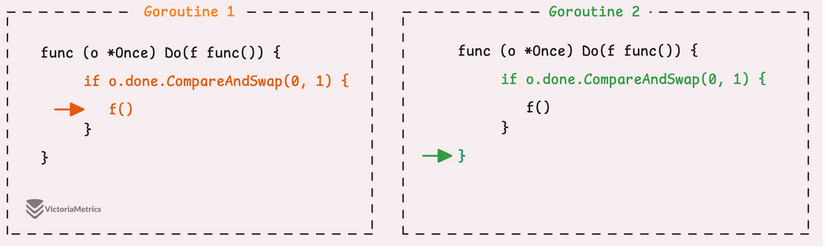

> **Зачем это Go-разработчику.** `sync.Once` — стандартный инструмент для ленивой инициализации. Используйте `OnceFunc`, `OnceValue` и `OnceValues` (Go 1.21+) для более чистого кода. Помните: если функция внутри Once.Do паникует, повторного выполнения не будет — Once считается «завершённым». Для повторяемой инициализации с возможностью ошибки создавайте новый экземпляр Once.

***

## 9. Практические рекомендации

Выбор примитива синхронизации определяется конкретной задачей. Ниже — карта принятия решений для типичных сценариев:

| Задача                                                   | Рекомендуемый примитив                 | Альтернатива                                       |
| -------------------------------------------------------- | -------------------------------------- | -------------------------------------------------- |
| Защита общих данных от одновременной записи              | `sync.Mutex`                           | Канал-мьютекс (для простых случаев)                |
| Много читателей, редкие записи                           | `sync.RWMutex`                         | `sync.Mutex` (если секция очень короткая)          |
| Ожидание завершения группы горутин                       | `sync.WaitGroup`                       | `errgroup.Group` (если нужна обработка ошибок)     |
| Однократная инициализация ресурса                        | `sync.Once` / `OnceFunc`               | `init()`, ленивая инициализация через `sync.Mutex` |
| Кэширование временных объектов (снижение нагрузки на GC) | `sync.Pool`                            | Самодельный пул объектов                           |
| Ожидание события / условия                               | `sync.Cond`                            | Канал с буфером 0                                  |
| Потокобезопасная map для read-heavy сценариев            | `sync.Map`                             | `map + sync.RWMutex`                               |
| Ограничение количества одновременных операций            | Буферизованный канал (счётный семафор) | `golang.org/x/sync/semaphore`                      |
| Атомарный счётчик / флаг                                 | `sync/atomic`                          | `sync.Mutex` (медленнее)                           |
| Передача данных между горутинами + синхронизация         | Канал                                  | —                                                  |

### Каналы vs примитивы sync

| Критерий                | Каналы                                 | Примитивы sync                                 |
| ----------------------- | -------------------------------------- | ---------------------------------------------- |
| Основное назначение     | Коммуникация + синхронизация           | Только синхронизация                           |
| Производительность      | Медленнее (блокировки внутри рантайма) | Быстрее (особенно атомики)                     |
| Читаемость кода         | Высокая                                | Средняя (нужно следить за Lock/Unlock)         |
| Композиция              | Легко компонуются через `select`       | Требуют ручного управления                     |
| Повторное использование | Закрытый канал нельзя переиспользовать | Можно использовать многократно                 |
| Гибкость оповещения     | Закрытие будит всех, запись — одного   | `sync.Cond`: Signal (один) или Broadcast (все) |

### Типичные ошибки и как их избегать

**Deadlock (взаимная блокировка).** Возникает когда две или более горутин ждут друг друга. Пример: горутина A захватила мьютекс M1 и ждёт M2, а горутина B захватила M2 и ждёт M1.

*Как избежать:* всегда захватывать мьютексы в одном порядке; использовать `TryLock` для неблокирующих попыток; минимизировать время удержания блокировки.

**Livelock (активная блокировка).** Горутины не заблокированы, но бесконечно реагируют на действия друг друга, не продвигаясь вперёд. Часто возникает в lock-free алгоритмах с агрессивными повторными попытками.

*Как избежать:* добавлять экспоненциальную задержку (backoff) между повторными попытками; вводить случайный элемент (jitter) в стратегию повтора.

**Starvation (голодание).** Горутина не может получить доступ к ресурсу, потому что другие горутины постоянно его перехватывают. `sync.Mutex` имеет встроенный режим голодания, включающийся после 1 мс ожидания.

*Как избежать:* использовать `RWMutex` для read-heavy сценариев (чтобы читатели не блокировали писателей); избегать длительного удержания блокировок.

**Копирование sync-структур.** `sync.Mutex`, `sync.WaitGroup`, `sync.Cond`, `sync.Pool`, `sync.Once` нельзя копировать после первого использования. `go vet` с флагом `-copylocks` обнаруживает такие ошибки на этапе компиляции.

*Как избежать:* передавать sync-структуры только по указателю; использовать `noCopy` в собственных структурах.

**Деадлок при вызове Lock внутри RLock.** Нельзя вызывать `Lock()` внутри критической секции, защищённой `RLock()` — это гарантированный deadlock. `RWMutex` не поддерживает upgrade read→write.

**WaitGroup.Add после Wait.** Вызов `Add` с положительной дельтой должен происходить до соответствующего вызова `Wait`. Нарушение этого правила приводит к гонке данных или панике.

### Пакет golang.org/x/sync

Стандартный пакет `sync` покрывает базовые потребности, но для более сложных сценариев стоит обратить внимание на расширенный пакет `golang.org/x/sync`:

**errgroup.Group.** Группа горутин, работающих над общим делом. В отличие от `sync.WaitGroup`, `errgroup` собирает первую возникшую ошибку и автоматически отменяет контекст остальных горутин. Идеально для параллельной обработки с ранним выходом при ошибке.

```go
g, ctx := errgroup.WithContext(ctx)
for _, url := range urls {
    url := url
    g.Go(func() error {
        return fetch(ctx, url)
    })
}
if err := g.Wait(); err != nil {
    log.Fatal(err)
}
```

**semaphore.Weighted.** Взвешенный семафор — более гибкая альтернатива буферизованному каналу для ограничения конкурентности. Позволяет запрашивать разное «количество» ресурсов в разных операциях и поддерживает контекст для отмены ожидания.

```go
sem := semaphore.NewWeighted(100)
sem.Acquire(ctx, 10)  // запросили 10 единиц из 100
// ... работа ...
sem.Release(10)
```

### Бенчмаркинг примитивов синхронизации

Производительность примитивов синхронизации зависит от характера нагрузки. Универсального ответа «что быстрее» не существует — нужно мерить в контексте конкретной задачи.

Общий порядок по скорости (от быстрого к медленному) в отсутствие конкуренции:

1. `sync/atomic` — одна процессорная инструкция
2. `sync.Mutex` (быстрый путь, без ожидания) — несколько атомарных операций
3. `sync.RWMutex.RLock` — чуть тяжелее Mutex из-за дополнительных счётчиков
4. `sync.WaitGroup.Add/Done` — атомарные операции над счётчиком
5. `sync.Pool.Get/Put` — работа с локальным пулом (очень быстро на быстром пути)
6. Каналы — включают планировщик и потенциальные блокировки

При появлении конкуренции порядок может измениться. Например, `sync.Map` может быть быстрее `map+RWMutex` при большом количестве ядер и редких записях, но медленнее при частых записях. `sync.Pool` выигрывает за счёт отсутствия аллокаций, а не за счёт скорости самой операции Get/Put.

> **Зачем это Go-разработчику.** Не полагайтесь на микробенчмарки из статей. Пишите бенчмарки для своего конкретного сценария нагрузки. Только так можно принять обоснованное решение о выборе примитива синхронизации.

***

## Ссылки

* [Go 101: Channel Use Cases](https://go101.org/article/channel-use-cases.html)
* [Go 101: Channel Closing](https://go101.org/article/channel-closing.html)
* [Go 101: Concurrent Synchronization](https://go101.org/article/concurrent-synchronization-more.html)
* [Go 101: Atomic Operations](https://go101.org/article/concurrent-atomic-operation.html)
* [VictoriaMetrics: Go sync.Mutex](https://victoriametrics.com/blog/go-sync-mutex/)
* [VictoriaMetrics: Go sync.WaitGroup](https://victoriametrics.com/blog/go-sync-waitgroup/)
* [VictoriaMetrics: Go sync.Pool](https://victoriametrics.com/blog/go-sync-pool/)
* [VictoriaMetrics: Go sync.Cond](https://victoriametrics.com/blog/go-sync-cond/)
* [VictoriaMetrics: Go sync.Map](https://victoriametrics.com/blog/go-sync-map/)
* [VictoriaMetrics: Go sync.Once](https://victoriametrics.com/blog/go-sync-once/)
* [ShareNote: Concurrency Patterns](https://share.note.sx/bvnezqgl)
* [ShareNote: Advanced Sync](https://share.note.sx/180rdo6j)
* [ShareNote: CAS Deep Dive](https://share.note.sx/41m8ag31)
* [AlgoMaster: Compare-and-Swap](https://algomaster.io/learn/concurrency-interview/compare-and-swap)
