# Аллокатор памяти Go 1.27

> **Проверено:** Go 1.27.0
>
> **Перед чтением:** [виртуальная память](virtual-memory.md), указатели и основы сборки мусора.
>
> **После чтения:** вы сможете проследить путь выделения через классы размера, `mcache`, `mcentral` и `mheap`.
>
> **Практика:** [задания и самопроверка](../../practice.md#memory).

Названия структур в этой главе относятся к реализации Go 1.27.0. Они нужны для
чтения профилей и исходного кода, но прикладная программа не должна обращаться к
ним через `//go:linkname`.

## Карта аллокатора

Среда выполнения получает у ОС крупные диапазоны виртуальной памяти и управляет
ими собственными единицами:

```text
виртуальный диапазон
└── арена метаданных кучи
    └── страницы среды выполнения
        └── спан из одной или нескольких страниц
            └── ячейки одного класса размера
                └── объект программы
```

Для быстрых выделений используется ещё один путь:

```text
текущий P → mcache → mcentral → mheap → системный слой памяти
```

Большинство малых объектов обслуживает `mcache` текущего P. При отсутствии
свободной ячейки он получает подготовленный спан от `mcentral`; тот при
необходимости запрашивает страницы у `mheap`.

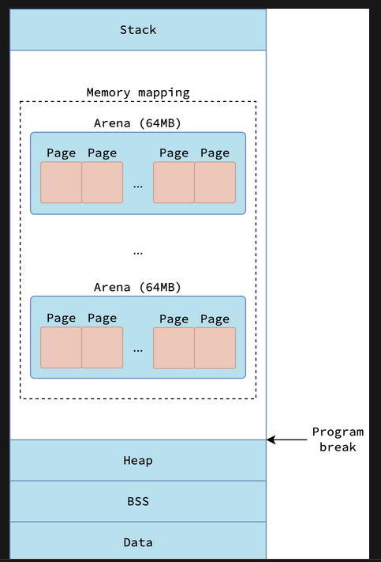

## Арены и страницы

Арена — диапазон адресов, для которого среда выполнения хранит метаданные кучи.
Её размер зависит от цели сборки:

| Цель Go 1.27 | Размер `heapArenaBytes` |
|---|---:|
| большинство 64-разрядных целей | 64 МБ |
| Windows, iOS/arm64 и 32-разрядные цели | 4 МБ |
| WebAssembly | 512 КБ |

Внутренняя страница аллокатора равна 8 КБ. Не путайте её с физической страницей
ОС, размер которой хранится отдельно и зависит от платформы.

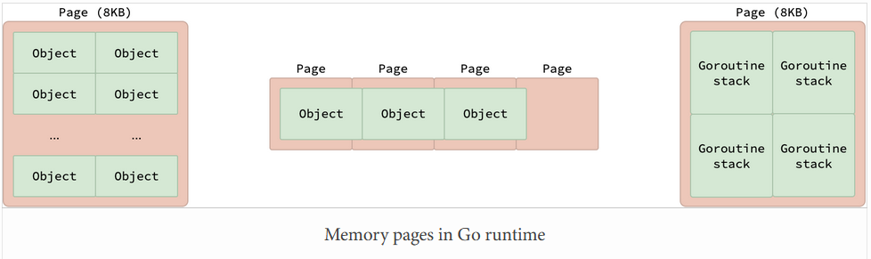

Арена не является одной аллокацией пользователя и не означает 64 МБ
резидентной памяти. Это единица адресации и метаданных.

<a id="spans-and-size-classes"></a>
## Спаны и классы размера

**Спан** — непрерывная последовательность внутренних страниц, которой управляет
`mspan`. Для малых объектов спан делится на одинаковые ячейки. В Go 1.27 есть
68 классов размера, включая нулевой служебный класс; пользовательские размеры
округляются до ближайшего подходящего класса.

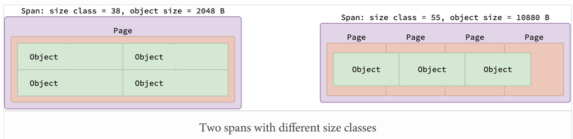

Например, запрос 300 байт попадает в класс 320 байт. Разница между размером
значения и размером ячейки называется внутренними потерями. Генератор таблицы
классов выбирает сочетание числа страниц и объектов так, чтобы ограничить также
остаток в конце спана.

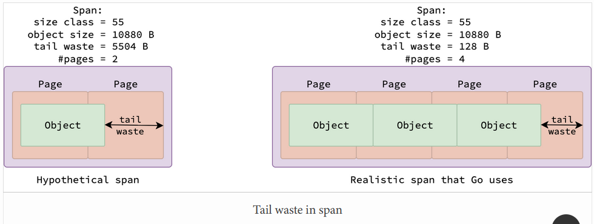

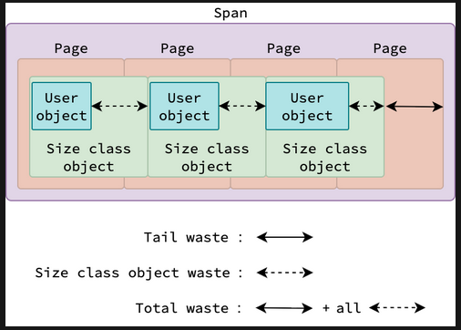

Размер структуры влияет на выбранный класс ступенчато. Уменьшение со 321 до 320
байт может сменить класс, а уменьшение с 319 до 318 — не обязательно. Поэтому
проверяйте итоговые `B/op` и живую кучу, а не только `unsafe.Sizeof`.

## Классы сканирования

Каждому размерному классу соответствуют два класса спана:

- **scan** — объекты могут содержать указатели, их поля участвуют в обходе;
- **noscan** — объекты не содержат указателей, их содержимое не нужно обходить.

Итого внутренний `spanClass` кодирует размерный класс и признак `noscan`; в Go
1.27 возможны 136 сочетаний. Метаданные типа определяет компилятор.

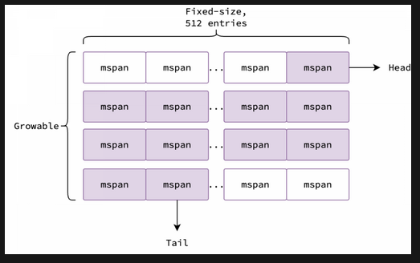

Срез `[]byte` сам содержит указатель в заголовке, но его массив байтов не содержит
указателей и размещается в `noscan`-спане. Формулировка «срезы не сканируются»
была бы неверной: нужно различать заголовок и массив элементов.

## Наборы спанов и `mcentral`

`mcentral` управляет спанами одного класса. Он различает частично заполненные и
полные спаны, а также поколения очистки. Наборы спанов поддерживают конкурентный
доступ, но это не означает, что весь медленный путь аллокатора не использует
блокировки.

Когда `mcache` нужен новый спан, `mcentral.cacheSpan` ищет подходящий, при
необходимости очищает его и передаёт текущему P. Заполненный или возвращаемый
спан снова становится доступен централизованному уровню.

## Метаданные указателей

Сборщик должен знать, какие слова объекта являются указателями. Для небольших
сканируемых объектов данные хранятся в битовой карте (bit heap) спана; для более крупных
используется заголовок (Malloc header) перед объектом.

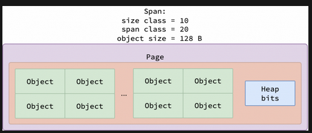

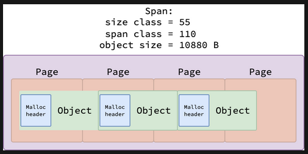

Порог равен `goarch.PtrSize * goarch.PtrBits`:

- 512 байт на 64-разрядной цели;
- 128 байт на обычной 32-разрядной цели.

Это внутренняя граница Go 1.27, а не свойство языка. Заголовок выделения занимает
8 байт, но его влияние на выбор класса зависит от типа объекта и конкретного
пути выделения.

<a id="page-allocator"></a>
## `mheap` и распределитель страниц

`mheap` координирует крупные диапазоны, спаны и обращение к системному слою
памяти. Свободные страницы ищет `pageAlloc`: он хранит иерархию сводок по
диапазонам адресов и отдельные битовые карты участков. Называть эту структуру
обычным радиксным деревом недостаточно точно.

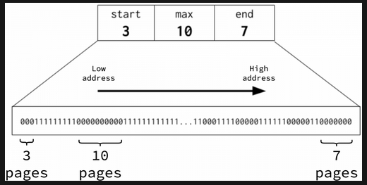

У каждого P есть небольшой `pageCache`, способный обслуживать часть запросов
страниц без глобального поиска. Если он не подходит, `pageAlloc.find` ищет
диапазон по сводкам; при нехватке адресного пространства `mheap.grow` получает
новый диапазон у системного слоя.

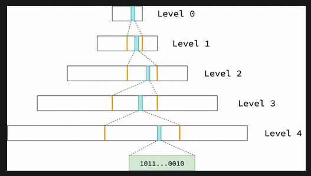

<a id="allocation-path"></a>
## Путь одного выделения в Go 1.27

Сначала компилятор решает, нужно ли вообще выделение. Значение может остаться в
стеке, попасть в кучу или быть устранено. Для кучи Go 1.27 использует несколько
путей.

### Специализированные малые выделения

В Go 1.27 компилятор генерирует вызовы специализированных функций для некоторых
объектов меньше 80 байт. Это уменьшает стоимость распространённых малых
выделений. Поведение можно отключить при сборке через
`GOEXPERIMENT=nosizespecializedmalloc` для диагностического сравнения, но не
следует делать это обычной настройкой приложения.

Поэтому формула «все объекты проходят через `runtime.mallocgc`» для Go 1.27 уже
неполна.

### Tiny-путь

Объекты меньше 16 байт без указателей могут совместно использовать 16-байтовый
блок tiny-аллокатора. Условия важнее одного размера: объект с указателем не
попадает в этот путь.

### Малые и крупные объекты

Малые объекты обслуживаются размерными классами через `mcache` и `mcentral`.
Номинальная граница таблицы классов — 32 КБ. Заголовок сканируемого объекта и
конкретная функция выделения делают проверку около границы тоньше, поэтому не
используйте 32 КБ как прикладной порог оптимизации.

Крупному объекту выделяется отдельный спан через `mheap`.

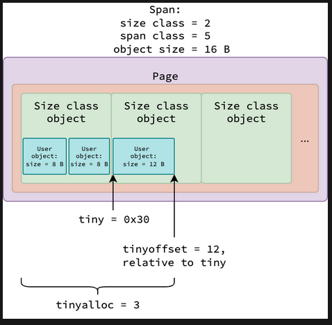

Упрощённый алгоритм:

1. Компилятор выбирает стек, кучу либо устраняет хранение.
2. Для части малых объектов Go 1.27 вызывает специализированную функцию.
3. Обычный путь кучи выбирает tiny, малый или крупный объект.
4. `mcache` берёт свободную ячейку из спана текущего P.
5. Пустой `mcache` пополняется через `mcentral`.
6. При нехватке спанов `mheap` выделяет страницы и при необходимости растёт.

<a id="memory-release"></a>
## Освобождение и возврат памяти ОС

Сборщик помечает недостижимые объекты, а очистка спана делает их ячейки доступными
для повторных выделений. Полностью свободные страницы возвращаются
распределителю страниц.

Фоновый очиститель страниц выбирает подходящие свободные диапазоны и вызывает
`sysUnused`. Платформенный слой сообщает ОС, что физическое содержимое больше не
нужно. На Linux это обычно реализовано через `madvise`; виртуальный диапазон
остаётся зарезервированным и может быть снова подготовлен через `sysUsed`.

Из-за этого возможна нормальная последовательность:

```text
объект недостижим
→ ячейка свободна для Go
→ спан или страницы свободны
→ очиститель сообщает ОС
→ счётчик heap/released растёт
→ RSS уменьшается по правилам ОС
```

Эти шаги не обязаны происходить одновременно. `debug.FreeOSMemory` принудительно
запускает сборку и попытку возврата, но обычно не должен быть частью рабочего
цикла службы.

## Связь со сборщиком мусора

Аллокатор и сборщик совместно используют спаны и сведения об указателях.
Подробные фазы, барьеры и настройка вынесены в раздел
[«Сборщик мусора»](../Сборщик%20мусора%20в%20Go/garbage-collector.md).

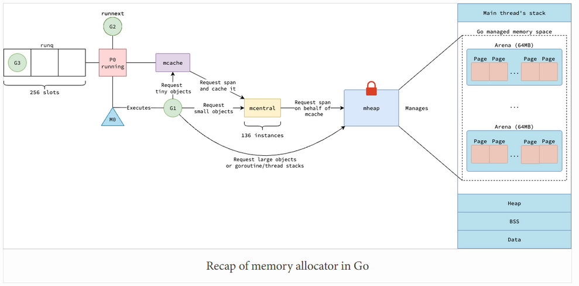

Эта схема показывает общую цепочку, но не включает специализированные функции
малых выделений Go 1.27 и не означает, что каждый свободный спан немедленно
уменьшает RSS.

## Практические выводы

- Размер объекта важен ступенчато из-за классов, но менять структуру нужно после
  измерения, а не ради пересечения внутреннего порога.
- Удаление указателей из больших массивов иногда уменьшает работу сканирования,
  но может ухудшить API и локальность; эффект проверяется профилем.
- Высокая стоимость `runtime.mallocgc` или специализированных функций в профиле
  требует поиска мест выделения, а не ручного вызова внутренних функций.
- Свободная память аллокатора, возвращённая ОС память и RSS — разные состояния.

## Краткий итог

- Малые объекты обычно обслуживаются через локальный для P `mcache`, затем через
  `mcentral` и `mheap`.
- Go 1.27 добавляет специализированные вызовы для части объектов меньше 80 байт.
- Недостижимость объекта, освобождение ячейки и уменьшение RSS — разные события.

## Продолжение

Изучите [стеки горутин](stacks.md) или примените знания в
[сценарии диагностики](diagnostics.md).

## Источники

- [Примечания к Go 1.27: ускорение малых выделений](https://go.dev/doc/go1.27#runtime).
- [`runtime/malloc.go` Go 1.27.0](https://github.com/golang/go/blob/go1.27.0/src/runtime/malloc.go).
- [`runtime/mheap.go` Go 1.27.0](https://github.com/golang/go/blob/go1.27.0/src/runtime/mheap.go).
- [Размерные классы Go 1.27.0](https://github.com/golang/go/blob/go1.27.0/src/internal/runtime/gc/sizeclasses.go).
- [Фоновый очиститель страниц Go 1.27.0](https://github.com/golang/go/blob/go1.27.0/src/runtime/mgcscavenge.go).
