# Память в Go

## 1. Введение

Диск является постоянным хранилищем, но он намного медленнее
**оперативной памяти (ОП, RAM)**. ОП жертвует изменчивостью ради
скорости — данные исчезают при выключении питания, однако время
доступа к ним на несколько порядков меньше. Как следствие, центральный
процессор (ЦП, CPU) может напрямую обращаться только к оперативной
памяти, а для работы с диском данные сначала копируются в ОП, часто с
использованием механизмов прямого доступа к памяти.

Внутри ЦП имеются встроенные регистры, которые работают еще быстрее, чем
оперативная память. Но количество регистров невелико, а их емкость
строго ограничена. Представьте функцию, которой нужно работать с тысячью
переменных — все они просто не поместятся в регистрах. Именно здесь в
игру вступает ОП: она предоставляет то пространство, которое необходимо
для обработки больших и сложных данных.

С физической точки зрения оперативную память можно представить как
большой массив байтов, размер которого в современных системах составляет
от сотен миллионов до миллиардов. Каждый байт имеет собственный
физический адрес. Однако на практике, в системах с виртуальной памятью,
программа работает не с физическими адресами напрямую. При ее запуске
операционная система создает для процесса изолированное виртуальное
адресное пространство, сопоставляя (mapping) виртуальные адреса с
реальными ячейками памяти. Процесс обращается к инструкциям и данным,
используя эти виртуальные адреса, а аппаратное обеспечение процессора
(MMU) прозрачно преобразует их в физические. Благодаря этому каждый
процесс получает собственное адресное пространство, а операционная
система получает возможность гибко управлять распределением памяти,
включая выгрузку данных на диск при необходимости.

***

> **Зачем это Go-разработчику.** Понимание устройства виртуальной памяти — фундамент для осознанного управления памятью в Go. Знание страничной организации, пейджинга и отображений (mmap) напрямую объясняет, почему рантайм Go использует арены, спаны и собственный аллокатор вместо традиционной кучи через brk.

## 2. Простая стратегия выделения памяти

Как правило, на компьютере работает несколько процессов, каждому из
которых выделяется собственное пространство памяти в ОП. Задача
**операционной системы (ОС, OS)** — выделить память для каждого
процесса таким образом, чтобы они не влияли друг на друга. Один из
простейших способов выделения памяти — **назначение процессов
непрерывному блоку памяти переменного размера (variably sized contiguous
block of memory)**, при этом каждый блок может содержать ровно один
процесс.

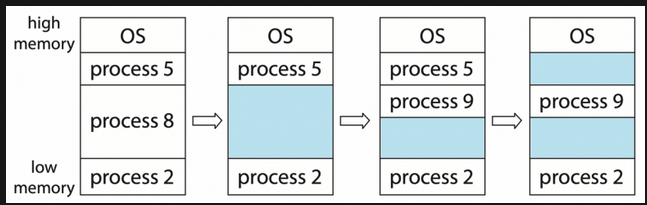

При создании процессов ОС учитывает требования к памяти каждого процесса
и объем доступного пространства памяти для выделения достаточного для
процесса раздела. После выделения памяти процесс загружается в память и
начинает выполняться. После завершения процесса ОП освобождает блок
памяти, делая его доступным для других процессов. Если для входящего
процесса недостаточно места, ОС может выгрузить некоторые процессы на
диск, чтобы освободить место в памяти. В качестве альтернативы можно
поместить такие процессы в **очередь ожидания (wait queue)**. Когда
память освобождается, ОС проверяет очередь ожидания и определяет,
удовлетворяются ли требования к памяти какого-либо ожидающего процесса.

В процессе выделения памяти ОС должна найти достаточно большой
непрерывный блок памяти для процесса. Для этого существует множество
алгоритмов, таких как first-fit, best-fit и worst-fit. **First-fit**
ищет первый достаточно большой блок и прекращает поиск, как только
находит его. **Best-fit** ищет по всему пространству памяти наименьший
достаточно большой блок. **Worst-fit** ищет по всему пространству памяти
наибольший достаточно большой блок. First-fit и Best-fit показывают
лучшие результаты, чем Worst-fit, как по времени, так и по использованию
памяти. First-fit обычно быстрее, чем Best-fit, хотя эффективность
использования памяти у них примерно одинаковая.

***

> **Зачем это Go-разработчику.** Знакомство с базовыми стратегиями ОС (first-fit, best-fit) помогает понять, почему в Go выбран segregated fit — компромисс между скоростью и фрагментацией.

## 3. Внешняя фрагментация

К сожалению, эта простая стратегия выделения памяти может приводить к
**внешней фрагментации (external fragmentation)**. Внешняя фрагментация
возникает, когда имеется достаточно общей памяти для удовлетворения
запроса, но доступные пространства не являются смежными. Этот тип
фрагментации может стать серьезной проблемой. В худшем случае, между
каждыми двумя выделенными процессами появляется небольшой блок свободной
памяти. Если бы все эти разбросанные фрагменты были объединены в один
большой блок, система могла бы запустить еще несколько процессов.

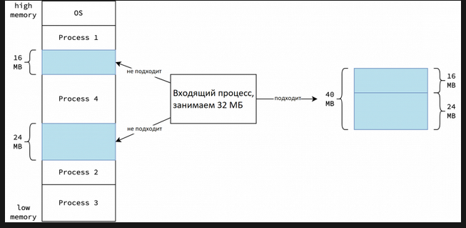

В действительности максимальный объем памяти, необходимый процессу,
неизвестен на момент выделения. Это связано с тем, что процессы могут
выполнять динамическое выделение памяти на основе ввода пользователя или
других факторов. Если выделенной памяти недостаточно, ОС может
приостановить процесс, найти подходящий блок памяти и переместить
процесс в него. Однако такой подход может привести к серьезным проблемам
с производительностью, поэтому он непрактичен.

***

> **Зачем это Go-разработчику.** Внешняя фрагментация — главная причина, по которой аллокатор Go группирует объекты по классам размера в спаны. Без этого куча быстро превратилась бы в «лоскутное одеяло».

## 4. Страничная организация памяти

На практике ОС используют более сложную стратегию распределения памяти,
называемую **страничной организацией памяти (пейджинг, paging)**, чтобы
избежать внешней фрагментации. Пейджинг делит ОП на блоки фиксированного
размера, называемые **кадрами (frames)**. Вместо непрерывного блока
памяти для каждого процесса ОС выделяет несколько кадров, которые могут
быть разбросаны по всей ОП.

Говоря о страничной организации памяти, нельзя не сказать о физической и
виртуальной (логической) памяти. **Физическая память** относится к ОП,
установленной в компьютере, тогда как **виртуальная память** — это
абстракция, которую ОС используют для управления памятью процессов.
Процессы могут обращаться только к виртуальной памяти, а ОС отвечает за
**отображение (mapping)** виртуальной памяти на физическую. Хотя
физическая память процесса может быть несмежной, с точки зрения каждого
процесса, он имеет собственное изолированное виртуальное пространство
памяти, которое выглядит как непрерывный блок.

Виртуальная память разделена на блоки фиксированного размера, называемые
**страницами (pages)**, которые имеют тот же размер, что и кадры в
физической памяти. Разделяя виртуальную и физическую память и используя
такие методы, как **пейджинг по требованию/запросу (demand paging)**
(см. ниже), процесс может получить доступ к 18,4 миллионам ТБ памяти на
64-битной архитектуре или до 4 ГБ на 32-битной архитектуре, даже если
фактической физической памяти значительно меньше, например, 512 МБ.

Каждая страница имеет **номер страницы p**, а каждый кадр — **номер
кадра f**. Каждый адрес имеет смещение d, определяющее его конкретное
положение внутри страницы или кадра. Значения p и f находятся в старших
битах адреса, а d — в младших битах. **Сопоставление (mapping)** между
виртуальными страницами и физическими кадрами поддерживается в структуре
данных для каждого процесса, называемой **таблицей страниц (page
table)**. В таблице страниц каждая запись индексируется номером страницы
p, а соответствующее значение — номером кадра f.

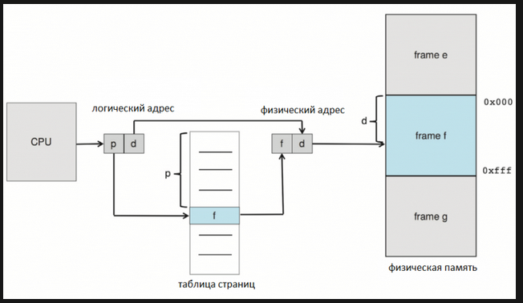

Для **получения физического адреса** виртуального объекта выполняются
следующие шаги:

1\. Номер страницы p извлекается из виртуального адреса.

2\. Номера кадра f извлекается из таблицы страниц.

3\. Номер страницы p заменяется на номер кадра f в виртуальном адресе.

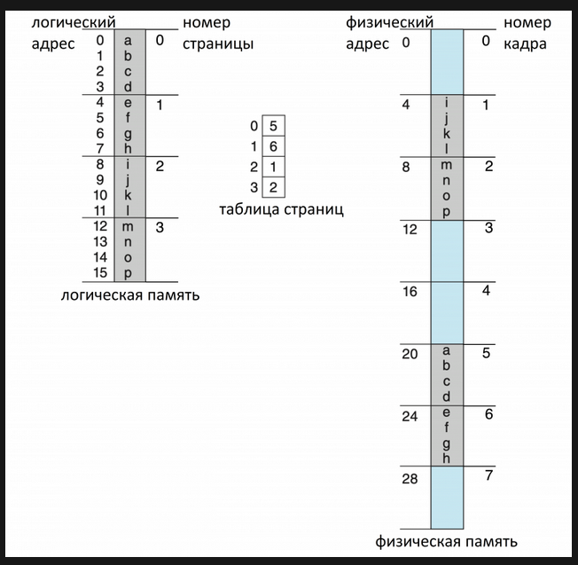

На самом деле структура таблицы страниц не так проста и может иметь
разные формы для эффективного управления памятью. Один из
распространенных подходов, используемый в Linux, — это
**многоуровневая (иерархическая) таблица страниц (multi-level
(hierarchical) page table)**, где каждый уровень содержит таблицы
страниц, которые отображаются на следующий уровень, в конечном итоге
приводя к физическому кадру. Другой метод — это **хешированная таблица
страниц (hashed page table)**, где хеш-функция сопоставляет виртуальные
номера страниц с записями в хеш-таблице, которые указывают на физические
кадры. Третий вариант — это **инвертированная таблица страниц
(inverted page table)**, где каждая запись представляет собой кадр в
физической памяти и хранит виртуальный адрес страницы, которая в данный
момент там находится, а также информацию о процессе-владельце.

Виртуальная память позволяет нескольким процессам использовать одни и те
же файлы и память посредством **совместного доступа к страницам (page
sharing)**. Например, в браузере Chrome каждая вкладка представляет
собой отдельный процесс, но использует одни и те же общие библиотеки,
такие как libc и libssl. Вместо загрузки отдельных копий для каждой
вкладки, ОС отображает одни и те же физические страницы в каждый
процесс, что значительно снижает потребление памяти.

***

> **Зачем это Go-разработчику.** Страничная организация — причина, по которой рантайм Go может выделять гигантские виртуальные адресные пространства (арены по 64 МБ), не расходуя физическую память до первой записи. Это же объясняет, почему RSS процесса Go часто намного меньше VSZ.

## 5. Пейджинг по запросу

Как уже упоминалось, для выполнения программы ее необходимо сначала
загрузить в ОП. Однако при работе с большими программами не всегда
требуется загружать их целиком, достаточно загрузить только ту часть,
которая в данный момент необходима. Именно здесь вступает в игру
**страничная организация памяти по требованию (запросу)**: в память загружаются
только необходимые страницы программы.

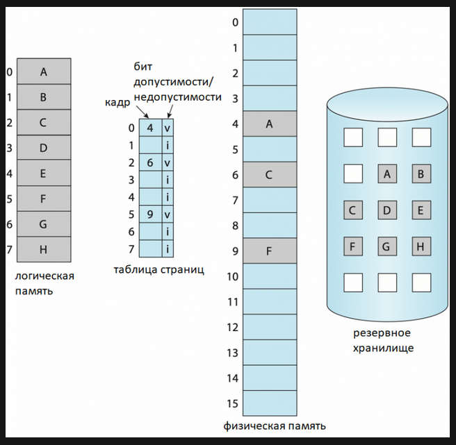

При выполнении программы некоторые страницы загружаются в память, а
другие остаются на диске (т.е. в резервной памяти). Для управления этим
процессом в таблицу страниц добавляется дополнительный столбец,
называемый **битом допустимости/недопустимости (valid-invalid bit)**,
определяющий состояние каждой страницы. Если бит установлен в **значение
valid (v)**, страница является допустимой (т.е. принадлежит логическому
адресному пространству процесса) и в данный момент загружена в память.
Если бит установлен в **значение invalid (i)**, страница либо находится
за пределами логического адресного пространства процесса (является
недопустимой), либо является допустимой, но в данный момент находится на
диске.

Когда процесс пытается получить доступ к странице, у которой бит
допустимости/недопустимости установлен в значение invalid (i),
происходит **ошибка доступа к странице (page fault)**, что приводит к
передаче управления ОС. ОС выполняет следующие шаги для обработки этой
ошибки:

1. Она проверяет внутреннюю таблицу процесса, чтобы определить, является ли обращение к памяти допустимым.
2. Если адрес недействителен (т.е. не является частью логического адресного пространства процесса), процесс завершается.
3. Если адрес действителен, но страница в данный момент не находится в памяти, она загружается в память.
4. ОС находит свободный кадр в физической памяти.
5. Это дает указание диску прочитать необходимую страницу в только что выделенный кадр.
6. После завершения процесса внутренняя таблица и таблица страниц обновляются, чтобы отразить наличие страницы.
7. Процесс возобновляет выполнение с той инструкции, которая вызвала ошибку доступа к странице.

В Linux двумя ключевыми показателями использования памяти являются
**размер резидентного набора (RSS) и виртуальный размер (VSZ)**. **RSS**
представляет собой объем физической памяти, используемой процессом в
данный момент, включая разделяемую память, но исключая страницы,
выгруженные в файл подкачки. **VSZ**, с другой стороны, представляет
собой общий объем виртуальной памяти, выделенной процессу, включая
разделяемые библиотеки плюс все зарезервированное адресное пространство,
независимо от того, находится ли оно в данный момент в физической памяти
или выгружено в файл подкачки. Кроме того, VSZ включает память,
выделенную, но еще не используемую процессом, например, память,
зарезервированную через mmap или malloc, которая не использовалась ранее
и не включается в RSS.

***

> **Зачем это Go-разработчику.** Пейджинг по требованию объясняет, почему выделение крупного слайса через make(\[]T, 1\_000\_000) не приводит к мгновенному расходу физической памяти — ядро выделяет страницы только при первой записи. Это также ключ к пониманию RSS и VSZ в контексте OOM-killer.

## 6. Структура виртуальной памяти

Хотя абстракция виртуальной памяти освобождает программистов
пользовательского пространства от непосредственного управления
физической памятью, при выделении памяти все еще возникают проблемы.
Разработчикам необходимо учитывать такие вопросы, как место выделения
памяти, допустимость данного адреса и наличие конфликтов с
зарезервированными областями, такими как **сегмент кода (code
segment)**. Для решения этих проблем ОС вводят концепцию **структуры
виртуальной памяти (virtual memory layout)**. С точки зрения процесса,
это выглядит так, как показано ниже, причем адреса растут снизу вверх.


Виртуальная память делится на несколько сегментов:

1. **Пространство виртуальной памяти ядра**: зарезервировано для ядра и недоступно для процессов пользовательского пространства.
2. **(Пользовательский) стек (stack)**: содержит кадры стека основного потока процесса и растет (увеличивается в размерах) вниз.
3. **Области, отображаемые в память (memory mapped regions)**: память, выделенная с помощью mmap для общего доступа, отображения в файл или анонимного доступа.
4. **Куча (heap)**: память, выделяемая процессом для динамического распределения памяти, размер которой увеличивается вверх.
5. **Сегмент инициализированных данных ( .data)**: содержит глобальные и статические переменные, инициализируемые программой.
6. **Сегмент неинициализированных данных ( .bss)**: содержит неинициализированные глобальные и статические переменные программы.
7. **Сегмент кода только для чтения**: содержит исполняемый код программы, который обычно доступен только для чтения.

Обратите внимание, что эти сегменты представляют собой всего лишь
страницы в виртуальном адресном пространстве процесса.

***

> **Зачем это Go-разработчику.** Понимание сегментов (.text, .data, .bss, heap, stack, mmap-области) необходимо для чтения профилей памяти в pprof и интерпретации того, в каком сегменте «живут» разные категории переменных Go-программы.

## 7. Выделение стека

В каждом процессе есть **стек** — сегмент памяти, отслеживающий
локальные переменные и вызовы функций в определенный момент времени. Это
структура данных, которая растет вниз по мере вызова функций и создания
локальных переменных, и сокращается вверх по мере возврата функций. При
вызове функции в стеке создается новый **кадр стека (stack frame)**,
содержащий локальные переменные, параметры функции и адрес возврата. При
возврате функции ее кадр стека удаляется из стека, освобождая все
переменные внутри этого кадра.

Каждый **поток (thread)** имеет собственный стек. Поскольку процесс
может содержать несколько потоков, в рамках одного процесса может быть
несколько стеков. Когда говорят о "стеке процесса", обычно
подразумевается стек основного потока. При создании потока ему
назначается стек, отдельный от стека основного потока. Поскольку каждый
поток имеет изолированный стек, выделение памяти в стеке не требует
синхронизации. Если новый поток создается с помощью системного вызова
**pthread\_create**, ​​по умолчанию, ядро автоматически выбирает подходящую
область памяти для стека. В качестве альтернативы мы можем вручную
указать начальный адрес стека с помощью системного вызова
**pthread\_attr\_setstack**. Это поведение также применяется к потокам,
созданным с помощью системного вызова **clone**.

Размер стека фиксируется во время создания потока и не может быть
динамически изменен. Размер стека по умолчанию определяется ограничением
ресурсов **RLIMIT\_STACK**. Дефолтным значением RLIMIT\_STACK обычно
является **2 МБ** на большинстве архитектур или **4 МБ** на POWER и
Sparc-64. RLIMIT\_STACK является глобальным. С помощью
**pthread\_attr\_setstacksize** можно установить больший размер стека,
если поток создает большие переменные или выполняет вложенные вызовы
функций большой глубины (возможно, из-за рекурсии).

Для отслеживания вершины стека процессор использует специальный регистр,
называемый **указателем стека (stack pointer)**. В зависимости от
архитектуры, он может называться RSP на x86-64, ESP на x86 или SP на
ARM. Перед началом выполнения потока указатель стека инициализируется
указателем на вершину стека. Поскольку стек предварительно выделяется
при создании потока, выделение переменной в стеке — это просто
перемещение указателя стека вниз, что является очень быстрой операцией.
Загрузка переменной из стека также быстрая, поскольку требует только
чтения значения по адресу, на который указывает указатель стека.

Существует также еще один специальный регистр, называемый **базовым
указателем/указателем кадра (base/frame pointer)**, который указывает на
начало текущего кадра стека. Он используется в качестве стабильной точки
отсчета для доступа к локальным переменным, а также параметрам функций.
Освобождение стека осуществляется простым и быстрым возвращением
указателя стека к базовому указателю.

Поскольку выделение стека определяется во время компиляции, компилятор
отвечает за вычисление размера всех переменных и генерацию
соответствующего ассемблерного кода для их размещения в стеке.
Компилятор также генерирует инструкции для освобождения стекового кадра
после возврата из функции. Например, MOVD используется для сохранения
переменной в стеке, а ADD - для увеличения указателя стека и,
следовательно, освобождения стекового кадра.

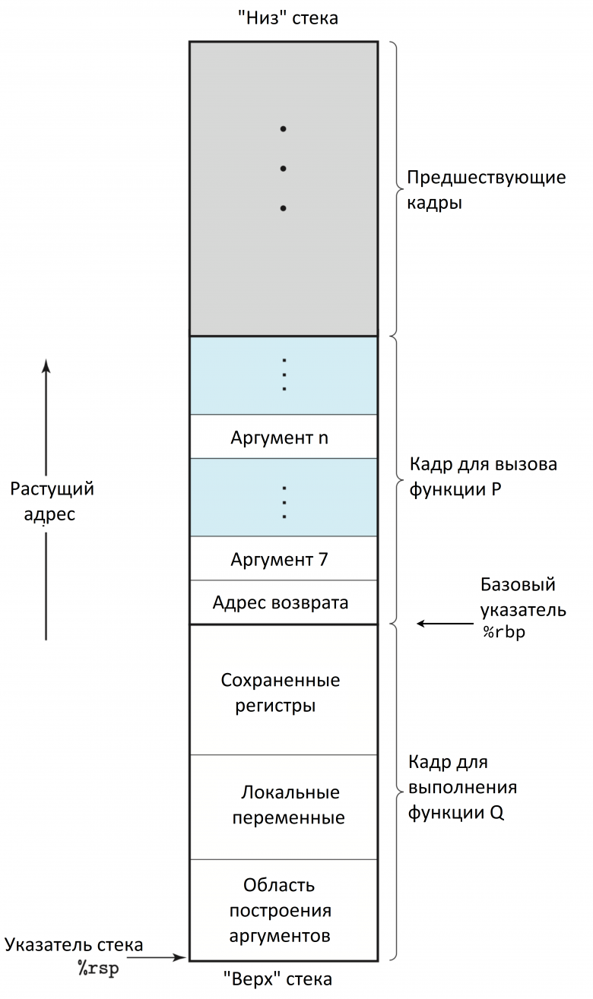

На рисунке выше показана общая структура стекового кадра, когда функция
P вызывает функцию Q. Кадр для текущей выполняемой процедуры всегда
находится на вершине стека. Базовый указатель (%rbp) отмечает начало
текущего стекового кадра, а указатель стека (%rsp) указывает на вершину
стека. Во время выполнения функции P, она может выделять место в стеке,
увеличивая указатель стека для хранения локальных переменных.

Когда P вызывает Q, она помещает адрес возврата в стек, что сообщает
программе, откуда продолжать выполнение P после возврата из Q. Этот
адрес возврата считается частью стекового кадра P, поскольку он содержит
состояние, относящееся к P. На данном этапе P также может сохранить
значения регистров и подготовить аргументы для вызванной процедуры.
Когда управление переходит к Q, базовый указатель %rbp больше не
указывает на стековый кадр P; он обновляется и указывает на начало кадра
Q. Затем Q освобождает свой стековый кадр, уменьшая указатель стека при
возврате.

Не все переменные размещаются в стеке. Выделение памяти в стеке
определяется на этапе компиляции. Если размер переменной на этом этапе
неизвестен, ее нельзя разместить в стеке. Кроме того, если переменная
является локальной для функции F, но на нее ссылается другая функция
после возврата F, размещение этой переменной в стеке приведет к
некорректному доступу к адресу. В таком случае переменную необходимо
разместить в куче.

***

> **Зачем это Go-разработчику.** Выделение в стеке — просто сдвиг указателя стека, одна инструкция CPU. Понимание этого объясняет, почему escape analysis так важен для производительности: переменная в стеке «бесплатна», в куче — влечёт аллокацию и GC-нагрузку.

## 8. Выделение кучи

Размещение переменных в куче означает поиск свободного блока памяти в
сегменте кучи или изменение размера кучи, если такого блока памяти нет.
Текущий предел кучи называется **прерыванием программы (program break)
или сокращенно brk**, как показано на рисунке ниже.

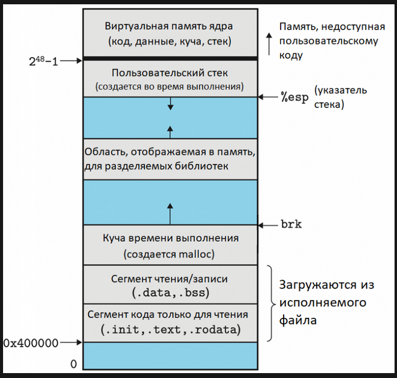

Размер кучи меняется очень просто: достаточно указать ядру
скорректировать его представление о том, где находится brk процесса.
После увеличения brk, программа может получить доступ к любому адресу в
новой выделенной области, но физические страницы памяти пока не
выделены. Ядро автоматически выделяет новые физические страницы при
первой попытке процесса получить доступ к адресам на этих страницах.
После расширения виртуальной памяти для кучи, процесс может выбрать
любой блок памяти для хранения значения переменной.

Linux предоставляет системный вызов brk для изменения позиции brk и
системный вызов sbrk для увеличения его размера. Хотя разработчики
обычно заботятся о размере переменной при ее выделении, brk и sbrk
используются редко, вместо них в Linux используется **malloc**.

malloc сначала сканирует список блоков памяти, ранее освобожденных free,
пытаясь найти подходящий по размеру блок (большего или равного размера).
В зависимости от реализации, для этого сканирования могут применяться
разные стратегии, например, First-fit или Best-fit. Если размер блока
точно совпадает с требуемым, он возвращается вызывающему. Если размер
блока больше требуемого, он разделяется на два блока: блок нужного
размера возвращается вызывающему, а второй остается в списке свободных
блоков. Если в списке нет подходящего блока, malloc вызывает **sbrk**
для выделения дополнительной памяти. malloc увеличивает brk на больший
размер, чем необходимо, и помещает лишнюю память в список свободных
блоков. Это позволяет снизить количество вызовов sbrk.

На рисунке ниже показано, как malloc управляет блоками памяти в куче,
которая представляет собой одномерный массив адресов памяти. Каждый блок
памяти, помимо фактического пространства, используемого для хранения
значений переменных, также хранит свои метаданные, такие как длина блока
и указатели на предыдущий и следующий блоки в списке свободных блоков.
Эти метаданные позволяют malloc и free функционировать должным образом.

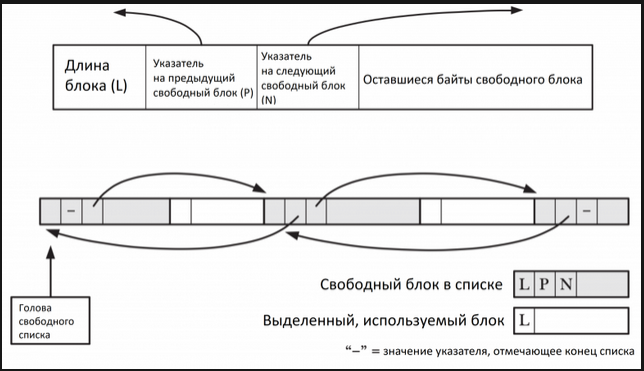

Поскольку куча используется несколькими потоками, во избежание
повреждения данных в многопоточных приложениях для защиты структур
данных управления памятью, используемых этими функциями, применяются
**мьютексы (mutexes)**. В приложении, где несколько потоков одновременно
выделяют и освобождают память, может возникнуть конкуренция за эти
мьютексы. Поэтому выделение памяти в куче менее эффективно, чем в стеке.

***

> **Зачем это Go-разработчику.** Традиционная куча (brk/malloc) — предшественник того, что делает рантайм Go. Понимание malloc (поиск свободного блока, разделение, слияние, sbrk) даёт контраст: Go заменяет это системой спанов и арен, избегая глобальных мьютексов malloc/free.

## 9. Отображение памяти

Как показано на приведенной ниже схеме виртуальной памяти, помимо кучи и
стека, существует также сегмент памяти, называемый **отображаемыми
областями памяти (memory mapped regions)**. Существует два типа
отображения памяти: **отображение в файл и анонимное отображение**.
**Отображение в файл** напрямую отображает область файла в виртуальную
память вызывающего процесса, позволяя получать доступ к его содержимому
с помощью операций над байтами в соответствующей области памяти.
**Анонимное отображение** не имеет соответствующего файла; вместо этого
страницы отображения инициализируются нулями. Другими словами, анонимное
отображение — это отображение виртуального файла, содержимое которого
всегда инициализируется нулями.

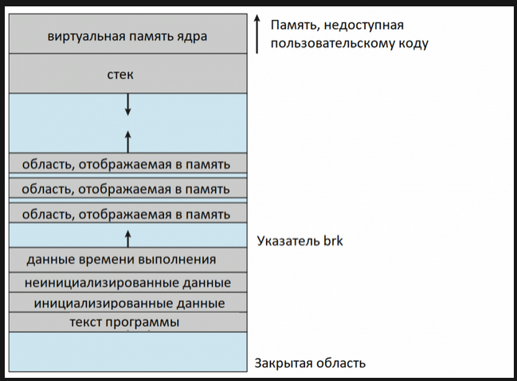

Отображаемая память может быть **частной (private)** (копируемой при
записи, copy-on-write) или **разделяемой (shared)**. Частная область
доступна только создавшему ее процессу. Всякий раз, когда процесс
пытается изменить содержимое страницы, ядро ​​сначала создает новую,
отдельную копию этой страницы для процесса и корректирует таблицы
страниц этого процесса. И наоборот, если область является разделяемой,
то все процессы, которые ее используют, могут видеть внесенные любым из
них изменения.

Пейджинг по запросу также работает для отображения памяти. Когда
адресное пространство пользовательского процесса расширяется, ядро ​​не
выделяет физическую память сразу для этих новых виртуальных адресов.
Вместо этого ядро ​​реализует страничную организацию памяти по требованию,
при которой страница выделяется из физической памяти и отображается в
адресное пространство только тогда, когда пользовательский процесс
пытается записать данные по этому адресу. При операциях чтения в таблице
страниц создается запись, которая ссылается на специальную физическую
страницу, заполненную нулями.

Поскольку анонимные отображения памяти не связаны с файлами и всегда
инициализируются нулями, они идеально подходят для программ, реализующих
собственные стратегии выделения памяти, таких как Go. Это обеспечивает
больший контроль над управлением памятью, позволяя использовать такие
функции, как **пользовательские распределители (custom allocators) или
сборка мусора**, адаптированные к потребностям среды выполнения.

Linux предоставляет системный вызов **mmap** для создания нового
отображения памяти в виртуальном адресном пространстве процесса.
Наиболее важным параметром является **addr**, который задает
предпочтительный начальный адрес отображения. Если addr установлен в
NULL, ядро самостоятельно выбирает подходящий адрес. Если указано
значение, отличное от NULL, ядро ​​рассматривает его как подсказку и
пытается разместить отображение рядом с этим адресом, округляя его при
необходимости до ближайшей границы страницы. Во всех случаях ядро
​​гарантирует, что выбранный адрес не будет конфликтовать с существующими
отображениями.

***

> **Зачем это Go-разработчику.** mmap — ключевой системный вызов для рантайма Go. Именно через анонимное mmap выделяются арены (64 МБ), в которых живут и объекты кучи, и стеки горутин. Понимание private/copy-on-write mmap объясняет, почему рантайм Go не конфликтует с другими процессами и может безопасно управлять памятью самостоятельно.

## 10. Введение в модель памяти Go

**Выделение памяти (memory allocation)** — это сердце любой среды
выполнения языка программирования, и Go не исключение. Эффективное
выделение и управление памятью напрямую влияет на производительность,
масштабируемость и отзывчивость Go-приложений. Хотя Go абстрагирует
большую часть связанной с этим сложности через простые API (new(T), \&T{}
и make), понимание того, что происходит под капотом, дает ценные знания
о том, как среда выполнения достигает эффективности и где могут
возникнуть узкие места производительности.

Далее мы рассмотрим всю цепочку выделения памяти в Go: от виртуального адресного пространства процесса до конкретного байта, занимаемого переменной пользователя. Ключевые звенья этой цепочки:

* **Арены и страницы** — крупнозернистые единицы памяти, выделяемые через mmap.
* **Спаны** — блоки из непрерывных страниц, размеченные под объекты одного размера (segregated fit).
* **mheap** — глобальный менеджер страниц и спанов, использующий radix tree для поиска свободных областей.
* **mcentral** — централизованный менеджер спанов одного класса, связующее звено между mheap и mcache.
* **mcache** — локальный кэш процессора P, обслуживающий горутины без глобальных блокировок.
* **mallocgc** — единая точка входа для выделения объектов в куче, маршрутизирующая tiny/small/large запросы.

Схематично взаимодействие этих компонентов выглядит так:

```

горутина → mcache (кеш P) → mcentral (по классам спана) → mheap (страницы) → mmap (OS)

```

***

> **Зачем это Go-разработчику.** Трёхуровневая архитектура (mcache → mcentral → mheap) — ключ к масштабируемости аллокатора Go. Она минимизирует глобальные блокировки: большинство аллокаций обслуживается из локального кэша процессора, и только при его опустошении запрос идёт выше. Это объясняет, почему программы Go эффективно масштабируются на многоядерных процессорах.

## 11. Отображение виртуальной памяти

**Процесс Go** — это просто приложение пользовательского пространства,
следующее стандартной структуре виртуальной памяти. В частности, сегмент
Stack процесса — это **стек g0** (так называемый системный стек),
связанный с основным **потоком (thread) m0** среды выполнения Go.
Инициализированные (т.е. имеющие ненулевое значение) глобальные
переменные хранятся в **сегменте Data**, а неинициализированные — в
**сегменте BSS**.

Традиционный **сегмент Heap**, находящийся под **прерывателем программы
(program break)**, не используется средой выполнения для выделения
объектов кучи. Вместо этого, среда выполнения использует сегменты,
**отображаемые в память (memory-mapped segments)** для выделения памяти
для объектов кучи и стеков горутин (goroutines). **Далее я буду
ссылаться на эти сегменты как на кучу (не путайте ее с традиционной
кучей под прерывателем программы).**

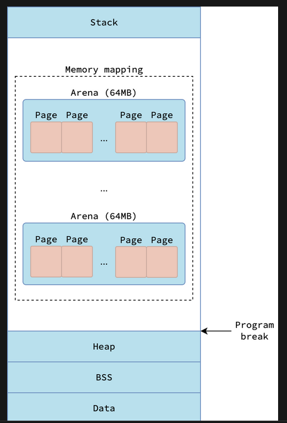

***

## 12. Арена и страница

Для эффективного управления памятью среда выполнения делит эти сегменты,
отображаемые в память, на иерархические единицы от крупнозернистых
(coarse-grained) до мелкозернистых (fine-grained). Самые крупнозернистые
единицы называются **аренами (arenas)** - регион фиксированного размера
в **64 МБ**. Среда выполнения старается сделать арены
**непрерывными/смежными (contiguous)**, но это не всегда удается из-за
поведения системного вызова mmap, который может возвращать другой адрес
вместо запрошенного.

Каждая арена далее делится на меньшие единицы фиксированного размера в
**8 КБ**, называемые **страницами (pages)**. Следует отметить, что эти
управляемые средой выполнения страницы отличаются от типичных страниц
ОС, которые, как правило, имеют размер 4 КБ. Каждая страница содержит
несколько объектов одинакового размера, если объекты меньше 8 КБ, или
только один объект, если его размер ровно 8 КБ. Объекты, размер которых
превышает 8 КБ, «растягиваются» на несколько страниц.

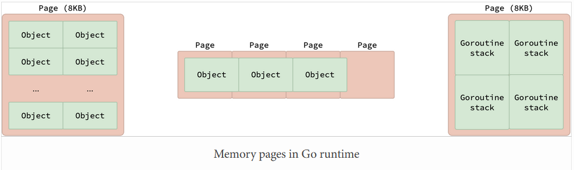

Эти страницы также используются для выделения **стеков горутин**. Каждый
стек горутины изначально занимает **2 КБ**. Это означает, что одна 8 КБ
страница может содержать до 4 стеков горутин.

***

> **Зачем это Go-разработчику.** Арена (64 МБ) и страница (8 КБ) — фундаментальные единицы, из которых строится вся куча Go. Понимание их размера помогает интерпретировать объёмы памяти в pprof и рассчитывать, сколько объектов помещается в одну страницу.

## 13. Классы span и size

Другой ключевой концепцией выделения памяти в Go является **спан
(span)**. Спан — это единица памяти, состоящая из выделенных вместе
непрерывных страниц. Каждый спан делится на несколько объектов одного
размера. Разделяя спан на несколько равных объектов, Go эффективно
использует стратегию выделения памяти с **разделением по размерам
(segregated fit)**. Эта стратегия позволяет Go эффективно выделять
память для объектов разных размеров, минимизируя фрагментацию.

Go использует структуру **mspan** для хранения метаданных спана, таких
как начальный адрес первой страницы, количество страниц, количество
выделенных объектов и т.п. В этой статье, когда я говорю спан, я имею
ввиду представляемую им область памяти, а когда я говорю mspan, я имею
ввиду структуру, описывающую эту область.

В среде выполнения Go размеры объектов организованы в набор
предопределенных групп, называемых **классами размера (size classes)**.
Каждый спан принадлежит ровно одному классу размера, определяемому
размером содержащихся в нем объектов. Go определяет 68 различных классов
размера, пронумерованных от 0 до 67. Класс размера 0 зарезервирован для
обработки выделения памяти для крупных (large) объектов, размер которых
превышает 32 КБ, в то время как классы размера от 1 до 67 используются
для крошечных (tiny) и малых (small) объектов.

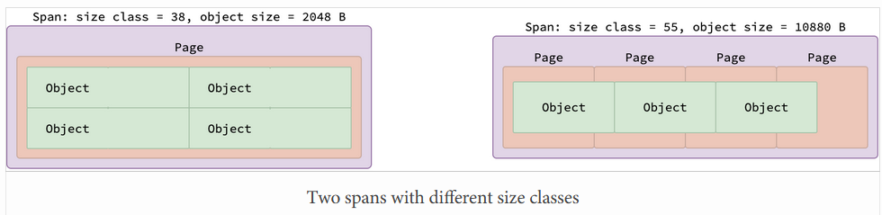

Спаны, принадлежащие к определенному классу размера, содержат
фиксированное количество страниц и объектов, что определяется колонками
bytes/span и objects таблицы. На рисунке выше показаны два спана: один
из класса размера 38 (содержащий объекты размером 2048 байт), другой из
класса размера 55 (содержащий объекты размером 10880 байт). Поскольку на
одной странице размером 8 КБ помещается ровно четыре объекта размером
2048 байт, раздел для класса размера 38 содержит 4 объекта на одной
странице. И, наоборот, поскольку каждый объект размером 10880 байт
превышает одну страницу, раздел для класса размера 55 охватывает 4
страницы, вмещая 3 объекта.

Но почему спан класса размера 55 не содержит только один объект и не
занимает две страницы, как показано на рисунке ниже? Причина в
уменьшении фрагментации памяти. Поскольку объекты внутри спана являются
смежными (расположены последовательно), между последним объектом и
концом спана может образоваться пустое пространство. Это пространство
называется хвостовыми потерями памяти (tail waste) и легко определяется
по формуле (количество страниц)\*8192-(количество объектов)\*(размер
объекта). Если бы спан был распределен на две страницы, хвостовые потери
составили бы 2\*8192-10880\*1=5504 байта, что значительно больше, чем
4\*8192-10880\*3=128 байт хвостовых потерь при распределении на четыре
страницы.

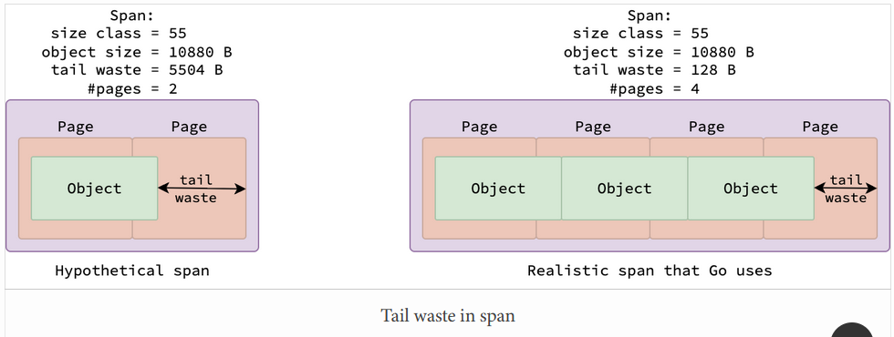

Хотя пользовательское приложение Go может выделять объекты разных
размеров, почему в Go существует всего 67 классов размера для малых
объектов? Что если наше приложение выделит малый объект размером 300
байт, которому не соответствует ни одна запись в таблице классов
размера? В таком случае среда выполнения Go округлит размер объекта до
следующего класса размера, который в данном случае равен 320 байтам.
Зеленые блоки на рисунках выше — это не фактические объекты,
выделенные пользовательским приложением, а объекты классов размера,
управляемый средой выполнения.

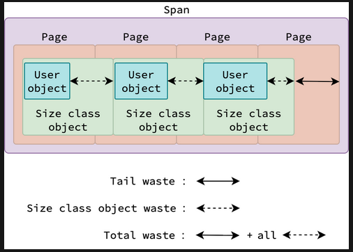

Объекты, выделяемые пользовательским приложением (пользовательские
объекты), содержатся в объекте класса размера. Пользовательские объекты
могут быть разных размеров, но они должны быть меньше размера объекта
класса размера, к которому они принадлежат. Из-за этого между размером
пользовательского объекта и размером объекта класса размера могут
возникать **потери (waste)**. Расходы всех объектов классов размера +
хвостовые потери = **общие потери памяти (total waste)** спана.

Объект класса размера не всегда содержит ровно один пользовательский
объект. Для малых и крупных пользовательских объектов каждый объект
класса размера, как правило, содержит ровно один пользовательский
объект. Однако крошечные пользовательские объекты могут быть упакованы в
один объект класса размера (см. раздел «Распределитель крошечных
объектов»).

Рассмотрим спан класса размера 55 в худшем случае, когда он содержит три
пользовательских объекта, каждый размером 10241 байт (минимальный размер
для объектов этого класса). Расходы от трех таких объектов составляют
3\*(10880-10241)=3\*639=1917 байт, а потери от хвоста —
4\*8192-10880\*3=128 байт. Следовательно, общие потери этого спана
составляют 1917+128=2045 байт, в то время как размер спана составляет
4\*8192=32768 байт, что приводит к максимальным общим потерям
2045/32768=6.24%, как указано в шестом столбце класса размера 55
соответствующей таблицы.

Хотя Go использует стратегию разделения памяти для уменьшения ее
фрагментации, некоторые потери памяти все же возникают. Общие потери
спана отражают количество внешне фрагментированной памяти в нем.

***

> **Зачем это Go-разработчику.** 67 классов размера для малых объектов + segregated fit — механизм, который минимизирует фрагментацию кучи. Знание таблицы классов (bytes/span и waste%) помогает оценить реальный расход памяти на объект: ваша структура в 300 байт будет округлена до 320, и это нормально.

## 14. Тип спана

> **Пояснение от автора: **&#x424;ормально в рантайме существует единая сущность span class — число от 0 до 135. Однако на логическом уровне это число кодирует два независимых свойства: размер объектов и необходимость их сканирования. В этом разделе мы будем говорить о «типе» спана (scan/noscan) как о втором свойстве, из которого формируется итоговый класс.

Сборщик мусора Go является **трассирующим (tracing)**. Это означает, что
в процессе сборки ему нужно **обойти (traverse)** граф объектов для
определения всех **достижимых/доступных (reachable)** объектов. Однако,
если известно, что тип не содержит указателей ни напрямую, ни в своих
полях (например, структура имеет несколько полей, и некоторые из них
содержат указатели на примитивные типы или другие структуры), то сборщик
мусора может безопасно пропустить сканирование объектов этого типа для
уменьшения накладных расходов и повышения производительности, верно?
Наличие или отсутствие указателей в типе определяется во время
компиляции, поэтому эта оптимизация не влечет за собой дополнительных
затрат во время выполнения.

Для упрощения такого поведения среда выполнения Go вводит концепцию
**тип спана. **&#x42D;тот тип классифицирует спаны на основе
двух свойств: класса размера содержащихся в них объектов и наличия у
этих объектов указателей. Если объекты содержат указатели, спан
относится к типу **scan (сканируемый)**. Если нет, он классифицируется
как **noscan (несканируемый)**.

Поскольку наличие указателя — бинарное свойство (тип либо содержит
указатели, либо нет), общее количество типов спана в два раза
превышает количество классов размера. Таким образом, Go определяет
68\*2=136 типов спана. Тип спана представлен целым числом от 0 до
135\. Если число четное, это тип scan, иначе — noscan.

Ранее упоминалось, что каждый спан принадлежит ровно одному классу
размера. Если быть более точным, каждый спан принадлежит ровно одному
типу спана. Соответствующий класс размера может быть получен путем
деления номера класса спана на 2. Таким образом, принадлежность спана к
классу scan или noscan определяется четностью номера типа спана.

***

> **Зачем это Go-разработчику.** Разделение спанов на scan (содержат указатели) и noscan (без указателей) — прямая оптимизация GC. Если ваша структура не содержит указателей, её объекты попадут в noscan-спан, и сборщик мусора их просто пропустит. Это один из самых дешёвых способов снизить GC-нагрузку.

## 15. Множество спанов

Для эффективного управления спанами среда выполнения Go организует их в
структуру данных под названием **«множество/набор спанов» (span set)**.
Набор спанов — это коллекция объектов mspan, принадлежащих одному
классу спана, как показано на этом рисунке.

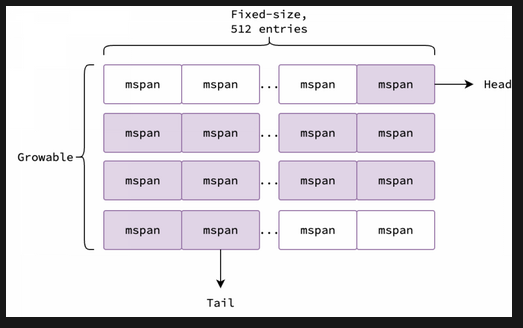

По сути, это **срез (slice) массивов**. Срез растет динамически по мере
необходимости, а размер каждого массива является фиксированным и
составляет **512 элементов**. Каждый элемент в массиве — это объект
mspan, содержащий метаданные спана, и поэтому может быть нулевым.
Фиолетовые элементы на рисунке ненулевые, а белые нулевые.

Набор спанов также имеет два дополнительных поля, **head и tail**,
которые используются для отслеживания первого и последнего элемента во
множестве. Удаление элементов из набора начинается с head, массивы
обходятся сверху вниз, а элементы каждого массива — слева направо.
Добавление элементов в набор начинается с tail, массивы также обходятся
сверху вниз и заполняются слева направо. В случае, если выполнение
операции приводит к пустому массиву, он удаляется из множества спанов и
добавляется в **пул (pool) свободных массивов** для дальнейшего
использования.

Обратите внимание, что head и tail являются атомарными переменными,
поэтому добавление или удаление спанов из набора может выполняться
несколькими горутинами одновременно без необходимости в дополнительной
блокировке.

***

> **Зачем это Go-разработчику.** Span set — lock-free структура на атомиках. Это пример того, как рантайм Go избегает мьютексов даже на уровне внутренних структур данных, обеспечивая конкурентный доступ к спанам из нескольких горутин.

## 16. Биты кучи и заголовок malloc

Рассмотрим большую структуру с 1000 полей, где некоторые поля являются
указателями. Как сборщик мусора узнает, какие поля являются указателями,
чтобы правильно обходить граф объектов? Если бы сборщику мусора
приходилось проверять каждое поле каждого объекта во время выполнения,
это было бы крайне неэффективно, особенно для больших или глубоко
вложенных структур данных. Для решения этой проблемы Go использует
метаданные для эффективного определения местоположения указателей без
сканирования всех полей. Этот механизм основан на двух ключевых
структурах: **битах кучи и заголовках malloc**.

Для объектов размером **менее 512 байт** Go выделяет память в виде
спанов и использует **битовую карту кучи (heap bitmap)** для
отслеживания того, какие слова (words) в спане содержат указатели.
Каждый бит в битовой карте соответствует слову (обычно, 8 байт): 1
указывает на указатель, 0 — на данные, не являющиеся указателями.
Битовая карта хранится в конце спана и используется всеми объектами в
нем. При создании спана Go резервирует место для битовой карты и
использует оставшееся пространство для размещения как можно большего
количества объектов.

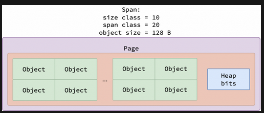

Для объектов, размером более 512 байт, поддержание большой битовой карты
неэффективно. Вместо этого, каждый объект сопровождается 8-байтовым
**заголовком malloc** — указателем на информацию о типе объекта. Эти
метаданные типа включают поле GCData, которое кодирует структуру
указателей типа. Сборщик мусора использует эти данные для точного и
эффективного поиска только тех полей, которые содержат указатели, при
обходе графа объектов.

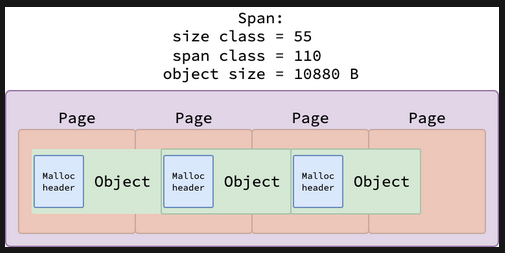

***

> **Зачем это Go-разработчику.** Механизм heap bitmap (< 512 байт) и malloc header (≥ 512 байт) — это то, как GC эффективно находит указатели в объектах без сканирования всех полей. Это объясняет, почему размер объекта влияет не только на память, но и на скорость сборки мусора.

## 17. Управление кучей: mheap

**Абстракция кучи (heap)** Go основана на областях, **отображаемых в
память (memory-mapped segments)**, управляемых глобальным объектом
**mheap**. mheap отвечает за выделение новых спанов, удаление
неиспользуемых спанов и даже за управление стеками горутин.

**Выделение спана: mheap.alloc**

Поскольку среда выполнения Go работает в обширном виртуальном адресном
пространстве, распределитель памяти mheap может испытывать трудности с
эффективным поиском смежных свободных страниц при выделении спана,
особенно при высоком уровне параллелизма. В ранних версиях Go каждая
операция mheap была глобально синхронизирована. Такая конструкция
приводила к значительному снижению пропускной способности и увеличению
задержки в хвосте распределения при больших объемах операций выделения
памяти. Современный распределитель памяти Go реализует масштабируемую
конструкцию. Рассмотрим, как он преодолевает эти узкие места и
эффективно управляет выделением памяти в средах с высокой
параллельностью.

**Отслеживание свободных страниц:**

Поскольку виртуальное адресное пространство велико, а состояние каждой
страницы (свободна или используется) является бинарным свойством, имеет
смысл хранить эту информацию в **битовой карте**, где 1 обозначает
использование, а 0 — свободу. Обратите внимание, что в данном
контексте «используется» или «свободна» относится к тому, принадлежит ли
страница определенному спану, а не к тому, используется ли она
пользовательским приложением. Каждая битовая карта представляет собой
массив из 8 значений uint64, занимающий в общей сложности 64 байта, и
может представлять состояние 512 смежных страниц.

Учитывая, что размер арены составляет 64 МБ, а каждая страница весит 8
КБ, в арене содержится 64MB/8KB=8192 страницы. Поскольку каждая битовая
карта покрывает 512 страниц, для арены требуется 8192/512=16 битовых
карт. При размере каждой битовой карты в 64 байта, общий размер всех
битовых карт арены составляет 16×64=1024 байта, или 1 КБ.

Однако перебор битовой карты для поиска последовательности свободных
страниц по-прежнему неэффективен и расточителен, если битовая карта не
содержит свободных страниц. Лучше каким-то образом кэшировать свободные
страницы, чтобы можно было быстро найти свободную страницу без
сканирования битовой карты. В Go вводится понятие **сводки (summary)
битовой карты**, которая содержит три поля: **start, end и max**.
**start** — это количество последовательных нулевых битов в начале
битовой карты. Аналогично, **end** — это количество последовательных
нулевых битов в конце битовой карты. Наконец, **max** представляет собой
наибольшую последовательность нулевых битов. Сводки обновляются при
каждом изменении битовой карты, то есть когда страница выделяется или
освобождается.

На рисунке ниже представлено краткое описание битовой карты: в начале
имеется 3 непрерывных свободных страницы, в конце — 7, а самая длинная
последовательность свободных страниц составляет 10. Стрелкой показано
направление роста адресного пространства, то есть 3 свободные страницы
по нижнему адресу (lower address) и 7 свободных страниц по верхнему
адресу (higher address).

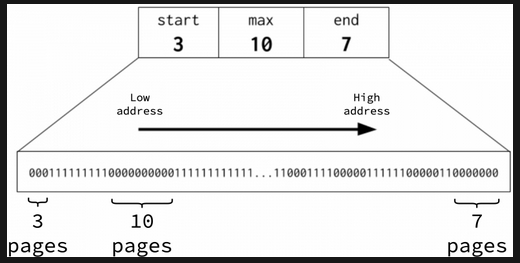

Благодаря этим полям Go может найти достаточный непрерывный свободный
фрагмент памяти в пределах одной арены или нескольких смежных арен,
объединив сводки соседних фрагментов памяти. Рассмотрим два смежных
фрагмента, S1 и S2, каждый из которых занимает 512 страниц. Сводка S1
— start=3, end=7 и max=10, а сводка S2 - start=5, end=2 и max=8.
Поскольку эти фрагменты последовательные, их можно объединить в одну
сводку, охватывающую все 1024 страницы. Объединенная сводка вычисляется
как start=S1.start=3, end=S2.end=2, max=max(S1.max, S2.max,
S1.end+S2.start)=max(10, 8, 7+5)=12.

Объединяя сводки нижнего уровня, Go неявно создает иерархическую
структуру, обеспечивающую эффективное отслеживание непрерывных свободных
страниц. Он управляет всем виртуальным адресным пространством, используя
единое **Радиксное дерево или сжатое префиксное дерево (radix tree) сводок**, как показано
на рисунке ниже. Каждый синий прямоугольник представляет собой сводку
для смежного блока памяти, а пунктирные линии, ведущие к следующему
уровню, отражают, какую часть следующего уровня он охватывает. Зеленый
прямоугольник представляет собой битовую карту 512 страниц, на которые
ссылается сводка листового узла (leaf node).

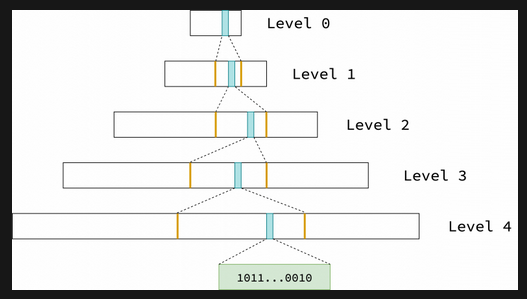

В архитектуре Linux/AMD64 Go использует 48-битное виртуальное адресное
пространство, которое занимает 2^48 байт или 256 ТБ. В этой
конфигурации высота базисного дерева равна 5. Внутренние узлы (уровни от
0 до 3) хранят сводки, полученные путем слияния их 8 дочерних узлов.
Каждый листовой узел (уровень 4) соответствует сводке одной битовой
карты, которая охватывает 512 страниц.

На уровне 0 содержится 16384 записи, на уровне 1 — 16384\*8, на уровне
2 — 16384\*8^2, на уровне 3 — 16384\*8^3 и на уровне 4 —
16384\*8^4. Поскольку каждая листовая запись охватывает 512 страниц,
каждая запись нулевого уровня охватывает 512\*8^4=2097152 смежных
страниц, что соответствует 2097152\*8KB=16 ГБ памяти. Обратите внимание,
что эти числа представляют максимально возможное количество записей.
Фактическое количество записей на каждом уровне постепенно увеличивается
по мере роста кучи.

Как упоминалось ранее, каждый уровень 0 охватывает 209715=2^21 смежных
страниц, start, end и max могут быть размером до 2^21. Как следствие,
хранение этих трех полей требует до 21\*3=63 бит. Это делает возможным
упаковать сводку в единый uint64 под названием **pallocSum**: первые 21
бита хранят start, следующие 21 — end и следующие 21 — max.

Существует один специальный случай: если max=2^21, значит, весь
фрагмент пуст. В этом случае start и end также равняются 2^21, а сводка
кодируется как 2^63. Напротив, если фрагмент не имеет свободных
страниц, т.е. start, end и max равняются 0, значение сводки также
равняется 0.

Радиксное дерево реализовано как массив срезов, где каждый срез
соответствует уровню дерева. Массив фиксирует количество уровней дерева,
а срезы динамически увеличиваются по мере расширения кучи. Сводки для
нижнего адреса остаются в начале среза, а сводки для верхнего адреса
добавляются в конец среза. Поскольку срез сводки на данном уровне
охватывает все зарезервированное адресное пространство, индекс сводки
внутри этого среза напрямую определяет область памяти, которую он
представляет.

**Поиск свободных страниц: pageAlloc.find**

Для поиска достаточной последовательности свободных страниц в Go
используется **алгоритм поиска в глубину (deep-first search, DFS)**. Он
начинается со сканирования до 16384 записей на уровне 0 радиксного
дерева. Если в сводке указано 0 (нет свободных страниц), он переходит к
следующей записи. Если достаточная последовательность найдена на границе
между двумя соседними записями или в начале первой записи, или в конце
последней, то он немедленно возвращает адрес свободной
последовательности, основываясь на адресе, на который ссылается сводка.

В противном случае, если поле max текущей сводки удовлетворяет запросу
на выделение памяти, поиск переходит к 8 дочерним записям следующего
уровня. Если поиск достигает конечного уровня, но все еще не может найти
достаточную последовательность, то он сканирует битовую карту внутри
записи, значение max которой достаточно велико, чтобы найти точную
последовательность свободных страниц. Если мы проходим все записи на
уровне 0, но все еще не можем найти достаточную последовательность, он
возвращает значение 0, указывающее на отсутствие свободных страниц.

Вы можете заметить недостаток этого алгоритма: если многие страницы в
начале уровня 0 уже используются, распределитель памяти будет
многократно проходить по одному и тому же пути в дереве при каждом
выделении памяти, что неэффективно. Go решает эту проблему, поддерживая
**подсказку searchAddr**, которая отмечает адрес, перед которым
нет свободных страниц. Это позволяет распределителю памяти начинать
поиск непосредственно с подсказки, а не с самого начала.

**Увеличение кучи: mheap.grow**

Если в радиксном дереве нет свободных страниц, т.е. pageAlloc.find
возвращает 0, среда выполнения Go должна запросить у ядра расширение
виртуального адресного пространства с помощью системного вызова mmap.
Расширение происходит не на количество запрошенных страниц, а большими
блоками, округленными до размера арены (64 МБ). Даже если запрошена
только одна страница, куча расширяется на 64 МБ в виртуальном адресном
пространстве (а не в физическом, благодаря страничной организации памяти
по требованию).

Для управления этим среда выполнения поддерживает **список
адресов-подсказок  arenaHints **— адресов, которые она
предпочитает использовать для новых выделений памяти ядром. Этот список
инициализируется перед выполнением функции main. В процессе расширения
кучи, Go перебирает эти подсказки, запрашивая у ядра выделение памяти по
каждому предложенному адресу, передавая этот адрес в качестве первого
параметра системного вызова mmap.

Однако ядро ​​может выбрать другое местоположение. В этом случае Go
переходит к следующей подсказке. Если все подсказки не срабатывают, Go
возвращается к запросу памяти по случайному адресу, выровненному по
размеру арены, а затем обновляет список подсказок таким образом, чтобы
будущий рост оставался смежным с вновь выделенной ареной.

Этот процесс переводит раздел памяти из состояния **None (не
используется)** в состояние **Reserved (зарезервирован)**. После
регистрации арены в среде выполнения, то есть добавления ее в список
всех арен, раздел переходит из состояния Reserved в состояние **Prepared
(подготовлен)**. На этом этапе дерево сводок обновляется, чтобы включить
новую арену, расширяя срезы сводок на каждом уровне, помечая битовую
карту для новых страниц как свободную и соответствующим образом обновляя
сводки. Этот новый раздел памяти также отслеживается как **используемый
(in-use)**.

**Настройка спана: mheap.haveSpan**

После обнаружения свободной последовательности страниц, среда выполнения
настраивает объект mspan для управления этим диапазоном памяти. Как и
любой другой объект Go, объект mspan сам должен «жить» в памяти. mspan
выделяются распределителем **slab fixalloc**, который запрашивает память
непосредственно у ядра с помощью системного вызова mmap.

Затем для каждого спана указывается его класс размера, количество
покрываемых им страниц и адрес первой страницы. Соответствующий раздел
памяти переходит из состояния Prepared в состояние Ready, что означает
его готовность к использованию в mcentral.

**Кэширование свободных страниц: mheap.allocToCache**

К сожалению, и pageAlloc.find, и mheap.grow используют глобальные
блокировки, которые могут стать узкими местами производительности при
большом количестве параллельных выделений памяти. Поскольку уровень
параллелизма программы на Go определяется количеством процессоров,
локальное кэширование свободных страниц в каждом процессоре помогает
избежать конфликтов с глобальными блокировками.

В Go это реализовано с помощью **объекта pageCache** для каждого
процессора. pageCache состоит из базового адреса для блока памяти,
выровненного по 64 страницам, и 64-битной битовой карты, отслеживающей,
какие из этих страниц свободны. Поскольку каждая страница имеет размер 8
КБ, один pageCache может содержать до 512 КБ свободной памяти.

Когда горутина запрашивает спан у mheap, среда выполнения сначала
проверяет pageCache текущего процессора. Если свободных страниц
достаточно, они используются для настройки спана. Иначе, среда
выполнения вызывает pageAlloc.find для поиска подходящей
последовательности страниц.

Если pageCache пуст, среда выполнения выделяет новый. Сначала она
пытается получить страницы рядом с текущей подсказкой searchAddr в
сводном базисном дереве (см. раздел «Поиск свободных страниц»).
Поскольку подсказка может быть неточной, для поиска свободных страниц
может потребоваться обход дерева.

Обратите внимание, что вероятность наличия N свободных страниц
уменьшается при приближении N к 64, поскольку pageCache ограничен 64
страницами. В таком случае, может быть слишком много **промахов кэша
(cache misses)**, и среда выполнения будет часто обращаться к
pageAlloc.find для поиска свободных страниц. Поэтому, если значение N
равно или больше 16, среда выполнения не проверяет кэш и сразу
использует pageAlloc.find.

После получения новых страниц, они помечаются как используемые в радиксном дереве, чтобы предотвратить их присвоение другими процессорами
и гарантировать, что распределитель памяти не будет использовать их
повторно при следующем расширении кучи. Подсказка сводного дерева также
обновляется, чтобы последующие выделения памяти пропускали эти
используемые страницы.

**Кэширование спанов: mheap.allocMSpanLocked**

Как упоминалось в разделе «Настройка спана», для представления и
управления спаном страниц должен быть выделен объект mspan. Если mspan
извлекается прямо из mheap, требуется глобальная блокировка, что может
стать узким местом производительности. Во избежание этого, Go кэширует
свободные mspan для каждого процессора P, как страницы.

После обнаружения свободных страниц в pageCache, среда выполнения
сначала проверяет, есть ли у текущего P кэшированный mspan. Если есть,
он может быть повторно использован незамедлительно без конкуренции за
глобальную блокировку. Иначе, среда выполнения выделяет несколько mspan
из mheap, кэширует их в свободном списке P для будущего использования и
присваивает один из них для управления выделенной последовательностью
страниц.

***

> **Зачем это Go-разработчику.** mheap — центральный диспетчер памяти рантайма. **Радиксное дерево (сжатое префиксное дерево) **&#x441;водок позволяет за O(log n) находить непрерывные свободные страницы, а pageCache процессора — обслуживать большинство запросов без глобальной блокировки.

## 18. Централизованный менеджер спанов: mcentral

Поскольку mheap в основном управляет крупнозернистыми единицами памяти,
такими как страницы и крупные спаны, он не предоставляет эффективного
способа выделения и освобождения крошечных или малых объектов. Эту роль
выполняет **mcentral**, который также служит связующим звеном между
mheap и распределителями памяти на уровне P mcache.

Каждый mcentral управляет спанами, принадлежащими определенному классу
спана. В сумме mheap поддерживает 136 экземпляров mcentral — по одному
для каждого класса. В mcentral существует 2 категории множеств спанов:
**полные (full)** (спаны без свободных объектов) и **частичные
(partial)** (спаны с некоторыми объектами). Каждая категория далее также
делится на 2 множества спанов: **swept (очищенные) и unswept
(неочищенные)**, в зависимости от того, были спаны очищены или нет.

Что означает «очистка» спана? Сборщик мусора Go основан на принципе
**«пометить и очистить» (mark-and-sweep)**: сначала он помечает все
доступные объекты, затем удаляет недоступные, либо возвращая эту память
среде выполнения для повторного использования, либо, в некоторых
случаях, возвращая ее ядру для уменьшения занимаемой процессом памяти.
**Очистка** — сложный процесс, но, по сути, он включает в себя
следующие три шага: удаление спана из неочищенного множества,
освобождение объектов, помеченных как недоступные в этом спане, и
добавление спана в очищенное множество.

Переход спана между частичным и полным определяется в процессе выделения
или очистки памяти, в зависимости от увеличения или уменьшения
количества свободных объектов в спане. Если количество свободных
объектов в спане достигает 0, он перемещается из частичного множества в
полное. Если число свободных объектов в спане положительное, он
перемещается из полного набора в частичный.

Поскольку наборы спанов являются **потокобезопасными (thread-safe)**,
mcentral доступен нескольким горутинам одновременно без необходимости
дополнительной блокировки. Это повышает пропускную способность выделения
спанов.

**Подготовка спана: mcentral.cacheSpan**

Как посредник между mheap и mcache, mcentral отвечает за подготовку
спана (либо из существующих множеств спанов, либо из запрошенных у
mheap) для запрашивающего mcache.

**Очистка спана: mcentral.uncacheSpan**

Когда mcache необходимо вернуть спан обратно в mcentral, он вызывает
метод mcentral.uncacheSpan. Если спан еще не был очищен, он сначала
очищается, чтобы освободить недоступные объекты. Затем, независимо от
того, требовалась ли очистка, фрагмент помещается либо в полный, либо в
частичный набор очищенных объектов, в зависимости от количества
свободных объектов в нем.

***

> **Зачем это Go-разработчику.** mcentral — связующее звено между глобальным mheap и локальным mcache. Он управляет полными и частичными спанами одного класса, а его span sets потокобезопасны. Понимание mcentral объясняет, почему аллокатор не «застревает» на глобальных блокировках при конкурентных выделениях.

## 19. Распределитель памяти процессора: mcache

Каждый процессор P служит контекстом выполнения горутин. Как горутина
может выделять память, так и каждый P также поддерживает собственный
распределитель памяти mcache, оптимизированный для выделения кучи для
крошечных и малых объектов, а также за выделение стека для горутин.

**Кэширование свободных спанов**

Название «mcache» происходит от того, что он кэширует спаны со
свободными объектами для каждого класса спана в своем поле **alloc**.
При инициализации экземпляра mcache, каждый класс спана кэшируется с
**emptyspan**, который не содержит свободных объектов. Когда горутине
требуется выделить пользовательский объект определенного класса спана,
она запрашивает у mcache свободный объект класса размера для размещения
запрошенного объекта пользователя — либо из кэшированного спана, либо
путем запроса нового спана из mcentral, если в кэшированном спане нет
свободного объекта.

**Распределитель памяти крошечных объектов**

Все крошечные объекты пользователя разных размеров (менее 16 байт)
выделяются из класса спана 5 (класса размера 2), где каждый объект
класса размера занимает 16 байт. Каждый экземпляр mcache отслеживает
выделение памяти для крошечных объектов в спане с помощью трех полей:

* **tiny** — начальный адрес текущего объекта класса размера, имеющего доступное пространство для выделения
* **tinyoffset** — конечная позиция (относительно tiny) последнего выделенного объекта пользователя
* **tinyalloc** — общее количество выделенных крошечных объектов пользователя в текущем спане

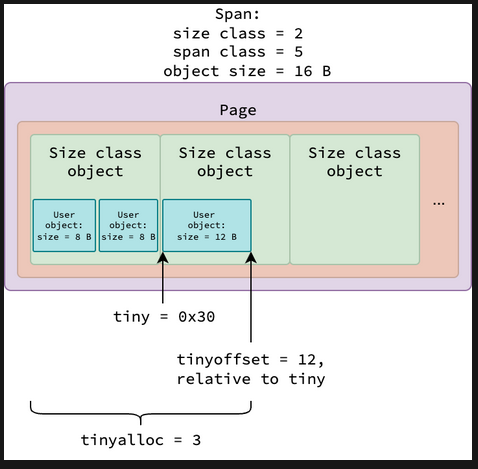

***

> **Зачем это Go-разработчику.** mcache — главный секрет масштабируемости аллокатора Go. Каждый процессор P имеет собственный кэш спанов, и большинство аллокаций обслуживается без каких-либо блокировок. Tiny-аллокатор (< 16 байт) внутри mcache ещё и пакует несколько пользовательских объектов в один объект класса размера.

## 20. Выделение кучи: mallocgc

Одним из распространенных заблуждений в Go является то, что выделение
объектов в куче требует new(T) или \&T{}. Это не всегда так по нескольким
причинам. Во-первых, если объект небольшой, живет только в области
видимости функции и не ссылается на внешние значения, компилятор может
выделить его в стеке, а не в куче. Во-вторых, даже примитив, объявленный
с помощью var n int, может оказаться в куче, в зависимости от **анализа
выхода (escape analysis)**. В-третьих, создание составных типов, таких
как срезы, карты или каналы с помощью make, часто помещает нижележащие
структуры данных в кучу.

Решение о выделении объекта в куче принимается компилятором и будет
описано позже. В этом разделе мы сфокусируемся на **mallocgc** —
методе, который используется средой выполнения для выделения объектов в
куче. Этот метод косвенно вызывается разными встроенными функциями и
операторами, такими как new, make и \&T{}.

mallocgc разделяет объекты на три категории по размеру: **крошечные**
(менее 16 байт), **малые** (от 16 до 32760 байт) и **крупные** (более
32760 байт). Также принимается во внимание, содержит ли объектный тип
указатели, влияющие на сборку мусора. На основе этого критерия он
вызывает разные **пути **&#x432;ыделения памяти для оптимизации использования памяти и производительности.

**Крошечные объекты: mallocgcTiny**

Крошечные объекты выделяются mcache для каждого процессора с помощью
трех свойств, описанных в разделе «Распределитель памяти крошечных
объектов».

Выравнивание tinyoffset выполняется в соответствии с запрошенным
размером: 8-байтовое выравнивание, если размер делится на 8, 4-байтовое,
если делится на 4, 2-байтовое, если делится на 2, и без выравнивания —
в остальных случаях.

Обратите внимание, что выделение крошечных объектов выполняется mcache
каждого процессора. Это делает выделение потокобезопасным и свободным от
блокировок, за исключением случаев, когда новый спан должен быть
запрошен из mheap через mcentral.

Спаны, используемые для выделения крошечных объектов, принадлежат классу
спана 5 или классу размера 2. Согласно таблице классов размера, спан
класса размера 2 вмещает 512 объектов этого класса. Поскольку каждый
объект класса размера может содержать несколько пользовательских
объектов в выделении крошечных объектов, один спан может обслуживать,
как минимум, 512 выделений крошечных объектов пользователя без
каких-либо блокировок.

**Малые объекты: mallocgcSmall**

Для того, чтобы сборщик мусора мог эффективно идентифицировать «живые»
объекты и пропускать трассировку объектов, которые не содержат ссылок на
другие объекты, Go делит малые объекты на классы спана scan и noscan
(описано в разделе «Тип спана»). Класс scan далее также делится на 2
категории: с битами кучи и с заголовком malloc (описано в разделе «Биты
кучи и заголовок malloc»). Go реализует разные функции для выделения
малых объектов на основе этих классификаций.

**Крупные объекты: mallocgcLarge**

Поскольку mcache и mcentral управляют только спанами для объектов,
не превышающих 32 КБ, более крупные объекты выделяются напрямую из mheap.
Спаны, вмещающие такие крупные объекты, тоже получают
один из двух возможных типов: scan или noscan, однако в отличие от
малых объектов здесь нет разбиения на множество классов.
Причина проста: для малых объектов класс спана кодирует и размер, и тип,
а для крупных точный размер уже не важен — он определяется самим запросом и не сводится к фиксированному набору. Поэтому для крупных объектов
всё разнообразие классов спана сводится ровно к двум номерам:
класс 0 для спанов типа scan и класс 1 для спанов типа noscan.

Когда приложение запрашивает по-настоящему большой объект, скажем,
срез на миллион крупных структур, ядро операционной системы
не выделяет физическую память немедленно. Вместо этого
резервируется непрерывный диапазон виртуального
адресного пространства, а реальные физические страницы
подставляются позже, при первой записи в соответствующую
область памяти — благодаря пейджингу по требованию.

***

> **Зачем это Go-разработчику.** mallocgc — единая точка входа для всех выделений в куче. Она маршрутизирует объекты по трём путям: tiny (< 16 байт) через mcache без блокировок, small (16–32 КБ) через mcache→mcentral, и large (> 32 КБ) напрямую через mheap. Понимание этой трихотомии объясняет, почему размер объекта критичен для производительности аллокации.

## 21. Управление стеком

Код среды выполнения, и пользовательский код выполняются в потоках,
управляемых ядром. Каждый поток обладает собственным стеком —
непрерывным блоком памяти, содержащим **кадры стека (stack frames)**,
которые, в свою очередь, хранят параметры функций, локальные переменные
и адреса возврата. Поскольку выделение переменных в стеке — это просто
перемещение **указателя стека (stack pointer)**, мы сфокусируемся на
том, как стеки выделяются и управляются в Go.

В Go стек потока называется **системным стеком (system stack)**, а стек
горутины — просто стеком. Для управления контекстами выполнения среда
выполнения представляет **абстракции m (поток) и g (горутина)**. У
каждого g есть поле stack для записи начального и конечного адресов ее
стека. У каждого m есть **специальная горутина g0**, чей стек
представляет собой системный стек. Среда выполнения использует g0 для
операций, которые должны выполняться в системном стеке, а не в стеке
горутины, таких как расширение и сокращение стека горутины.

Системный стек основного потока выделяется ядром при запуске процесса
Go. Стеки других потоков выделяются либо ядром, либо средой выполнения
Go, в зависимости от ОС и того, используется ли CGO. На Darwin и Windows
системные стеки всегда выделяются ядром. На Linux это делает среда
выполнения при условии, что не используется CGO.

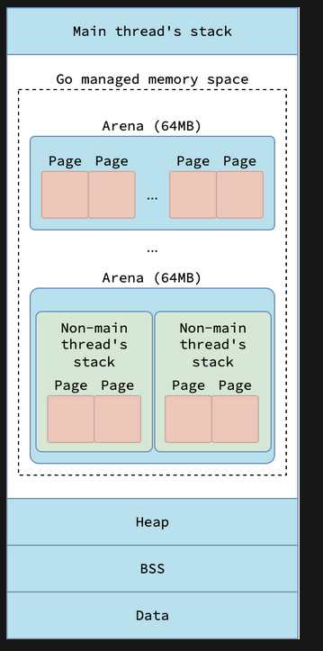

Системный стек, выделяемый ядром, находится за пределами виртуального
адресного пространства, управляемого средой выполнения Go, а системный
стек, выделяемый средой выполнения, создается внутри нее. Ядро
обеспечивает отсутствие конфликтов между его системными стеками и
памятью, которой управляет Go. Ядро выделяет системные стеки в диапазоне
**от 512 КБ до нескольких МБ**, а системные стеки, выделяемые Go, имеют
фиксированный размер в **16 КБ**. Стеки горутин же **начинаются с 2 КБ**
и могут расширяться или сокращаться динамически по мере необходимости.

**Выделение стека: stackalloc**

Стеки, управляемые средой выполнения, будь то системные стеки или стеки
горутин, размещаются в спанах, прямо как объекты кучи. Вы можете думать
о стеке как о специальном виде объектов кучи, предназначенных для
хранения локальных переменных и кадров вызовов функций в процессе
выполнения кода среды выполнения или пользователя.

Как правило, стеки выделяются из mcache текущего процессора. При сборке
мусора, при изменении количества процессоров, а также при отключении
текущего потока от его процессора при выполнении системного вызова,
стеки выделяются из глобальных пулов. Существует 2 таких пула: малый для
стеков меньше 32 КБ и крупный для стеков, равных или больших 32 КБ.

Горутинам сначала выделяется малый стек (из малого пула). Когда стек
горутины начинает превышать 32 КБ из-за вызова дополнительных функций
или выделения дополнительных переменных стека, используется крупный пул.

**Выделение стека из пула**

**Пул малых стеков** — это массив из четырех двусвязных списков mspan,
где каждый спан содержит метаданные для блока виртуальной памяти. Все
спаны в этом пуле принадлежат классу спана 0 и охватывают 4 смежные
страницы, следовательно, каждый спан занимает до 32 КБ. Каждая сущность
в массиве соответствует **порядку стека (stack order)**, который
определяет размер стека: порядок 0 → каждый стек имеет размер 2 КБ,
порядок 1 → 4 КБ, порядок 2 → 8 КБ и порядок 3 → 16 КБ.

Почему стеки классифицируются по порядку и размеру именно таким образом?
Причина в том, что стеки горутин представляют собой непрерывные области
памяти, размер которых удваивается при увеличении.

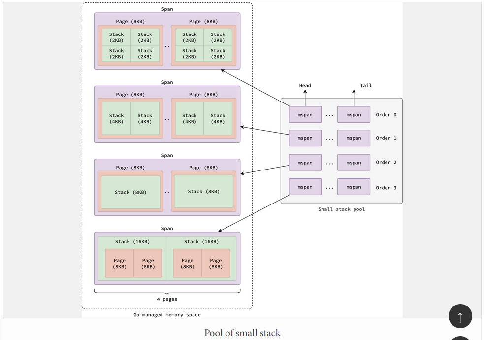

Когда запрашивается стек, размером менее 32 КБ, среда выполнения сначала
определяет соответствующий порядок на основе запрошенного размера. Затем
она проверяет начало связанного списка для этого порядка, чтобы найти
доступный спан. Если доступного спана нет, она запрашивает его у mheap
(см. раздел «Выделение спана») и разбивает его на стеки требуемого
порядка. Как только спан готов, среда выполнения берет первый доступный
стек, обновляет метаданные спана и возвращает стек.

**Крупный пул стеков** — это просто связный список стеков разных
размеров, каждый стек содержится в классе спана 0. Когда запрашивается
стек, равный или больший 32 КБ, из списка извлекается первый стек и
возвращается. Если список пуст, новый спан запрашивается у mheap (см.
раздел «Выделение спана»).

Обратите внимание, что поскольку пулы стеков являются глобальными, они
могут быть доступны несколько потокам одновременно. Поэтому они защищены
блокировкой мьютекса для обеспечения потокобезопасности в ущерб
пропускной способности.

**Выделение стека из кэша**

Для уменьшения конфликтов блокировок при выделении стека, каждый
процессор поддерживает собственный **кэш стеков (stack cache)** в своем
mcache. Подобно малому пулу стеков, кэш стеков представляет собой массив
из четырех элементов, состоящий из односвязных списков свободных стеков,
каждый элемент которого соответствует порядку стека.

При обработке запроса на выделение малого стека, среда выполнения
сначала проверяет кэш стеков текущего процессора на наличие свободного
стека. Если такого стека нет, она пополняет кэш, запрашивая несколько
стеков из малого пула, кэширует их и возвращает первый. Крупные стеки не
обслуживаются из кэша стеков, они всегда выделяются непосредственно из
крупного пула.

**Расширение стека: morestack**

Исторически в Go использовался **сегментированный (segmented)** стек.
Каждая горутина начинает с малого стека. Если вызов функции требует
больше стекового пространства, чем доступно в текущем, выделяется новый
стек и связывается с предыдущим. После возврата функции, новый стек
освобождается, а выполнение кода продолжается на предыдущем стеке. Этот
процесс называется **разделением стека (stack split)**.

Если указатель стека достигает определенного лимита (**защиты стека
(stack guard)**), вызовы read или process могут привести к разделению
стека. Пожалуйста, обратите внимание, что стек горутины при таком
подходе может состоять из несмежных областей памяти.

Однако у подхода с сегментированным стеком была проблема
производительности, известная как проблема **горячего разделения стека
(hot stack split)**. Если функции требуется многократное выделение и
освобождение стеков в рамках плотного цикла, весь процесс приводит к
значительному снижению производительности. После возврата функции, вновь
выделенный стек освобождается. Поскольку каждое разделение стека
занимает 60 наносекунд, эта проблема приводит к значительным накладным
расходам, так как происходит на каждой итерации цикла.

Один из способов избежать этой проблемы — добавить **заполнение
(padding)** в стек функций, которые часто вызываются внутри циклов. Мы
можем выделить фиктивные локальные переменные, чтобы увеличить размер
стека и тем самым уменьшить вероятность разделения стека. Но с точки
зрения разработки, это чревато ошибками и снижает читаемость кода.

Для решения проблемы горячего разделения стека, Go после версии 1.4
переходит к подходу, называемому **непрерывными стеками (contiguous
stacks)**. Когда необходимо увеличить стек горутины, выделяется новый
стек, вдвое больший, чем текущий. Содержимое текущего стека копируется в
новый, и горутина переключается на его использование. Он не уменьшается
при недостаточном использовании (например, после завершения первой
итерации). Такое поведение помогает смягчить проблему горячего
разделения.

Однако, если стеки горутин никогда не уменьшаются, память может быть
потрачена впустую, когда она значительно увеличивается во время пиковой
нагрузки, но позже большая ее часть остается неиспользованной.
Фактически, при использовании схемы непрерывного стека стек горутин
уменьшается во время сборки мусора, а не при возврате функции. Если
общий размер используемого стека меньше четверти текущего размера стека,
выделяется новый стек, вдвое меньший, чем текущий. Содержимое текущего
стека копируется в новый, и горутина переключается на его использование.
См. shrinkstack.

Для увеличения стека в прологи функций добавляются некоторые проверки.
Эта проверка, по сути, представляет собой инструкцию ЦП и потребляет
ресурсы ЦП при выполнении. Для небольших часто вызываемых функций эти
накладные расходы могут быть значительными. Для уменьшения этих расходов
небольшие функции помечаются директивой **//go:nosplit**, которая
указывает компилятору не вставлять проверки на увеличение размера стека
в их прологи.

Не путайте. Split (разделение) в //go:nosplit звучит похоже на
разделение стека в подходе с сегментированным стеком, но на самом деле
это означает проверку на увеличение стека в подходе с непрерывным
стеком.

При вызове функции указатель стека уменьшается на размер кадра стека
функции. Затем он сравнивается с **защитой стека (stack guard)**,
определяющей необходимость расширения стека. Защита стека состоит из
двух частей: **StackNosplitBase и StackSmall**. В Linux это размещает
защиту на расстоянии 928 байт над дном стека — 800 байт для
StackNosplitBase и 128 байт для StackSmall.

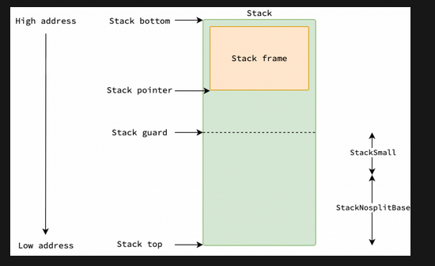

Но **переполнение (overflow)** означает, что указатель стека выходит за
пределы стека, так почему указатель стека сравнивается с защитой стека,
а не с его дном?

Во-первых, поскольку Go позволяет функциям не выполнять проверки
увеличения стека, помечая их с помощью //go:nosplit, необходимо
зарезервировать пространство, равное StackNosplitBase, чтобы обеспечить
их безопасное выполнение без обращения к недействительным адресам.
Например, весь кадр стека **morestack**, которая обрабатывает увеличение
стека, должен помещаться в выделенном стеке.

Во-вторых, это является оптимизацией для небольших функций, кадр стека
которых меньше StackSmall. При вызове таких функций Go не утруждает себя
уменьшением указателя стека и его сравнением с защитой стека. Вместо
этого, он просто проверяет, находится ли текущий указатель стека ниже
защиты, экономя одну инструкцию ЦП на каждый вызов функции за счет
пропуска корректировки указателя стека.

**Повторное использование стека: stackfree**

После завершения выполнения горутины, уменьшении стека горутины из-за
избытка свободного пространства или выходе системного потока,
управляемого Go, их стеки помечаются как **повторно используемые
(reusable)**. Если горутина подключена к процессору P, и кэш стека P
достаточно маленький, ее стек возвращается в кэш стека P. Иначе, стек
возвращается в глобальный пул: либо в малый с соответствующим порядком,
либо в крупный, в зависимости от размера стека. После возврата стека в
глобальный пул, соответствующая страница памяти возвращается ядру, если
не выполняется сборка мусора.

**Максимальный размер стека**

Предельный размер, до которого может вырасти стек горутины, не является
неизменной константой. Вплоть до Go 1.21 максимальный размер
по умолчанию составлял 1 ГБ, чего было достаточно для
подавляющего большинства рабочих нагрузок. Начиная с Go 1.22 этот лимит
стал привязан к общему объёму адресного пространства, доступного процессу:
на 64-битных системах стек горутины по умолчанию способен вырасти
вплоть до 1 ТБ, что практически снимает искусственные лимиты
для самых ресурсоёмких вычислений. Помимо этого, разработчик
может явно управлять предельным размером через вызов **debug.SetMaxStack**.
Функция принимает желаемый лимит в байтах и позволяет как дополнительно увеличить потолок сверх значения по умолчанию, так и намеренно занизить его,
чтобы быстрее обнаруживать утечки рекурсивного роста стека
в отладочных целях. Вызов влияет на все будущие расширения стека
в программе, но не затрагивает уже работающие горутины.
Сам же механизм роста остаётся прежним: горутина стартует
с минимального стека в 2 КБ, и каждый раз, когда она упирается в его границу,
рантайм удваивает выделенную область, копируя туда старый стек.
Так продолжается до тех пор, пока либо потребности функции
не будут удовлетворены,  либо стек не достигнет установленного лимита.
При попытке превысить этот лимит среда выполнения аварийно
завершает программу с паникой, сигнализируя о фатальном переполнении стека.

***

> **Зачем это Go-разработчику.** Стеки горутин начинаются с 2 КБ и растут динамически (continuous stacks). Это позволяет запускать миллионы горутин без гигантского расхода памяти. Понимание механизма stack guard, morestack и shrinkstack помогает диагностировать проблемы с глубиной рекурсии и накладными расходами на копирование стека.

## 22. Анализ выхода (escape analysis)

Вы можете думать, что var n T всегда выделяется в стеке, а new(T) или
\&T{} всегда выделяет объект типа T в куче. Но это не всегда так.
Рассмотрим несколько гипотетических примеров.

Рассмотрим следующую программу, которая определяет функцию getUserByID,
извлекающую данные пользователя по его идентификатору. Предположительно,
getUserByID выделяет структуру User в стеке, извлекает данные
пользователя из базы данных и возвращает адрес этой структуры (указатель
на нее).

```go
func getUserByID(id int64) *User {
    var user User
    user = db.FindUserByID(id)
    return &user
}

func main() {
    var userID int64 = 1
    var user *User = getUserByID(userID)
    var userAge = user.age
    user.age = userAge + 1
}

```

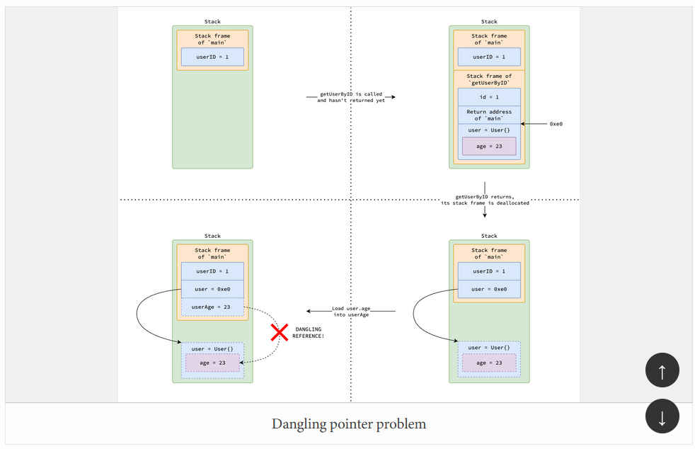

При вызове функции getUserByID, переменная user помещается по адресу
0xe0 в ее кадре стека. После возврата функции, user по-прежнему
удерживает 0xe0, но этот адрес больше не является валидным, поскольку
кадр стека getUserByID был удален (popped). Когда main пытается получить
user.age, происходит **разыменование (deferencing)** невалидного адреса,
что приводит к **проблеме висячего указателя** и неопределенному
поведению.

Для предотвращения таких проблем Go применяет технику под названием
**«анализ выхода» (escape analysis)** в процессе компиляции. Анализ
выхода определяет, может ли переменная (объявленная с помощью var n T,
new(T), \&T{} или make(T)) быть безопасно выделена в стеке горутины или
должна **«уйти» (escape)** в кучу. Если выясняется, что на переменную
ссылаются вне ее функции, она выделяется в куче, чтобы гарантировать
безопасный доступ к ней после возврата функции.

В примере выше переменная user распознается, как «уходящая» в кучу,
поскольку ее адрес возвращается и используется в main. Поэтому
компилятор выделяет user в куче для предотвращения проблемы висячего
указателя.

Анализ выхода также пытается держать переменные в стеке, даже если
обычно они выделяются в куче (например, переменные, создаваемые с
помощью new(T), \&T{} или make(T)), до тех пор, пока они используются
только внутри своей функции и потребляемая ими память не превышает
MaxImplicitStackVarSize во время компиляции.

Вы можете убедиться в таком поведении, скомпилировав программу с
настройкой -gcflags="-m", которая укажет компилятору напечатать
решения по оптимизации, включая результаты анализа выхода.

```go
package main

type User struct { ID int64 }

func newUser(id int64) *User {
    user := User{ID: id}
    return &user
}

func main() {
    _ = newUser(20250603)
    _ = make([]User, 100)
}

// $ go build -gcflags="-m" main.go
// ./main.go:6:2: moved to heap: user
// ./main.go:12:10: make([]User, 100) does not escape

```

Мы видим, что переменная user перемещена в кучу, поскольку она
используется в функции main после возврата функции newUser, а срез,
созданный с помощью make(\[]User, 100) оставлен в стеке, поскольку он
используется только в main и его размер меньше, чем
**MaxImplicitStackVarSize (= int64(64 \* 1024) или 64 КБ)**.

### Основные причины ухода в кучу

Escape analysis принимает решение на основе того, может ли переменная быть доступна после возврата функции. Вот типичные сценарии, заставляющие переменную уйти в кучу:

* **Возврат указателя:** если функция возвращает указатель на локальную переменную — это гарантированный уход в кучу.
* **Запись в интерфейс:** присвоение конкретного значения переменной интерфейсного типа часто вызывает уход, поскольку интерфейс хранит указатель на нижележащие данные.
* **Замыкание (closure):** если переменная захватывается замыканием, она должна пережить функцию, в которой объявлена.
* **Хранение в глобальных переменных или структурах, видимых снаружи:** любое значение, помещённое в глобальную карту, слайс или поле экспортируемой структуры, уходит в кучу.
* **Передача в канал:** указатель на значение, отправленное в канал, должен быть доступен принимающей горутине — уход в кучу.
* **Размер больше MaxImplicitStackVarSize (64 КБ):** переменные стека не могут превышать этот лимит.

### Как читать вывод -gcflags="-m"

Флаг `-gcflags="-m"` включает вывод решений escape analysis. Двойной флаг `-m -m` даёт ещё более подробный вывод. Основные маркеры:

* `moved to heap` — переменная ушла в кучу.
* `does not escape` — переменная осталась в стеке.
* `leaking param` — параметр функции «утекает» (сохраняется куда-то вне функции).

***

> **Зачем это Go-разработчику.** Профилирование аллокаций (pprof allocs) часто показывает неожиданные источники нагрузки на кучу. Типичные «сюрпризы»: приведение \[]byte к string в горячем пути (аллокация), создание замыканий в циклах, boxing в interface{}. Проверка `-gcflags="-m"` на критических участках кода — дешёвый способ найти лишние аллокации до запуска бенчмарков
> **Зачем это Go-разработчику.** Escape analysis — возможно, самая важная оптимизация компилятора Go с точки зрения производительности. Переменная в стеке «бесплатна» (сдвиг SP), в куче — влечёт аллокацию и GC-нагрузку. Умение читать вывод `-gcflags="-m"` и понимать, что заставляет переменную «уходить» в кучу, — навык, напрямую влияющий на пропускную способность и задержки ваших сервисов.

.

## 23. Аллокатор и сборщик мусора

### Mark-and-sweep и триколор

Сборщик мусора Go работает по принципу **«пометить и очистить» (mark-and-sweep)**. Он использует **триколорную (tricolor)** абстракцию:

* **Белые** объекты — ещё не просмотренные, кандидаты на удаление.
* **Серые** объекты — обнаружены как достижимые, но их поля ещё не просканированы на наличие указателей на другие объекты.
* **Чёрные** объекты — достижимые и полностью просканированные.

В конце цикла GC все белые объекты считаются недостижимыми, и занимаемая ими память возвращается рантайму через sweep.

### Роль классов спана (scan/noscan) для GC

Как описано в разделе 14, спаны делятся на scan (содержат указатели) и noscan (без указателей). Во время mark-фазы GC:

* **noscan-спаны** полностью пропускаются — сборщик мусора знает, что в них нет указателей на другие объекты.
* **scan-спаны** сканируются с использованием heap bitmap (< 512 байт) или malloc header (≥ 512 байт), чтобы найти все указатели точно и без обхода всех полей.

Эта оптимизация критична: большая часть данных в типичном Go-приложении (числа, строки без указателей, \[]byte) попадает в noscan-спаны и не нагружает GC.

### Write barrier

**Write barrier (барьер записи)** — ключевой механизм, обеспечивающий корректность конкурентной сборки мусора. Когда горутина изменяет указатель в объекте во время mark-фазы, write barrier перехватывает эту запись и помечает целевой объект как серый. Без этого механизма GC мог бы пропустить только что добавленную ссылку и ошибочно удалить живой объект.

Write barrier включается только на время mark-фазы. В обычном режиме работы программы он отключён и не влияет на производительность.

### Sweep и возврат памяти

После mark-фазы наступает **sweep (очистка)**. В процессе sweep:

1. Спан извлекается из unswept-множества mcentral.
2. Все объекты, оставшиеся белыми (недостижимые), освобождаются.
3. Спан помещается в swept-множество.

Если спан становится полностью пустым, его страницы возвращаются в mheap, а в некоторых случаях — ядру через munmap (scavenger). Если в спане остались живые объекты, он возвращается в partial- или full-множество mcentral для повторного использования аллокатором.

Этот процесс выполняется инкрементально: не все спаны очищаются сразу, что позволяет распределить нагрузку и избежать длинных пауз.

***

> **Зачем это Go-разработчику.** Главный рычаг управления GC — не настройки GOGC, а снижение темпа аллокаций. Каждый байт, выделенный в куче, рано или поздно должен быть собран. Структуры без указателей (noscan), переиспользование объектов (sync.Pool), аллокация в стеке через escape analysis — всё это снижает GC-нагрузку напрямую
> **Зачем это Go-разработчику.** Сборщик мусора и аллокатор в Go спроектированы как единая система. Разделение спанов на scan/noscan, sweep-процесс, возвращающий неиспользуемые объекты в mcentral, и write barrier — всё это части одного механизма. Понимание их взаимодействия объясняет, почему GC в Go имеет низкие паузы и как на них влиять через управление аллокациями.

.

## 24. Инструменты профилирования памяти

### runtime.MemStats

`runtime.ReadMemStats(&m)` заполняет структуру `runtime.MemStats` детальной статистикой о состоянии памяти:

| Поле           | Значение                                         |
| -------------- | ------------------------------------------------ |
| `Alloc`        | Текущий объём выделенной кучи (байт)             |
| `TotalAlloc`   | Суммарный объём всех выделений с момента запуска |
| `Sys`          | Память, запрошенная у ОС                         |
| `HeapAlloc`    | Аналог Alloc, байты в куче                       |
| `HeapSys`      | Память, запрошенная у ОС для кучи                |
| `HeapIdle`     | Свободные страницы в куче                        |
| `HeapInuse`    | Используемые страницы в куче                     |
| `HeapReleased` | Страницы, возвращённые ОС                        |
| `StackInuse`   | Память под стеки горутин                         |
| `StackSys`     | Память, запрошенная у ОС для стеков              |
| `NumGC`        | Количество завершённых циклов GC                 |
| `PauseTotalNs` | Суммарное время пауз GC (нс)                     |

Важно: `ReadMemStats` вызывает stop-the-world паузу. В production используйте его эпизодически или через pprof.

### pprof heap profile

`net/http/pprof` и `runtime/pprof` предоставляют профили кучи:

```go
import _ "net/http/pprof"

```

Основные конечные точки:

* `/debug/pprof/heap` — снапшот кучи (live objects).
* `/debug/pprof/allocs` — все аллокации с момента запуска.
* `/debug/pprof/goroutine` — стек всех горутин.

В терминале анализ выполняется через `go tool pprof`:

```

go tool pprof -http=:8080 http://localhost:6060/debug/pprof/heap

```

Ключевые визуализации в pprof:

* **top** — функции, потребляющие больше всего памяти.
* **flame graph** — иерархия вызовов с аллокациями.
* **source** — построчный просмотр аллокаций в исходном коде.

### GODEBUG=gctrace=1

Переменная окружения `GODEBUG=gctrace=1` выводит статистику каждого цикла GC:

```

gc 1 @0.008s 0%: 0.018+0.21+0.042 ms clock, 0.14+0.12/0.20/0.25+0.33 ms cpu, 4->4->0 MB, 5 MB goal, 8 P

```

Расшифровка:

* `gc 1` — номер цикла GC.
* `@0.008s` — время от старта программы.
* `0%` — доля CPU, потраченная на GC.
* `0.018+0.21+0.042 ms` — фазы: STW mark start + concurrent mark + STW mark termination.
* `4->4->0 MB` — размер кучи: до GC → после GC → живых объектов.
* `5 MB goal` — целевой размер кучи для следующего цикла.

### Трассировка аллокаций

`runtime/trace` позволяет записать трассу выполнения, включающую все аллокации и события GC:

```go
f, _ := os.Create("trace.out")
trace.Start(f)
// ... код приложения ...
trace.Stop()

```

Просмотр: `go tool trace trace.out`. Показывает временную шкалу горутин, кучу и GC на одном графике.

***

> **Зачем это Go-разработчику.** Три команды, которые должен знать каждый Go-разработчик для диагностики памяти: `go tool pprof -http=:8080 /debug/pprof/heap` (что в куче сейчас), `GODEBUG=gctrace=1 ./myapp` (как часто и дорого GC), `-gcflags="-m"` (куда уходят переменные)
> **Зачем это Go-разработчику.** Без инструментов все знания об устройстве памяти остаются теорией. pprof, runtime.MemStats и GODEBUG-трейсы — это то, чем вы будете пользоваться ежедневно для диагностики утечек, избыточных аллокаций и аномалий GC в продакшене.

.

## 25. Итоговое резюме

Распределитель памяти Go — это трёхуровневая система, в которой каждый уровень оптимизирован под свою задачу:

| Компонент    | Уровень                      | Единица выделения             | Блокировка                      | Роль                                     |
| ------------ | ---------------------------- | ----------------------------- | ------------------------------- | ---------------------------------------- |
| **mcache**   | Процессор P                  | Объект (tiny/small)           | Без блокировок                  | Кэш спанов для горутин данного P         |
| **mcentral** | Глобальный, по классам спана | Спан (объекты одного размера) | Lock-free span sets             | Менеджер спанов одного класса            |
| **mheap**    | Глобальный                   | Страницы / Large объекты      | Глобальная (смягчена pageCache) | Управление виртуальной памятью и аренами |

Полный путь объекта от выделения до освобождения:

1. **Выделение:** горутина вызывает `new(T)` или `&T{}` → компилятор решает (escape analysis) стек или куча → если куча: `mallocgc` → mcache (tiny/small) или mheap (large) → при нехватке: mcache запрашивает спан у mcentral → mcentral запрашивает страницы у mheap → mheap при необходимости растёт через mmap.
2. **Использование:** объект живёт в спане определённого класса. GC знает, содержит ли он указатели (scan/noscan), и использует heap bitmap или malloc header для точного сканирования.
3. **Сборка мусора:** mark-фаза находит все достижимые объекты (триколор, write barrier). Sweep-фаза освобождает недостижимые, возвращая спаны в mcentral.
4. **Возврат ОС:** полностью пустые спаны могут быть возвращены ядру через munmap (scavenger).

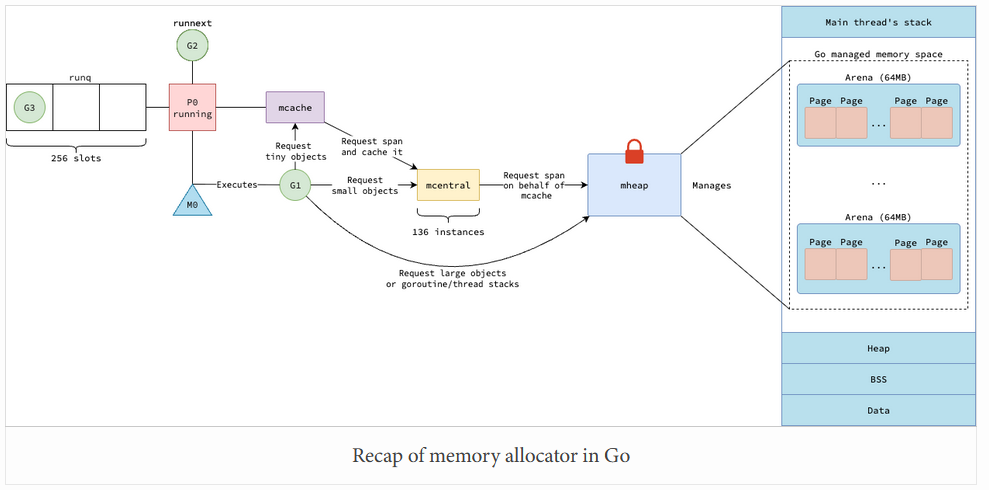

**Ключевые выводы для Go-разработчика:**

* Размер объекта определяет путь аллокации: tiny (< 16 байт) — самый дешёвый (пакуются в mcache), small (16–32 КБ) — через mcache/mcentral, large (> 32 КБ) — напрямую в mheap.

* Наличие указателей в типе (scan vs noscan) влияет на GC-нагрузку: структуры без указателей не сканируются сборщиком мусора.
* Escape analysis — главный рычаг управления аллокациями: `-gcflags="-m"` показывает, что уходит в кучу.
* Стеки горутин начинаются с 2 КБ и растут динамически, что делает миллионы горутин практичными.
* pprof, GODEBUG и trace — основные инструменты диагностики памяти в production.

**Ссылки:**

[habr.com](https://habr.com/ru/articles/981844/)

[habr.com](https://habr.com/ru/companies/timeweb/articles/1000232/)

[nghiant3223.github.io](https://nghiant3223.github.io/2025/05/29/fundamental_of_virtual_memory.html)

[nghiant3223.github.io](https://nghiant3223.github.io/2025/06/03/memory_allocation_in_go.html)

[habr.com](https://habr.com/ru/companies/oleg-bunin/articles/676332/)
