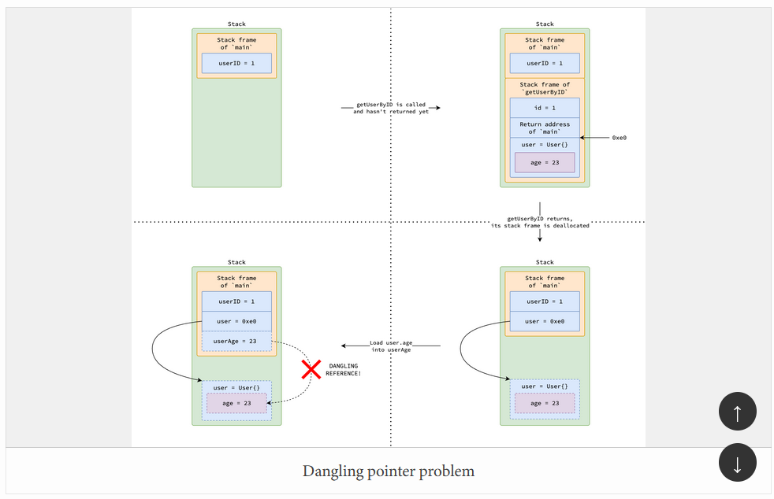

# Память в Go: модель и диагностика

> **Проверено:** Go 1.27 · **Уровень:** младший разработчик — углублённый

**Перед чтением:** указатели, структуры, горутины и основы работы процессов.
**После главы:** вы сможете отличить рост живой кучи от высокого темпа выделений
и роста RSS, снять подходящий профиль и проверить гипотезу повторным измерением.
[Задания и самопроверка](../../practice.md#memory).

Эта страница содержит обязательную практическую модель. Внутреннее устройство
разнесено по отдельным материалам:

| Продолжение | Когда читать |
|---|---|
| [Виртуальная память процесса](virtual-memory.md) | Нужно понять страницы, RSS, отображения и возврат памяти ОС |
| [Аллокатор Go 1.27](allocator.md) | Нужно разобраться в аренах, спанах, классах размера и путях выделения |
| [Стеки горутин](stacks.md) | Нужно понять рост стеков и память большого числа горутин |
| [Диагностика памяти](diagnostics.md) | Нужно исследовать реальную службу или тест производительности |
| [Версионный справочник](runtime-reference.md) | Нужны точные внутренние имена и пороги Go 1.27 |
| [Выравнивание структур](Выравнивание/alignment.md) | Нужно вычислить размер и смещения полей |

## Минимальная модель

### Значение и объект — не одно и то же

**Значение** — результат вычисления определённого типа. **Объект** — область
памяти, в которой значение или его данные хранятся во время выполнения. Например,
значение среза содержит указатель, длину и вместимость, а его элементы обычно
находятся в отдельном массиве.

Компилятор может:

- хранить значение в регистрах;
- разместить его в кадре стека горутины;
- выделить объект в куче Go;
- полностью устранить хранение как результат оптимизации.

Наличие `new`, `make`, `&value` или локального объявления само по себе не отвечает
на вопрос о размещении. Компилятор анализирует время жизни и контекст вызовов.



На схеме показана проблема, которую должен предотвратить компилятор. Это не
означает, что любой возврат указателя обязательно создаёт объект в куче: после
встраивания функции весь объект иногда остаётся в стеке вызывающей функции или
устраняется. Фактическое решение проверяйте в разделе
[об анализе времени жизни](../Компиляция%20и%20оптимизации%20Go/Анализ%20времени%20жизни/escape-analysis.md).

### Стек, куча и память процесса

- **Стек горутины** хранит кадры активных вызовов. Он начинается с небольшого
  размера, растёт копированием и может уменьшаться.
- **Куча Go** хранит объекты, время жизни которых нельзя ограничить подходящим
  кадром стека. Недостижимые объекты освобождает сборщик мусора.
- **Память среды выполнения** включает также метаданные, стеки, таблицы и другие
  служебные структуры.
- **RSS (Resident Set Size — размер резидентного набора)** — объём памяти,
  занимаемый страницами процесса, находящимися в физической памяти. В него
  входят не только объекты кучи Go, но и стеки, код, внешние библиотеки,
  отображённые файлы и ещё не возвращённые ОС страницы.
- **Потребление контейнера** дополнительно определяется правилами cgroup и может
  отличаться от RSS отдельного процесса.

Сборщик мусора освобождает недостижимые объекты Go, но не завершает горутины, не
закрывает файлы и не освобождает память, которой напрямую управляет библиотека C.

## Какие величины нельзя смешивать

| Вопрос | Величина | Источник |
|---|---|---|
| Сколько памяти пережило последнюю сборку? | `/gc/heap/live:bytes` | `runtime/metrics` |
| Сколько байтов сейчас занято объектами кучи? | `/memory/classes/heap/objects:bytes` | `runtime/metrics` |
| Сколько байтов было выделено с запуска? | `/gc/heap/allocs:bytes` | `runtime/metrics` |
| Где находятся удерживаемые выборкой объекты? | `inuse_space` | профиль `heap` |
| Где происходили выборочные выделения? | `alloc_space` | профиль `allocs` или `heap` |
| Сколько физической памяти связано с процессом? | RSS | ОС или система наблюдения |
| Сколько памяти учитывает контейнер? | `memory.current` | cgroup v2 |
| Каков жёсткий предел контейнера? | `memory.max` | cgroup v2 |

Профили памяти используют выборку. Профиль `heap` в основном отражает состояние
на момент последней завершённой сборки мусора и по умолчанию показывает
`inuse_space`. Профиль `allocs` использует те же накопленные данные, но по
умолчанию выбирает `alloc_space`. Это не полный перечень каждого объекта.

## Диагностическое дерево

Начинайте не с изменения кода, а с вида наблюдаемого роста:

| Наблюдение | Первая проверка | Вероятные направления |
|---|---|---|
| Растёт живая куча | `heap` с `inuse_space` | кэш без ограничения, очередь, глобальная ссылка, замыкание |
| Живая куча стабильна, но выделений много | `allocs` с `alloc_space` и `-benchmem` | временные буферы, преобразования, упаковка в интерфейс |
| Растёт число горутин | профили `goroutine` и `goroutineleak` | незавершённая работа, ожидание канала или блокировки |
| RSS растёт быстрее кучи | метрики классов памяти, RSS и cgroup | стеки, cgo, отображения, фрагментация, возврат страниц |
| Процесс достигает предела контейнера | `memory.current`, `memory.max`, `GOMEMLIMIT` | слишком малый запас, внешняя память, всплеск живых данных |

`GOMEMLIMIT` и `debug.SetMemoryLimit` задают мягкую цель для памяти, которой
управляет среда выполнения. Приближённо она соответствует `MemStats.Sys -
MemStats.HeapReleased`. Это не предел RSS: двоичный файл, память C, отображения
через системные вызовы и часть памяти ядра в него не входят.

## Рабочий процесс: от симптома к повторному замеру

### 1. Зафиксируйте условия

Запишите версию программы и Go, нагрузку, длительность наблюдения, RSS, предел
контейнера и ключевые метрики. Сравнивать два профиля без одинаковой нагрузки
почти бесполезно.

Для cgroup v2:

```bash
cat /sys/fs/cgroup/memory.current
cat /sys/fs/cgroup/memory.max
```

Для процесса Linux значение RSS можно получить так:

```bash
ps -o rss= -p "$PID"
```

### 2. Воспроизведите выделения в тесте производительности

В модуле примеров есть два контрастных сценария: удерживаемый набор объектов и
высокий темп временных выделений:

```bash
cd examples
go test ./runtimeinfo -run '^$' \
  -bench 'Benchmark(Retained|Temporary)Blocks' \
  -benchmem -count=5
```

`-benchmem` показывает выделения на операцию, но не объясняет путь вызовов. Для
этого создайте профиль:

```bash
go test ./runtimeinfo -run '^$' \
  -bench 'Benchmark(Retained|Temporary)Blocks' \
  -memprofile memory.pprof
go tool pprof -sample_index=alloc_space memory.pprof
```

В интерактивном режиме полезны команды `top`, `list AllocateBlocks` и
`sample_index=inuse_space`. Для сравнения двух снимков используйте базовый
профиль:

```bash
go tool pprof -base before.pprof after.pprof
```

Ожидаемая интерпретация примера: в `inuse_space` виден набор, оставленный
`BenchmarkRetainedBlocks`, а в `alloc_space` преобладают повторные выделения из
`BenchmarkTemporaryBlocks`. Точные числа зависят от длительности замера и
выборки; важна разница между удержанием и накопленным потоком выделений.

### 3. Снимите профиль службы безопасно

Минимальная самостоятельная программа привязывает диагностический сервер только
к адресу обратной связи:

```go
package main

import (
	"log"
	"net/http"
	_ "net/http/pprof"
)

func main() {
	log.Fatal(http.ListenAndServe("127.0.0.1:6060", nil))
}
```

Получение профиля:

```bash
go tool pprof -http=127.0.0.1:8080 \
  http://127.0.0.1:6060/debug/pprof/heap
```

В рабочей среде используйте отдельный административный интерфейс, сетевое
ограничение и защищённый туннель. Не публикуйте `/debug/pprof/` в общий Интернет.
Параметр `gc=1` у конечной точки кучи принудительно запускает сборку и меняет
наблюдаемую программу, поэтому применяйте его осознанно.

Частоту выборки задаёт `runtime.MemProfileRate`. Значение по умолчанию подходит
для большинства расследований. Увеличение точности повышает накладные расходы и
должно происходить в контролируемом эксперименте.

### 4. Проверьте горутины и внешние ресурсы

В Go 1.27 профиль `goroutineleak` обнаруживает часть горутин, которые уже не
могут быть разблокированы:

```bash
curl 'http://127.0.0.1:6060/debug/pprof/goroutineleak?debug=1'
```

Он не доказывает отсутствие всех утечек: например, примитив ожидания может
оставаться достижимым через глобальную переменную. Сопоставляйте результат с
обычным профилем `goroutine`, числом открытых дескрипторов и прикладными очередями.

Файлы, сокеты и транзакции закрывайте явно. `runtime.AddCleanup`, слабые указатели
и финализаторы не гарантируют время запуска и не заменяют `Close`.

### 5. Измените одну причину и измерьте снова

Хорошая гипотеза проверяема: например, «кэш удерживает ответы без ограничения».
Добавьте предел, повторите ту же нагрузку и сравните метрики и профили. Снижение
RSS без изменения живой кучи не доказывает исправление удержания, а снижение
`alloc_space` не доказывает уменьшение долговременной памяти.

## Типичные ошибки

- Делать вывод об утечке только по RSS.
- Оптимизировать каждый объект, упомянутый в отчёте компилятора.
- Считать `new(T)` синонимом кучи, а локальную переменную — гарантией стека.
- Использовать `runtime.GC` или `debug.FreeOSMemory` как постоянное лечение роста.
- Сравнивать профили, снятые при разной нагрузке или с разной частотой выборки.
- Считать мягкий предел Go заменой пределу контейнера.

## Основные источники

- [Документация `runtime/metrics`](https://pkg.go.dev/runtime/metrics).
- [Документация `runtime/pprof`](https://pkg.go.dev/runtime/pprof).
- [Диагностика программ Go](https://go.dev/doc/diagnostics).
- [Руководство по сборщику мусора](https://go.dev/doc/gc-guide).
- [Примечания к выпуску Go 1.27](https://go.dev/doc/go1.27).

## Краткий итог

- Живая куча, накопленные выделения, RSS и потребление контейнера отвечают на
  разные вопросы.
- Профиль памяти является выборочным; его нужно сопоставлять с метриками и
  условиями нагрузки.
- Надёжный порядок работы: измерение, профиль, проверяемая гипотеза, одно
  изменение и повторный замер.

Дальше: разберите [аллокатор Go 1.27](allocator.md), [стеки горутин](stacks.md)
или перейдите непосредственно к [практической диагностике](diagnostics.md).
