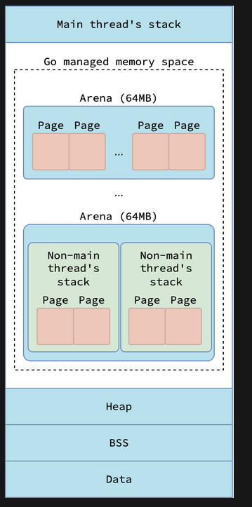
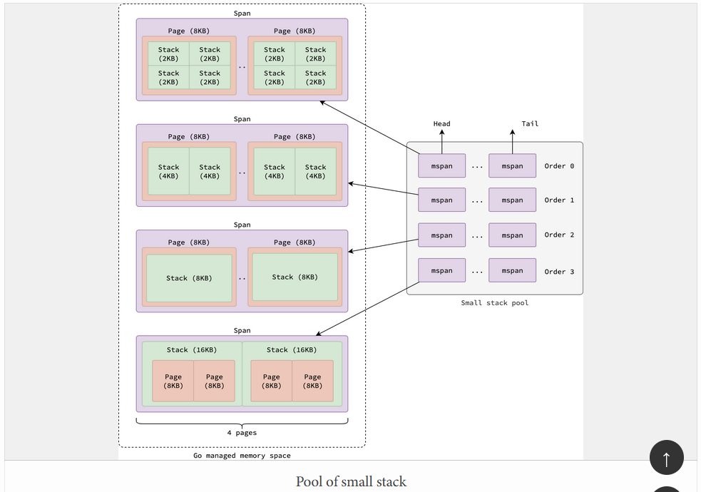
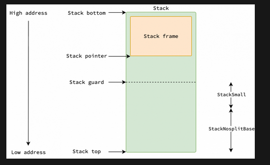

# Стеки горутин в Go 1.27

> **Проверено:** Go 1.27.0
>
> **Перед чтением:** вызовы функций и [модель GMP](../Планировщик%20Go/gmp.md).
>
> **После чтения:** вы сможете различить стек горутины и системный стек, объяснить рост копированием и диагностировать расход памяти.
>
> **Практика:** [задания и самопроверка](../../practice.md#memory).

## Два вида стеков

У каждой горутины G есть собственный стек с кадрами Go-функций. У каждого
потока M есть специальная горутина `g0`; её стек называют системным. На нём
среда выполнения выполняет операции, которым нельзя увеличивать текущий стек,
например выделение нового стека горутины.



Системный стек не является общей кучей кадров всех горутин. При переключении G
поток начинает использовать её указатель стека; при входе в `systemstack`
переходит на стек `g0`.

## Начальный размер

Минимум `stackMin` в Go 1.27 равен 2 КБ. На `linux/amd64` минимальный
выделяемый `fixedStack` также равен 2 КБ. На некоторых системах добавляется
место для обработки сигналов, после чего размер округляется до степени двойки.

Переменная `startingStackSize` изначально равна `fixedStack`, но после каждой
сборки мусора может адаптироваться к среднему размеру просканированных стеков.
Это уменьшает число ранних расширений в программах с более глубокими стеками.

Практическая оценка памяти горутин должна учитывать:

- фактический начальный размер в работающем процессе;
- используемую часть и свободное место каждого стека;
- служебные структуры горутин;
- объекты кучи, достижимые из кадров стека;
- системные стеки потоков ОС.

Метрика `/gc/stack/starting-size:bytes` показывает текущий начальный размер, а
`/memory/classes/heap/stacks:bytes` — память, полученную для стеков горутин из
кучи среды выполнения.

## Выделение малых и больших стеков

`stackalloc` работает на системном стеке. Малые стеки обслуживаются через кэш
текущего P и глобальные пулы по порядкам размеров. На обычной Unix-сборке без
особых условий используются порядки 2, 4, 8 и 16 КБ; точное число порядков
зависит от платформы.



Если стек слишком велик для малого кэша, для него выделяется отдельный спан.
`stackLarge.free` — массив списков: индекс выбирается по двоичному логарифму
числа страниц. Это предотвращает выдачу стека неподходящего размера из общего
смешанного списка.

При активной сборке мусора, отсутствии P или запрете вытеснения среда выполнения
может обойти кэш P и обратиться к глобальному пулу.

## Проверка стека и защитная граница (stack guard)

**Stack guard (защитная граница стека)** — пороговый адрес, с которым сравнивают
указатель стека `SP`, чтобы обнаружить нехватку места до выхода за выделенный
диапазон. В обычном состоянии поле `g.stackguard0` вычисляется так:

```text
g.stackguard0 = g.stack.lo + stackGuard
```

Здесь `g.stack.lo` — нижний адрес выделенного стека, а `stackGuard` — размер
защитного запаса. На распространённых архитектурах стек растёт в сторону меньших
адресов: по мере добавления кадров `SP` приближается к защитной границе.

Граница не совпадает с физическим концом стека и не является недоступной страницей
памяти ОС. Между ней и нижним адресом оставлен запас для цепочки вызовов без
проверки стека и служебного пути расширения. Конкретная проверка учитывает размер
кадра: для малого кадра достаточно сравнить `SP` с границей, для большего нужна
поправка на требуемое место.

Большинство Go-функций начинает работу с проверкой, достаточно ли свободного
места для следующего кадра и безопасной цепочки функций без проверки стека.
Если места недостаточно, управление до выполнения тела функции переходит к
`morestack`, а затем к `newstack`.



`//go:nosplit` запрещает обычную проверку в конкретной функции и предназначена
прежде всего для низкоуровневого кода среды выполнения. Это не способ ускорять
прикладные функции: компоновщик проверяет допустимую цепочку таких вызовов, а
ошибка способна оставить недостаточно места для аварийного пути.

Поле `stackguard0` также используется для кооперативного вытеснения: среда
выполнения может записать в него специальное значение `stackPreempt`, чтобы
следующая проверка передала управление служебному коду. Поэтому переход к
`morestack` не всегда означает, что стек действительно нужно увеличить.

Числовые размеры защитной области зависят от архитектуры, ОС и внутренних
констант версии. Для прикладной диагностики важен механизм, а не одно значение
в байтах.

## Рост непрерывного стека

Современный стек горутины занимает непрерывный диапазон. При нехватке места
`newstack` обычно:

1. выбирает размер вдвое больше текущего;
2. при необходимости увеличивает его ещё, чтобы поместился новый кадр;
3. проверяет предельный размер;
4. переводит G в состояние копирования стека;
5. выделяет новый диапазон и копирует живую часть;
6. исправляет указатели внутрь старого стека по точным картам;
7. продолжает выполнение на новом диапазоне.

Стоимость зависит от занятой части стека и расположенных там указателей. Нельзя
использовать универсальную оценку в наносекундах без теста конкретной версии и
нагрузки.

Указатели из Go-кода можно исправить, потому что компилятор создаёт карты
указателей. Системный вызов или код C способен удерживать адрес внутри стека,
поэтому копирование запрещается в небезопасные моменты.

## Уменьшение и повторное использование

Во время сборки мусора среда выполнения может уменьшить стек, если используемая
часть достаточно мала относительно доступного пространства и копирование
безопасно. Текущий стек заменяется диапазоном вдвое меньше, но не меньше
`fixedStack`.

После завершения горутины малый стек возвращается в кэш P или глобальный пул, а
большой — в список соответствующего размера. Поэтому завершение большого числа
горутин не обязано немедленно уменьшить RSS: диапазоны сначала становятся
доступны для повторного использования средой выполнения.

## Максимальный размер

Исходное значение предела, которым управляет `debug.SetMaxStack`, в Go 1.27:

- 1 ГБ на 64-разрядных системах;
- 250 МБ на 32-разрядных системах.

Это предел одного стека горутины, а не общий предел памяти процесса. Рекурсия без
достаточного условия завершения приводит к аварийному завершению процесса при
переполнении; восстановить его обычным `recover` нельзя.

`debug.SetMaxStack` следует менять только при обоснованной необходимости. Более
низкое значение ограничивает ущерб от ошибочной рекурсии, но может остановить
корректный алгоритм с глубоким стеком.

## Диагностика роста стеков

Прочитайте связанные метрики:

```go
package main

import (
	"fmt"
	"runtime/metrics"
)

func main() {
	samples := []metrics.Sample{
		{Name: "/memory/classes/heap/stacks:bytes"},
		{Name: "/gc/stack/starting-size:bytes"},
		{Name: "/sched/goroutines:goroutines"},
	}
	metrics.Read(samples)
	for _, sample := range samples {
		fmt.Printf("%s = %d\n", sample.Name, sample.Value.Uint64())
	}
}
```

Если одновременно растут память стеков и число горутин:

1. снимите обычный профиль `goroutine`;
2. в Go 1.27 проверьте `goroutineleak`;
3. найдите повторяющиеся места ожидания;
4. проверьте отмену, закрытие каналов и ограничение числа задач;
5. повторите нагрузку и сравните обе метрики.

Глубокий стек одной горутины и миллион неглубоких горутин требуют разных
исправлений, хотя оба случая могут увеличить категорию стеков.

## Краткий итог

- Стек горутины и системный стек `g0` выполняют разные роли.
- Минимум стека равен 2 КБ, но начальный размер новых горутин может адаптироваться.
- Стек растёт и уменьшается копированием; его освобождение не обязано сразу
  уменьшать RSS.

## Продолжение

Примените метрики и профили в главе
[«Диагностика памяти»](diagnostics.md).

## Источники

- [`runtime/stack.go` Go 1.27.0](https://github.com/golang/go/blob/go1.27.0/src/runtime/stack.go).
- [Документация `runtime/debug.SetMaxStack`](https://pkg.go.dev/runtime/debug#SetMaxStack).
- [Описание метрик среды выполнения](https://pkg.go.dev/runtime/metrics).
- [Профиль утечек горутин в Go 1.27](https://go.dev/doc/go1.27#runtime).
