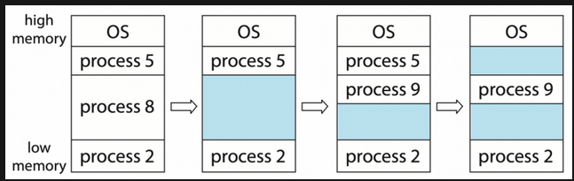
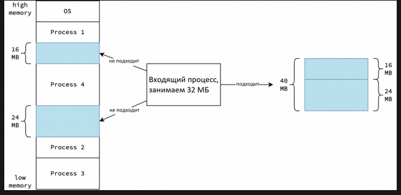
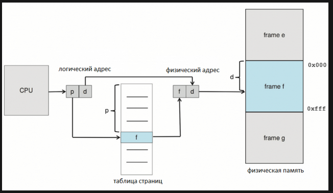
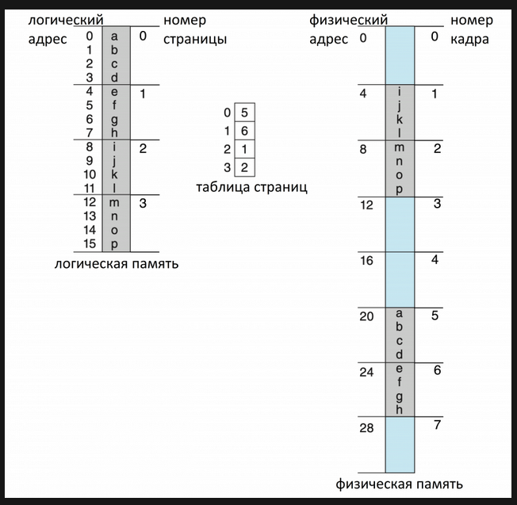
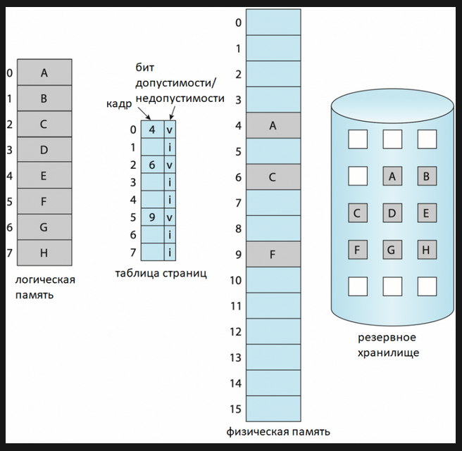
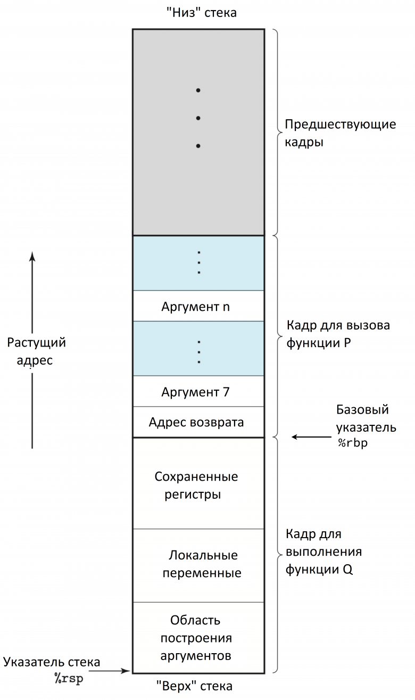
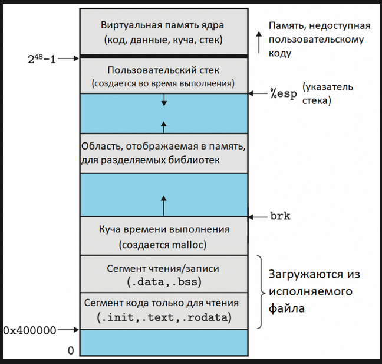
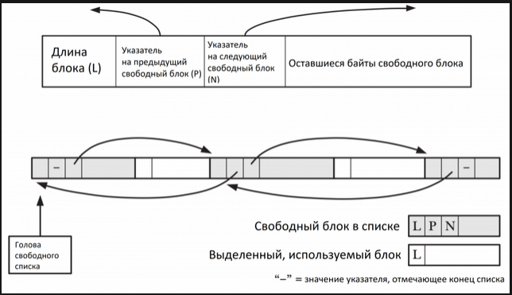
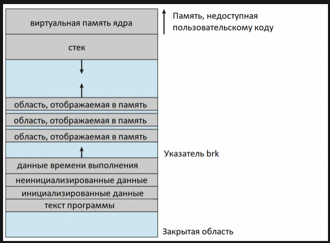

# Виртуальная память процесса

> **Проверено:** Go 1.27 · **Уровень:** младший разработчик — углублённый

**Перед чтением:** процессы, двоичная и шестнадцатеричная системы счисления.
**После главы:** вы сможете объяснить различие виртуального адресного пространства,
физических страниц и RSS и понять, почему память кучи Go не равна памяти процесса.
[Задания и самопроверка](../../practice.md#memory).

Эта глава содержит только те основы операционной системы, которые нужны для
понимания памяти Go. Более общий материал находится в разделе
[«Компьютерные системы»](../../computer-science/Компьютерные%20системы/computer-systems.md).

## От непрерывного блока к страницам

Исторически память процесса можно представить как один непрерывный физический
блок. Освобождение блоков разного размера оставляет промежутки, из-за которых
большой запрос не удаётся выполнить даже при достаточной сумме свободной памяти.





Современная система делит виртуальное адресное пространство на страницы, а
физическую память — на кадры совместимого размера. Страницы одного процесса не
обязаны лежать рядом в физической памяти.



Процесс обращается к виртуальному адресу. Устройство управления памятью процессора
использует таблицы страниц, чтобы получить физический адрес. Переводы последних
обращений кэшируются в TLB.



Размер страницы среды выполнения Go и размер физической страницы ОС — разные
понятия. На большинстве поддерживаемых целей внутренняя страница аллокатора Go
равна 8 КиБ, а размер страницы ОС зависит от платформы и конфигурации.

## Отложенное предоставление физических страниц

Резервирование диапазона виртуальных адресов не означает, что весь диапазон уже
занимает физическую память. При первом обращении может произойти страничное
исключение: ядро проверяет адрес, получает физический кадр, обновляет таблицу
страниц и повторяет инструкцию.



Из этого следуют два практических вывода:

1. Большой объём зарезервированных виртуальных адресов сам по себе не означает
   такое же потребление оперативной памяти.
2. Первое обращение к новым страницам может быть дороже последующих из-за
   страничного исключения и обнуления.

Не превращайте это в гарантию, что любой `make([]byte, n)` увеличит RSS только
после вашей первой записи: компилятор и среда выполнения могут сами обращаться к
диапазону при инициализации. Проверяйте конкретную программу.

## Карта памяти процесса

Типичная карта процесса Unix содержит исполняемый код, данные, стеки потоков,
области динамического компоновщика, отображённые файлы и анонимные отображения.
Реальное расположение зависит от ОС, формата исполняемого файла и случайного
смещения адресов.


Стек потока хранит кадры вызовов и служебное состояние. В Go не следует
отождествлять один системный стек потока со стеками всех горутин: у каждой
горутины свой управляемый средой выполнения стек, а у каждого рабочего потока
есть системный стек `g0`.



Традиционная куча процесса может расти через изменение границы данных, но среда
выполнения Go получает крупные диапазоны памяти через платформозависимый слой
системного выделения. На Unix в основе обычно находятся анонимные отображения.



Профиль кучи Go не показывает эту карту. Для Linux используйте `/proc`, `pmap`
или средства наблюдения ОС, а профиль Go применяйте для мест выделения объектов.

```bash
pmap -x "$PID"
sed -n '1,80p' "/proc/$PID/smaps_rollup"
```

## Отображение памяти

Отображение связывает диапазон виртуальных адресов с файлом либо с анонимной
памятью. Частное отображение не передаёт изменения другим процессам; разделяемое
может использоваться для обмена данными. Точные флаги и гарантии зависят от ОС.



Если передать нулевой адрес, ядро выбирает свободный диапазон. Ненулевой адрес
часто является лишь подсказкой; для жёсткого размещения существуют отдельные
флаги с дополнительными рисками.



Среда выполнения различает резервирование адресов, подготовленную память и
страницы, готовые к использованию. Освобождение физических страниц не обязано
удалять виртуальное отображение: это позволяет позднее использовать диапазон
снова без нового поиска адресов.

## RSS, виртуальный размер и cgroup

- **Виртуальный размер** охватывает зарезервированные адресные диапазоны. Для Go
  он может быть велик из-за внутренних резервов и обычно плохо показывает риск
  нехватки физической памяти.
- **RSS** оценивает резидентные страницы процесса, но разделяемые страницы и
  особенности учёта не позволяют считать его точной суммой частных выделений.
- **cgroup** учитывает память по правилам группы процессов. Именно её предел
  обычно определяет аварийное завершение контейнера.

Для расследования сопоставляйте одновременно:

```bash
ps -o pid,rss,vsz,comm -p "$PID"
cat /sys/fs/cgroup/memory.current
cat /sys/fs/cgroup/memory.max
```

Если живая куча стабильна, а RSS вырос после краткого пика, проверьте
`/memory/classes/heap/released:bytes` и разницу между `HeapIdle` и
`HeapReleased`. Свободные страницы могут оставаться доступными среде выполнения
для повторного использования до работы фонового очистителя.

## Что важно для Go-разработчика

- «Куча Go», «виртуальная память», RSS и потребление контейнера не взаимозаменяемы.
- Стек горутины не равен системному стеку потока.
- Возврат физической памяти ОС не всегда удаляет виртуальный диапазон.
- Профиль кучи показывает выборочные места выделения Go-объектов, а не сегменты
  процесса.

## Основные источники

- [Руководство Go по сборщику мусора](https://go.dev/doc/gc-guide).
- [Документация `runtime.MemStats`](https://pkg.go.dev/runtime#MemStats).
- [Справочная страница Linux `mmap(2)`](https://man7.org/linux/man-pages/man2/mmap.2.html).
- [Исходный слой системной памяти Go 1.27.0](https://github.com/golang/go/blob/go1.27.0/src/runtime/mem.go).

## Краткий итог

- Виртуальные страницы сопоставляются с физическими кадрами по мере необходимости.
- Большое адресное пространство не равно такому же RSS.
- Для памяти Go нужны одновременно метрики среды выполнения, профиль и данные ОС.

Дальше: изучите, как среда выполнения делит полученные диапазоны на
[арены, страницы и спаны](allocator.md).
