# Полный справочник по планировщику Go

> **Проверено:** Go 1.27 · **Уровень:** младший разработчик — углублённый

## Введение

Документ посвящён внутреннему устройству планировщика Go 1.27. Он дополняет
[базовую статью о GMP](gmp.md): здесь рассматриваются точные размеры очередей,
состояния G, M и P, вытеснение, системные вызовы, сетевой опросщик и функции среды
выполнения.

Материал построен от модели операционной системы к реализации Go. После краткого
фундамента вводятся GMP и устройство горутины, затем жизненный цикл, переключение
контекста и два пути ввода-вывода. Вторая половина посвящена запуску среды
выполнения, `findRunnable`, взаимодействию со сборщиком мусора и внутренним
примитивам планировщика. Практическая диагностика вынесена в
[отдельную главу](diagnostics.md).

Документ рассчитан на читателя, уже знакомого с оператором `go`, каналами,
мьютексами и [основными ролями G, M и P](gmp.md). Внутренние имена и алгоритмы
привязаны к Go 1.27 и не являются договором языка.

***

<a id="1-фундамент-планирование-в-операционной-системе"></a>

## 1. Фундамент: планирование в операционной системе

### Потоки и процессы

**Планировщик операционной системы** распределяет готовые потоки по процессорным
ядрам. Запущенная программа существует как **процесс** с адресным пространством и
ресурсами, а инструкции исполняют его **потоки ОС**. Потоки могут продвигаться
конкурентно на одном ядре или выполняться параллельно на нескольких.

Планировщик ОС решает четыре задачи:

* Не давать ядрам простаивать, если есть готовые потоки.
* Создавать иллюзию одновременного выполнения всех готовых потоков.
* Учитывать приоритеты потоков, не допуская бесконечного голодания остальных.
* Минимизировать задержки планирования через быстрые и точные решения.

Горутины в конечном счёте выполняются на потоках ОС, поэтому Go не может полностью
устранить цену потоков и решений системного планировщика.

### Состояния потока

Для учебной модели достаточно трёх состояний потока:

| Состояние | Описание |
|---|---|
| **Ожидание (`Waiting`)** | Поток не может продолжить до события ядра или освобождения ресурса. Само ожидание нормально; проблему показывают лишняя блокировка, растущая очередь или отсутствие завершения |
| **Готовность (`Runnable`)** | Потоку нужно процессорное время. При большом числе готовых потоков каждый обычно ждёт дольше |
| **Выполнение (`Running`)** | Поток размещён на ядре и выполняет машинные инструкции |

У G есть похожие основные режимы, но внутренние состояния горутин не совпадают с
состояниями потоков ОС один к одному.

### Характер нагрузки

Нагрузка редко относится только к одному классу. У **вычислительной** работы
(`CPU-bound`) преобладают вычисления, у работы, **ожидающей ввода-вывода**
(`I/O-bound`), — сеть, диск или внешняя служба. Реальные программы обычно смешивают
вычисления, ожидание и синхронизацию.

Для вычислительной нагрузки избыток одновременно готовых горутин не создаёт новых
ядер. Для сетевой службы горутин может быть гораздо больше, чем P, потому что
большинство из них ожидает. Размер очередей и ограничения конкурентности выбирают
по измерениям, памяти и возможностям внешних систем, а не по одной формуле.

### Переключение контекста

Алгоритмы планирования делятся на два класса:

* **Невытесняющие:** активный поток выполняется, пока сам добровольно не отдаст управление ОС.
* **Вытесняющие:** решение о переключении принимает ОС, а не активная задача.
  Обычные классы планирования Linux, macOS и Windows поддерживают вытеснение.

Следствия вытесняющего планирования для разработчика:

* Нельзя заранее определить, какой поток будет выбран и когда.
* Нельзя писать код, полагающийся на случайно подмеченное, но не гарантированное поведение.

**Переключение контекста** — сохранение состояния текущего потока и восстановление
состояния следующего. Его цена зависит от операционной системы, процессора,
состояния кэшей и характера переключаемой работы, поэтому универсальное значение в
наносекундах вводит в заблуждение.

Переключение позволяет использовать ядро, пока одна работа ждёт, но слишком большое
число готовых вычислительных потоков увеличивает расходы планирования и нарушает
локальность данных. Переключение G средствами Go часто обходится без перехода в
ядро ОС, однако тоже не является бесплатным.

### Принцип «Меньше значит больше» и пулы потоков

Когда готовых потоков намного больше, чем ядер, каждый из них проводит больше
времени в очереди, а система чаще переключает контекст. Избыток потоков также
увеличивает потребление памяти и может ухудшить локальность данных.

**Квант времени** — промежуток процессорного времени, после которого системный
планировщик может выбрать другую работу. Конкретная политика зависит от ОС и класса
планирования; её нельзя свести к делению одного фиксированного периода на число
потоков.

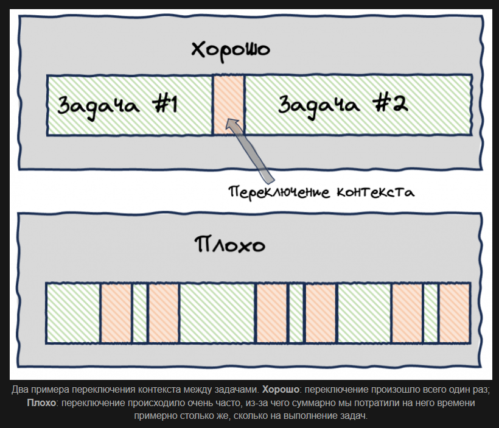

Практический вывод не в том, что потоков всегда должно быть мало, а в том, что их
число должно соответствовать нагрузке. Неограниченное создание готовых потоков не
добавляет вычислительных ядер.

В системах, где приложение само управляет потоками, их число часто ограничивают
пулом. В Go потоки M создаёт и переиспользует среда выполнения, поэтому прикладной
код обычно ограничивает не M, а число одновременно выполняемых операций: очередью,
семафором или пулом обработчиков. `GOMAXPROCS` задаёт число P и не заменяет такие
ограничения.

### Локальность и кэш процессора

Этот подраздел даёт только контекст для локальных очередей P. Подробное устройство
кэшей не требуется для понимания алгоритма планировщика.

Доступ к основной памяти обычно дороже доступа к процессорному кэшу. Точная разница
зависит от архитектуры, уровня кэша, расположения памяти и текущей нагрузки, поэтому
универсальные значения в тактах здесь не приводятся.

Обмен происходит кэш-линиями, размер которых зависит от архитектуры; 64 байта —
распространённое, но не универсальное значение. Поэтому ручное дополнение структуры
до 64 байт нельзя считать переносимым решением без проверки целевой платформы.


**Протокол MESI.** На многих процессорах согласование можно объяснить четырьмя
базовыми состояниями; конкретная архитектура может использовать расширенный или
другой протокол:

| Состояние         | Описание                                      |
| ----------------- | --------------------------------------------- |
| **M (Modified)**  | Линия изменена только в этом кэше («грязная») |
| **E (Exclusive)** | Линия есть только в этом кэше, не изменена    |
| **S (Shared)**    | Линия присутствует в нескольких кэшах         |
| **I (Invalid)**   | Линия устарела, данные недействительны        |

Копии одной кэш-линии могут находиться в кэшах нескольких ядер. Частая запись из
разных ядер вынуждает оборудование согласовывать эти копии и способна ухудшить
производительность.

**Ложное совместное использование** возникает, когда потоки изменяют разные
значения в одной кэш-линии. Кэшам приходится часто передавать право записи на всю
линию, хотя сами значения логически не связаны. Масштаб замедления зависит от
частоты записи, размещения потоков и процессора; его подтверждают профилем и тестом
производительности.

**Когерентность кэша** поддерживает согласованное состояние кэш-линий между ядрами.
Она не заменяет модель памяти и синхронизацию Go: программа с гонкой данных остаётся
некорректной, даже если оборудование использует MESI.

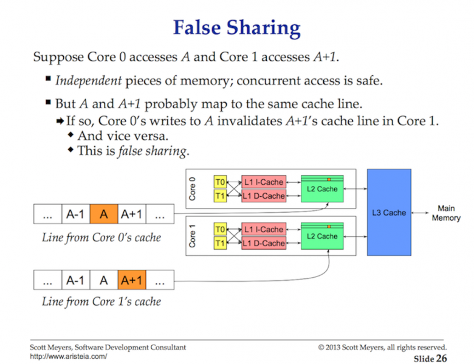

Локальные очереди и ресурсы P уменьшают обращение к общим структурам и помогают
сохранять локальность. В прикладном коде сначала сокращают совместно изменяемое
состояние, а ручное дополнение структур применяют только после измерения на целевой
архитектуре.

***

## 2. Модель GMP: горутины, машины, процессоры

### Зачем нужны горутины

Поток ОС требует отдельного стека и ресурсов ядра, а его создание и переключение
могут затрагивать операционную систему. Стек потока обычно заметно больше
начального стека горутины, хотя точный размер и способ резервирования зависят от
платформы.

**Горутина** управляется средой выполнения внутри процесса. Её стек начинается с
небольшого размера и может расти, а многие переключения между G не требуют
переключения потоков ядром. Это делает большое число ожидающих горутин практичным,
но не бесплатным: каждая G всё равно занимает память и ресурсы планировщика.

```go
func main() {
    go task1() // запускаем функцию и идем дальше, не дожидаясь её завершения
    go task1() // запускаем следующую и также идём дальше

    // делаем какую-то работу
}

```

Для первого приближения достаточно трёх режимов:

* **ожидает (`Waiting`)** — пока не может продолжить;
* **готова (`Runnable`)** — может работать, но ещё не получила P и M;
* **выполняется (`Running`)** — исполняет инструкции на M с P.

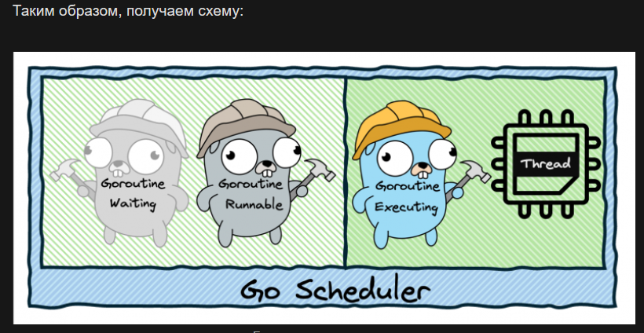

Полный набор внутренних состояний шире и включает отдельный системный вызов и
служебные переходы. Ожидание нормально, пока у G есть путь к пробуждению и
завершению.

### G, M и P — три сущности планировщика

Планировщик Go оперирует тремя сущностями:

* **G (горутина)** — описывает выполнение горутины: её стек, сохранённый контекст,
  состояние и служебные данные.
* **M (машина)** — поток ОС, на котором выполняется код Go. Именно M выполняет инструкции горутин.
* **P (процессор)** — логический ресурс с локальной очередью G и кэшем памяти
  `mcache`; он даёт M право выполнять Go-код.

Модель называется **GMP** по первым буквам сущностей.

### Как программа запускается

При запуске среда выполнения создаёт набор P. Его размер равен `GOMAXPROCS`, а
исходное значение в Go 1.27 учитывает логические процессоры, привязку процесса и
квоту cgroup в Linux. Поэтому число P не обязательно совпадает с числом логических
процессоров узла.

Связь M и P не постоянна. Чтобы выполнять Go-код, поток M должен получить P. При
блокирующем системном вызове P можно передать другому M, а исходный поток продолжит
ожидание без P. По этой причине потоков M может быть больше, чем P.

Среда выполнения создаёт начальную G для `runtime.main`, которая после
инициализации вызывает пользовательскую `main`. Дальнейшие G создаёт оператор `go`
и сама среда выполнения для служебной работы.

### GRQ и LRQ — очереди выполнения

В планировщике Go две очереди выполнения:

* **Глобальная очередь выполнения (GRQ)** хранит готовые G, временно не находящиеся
  в очереди конкретного P, и участвует в публикации общей работы и справедливости.
* **Локальная очередь выполнения (LRQ)** принадлежит P. В Go 1.27 её кольцевой
  буфер рассчитан на 256 G.

Горутины из LRQ выполняются на M, который в этот момент связан с данным P. В Go 1.27
кольцевой буфер LRQ вмещает 256 горутин; отдельный слот `runnext` в это число не
входит. При переполнении в GRQ переносятся 128 прежних горутин и ещё одна горутина,
которую не удалось поставить локально. Точный расчёт приведён ниже.

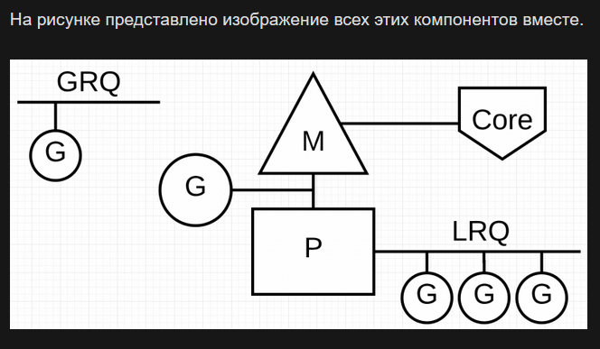

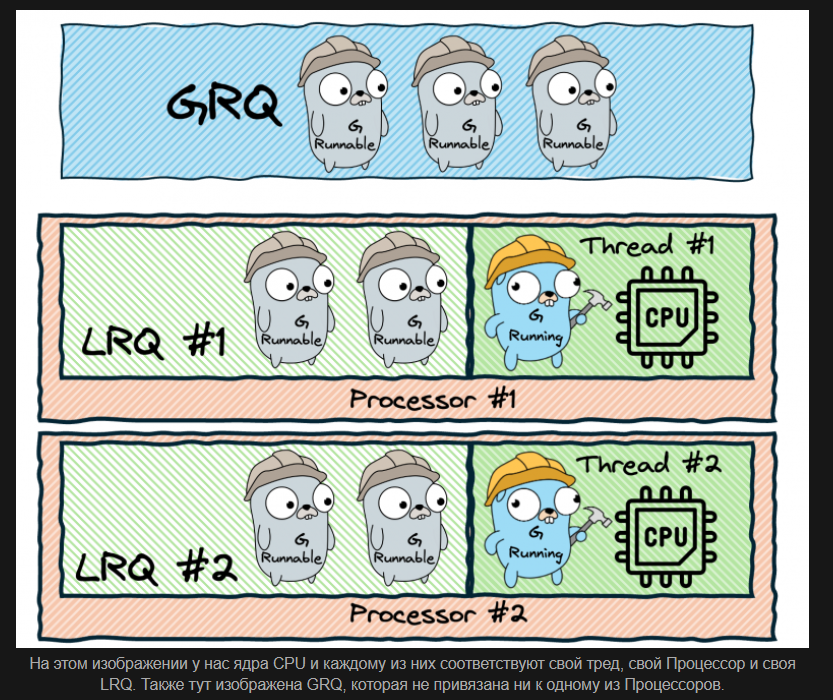

Локальная очередь уменьшает обращение к общей блокировке и помогает сохранять
локальность, но не гарантирует, где и когда выполнится конкретная G. Неравномерную
нагрузку P выравнивает кража работы.

### Модель многопоточности M:N

Существует три модели отображения пользовательских потоков на потоки ядра:

* **N:1 («многие к одному»)** — все пользовательские потоки выполняются на одном
  потоке ядра; блокировка этого потока останавливает остальных.
* **1:1 («один к одному»)** — каждому пользовательскому потоку соответствует поток
  ядра; модель проста, но требует больше ресурсов ОС.
* **M:N («многие ко многим»)** — множество пользовательских потоков распределяется
  по множеству потоков ядра.

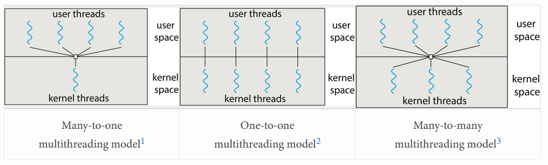

Go использует модель **M:N** с дополнительной сущностью P: множество G выполняется
на множестве M, а P хранит ресурсы, необходимые для исполнения Go-кода.

Количество P ограничивает параллельное выполнение Go-кода значением
`GOMAXPROCS`. Потоки в системных вызовах или C-коде учитываются отдельно.

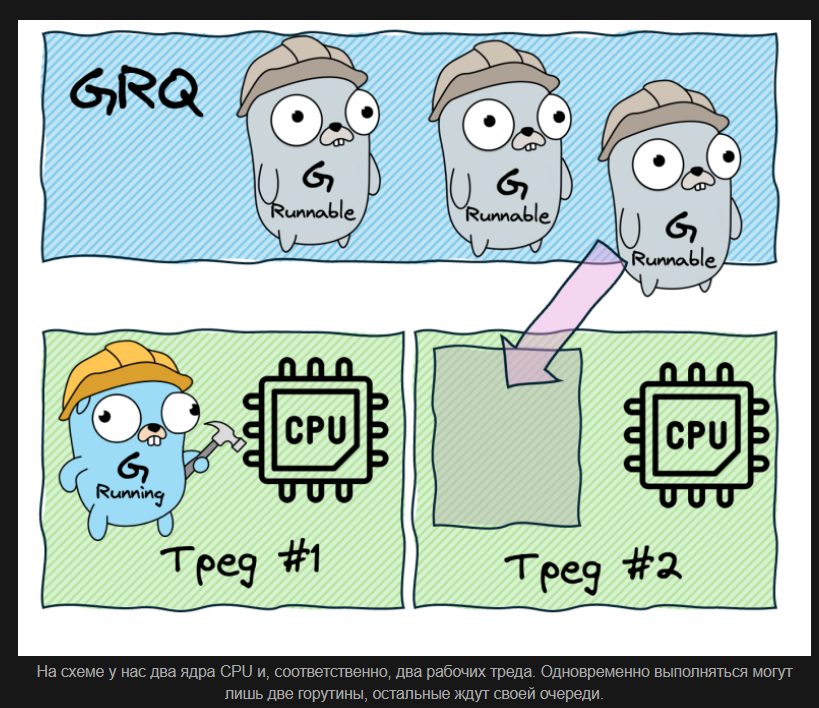

### GOMAXPROCS

Функция **`runtime.GOMAXPROCS()`** задаёт максимальное число ресурсов P. В Go
1.25+ исходное значение учитывает логические процессоры, привязку процесса и, в
Linux, квоту процессора cgroup; среда выполнения может периодически его
обновлять. Явная переменная `GOMAXPROCS` или вызов функции фиксирует значение и
отключает автоматические обновления.

```go
import "runtime"

func init() {
    runtime.GOMAXPROCS(2)
}

```

`GOMAXPROCS` определяет, сколько горутин одновременно исполняют код Go. Число
горутин, ожидающих ввода-вывода, от него не ограничено: сетевой опросчик и
передача P при блокирующем системном вызове позволяют другим горутинам работать.
Увеличение P сверх доступных процессоров обычно не ускоряет ввод-вывод и может
повысить расходы планирования и кэша.

> **Зачем это Go-разработчику.** В Go 1.25+ сначала оставьте исходное значение,
> учитывающее контейнер. Меняйте `GOMAXPROCS` только после трассировки,
> профилирования и теста под реальным ограничением процессора. Внешний
> ввод-вывод ограничивайте отдельно: пределом параллелизма, размером пула и
> обратным давлением.

***

## 3. Как устроена горутина

### Структура `g`

Горутина состоит не только из выполняемой функции. Среда выполнения хранит для неё
собственный стек и структуру `g` — внутреннюю запись с данными, необходимыми
планировщику, сборщику мусора и средствам диагностики. Это и есть сущность G в
модели GMP.

Основные поля `g` в Go 1.27:

| Поле | Назначение |
|---|---|
| `stack` | Нижняя и верхняя границы стека горутины |
| `stackguard0` | Граница для проверки необходимости увеличить стек; специальное значение также может запросить вытеснение |
| `sched` | Сохранённый контекст выполнения: указатели стека и команды, а также несколько служебных значений |
| `atomicstatus` | Текущее состояние G: готова, выполняется, ожидает, находится в системном вызове и так далее |
| `m` | Связанный с G поток M, пока горутина выполняется или находится в системном вызове |
| `schedlink` | Ссылка, используемая для включения G во внутренние очереди |
| `waitreason` | Причина ожидания, например канал, таймер или сетевой ввод-вывод |
| `syscallsp`, `syscallpc` | Положение стека и команды, сохранённое на время системного вызова |
| `gcAssistBytes` | Кредит или долг горутины перед сборщиком мусора |

Поле `goid` тоже существует, но язык и стандартная библиотека намеренно не дают
прикладному коду устойчивого способа получить этот идентификатор. Структура `g` —
деталь среды выполнения, а не часть открытого интерфейса Go.

У каждого M есть особая горутина `g0` с системным стеком. На ней выполняются части
планировщика и операции среды выполнения, которые нельзя безопасно выполнять на
обычном стеке: например, парковка текущей G или перенос её стека. `g0` не является
пользовательской задачей и не попадает в обычные очереди выполнения.

### Динамический стек

Каждая пользовательская горутина владеет отдельным непрерывным стеком. В Go 1.27
базовый минимальный размер задаёт константа `stackMin`, равная 2 КБ; фактическое
начальное выделение может быть больше из-за требований конкретной платформы. Это
позволяет создавать много горутин без предварительного резервирования большого
стека для каждой из них.

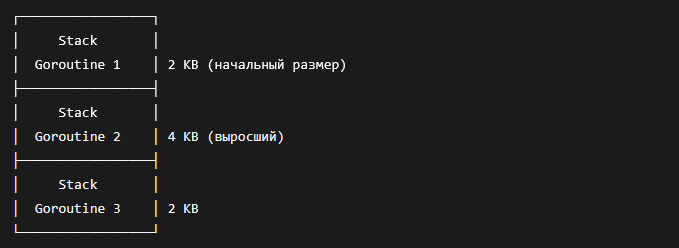

В стеке находятся кадры вызванных функций: параметры, локальные данные и сведения,
необходимые для возврата к вызывающему коду.

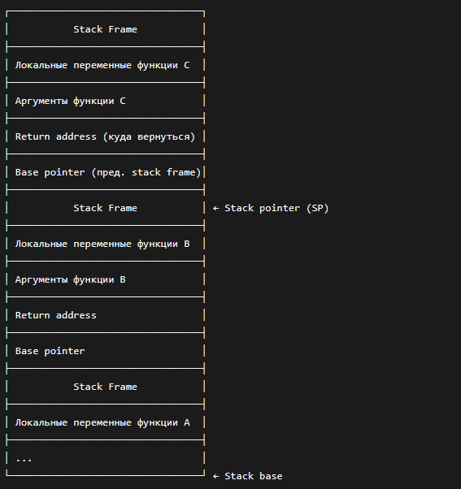

Если места недостаточно, среда выполнения выделяет больший непрерывный блок и
копирует туда используемую часть стека. При обычном росте новый размер как минимум
вдвое больше прежнего; для особенно крупного следующего кадра он может быть
увеличен ещё сильнее.

Стек может и уменьшаться. Когда горутина остановлена в подходящей безопасной точке
и использует менее четверти текущего стека, среда выполнения может скопировать его
в блок вдвое меньшего размера. Ни рост, ни уменьшение не происходят параллельно с
исполнением пользовательских инструкций этой горутины.

Рост не бесконечен. По умолчанию среда выполнения ограничивает стек примерно
1 ГБ на 64-разрядных системах и 250 МБ на 32-разрядных; значение можно уменьшить
через `runtime/debug.SetMaxStack`. Превышение предела завершает программу с ошибкой
переполнения стека.

> **Зачем это Go-разработчику.** Небольшой начальный стек делает горутины дешевле
> потоков ОС, но каждая горутина всё равно потребляет память. Большое число горутин,
> глубокая рекурсия и крупные локальные значения следует подтверждать измерениями,
> а не считать бесплатными.

***

## 4. Жизненный цикл сущностей и поиск работы

### От общей очереди к GMP

Сначала отделим обычный пул потоков от планировщика Go. В простом пуле задачи ждут
свободный поток ОС:

1. Если в пуле есть свободный поток, задача передаётся ему.


2. Если свободного потока нет, но предел ещё не достигнут, пул создаёт новый поток.
   После выполнения задачи поток остаётся в пуле.


3. Если предел достигнут, задача остаётся в общей очереди.


Эти рисунки объясняют только общий принцип переиспользования потоков. Они не
описывают точную историю или текущий алгоритм Go: число M не ограничивается числом
ядер, а P не закрепляется за M навсегда.

В раннем планировщике Go уже использовалась модель M:N: множество G выполнялось на
множестве M, но готовые горутины хранились преимущественно в общей очереди. Доступ к
ней требовал общей блокировки. При росте числа потоков эта блокировка становилась
узким местом, а работа часто переходила между потоками без сохранения локальности.

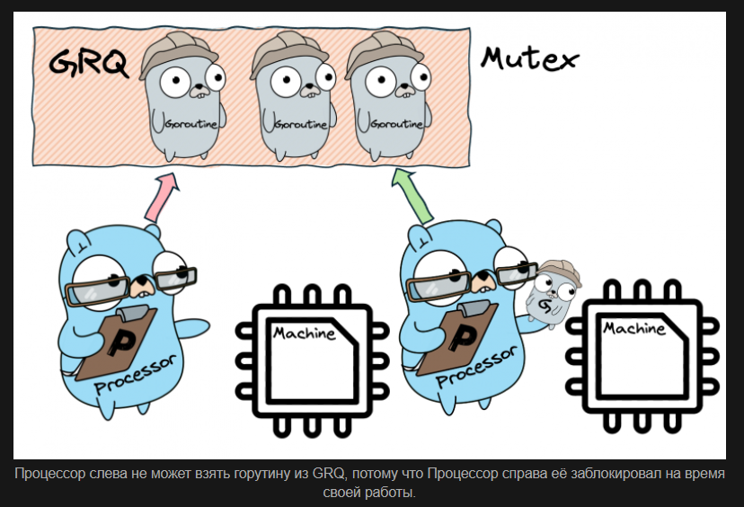

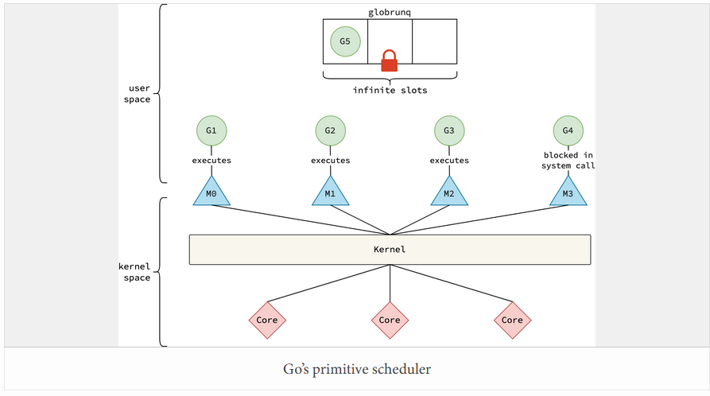

Модель GMP добавила P как контекст выполнения с локальными ресурсами. Каждый P
получил собственный кольцевой буфер `runq` и приоритетный слот `runnext`. Владелец P
обычно работает с ними без общей блокировки, поэтому большинство операций не
обращается к GRQ.

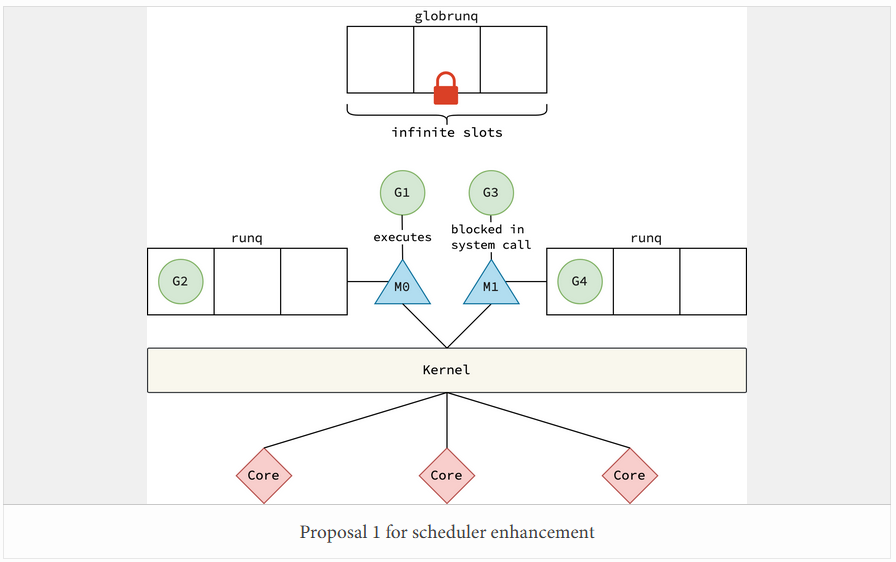

Очередь и локальный кэш памяти принадлежат P, а не M. Если M блокируется, P с этими
ресурсами можно передать другому потоку.

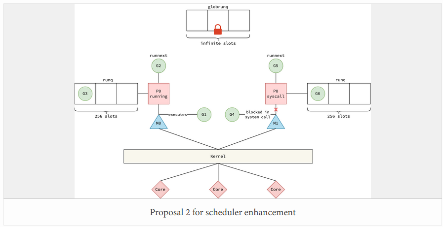

Глобальная очередь при этом не исчезла. В неё попадают пакеты при переполнении LRQ,
часть горутин после системных вызовов, а также работа, которую среда выполнения
публикует без подходящего P. GRQ защищена общей блокировкой и обычно обслуживается с
начала очереди, но считать весь планировщик строгим FIFO нельзя: существуют
`runnext`, локальные очереди, кража работы и добавление в начало GRQ.

#### Сколько горутин находится в GRQ

Фиксированной формулы для общего размера GRQ нет. В исходном коде это текущее
значение `sched.runq.size`; оно увеличивается и уменьшается по мере перехода горутин
в состояние Runnable и переноса работы между очередями. `GOMAXPROCS` не задаёт
вместимость GRQ.

Зато для переполнения локальной очереди формула точная. Пусть `C` — размер `runq`
одного P. В Go 1.27 `C = 256`. Функция `runqputslow` переносит:

```text
Noverflow = C / 2 + 1 = 256 / 2 + 1 = 129
```

Это 128 горутин из заполненной LRQ и горутина `gp`, которую не удалось добавить
локально. Перенос освобождает половину кольцевого буфера; слот `runnext`
обрабатывается отдельно. Конкурентная кража работы может сразу изменить фактическое
число оставшихся локальных горутин.

Когда локальная очередь пуста и P забирает пакет из GRQ, в Go 1.27 используется
другая формула:

```text
B = min(C / 2, G, G / GOMAXPROCS + 1)
```

Здесь `G` — размер GRQ до извлечения, а деление целочисленное. Ограничение `C / 2`
не позволяет переполнить освобождённую LRQ. Первая из `B` горутин возвращается для
немедленного выполнения, остальные `B - 1` помещаются в LRQ текущего P.

Например, при `G = 100` и `GOMAXPROCS = 4` размер пакета равен
`min(128, 100, 26) = 26`: одна горутина выбирается для выполнения, 25 переходят в
LRQ. Если `G = 2`, а `GOMAXPROCS = 8`, P заберёт только одну горутину.

Эти размеры описывают реализацию Go 1.27, а не гарантию языка или пакета `runtime`.
Формулы следуют из функций
[`runqputslow`](https://github.com/golang/go/blob/go1.27.0/src/runtime/proc.go#L7575-L7614)
и
[`globrunqgetbatch`](https://github.com/golang/go/blob/go1.27.0/src/runtime/proc.go#L7344-L7361)
в закреплённой версии исходного кода.

Горутины в `_Gwaiting` не находятся ни в GRQ, ни в LRQ. Заблокированная операция
канала связывает G с очередью ожидания этого канала. После успешного обмена другая
G делает её готовой и возвращает в одну из очередей выполнения. Ожидание сети
устроено сходным образом через сетевой опросщик.

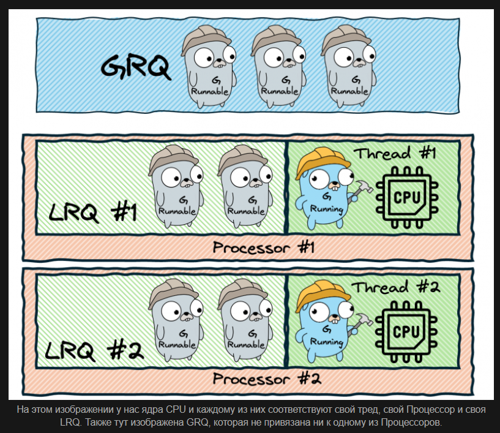

Локальная очередь уменьшает конкуренцию за общую блокировку и сохраняет локальность,
а GRQ и кража работы поддерживают справедливость и баланс между P.

#### Как каналы взаимодействуют с планировщиком

Для планировщика важно, может ли операция с каналом завершиться немедленно:

* **Операция готова:** в буфере есть место для отправки, в канале уже есть значение
  для получения либо ожидает другая сторона обмена. Горутина продолжает выполнение
  без парковки.
* **Операция не готова:** отправителю некуда передать значение или получателю нечего
  получить. Горутина переводится в Waiting и добавляется в очередь ожидания канала,
  а M с P может выполнять другую готовую горутину.

#### Поведение select с несколькими готовыми каналами

Когда в `select` одновременно готовы несколько ветвей,
[спецификация](https://go.dev/ref/spec#Select_statements) требует выбрать одну из них
равномерно псевдослучайно. Текущая реализация строит случайный порядок
опроса во время выполнения, а не фиксирует его при компиляции. Поэтому код не должен
полагаться на порядок ветвей в исходном файле. Если нужен приоритет, его выражают
отдельной логикой и проверяют тестами.

<a id="порядок-проверки-очередей"></a>

### Порядок проверки очередей

Если опустить системные горутины, таймеры и проверки перед парковкой M, основной
путь поиска обычной пользовательской горутины выглядит так:

1. Каждый 61 такт попытаться взять одну горутину из GRQ для
   справедливости.
2. Проверить `runnext`, затем кольцевой буфер LRQ текущего P.
3. Если локальной работы нет, получить из GRQ одну горутину для выполнения и пакет
   горутин для LRQ.
4. Неблокирующим образом проверить сетевой опросчик (netpoll), если проверку не выполняет
   другой M.
5. Если работа не найдена и среда выполнения разрешает активный поиск, попытаться
   украсть её у другого P.

Если на этом проходе планировщик не взял горутину из GRQ для предотвращения голодания,
он проверяет LRQ. Если LRQ пуста, P обращается к GRQ обычным способом и забирает пакет
горутин по формуле min(128, G, G / GOMAXPROCS + 1).

Первый пункт решает проблему застоя: если LRQ постоянно
пополняется, P всё равно периодически выбирает горутину из GRQ. `schedtick`
увеличивается при запуске горутины с новым временным интервалом, поэтому это не
счётчик вызовов `findRunnable` и не случайность с вероятностью 1/61.

### Кража работы

Ситуация: один процессор перегружен, другой простаивает.

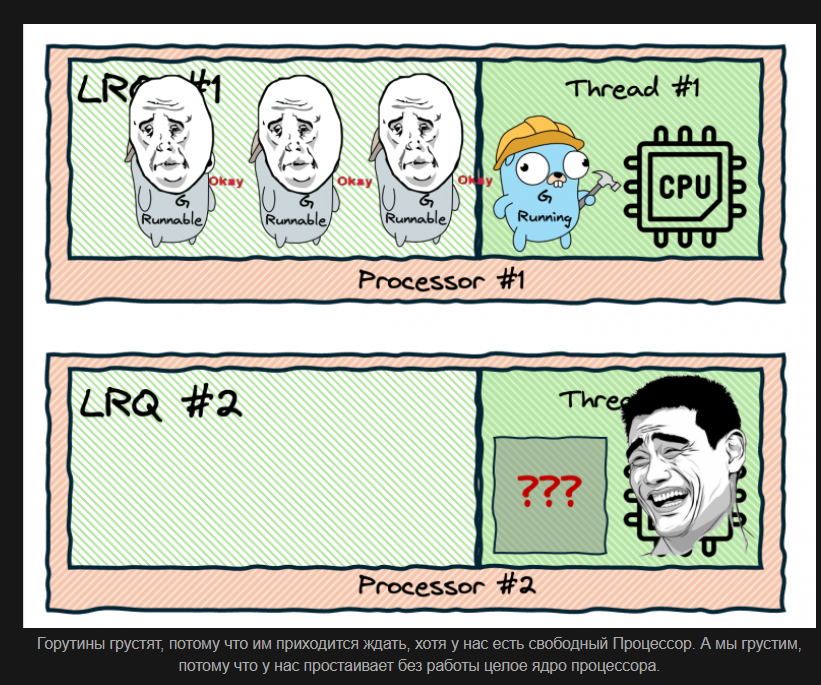

Если LRQ одного P пуста, он может забрать примерно половину горутин из `runq`
другого P. Этот механизм называется **кражей работы**.

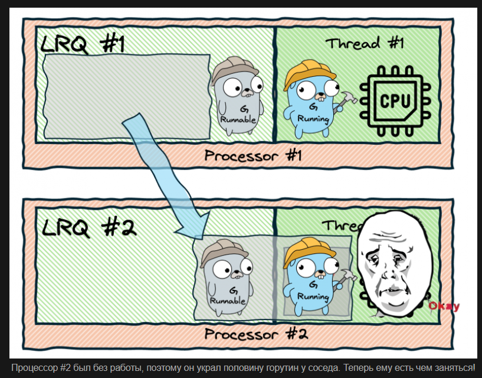

Кража работы автоматически распределяет нагрузку между P без централизованного
координатора.

В Go 1.27 `stealWork` выполняет четыре обхода P в псевдослучайном порядке. На каждом
обходе он пытается украсть часть `runq`. На четвёртом обходе дополнительно проверяются
таймеры чужих P, а при пустом `runq` разрешается кража из `runnext` как крайняя мера.

> **Зачем это Go-разработчику.** Не нужно вручную распределять горутины между P.
> Однако создание множества очень коротких горутин увеличивает относительную цену
> планирования и перемещения работы.

### Состояния G, M, P

Среда выполнения хранит состояния G и P как внутренние значения. Для M часть
поведения выражена отдельными признаками, поэтому перечисленные ниже режимы M не
следует понимать как один официальный перечень состояний.

#### Состояния горутины (G)

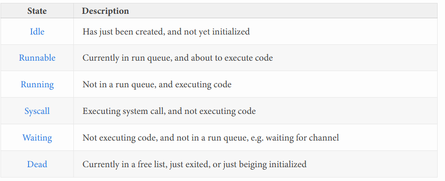

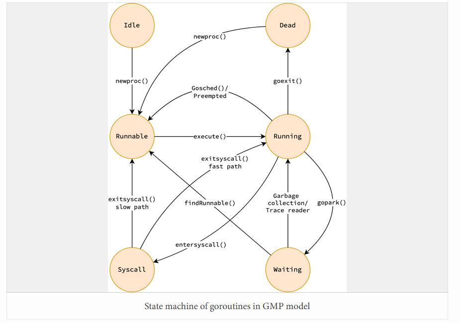

Основные состояния G:

* **Idle** — структура G ещё не инициализирована для выполнения.
* **Runnable** — готова к выполнению, находится в очереди.
* **Running** — выполняется на M.
* **Waiting** — припаркована в ожидании канала, сети, таймера или другого события.
* **Syscall** — выполняет системный вызов и остаётся связанной со своим M.
* **Dead** — не выполняется и может находиться в пуле свободных G.

В исходном коде есть дополнительные служебные состояния, например копирование
стека и асинхронное вытеснение, а также признак сканирования сборщиком мусора. Они
нужны для синхронизации самой среды выполнения и не образуют дополнительные
прикладные этапы жизненного цикла.

После завершения структура G переходит в `_Gdead` и обычно сохраняется для
повторного использования. Свободные G хранятся в локальных и глобальных списках
среды выполнения.

#### Состояния потока (M)

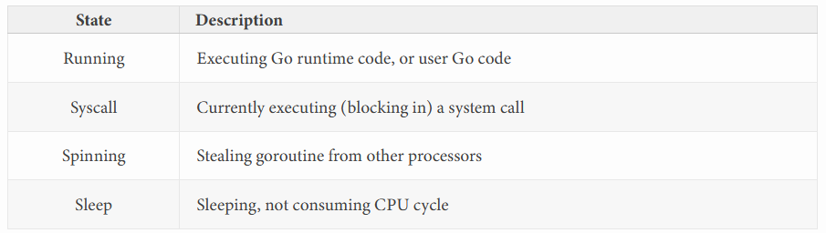

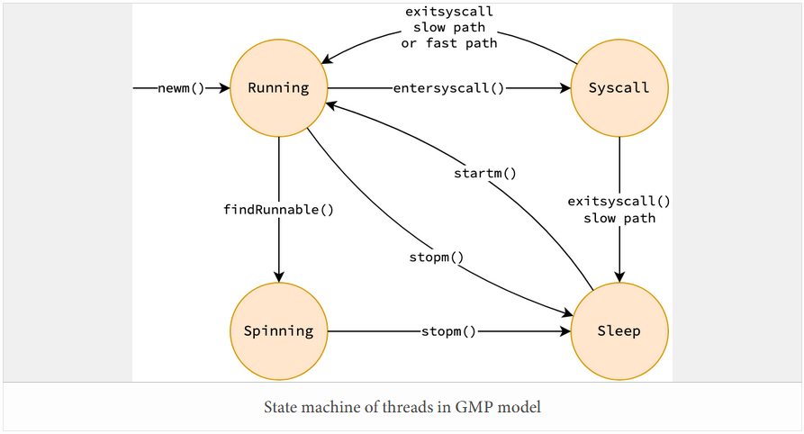

Основные состояния и режимы M:

* **Running** — выполняет код Go.
* **Spinning** — активно ищет работу; в реализации это признак `m.spinning`, а не
  отдельное значение состояния M.
* **Idle** — припаркован, ждёт пробуждения.
* **Syscall** — заблокирован в системном вызове.

Когда M не находит готовую горутину, он может перейти в режим активного поиска (spinning):
проверить доступные источники работы и попытаться украсть горутины у других P. Такой
M не засыпает и поэтому способен быстрее подхватить новую работу. Чтобы потоки не
расходовали процессорное время впустую, новый активно ищущий M запускается, только
пока их число меньше половины числа занятых P.

Если работа не найдена после повторных проверок, M освобождает P. Один из потоков
может остаться ждать сетевые события до срока ближайшего таймера; остальным доступна
парковка через `stopm`. На Linux низкоуровневое ожидание может использовать `futex`,
а на других операционных системах применяются их механизмы ожидания и пробуждения.
Позже этот M можно использовать повторно, но постоянной связи с прежним P у него нет.

M хранит ссылки на текущую G и связанный в данный момент P, а также содержит
специальную горутину **g0** для выполнения на системном стеке.

**Зачем нужна g0.** Обычные горутины используют динамические стеки, которые могут
расти и сжиматься. Операции планировщика и перенос стека выполняются на специальном
стеке `g0`, связанном с M. Способ выделения этого стека зависит от платформы и
способа создания потока: его может предоставить операционная система либо сама
среда выполнения. `g0` не ставится в обычную очередь пользовательских горутин.

#### Состояния процессора (P)

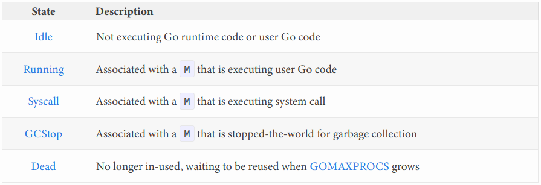

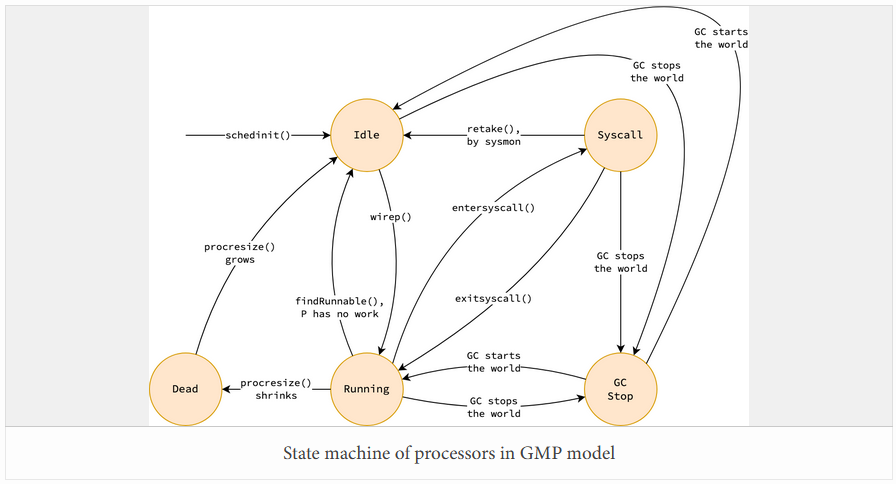

Основные состояния P:

* **Idle** — свободен, не выполняет горутины.
* **Running** — выполняет пользовательский код.
* **gcStop** — остановлен для сборки мусора (stop the world).
* **Dead** — временно не используется после уменьшения `GOMAXPROCS`.

В Go 1.27 отдельное состояние P для системного вызова не используется:
`_Psyscall_unused` оставлено в исходном коде как устаревшее значение. Среда выполнения
определяет такой случай по состоянию G и при необходимости отбирает P у M. Поэтому
схемы со статусом P `Syscall` описывают прежнюю реализацию, а не текущий автомат P.

Если после всех проверок у P нет работы, M освобождает его, а среда выполнения
помещает P в список свободных. В состоянии `Idle` P не связан с конкретным M. Когда
появляется работа, этот P можно передать припаркованному или вновь созданному M.

Количество доступных P задаётся `GOMAXPROCS`. При уменьшении `GOMAXPROCS` лишние P
перестают участвовать в выполнении Go-кода, а при повторном увеличении могут быть
активированы снова.

#### Как M и P возвращаются к работе

Появление готовой горутины не означает, что у свободного P уже есть «свой» поток.
Общий порядок выглядит так:

1. Горутина переводится в состояние `Runnable` и добавляется в локальную или
   глобальную очередь выполнения.
2. Если работа требует дополнительного исполнителя и есть свободный P, среда
   выполнения резервирует его.
3. Для P берётся припаркованный M. Если подходящего M нет, среда выполнения может
   создать новый поток.
4. M получает P, начинает поиск готовой горутины и переходит к её выполнению.

Среда выполнения старается не будить лишние потоки, если работу уже ищет другой M.
Поэтому появление каждой новой горутины не приводит к созданию или пробуждению
отдельного потока ОС. Это делает горутины существенно дешевле потоков, хотя массовое
создание очень коротких горутин всё равно имеет цену.

#### Локальный кэш памяти и таймеры P

Кроме очереди, P владеет локальным кэшем памяти `mcache` и кэшем страниц. Они
уменьшают частоту обращения распределителя к общим структурам. При передаче P
другому M эти ресурсы перемещаются вместе с P, а не остаются у заблокированного
потока.

`mcache` следует общей идее локального кэширования распределителя памяти: частые
небольшие выделения обслуживаются ресурсами P без обращения к глобальным структурам
на каждой операции. Подробное устройство распределителя разобрано в
[справочнике о памяти](../Память%20в%20Go/runtime-reference.md).

Для работы с задержками и сроками каждый P управляет собственной коллекцией
таймеров в виде двоичной кучи. Элемент с ближайшим сроком находится на вершине.
Проверка таймеров запускает связанные функции, а они уже могут сделать горутины
готовыми; не каждый таймер напрямую соответствует отдельной G.

#### Итоговый порядок поиска работы

Если учитывать только основные источники пользовательских горутин, порядок поиска
выглядит так:

1. Раз в 61 такт — одна горутина из GRQ для справедливости.
2. LRQ текущего P: сначала `runnext`, затем `runq`.
3. Обычное получение горутин из GRQ.
4. Неблокирующая проверка сетевого опросчика.
5. Кража работы у другого P, если разрешён активный поиск.

Системные горутины, таймеры и повторные проверки перед парковкой здесь опущены. Они
описаны в разделе «Полный алгоритм `findRunnable`». Если работа так и не найдена, M
засыпает до появления новых задач или истечения ближайшего таймера.

***

## 5. Механизмы переключения контекста

### Когда текущая горутина перестаёт выполняться

Переход к другой G происходит не после любого оператора `go`, системного вызова или
атомарной операции. Основные причины конкретнее:

* текущая G блокируется на канале, мьютексе, таймере или сетевом ожидании и вызывает
  парковку;
* G входит в системный вызов; если он блокируется, занятый M остаётся в ядре, а P
  может продолжить работу с другим M;
* G добровольно уступает выполнение через `runtime.Gosched`;
* среда выполнения вытесняет G, чтобы обеспечить справедливость или остановку мира;
* G завершается, после чего M возвращается к циклу планирования.

Создание новой G только публикует готовую работу и при необходимости пробуждает
исполнителя. Оно не гарантирует немедленного переключения с создавшей горутины.

### Кооперативная многозадачность

Одновременно Go-код выполняют не более `GOMAXPROCS` пользовательских G. Остальные
готовые G находятся в очередях, а заблокированные ожидают свои события.


Чтобы дать шанс другим, горутина периодически проверяет, не пора ли уступить управление. Безопасные точки для проверки:

* **В прологе функции:** проверка стека создаёт точку, в которой среда выполнения
  может обработать запрос кооперативного вытеснения.
* **При явной передаче управления среде выполнения:** парковка, системный вызов и
  другие переходы уже сохраняют состояние G подходящим способом.

У каждой горутины есть поле **`stackguard0`**. При запросе кооперативного вытеснения
ему можно присвоить специальное значение `stackPreempt`. Следующая проверка стека в
прологе функции передаст управление среде выполнения.

Запрос может инициировать служебный поток `sysmon`, когда один и тот же временной
интервал планирования длится дольше 10 мс. Это порог проверки, а не обещание
остановить G ровно через 10 мс.

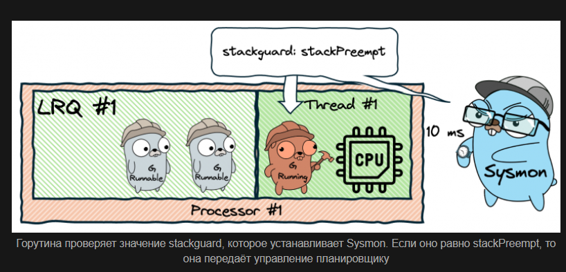

Такой путь называют **кооперативным вытеснением**: запрос создаёт среда выполнения,
а безопасный переход происходит при следующей подходящей проверке.

### Принудительное вытеснение (Go 1.14+)

Кооперативный путь не справляется с вычислительной горутиной, которая не вызывает
функции и не блокируется. Пример — бесконечный цикл при одном P.

```go
package main

import (
    "runtime"
    "time"
)

func main() {
    // Устанавливаем количество процессоров = 1
    runtime.GOMAXPROCS(1)

    // Запускаем "жадную" горутину, которая захватит процессор
    go func() {
        sum := 0
        for {
            sum++ // бесконечный цикл без вызовов функций
        }
    }()

    // Запускаем time.Sleep, чтобы передать управление жадной горутине
    // и не выйти раньше времени из main()
    time.Sleep(time.Second)
}

```

Она не доходит до проверки `stackguard0` и не блокируется, поэтому одного
кооперативного запроса недостаточно.

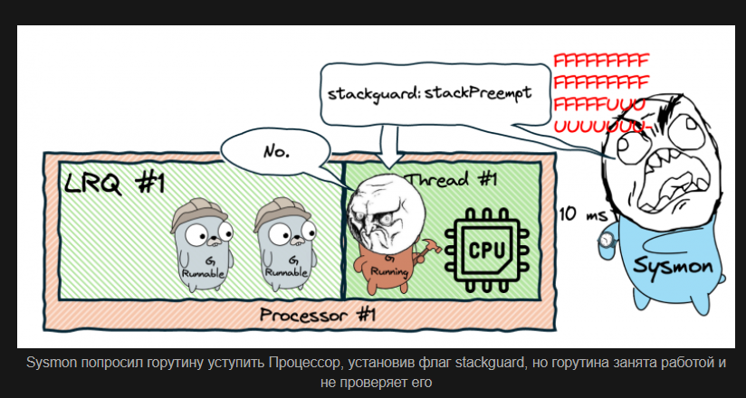

Для таких случаев Go 1.14 ввёл **асинхронное (некооперативное) вытеснение** на основе сигналов ОС:

1. **Обнаружение.** `sysmon` замечает, что один временной интервал планирования
   продолжается дольше порога, и инициирует вытеснение.
2. **Прерывание потока.** В Unix-системах среда выполнения использует сигнал
   `SIGURG`; в Linux он отправляется конкретному потоку через `tgkill`. На других
   платформах применяются их механизмы прерывания потока.
3. **Проверка безопасной точки.** Обработчик убеждается, что текущую инструкцию можно
   безопасно прервать, и подготавливает продолжение через функцию асинхронного
   вытеснения.

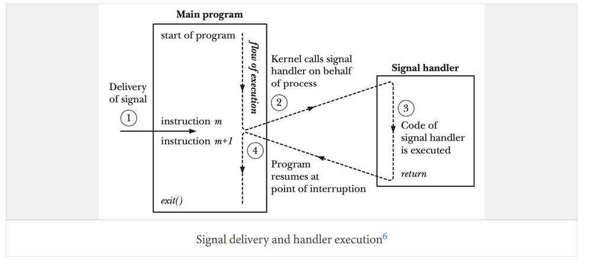

4. **Перепланировка.** Контекст G сохраняется, после чего она снова становится
   готовой. Обычно она помещается в глобальную очередь; при остановке мира среда
   выполнения может оставить её в `runnext` текущего P.

Между решением `sysmon` и фактическим прерыванием есть задержка. Горутина может
выполняться дольше 10 мс: это порог попытки вытеснения, а не квант с жёсткой
границей.

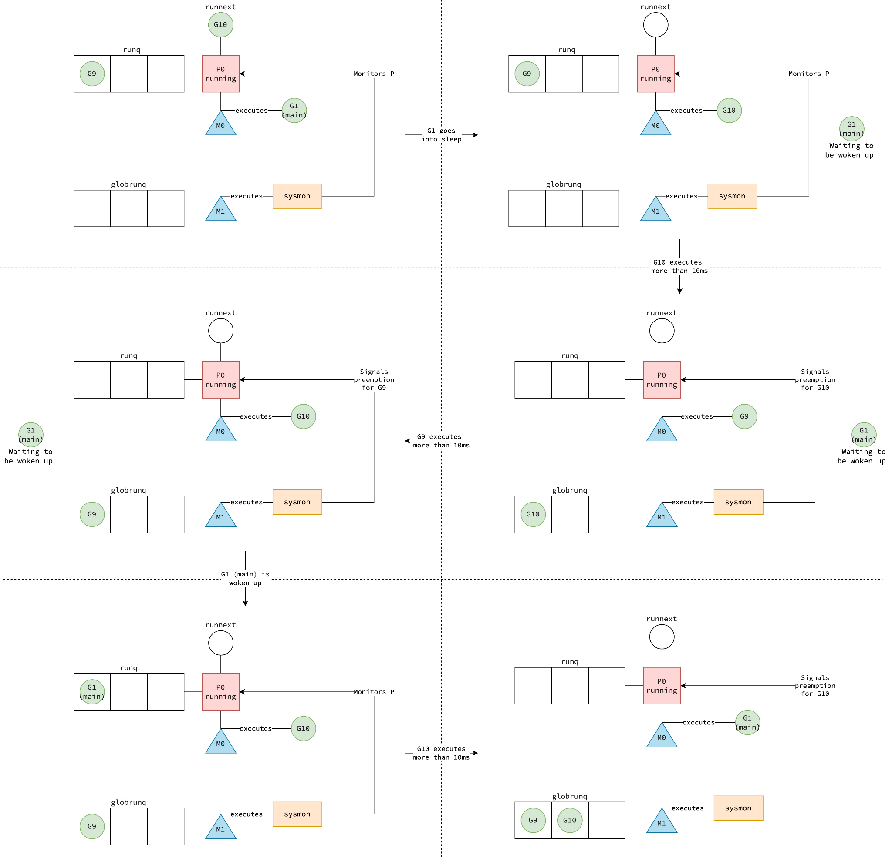

Асинхронное вытеснение возможно не на каждой инструкции. Код среды выполнения,
участки без точной информации об указателях и некоторые критические секции могут
временно отложить его. Горутина в системном вызове в этот момент не исполняет
пользовательский Go-код, поэтому её P освобождается другим механизмом.

### Сравнение с планировщиком ОС

* **Планировщик ОС** — вытесняющий. Решения о переключении принимаются ядром недетерминированно.
* **Планировщик Go** сочетает переходы в безопасных точках, парковку и асинхронное
  вытеснение пользовательского кода.

Прикладной код должен считать планирование недетерминированным: заранее неизвестно,
когда произойдёт переключение и какая готовая G будет выбрана.


В современной версии Go обычно не нужно вставлять `runtime.Gosched()` в
вычислительный цикл только ради справедливости. Явная отмена и разбиение слишком
крупной работы всё равно нужны для управляемого времени ответа приложения.

***

## 6. Ввод-вывод и планировщик

Когда операция не может завершиться немедленно, планировщику важно освободить P для
другой работы. Дальнейшее поведение зависит от того, умеет ли среда выполнения ждать
готовность ресурса без блокировки потока ОС.

| Ситуация | Горутина G | Поток M | Процессор P |
|---|---|---|---|
| блокирующий системный вызов | находится в `_Gsyscall` до возврата из ядра | остаётся внутри вызова | сначала остаётся у M, но может быть отобран или передан |
| ожидание через сетевой опросщик | паркуется в `_Gwaiting` | может выполнять другие горутины | остаётся доступен планировщику |

P — логический ресурс среды выполнения, а не физическое ядро. Блокировка M в ядре ОС
не означает, что соответствующее аппаратное ядро обязательно простаивает: ОС может
запустить на нём другой поток.

### Путь 1: блокирующий системный вызов

Обычное чтение файла на Unix и другие операции, для которых нет подходящего
неблокирующего опросщика, могут удерживать M до завершения системного вызова.

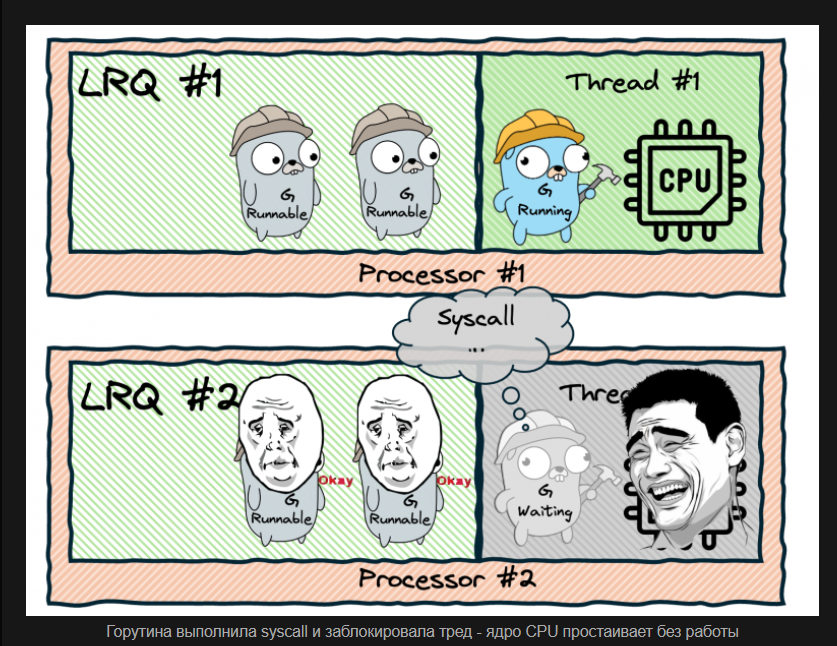

#### Вход в системный вызов

Перед вызовом, который учитывается планировщиком, `runtime.entersyscall` сохраняет
указатель стека, адрес возврата и указатель кадра горутины, запоминает текущий P в
`m.oldp`, а затем переводит G из `_Grunning` в `_Gsyscall`.

В Go 1.27 обычный `entersyscall` не разрывает связь M–P немедленно и не переводит P
в отдельное состояние `Syscall`: значение `_Psyscall` больше не используется. Такой
быстрый путь выгоден, если вызов завершится почти сразу. Вариант
`entersyscallblock`, получивший явную подсказку о возможной блокировке, напротив,
сразу освобождает P и вызывает `handoffp`.

**Передача (handoff) P** — это отказ текущего M от права выполнять на этом P Go-код. В исходном
коде соответствующая функция называется `handoffp` — «передать P дальше». Она не
обязательно связывает P с другим M: сначала проверяет, есть ли работа, ради которой
нужно сохранить P активным, а при её отсутствии помещает P в список свободных.

Низкоуровневые обёртки `Syscall` и `RawSyscall` не следует понимать как универсальную
классификацию всех операций на «долгие» и «быстрые». На поддерживаемых Unix-платформах
`Syscall` уведомляет планировщик через `entersyscall` и `exitsyscall`, а `RawSyscall`
обходит эту логику. Поэтому `RawSyscall` допустим только там, где вызывающий код
гарантирует, что операция не заблокирует поток. Прикладному коду обычно нужны пакеты
`os`, `net` или `golang.org/x/sys`, а не прямой выбор этой обёртки.

Исходный код: [`entersyscall` и `entersyscallblock`](https://github.com/golang/go/blob/go1.27.0/src/runtime/proc.go#L4642-L4900).

#### Как P возвращается планировщику

Если обычный системный вызов задержался, `sysmon` может отобрать его P и передать
другому M. `sysmon` — служебный поток без P; он работает независимо от рабочих M и
периодически вызывает `retake`.

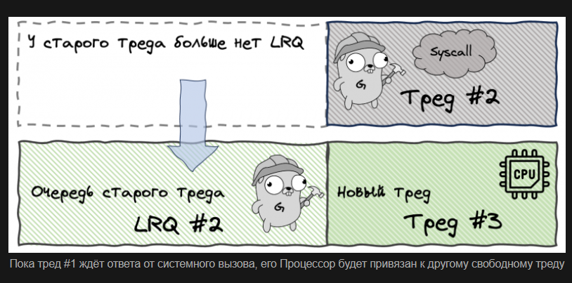

Решение зависит не только от длительности вызова. `retake` учитывает наличие работы в
очереди P, число свободных P и активно ищущих M, изменение `syscalltick` и прошедшее
время. Если другой исполнитель уже доступен и очередь P пуста, отбор можно ненадолго
отложить; примерно через 10 мс это послабление заканчивается. При наличии полезной
работы P может быть отобран раньше.

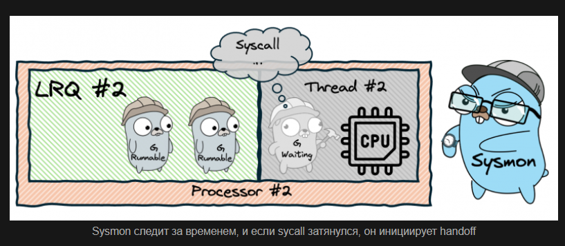

Если для P найдена локальная, глобальная, трассировочная или работа сборщика мусора,
`handoffp` вызывает `startm`. Эта функция сначала пытается использовать припаркованный
M и создаёт новый только при его отсутствии. Если выполнять нечего, `handoffp`
переводит P в состояние `Idle` и при необходимости сообщает сетевому опросщику о
ближайшем таймере. Поэтому множество одновременных блокирующих вызовов может сильно
увеличить число потоков ОС, но формулировка «каждый вызов создаёт M» неверна.

#### Возврат из системного вызова

После возвращения из ядра `runtime.exitsyscall` пытается снова получить право
выполнять Go-код:

1. Если M не потерял P, горутина продолжает работу по быстрому пути.
2. Если P был отобран, среда выполнения пытается вернуть прежний P, а затем получить
   любой свободный.
3. Если свободного P нет, G переводится в `_Grunnable` и помещается в GRQ, а M без P
   останавливается или ждёт следующего назначения.

**M сохранил P:**

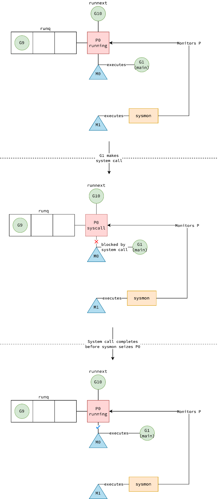

**P был отобран:**

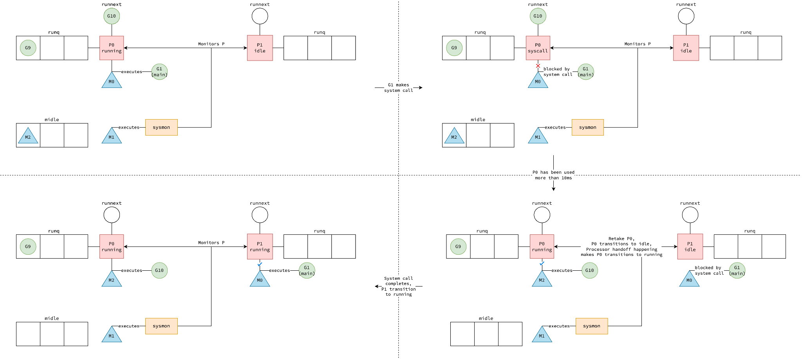

Исходный код: [`exitsyscall`](https://github.com/golang/go/blob/go1.27.0/src/runtime/proc.go#L4922-L5135)
и [`retake`](https://github.com/golang/go/blob/go1.27.0/src/runtime/proc.go#L6681-L6767).

#### Вызовы C-кода

Во время вызова C-функции через cgo текущая G остаётся связанной с M, а сам M занят до
возврата из C. P при необходимости можно передать другому M, поэтому остальные
горутины продолжают выполняться, но большое число длительных вызовов C способно
увеличить число потоков ОС заметно выше `GOMAXPROCS`.

Планировщик Go не может вытеснить выполняющийся C-код так же, как обычный Go-код.
Практический способ уменьшить накладные расходы — сократить число переходов через
границу Go–C и не запускать неограниченное число одновременных длительных вызовов.
`runtime.LockOSThread` нужен только при требовании C-библиотеки к привязке состояния
или интерфейса к конкретному потоку; это не общая оптимизация cgo.

### Путь 2: ожидание через сетевой опросщик

Для сокетов и других поддерживаемых ресурсов Go использует неблокирующий режим и
**сетевой опросщик** (`netpoll`). Когда операция пока невозможна, блокируется только
G: её M и P остаются доступными для других горутин.

#### Зачем нужны неблокирующий режим и мультиплексирование

При блокирующем вводе-выводе вызов удерживает поток до результата. В неблокирующем
режиме операция немедленно возвращает `EAGAIN` или `EWOULDBLOCK`, если ресурс ещё не
готов.

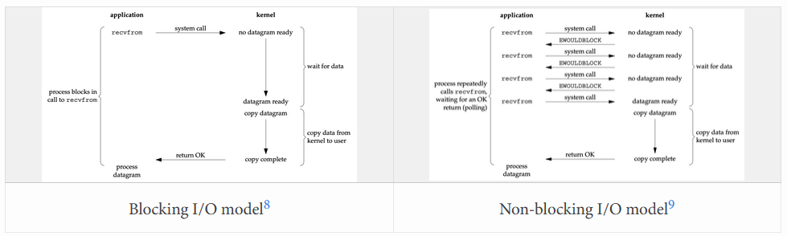

**Файловый дескриптор (FD)** в Unix — это небольшое неотрицательное число, по которому
процесс обращается к открытому ресурсу ядра ОС. Таким ресурсом может быть обычный
файл, сетевой сокет, канал или терминал. Дескриптор — не сам ресурс, а запись в таблице
открытых ресурсов конкретного процесса. Например, `read(fd, ...)` читает из ресурса,
на который указывает `fd`, а `close(fd)` закрывает эту запись. Несмотря на слово
«файловый» в названии, механизм применяется не только к файлам.

Сетевой опросщик регистрирует дескриптор и просит ОС сообщить, когда связанный с ним
ресурс будет готов к чтению или записи. В Windows вместо Unix-дескрипторов используются
значения `HANDLE` и `SOCKET`, но для `netpoll` их роль похожа: они обозначают открытые
ресурсы, события которых нужно отслеживать.

Чтобы не повторять `read` в цикле, программа регистрирует множество дескрипторов в
одном механизме ожидания и получает только события готовности. Это называется
мультиплексированием ввода-вывода.

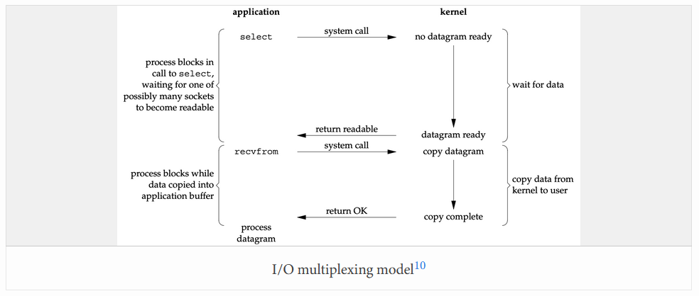

#### Механизмы ожидания событий операционной системы

У этих интерфейсов общая задача — не выделять отдельный поток на каждый ожидающий
ресурс. Однако решают они её по-разному.

Go выбирает механизм в зависимости от платформы:

| Платформа | Механизм | Модель |
|---|---|---|
| Linux | `epoll` | уведомление о готовности |
| macOS и BSD | `kqueue` | уведомление о готовности |
| Windows | IOCP | уведомление о завершении операции |

**`select`.** Программа передаёт ядру несколько наборов дескрипторов и получает
обратно наборы, в которых отмечены готовые. При каждом вызове наборы приходится
копировать и просматривать заново. На многих Unix-системах размер набора ограничен
константой `FD_SETSIZE`, часто равной 1024. Ключевое слово `select` языка Go работает
с каналами и не связано с одноимённым системным вызовом.

**`poll`.** Вместо битовых наборов принимает массив структур `pollfd`, поэтому не
имеет ограничения `FD_SETSIZE`. Но весь массив по-прежнему передаётся ядру и линейно
просматривается при каждом ожидании. Цена вызова растёт вместе с числом отслеживаемых
дескрипторов, даже если готов только один.

**`epoll`.** Linux хранит набор интересующих дескрипторов в ядре. Программа изменяет
его через `epoll_ctl`, а `epoll_wait` возвращает пакет событий только для готовых
дескрипторов. Поддерживаются уведомления по уровню и по изменению состояния. Среда
выполнения Go использует `epoll` как основу сетевого опросщика в Linux.

**`kqueue`.** BSD и macOS используют очередь событий ядра. Фильтры `EVFILT_READ` и
`EVFILT_WRITE` сообщают о готовности чтения и записи; тот же интерфейс способен
следить за процессами, сигналами, таймерами и изменениями файловой системы. Для
сетевого опросщика Go важны прежде всего события ввода-вывода.

**IOCP.** В Windows операция запускается заранее в асинхронном режиме, а после её
завершения ядро помещает сообщение в порт завершения ввода-вывода. Это не просто
сигнал «можно читать»: к моменту уведомления операция уже завершена. Такой подход
называют моделью завершения.

**`io_uring`.** Современный интерфейс Linux использует разделяемые с ядром кольцевые
очереди отправки и завершения. Через них можно запускать сетевые, файловые и другие
операции, уменьшая число отдельных системных вызовов. Это более широкий интерфейс,
чем `epoll`, но в Go 1.27 стандартный `netpoll` продолжает использовать `epoll`, а не
`io_uring`.

Таким образом, `select`, `poll`, `epoll` и `kqueue` в основном сообщают о готовности
ресурса, а IOCP сообщает о завершении запущенной операции. `io_uring` также работает
через очередь отправки и очередь завершения, поэтому не является прямой заменой
`epoll` с полностью одинаковой моделью.

Не каждый файл и не каждый дескриптор автоматически подключается к сетевому
опросщику. Внутренний тип `poll.FD` получает признак `pollable`; поддерживаемые сокеты
работают в неблокирующем режиме, а обычные дисковые файлы на Unix, как правило,
выполняют блокирующие системные вызовы.

#### Регистрация и ожидание

С поддерживаемым дескриптором связана структура `pollDesc`. Она хранит сам
дескриптор, сроки ожидания и отдельные места для горутин, ожидающих чтение (`rg`) и
запись (`wg`). На Linux первая инициализация опросщика создаёт один экземпляр
`epoll`, а регистрация `pollDesc` добавляет дескриптор через `EPOLL_CTL_ADD`.

Когда горутина вызывает `conn.Read()`, путь выглядит так:

1. `internal/poll.FD.Read` вызывает `read`.
2. Если данные доступны, вызов сразу возвращает результат.
3. При `EAGAIN` код подготавливает ожидание и вызывает `runtime_pollWait`.
4. `netpollblock` сохраняет G в `pollDesc.rg` и паркует её через `gopark`. M с P
   возвращаются к планировщику.
5. После уведомления ОС `netpoll` находит `pollDesc`, извлекает ожидающую G и передаёт
   её планировщику.
6. Горутина становится `_Grunnable`, получает P в обычном порядке и повторяет `read`.

```text
conn.Read
    ↓
read вернул EAGAIN
    ↓
runtime_pollWait → netpollblock
    ↓
G сохранена в pollDesc.rg и припаркована
    ↓
epoll / kqueue / IOCP сообщает о событии
    ↓
netpoll извлекает G → планировщик делает её готовой
    ↓
G продолжает чтение
```

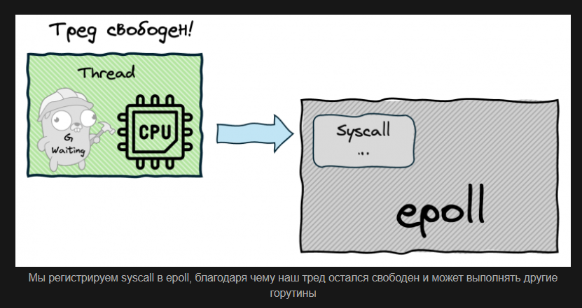

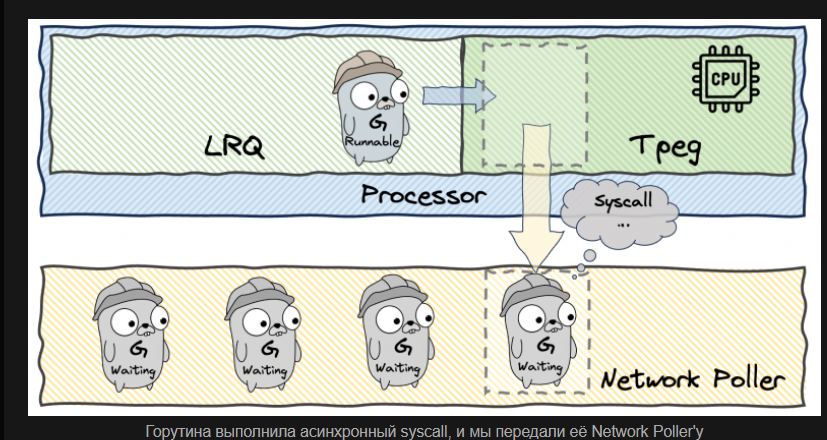

При закрытии дескриптора ожидающие горутины разблокируются, а `pollDesc` удаляется из
платформенного опросщика. Например, Linux использует `EPOLL_CTL_DEL`.

Исходный код: [`runtime/netpoll.go`](https://github.com/golang/go/blob/go1.27.0/src/runtime/netpoll.go#L245-L620)
и [`internal/poll.FD.Read`](https://github.com/golang/go/blob/go1.27.0/src/internal/poll/fd_unix.go#L141-L181).

#### Где выполняется `netpoll`

Выделенного постоянно работающего потока сетевого опросщика нет. В Go 1.27:

* `findRunnable` сначала может вызвать `netpoll(0)` без блокировки — после проверки
  LRQ и GRQ, но до кражи работы;
* когда обычной работы нет, один M освобождает P и блокируется в `netpoll` до сетевого
  события или срока ближайшего таймера;
* `sysmon` выполняет запасной неблокирующий опрос, если с предыдущего опроса прошло
  больше 10 мс.

На Linux один вызов `epoll_wait` читает пакет до 128 событий — это деталь реализации,
а не ограничение числа соединений. Полученные горутины распределяет `injectglist`:
они могут попасть в GRQ, в LRQ текущего P и вызвать запуск M на свободных P. Поэтому
неверно утверждать, что все результаты всегда добавляются в одну LRQ.

#### Пример: сервер `net/http`

`http.Server` использует TCP-сокеты, поэтому ожидание новых соединений и данных может
проходить через сетевой опросщик без удержания отдельного M на каждое соединение.

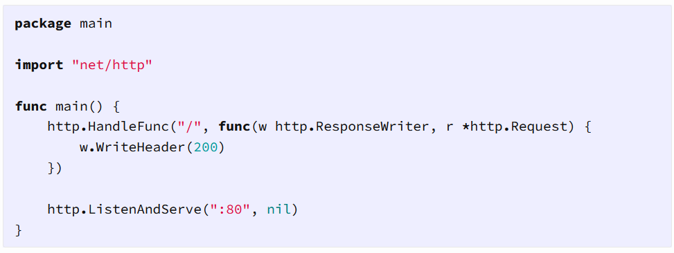

`ListenAndServe` создаёт слушающий сокет, `Serve` принимает соединения, а `net/http`
запускает горутину обслуживания каждого принятого соединения. `HandleFunc` только
регистрирует обработчик запросов; он не является обёрткой над `read` и `write`.

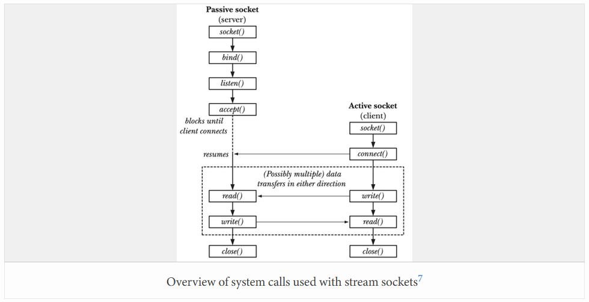

Подробный путь HTTP-запроса разобран в [справочнике по HTTP](../../architecture/HTTP/reference.md).

### Практическое сравнение

* Длительный блокирующий системный вызов или вызов C занимает M и может привести к
  созданию дополнительных потоков.
* Ожидание поддерживаемого сетевого дескриптора паркует G, но не удерживает M.
* `GOMAXPROCS` ограничивает число P, одновременно выполняющих Go-код, а не общее число
  потоков M или ожидающих горутин.
* Десятки тысяч ожидающих соединений возможны благодаря парковке G и
  мультиплексированию, но каждая горутина и каждый дескриптор всё равно потребляют
  память и другие ресурсы.

***

## 7. Внутреннее устройство: от запуска до цикла планирования

### Связь планировщика с компилятором и средой выполнения

Планировщик — часть пакета `runtime`, код которого компоновщик включает в программу.
Он работает внутри того же процесса и тех же потоков ОС, что и пользовательский код,
а не запускается как отдельная служба или виртуальная машина.

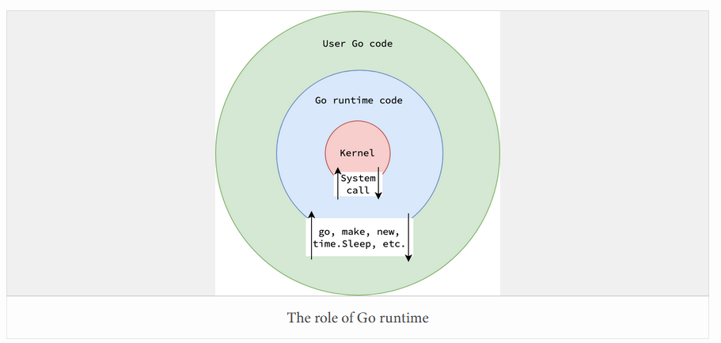

Компилятор преобразует оператор `go` во внутреннюю последовательность с обращением к
`runtime.newproc`, которая создаёт новую G и делает её готовой к выполнению. Это не
простая текстовая замена ключевого слова, а результат преобразования внутреннего
представления программы.

Часть внутренних операций компилятор генерирует непосредственно. Например,
`runtime.getg` превращается в получение указателя на текущую G без обычного вызова
Go-функции. Переключение на сохранённый контекст через `gogo`, напротив, реализовано
платформенными ассемблерными функциями среды выполнения.

Общая схема сборки, роль `new`, директива `//go:linkname` и путь от точки входа ОС до
`runtime.main` вынесены в отдельную статью
[«Компиляция и запуск Go-программы»](../Компиляция%20и%20оптимизации%20Go/compilation-and-startup.md).

### Начальная загрузка

Платформенная точка входа передаёт управление ассемблерной функции
`runtime·rt0_go`, после чего значительная часть инициализации выполняется кодом Go:

1. Создаются **M0** (основной поток) и **G0** (горутина системного стека M0).
2. Настраивается платформенный способ хранить указатель на текущую G — через
   локальное для потока хранилище или выделенный регистр.
3. `runtime·schedinit` и `procresize` создают или активируют набор P в соответствии
   с `GOMAXPROCS`.
4. M0 получает первый P.
5. Создаётся основная горутина для `runtime.main` — точки входа среды выполнения.
6. После старта `runtime.main` запускается служебный поток `sysmon`, а также
   создаются другие системные горутины среды выполнения.
7. M0 вызывает `mstart` — вход в цикл планирования.

`runtime.main` отличается от пользовательской `main`. Компоновщик связывает
пользовательскую функцию с внутренним именем `main_main`; после инициализации
`runtime.main` вызывает её.

Следующая схема показывает только основные сущности при `GOMAXPROCS=2`:

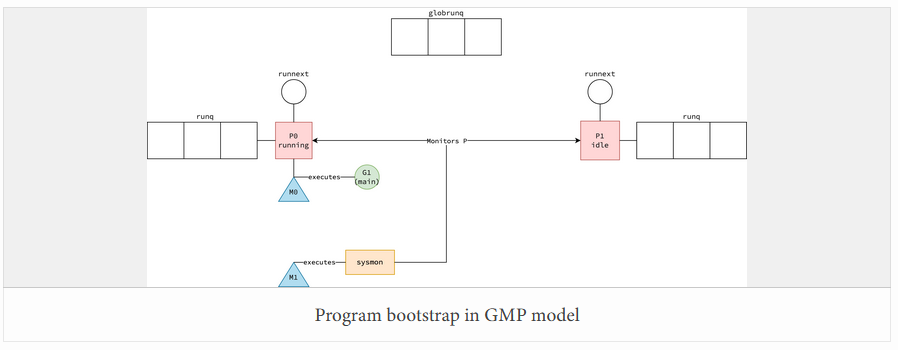

В реальном процессе к этому моменту могут существовать дополнительные системные G
и платформенные потоки. Нельзя считать, что их всегда ровно одна и два
соответственно или что поток `sysmon` обязательно имеет конкретный номер M.

### Создание горутины

Компилятор преобразует `go func() { ... }()` в последовательность с обращением к
`runtime.newproc`. Создание G проходит в три основных шага:

**Инициализация:** свободная структура G переиспользуется или выделяется новая.
Базовый минимальный стек задаёт `stackMin = 2 КБ`, но фактическое выделение зависит
от платформы. Контекст подготавливается так, чтобы после возврата пользовательской
функции управление перешло в `goexit`. G становится `_Grunnable`.

**Помещение в очередь:** P имеет слот `runnext` и кольцевой буфер `runq`. Новая G
помещается в `runnext`; прежнее значение слота при необходимости переходит в
`runq`. При заполнении буфера часть локальной работы переносится в GRQ.

**Запуск дополнительного исполнителя:** после помещения горутины в очередь среда
выполнения при необходимости вызывает `wakep`. Если работу уже активно ищет другой M
или свободного P нет, дополнительный поток не запускается. Иначе свободный P
передаётся припаркованному M, а при отсутствии такого M создаётся новый поток ОС.

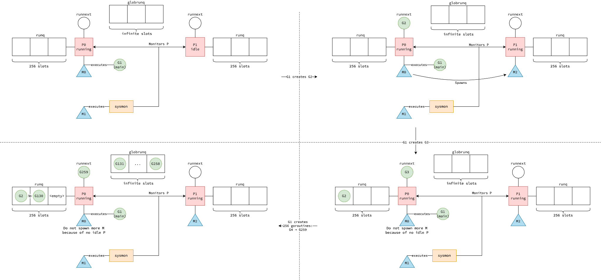

Если все P заняты, дополнительный M не сможет выполнять Go-код: готовые горутины
останутся в очередях до освобождения одного из P.

`runnext` повышает вероятность быстрого запуска дочерней горутины на том же P, но не
гарантирует порядок: служебная работа, справедливость и другие события планировщика
могут изменить следующий выбор.

### Сохранённый контекст горутины

Пока G выполняется, её текущие значения находятся в регистрах потока M и в стеке.
Чтобы приостановить G и позднее продолжить её на том же или другом M, среда
выполнения сохраняет необходимую часть контекста в поле `g.sched` типа `gobuf`.

| Поле `gobuf` | Что сохраняет |
|---|---|
| `sp` | Указатель вершины стека |
| `pc` | Адрес инструкции, с которой нужно продолжить выполнение |
| `g` | Ссылку на соответствующую G |
| `ctxt` | Дополнительный контекст вызова, например значение функции-замыкания |
| `lr` | Регистр возврата на архитектурах, где он используется |
| `bp` | Указатель кадра на архитектурах и в сборках, где он включён |

`gobuf` — не полная копия всех регистров процессора. В нём хранится минимальный
контекст, необходимый конкретным процедурам переключения. Ассемблерная функция
`gogo` восстанавливает его и передаёт управление горутине.

Стек состоит из кадров вызовов. Каждый кадр относится к конкретному вызову функции
и содержит её локальные данные, сведения для возврата и служебную информацию,
которую определяют соглашение о вызовах и компилятор.

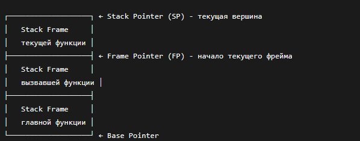

Пример последовательности кадров при вложенных вызовах:

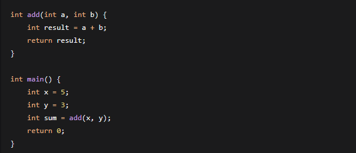

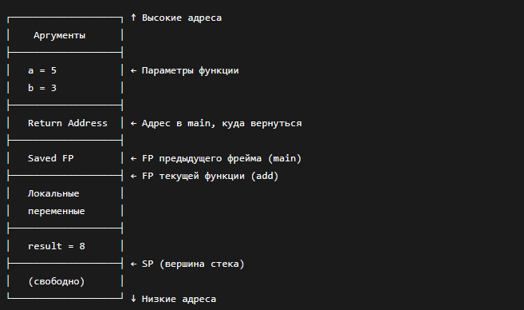

В ассемблере Go имя `FP` обозначает псевдорегистр для обращения к аргументам
текущего кадра. Его нельзя автоматически отождествлять с аппаратным указателем
кадра. Поле `bp` в `gobuf`, напротив, хранит значение аппаратного регистра только
там, где сборка действительно использует цепочку кадров.

### Проверка и перенос стека

Компилятор добавляет в начало большинства функций проверку свободного места в
стеке. Она сравнивает указатель стека с `stackguard0`. Если новый кадр не помещается,
низкоуровневая функция `morestack` сохраняет контекст G и переключается на `g0`,
после чего `newstack` рассчитывает новый размер.

Обычный путь переноса выглядит так:

1. вычисляется размер не меньше удвоенного прежнего стека и не меньше размера,
   необходимого следующему кадру;
2. G переводится во внутреннее состояние `_Gcopystack`, чтобы её стек не
   сканировался и не изменялся одновременно;
3. `copystack` копирует используемую часть стека и исправляет известные среде
   выполнения указатели на него;
4. старый блок освобождается, состояние возвращается в `_Grunning`, а `gogo`
   продолжает выполнение сохранённой инструкции.

Уменьшение использует ту же функцию `copystack`, но выбирает блок вдвое меньше.
Оно возможно только тогда, когда среда выполнения владеет остановленным стеком и
занято менее его четверти. Значение типа `uintptr`, в котором прикладной код вручную
сохранил адрес из стека, не является указателем для сборщика и не обязано
исправляться при переносе — ещё одна причина не хранить адреса таким способом.

Исходный код реализации: [`g` и `gobuf`](https://github.com/golang/go/blob/go1.27.0/src/runtime/runtime2.go),
[`newstack`, `copystack` и `shrinkstack`](https://github.com/golang/go/blob/go1.27.0/src/runtime/stack.go).

### Цикл планирования

Функция `schedule` ищет и запускает готовую G. В цикл входят новые потоки M, а
текущая G возвращает управление после завершения, парковки, добровольной уступки или
вытеснения.

После выбора G `execute` подготавливает её состояние, а `gogo` восстанавливает
контекст. Завершение проходит через `goexit` и `goexit0`, после чего M снова входит
в `schedule`.

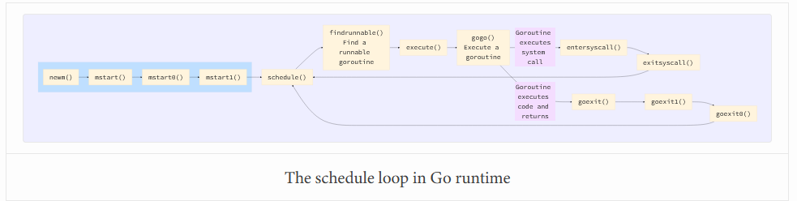

Цикл выполняется в M. Когда пользовательская `main` возвращается, `runtime.main`
завершает процесс, не ожидая автоматически остальные пользовательские G. Поэтому
их жизненным циклом должно управлять само приложение.

### Полный алгоритм `findRunnable`

Функция [`findRunnable`](https://github.com/golang/go/blob/go1.27.0/src/runtime/proc.go#L3400-L3813)
ищет готовую горутину и возвращает её функции `schedule`. Ниже приведён порядок для
Go 1.27. Это не пятнадцать независимых стадий, которые всегда выполняются до конца:
функция возвращается при первом успешном результате, может начать обход заново, а при
отсутствии работы — заблокировать или припарковать M.

1. **Обработать служебное состояние P.** Если ожидается остановка мира для сборки
   мусора, M приостанавливается и после возобновления начинает поиск заново. Затем
   выполняется назначенная P функция безопасной точки.
2. **Проверить таймеры текущего P.** Истёкшие таймеры выполняют свои функции
   обратного вызова и могут сделать горутины готовыми. Одновременно вычисляется срок
   ближайшего таймера, который понадобится, если M придётся ждать.
3. **Проверить приоритетные системные горутины.** Сначала среда выполнения пытается
   получить горутину чтения трассировки, затем рабочего сборщика мусора. Найденная
   горутина сразу возвращается в `schedule`.
4. **Обеспечить справедливость GRQ.** Когда `schedtick % 61 == 0`, из непустой
   глобальной очереди берётся одна горутина. Эта проверка не позволяет локальной
   очереди бесконечно оттеснять глобальную.
5. **Обработать другое служебное пробуждение.** Среда выполнения при необходимости
   пробуждает горутину финализатора и горутины очистки, а также вызывает функцию
   уступки управления cgo. Пробуждённая горутина может попасть в LRQ.
6. **Проверить LRQ текущего P.** `runqget` сначала проверяет `runnext`, затем
   кольцевой буфер `runq`. Горутины находятся в очереди конкретного P, но не
   закреплены за ним: другой P может их украсть.
7. **Проверить GRQ обычным способом.** Если локальной работы нет, из GRQ берётся
   одна горутина для немедленного выполнения. Часть полученного пакета помещается в
   пустую LRQ текущего P.
8. **Опросить сеть без блокировки.** Если сетевой опросщик инициализирован, есть
   ожидающие операции и другой M уже не выполняет этот опрос, вызывается
   `netpoll(0)`. Одна готовая горутина возвращается, остальные добавляются в очереди.
9. **Попытаться украсть работу.** Активный поиск разрешается, если M уже находится
   в этом состоянии или число таких M меньше половины числа занятых P. `stealWork`
   выполняет четыре обхода P. На последнем обходе он также проверяет их таймеры и
   разрешает кражу из `runnext`; на предыдущих обходах крадёт только из `runq`.
   Сработавший таймер может потребовать начать поиск заново.
10. **Найти работу сборщика мусора с пониженным приоритетом.** Если обычной работы
    нет, P может выполнить фоновую маркировку вместо перехода в простой.
11. **Выполнить платформенную проверку перед простоем.** Например, в WebAssembly
    она может вернуть горутину обработчика событий или потребовать повторить поиск.
12. **Перепроверить GRQ перед освобождением P.** Проверка выполняется под блокировкой
    планировщика, чтобы не пропустить работу, появившуюся одновременно с переходом P
    в состояние простоя. Также учитывается запрос на новый активно ищущий M.
13. **Освободить P и завершить активный поиск.** Если M был активно ищущим, после
    изменения этого состояния он ещё раз проверяет GRQ, локальные очереди всех P,
    фоновую работу сборщика мусора и сроки таймеров. Эти повторные проверки нужны,
    чтобы не оставить готовую работу без выполняющего её M.
14. **Перейти к блокирующему ожиданию сети.** Один M может вызвать `netpoll` с
    ожиданием до ближайшего таймера. Если сеть вернула готовые горутины и удалось
    получить свободный P, одна из них возвращается в `schedule`, а остальные
    помещаются в очереди. Если сработал только срок таймера, поиск начинается заново.
15. **Припарковать M.** Если ждать сеть в этом M не нужно или свободной работы нет,
    вызывается `stopm`. После пробуждения функция возвращается к началу поиска.

Повторные проверки — не лишнее дублирование. Между первым просмотром очередей и
освобождением P другая горутина может создать новую работу или изменить таймер.
Порядок перехода из активного поиска в сон устроен так, чтобы одновременно не
остались простаивающий P и готовая горутина.

> **Зачем это Go-разработчику.** `findRunnable` объясняет, почему `time.Sleep` не
> блокирует поток ОС. Спящая горутина регистрирует таймер и освобождает M для другой
> работы. После истечения срока функция таймера переводит горутину в готовое
> состояние. Сетевой опросщик может ждать до срока ближайшего таймера, но не он
> пробуждает горутину `time.Sleep`.

### Внутренние примитивы планировщика

Следующие функции не являются открытым интерфейсом Go. Они приведены, чтобы связать
описанные выше переходы с исходным кодом среды выполнения.

#### `getg`: получить текущую G

`getg()` возвращает указатель на G, которая сейчас выполняется в текущем потоке.
Компилятор обрабатывает эту функцию как внутреннюю операцию и получает значение из
выделенного регистра или локального для потока хранилища в зависимости от
архитектуры. Прикладному коду `getg` недоступна.

#### `gopark` и `park_m`: припарковать G

`gopark` подготавливает перевод текущей G в ожидание: записывает причину и функцию,
которая должна освободить связанную блокировку, а затем через `mcall` переключается
на `g0` и вызывает `park_m`.

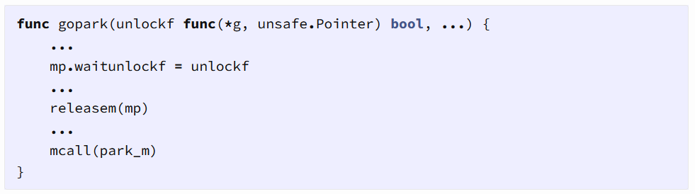

Пара `acquirem` и `releasem` временно запрещает вытеснение в коротком участке между
записью служебных полей и переходом на `g0`. `releasem` не создаёт запрос
вытеснения: если такой запрос уже существовал, она восстанавливает значение
`stackPreempt`, которое могло быть временно очищено.

`park_m` переводит G из `_Grunning` в `_Gwaiting` и разрывает связь G–M. Затем
вызывается переданная функция освобождения. Если она возвращает `false`, парковка
отменяется и G немедленно продолжает работу через `execute`. Иначе M входит в
`schedule`, а припаркованную G позднее должен сделать готовой другой участник.

#### `startm`: предоставить P исполнителю

`startm` запускает выполнение на указанном P. Если P не передан, функция пытается
получить свободный P; при его отсутствии возвращается.

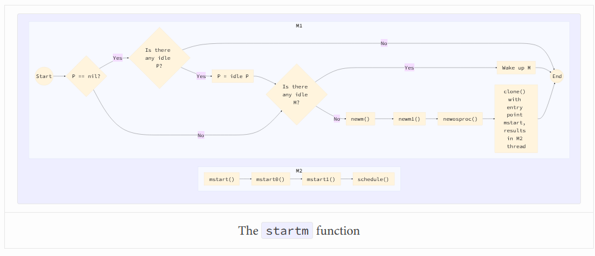

Для найденного P сначала берётся припаркованный M. Новый поток ОС создаётся, только
если подходящего M нет. На Linux создание потока в итоге использует `clone`, а на
других платформах — их системные механизмы.

#### `stopm`: припарковать M

`stopm` помещает M в список неактивных потоков и блокирует его до нового назначения.
На Linux низкоуровневое ожидание может использовать `futex`. После пробуждения M
обязан снова иметь P, прежде чем продолжить цикл планирования.

#### `handoffp`: распорядиться освобождённым P

`handoffp` получает P, от которого отказался M, например перед блокирующим системным
вызовом. Функция выбирает дальнейшую судьбу P:

* при наличии локальной, глобальной, трассировочной работы или работы сборщика
  вызывает `startm`;
* при необходимости запускает M в режиме активного поиска или сетевого ожидания;
* если немедленной работы нет, помещает P в список свободных и учитывает ближайший
  таймер.

Таким образом, `handoffp` означает «передать или освободить P», а не «обязательно
создать новый M».

***

## 8. Сборщик мусора и планировщик

Здесь рассматривается только взаимодействие сборщика мусора с планировщиком.
Трёхцветная маркировка, барьер записи, очистка памяти и настройка размера кучи
разобраны в [отдельном справочнике о сборщике мусора](../Сбощик%20мусора%20в%20Go/runtime-reference.md).

### Как работа сборщика получает процессор P

Во время конкурентной маркировки среда выполнения создаёт служебные горутины. Как
и пользовательскому коду, для выполнения им нужны поток M и процессор P. Отдельного
набора процессорных ядер для сборщика нет: его работа разделяет доступное
процессорное время с программой.

В Go 1.27 функция `findRunnable` ищет работу маркировки в двух местах:

1. В начале поиска, до локальной и глобальной очередей, она проверяет, должен ли
   текущий P выполнять обычную работу маркировки. Решение принимает контроллер
   сборщика: он учитывает текущую фазу и необходимую долю процессорного времени.
2. Если пользовательской работы, таймеров и сетевых событий не найдено, планировщик
   может запустить маркировку в режиме простоя. Так свободный P помогает сборщику,
   не вытесняя готовую пользовательскую горутину.

Поэтому фраза «сборщик всегда имеет более высокий приоритет» неверна. Часть его
работы планируется заранее, а часть выполняется только на простаивающих ресурсах.

### Что происходит во время остановки мира

Некоторые короткие этапы сборки требуют **остановки мира (STW)** — периода, когда
пользовательский Go-код не выполняется. Среда выполнения выставляет признак
`gcwaiting` и просит все P остановиться в безопасной точке.

Если M в этот момент ищет следующую горутину, `findRunnable` вызывает `gcstopm`:

1. M отсоединяет свой P;
2. P переходит в служебное состояние `_Pgcstop`;
3. M паркуется до возобновления мира.

Выполняющаяся горутина должна сначала дойти до безопасной точки. В большинстве
случаев среда выполнения может ускорить это с помощью асинхронного вытеснения.
После завершения служебного этапа P снова разрешают выполнять горутины.

### Помощь сборщику при выделении памяти

Рабочие горутины сборщика — не единственный источник маркировки. Если программа
выделяет память быстрее, чем сборщик успевает её обрабатывать, выделяющая память
горутина получает долг перед сборщиком и сама выполняет часть маркировки. Этот
механизм называется **помощью сборщику (GC assist)**.

Такая работа выполняется внутри пути выделения памяти, а не выбирается
`findRunnable` как отдельная горутина. Поэтому интенсивные выделения могут увеличить
задержку именно той горутины, которая их делает. `GOGC` и `GOMEMLIMIT` влияют на
целевой размер кучи и частоту циклов сборки, а значит — косвенно и на объём такой
помощи; это не отдельные переключатели механизма.

### Как отличить влияние сборщика от задержки планировщика

Одного роста задержки запуска горутин недостаточно, чтобы обвинить сборщик.
Сопоставляйте профиль процессора и трассировку со следующими показателями
`runtime/metrics`:

| Показатель | Что помогает увидеть |
|---|---|
| `/cpu/classes/gc/mark/assist:cpu-seconds` | Время, которое пользовательские горутины потратили на помощь при маркировке |
| `/cpu/classes/gc/mark/dedicated:cpu-seconds` | Время выделенных рабочих горутин маркировки |
| `/cpu/classes/gc/mark/idle:cpu-seconds` | Маркировку, выполненную на простаивающих P |
| `/sched/pauses/total/gc:seconds` | Распределение полной длительности остановок мира для сборки мусора |
| `/sched/latencies:seconds` | Время ожидания готовых к выполнению горутин в очереди планировщика |

Рост `/sched/latencies:seconds` при обычных показателях сборщика скорее указывает на
нехватку процессорного времени, длинные невытесняемые участки или другую нагрузку.
Рост времени помощи при маркировке вместе с высокой скоростью выделений памяти —
повод изучить профиль выделений.

Подробнее о фазах, алгоритме и настройках:

* [Краткий маршрут изучения сборщика мусора](../Сбощик%20мусора%20в%20Go/garbage-collector.md)
* [Подробный справочник по сборщику мусора](../Сбощик%20мусора%20в%20Go/runtime-reference.md)
* [`findRunnable` и `gcstopm` в исходном коде Go 1.27](https://github.com/golang/go/blob/go1.27.0/src/runtime/proc.go)
* [Реализация помощи при выделении памяти в Go 1.27](https://github.com/golang/go/blob/go1.27.0/src/runtime/mgcmark.go)

***

## 9. Открытые функции пакета `runtime`

### `GOMAXPROCS` и контейнеры

В Go 1.25+ среда выполнения по умолчанию берёт минимум из числа логических
процессоров, доступности процессоров для процесса и округлённой вверх квоты Linux
cgroup. Обычно значение не опускается ниже 2, если остальные ограничения это
допускают, и периодически пересчитывается.

`runtime.NumCPU()` сообщает число логических процессоров, доступных процессу на
старте, и не обязан равняться квоте. Смотрите фактический `GOMAXPROCS`, а не
выводите его из `NumCPU`. Вернуться к автоматическому значению можно через
`runtime.SetDefaultGOMAXPROCS()`.

Подбирать значение следует только после измерений; подробный порядок приведён в
[главе о диагностике](diagnostics.md#когда-менять-gomaxprocs).

### Goexit

`runtime.Goexit()` завершает текущую горутину, выполнив все отложенные вызовы
`defer`. Остальные горутины продолжают работу. Если `Goexit` вызвана в главной
горутине и других способных продолжить выполнение G не осталось, среда выполнения
обнаружит тупик. Функция применяется, в частности, внутри пакета `testing`.

### Gosched

`runtime.Gosched()` добровольно уступает выполнение. В Go 1.27 текущая G переводится
в `_Grunnable` и помещается в глобальную очередь, после чего M ищет другую работу.
Функция не приостанавливает горутину до какого-либо события и не гарантирует, какая
G будет выбрана следующей.

В прикладном коде `Gosched` требуется редко: ожидание лучше выражать каналом,
таймером, контекстом или примитивом синхронизации. Использовать её как общее лечение
голодания или способ сделать тест конкурентности детерминированным не следует.

### LockOSThread

`runtime.LockOSThread()` привязывает текущую горутину к тому M, на котором она
выполняется. Пока действует привязка, эта G не перейдёт на другой M, а другие G не
будут выполняться на закреплённом потоке. Типичные причины:

* **Взаимодействие с C-кодом через cgo:** библиотека требует сохранить локальное
  для потока состояние между вызовами.
* **Низкоуровневые графические библиотеки** (OpenGL, Vulkan): их контексты привязаны к потоку.

Обычно ставьте `defer runtime.UnlockOSThread()` сразу после блокировки. Однако
это требование жизненного цикла, а не утверждение о «вечном» потоке: если
привязанная горутина завершится, среда выполнения завершит связанный поток ОС.
Некоторые главные циклы с привязкой к потоку намеренно сохраняют её на весь срок
горутины; это нужно явно документировать.

***

## 10. Практические границы

### Ограничивайте работу, а не число потоков M

Для вычислительной нагрузки полезно держать число одновременно работающих задач
сопоставимым с доступным процессорным ресурсом, но точное значение зависит от
размера задач, их зависимостей и неравномерности. Его выбирают тестом
производительности, а не равенством «одна G на один P».

В службах с вводом-выводом горутин обычно больше, чем P. Ограничителем становится
не `GOMAXPROCS`, а пропускная способность базы данных, внешнего API, памяти или
очереди. Для таких границ используют семафор, ограниченную очередь или пул
обработчиков. Подробные шаблоны находятся в
[главе о конкурентности](../../computer-science/Параллельность%20и%20конкрентность/concurrency.md).

### Предотвращайте утечки горутин

Горутина утекает, когда не имеет достижимого пути к завершению: например, навсегда
ждёт отправку без получателя, чтение из незакрываемого канала или внешний вызов без
отмены. Пока G находится в структурах ожидания среды выполнения, сборщик мусора не
может считать её завершённой независимо от того, хранит ли прикладной код отдельную
ссылку на неё.

Для каждой запущенной G определяйте:

- кто и каким событием завершает её работу;
- как передаётся отмена;
- кто владеет закрытием канала;
- кто дожидается завершения;
- каким ограничением защищена внешняя операция.

Буферизованный канал иногда предотвращает конкретную заблокированную отправку, но
не является общим исправлением утечки.

### Не полагайтесь на наблюдавшийся порядок

`runnext`, локальная очередь и кража работы являются оптимизациями, а не
гарантиями порядка. `runtime.Gosched`, `time.Sleep` и изменение
`GOMAXPROCS` не превращают конкурентный тест в детерминированный. Требуемый порядок
выражают каналом, мьютексом, условной переменной, `WaitGroup` или другой явной
синхронизацией.

<a id="scheduler-diagnostics"></a>

### Диагностируйте по симптому

Не каждую задержку следует приписывать планировщику. Сначала проверьте загрузку
процессора, очередь приложения, внешние вызовы, число горутин и профили ожидания.
Трассировка нужна, когда важен порядок переходов G во времени.

Команды, метрики Go 1.27, регистратор полёта и пошаговый сценарий собраны в
[отдельной главе «Диагностика и настройка планировщика»](diagnostics.md).

## Ссылки

* [Диагностика программ Go](https://go.dev/doc/diagnostics)
* [Трассировка выполнения Go](https://go.dev/blog/execution-traces-2024)
* [Пакет `runtime/trace`](https://pkg.go.dev/runtime/trace)
* [Пакет `runtime/metrics`](https://pkg.go.dev/runtime/metrics)
