# Планировщик Go: от основ ОС до внутреннего устройства

## Введение

Документ посвящён **планировщику Go** — одному из ключевых компонентов рантайма, обеспечивающему эффективное выполнение тысяч горутин на ограниченном числе потоков операционной системы. Понимание планировщика необходимо для написания производительных конкурентных программ, диагностики проблем с утечкой горутин, голоданием и избыточным потреблением ресурсов.

Материал построен от фундамента к деталям реализации. Сначала рассматриваются основы планирования в операционной системе: треды, состояния, типы работ, переключение контекста и устройство процессорного кэша. Затем вводится модель GMP — горутины, машины и процессоры, — и объясняется, как Go-программа стартует, находит работу и переключается между горутинами. Далее разбираются механизмы вытеснения, обработка системных вызовов, сетевой ввод-вывод, внутреннее устройство рантайма, сборщик мусора и API. Завершает документ раздел о внутреннем устройстве горутины и практические выводы.

Документ ориентирован на Go-разработчиков, уже знакомых с основами языка и конкурентности. Предполагается понимание ключевого слова `go`, каналов и примитивов синхронизации.

***

## 1. Фундамент: планирование в операционной системе

### Треды и процессы

**Планировщик операционной системы** — это сложное программное обеспечение, учитывающее расположение и конфигурацию оборудования. Программа представляет собой набор машинных инструкций, которые должны выполняться последовательно. Для этого ОС использует концепцию **потока**, или **треда (thread)**. Задача треда — учёт и последовательное выполнение назначенных ему инструкций.

Каждая запущенная программа создаёт **процесс**, а каждому процессу — начальный тред. Треды способны порождать новые треды. Решения по планированию принимаются на уровне тредов, а не процессов. Треды могут работать **конкурентно** (по очереди на одном ядре) или **параллельно** (одновременно на разных ядрах). Каждый тред поддерживает собственное состояние для безопасного, локального и независимого выполнения инструкций.

Планировщик ОС решает четыре задачи:

* Не давать ядрам простаивать, если есть готовые треды.
* Создавать иллюзию одновременного выполнения всех готовых тредов.
* Запускать треды с более высоким приоритетом раньше низкоприоритетных, не лишая последних времени выполнения.
* Минимизировать задержки планирования через быстрые и точные решения.

> **Зачем это Go-разработчику.** Горутины в конечном счёте выполняются на тредах ОС. Понимание того, как ОС управляет тредами, помогает осознать ограничения, которые планировщик Go вынужден обходить.

### Состояния треда

Тред может находиться в одном из трёх состояний:

| Состояние                 | Описание                                                                                                                                                                      |
| ------------------------- | ----------------------------------------------------------------------------------------------------------------------------------------------------------------------------- |
| **Ожидание (Waiting)**    | Тред остановлен и ждёт: аппаратного обеспечения (диск, сеть), системного вызова или синхронизации (атомарные операции, мьютексы). Основная причина плохой производительности. |
| **Готовность (Runnable)** | Треду нужно процессорное время для выполнения инструкций. При большом числе готовых тредов каждый ждёт дольше и получает меньше времени.                                      |
| **Выполнение (Running)**  | Тред размещён на ядре и выполняет машинные инструкции.                                                                                                                        |

> **Зачем это Go-разработчику.** Состояния горутин (Waiting, Runnable, Running) зеркально отражают состояния тредов ОС. Зная семантику каждого состояния, вы можете мысленно моделировать поведение конкурентной программы.

### Типы работ: CPU-Bound и IO-Bound

Тред выполняет работу одного из двух типов:

* **CPU-Bound** — работа, не вызывающая переход в состояние ожидания. Постоянные вычисления. Пример: расчёт числа π до N-го знака.
* **IO-Bound** — работа, заставляющая тред переходить в ожидание. Сетевые запросы, системные вызовы, синхронизация (мьютексы, атомарные операции).

> **Зачем это Go-разработчику.** Тип нагрузки определяет оптимальное количество горутин. Для CPU-Bound нагрузок оптимально `GOMAXPROCS` горутин. Для IO-Bound — значительно больше, так как горутины часто блокируются и не конкурируют за процессор.

### Переключение контекста

Алгоритмы планирования делятся на два класса:

* **Невытесняющие (non-preemptive):** активный тред выполняется, пока сам добровольно не отдаст управление ОС.
* **Вытесняющие (preemptive):** решение о переключении принимает ОС, а не активная задача. Linux, macOS и Windows используют вытесняющий планировщик.

Следствия вытесняющего планирования для разработчика:

* Планировщик непредсказуем — невозможно определить, какой тред будет выбран и когда.
* Нельзя писать код, полагающийся на случайно подмеченное, но не гарантированное поведение.

**Переключение контекста (context switch)** — это процесс сохранения состояния текущего треда и восстановления состояния следующего. Тред из очереди готовых переходит в состояние выполнения; вытесненный тред — обратно в готовность (если может работать) или в ожидание (если заблокирован IO-Bound операцией).

Переключение контекста стоит от \~1000 до \~1500 наносекунд — за это время процессор мог бы выполнить от 12 до 18 тысяч инструкций.

* Для IO-Bound нагрузки переключение контекста полезно: пока один тред ждёт, ядро занято другим.
* Для CPU-Bound нагрузки переключение контекста — катастрофа: работа останавливается ради самого переключения.

> **Зачем это Go-разработчику.** Планировщик Go, как и ОС, вытесняющий (с версии 1.14). Переключение между горутинами дёшево (сотни наносекунд против тысяч у ОС), но не бесплатно. Бесконтрольное создание горутин в CPU-Bound сценариях ведёт к деградации производительности.

### Принцип «Меньше значит больше» и пулы тредов

В эпоху одноядерных процессоров планирование было простым: период планировщика делился на количество активных тредов. С ростом числа тредов временные срезы становятся слишком короткими, и большая часть времени тратится на переключение контекста, а не на полезную работу.

**Квант времени (time slice)** — непрерывный промежуток процессорного времени, выделяемый треду до переключения. Чтобы избежать слишком частых переключений, вводится минимальная длина кванта. Когда готовых тредов слишком много, планировщик вынужден увеличивать общий период, и тредам приходится ждать своей очереди гораздо дольше.

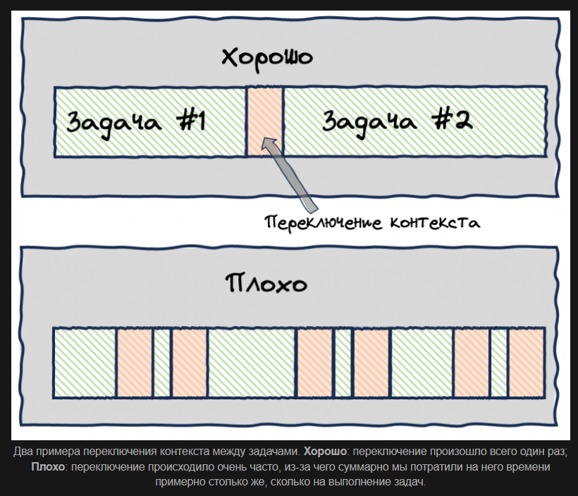

Ключевой принцип: **«Меньше значит больше»**. Чем меньше тредов одновременно готовы к выполнению, тем ниже затраты на планирование и переключение контекста, и тем больше процессорного времени достаётся каждому треду. Меньшее количество тредов также экономит память.

Задача разработчика — найти баланс между числом ядер и количеством тредов. Основной инструмент — **пулы тредов (thread pools)**. Вместо создания нового треда под каждую задачу пул поддерживает фиксированное количество заранее инициализированных рабочих тредов. Задачи ставятся в очередь, и треды разбирают их по мере освобождения. Это удерживает число одновременно активных тредов на оптимальном уровне.

> **Зачем это Go-разработчику.** Планировщик Go реализует этот принцип через ограничение `GOMAXPROCS` — числа одновременно выполняющихся горутин. Не нужно создавать горутину под каждый элемент данных; worker pool с ограниченным параллелизмом часто эффективнее.

### Кэш процессора

Доступ к данным из основной памяти имеет высокую задержку (от \~100 до \~300 **тактов** — единиц времени, за которые процессор выполняет одну элементарную операцию). Процессоры имеют локальные кэши для хранения данных близко к вычислительным ядрам. Доступ из кэша значительно дешевле: от 3 до 40 тактов в зависимости от уровня.

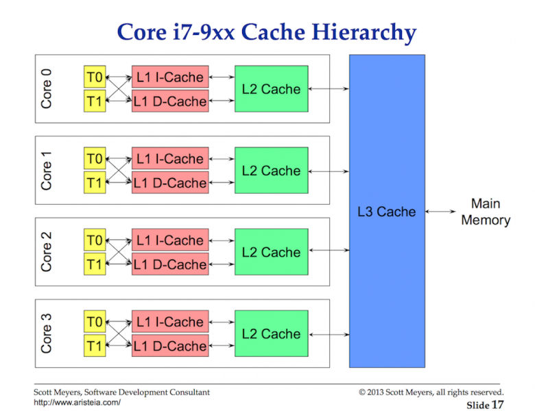

Обмен данными между процессором и памятью происходит **кэш-линиями** — 64-байтовыми блоками. Кэш-линия — минимальный блок, которым оперирует кэш. Память и кэш-линии образуют иерархию:

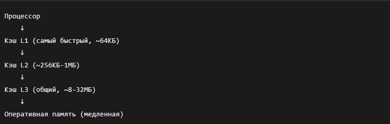

Каждый уровень кэша работает с кэш-линиями, а не с отдельными байтами. Принадлежность адреса к кэш-линии определяется так: **младшие 6 бит** (2⁶ = 64) — позиция внутри линии, **старшие биты** — номер линии.


**Протокол MESI.** Кэш-линии находятся в одном из четырёх состояний:

| Состояние         | Описание                                      |
| ----------------- | --------------------------------------------- |
| **M (Modified)**  | Линия изменена только в этом кэше («грязная») |
| **E (Exclusive)** | Линия есть только в этом кэше, не изменена    |
| **S (Shared)**    | Линия присутствует в нескольких кэшах         |
| **I (Invalid)**   | Линия устарела, данные недействительны        |

Каждое ядро получает собственную копию нужной кэш-линии. Мутации в памяти в многопоточных приложениях могут создавать проблемы производительности из-за необходимости синхронизации кэшей.

**Ложное совместное использование (False Sharing)** — проблема, когда два или более потока обращаются к разным переменным, попавшим в одну кэш-линию. Изменение переменной одним потоком инвалидирует всю кэш-линию для других, вызывая принудительную синхронизацию и замедление. На 2-ядерном процессоре это малозаметно; на многоядерном — приводит к катастрофической деградации.

**Когерентность кэша** — свойство, обеспечивающее согласованность данных между кэшами разных ядер. Когда одно ядро изменяет значение, протокол MESI гарантирует, что другие ядра увидят обновлённое значение или признают свои копии недействительными. Без этого разные потоки могли бы видеть разные версии одной переменной одновременно.

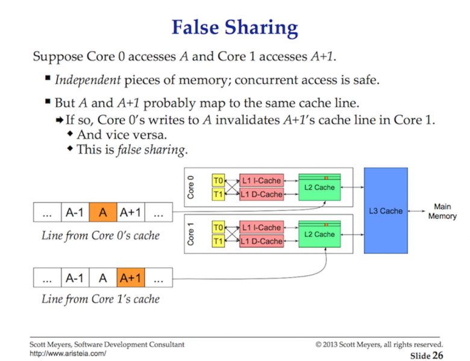

> **Зачем это Go-разработчику.** False Sharing может возникать в Go-программах при использовании срезов структур, где горутины пишут в соседние элементы. Выравнивание полей через `_ [64]byte` padding и минимизация разделяемого состояния — прямые следствия понимания кэш-линий. Пакет `sync.Pool` и локальные кэши (`mcache`) в рантайме Go спроектированы с учётом когерентности кэша.

***

## 2. Модель GMP: горутины, машины, процессоры

### Зачем нужны горутины

Треды ОС обладают серьёзными ограничениями:

* Фиксированный стек (\~1–8 МБ), потребляющий много памяти.
* Дорогое переключение контекста (\~1000–1500 нс) через ядро.
* Создание и уничтожение треда — затратная операция.

**Горутины** решают эти проблемы: они легковесны по памяти, а переключение между ними происходит в **пользовательском пространстве** (userspace) — то есть внутри самого процесса, без обращения к ядру ОС. Все горутины живут внутри одного процесса и имеют общий доступ к памяти.

```go
func main() {
    go task1() // запускаем функцию и идем дальше, не дожидаясь её завершения
    go task1() // запускаем следующую и также идём дальше

    // делаем какую-то работу
}

```

Горутина может находиться в трёх базовых состояниях, зеркалирующих состояния треда ОС (полный набор из пяти состояний с конечным автоматом описан в разделе «Состояния G, M, P» далее):

* **Waiting** — горутина не готова, ждёт чего-либо.
* **Runnable** — готова к запуску, ждёт освобождения треда.
* **Running** — выполняется на треде.

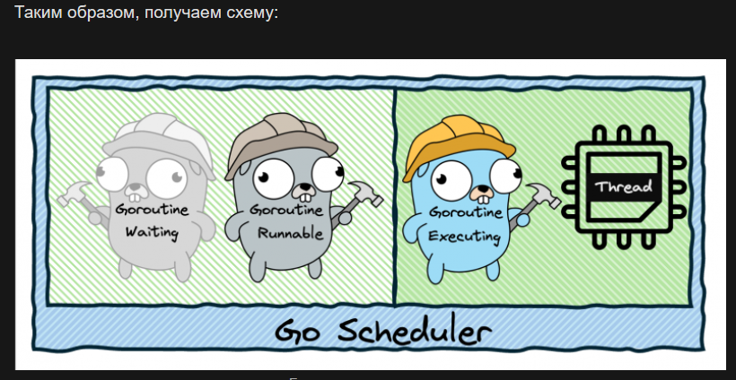

> **Зачем это Go-разработчику.** Понимание состояний горутины — ключ к чтению трассировок и профилей. Горутина в состоянии Waiting не потребляет процессорное время; проблема возникает, когда горутина навсегда остаётся в Waiting (утечка).

### G, M и P — три сущности планировщика

Планировщик Go оперирует тремя сущностями:

* **G (горутина)** — легковесный поток пользовательского пространства. Содержит стек, указатель команд, состояние и идентификатор.
* **M (машина, machine)** — поток ОС, на котором выполняется код Go. Именно M выполняет инструкции горутин.
* **P (процессор)** — логический процессор, владеет локальной очередью горутин (LRQ) и локальным кэшем памяти (mcache). По сути, P — это контекст выполнения, связывающий горутины с тредами.

Модель называется **GMP** по первым буквам сущностей.

### Как программа запускается

Когда программа Go стартует, ей выделяется **логический процессор P** для каждого виртуального ядра хост-машины. При наличии **Hyper-Threading** (технология Intel, при которой одно физическое ядро выглядит для ОС как два логических) каждый аппаратный тред представляется как виртуальное ядро.

Каждому P назначается **тред ОС (M)**. Этот тред управляется ОС, и ОС отвечает за его размещение на физическом ядре.

Программа получает начальную **горутину (G)** — точку входа `main`. Горутины подобны тредам уровня приложения: они включаются и выключаются планировщиком Go, а не ядром ОС.

### GRQ и LRQ — очереди выполнения

В планировщике Go две очереди выполнения:

* **Глобальная очередь выполнения (GRQ)** — для горутин, не назначенных конкретному P. Используется для балансировки нагрузки.
* **Локальная очередь выполнения (LRQ)** — у каждого P своя. Содержит горутины, назначенные данному P. Размер ограничен 256 горутинами.

Горутины из LRQ включаются и выключаются на M, связанном с данным P. Когда локальная очередь переполняется, половина горутин перемещается в GRQ.

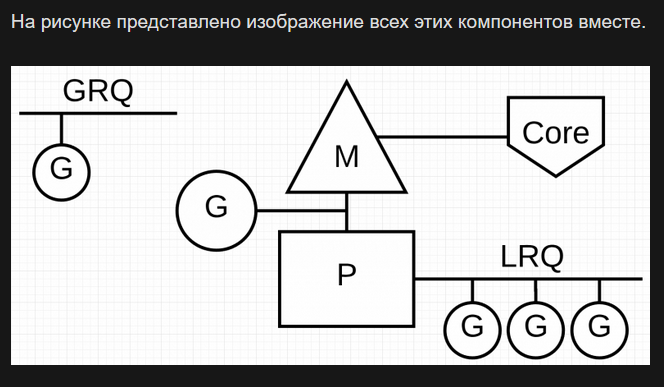

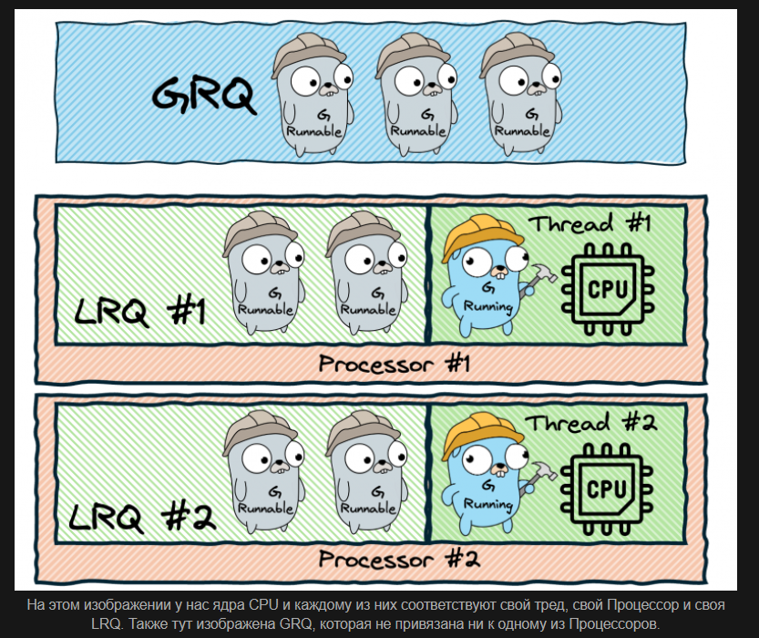

> **Зачем это Go-разработчику.** Понимание двухуровневой очереди объясняет, почему горутины, созданные на одном P, выполняются быстрее (локальность данных) и почему профилировщик может показывать неравномерную загрузку процессоров (нужен work stealing).

### Модель многопоточности M:N

Существует три модели отображения пользовательских тредов на треды ядра:

* **N:1 («многие к одному»)** — все пользовательские треды мультиплексируются на один тред ядра. Плюс: дёшево. Минус: нельзя использовать многоядерность; один блокирующий вызов останавливает всех.
* **1:1 («один к одному»)** — каждому пользовательскому треду соответствует тред ядра. Плюс: полная параллельность. Минус: дорого по памяти и переключению.
* **M:N («многие ко многим»)** — N пользовательских тредов мультиплексируются на M тредов ядра. Компромисс: параллелизм с ограниченными затратами.

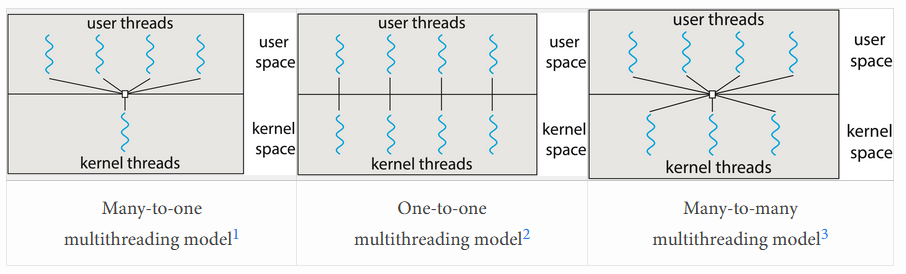

Go использует модель **M:N** (точнее, M:P:N — с учётом процессоров P): N горутин выполняются на M тредах ОС под управлением P процессоров. Это позволяет эффективно использовать многоядерные системы и обрабатывать системные вызовы без блокировки всех горутин.

Количество P задаёт максимальный параллелизм: не более `GOMAXPROCS` горутин могут выполняться одновременно.

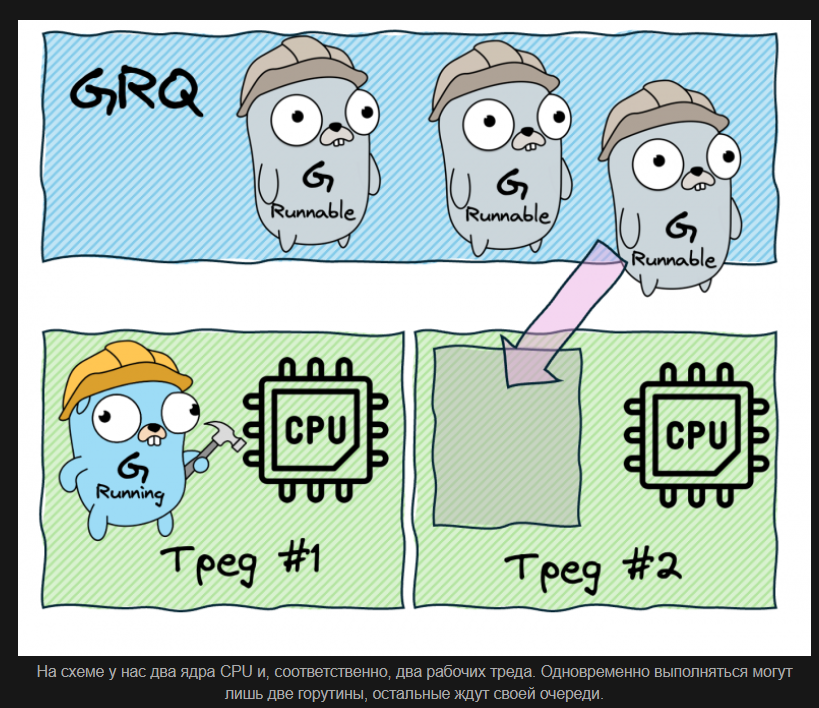

### GOMAXPROCS

Функция **`runtime.GOMAXPROCS()`** задаёт максимальное количество процессоров P. По умолчанию — `runtime.NumCPU()`, то есть столько же, сколько виртуальных ядер доступно. Если нужно ограничить параллелизм, значение можно изменить:

```go
import "runtime"

func init() {
    runtime.GOMAXPROCS(2)
}

```

`GOMAXPROCS` определяет, сколько горутин могут выполняться одновременно. Увеличение сверх числа ядер не даёт прироста для CPU-Bound нагрузки, но может помочь для IO-Bound (позволяет большему числу горутин находиться в состоянии системного вызова одновременно).

> **Зачем это Go-разработчику.** `GOMAXPROCS` — первая ручка, за которую стоит взяться при проблемах с производительностью в контейнерах (где `NumCPU()` может вернуть число ядер хоста, а не контейнера) и в IO-нагруженных приложениях.

***

## 3. Жизненный цикл сущностей и поиск работы

### Эволюция модели: от 1:1 к GMP

Простейшая модель планировщика — **1:1**: создаём отдельный тред под каждую горутину, после завершения — уничтожаем. Создание и уничтожение тредов дорого, поэтому появился **пул тредов**: треды не уничтожаются, а переиспользуются.

Алгоритм с пулом тредов:

1. Проверяем, есть ли в пуле свободный тред. Если есть — берём его.


1. Если нет — проверяем текущее количество тредов. Если меньше лимита — создаём новый тред. После завершения горутины тред возвращается в пул.

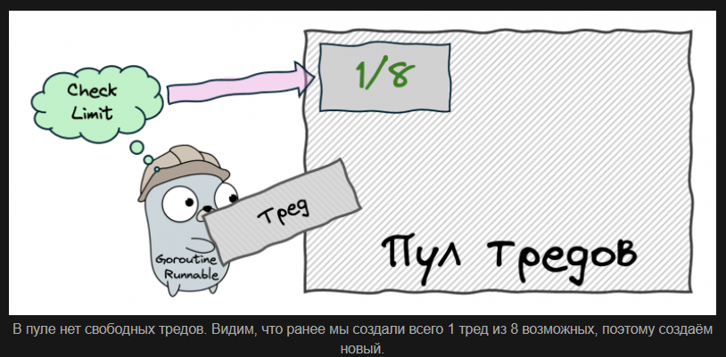

1. Если лимит достигнут — горутина ждёт в очереди освобождения треда.


Так появилась **Global Run Queue (GRQ)** — очередь ожидающих горутин (FIFO). Лимит тредов — по числу ядер. К каждому треду приставлен свой **процессор P**. Это и есть базовая модель M:N.

> **Зачем это Go-разработчику.** Эволюция от наивного подхода к GMP показывает, почему рантайм Go устроен именно так. Каждое проектное решение — ответ на конкретную проблему производительности.

### Mutex для GRQ и проблема конкуренции

Когда несколько параллельных процессов имеют доступ к общему ресурсу, нужен механизм синхронизации. Без него два процессора могут попытаться забрать одну и ту же горутину — это **состояние гонки (race condition)**.

Для защиты GRQ используется **мьютекс (mutex, lock)**. Каждый процессор блокирует очередь на время работы с ней. Пока очередь заблокирована, никто другой не может с ней взаимодействовать.

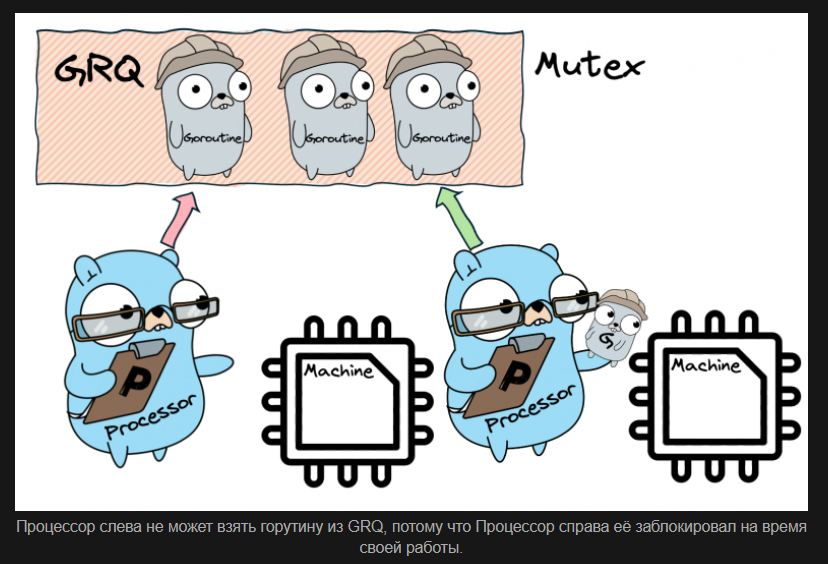

Мьютекс решил проблему гонки, но создал другую: работа с общим ресурсом (GRQ) стала узким местом. При большом количестве процессоров конкуренция за блокировку снижает производительность — это называется **lock contention**.

### LRQ как решение

Каждому процессору P добавляется **локальная очередь (Local Run Queue, LRQ)**. Поскольку к LRQ имеет доступ только один P, блокировка не нужна.

GRQ сохраняется для горутин, не привязанных к конкретному P, и служит буфером для балансировки. Горутины из GRQ со временем попадают в LRQ и только потом выполняются.

Горутины в состоянии Waiting не находятся ни в GRQ, ни в LRQ. Например, если горутина заблокирована на чтении или записи в канал, она попадает в **Wait Queue** этого конкретного канала, и уже оттуда, после разблокировки, возвращается в GRQ или LRQ. Аналогично, горутина, ожидающая сетевого ввода-вывода, паркуется через netpoller и не занимает места в очередях выполнения.

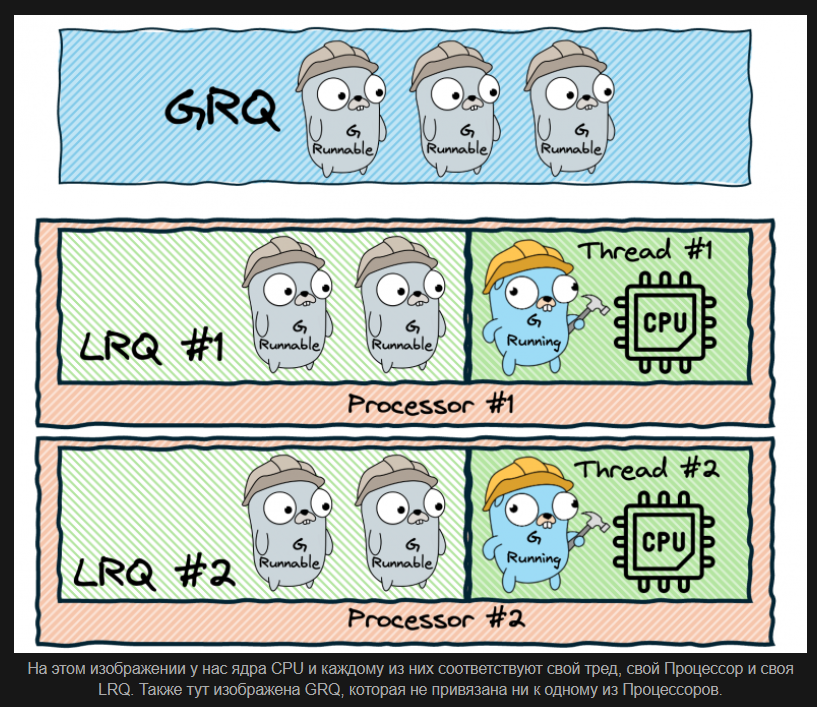

> **Зачем это Go-разработчику.** LRQ — пример компромисса между локальностью и справедливостью. Локальные очереди ускоряют выполнение ценой возможности неравномерной загрузки процессоров.

#### Как каналы взаимодействуют с планировщиком

Операции с каналами в Go делятся на два типа по взаимодействию с планировщиком:

* **Небарьерные (non-barriered):** отправка в буферизованный канал, где ещё есть место, и чтение из буферизованного канала, где уже есть данные. Такие операции выполняются мгновенно, без обращения к планировщику — горутина не блокируется и не передаёт управление.
* **Барьерные (barriered):** отправка в заполненный канал или чтение из пустого. Горутина блокируется, переводится в Waiting, помещается в Wait Queue канала, а планировщик запускает следующую готовую горутину.

#### Поведение select с несколькими готовыми каналами

Когда `select` имеет несколько case-блоков, готовых к выполнению одновременно, планировщик **выбирает один из них псевдослучайно** — через перемешивание порядка case-блоков на этапе компиляции. Это сделано намеренно, чтобы разработчик не полагался на фиксированный порядок проверки case-блоков (например, чтение из одного канала всегда раньше другого). Если нужен приоритет — используйте вложенные `select` или дополнительную логику.

### Порядок проверки очередей

Алгоритм выбора следующей горутины (упрощённый вид; полный 9-шаговый алгоритм `findRunnable` описан в разделе «Полный алгоритм findRunnable» далее):

1. **1 раз из 61**: проверяем GRQ, если есть горутины — берём оттуда.
2. Если нет — проверяем LRQ текущего P.
3. Если LRQ пуста — проверяем GRQ.
4. Если и GRQ пуста — проверяем network poller.
5. Если netpoll ничего не дал — пытаемся украсть у другого P.

При заборе горутин из GRQ процессор берёт не одну, а пакет размером **`len(GRQ) / GOMAXPROCS + 1`**. Это гарантирует равномерное распределение и не позволяет одному P забрать всё.

Проверка GRQ с вероятностью 1/61 решает проблему «застоя»: если LRQ постоянно пополняются, процессоры могут никогда не добраться до GRQ. Значение 1/61 достаточно мало, чтобы не создавать лишней конкуренции за мьютекс, и достаточно велико, чтобы горутины в GRQ не голодали.

### Work stealing

Ситуация: один процессор перегружен, другой простаивает.

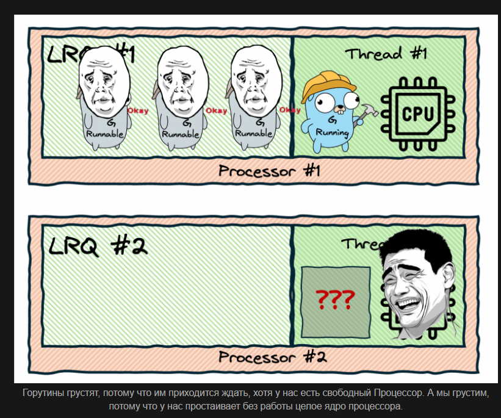

Механизм **work stealing (кража работы)**: если LRQ одного P пуста, он заглядывает в LRQ другого P и забирает **половину** горутин.

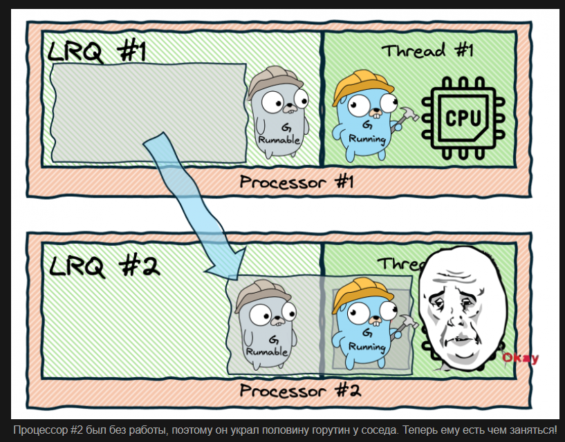

Work stealing обеспечивает автоматическую балансировку нагрузки между всеми процессорами без централизованного координатора.

Процесс кражи реализован с детализацией: до четырёх попыток. Первые три — захват половины горутин из `runq` целевого P. Четвёртая попытка — приоритетный захват из `runnext`.

> **Примечание автора:** Каждый LRQ состоит из двух частей: приоритетный слот `runnext` и кольцевой буфер `runq`.

> **Зачем это Go-разработчику.** Work stealing означает, что не нужно вручную балансировать нагрузку между горутинами. Однако создание множества мелких горутин повышает накладные расходы на кражу.

### Spinning тредов

Когда тред M завершает горутину и не находит работу в LRQ, он может перейти в состояние **spinning (spin-цикл)**. Spinning-тред активно ищет работу: проверяет GRQ, пытается украсть у других P, проверяет network poller.

Spinning уменьшает задержку запуска новых горутин — тред уже активен и готов подхватить работу. Число spinning-тредов ограничено (не более половины занятых процессоров), чтобы избежать бесполезного потребления процессорного времени. Если работа не находится, тред **паркуется (parked)**.

### Idle P и парковка

Если у процессора P нет задач, он переходит в состояние **idle** и помещается в список свободных. Связанный тред M может быть припаркован через системный вызов **`futex`** (Fast Userspace muTEX — механизм ядра Linux для эффективного ожидания и пробуждения потоков).

Когда появляется новая горутина:

1. Рантайм ищет свободный P.
2. Пробуждает соответствующий M.
3. Назначает горутину на выполнение.

> **Зачем это Go-разработчику.** Парковка и пробуждение тред объясняют, почему создание горутин в цикле эффективно: потоки не создаются и не уничтожаются на каждую горутину, а переиспользуются через пул.

### Состояния G, M, P

Каждая сущность планировщика является конечным автоматом.

#### Состояния горутины (G)

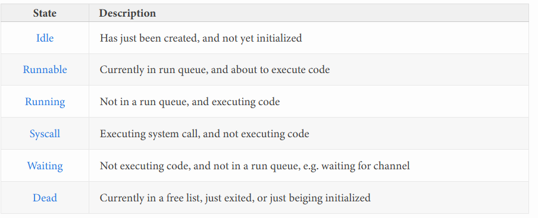

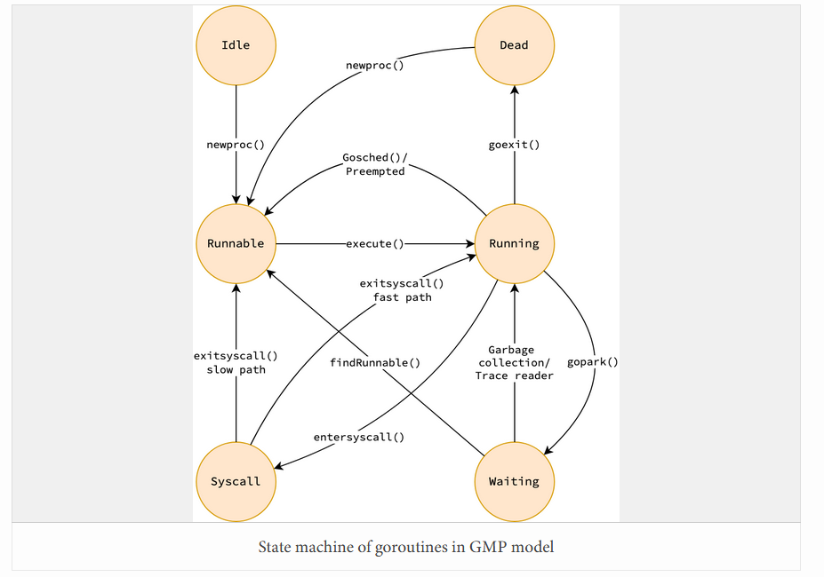

Основные состояния G:

* **Idle** — только что создана или возвращена в пул свободных.
* **Runnable** — готова к выполнению, находится в очереди.
* **Running** — выполняется на M.
* **Waiting** — заблокирована (канал, сеть, syscall, GC).
* **Dead** — завершила работу.

Когда горутина завершается, она не уничтожается, а становится **мёртвой (dead)** и помещается в список свободных текущего P. При переполнении — в глобальный список. Новая горутина сначала пытается переиспользовать свободную, а не выделять с нуля.

#### Состояния потока (M)

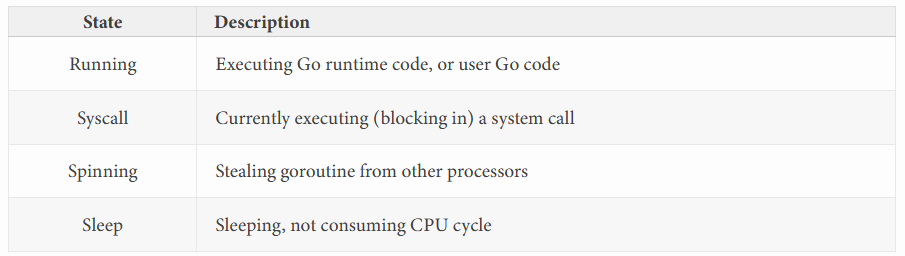

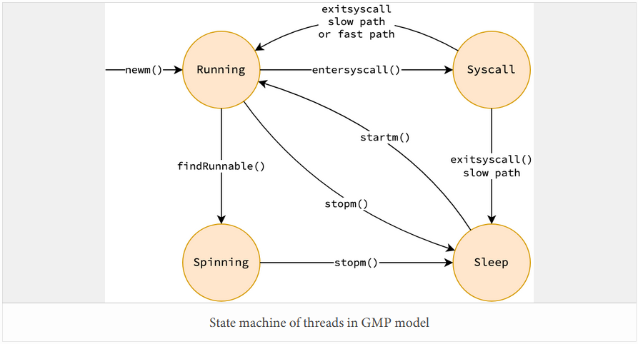

Основные состояния M:

* **Running** — выполняет код Go.
* **Spinning** — активно ищет работу (подсостояние idle).
* **Idle** — припаркован, ждёт пробуждения.
* **Syscall** — заблокирован в системном вызове.

M никогда не уничтожается — уходит в спящий режим и позже просыпается. M хранит ссылки на текущую G, связанный P, и содержит специальную горутину **g0** для выполнения в системном стеке.

**Зачем нужна g0.** Обычные горутины используют динамические стеки, которые могут расти и сжиматься. Но сами операции изменения стека должны выполняться в надёжном, гарантированно доступном месте — системном стеке, который выделяет ядро ОС для потока. Когда потоку M нужно выполнить планирование, увеличить или уменьшить стек горутины, запустить сборку мусора или остановить горутину, он переключается со стека текущей горутины на системный стек и выполняет эти операции в контексте g0.

#### Состояния процессора (P)

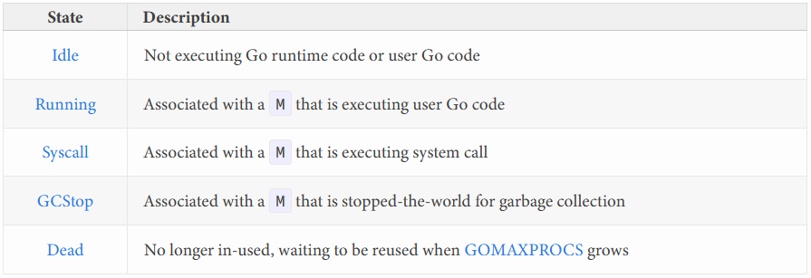

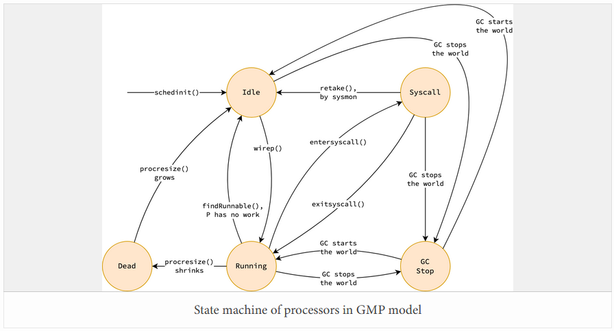

Основные состояния P:

* **Idle** — свободен, не выполняет горутины.
* **Running** — выполняет пользовательский код.
* **Syscall** — связанная с ним горутина ушла в системный вызов.
* **gcStop** — остановлен для сборки мусора (stop the world).

Количество P жёстко задано `GOMAXPROCS`. При уменьшении `GOMAXPROCS` лишние P переходят в idle, но не уничтожаются — при повторном увеличении они активируются снова.

#### Локальный кэш памяти и таймеры P

Каждый процессор P владеет не только очередью горутин, но и собственным **локальным кэшем памяти —&#x20;****`mcache`**, работающим в рамках модели Thread-Caching Malloc. Этот кэш используется для быстрого выделения микро- и небольших объектов без обращения к глобальной куче. P также содержит **`pageCache`** — ещё один уровень кэширования, позволяющий распределителю памяти получать целые страницы без захвата блокировки кучи. Это критично для производительности при высокой параллельности: чем меньше конкуренции за глобальные структуры, тем быстрее выполняются горутины.

> Примечание автора: Модель Thread-Caching Malloc (tcmalloc) — это схема распределения памяти, при которой каждый поток или виртуальный процессор владеет собственным локальным кэшем для быстрого выделения небольших объектов без синхронизации с глобальной кучей; когда локальный запас исчерпывается, он пополняется из централизованных списков свободных блоков или напрямую страницами памяти с гораздо меньшей частотой, что радикально снижает конкуренцию за общие структуры в многопоточной среде.

Для корректной работы с задержками, таймаутами и интервалами каждый P управляет собственной коллекцией **таймеров**, организованных в структуру **min-heap** (пирамида, или куча). Ближайший по времени срабатывания таймер всегда находится на вершине. Когда P ищет готовую к выполнению горутину, он проверяет, не истекли ли какие-либо таймеры: если да — соответствующие горутины извлекаются и добавляются в локальную очередь.

#### Итоговый порядок поиска работы

Итоговый порядок поиска горутины для выполнения (упрощённый; полный 9-шаговый алгоритм см. в разделе «Полный алгоритм findRunnable»):

1. 1/61 раз — проверка GRQ.
2. Проверка LRQ (runnext, затем runq).
3. Повторная проверка GRQ.
4. Проверка network poller.
5. Work stealing у другого P.

Если работа так и не найдена, M засыпает до появления новых задач или истечения ближайшего таймера.

***

## 4. Механизмы переключения контекста

### События-триггеры

Планировщик Go требует чётко определённых событий в безопасных точках кода для переключения контекста. Эти события возникают в четырёх ситуациях:

* **Использование ключевого слова&#x20;****`go`****:** создание новой горутины даёт планировщику возможность принять решение.
* **Сборщик мусора (GC):** GC работает с собственным набором горутин и создаёт множество событий планирования.
* **Системные вызовы:** если горутина делает блокирующий syscall, планировщик может переключить контекст на другую горутину на том же M.
* **Синхронизация:** вызов атомарной операции, мьютекса или канала, вызвавший блокировку, даёт возможность переключения.

Вызовы функций критичны для планировщика. Если программа выполняет узкие циклы без вызовов функций, планировщик и GC испытывают задержки.

> **Зачем это Go-разработчику.** Пустые циклы `for {}` без вызовов функций — антипаттерн, который до Go 1.14 мог полностью заблокировать планировщик.

###

### Кооперативная многозадачность

Когда горутин больше, чем процессоров, выполняется только `GOMAXPROCS` из них, остальные ждут.


Чтобы дать шанс другим, горутина периодически проверяет, не пора ли уступить управление. Безопасные точки для проверки:

* **Перед вызовом функций (пролог):** при вызове функции создаётся фрейм стека, вся нужная информация сохранена — горутину можно приостановить без потери данных.
* **При блокирующих операциях:** syscall, таймеры, сетевое ожидание — горутина всё равно простаивает.

У каждой горутины есть флаг **`stackguard`**. Когда горутину нужно прервать, флагу присваивается значение **`stackPreempt`**. При следующей проверке горутина видит это и передаёт управление планировщику.

Установкой флага занимается **Sysmon** — фоновый монитор. Он проверяет время выполнения активных горутин и, если какая-то работает **более 10 мс**, выставляет `stackguard = stackPreempt`.

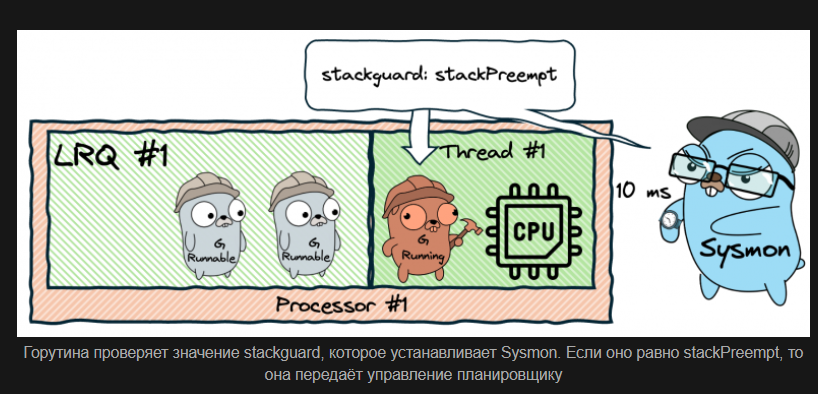

Такой подход называется **кооперативной многозадачностью (cooperative multitasking)** — горутины сами решают, когда уступить управление, но решение *когда* инициируется извне.

### Принудительное вытеснение (Go 1.14+)

Кооперативная модель не справляется с горутинами, которые не вызывают функции и не делают блокирующих операций. Пример: CPU-Bound горутина в бесконечном цикле с одним процессором.

```go
package main

import (
    "runtime"
    "time"
)

func main() {
    // Устанавливаем количество процессоров = 1
    runtime.GOMAXPROCS(1)

    // Запускаем "жадную" горутину, которая захватит процессор
    go func() {
        sum := 0
        for {
            sum++ // бесконечный цикл без вызовов функций
        }
    }()

    // Запускаем time.Sleep, чтобы передать управление жадной горутине
    // и не выйти раньше времени из main()
    time.Sleep(time.Second)
}

```

Она не проверяет `stackguard` (нет вызовов функций), не блокируется, и Sysmon бессилен её прервать через кооперативный механизм.

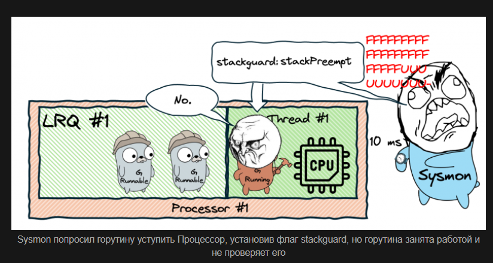

Для таких случаев Go 1.14 ввёл **асинхронное (некооперативное) вытеснение** на основе сигналов ОС:

1. **Обнаружение.** Sysmon отслеживает время выполнения. Если горутина непрерывно работает более 10 мс — инициируется вытеснение.
2. **Сигнал.** Sysmon посылает сигнал **SIGURG** потоку M через системный вызов **`tgkill`** (Linux-вызов для отправки сигнала конкретному потоку, а не процессу целиком). SIGURG выбран потому, что не используется стандартной библиотекой и не мешает отладчику.
3. **Обработка.** Ядро ОС принудительно прерывает выполнение пользовательского кода и передаёт управление обработчику сигнала, зарегистрированному при инициализации треда.

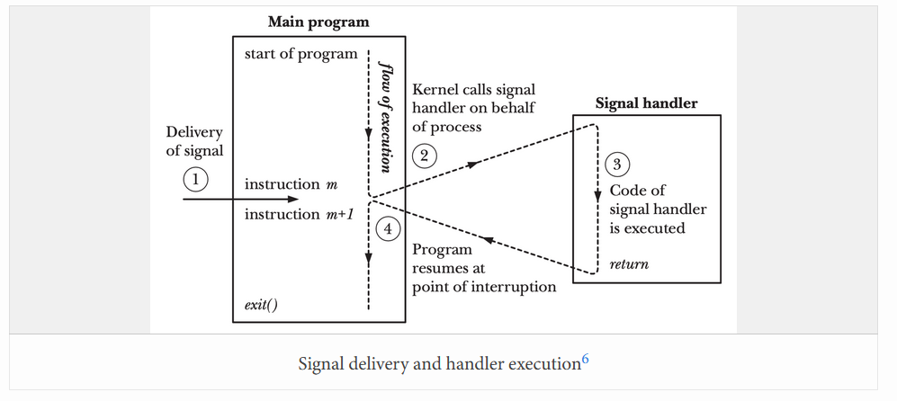

1. **Перепланировка.** В обработчике сохраняется контекст горутины, управление передаётся функции асинхронного вытеснения. Текущая горутина помещается в глобальную очередь, поток переходит к другой работе.

**Важно:** между решением sysmon и фактическим прерыванием есть задержка. Горутина может выполняться дольше 10 мс. Вытеснение называется асинхронным именно потому, что не происходит мгновенно, а инициируется и выполняется при первой возможности доставки сигнала.

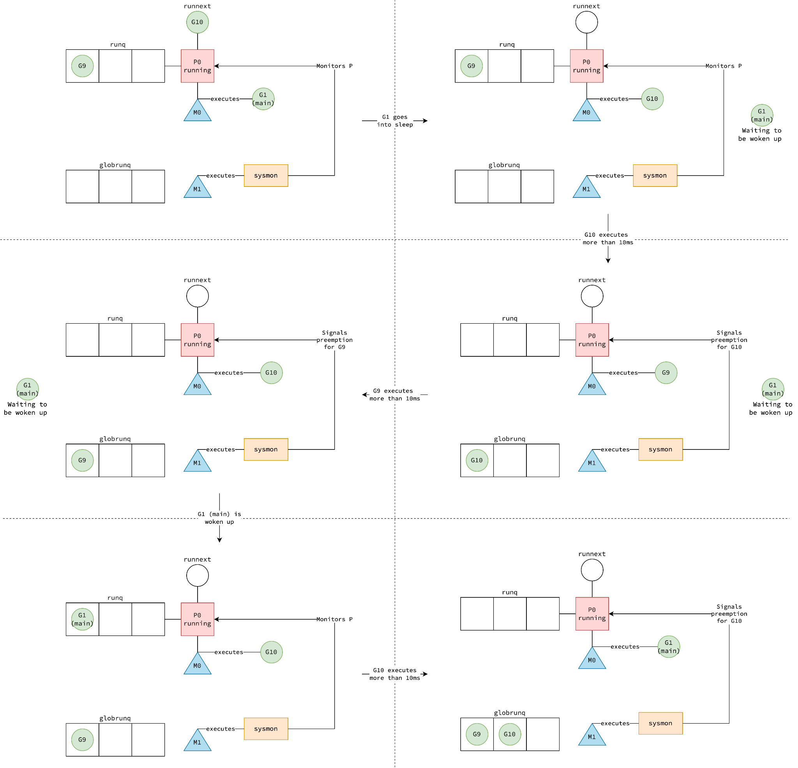

Но сигнальный механизм работает не всегда: в критических секциях (сборка мусора, выполнение системных вызовов) прерывать горутину опасно. В таких случаях остаётся только кооперативный механизм.

### Сравнение с планировщиком ОС

* **Планировщик ОС** — вытесняющий. Решения о переключении принимаются ядром недетерминированно.
* **Планировщик Go** — кооперативно-вытесняющий (с 1.14). Основной механизм — кооперативный (горутина сама уступает), запасной — сигнальный (принудительное вытеснение).

Для разработчика поведение планировщика Go неотличимо от вытесняющего: невозможно предсказать, когда произойдёт переключение. Это правильная ментальная модель.

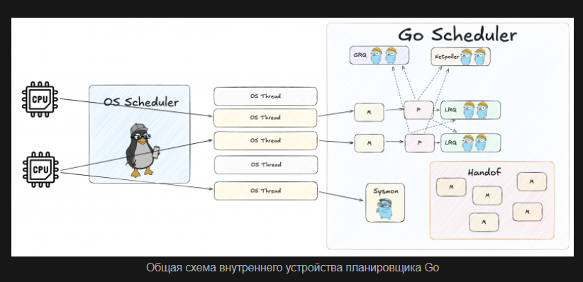

> **Зачем это Go-разработчику.** С версии 1.14 не нужно вставлять вызовы `runtime.Gosched()` в вычислительные циклы — планировщик вытеснит горутину принудительно. Однако в версиях до 1.14 такое поведение не гарантируется.

***

## 5. Системные вызовы и сетевой ввод-вывод

### Проблема блокирующего syscall

Если горутина выполняет блокирующий системный вызов (например, чтение файла), она блокирует не только себя, но и весь тред M, а вместе с ним — привязанный процессор P. В результате ядро процессора простаивает, хотя в очереди есть готовые горутины.

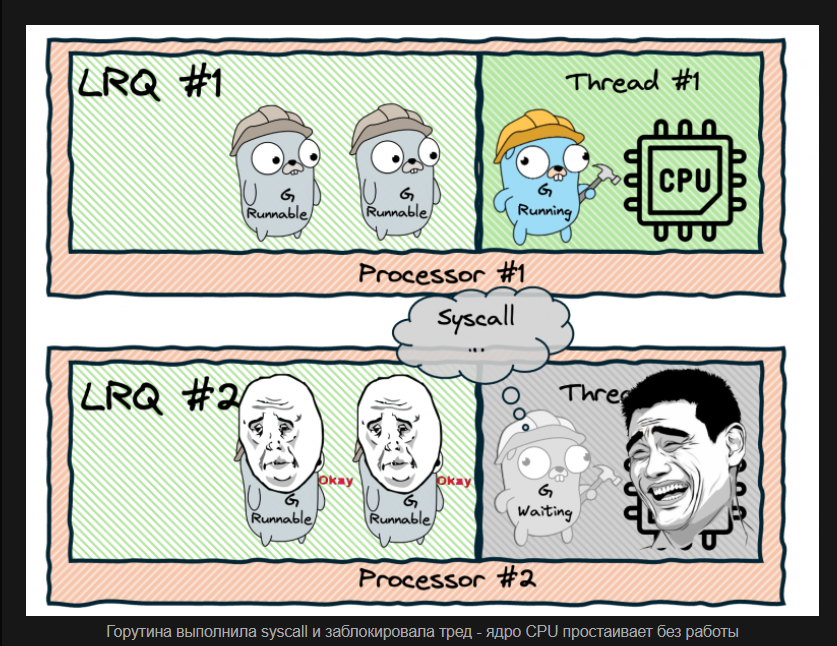

### Классификация системных вызовов: Syscall и RawSyscall

В рантайме Go существуют две обёртки для системных вызовов: **`Syscall`** и **`RawSyscall`**.

* **`Syscall`** — используется для операций с непредсказуемой продолжительностью (чтение файла, запись HTTP-ответа). Внутри делегирует фактический вызов `RawSyscall`, но оборачивает его логикой планирования: вызывает `runtime.entersyscall` до и `runtime.exitsyscall` после.
* **`RawSyscall`** — для быстрых и предсказуемых операций (получение PID, текущего времени). Планирование не задействовано, связь G-M-P остаётся неизменной.

### entersyscall: подготовка к блокировке

Перед выполнением системного вызова среда выполнения фиксирует, что горутина больше не использует процессор. Метод **`runtime.reentersyscall`** (вызывается из `runtime.entersyscall`) выполняет четыре шага:

1. Горутина G переходит из состояния **Running** в состояние **Syscall**.
2. Указатель стека, счётчик команд и указатель кадра G сохраняются для последующего восстановления.
3. Связь между потоком M и процессором P временно разрывается.
4. Процессор P переходит в состояние **Syscall**.

### Handoff: отвязывание P и создание нового M

Механизм **handoff** решает эту проблему: когда тред M блокируется в системном вызове, он отвязывается от процессора P. Для P создаётся (или пробуждается) новый тред M1, который продолжает выполнять другие горутины.

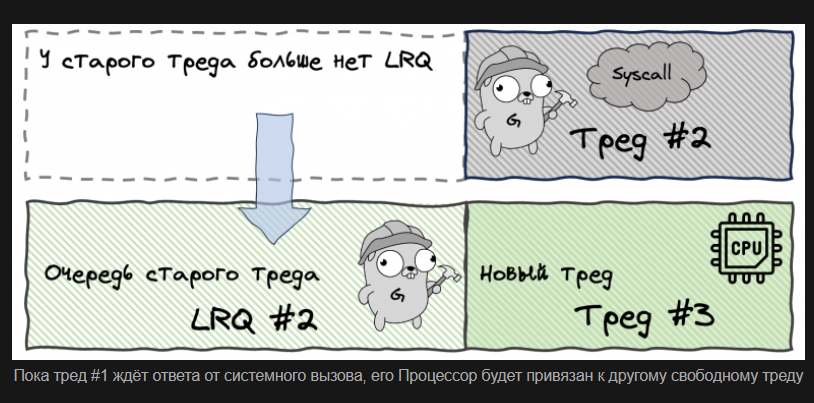

Handoff — дорогой механизм: он приводит к созданию новых тредов ОС. При большом количестве блокирующих syscall'ов количество тредов неограниченно растёт.

**Важное ограничение.** Пока процессор P находится в состоянии Syscall, он не может быть занят другим потоком M до тех пор, пока либо sysmon не захватит его принудительно, либо системный вызов не завершится. Следовательно, при одновременном выполнении нескольких длительных системных вызовов программа не будет продвигаться (за исключением самих выполняемых syscall'ов).

### Sysmon: фоновый мониторинг

Не все системные вызовы длительные. Чтобы не делать handoff для каждого короткого syscall, вводится оптимизация:

* Если системный вызов заведомо долгий — handoff выполняется немедленно.
* В остальных случаях тред остаётся заблокированным, а **Sysmon** периодически проверяет, не освободился ли он.
* Если тред заблокирован **более 10 мс** — Sysmon запускает handoff.

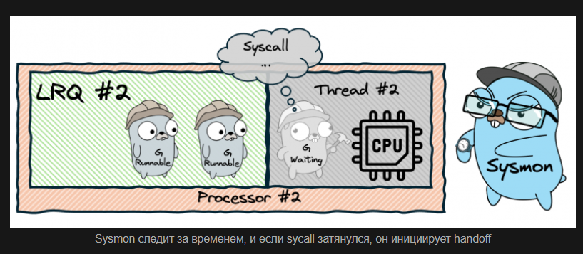

Sysmon выполняется на собственном отдельном треде, независимо от рабочих тредов.

Когда заблокированная горутина наконец возвращается из системного вызова, рантайм пытается вернуть её тому же процессору P (если он свободен). Если P занят — ищет другой свободный P. Если свободных нет — горутина отправляется в GRQ.

> **Зачем это Go-разработчику.** Большое количество блокирующих syscall'ов (файловый I/O, CGo-вызовы) неизбежно ведёт к росту числа тредов ОС. Именно поэтому сетевые операции в Go делают неблокирующими — через network poller.

### CGo и планировщик

**CGo** — механизм вызова C-кода из Go. С точки зрения планировщика, вызов C-функции эквивалентен блокирующему системному вызову: горутина и её поток M блокируются на всё время выполнения C-кода. Это имеет два важных следствия:

* **Рост числа потоков:** при активном использовании CGo количество тредов ОС может значительно превышать `GOMAXPROCS`, так как планировщик вынужден создавать новые M через handoff.
* **Блокировка без вытеснения:** в отличие от Go-кода, выполняющийся C-код не может быть вытеснен сигналом SIGURG — горутина останется заблокированной до полного завершения C-функции.

Для снижения накладных расходов в CGo-интенсивных приложениях рекомендуется: вызывать C-функции асинхронно через отдельные горутины, минимизировать частоту переключений между Go и C, и при необходимости использовать `LockOSThread` для сохранения локального для потока (thread-local) состояния C-библиотек между вызовами функций.

### Быстрый и медленный путь exitsyscall

После завершения системного вызова функция `runtime.exitsyscall` реализует два пути:

**Быстрый путь (P не захвачен sysmon):**

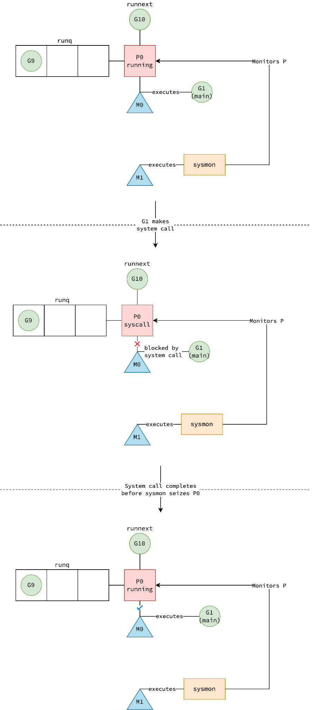

**Быстрый путь (P захвачен sysmon):**

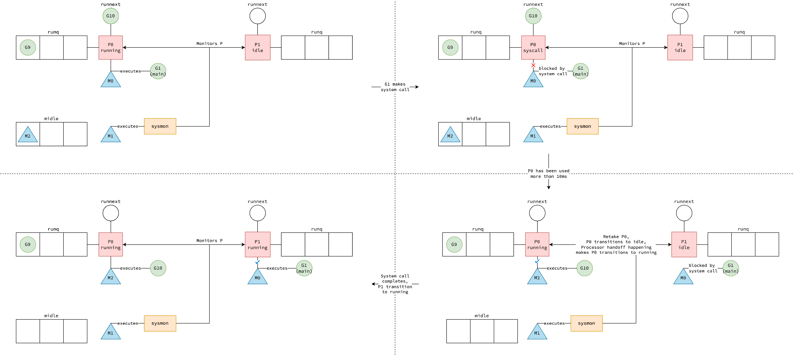

Быстрый путь выполняется, если доступен процессор P — либо исходный (если не захвачен sysmon), либо любой свободный. Выбор — по принципу «первый найденный».

**Медленный путь** — когда быстрый невозможен. Планировщик ищет любой свободный P. Если находит — горутина планируется на нём. Если нет — горутина помещается в GRQ, а связанный с ней M останавливается вызовом `stopm`.

### Network poller

**Network Poller (netpoller)** — компонент рантайма Go для асинхронного ввода-вывода. Он позволяет горутинам выполнять сетевые операции, не блокируя потоки ОС.

Netpoller использует платформозависимые механизмы:

* Linux — **epoll**
* macOS/BSD — **kqueue**
* Windows — **IOCP** (I/O Completion Ports)

В Unix-системах Go применяет **модель опроса на основе готовности (readiness-based)**: пулер сообщает, когда файловый дескриптор готов, а саму операцию выполняет горутина. Windows использует **модель завершения (completion-based)**: уведомление приходит по факту выполнения операции.

**Файловый дескриптор (FD)** — целочисленный идентификатор для обращения к открытому файлу, сокету или другому ресурсу. В рантайме Go с каждым FD связана структура **`pollDesc`**, хранящая состояние ожидания и обеспечивающая парковку/пробуждение горутин.

**Единый экземпляр epoll.** При инициализации первого сетевого соединения или файлового дескриптора в процессе создаётся **один экземпляр epoll**, используемый на протяжении всей работы программы.

**Неблокирующий режим — фундамент netpoll.** При создании сокета или открытии файла все файловые дескрипторы переводятся в неблокирующий режим: через флаг **`SOCK_NONBLOCK`** при создании сокета или вызов **`syscall.SetNonblock`** для уже существующего FD. Это критически важно: в неблокирующем режиме системный вызов `read` или `write` не приостанавливает поток, а немедленно возвращает ошибку `EAGAIN`, если данные ещё не готовы. Без этого netpoll был бы невозможен — горутина блокировалась бы на уровне ядра, и планировщик Go не мог бы переключиться на другую работу.

### Как netpoll работает

Когда горутина вызывает `conn.Read()`:

1. Рантайм Go перехватывает вызов и пытается выполнить системный вызов `read` для файлового дескриптора сокета.
2. Если дескриптор готов — операция выполняется немедленно.
3. Если нет — горутина паркуется. Это не просто смена состояния: вызывается **`gopark`** с callback-функцией, которая через `pollDesc` привязана к конкретному файловому дескриптору. Именно эта связка `pollDesc → gopark → callback` позволяет netpoll позже определить, какую именно горутину нужно пробудить. Дескриптор регистрируется в epoll, а освободившийся M может выполнять другие горутины.
4. Netpoller вызывает `epoll_wait` и блокируется до появления событий.
5. Когда дескриптор становится готовым, ОС уведомляет netpoller. Пуллер находит `pollDesc`, определяет ожидающую горутину и помещает её обратно в очередь выполнения.

При вызове `Close` для файлового дескриптора происходит его удаление из списка отслеживаемых epoll операцией **`EPOLL_CTL_DEL`**, что предотвращает утечку ресурсов и гарантирует, что epoll продолжит эффективно работать с оставшимися дескрипторами.

Опрос готовых дескрипторов происходит не постоянно, а лишь когда планировщику нечего больше выполнять — когда пусты и локальные, и глобальная очереди. Технически это устроено так: функция **`netpoll()`** вызывается из **`findRunnable`** (шаг 6 в алгоритме), то есть в том же потоке M, который ищет работу. Отдельного потока для netpoll не существует — `epoll_wait` выполняется в контексте обычного рабочего M. Это означает, что даже если дескриптор стал готов к вводу-выводу, соответствующая горутина не просыпается мгновенно, а ждёт своей очереди в общем порядке планирования. За один вызов `epoll_wait` netpoll получает до **128 событий** готовности и для каждого пробуждает связанную горутину, помещая её в локальную очередь текущего P.

```

Горутина хочет прочитать данные из сокета:
↓
Данных нет → вызывается netpollBlocked (блокировка через сетевой поллер)
↓
Создаётся или используется pollDesc (структура описания poll-события) для этого file descriptor (fd — файлового дескриптора)
↓
Горутина «паркуется» в поле rg (run goroutine — горутина, ожидающая пробуждения) внутри pollDesc
↓
pollDesc регистрируется в механизме ожидания событий операционной системы: epoll (Linux), kqueue (BSD/macOS), IOCP (Windows)
↓
… ожидание события операционной системы …
↓
Операционная система сообщает, что file descriptor готов к чтению
↓
Netpoller (сетевой поллер Go) находит pollDesc по данным из события
↓
Читает поле rg (run goroutine — припаркованная горутина) и извлекает оттуда ожидающую горутину
↓
Помещает горутину в run queue (очередь готовых к выполнению горутин планировщика Go)
↓
Горутина просыпается и продолжает чтение

```

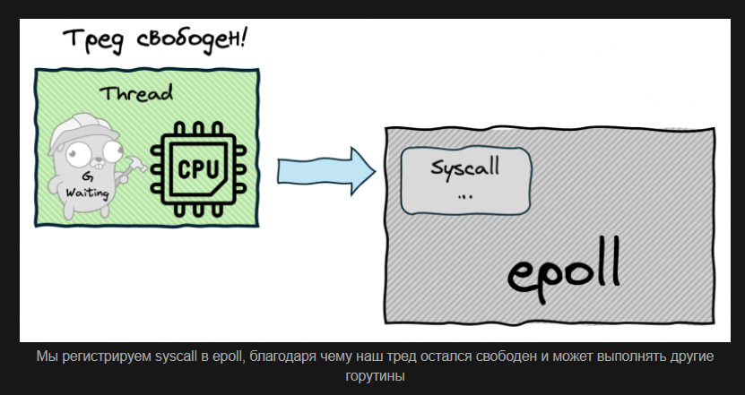

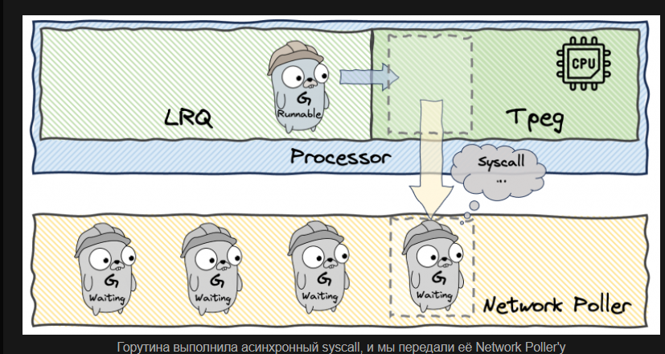

Ключевая идея: ждущие горутины не занимают тред, и могут находиться в этом состоянии сколько угодно, не замедляя работу программы.

Когда у процессоров заканчивается работа, они сами обращаются к netpoller за освободившимися горутинами. Sysmon также периодически проверяет netpoller (если к нему не обращались более 10 мс) и перемещает готовые горутины в GRQ.

> **Зачем это Go-разработчику.** Именно netpoller позволяет Go-программе держать десятки тысяч одновременных соединений при ограниченном числе потоков ОС. Это ключевое преимущество Go для сетевых сервисов.

### HTTP-сервер изнутри

Запуск HTTP-сервера в Go обманчиво прост:

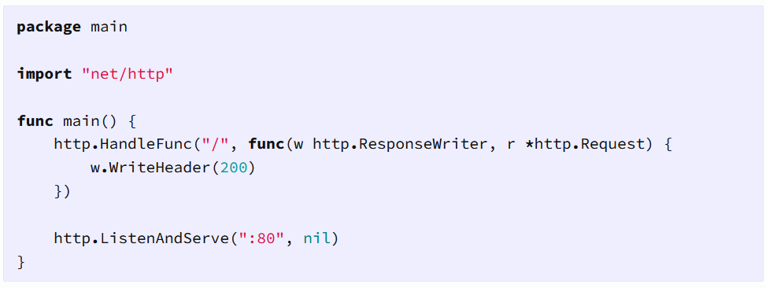

Под капотом `http.ListenAndServe()` использует системные вызовы `socket()`, `bind()`, `listen()`, `accept()` для создания TCP-сокетов — по сути, файловых дескрипторов. Функция привязывает сокет к адресу и порту, слушает входящие соединения и создаёт новый сокет для обработки каждого клиентского запроса.

`http.HandleFunc()` регистрирует функции-обработчики, абстрагируя системные вызовы `read()` и `write()`.

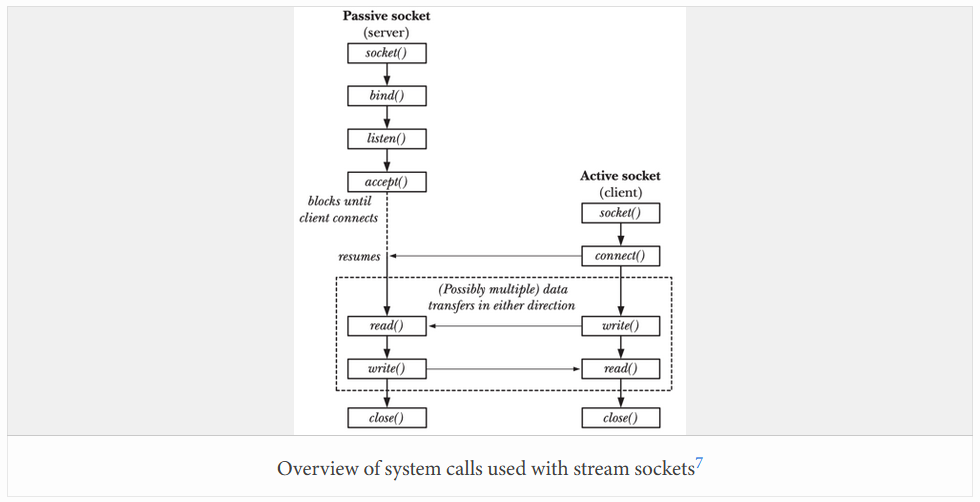

Эффективная обработка десятков тысяч одновременных запросов достигается комбинацией неблокирующего ввода-вывода и мультиплексирования.

### Модели ввода-вывода

**Блокирующий I/O:** поток приостанавливается до завершения вызова. Прост, но требует N потоков на N соединений.

**Неблокирующий I/O:** поток не приостанавливается. Если данные не готовы, возвращается ошибка `EAGAIN` или `EWOULDBLOCK`. Сложнее в реализации, но эффективнее по ресурсам.

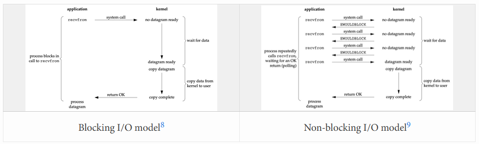

**Мультиплексирование I/O:** приложение блокируется на `select`/`poll`, а не на фактических вызовах ввода-вывода. Когда `select` сообщает о готовности сокета, приложение вызывает `recvfrom` (системный вызов для чтения данных из сокета) для копирования данных в буфер.

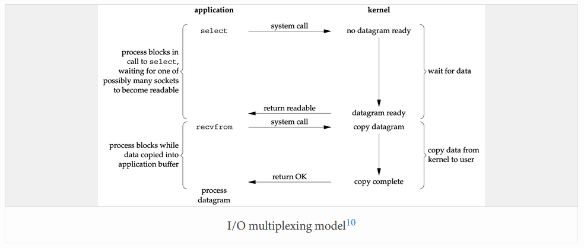

Go использует комбинацию неблокирующего I/O и мультиплексирования. Из-за ограничений `select`/`poll` применяются более масштабируемые альтернативы: epoll (Linux), kqueue (macOS/BSD), IOCP (Windows).

### Механизмы мультиплексирования

**`select`****&#x20;и&#x20;****`poll`****:** старейшие механизмы, работающие по принципу **Reactor** («сообщи, когда будет готово»): приложение передаёт ядру список всех отслеживаемых дескрипторов — ядро проверяет каждый и возвращает результат. Фундаментальный недостаток: каждый раз полный список копируется в ядро и линейно сканируется. У `select` жёсткое ограничение на \~1024 дескриптора.

**`epoll`****&#x20;и&#x20;****`kqueue`****:** решают проблему масштабирования. Дескрипторы регистрируются в ядре один раз (`epoll_ctl`). При вызове `epoll_wait` ядро возвращает только готовые дескрипторы, без линейного сканирования. `epoll` — стандарт для Linux. `kqueue` — для BSD/macOS, более универсален (отслеживает не только сокеты, но и файловую систему, сигналы, таймеры).

**`IOCP`****&#x20;(Windows):** работает по принципу **Proactor** («сделай и сообщи»): приложение не просто ждёт готовности, а инициирует саму операцию ввода-вывода. Ядро выполняет её в фоне, а когда данные уже скопированы в буфер — уведомляет о завершении. Более сложная модель, но высочайшая производительность.

**`io_uring`****&#x20;(Linux):** новейший интерфейс, также Proactor. Благодаря разделяемой памяти между ядром и пользовательским пространством может обходиться практически без системных вызовов. Поддерживает и сетевые сокеты, и файловый I/O.

> **Зачем это Go-разработчику.** Понимание нижележащих механизмов объясняет, почему файловый I/O в Go не асинхронный (на большинстве платформ нет асинхронного файлового I/O), а сетевой — асинхронный. Файловые операции блокируют M, сетевые — нет.

***

## 6. Внутреннее устройство: от запуска до цикла планирования

### Рантайм Go и компиляция

Сборка Go-проекта проходит **три стадии**:

1. **Компиляция:** исходные файлы Go (`*.go`) → ассемблерные файлы (`*.s`).
2. **Ассемблирование:** ассемблерный код (`*.s`) → объектные файлы (`*.o`).
3. **Связывание (linking):** объектные файлы (`*.o`) → исполняемый бинарный файл.

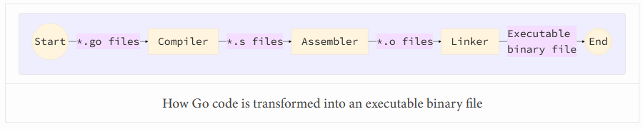

**Рантайм Go** — это ядро языка, предоставляющее планирование, управление памятью и структуры данных. Реализован в пакете `runtime` на комбинации Go и ассемблерного кода.

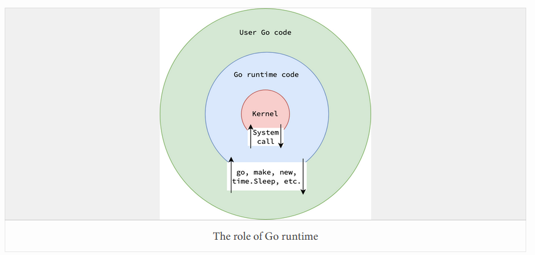

При компиляции ключевые слова заменяются вызовами функций рантайма. `go` → `runtime.newproc`, `new` → `runtime.newobject`. Некоторые функции (`getg`) не имеют Go-реализации и заменяются ассемблерными инструкциями. Платформенно-зависимые функции (`gogo`) полностью реализованы на ассемблере. Связывание ассемблерных реализаций с Go-объявлениями обеспечивается компоновщиком.

Директива `//go:linkname` позволяет связать функцию одного пакета с реализацией в рантайме. Например, `time.Sleep` связана с `runtime.timeSleep`.

Планировщик Go — не отдельный объект, а набор функций рантайма, работающих в тех же потоках, что и горутины.

### Примитивный планировщик (до версии 1.1)

На ранних этапах Go реализовал модель M:N наивно. Существовали только **G (горутины)** и **M (потоки ядра)**. Все горутины хранились в единой глобальной очереди (GRQ), защищённой мьютексом.

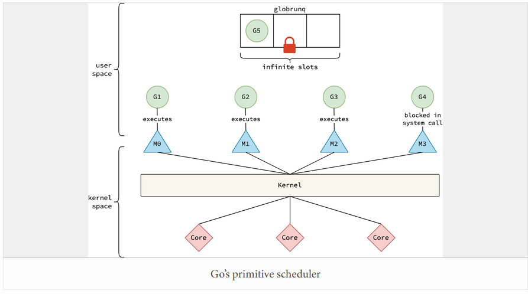

Проблемы примитивного планировщика:

1. **GRQ как узкое место:** при добавлении и извлечении горутин потоки конкурировали за блокировку — **lock contention**.
2. **Плохая локальность:** потоки часто передавали горутины друг другу, что приводило к лишним переключениям контекста. Дочерняя горутина обычно взаимодействует с родительской — запуск в том же потоке эффективнее.
3. **Перерасход памяти:** каждый M имел собственный `mcache` (до 2 МБ). При соотношении активных и заблокированных в syscall потоков 1:100 огромный объём памяти простаивал.

### Улучшения: LRQ и процессор P

**Локальная очередь выполнения (LRQ):** каждый M получил собственную LRQ. Новая горутина помещается в локальную очередь текущего потока, решая проблемы 1 и 2. Переполнение LRQ → горутина уходит в GRQ.

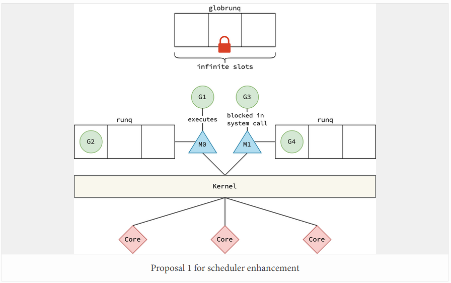

Остаётся проблема голодания (starvation) горутин в LRQ заблокированного M и третья проблема с mcache.

**Логический процессор P:** введён для решения оставшихся проблем. LRQ и mcache теперь принадлежат P, а не M. Когда M блокируется в syscall, он отцепляется от P, и P с его mcache и очередью может быть передан другому M. Это решает проблему перерасхода памяти и делает work stealing эффективным.

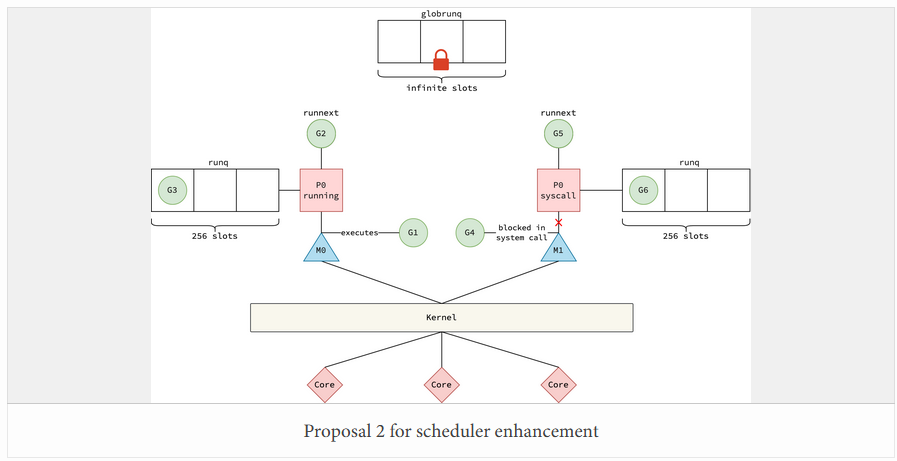

Так модель GMP приобрела современный вид: G (горутина), M (поток), P (процессор).

### Начальная загрузка (bootstrap)

Инициализация планировщика выполняется на ассемблере функцией `runtime·rt0_go`:

1. Создаются **M0** (основной поток) и **G0** (горутина системного стека M0).
2. Создаётся **TLS (Thread-Local Storage)** для основного потока, адрес G0 сохраняется в TLS — доступ через `getg`.
3. Вызывается `runtime·schedinit` → `procresize`, которая переводит до `GOMAXPROCS` процессоров P в состояние ожидания.
4. M0 связывается с первым P, переходя из ожидания в выполнение.
5. Создаётся основная горутина для `runtime.main` — точки входа рантайма.
6. Внутри `runtime.main` создаётся выделенный поток для **sysmon**.
7. M0 вызывает `mstart` — вход в цикл планирования.

`runtime.main` отличается от пользовательской `main`. Пользовательская `main` отображается в рантайме как `main_main`. После инициализации `runtime.main` передаёт управление `main_main`.

Итоговое состояние при запуске (для `GOMAXPROCS=2`):

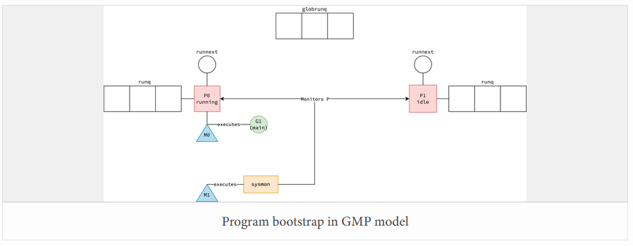

* Одна горутина G (main), выполняющая основную функцию.
* Два потока: M0 (основной) и M1 (для sysmon).
* Один процессор P0 в работе и `GOMAXPROCS-1` процессоров в ожидании.

### Создание горутины

`go func() { ... }()` — синтаксический сахар для `runtime.newproc`. Функция делает три вещи:

**Инициализация:** создаётся новая G (если нет свободных в пуле). Инициализируется стеком **2 КБ** (константа `stackMin`). В стек вызовов помещается функция `goexit` — она выполнится после возврата горутины, обеспечивая очистку и возврат в цикл планирования. G переходит из dead в runnable.

**Помещение в очередь:** каждая P имеет очередь из двух частей: приоритетный слот `runnext` и кольцевой буфер `runq`. Новая горутина помещается в `runnext`. Если `runnext` занят, старая горутина перемещается в `runq`. Если `runq` заполнен — половина горутин из `runq` вместе со старой горутиной перемещается в GRQ.

**Пробуждение процессора:** поток пытается разбудить другой P через `futex`. Проверяет наличие свободных P, создаёт новый M или пробуждает существующий.

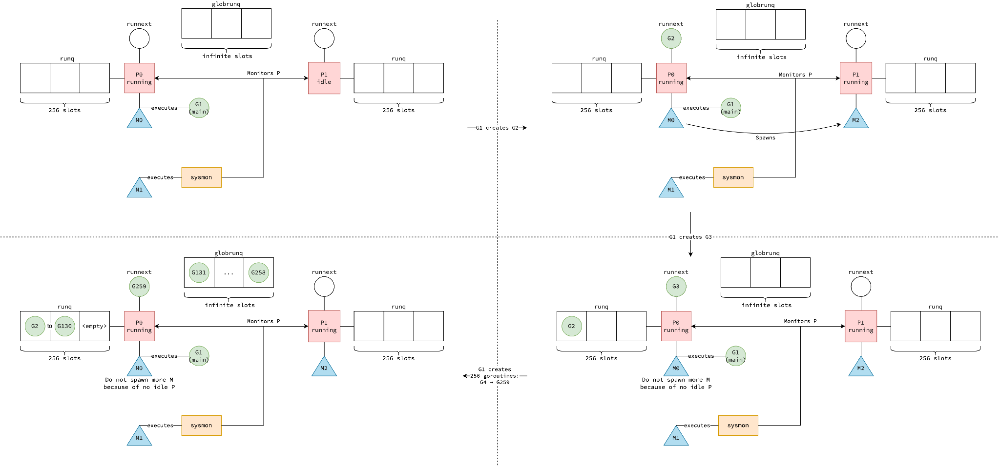

Если все P заняты (`GOMAXPROCS` достигнут), новые M не создаются — горутины просто накапливаются в очередях.

> **Зачем это Go-разработчику.** Механизм `runnext` оптимизирует паттерн «запустил горутину — сразу передал данные через канал»: дочерняя горутина выполняется следующей на том же P.

### Цикл планирования

Функция **`schedule`** отвечает за поиск и выполнение готовой горутины. Она вызывается при создании нового потока, вызове `Gosched`, приостановке/прерывании горутины, возврате из системного вызова.

После выбора горутины вызывается **`gogo`** для начала выполнения. После завершения горутины вызывается **`goexit`** → **`goexit0`** — очистка и повторный вход в `schedule`. Так образуется **цикл планирования**.

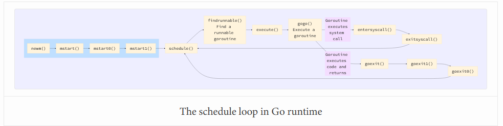

Цикл выполняется потоком M. Основной поток не застревает в цикле навсегда — когда `main_main` возвращается, `runtime.main` вызывает системный вызов `exit` для завершения процесса. Именно поэтому горутина `main` не ждёт завершения других горутин.

### Полный алгоритм findRunnable

Функция findRunnable реализует итеративный алгоритм поиска готовой к выполнению горутины (runnable goroutine) в планировщике Go.

Она не представляет собой линейную последовательность шагов — это цикл с приоритетными источниками работы, который повторяется до тех пор, пока не будет найдена горутина для исполнения.

Остановка происходит сразу при первом успешном нахождении работы, однако в процессе обхода состояние runtime может изменяться, поэтому часть проверок выполняется повторно.

### Источники поиска работы (в порядке приоритета и эвристик)

#### Trace reader (горутина трассировки)

Это специальная системная горутина, отвечающая за запись execution trace (runtime tracing).

Проверяется одной из первых, поскольку tracing — инфраструктурная подсистема runtime, которая должна работать стабильно даже при высокой нагрузке и не должна голодать (starvation).

#### Garbage Collector goroutine (GC)

Системная горутина сборщика мусора.

Runtime периодически даёт ей возможность выполняться, чтобы:

* &#x20;не накапливался долг по очистке памяти
* &#x20;GC мог продвигаться без задержек
* &#x20;не увеличивались паузы Stop-The-World (STW)

#### Global Run Queue (GRQ)

Глобальная очередь готовых горутин.

Используется как общий пул задач для всех P.

Она служит механизмом балансировки нагрузки между потоками выполнения.

Особенности:

* &#x20;задачи берутся пакетами (batching)
* &#x20;размер пакета определяется эвристиками runtime (зависит от нагрузки и числа P)
* &#x20;цель — снизить конкуренцию за глобальную блокировку и улучшить локальность кэша

#### Local Run Queue (LRQ: runq + runnext)

Локальная очередь текущего P.

Содержит горутины, закреплённые за конкретным P.

Особенности:

* &#x20;доступ значительно дешевле, чем GRQ
* &#x20;обычно проверяется раньше в `schedule()`
* &#x20;в `findRunnable` может учитываться повторно, особенно для spinning M (потоков, которые активно ищут работу и не уходят в sleep)

#### Повторная проверка GRQ

Дополнительный быстрый доступ к глобальной очереди.

Нужна из-за того, что во время обхода других источников:

* &#x20;могли добавиться новые горутины
* &#x20;мог измениться баланс между P
* &#x20;часть работы могла быть перенесена из других очередей

#### Netpoll (сетевой поллер)

Проверка готовых I/O задач через netpoller (epoll / kqueue / IOCP).

Это мост между ОС и runtime:

1. &#x20;goroutine блокируется на I/O
2. &#x20;runtime регистрирует fd в netpoll
3. &#x20;ОС сигнализирует о готовности
4. &#x20;netpoll возвращает соответствующие горутины в runnable состояние

#### Work stealing (кража работы)

Механизм балансировки нагрузки между P.

Если локальная и глобальная очереди пусты, текущий P пытается:

* &#x20;забрать часть горутин из других P
* &#x20;перераспределить нагрузку

Особенности:

* &#x20;ограниченное число попыток (обычно несколько итераций)
* &#x20;оптимизация под локальность кэша и снижение противостояния

#### &#x20;Повторная проверка GC

Дополнительная попытка найти GC-работу.

GC может активироваться асинхронно во время обхода, поэтому runtime периодически возвращается к проверке, чтобы не блокировать прогресс сборщика мусора.

### Финальная проверка GRQ (spinning M)

Последняя попытка получить работу из глобальной очереди.

Применяется для spinning M (активно работающего потока), который:

* &#x20;не засыпает сразу
* &#x20;пытается минимизировать задержку появления новых задач
* &#x20;делает быстрые повторные проверки перед блокировкой

### Поведение при отсутствии работы

Если после всех источников горутина не найдена:

* &#x20;runtime проверяет timers (таймерные события)
* &#x20;выполняется netpoll block (ожидание I/O событий)
* &#x20;затем поток M может быть припаркован через `stopm`

### &#xA;Пробуждение потоков

Если новая работа появляется:

* &#x20;другой M или netpoller может разбудить спящий M
* &#x20;goroutine снова попадут в очередь исполнения
* &#x20;цикл `findRunnable` возобновится

### Главная идея алгоритма

`findRunnable` — это не последовательность шагов, а приоритетный цикл поиска работы с динамическими источниками, где runtime постоянно балансирует между локальными очередями, глобальной очередью, I/O событиями и системными горутинами.

> **Зачем это Go-разработчику.** `findRunnable` объясняет, почему `time.Sleep` не блокирует поток: спящая горутина регистрирует таймер, и когда таймер истекает, netpoll возвращает её как готовую.

***

## 7. Сборщик мусора и планировщик

### Трёхцветный алгоритм mark-and-sweep

Go использует **трассирующий сборщик мусора**: он обходит граф объектов, начиная с корневых ссылок. Достижимые объекты — живые, недостижимые — подлежат освобождению.

Алгоритм — **трёхцветная маркировка (tri-color marking)** с поддержкой слабых ссылок. Объекты маркируются тремя цветами:

* **Белый** — не просмотрен, кандидат на удаление.
* **Серый** — просмотрен, но не все его ссылки обработаны.
* **Чёрный** — просмотрен, все ссылки обработаны, объект жив.

Трёхцветный алгоритм позволяет сборщику работать **конкурентно** с программой, сокращая паузы **STW (Stop The World)** — моменты полной остановки всех горутин для выполнения критических фаз сборки мусора.

### Четыре фазы цикла GC

1. **Первый этап STW:** процесс приостанавливается, все P входят в безопасную точку.
2. **Этап маркировки:** горутины GC на короткое время занимают P для маркировки доступных объектов. Выполняется конкурентно с пользовательским кодом.
3. **Второй этап STW:** процесс снова приостанавливается для завершения маркировки.
4. **Этап очистки (sweep):** процесс возобновляется, в фоне освобождается память недостижимых объектов.

Функция `findRunnable` ищет не только пользовательские горутины, но и горутины GC (шаги 2 и 8 в алгоритме).

### GC assist

Приложение может участвовать в сборке мусора через механизм **GC assist**. Если горутина выделяет память, а GC не успевает за ней, горутина сама выполняет часть работы по маркировке. Это предотвращает неконтролируемый рост кучи ценой небольшого замедления аллоцирующих горутин.

> **Зачем это Go-разработчику.** GC assist объясняет, почему при интенсивном выделении памяти горутины могут неожиданно замедляться — они помогают сборщику мусора. Настройка `GOGC` и `GOMEMLIMIT` позволяет управлять этим поведением.

***

## 8. API рантайма и ключевые функции

### GOMAXPROCS и проблема в контейнерах

`runtime.GOMAXPROCS()` задаёт количество процессоров P, контролируя параллелизм. По умолчанию — `runtime.NumCPU()`, которая запрашивает число доступных процессоров у ОС.

В контейнеризированных средах `NumCPU()` может вернуть число ядер хоста, а не ограничение, заданное для контейнера через **cgroup** (механизм ядра Linux для ограничения ресурсов процессов). Это приводит к избыточному количеству P и повышенной конкуренции. Для решения существует переменная окружения `GOMAXPROCS` и пакет `go.uber.org/automaxprocs`, учитывающий cgroup-ограничения.

Некоторые IO-нагруженные программы выигрывают от большего числа P, чем ядер. Например, Dgraph жёстко устанавливает `GOMAXPROCS=128`, чтобы позволить планировать больше дисковых операций.

### Goexit

`runtime.Goexit()` корректно завершает текущую горутину, выполнив все отложенные вызовы `defer`. Программа продолжает выполнение других горутин. Если все остальные горутины завершаются, программа аварийно завершается. Используется в тестировании для досрочного выхода с сохранением очистки.

### Gosched

**`runtime.Gosched()`** — явный запрос на перепланировку: текущая горутина добровольно уступает процессор, помещается в конец локальной очереди и возобновит работу позже. Полезен в трёх случаях: для предотвращения голодания других горутин в плотных вычислительных циклах (в версиях до Go 1.14), для ручной балансировки нагрузки между горутинами и для отладки проблем конкурентности. В современных версиях Go обычно не требуется для CPU-Bound циклов благодаря асинхронному вытеснению.

### LockOSThread

**`runtime.LockOSThread()`** — привязывает текущую горутину к тому потоку ОС (M), на котором она выполняется. Пока горутина привязана, никакая другая горутина не сможет занять этот M, а сама горутина — переключиться на другой M. Используется в трёх сценариях:

* **Взаимодействие с C-кодом через CGo:** C-библиотеки часто полагаются на локальное для потока (thread-local) состояние; `LockOSThread` гарантирует, что вызовы C-функций из Go происходят на одном и том же потоке.
* **Низкоуровневые графические библиотеки** (OpenGL, Vulkan): их контексты привязаны к потоку.
* **Тестирование** детерминированного поведения планировщика.

Важно: после `LockOSThread()` горутина **обязана** вызвать `runtime.UnlockOSThread()`, иначе поток останется навсегда занят.

### getg

**`getg()`** — функция получения текущей горутины в текущем потоке. Не имеет Go-реализации: при компиляции вызовы переписываются в инструкции, извлекающие горутину из TLS или регистров. Сохранение текущей G в TLS происходит при переключении контекста в функции `gogo` (вызывается из `execute`) и в обработчике сигнала `sigtrampgo`.

### gopark — парковка горутин

`gopark` — широко используемая процедура перевода горутины в ожидание и планирования другой.

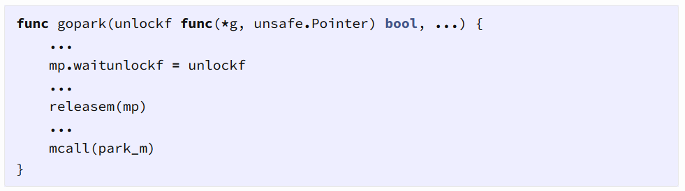

Внутри `releasem` параметр `stackguard0` горутины устанавливается в `stackPreempt` для возможного кооперативного вытеснения. Управление передаётся горутине g0 для вызова `park_m`.

В `park_m` состояние G устанавливается в Waiting, связь G-M разрывается. Если переданный callback `unlockf` возвращает `false`, горутина немедленно становится доступной и перепланируется на том же M через `execute`. Иначе M входит в цикл планирования.

### startm — запуск потока

`startm` планирует выполнение M на заданном P.

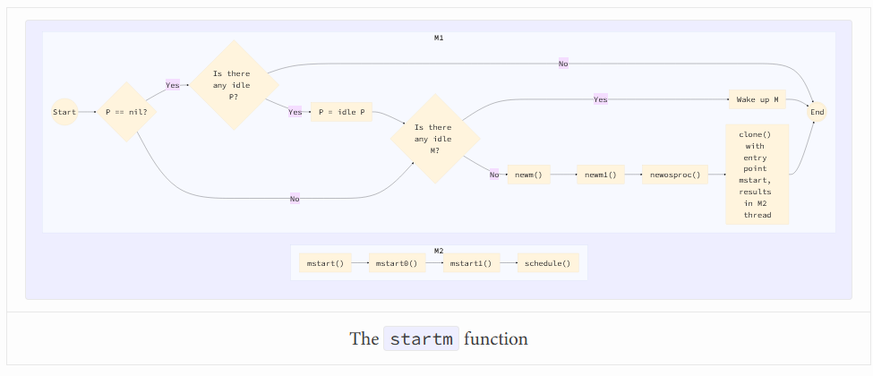

Если P равен nil, функция ищет свободный P в глобальном списке. Если свободных нет — возврат (максимальное количество активных P уже занято). Иначе — создаёт новый M (через системный вызов **`clone`** — низкоуровневый механизм Linux для создания потоков) или пробуждает существующий. `mstart` входит в цикл планирования.

### stopm — остановка потока

`stopm` добавляет M в список неактивных и переводит в спящий режим через `futex`. Функция не возвращает управление, пока M не будет разбужен другим потоком (обычно при создании новой горутины).

### handoffp — передача процессора

`handoffp` передаёт P от блокирующегося в syscall потока Ms другому потоку M1. P связывается с M1 через `startm` при условиях: GRQ не пуста, LRQ текущего P не пуста, есть задачи трассировки или GC, или ни один поток не обрабатывает netpoll. Если условий нет — P возвращается в список свободных.

***

## 9. Горутина изнутри

### Структура g

**Горутина** — легковесный поток, управляемый рантаймом, а не ОС. В коде рантайма структура `g` занимает около 70 строк:

```go
// g — структура горутины в Go runtime.
//
// ВАЖНО:
// Это НЕ полный код из исходников Go runtime.
// Это упрощённая версия, содержащая только самые важные поля,
// необходимые для понимания планировщика (scheduler), переключения контекста,
// блокировок и взаимодействия с ОС.

type g struct {

    // ---------- СТЕК ----------

    // stack описывает диапазон памяти стека горутины
    stack stack

    // stackguard используется для проверки переполнения стека
    // и перехода в morestack при необходимости
    stackguard0 uintptr

    // ---------- ПЛАНИРОВЩИК ----------

    // sched хранит сохранённый контекст выполнения горутины
    // (регистры CPU, instruction pointer, stack pointer)
    // используется при переключении между goroutines
    sched gobuf

    // atomicstatus — текущее состояние горутины:
    // _Gidle, _Grunnable, _Grunning, _Gwaiting, _Gsyscall и т.д.
    atomicstatus uint32

    // goid — уникальный идентификатор горутины
    goid int64

    // m — поток ОС (machine), на котором выполняется goroutine
    // nil если горутина не выполняется прямо сейчас
    m *m

    // schedlink — ссылка на следующую goroutine в очередях планировщика
    // (run queue, wait queue и др.)
    schedlink guintptr

    // ---------- БЛОКИРОВКИ ----------

    // waitreason объясняет, почему goroutine заблокирована
    // (channel receive/send, sleep, netpoll, syscall и т.д.)
    waitreason waitReason

    // ---------- СИСТЕМНЫЕ ВЫЗОВЫ ----------

    // syscallsp/syscallpc сохраняют состояние при входе в syscall
    // чтобы можно было продолжить выполнение после выхода из ОС
    syscallsp uintptr
    syscallpc uintptr

    // ---------- PREEMPTION ----------

    // preempt указывает, что горутину нужно принудительно остановить
    // (асинхронная или кооперативная вытесняемость)
    preempt bool

    // ---------- GC (сборщик мусора) ----------

    // gcAssistBytes — количество работы, выполненной горутиной
    // в рамках помощи сборщику мусора (GC assist)
    gcAssistBytes int64

    // gcscandone показывает, что goroutine уже была просканирована GC
    gcscandone bool

    // ---------- ДИАГНОСТИКА / ОТЛАДКА ----------

    // paniconfault — вызвать panic при fault (например, nil pointer dereference)
    paniconfault bool

    // isSystemGoroutine — системная goroutine runtime (GC, scheduler, netpoll)
    isSystemGoroutine bool

    // labels — используется для tracing / profiling / runtime debugging
    labels unsafe.Pointer
}

```

Ключевые поля структуры `g`:

| Поле                                      | Назначение                             |
| ----------------------------------------- | -------------------------------------- |
| `stack`                                   | Границы стека (нижняя и верхняя)       |
| `stackguard0`, `stackguard1`              | Проверки переполнения и вытеснения     |
| `_panic`                                  | Указатель на панику                    |
| `_defer`                                  | Указатель на отложенный вызов          |
| `m`                                       | Связанный поток M                      |
| `sched` (gobuf)                           | Контекст планировщика: SP, PC, BP      |
| `syscallsp`, `syscallpc`                  | Для системных вызовов                  |
| `atomicstatus`                            | Статус горутины                        |
| `goid`                                    | Глобальный уникальный идентификатор    |
| `preempt`, `preemptStop`, `preemptShrink` | Флаги вытеснения                       |
| `waiting`                                 | Указатель на объект ожидания (`sudog`) |
| `gcAssistBytes`                           | Объём помощи GC                        |

Структура используется исключительно рантаймом и не предназначена для прямого доступа разработчиками.

### Динамический стек

**Стек горутины** — непрерывная область памяти, организованная как **LIFO (Last-In-First-Out**, последним пришёл — первым вышел). В отличие от потоков ОС с фиксированным стеком (1–8 МБ), стек горутины **динамический**.

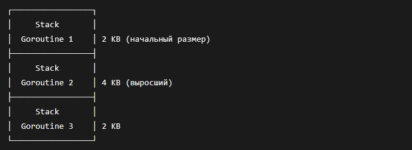

* **Начальный размер:** 2 КБ (константа `stackMin`).
* **Механизм роста:** при приближении к переполнению стек копируется в новый, больший регион памяти.
* **Коэффициент роста:** удвоение для стеков до 4 КБ, затем +25% от текущего размера.
* **Уменьшение стека&#x20;**&#x415;сли горутина долго использует меньше памяти, чем было выделено, стек может быть уменьшен (shrinking).

Содержимое стека горутины:

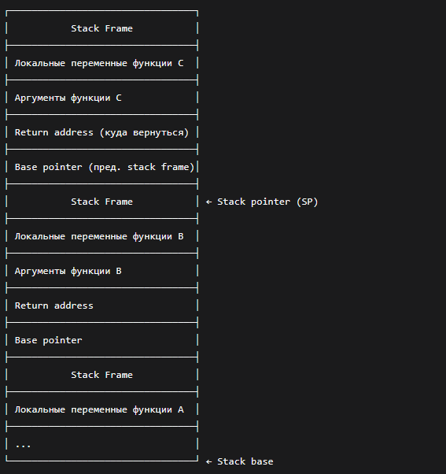

**Сжатие** происходит зеркально во время цикла GC. Если фактическая занятость меньше четверти объёма, стек копируется в уменьшенный блок, старый освобождается. Модель непрерывного стека с копированием заменила старую **сегментированную архитектуру** (segmented stacks), где стек рос не непрерывно, а отдельными сегментами-кусками, что создавало накладные расходы на стыках при частых вызовах функций.

**Предел роста:** У goroutine в Go нет фиксированного максимального размера стека в виде жёсткой константы (например, 1 ГБ или 250 МБ), но он ограничен:

* доступной памятью процесса,
* &#x20;архитектурой (32-bit или 64-bit),
* &#x20;и проверками переполнения внутри runtime.

> **Зачем это Go-разработчику.** Начальный стек в 2 КБ означает, что создание миллиона горутин требует \~2 ГБ памяти только под стеки. Динамический рост не бесплатен: копирование стека останавливает горутину на время операции.

### Stack frame и регистры

**Stack Frame (кадр стека)** — блок памяти в стеке вызовов, выделенный для одного вызова функции. Содержит:

* Локальные переменные.
* Аргументы функции.
* Адрес возврата.
* Ссылку на предыдущий фрейм.

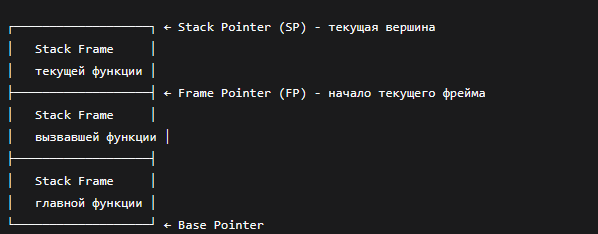

Пример вызова функции и соответствующих фреймов:

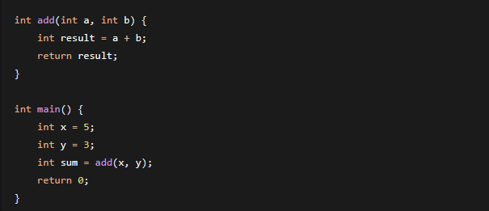

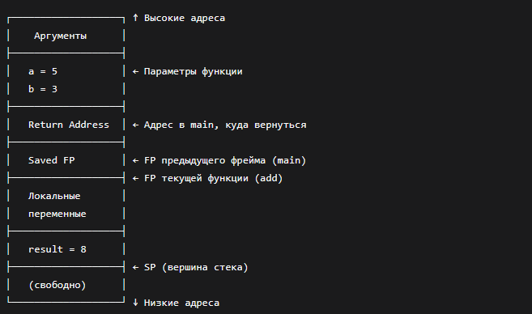

**Регистры, управляющие стеком:**

| Регистр                                              | Назначение                                                                                                                          |
| ---------------------------------------------------- | ----------------------------------------------------------------------------------------------------------------------------------- |
| **SP (Stack Pointer)**                               | Указывает на текущую вершину стека                                                                                                  |
| **FP (Frame Pointer, псевдорегистр компилятора Go)** | Используется для адресации аргументов функции и локальных данных через stack frame; не обязательно соответствует аппаратному FP     |
| **BP (Base Pointer, аппаратный регистр)**            | Обычный CPU-регистр; в Go может не использоваться (часто исключается через -fomit-frame-pointer), не является частью модели runtime |

Важное уточнение состоит в том, что FP в Go нельзя понимать как классический frame pointer из низкоуровневых ABI. В языке он существует в основном как псевдорегистр, который используется компилятором для адресации аргументов функции и работы со стековым фреймом, но он не обязан соответствовать реальному регистру процессора и может существовать только на уровне абстракции компилятора.

Отдельно стоит понимать, что BP (base pointer) также не является частью модели стека Go runtime. Это обычный регистр процессора, который в ряде конфигураций вообще не используется из-за флага оптимизации, отключающего хранение frame pointer. Поэтому Go не опирается на BP как на обязательный элемент своей модели выполнения или переключения стеков.

Ещё один важный момент заключается в том, что Go не использует сегментированные стеки, как это делалось в старых реализациях runtime у других языков. Там стек состоял из набора отдельных сегментов, которые добавлялись по мере роста. В Go модель принципиально другая: стек является непрерывным блоком памяти, который при необходимости может перемещаться целиком.

Рост стека в Go тоже устроен иначе, чем добавление новых сегментов. При переполнении вызывается `runtime.morestack` и создаётся новый, больший блок памяти, после чего весь старый стек копируется в него. Runtime затем перенастраивает все необходимые указатели, чтобы выполнение продолжилось корректно уже в новом месте, а старый блок освобождается. Это делает модель проще и быстрее с точки зрения работы с памятью и кешем.

Наконец, механизм stackguard работает как встроенная проверка переполнения стека, которую компилятор вставляет в пролог практически каждой функции. Перед выполнением функции сравнивается текущее значение SP с guard-значением, и если обнаруживается приближение к границе, вызывается runtime.morestack. Этот вызов не создаёт новый сегмент, а инициирует полный перенос стека в новый участок памяти с последующей корректировкой состояния выполнения.

> **Зачем это Go-разработчику.** Понимание stack frame важно при чтении ассемблерного вывода (go tool compile -S) и отладке panic. В отличие от C, бесконечная рекурсия в Go не приводит к segfault, а вызывает постепенный рост стека goroutine через механизм stack growth. В конечном итоге это приводит к переполнению стека и runtime panic (stack overflow),.

***

## 10. Практические выводы

### Как тип нагрузки влияет на количество горутин

* **CPU-Bound нагрузка:** оптимальное количество активных горутин равно или чуть больше `GOMAXPROCS`. Избыточные горутины не ускоряют работу — они конкурируют за процессор и создают лишние переключения контекста.
* **IO-Bound нагрузка:** количество горутин может значительно превышать `GOMAXPROCS`. Пока одни горутины заблокированы в ожидании сети/диска/канала, другие выполняются на освободившихся тредах. Эффективный потолок определяется объёмом доступной памяти и накладными расходами на планирование.
* **Смешанная нагрузка:** используйте worker pool с настраиваемым уровнем параллелизма. Профилируйте и корректируйте размер пула.

### Типичные ошибки

**Утечка горутин:** горутина навсегда блокируется на канале, мьютексе или в ожидании сети, но ссылка на неё сохраняется, и GC не может её собрать. Симптомы: неограниченный рост памяти и числа горутин (`runtime.NumGoroutine()`). Лечение: `context.Context` для отмены, `select` с таймаутом, буферизованные каналы.

**Избыточное создание:** запуск горутины на каждый элемент большого среза без ограничения параллелизма. Для CPU-Bound задач это ведёт к деградации производительности из-за переключений контекста. Лечение: worker pool или **семафор** — буферизованный канал ёмкостью N, где горутина перед работой отправляет в канал значение (занимает слот), а после — забирает (освобождает). Когда канал заполнен, отправка блокируется, ограничивая число одновременно работающих горутин:

```go
sem := make(chan struct{}, 10) // не более 10 горутин одновременно
for _, item := range items {
    sem <- struct{}{} // занять слот (заблокируется, если все 10 заняты)
    go func(item Item) {
        defer func() { <-sem }() // освободить слот
        process(item)
    }(item)
}

```

**Голодание (starvation):** горутина не получает процессорное время из-за постоянного притока новых горутин. Часто возникает при использовании `runnext` (новая горутина вытесняет старую). Лечение: периодический вызов `runtime.Gosched()` в генераторе горутин или снижение темпа их создания.

### Worker pool как инструмент управления

Worker pool — паттерн для ограничения параллелизма без ограничения конкурентности:

```go
func workerPool(n int, tasks <-chan Task, results chan<- Result) {
    var wg sync.WaitGroup
    for i := 0; i < n; i++ {
        wg.Add(1)
        go func() {
            defer wg.Done()
            for task := range tasks {
                results <- process(task)
            }
        }()
    }
    wg.Wait()
    close(results)
}

```

Преимущества:

* Ограничение числа одновременно выполняющихся горутин.
* Контроль над потреблением памяти и процессора.
* Возможность настроить уровень параллелизма под характер нагрузки.

Недостатки:

* Дополнительный код и косвенность.
* При неправильном размере пула — либо недозагрузка, либо перегрузка.

### GOMAXPROCS на практике

* **Значение по умолчанию (****`NumCPU()`****):** оптимально для CPU-Bound задач на выделенном сервере.
* **В контейнерах:** обязательно корректировать — либо через переменную `GOMAXPROCS`, либо через `go.uber.org/automaxprocs`.
* **Для IO-нагруженных сервисов:** увеличение `GOMAXPROCS` может повысить пропускную способность ценой большего потребления памяти и потенциально худшей локальности кэша. Экспериментируйте и профилируйте.
* **Для снижения задержки:** уменьшение `GOMAXPROCS` снижает конкуренцию за ресурсы и может улучшить хвостовые задержки (tail latency).

### Диагностика через трассировку

Go предоставляет мощные инструменты для диагностики планировщика:

* **`GODEBUG=schedtrace=1000`** — вывод статистики планировщика каждые 1000 мс: количество горутин в каждом состоянии, количество M и P, работающих и заблокированных.
* **`GODEBUG=scheddetail=1`** — детализированный вывод вместе со `schedtrace`.
* **`runtime/trace`** — пакет для записи трассировки выполнения. Визуализация в `go tool trace` показывает состояния горутин, переключения процессоров, сетевые и системные вызовы.
* **`pprof`** с профилем `goroutine` — показывает все горутины и их стеки, помогает найти утечки.
* **`runtime.NumGoroutine()`** — простейший способ мониторинга количества горутин в рантайме; удобно выводить в логи или метрики для обнаружения утечек.

Первые признаки проблем в планировщике:

* Растущее число горутин в состоянии `runnable` и `waiting`.
* Большое количество потоков ОС (M) относительно `GOMAXPROCS`.
* Высокая частота work stealing в трейсе.

> **Зачем это Go-разработчику.** Трассировка планировщика — последний рубеж диагностики, когда профили процессора и памяти не показывают явных проблем. Умение читать трейс планировщика отличает опытного Go-разработчика.

***

## Ссылки

[Go Scheduler: GMP Model Explained](https://nghiant3223.github.io/2025/04/15/go-scheduler.html)

https://habr.com/ru/articles/891426/

https://habr.com/ru/articles/478168/

https://habr.com/ru/articles/489862/

https://habr.com/ru/companies/mvideo/articles/778248/

https://www.youtube.com/watch?v=kedW1xO3Zbo\&t=2960s
