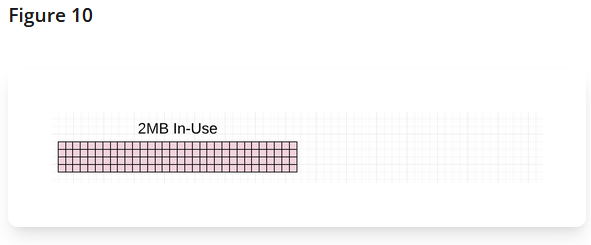
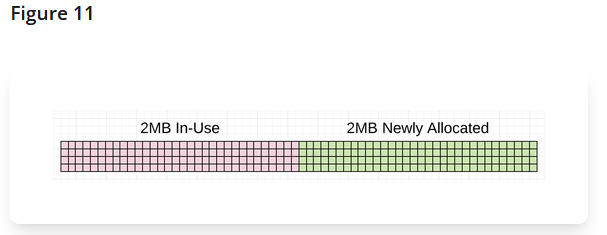
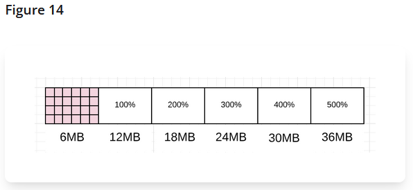
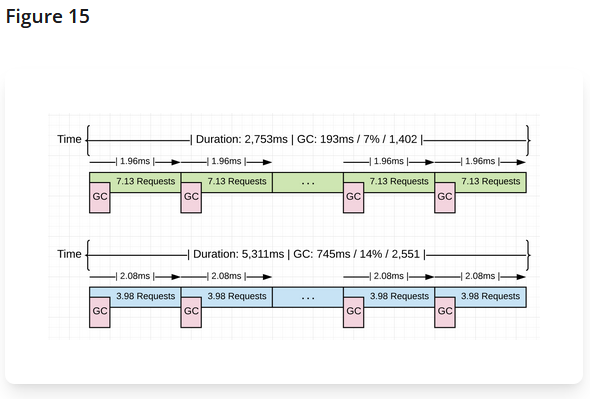
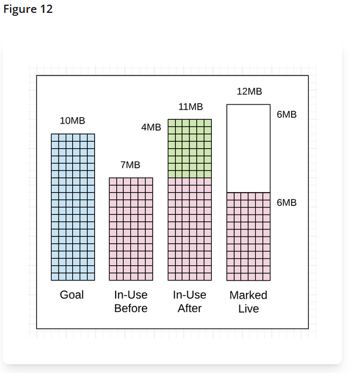
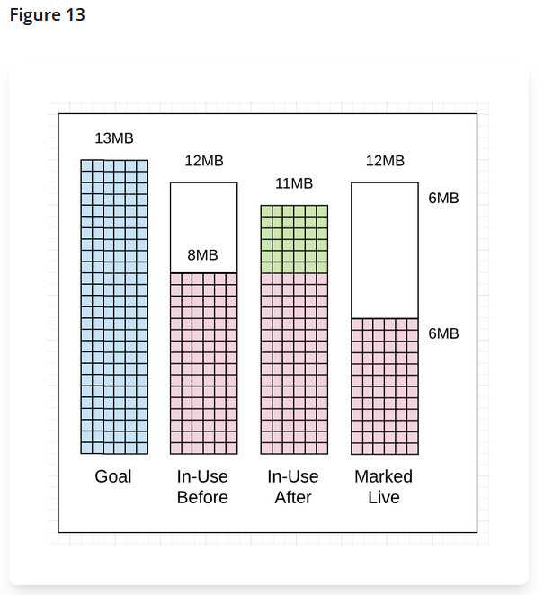
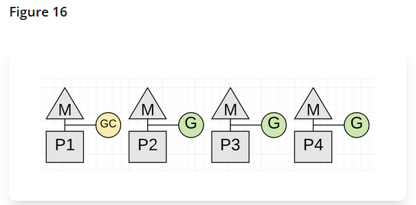
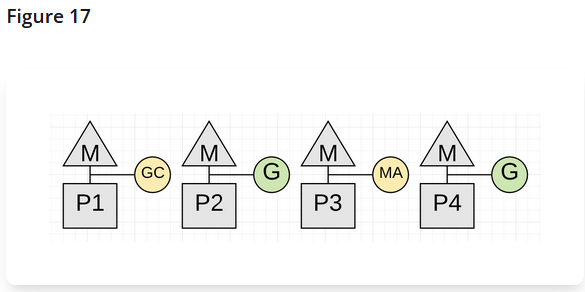
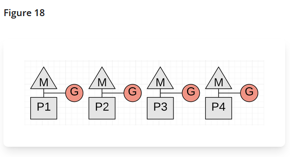

# Настройка и диагностика сборщика мусора

> **Проверено:** Go 1.27 · **Уровень:** младший разработчик — углублённый

Эта глава строит расследование от наблюдаемого симптома. Начните с метрик и
профиля, затем меняйте одну причину и повторяйте ту же нагрузку. Переменные
`GODEBUG` нужны для ограниченного эксперимента, а не как постоянная настройка
службы.

## Какие величины различать

- **Живая куча** — объекты, отмеченные предыдущей сборкой как достижимые.
- **Цель кучи** — ориентир регулятора для текущего цикла, а не точный порог.
- **Сканируемая память** — части кучи, стеков и глобальных данных, содержащие
  потенциальные указатели.
- **Накопленные выделения** — весь объём выделений с начала процесса; он может
  расти при стабильной живой куче.
- **Память Go** — классы памяти, управляемые средой выполнения.
- **RSS** — физические страницы всего процесса; включает расходы вне кучи Go.



*Живая куча предыдущего цикла служит исходной величиной для следующей цели.*



*Достижение расчётной области запускает работу регулятора; это не жёсткая граница
в байтах.*



*Повышение `GOGC` обычно меняет частоту циклов на больший запас памяти.*



*Сравнивать оптимизацию нужно при одинаковой полезной работе, а не по одному
случайному запуску.*

<a id="основные-метрики-runtimemetrics"></a>
## Основные метрики `runtime/metrics`

| Метрика | Что показывает | Как использовать |
|---|---|---|
| `/gc/heap/live:bytes` | живую кучу по результату предыдущего цикла | сравнивать после сопоставимых циклов |
| `/gc/heap/goal:bytes` | текущую цель кучи | оценивать запас и влияние настроек |
| `/gc/heap/allocs:bytes` | накопленный объём выделений | брать разность за интервал |
| `/gc/cycles/automatic:gc-cycles` | завершённые автоматические циклы | брать разность за интервал |
| `/gc/cycles/forced:gc-cycles` | циклы, вызванные приложением | обнаруживать `runtime.GC` и тестовые воздействия |
| `/gc/scan/heap:bytes` | сканируемую часть кучи | искать рост указательного графа |
| `/gc/scan/stack:bytes` | объём стеков, просканированный в последнем цикле | сопоставлять с числом и глубиной стеков |
| `/gc/scan/globals:bytes` | сканируемые глобальные данные | учитывать постоянную часть корней |
| `/cpu/classes/gc/mark/assist:cpu-seconds` | процессорное время помощи маркировке | брать разность и сравнивать с другими классами CPU |
| `/cpu/classes/gc/total:cpu-seconds` | оценку всего процессорного времени сборщика | сравнивать только с `/cpu/classes/*` |
| `/gc/limiter/last-enabled:gc-cycle` | последний цикл включения ограничителя CPU | значение `0` означает, что он ещё не включался |
| `/sched/pauses/total/gc:seconds` | распределение всех пауз сборщика | смотреть хвост распределения |
| `/sched/pauses/stopping/gc:seconds` | часть паузы на остановку P | отличать остановку от остальной STW-работы |

Счётчики и процессорные секунды интерпретируют по разности двух снимков. Значение
живой кучи обновляется после сборки, поэтому частые чтения между циклами не показывают
мгновенный объём достижимых объектов.

### Как читать распределение пауз

`Value.Float64Histogram()` возвращает границы и число наблюдений в каждом интервале.
Для приблизительного процентиля:

1. сложите все `Counts` и вычислите порядковый номер нужного процентиля;
2. суммируйте корзины слева направо;
3. первая корзина, в которой достигнут порядковый номер, задаёт интервал результата;
4. не выдавайте верхнюю границу корзины за точное измерение.

Среднее скрывает редкие длинные паузы. Сравнивайте, например, p50, p95 и p99, число
наблюдений и максимальную занятую корзину за один и тот же интервал.

## Диагностика от симптома

| Симптом | Проверить сначала | Если подтверждено |
|---|---|---|
| Высокая доля CPU сборщика | разность `/cpu/classes/gc/total` и профиль CPU | уменьшить выделения или сканируемый живой граф |
| Частые циклы | циклы, живая куча, цель, учитываемая память | проверить `GOGC`, предел и скорость выделений |
| Высокая помощь маркировке | `/cpu/classes/gc/mark/assist` | профиль `allocs`, горячие пути выделений |
| Длинные паузы | распределения `/sched/pauses/*/gc` | трассировка, число и состояние горутин |
| Рост живой кучи | `/gc/heap/live` после повторяемой нагрузки | профиль `heap`, пути удержания ссылок |
| Приближение к пределу | учитываемая память, ограничитель CPU, cgroup | увеличить запас или сократить удержание |
| RSS больше памяти Go | классы памяти, RSS, cgo, отображения | проверить очиститель страниц и внешние выделения |

### Профили `heap` и `allocs`

- `heap` с `inuse_space` показывает места выделения объектов, остающихся в выбранном
  снимке достижимыми;
- `allocs` с `alloc_space` показывает накопленный объём выделений, даже если объекты
  уже освобождены;
- профиль содержит выборку, поэтому малые изменения подтверждают несколькими
  запусками и тестом производительности.

```bash
go test ./runtimeinfo -run '^$' -bench '^BenchmarkGCWorkload$' \
  -benchmem -memprofile gc.pprof
go tool pprof -sample_index=inuse_space gc.pprof
go tool pprof -sample_index=alloc_space gc.pprof
```

<a id="gctrace-снимок-одного-цикла"></a>
## `gctrace`: снимок одного цикла

```bash
GODEBUG=gctrace=1 go test ./runtimeinfo -run '^$' \
  -bench '^BenchmarkGCWorkload$' -benchtime=2s
```

Формат Go 1.27 выглядит так:

```text
gc 7 @0.123s 2%: 0.015+1.2+0.020 ms clock,
0.12+0.30/1.8/0.25+0.16 ms cpu,
12->14->7 MB, 15 MB goal, 2 MB stacks, 1 MB globals, 8 P
```

Это учебная строка, а не эталон ожидаемых чисел. Три значения `clock` означают
остановку для завершения очистки и подготовки маркировки, конкурентные маркировку и
сканирование, затем остановку для завершения маркировки. В средней группе CPU
отдельно показаны помощь, фоновая и выполняемая на простаивающих P работа.

`12->14->7 MB` — куча в начале цикла, в конце маркировки и объём живой кучи.
Далее идут цель, сканируемые стеки, сканируемые глобальные данные и число P. Суффикс
`(forced)` означает вызов `runtime.GC`. Формат не является стабильным интерфейсом.



*Три размера кучи относятся к разным моментам цикла и не заменяют профиль.*



*Изменения между строками полезнее одного изолированного значения.*

Дополнительные параметры `GODEBUG`:

- `gcpacertrace=1` выводит внутреннее состояние регулятора темпа;
- `gcstoptheworld=1` отключает конкурентную сборку, превращая маркировку в STW;
- `gcstoptheworld=2` дополнительно отключает конкурентную очистку.

Последние два режима радикально меняют поведение программы и нужны только для
экспериментов со сборщиком:

```bash
GODEBUG=gcstoptheworld=1 go test ./runtimeinfo -run '^$' \
  -bench '^BenchmarkGCWorkload$' -benchtime=2s
```

## Процессорная работа и паузы



*Конкурентная маркировка уменьшает доступную приложению долю CPU.*



*Быстро выделяющая горутина может погашать долг маркировки собственной работой.*



*Пауза STW — только одна составляющая стоимости сборки.*

Не используйте фиксированный норматив паузы без контекста. Требование задаётся SLO
службы, а результат зависит от версии Go, нагрузки, числа горутин и платформы.

## Безопасный эксперимент с `GOGC` и `GOMEMLIMIT`

Команда `gcmetrics` выполняет одинаковое число раундов выделений и печатает разности
метрик:

```bash
cd examples

GOGC=50  GOMEMLIMIT=512MiB go run ./cmd/gcmetrics -rounds=200
GOGC=100 GOMEMLIMIT=512MiB go run ./cmd/gcmetrics -rounds=200
GOGC=200 GOMEMLIMIT=512MiB go run ./cmd/gcmetrics -rounds=200
```

Сохраняйте вместе с результатом версию Go, `GOOS`, `GOARCH`, `GOMAXPROCS`, предел
cgroup и параметры нагрузки. Сравнивайте:

- время выполнения сценария;
- прирост числа автоматических циклов;
- прирост процессорного времени сборщика и помощи маркировке;
- живую кучу, цель и учитываемый средой выполнения объём памяти после сценария;
- задержки реального приложения под той же нагрузкой.

Результат одной машины не становится рекомендуемым значением для всех служб.

### Проверка изменения кода

Исходный режим заново создаёт срез блоков в каждом раунде. Режим `-reuse` выполняет
те же записи и получает ту же контрольную сумму, но создаёт блоки один раз:

```bash
GOGC=100 GOMEMLIMIT=512MiB go run ./cmd/gcmetrics -rounds=200
GOGC=100 GOMEMLIMIT=512MiB go run ./cmd/gcmetrics -rounds=200 -reuse
```

Сравните `checksum`, `alloc_bytes`, число автоматических циклов, процессорное время
сборщика и длительность. Это проверяет узкую гипотезу: уменьшит ли повторное
использование буферов число выделений и работу сборщика в данном сценарии. Такой
результат ещё не доказывает, что пул или повторное использование нужны в рабочем
коде: там отдельно проверяют удержание памяти и усложнение владения буфером.

## Очиститель страниц и RSS

Сборка делает ячейки доступными аллокатору, а **очиститель страниц** возвращает ОС
физические страницы, которые поддерживают свободные области кучи. Он использует
сводки распределителя свободных страниц и отдельную карту уже возвращённых страниц,
а не обходит `allocBits` каждого объекта.

Есть фоновая и синхронная работа. Цели рассчитываются из цели кучи, мягкого предела
и оценки удерживаемых страниц. Это не реакция на универсальный сигнал ОС о давлении
памяти.

Полезные показатели:

- `/memory/classes/heap/free:bytes` — свободные, но ещё физически поддерживаемые
  области кучи;
- `/memory/classes/heap/released:bytes` — память кучи, возвращённая ОС;
- `/cpu/classes/scavenge/background:cpu-seconds` и
  `/cpu/classes/scavenge/assist:cpu-seconds` — процессорная работа очистителя;
- RSS процесса и предел cgroup — внешний взгляд операционной системы.

Большое значение `HeapIdle - HeapReleased` само по себе не доказывает фрагментацию
или отставание очистителя: среда выполнения намеренно оставляет запас для повторных
выделений. Для внутренней фрагментации полезнее сопоставлять `HeapInuse - HeapAlloc`,
распределение размеров и профиль.

```bash
GODEBUG=scavtrace=1 go run ./cmd/gcmetrics -rounds=200
```

На Linux Go 1.27 по умолчанию использует `MADV_DONTNEED`. Значение
`GODEBUG=madvdontneed=0` предпочитает `MADV_FREE`: оно обычно дешевле, но RSS может
уменьшиться только при давлении памяти. На других платформах `sysUnused` использует
другие системные механизмы, поэтому Linux-выводы нельзя переносить буквально. Если
ядро Linux не поддерживает выбранный совет `madvise`, среда выполнения переходит от
`MADV_FREE` к `MADV_DONTNEED`, а при отсутствии обоих вариантов — к повторному
отображению диапазона через `mmap`.

## Ручные вызовы и `sync.Pool`

- `runtime.GC()` запускает принудительный цикл и ждёт его завершения, но не обещает
  уменьшить RSS.
- `debug.FreeOSMemory()` запускает сборку и принудительную попытку возврата памяти
  ОС; это диагностическое воздействие, а не обычный регулятор рабочей службы.
- `sync.Pool` подходит для временных значений, разделяемых независимыми клиентами.
  Элементы могут исчезнуть при любой сборке, а пул способен увеличить удержание.
  Решение принимают по профилю и сравнительному тесту производительности.
- Внешние ресурсы закрывают явно; границы `AddCleanup`, `KeepAlive`, финализаторов и
  слабых указателей разобраны во [вводной главе](garbage-collector.md#ресурсы-не-равны-памяти).

## Практические задания

1. Найдите в двух снимках прирост помощи маркировке и объясните, почему абсолютное
   накопленное значение непригодно для оценки интервала.
2. Сравните `GOGC=50`, `100` и `200`, не меняя число раундов. Объясните изменение
   памяти, числа циклов и времени, не объявляя один вариант универсально лучшим.
3. Задайте `GOMEMLIMIT` с безопасным запасом к cgroup, затем слишком тесное значение.
   Сопоставьте число циклов и `/gc/limiter/last-enabled:gc-cycle`.
4. Снимите `heap` и `allocs` для одной нагрузки и объясните, почему верхние строки
   могут различаться.

## Источники

- [Документация `runtime/metrics`](https://pkg.go.dev/runtime/metrics).
- [Документация `runtime/debug`](https://pkg.go.dev/runtime/debug).
- [`runtime/extern.go` Go 1.27.0](https://github.com/golang/go/blob/go1.27.0/src/runtime/extern.go).
- [`runtime/mgcscavenge.go` Go 1.27.0](https://github.com/golang/go/blob/go1.27.0/src/runtime/mgcscavenge.go).
- [`runtime/mpagealloc.go` Go 1.27.0](https://github.com/golang/go/blob/go1.27.0/src/runtime/mpagealloc.go).
