# Фазы сборки мусора и барьер записи

> **Проверено:** Go 1.27
>
> **Перед чтением:** [достижимость и общий цикл сборки](garbage-collector.md).
>
> **После чтения:** вы сможете объяснить конкурентную маркировку, остановки мира и назначение барьера записи.
>
> **Практика:** [задания и самопроверка](../../practice.md#garbage-collector).

Эта глава объясняет, как среда выполнения сохраняет корректность графа объектов,
пока прикладные горутины изменяют его одновременно с маркировкой. Базовые понятия
введены в [главе о сборщике](garbage-collector.md).

## Карта цикла Go 1.27

В исходном коде `runtime/mgc.go` цикл описан следующей последовательностью:

| Часть цикла | Выполнение приложения | Основная работа |
|---|---|---|
| Завершение предыдущей очистки | остановлено | закончить неочищенные спаны, подготовить маркировку |
| Подготовка маркировки | остановлено | включить барьер, подготовить задания корней и рабочих горутин |
| Маркировка и сканирование | продолжается | просканировать корни и достижимый граф |
| Завершение маркировки | остановлено | завершить распределённую работу и перейти к очистке |
| Очистка | продолжается | сделать непомеченные ячейки доступными аллокатору |

Первая и третья строки таблицы относятся к двум остановкам мира. Нельзя назначить
им универсальную длительность: её измеряют на конкретной программе и версии Go.

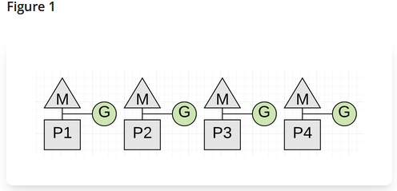

*Перед циклом P выполняют обычные горутины приложения.*

### Подготовка маркировки

Перед запуском конкурентной работы среда выполнения:

1. при необходимости принудительно завершает очистку предыдущего цикла;
2. останавливает P в безопасных точках;
3. включает фазу маркировки и барьер записи;
4. подготавливает задания сканирования стеков, глобальных данных и внутренних
   структур;
5. запускает выполнение программы вместе с рабочими горутинами сборщика.

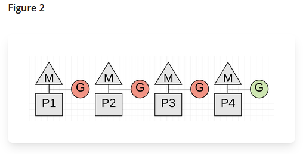

*Долгий вычислительный цикл задерживает переход всех P в остановленное состояние.*

#### Почему безопасная остановка может задержаться

Чтобы начать остановку мира, недостаточно приостановить потоки ОС в произвольный
момент. Сборщик должен получить согласованное состояние программы: понимать, какие
значения в стеках и регистрах являются указателями, и не застать среду выполнения
посередине изменения её внутренних структур. Поэтому каждый выполняющий работу P
должен подтвердить остановку, а запущенная на нём горутина — дойти до места, где её
можно безопасно приостановить.

Раньше вытеснение в основном происходило совместно с самой горутиной: проверка
запроса на остановку выполнялась, например, при входе в функцию. Долгий цикл без
вызовов мог долго не встречать такую проверку, продолжать удерживать P и тем самым
задерживать начало STW для всей программы. Именно эту ситуацию показывает схема.

Современная среда выполнения поддерживает асинхронное вытеснение. Она может
отправить сигнал потоку M, который выполняет горутину, и передать управление коду
остановки, не дожидаясь очередного обычного вызова функции. Однако прервать
исполнение безопасно не в каждой инструкции. Низкоуровневый код среды выполнения,
переходы между стеками и другие участки с временно несогласованным состоянием могут
быть отмечены как непригодные для асинхронного вытеснения. Если сигнал пришёл на
таком участке, остановка откладывается до ближайшего безопасного места.

Следовательно, длительность паузы состоит не только из работы сборщика после
остановки, но и из времени, за которое все P удалось остановить. Асинхронное
вытеснение устраняет типичную задержку из-за вычислительного цикла без вызовов, но
не обещает мгновенную остановку: остаются короткие невытесняемые участки и задержка
доставки сигнала операционной системой.

Стеки не сканируются целиком в самой начальной паузе. Они становятся заданиями
сканирования корней. При обработке конкретного стека соответствующая горутина
останавливается, её указатели отмечаются, после чего она может продолжить работу.

### Конкурентная маркировка

Рабочие горутины сборщика запускаются планировщиком на P. Они сканируют корни, а
затем достижимые объекты. Часть рабочих горутин получает гарантированную долю
процессорного времени, часть использует простаивающие P. Точные доли и режимы —
детали регулятора, а не прикладной договор.

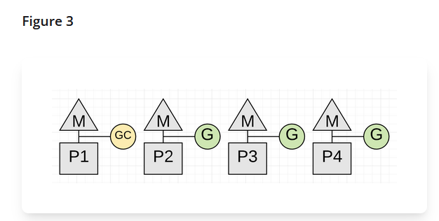

*Один из P занят рабочей горутиной маркировки, остальные продолжают прикладную
работу.*

Горутина, которая быстро выделяет память во время маркировки, накапливает долг
работы. При следующем выделении она может погасить его, сама сканируя объекты. Это
**помощь маркировке (mark assist)**. Механизм создаёт обратное давление, но не гарантирует
удержание процесса в любом лимите и не предотвращает нехватку памяти.

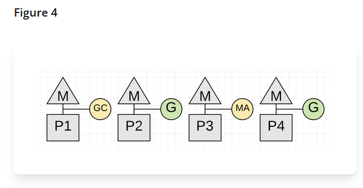

*Помощь маркировке временно отнимает процессорное время у прикладной работы.*

### Завершение маркировки

Когда распределённый алгоритм не находит заданий корней и серых объектов, среда
выполнения ещё раз останавливает мир. Она завершает служебные действия, отключает
рабочих маркировки и помощь при выделениях, готовит очистку и возобновляет программу.

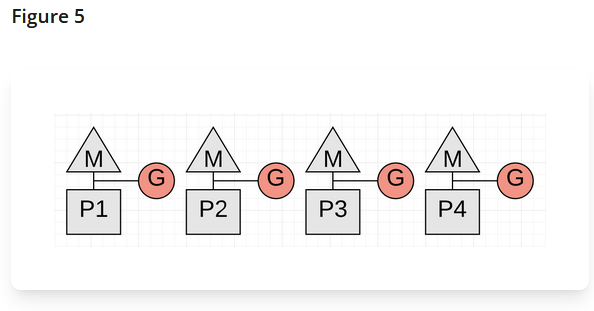

*Вторая пауза завершает маркировку и переводит сборщик к очистке.*

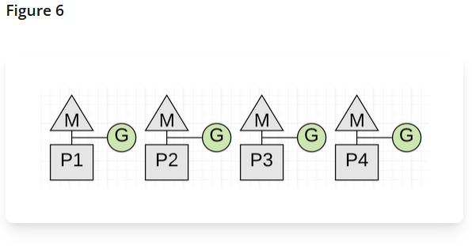

*После паузы все доступные P снова могут выполнять прикладные горутины.*

### Очистка

После маркировки спаны получают состояние «требует очистки». Непомеченные ячейки
становятся свободными тремя путями:

- фоновая горутина очищает спаны по одному;
- аллокатор помогает очистке, прежде чем получить подходящий спан;
- начало следующего цикла принудительно завершает всё, что осталось.

Очистка освобождает место **внутри кучи**. Возврат свободных физических страниц ОС
выполняет другой компонент — **очиститель страниц (scavanger)**.

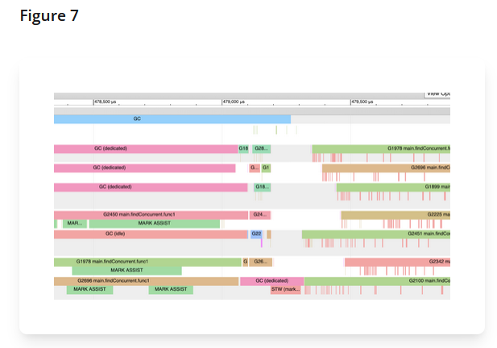

*Трассировка позволяет отличить фоновые рабочие горутины сборщика от помощи
прикладных горутин.*

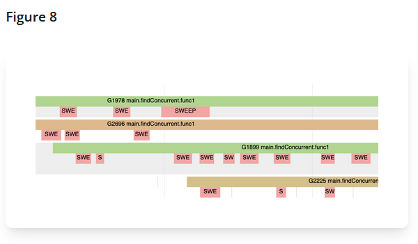

*Аллокатор может очищать спаны на пути выделения памяти.*

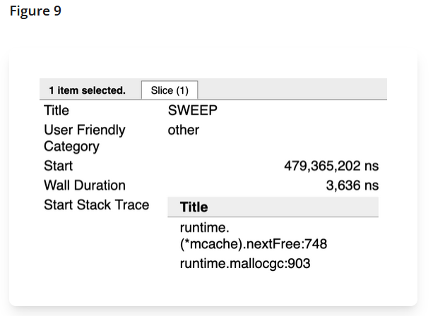

*Внутренние вызовы очистки видны рядом с `runtime.mallocgc`; конкретный стек зависит
от версии Go.*

## Трёхцветная модель

Трёхцветная модель представляет память как граф: объекты — его вершины, а
указатели между ними — рёбра. Сборщик начинает с корней программы и постепенно
обходит этот граф, отделяя уже найденные объекты от тех, до которых ещё не дошёл.
Три цвета обозначают этап обработки каждой вершины.

Цвета — учебная модель состояния обхода, а не отдельное поле `color` в каждом
объекте:

- **белый** — объект ещё не обнаружен в текущем цикле;
- **серый** — объект обнаружен, но его указатели ещё не просканированы;
- **чёрный** — объект обнаружен и его указатели уже обработаны.

Маркировка начинается с корней и заканчивается, когда серой работы не остаётся.
Белые объекты после этого считаются недостижимыми.

<details markdown="1">
<summary>Последовательность трёхцветной маркировки</summary>

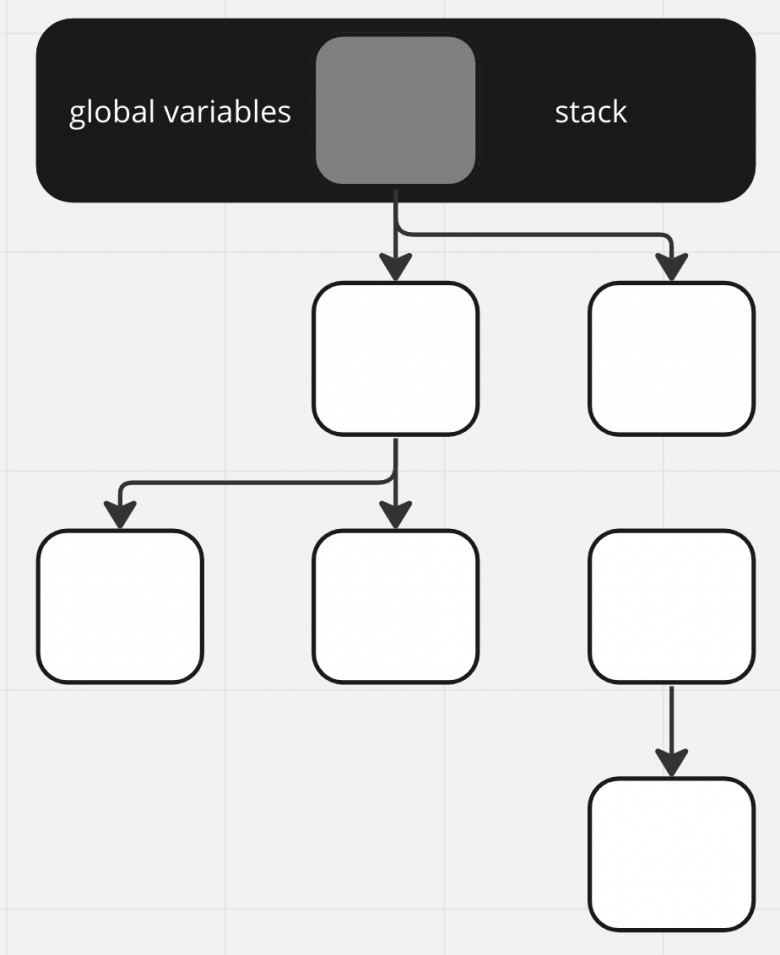

*Все объекты начинают текущий цикл как неотмеченные.*

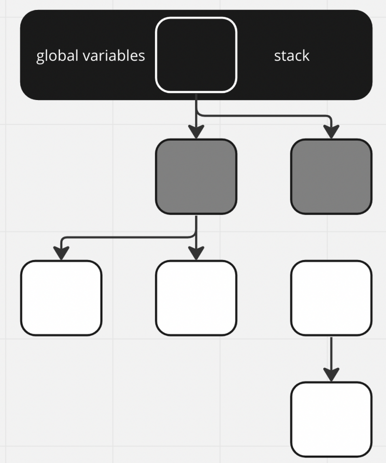

*Объекты, найденные непосредственно из корней, становятся серой работой.*

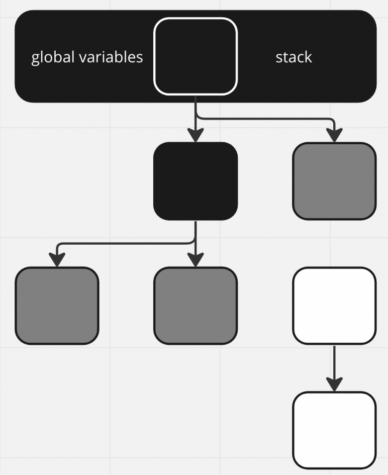

*После сканирования объект становится чёрным, а его белые цели — серыми.*

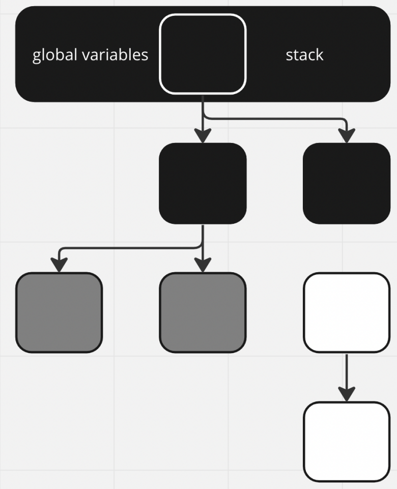

*Обход распространяется по указателям графа.*

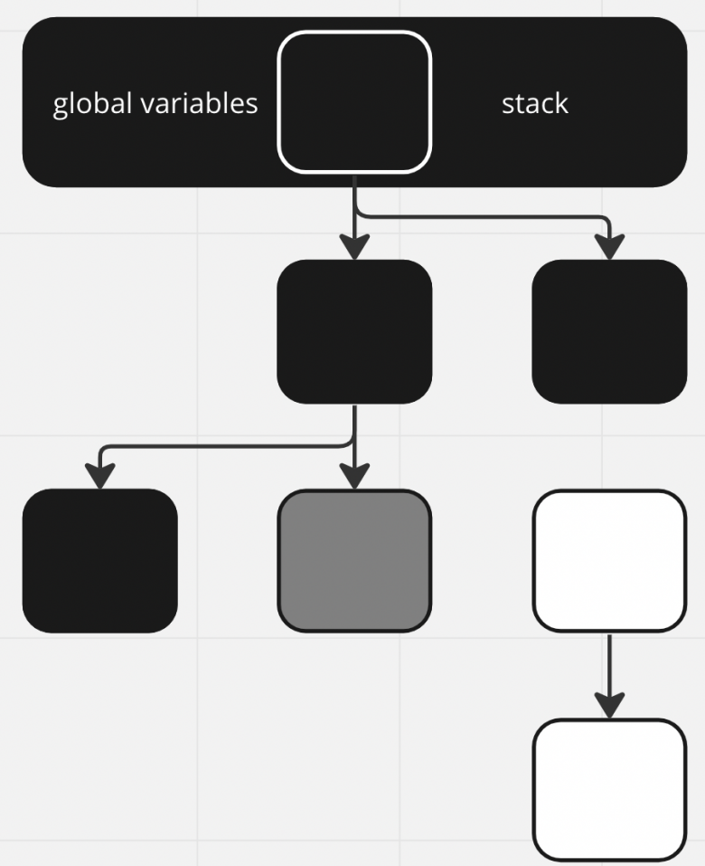

*Каждая серая вершина должна быть просканирована.*

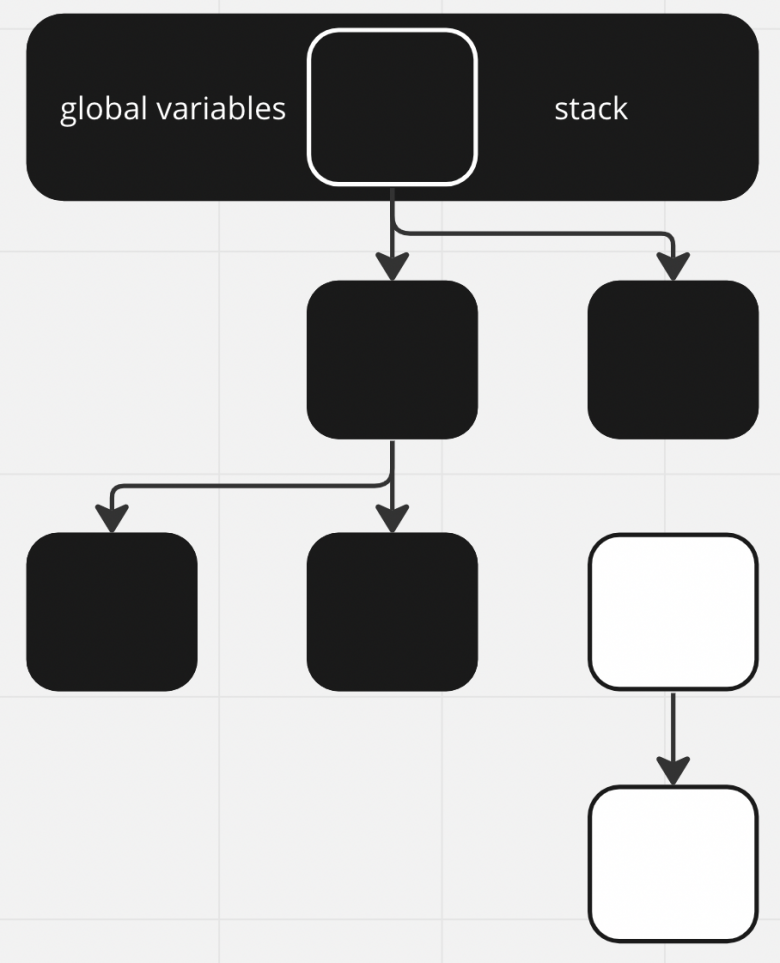

*После исчезновения серой работы оставшиеся белые объекты недостижимы.*

</details>

## Зачем нужен барьер записи

Прикладная программа меняет указатели во время конкурентной маркировки. Без
дополнительных действий она могла бы переместить единственную ссылку так, что
сборщик не увидит всё ещё достижимый объект.

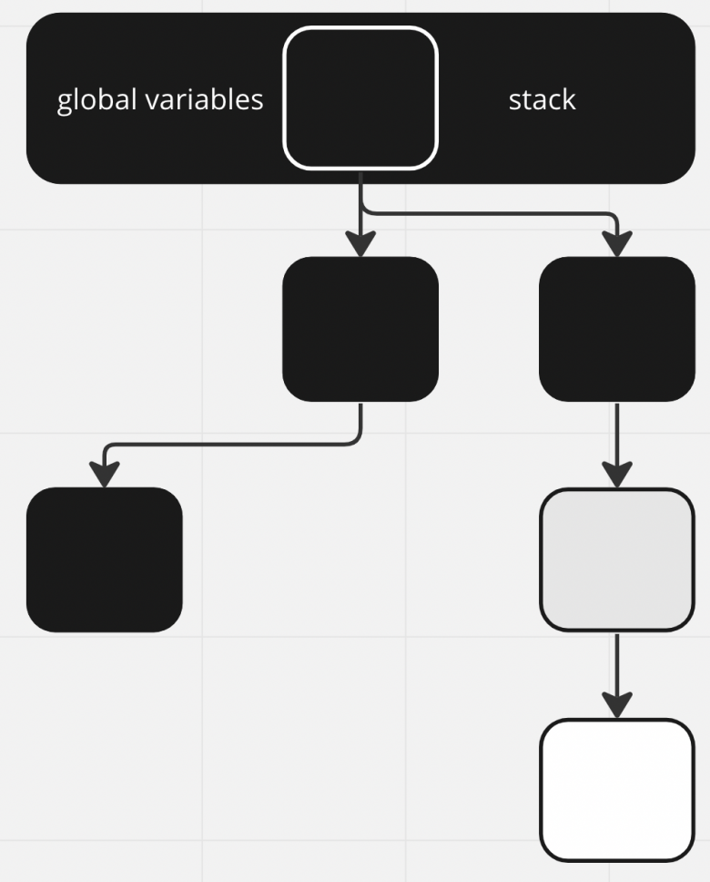

*Промежуточное состояние допустимо, пока среда выполнения сохраняет инварианты
обхода.*

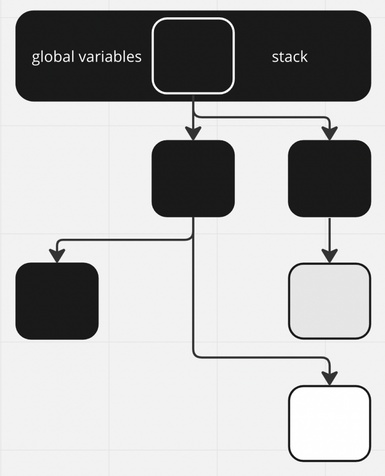

*Без барьера изменение графа может скрыть достижимый объект от маркировки.*

Go использует гибрид барьера удаления Юасы и барьера вставки Дейкстры. Учебный
псевдокод из `runtime/mbarrier.go` выглядит так:

```text
записатьУказатель(ячейка, новый):
    отметить(*ячейка)
    если текущий стек ещё серый:
        отметить(новый)
    *ячейка = новый
```

### Барьер удаления Юасы

Первая операция, `отметить(*ячейка)`, обрабатывает **старый** указатель до его
перезаписи. Представим, что поле объекта в куче содержит единственную видимую
сборщику ссылку на белый объект. Горутина копирует эту ссылку в локальную переменную
на стеке, а поле очищает или заменяет. Записи в стек обычно не сопровождаются
барьером, к тому же стек мог быть уже просканирован. Без дополнительных действий
сборщик потерял бы путь к всё ещё используемому объекту.

Барьер удаления отмечает старый целевой объект в момент разрушения связи. Поэтому
он переживёт текущий цикл, даже если новая ссылка на него временно осталась только
на стеке. Это может сохранить уже недостижимый объект до следующего цикла, но не
позволяет освободить живой объект преждевременно.

### Барьер вставки Дейкстры

Вторая операция, `отметить(новый)`, защищает **новый** указатель. Опасна обратная
ситуация: ссылка на белый объект находится в ещё не просканированном сером стеке.
Горутина переносит её в поле уже чёрного объекта и удаляет исходную локальную
ссылку. Чёрный объект повторно не сканируется, а при последующем сканировании стека
ссылки там уже не будет — белый объект снова окажется скрыт от сборщика.

Барьер вставки отмечает новый целевой объект до публикации ссылки. В классической
формулировке Дейкстры это сохраняет правило «чёрный объект не указывает на белый».
В теоретическом гибридном барьере Go новая ссылка требует отметки, пока текущий стек
остаётся серым: после сканирования стека объекты, на которые он указывал, уже должны
быть обнаружены.

### Как барьеры объединены в Go

Быстрый путь Go 1.27 не проверяет цвет объекта назначения и состояние стека перед
каждой записью. Он помещает старый и новый указатели в принадлежащий текущему P
буфер `wbBuf`. При обработке буфера `nil` и уже отмеченные объекты не создают новой
работы, а белые объекты становятся заданиями маркировки. Безусловная запись двух
указателей добавляет некоторую лишнюю работу, зато избавляет каждую операцию
присваивания от более дорогих проверок.

### Записи в стек

Компилятор обычно не вставляет барьер для записи в текущий кадр стека. Если же
указатель на стековую ячейку передан ниже по цепочке вызовов, компилятор может
сгенерировать барьер, потому что не знает, что адрес относится к стеку. После
сканирования стек считается чёрным; повторное полное сканирование всех стеков в
конце маркировки для этого алгоритма не требуется.

### Буфер барьера

Быстрый путь добавляет указатели в `wbBuf`, принадлежащий текущему P. Когда буфер
заполняется, `wbBufFlush` отмечает накопленные объекты и переносит новую серую работу
в очереди сборщика. Буфер сбрасывается **во время** маркировки по мере заполнения и
при переходах фаз, а не хранится до завершения всего цикла.

## Что важно прикладному разработчику

- Барьер добавляет цену записям указателей только во время маркировки.
- Помощь маркировке связывает скорость выделений с объёмом выполненной работы.
- Очистка при выделении способна увеличить стоимость отдельной аллокации.
- Конкретную причину задержки ищут по метрикам и трассировке, а не по одной схеме.

## Краткий итог

- Цикл сочетает короткие остановки мира с конкурентной маркировкой и очисткой.
- Барьер записи сохраняет корректность графа при одновременном изменении ссылок.
- Помощь маркировке и очистка при выделении связывают работу приложения со сборщиком.

## Продолжение

Примените модель фаз в [диагностической главе](diagnostics.md), а детали Go 1.27.0 сверяйте с [версионным справочником](runtime-reference.md).

## Источники

- [`runtime/mgc.go` Go 1.27.0](https://github.com/golang/go/blob/go1.27.0/src/runtime/mgc.go).
- [`runtime/preempt.go` Go 1.27.0](https://github.com/golang/go/blob/go1.27.0/src/runtime/preempt.go).
- [`runtime/mbarrier.go` Go 1.27.0](https://github.com/golang/go/blob/go1.27.0/src/runtime/mbarrier.go).
- [`runtime/mwbbuf.go` Go 1.27.0](https://github.com/golang/go/blob/go1.27.0/src/runtime/mwbbuf.go).
- [Проект гибридного барьера записи](https://github.com/golang/proposal/blob/master/design/17503-eliminate-rescan.md).
