# Сборщик мусора в Go

Начиная с версии 1.12, язык программирования Go использует **непоколенческий параллельный трехцветный сборщик меток и зачисток (non-generational concurrent tri-color mark and sweep collector)**.

***

## 1. Введение: что такое сборщик мусора и зачем он нужен

Сборщик мусора (Garbage Collector, GC) — компонент среды выполнения Go, который автоматически управляет памятью в куче: находит и освобождает объекты, которые больше не используются программой. Разработчику не нужно вручную вызывать `free()` или `delete` — рантайм делает это сам.

### Ключевые понятия

* **Куча (heap)** — область памяти, из которой выделяются объекты, время жизни которых компилятор не может определить статически.
* **Объект** — значение Go, память под которое выделена в куче. Объекты создаются, когда компилятор не может разместить значение на стеке — например, если значение «убегает» (escapes) из локальной области видимости.
* **Указатель** — число, указывающее на местоположение объекта в памяти; с его помощью программа ссылается на объекты в куче.
* **Достижимость** — объект считается «живым», если до него можно добраться по цепочке указателей от **корней**: стеков горутин, глобальных переменных и регистров.

### Мотивация

Автоматическое управление памятью — одна из ключевых причин выбора Go для серверных и облачных приложений: оно радикально снижает риск утечек памяти и ошибок использования после освобождения (use-after-free). Однако за это приходится платить: нередко приложения на Go тратят 20% и более процессорного времени на сборку мусора.

Общая стоимость GC раскладывается на две составляющие:

$\text{Общая стоимость GC} = \text{Частота запуска} \times \text{Стоимость одного цикла}$

Понимание обеих составляющих — ключ к эффективной работе с GC в production-среде.

> **Зачем это Go-разработчику.** Понимание устройства GC нужно, чтобы: интерпретировать трассировки GC, настраивать GOGC и memory limit под конкретную рабочую нагрузку, находить и устранять избыточные аллокации, а в облачных средах — контролировать реальное потребление памяти (RSS) и, как следствие, стоимость инфраструктуры.

***

## 2. Устройство кучи: спаны, размерные классы и уровни аллокации

Прежде чем разбирать работу GC, необходимо понять, как устроена куча. GC не работает с «абстрактной памятью» — он опирается на конкретную внутреннюю организацию: страницы, спаны, размерные классы и трехуровневую систему аллокации.

### Размерные классы (size classes)

Go группирует объекты по размеру в **размерные классы**. Каждому классу соответствует фиксированный размер блока — например, 8, 16, 24, 32, 48, 64 байт и так далее, вплоть до 32 КБ (порог, за которым объект считается «крупным» и обрабатывается отдельно). Всего в рантайме определено около 67 размерных классов.

Зачем это нужно: если бы каждый объект выделялся точно по запрошенному размеру, куча была бы сильно фрагментирована, а поиск подходящего свободного блока занимал бы слишком много времени. Размерные классы решают обе проблемы — аллокация сводится к взятию первого свободного слота в спане нужного класса.

### Спаны (spans)

**Спан (span)** — основная единица управления памятью в куче. Спан — это непрерывная группа страниц (как правило, по 8 КБ каждая), выделенная под объекты одного размерного класса. Размер спана зависит от класса: для мелких объектов спан может занимать 1 страницу (8 КБ), для более крупных — несколько страниц.

Каждый спан содержит:

* Заголовок с метаданными: размерный класс, состояние (free/used/scavenged), битовые карты аллокаций и маркировки.
* Непосредственно память под объекты — нарезанную на слоты фиксированного размера.

Спан — это та единица, с которой оперирует sweep-фаза и scavenger.

### Трехуровневая структура аллокации

Выделение памяти в куче проходит через три уровня, от быстрого к медленному:

| Уровень | Структура  | Привязка                                   | Блокировки                   |
| ------- | ---------- | ------------------------------------------ | ---------------------------- |
| 1       | `mcache`   | Per-P (на каждый логический процессор)     | Нет                          |
| 2       | `mcentral` | Per-size-class (на каждый размерный класс) | Есть (mutex)                 |
| 3       | `mheap`    | Глобальная куча (одна на программу)        | Есть (глобальная блокировка) |

**mcache** — локальный кэш, привязанный к P (логическому процессору). Когда горутина выполняет `new` или `make`, аллокация сначала пытается взять свободный слот из mcache. Это быстрый путь, не требующий блокировок, потому что в каждый момент P выполняет только одну горутину.

**mcentral** — следующий уровень. Если mcache исчерпан, он пополняется из mcentral для соответствующего размерного класса. На этом уровне уже используется мьютекс, так как несколько P могут одновременно запрашивать спаны одного класса.

**mheap** — глобальная куча. Если mcentral пуст, запрос уходит в mheap, который выделяет новый спан из свободной памяти или запрашивает её у операционной системы. Здесь используется глобальная блокировка, поэтому аллокации с этого уровня самые дорогие.

### Как аллокация связана со sweep

Когда mcache исчерпан и запрашивает новый спан у mcentral, mcentral сначала пытается найти уже освобождённый (но ещё не возвращённый ОС) спан. При этом он запускает **sweep** — очистку одного или нескольких спанов от мёртвых объектов. Таким образом, sweep выполняется «лениво»: не в отдельной фазе, а распределённо, по мере необходимости при новых аллокациях.

### Крупные объекты (large objects)

Объекты размером более 32 КБ выделяются напрямую из mheap, минуя mcache и mcentral. Каждый такой объект получает собственный спан, состоящий из нужного количества страниц.

> **Зачем это Go-разработчику.** Понимание трехуровневой структуры объясняет, почему аллокации мелких объектов «почти бесплатны» (попадают в mcache), а крупные — ощутимо дороже. Также это фундамент для понимания sweep-фазы и работы scavenger: оба оперируют спанами, а не отдельными объектами.

***

## 3. Поведение сборщика мусора: фазы и их влияние

При запуске сбора мусора сборщик проходит **три этапа**. Два из них создают задержки типа **«Stop-The-World» (STW)**, а третий создает задержки, замедляющие производительность приложения:

* **Настройка маркировки (Mark Setup)** — STW
* **Маркировка (Marking)** — Параллельная (Concurrent)
* **Завершение маркировки (Mark Termination)** — STW

После завершения этих трёх фаз выполняется **очистка (Sweeping)** — параллельно, без STW.

### Настройка маркировки — STW

При запуске сборки мусора первым делом необходимо включить **барьер записи (write barrier)**. Барьер записи позволяет сборщику поддерживать целостность данных в куче во время сборки, поскольку горутины сборщика и приложения будут выполняться одновременно. Чтобы включить барьер записи, необходимо остановить все работающие горутины приложения. Обычно это происходит очень быстро, в среднем за 10–30 микросекунд — при условии, что горутины приложения работают корректно.

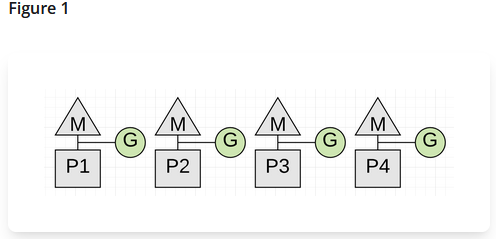

На рисунке 1 показаны четыре горутины приложения, запущенные перед началом сборки мусора. P — это тред ОС, M — машины планировщика, G — горутины.

Каждая из этих четырёх горутин должна быть остановлена. Единственный способ сделать это — чтобы сборщик мусора наблюдал и ждал, пока каждая горутина выполнит вызов функции. Вызовы функций гарантируют, что горутины находятся в безопасной точке для остановки. Что произойдет, если одна из этих горутин не выполнит вызов функции, а остальные выполнят?

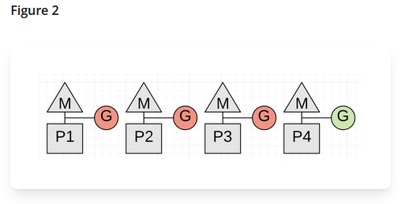

На рисунке 2 показана реальная проблема. Сборка мусора не может начаться, пока горутина, работающая на P4, не будет остановлена, а это невозможно, поскольку она находится в замкнутом цикле, выполняя некоторые математические операции.

В листинге 1 показан код, выполняемый горутиной, работающей на P4:

```go
func tightLoop() {
    data := make([]int, 1_000_000)
    for i := 0; i < len(data); i++ {
        data[i] = data[i] * data[i]
    }
}

```

В зависимости от размера среза, горутина может выполняться неоправданно долго без возможности остановки. Такой код может затормозить запуск сборки мусора. Хуже того, другие P не могут обслуживать другие горутины, пока сборщик мусора ждёт. Крайне важно, чтобы горутины вызывали функции в разумные сроки.

В новых версиях Go начиная с **1.14** это исправлено благодаря введению механизма упреждения: **sysmon** останавливает горутину с помощью системного сигнала, если она выполняется дольше **10 мс**.

> **Зачем это Go-разработчику.** Избегайте тесных циклов без вызова функций (например, чистые арифметические циклы по огромным срезам). В Go 1.14+ sysmon страхует от зависания STW, но полагаться только на него не стоит — лучше добавлять периодические вызовы (даже пустые) в длительные вычислительные циклы. Это критично лишь для вычислительных ядер (криптография, ML-инференс, движки); в обычных сервисах вызовов и так хватает, и без проблем в профилировщике код трогать не нужно.

### Маркировка — Параллельная

После включения барьера записи сборщик переходит к фазе маркировки. Первым делом сборщик забирает себе **25%** доступной мощности процессора. Сборщик использует горутины для выполнения работы и те же P и M, что и горутины приложения. Это означает, что в четырехпоточной программе на Go один P будет выделен для работы по сбору данных.

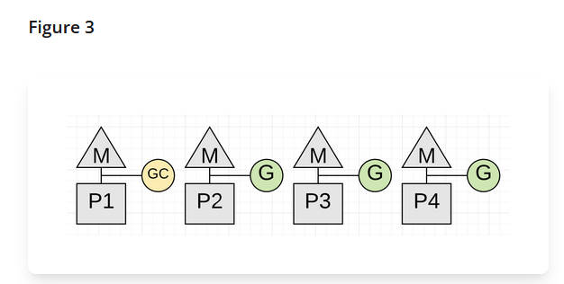

На рисунке 3 показано, как сборщик мусора захватил P1 во время сборки. Теперь сборщик мусора может начать фазу маркировки. Фаза маркировки заключается в маркировке значений в куче, которые всё ещё используются. Эта работа начинается с проверки стеков всех существующих горутин для поиска корневых указателей на память в куче. Затем сборщик мусора должен пройти по графу кучи, начиная с этих корневых указателей. Пока маркировка выполняется на P1, работа приложения может продолжаться параллельно на P2, P3 и P4. Это означает, что влияние сборщика мусора сведено к 25% от текущей мощности процессора.

Хотелось бы, чтобы это был конец истории, но это не так. Что, если горутина, выделенная для сборки мусора на P1, не завершит работу по маркировке до того, как объём используемой кучи достигнет своего предела? Что, если только одна из трёх горутин приложения является причиной того, что сборщик не завершит работу вовремя? В этом случае необходимо замедлить выделение памяти, в том числе и из этой горутины.

Если сборщик решает, что ему необходимо замедлить выделение памяти, он задействует горутины приложения для помощи в работе по маркировке. Это называется **Mark Assist**. Время, в течение которого горутина приложения находится в Mark Assist, пропорционально объему данных, добавляемых ею в динамическую память. Одним из положительных эффектов Mark Assist является ускорение процесса сборки.

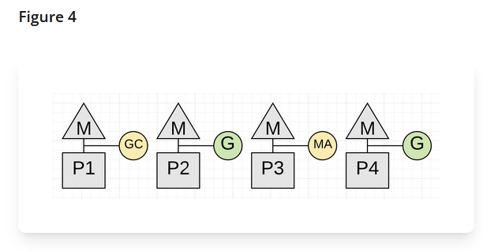

На рисунке 4 показано, как горутина приложения, работающая на P3, теперь выполняет Mark Assist и помогает в сборе мусора. Приложения с большим объёмом памяти могут заметить, что большинство запущенных горутин выполняют небольшие объёмы Mark Assist во время сбора мусора.

Одна из целей сборщика мусора — исключить необходимость в Mark Assist. Если в ходе какой-либо сборки мусора потребуется много Mark Assist, сборщик может начать следующую сборку раньше. Это делается для того, чтобы уменьшить объём Mark Assist, необходимый для следующей сборки.

> **Зачем это Go-разработчику.** Если вы видите в профилях много времени в Mark Assist, это сигнал: приложение выделяет память быстрее, чем GC успевает её разметить. Решение — не повышать GOGC, а снижать темп аллокаций.

### Завершение маркировки — STW

После завершения маркировки наступает фаза завершения маркировки. В ходе неё отключается барьер записи, выполняются различные задачи очистки и рассчитывается следующая цель сбора данных. Горутины, зацикливающиеся во время фазы маркировки, также могут привести к увеличению задержек STW для завершения маркировки.

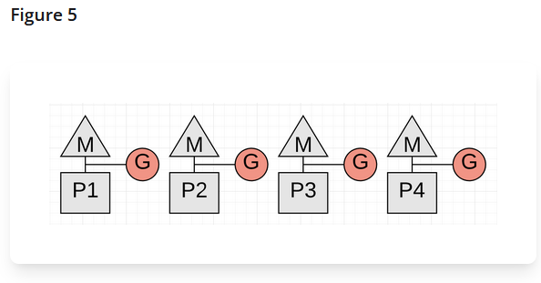

На рисунке 5 показано, как все горутины останавливаются во время фазы завершения маркировки. Эта операция обычно занимает в среднем от 60 до 90 микросекунд. Эту фазу можно было бы выполнить без STW, но с использованием STW код упрощается, и дополнительная сложность не оправдывает небольшого выигрыша.

После завершения сбора каждый P может быть снова использован горутинами приложения, и приложение вернется к полной работоспособности.

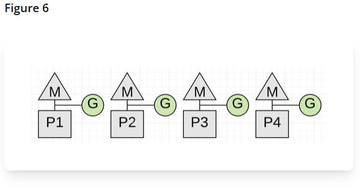

На рисунке 6 показано, как все доступные P снова обрабатывают работу приложения после завершения сбора данных. Приложение снова работает в полную силу, как и до начала сбора данных.

### Очистка (Sweeping) — параллельная

После завершения сборки мусора происходит ещё одно действие, называемое **очисткой (Sweeping)**. Очистка — это процесс освобождения памяти, связанной со значениями в куче, которые не были помечены как используемые. Это действие происходит, когда горутины приложения пытаются выделить новые значения в куче. Задержка очистки добавляется к стоимости выделения памяти в куче и не связана с задержками, связанными со сборкой мусора.

Ниже приведен пример трассировки на компьютере, где для выполнения горутин доступно 12 аппаратных потоков.

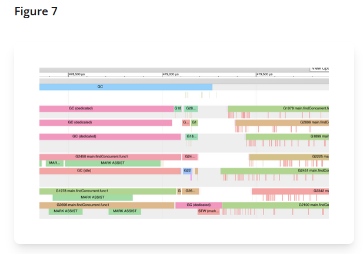

На рисунке 7 показан частичный снимок трассировки. Видно, что во время этого сбора (сохраняйте вид в пределах синей линии GC вверху) три из двенадцати P выделены для GC. Видно, что в это время горутины 2450, 1978 и 2696 выполняют Mark Assist, а не прикладную работу. В самом конце сбора только один P выделен для GC и в конечном итоге выполняет работу STW (Mark Termination).

После завершения сбора данных приложение снова работает на полную мощность. За исключением того, что под горутинами видны розовые линии.

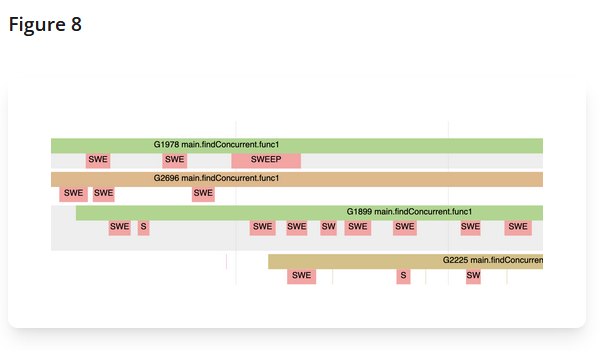

На рисунке 8 показано, как розовые линии отображают моменты, когда горутина выполняет очистку, а не прикладную задачу. В эти моменты горутина пытается выделить новые значения в динамической памяти.

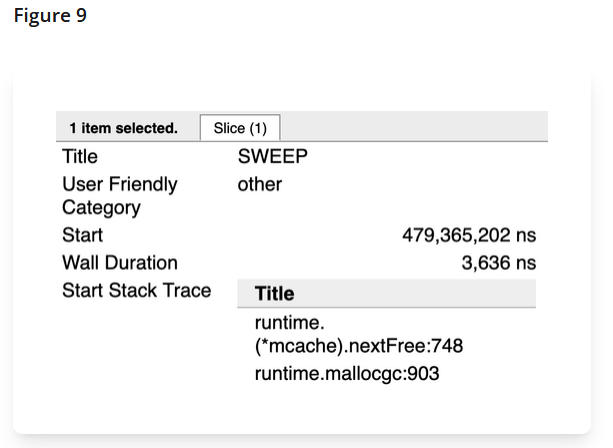

На рисунке 9 показан конец трассировки стека для одной из горутин в действии Sweep. Вызов `runtime.mallocgc` — это вызов для выделения нового значения в динамической памяти. Вызов `runtime.(*mcache).nextFree` инициирует действие Sweep. Как только в динамической памяти больше не останется выделенной памяти для освобождения, вызов nextFree больше не будет виден.

> **Зачем это Go-разработчику.** Sweep выполняется «лениво» — при новых аллокациях. Поэтому первая аллокация после GC может быть немного медленнее обычной. Это также объясняет, почему после сборки мусора `runtime.MemStats.HeapReleased` может не сразу обновиться — scavenger ещё не вернул память ОС.

***

## 4. Алгоритмические основы

### Mark & Sweep: базовая идея

**Mark and Sweep** — классический алгоритм сборки мусора. Он или его модификации работают в Java, Python, Lua и других языках. Его работа состоит из двух фаз:

* **Mark**: находим и отмечаем все достижимые объекты из набора (например, в куче).
* **Sweep**: проходим по всем объектам в куче, удаляем недостижимые и возвращаем их в пул свободной памяти.

Чтобы операция прошла корректно, программа должна быть приостановлена во время стадии разметки (Mark). Такая пауза в выполнении называется **Stop The World (STW)**. STW — очевидное зло с точки зрения перформанса приложений. Любой язык с механизмом сборки мусора стремится сократить его влияние до минимума.

### Трехцветная маркировка

Популярное решение для уменьшения STW — **алгоритм трехцветной маркировки (Three-color Marker Algorithm)**. Этот подход работает и в Go: все объекты в стадии разметки красятся в чёрный, серый или белый цвет:

* **Белый** — потенциальный мусор, ещё не затронутые алгоритмом объекты.
* **Серый** — объекты «на рассмотрении»: достижимы, но их исходящие указатели ещё не проверены.
* **Чёрный** — активные объекты: достижимы и все исходящие указатели проверены.

Изначально все объекты в куче и на стеке окрашены в белый. Алгоритм можно представить циклом из нескольких шагов:

* Покрасить все корневые объекты (стек и глобальные переменные) в серый.
* Выбрать серый объект из набора серых объектов и пометить его как чёрный.
* Все объекты, на которые указывает чёрный объект, пометить серым. Это гарантирует, что сам объект и объекты, на которые он ссылается, не будут выброшены в мусор.
* Если в графе остались серые объекты — вернуться к шагу 2.

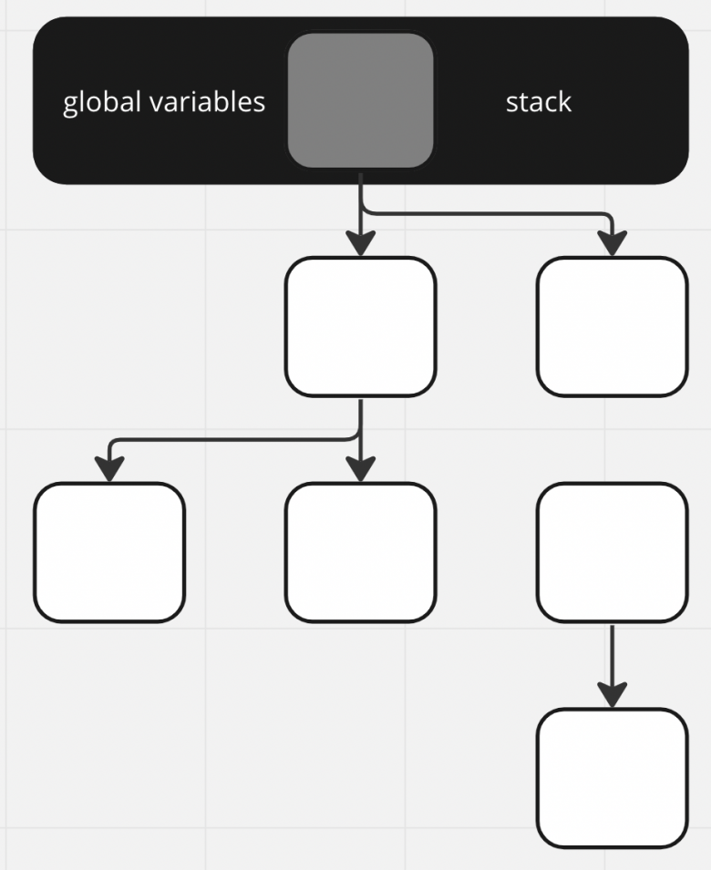

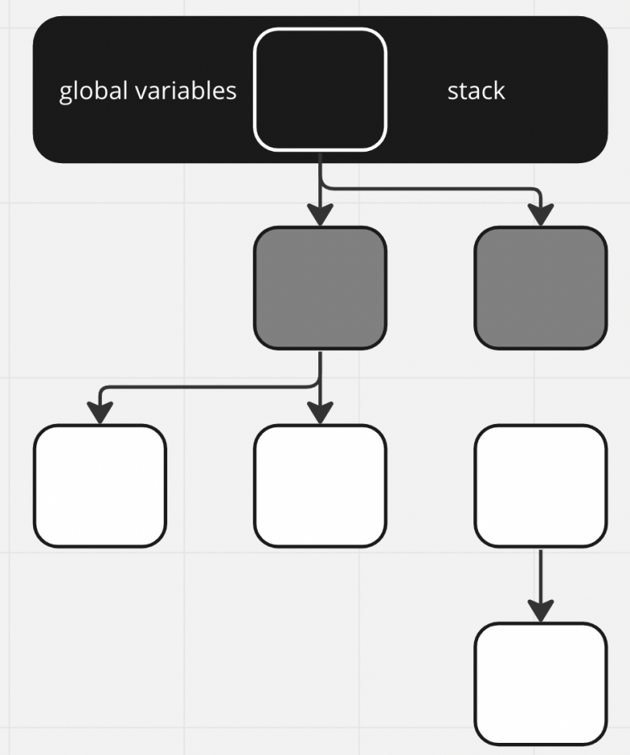

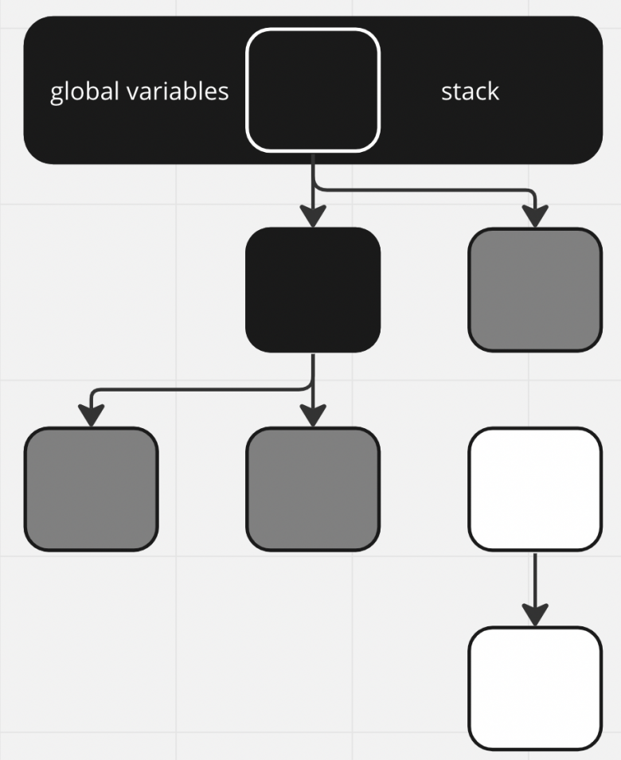

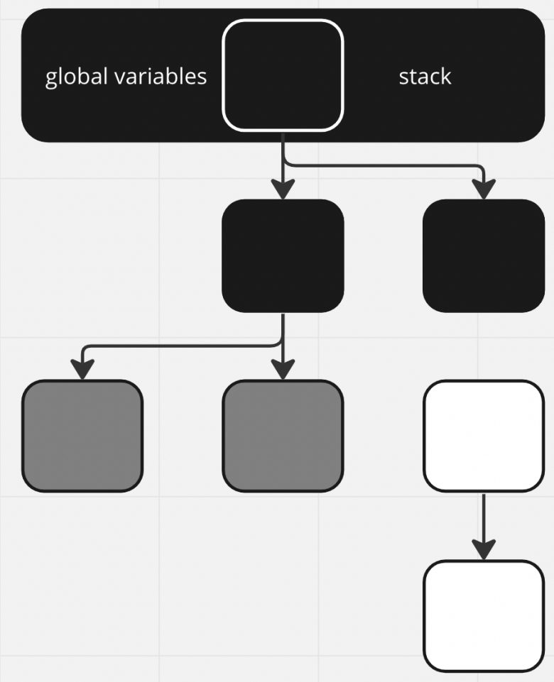

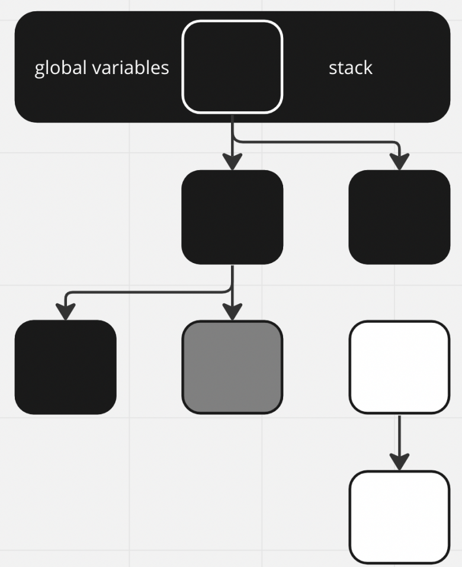

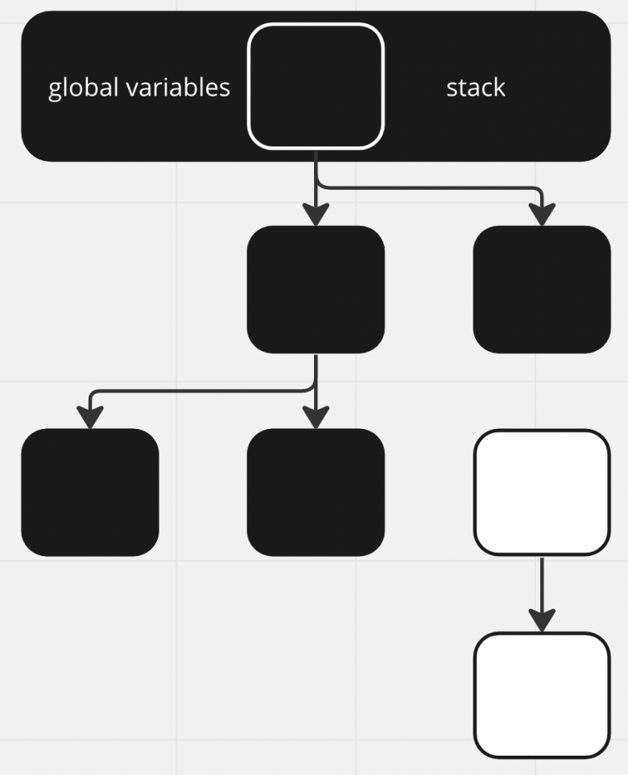

Серые объекты кончились, но белые остались — это мусор. Теперь эти участки при необходимости могут быть перезаписаны.

### Проблема итерационной маркировки

Чтобы сборщик мусора работал корректно, мы обязаны делать STW и за один заход проходиться сразу по всем объектам в памяти программы. А вот что будет, если попробовать красить итерационно.

Сейчас граф объектов окрашен таким образом:

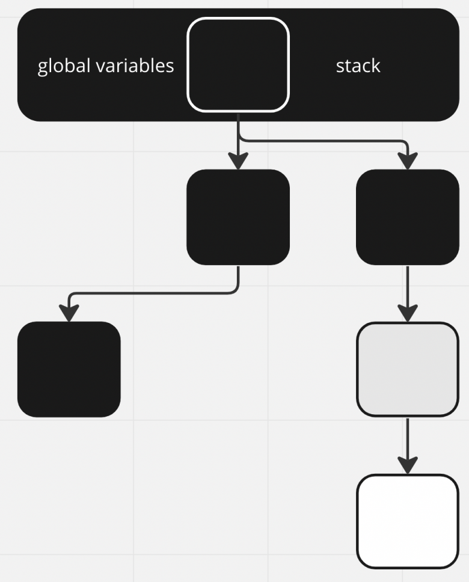

Представим, что в процессе окраски мы создали связь между белым объектом и уже окрашенным в чёрный. При этом у белого объекта больше нет связей с серыми. Тогда алгоритм покраски его не затронет, и в итоге он будет отмечен как мусор. Это фатальная ошибка для любого приложения.

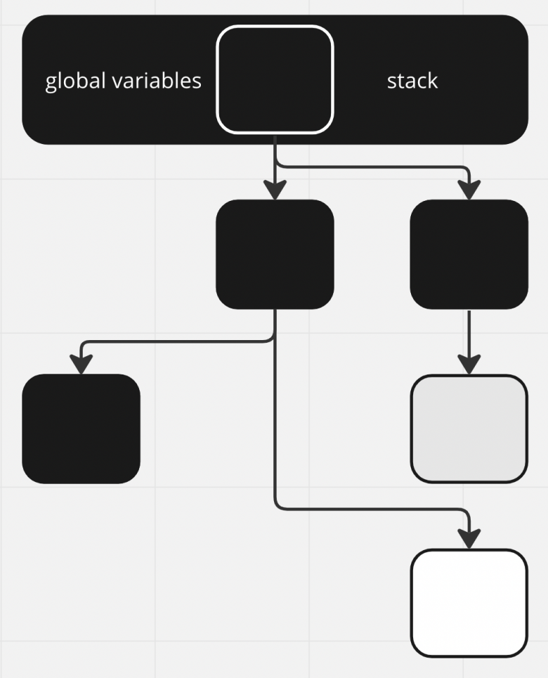

В текущей реализации стадия покраски требует STW. Этот период в ранних версиях Go достигал сотен миллисекунд — довольно значительное время. От этого хочется избавиться.

Решение: научиться собирать мусор пошагово, маленькими кусочками — то есть амортизировать алгоритм. Тогда не придётся останавливать выполнение программы на длительный период времени. Сборщик мусора с таким алгоритмом называется **Incremental Garbage Collector**.

### Барьер записи (write barrier)

**Барьер записи (write barrier)** — это фрагмент кода, который выполняется при каждой операции записи указателя в кучу. Он нужен для поддержки инвариантов, гарантирующих корректное пошаговое выполнение алгоритма.

#### Dijkstra insertion write barrier (до Go 1.8)

До версии Go 1.8 использовали **Dijkstra insertion write barrier**:

```

func writePointer(slot, ptr):
    shade(ptr)   // затемняем новый объект (белый → серый)
    *slot = ptr  // записываем ссылку

```

* **slot** — место назначения (например, переменная) в коде Go.
* **ptr** — значение, которое помещается в слот.
* **shade** — превращает белые объекты в серые, серые и чёрные оставляет нетронутыми.
* **insertion** в названии говорит о том, что триггером для вызова служит создание связи между объектами.

Таким образом, при записи x = y объект y всегда после этой операции становится серым. Это поддерживает ключевой инвариант: **чёрные объекты указывают только на серые или другие чёрные объекты, но никогда на белые.** На практике это означает, что если чёрный объект приобретает ссылку на белый, барьер немедленно затемняет этот белый объект (делает его серым), не давая чёрному указателю «увидеть» белый.

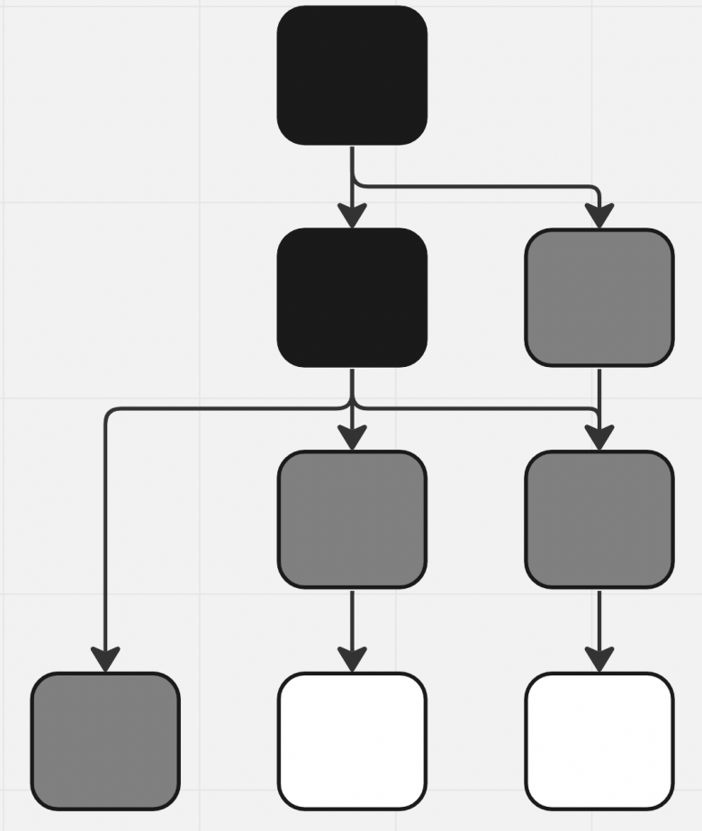

Есть подвох. Для объектов на стеке вместо включения барьера записи был выбран другой подход. Их автоматом считали серыми, чтобы не нести потери в перформансе. Но без барьера записи нет гарантии, что мы не прикрепим белый объект к чёрному на стеке.

Чтобы этого избежать, на каждом шаге покраски стек заново красится в серый после выполнения программы. По всем объектам заново пройдется сборщик мусора. Если обнаружится новая связь с белым объектом, он также будет перекрашен в серый.

Для приложений с большим количеством горутин этот период может достигать 100 мс. Но считается, что этот подход оптимальнее использования барьера записи на стеке.

#### Yuasa deletion write barrier

Начиная с Go 1.8 придумали совместить Dijkstra insertion write barrier и **Yuasa deletion write barrier**. Deletion в названии означает, что триггером для вызова служит удаление связи между объектами:

```

func writePointer(slot, ptr):
    shade(*slot)   // затемняем старый объект, на который указывал слот
    *slot = ptr    // перезаписываем ссылку

```

Рассмотрим тот же пример, который приводился перед вводом барьера записи:

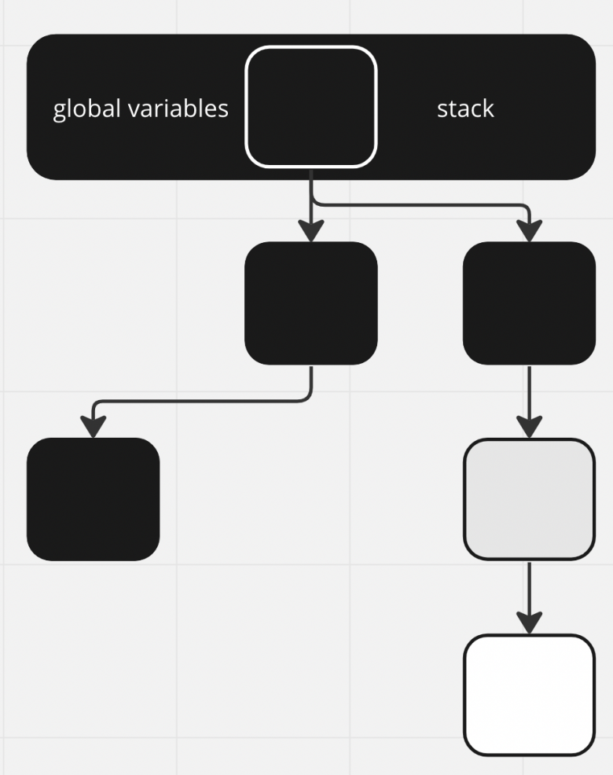

Создание связи между объектами не триггерит Yuasa write barrier:

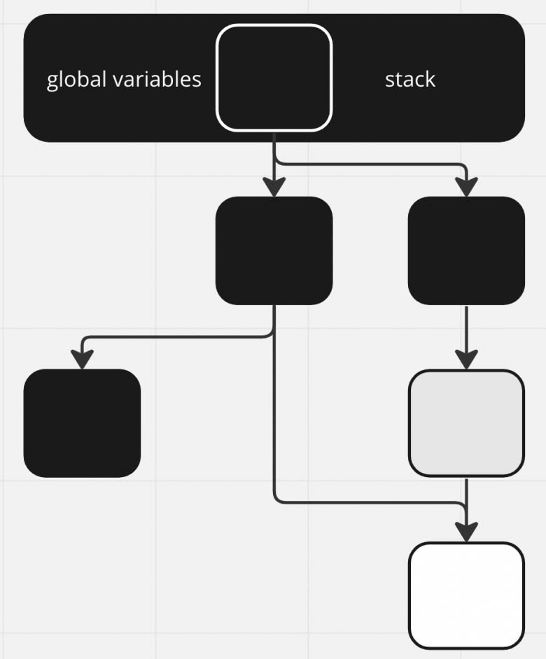

А вот удаление связей триггерит:

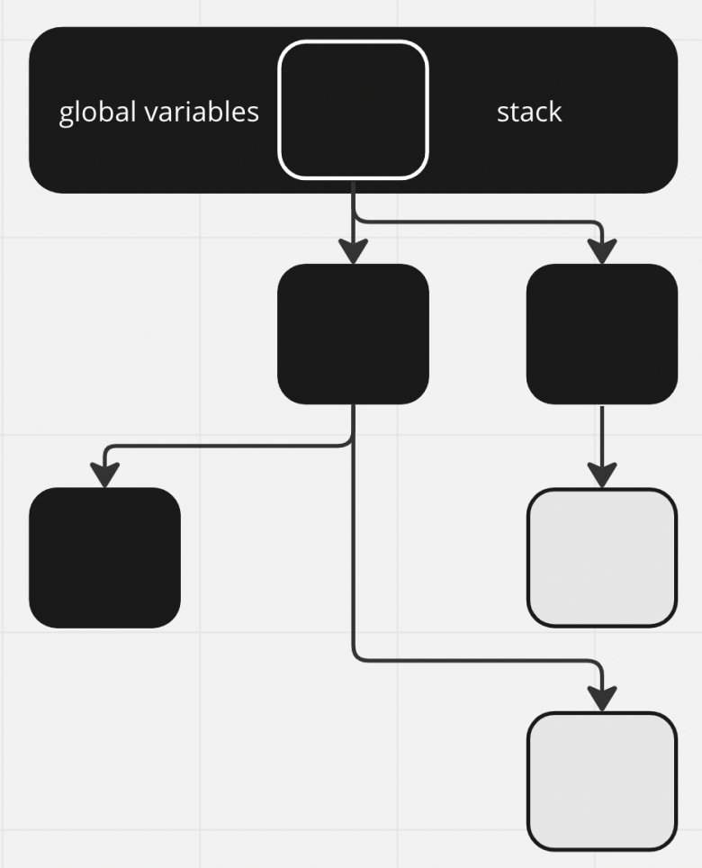

В отличие от insertion барьера, который затемняет новый объект, deletion барьер затемняет старый объект перед тем, как ссылка на него будет удалена. Это необходимо, потому что удаляемая ссылка может вести из чёрного объекта на белый. Если чёрный объект перестанет указывать на белый, а других ссылок на этот белый объект нет, сборщик может ошибочно решить, что белый объект недостижим, и удалить его. Затемняя старый объект, мы превращаем его из белого в серый, давая GC шанс его корректно просканировать.

Благодаря такому подходу Yuasa write barrier даёт инвариант: **у любого белого объекта, на который указывает чёрный объект, должен быть достижимый путь до серого объекта**. Это гарантирует, что ни один белый объект не останется «незамеченным» сборщиком, даже если последняя ссылка на него была удалена из чёрного объекта.

#### Hybrid write barrier (Go 1.8+)

Начиная с Go 1.8 придумали совместить Dijkstra insertion write barrier и Yuasa deletion write barrier. Из двух барьеров получается гибридный барьер:

```

func writePointer(slot, ptr):
    shade(*slot)          // deletion: затемняем старый объект
    if current stack is grey:
        shade(ptr)        // insertion: затемняем новый объект (только если стек ещё серый)
    *slot = ptr

```

Deletion в первой строке затемняет старый объект перед удалением ссылки — это необходимо, потому что удаляемая ссылка может вести из чёрного объекта на белый. Если чёрный объект перестанет указывать на белый, а других ссылок нет, белый объект будет ошибочно удалён. Затемнение старого объекта превращает его из белого в серый, спасая от преждевременной сборки.

Insertion в условной строке затемняет новый объект, но только если стек текущей горутины ещё не просканирован (серый). Это защищает от ситуации, когда чёрный стек получает ссылку на белый объект. Как только стек становится чёрным (отсканированным), insertion часть барьера отключается.

Благодаря такому подходу гибридный барьер гарантирует два инварианта:

* **Чёрные объекты не указывают на белые (инвариант Дейкстры, даёт insertion).**
* **У любого белого объекта, на который указывает чёрный объект, есть достижимый путь до серого (инвариант Юаса, даёт deletion).**

Главное преимущество: не нужно повторное сканирование стеков. После того, как стек был отсканирован и затемнён, он остаётся чёрным. Все новые объекты, создаваемые в процессе работы алгоритма, сразу помечаются чёрными, чтобы точно их не потерять.

### Механика работы барьера записи

Механика работы барьера записи — это не абстрактная идея, а конкретный код, который компилятор вставляет в скомпилированную программу. На этапе компиляции, когда используется представление SSA (Static Single Assignment), компилятор видит операцию записи указателя в кучу (например, \*ptr = value) и не генерирует для неё простой MOV. Вместо этого он вставляет вызов барьерной функции. При этом компилятор различает записи в стек (локальные переменные) и записи в кучу, добавляя барьер только для операций с кучей.

На уровне ассемблера вызов барьера разворачивается в несколько инструкций. Сначала проверяется фаза работы сборщика мусора и то, включён ли сам барьер. Если барьер активен, указатель сохраняется в специальный буфер `gcWriteBarrierBuffer`. При этом основная операция записи выполняется в любом случае, независимо от состояния барьера.

Указатели не обрабатываются немедленно, а накапливаются в буфере, который привязан к каждому P (per-P буфер). Его опустошение происходит централизованно на фазе заврешения маркировки (mark termination), когда мир остановлен (STW). Это позволяет дополнительно амортизировать накладные расходы за счёт отложенной пакетной обработки.

Барьер не требуется для записей в стек, потому что каждая горутина монопольно владеет своим стеком. Между стеком конкретной горутины и процессом маркировки GC не возникает гонки данных — сборщик в любом случае сканирует стек целиком при старте фазы маркировки. Поэтому вставка барьера на операции со стеком стала бы чистым оверхедом, не приносящим практической пользы.

### Проблема короткоживущих объектов

Гибридный барьер имеет побочный эффект: все объекты, созданные во время работы GC, помечаются чёрными. Это может быть проблемой для приложений, создающих много короткоживущих объектов — все они гарантированно доживут до следующего цикла GC, даже если стали мусором через микросекунду после создания. Это одна из причин, почему в Go до сих пор нет **generational GC** — задача разделения объектов по поколениям в присутствии гибридного барьера нетривиальна.

> **Зачем это Go-разработчику.** Если ваше приложение создаёт много короткоживущих объектов (например, временные срезы и мапы в горячих циклах), они все доживают до следующего GC, раздувая кучу. Решение — переиспользовать объекты через `sync.Pool` или минимизировать аллокации в горячих путях.

> Примечание автора: **Поколенческий (generational) GC** — сборщик мусора, который делит кучу на поколения (обычно молодое и старшее), исходя из гипотезы, что большинство объектов умирают молодыми. Молодое поколение собирается часто и быстро, старшее — реже, что снижает общие накладные расходы. **Непоколенческий (non-generational) GC** — сборщик, обрабатывающий всю кучу как единое пространство без разделения на поколения. Каждая сборка вынуждена просматривать все объекты, что проще в реализации, но потенциально дороже при большом количестве короткоживущих объектов.

***

## 5. GC Percentage и темп сборки

### GC Percentage

В среде выполнения есть параметр конфигурации **GC Percentage** (процент сборки мусора), который по умолчанию равен 100. Это значение представляет собой отношение объёма новой памяти кучи, который может быть выделен до начала следующей сборки мусора. Установка процента сборки мусора равным 100 означает: следующая сборка должна начаться не позднее, чем в куче будет выделено 100% новых данных относительно объёма живых данных после предыдущей сборки.

Формула:

$\text{Порог GC} = \text{Heap после GC} \times (1 + \frac{\text{GOGC}}{100})$

В качестве примера представьте, что сборка завершается с использованием 2 МБ динамической памяти.

Примечание: диаграммы динамической памяти здесь не отражают истинного профиля при использовании Go. Динамическая память в Go часто фрагментирована и неорганизована, и нет такого четкого разделения, как показано на изображениях. Эти диаграммы позволяют визуализировать динамическую память более простым и понятным способом, точно отражающим реальное поведение системы.

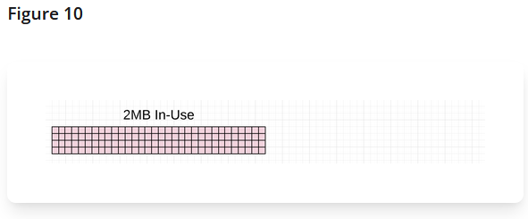

На рисунке 10 показано, что после завершения последней сборки памяти используется 2 МБ динамической памяти. Поскольку процент сборки мусора установлен на 100%, следующая сборка должна начаться до добавления ещё 2 МБ динамической памяти.

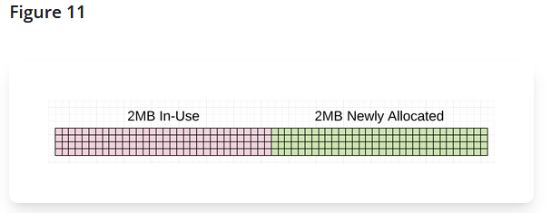

На рисунке 11 показано, что теперь используется ещё 2 МБ динамической памяти. Это запустит сборку мусора. Чтобы увидеть всё это в действии, можно создать трассировку GC для каждой выполняемой сборки мусора.

### Алгоритм темпа (Pacing)

Сборщик использует **алгоритм темпа (pacing)**, который определяет время начала сборки. Алгоритм основан на цикле обратной связи: сборщик собирает информацию о работающем приложении и нагрузке, которую оно оказывает на кучу. **Нагрузка** — это скорость, с которой приложение выделяет память в куче за заданный промежуток времени. Именно нагрузка определяет необходимый темп работы сборщика.

Перед началом сбора мусора сборщик вычисляет предполагаемое время, необходимое для завершения сбора. После запуска сбора мусора в работающем приложении возникают задержки, которые замедляют его работу. Каждая сборка мусора увеличивает общую задержку приложения.

Распространённое заблуждение — считать, что если заставить сборщик мусора работать реже, то производительность автоматически вырастет. Логика кажется простой: чем позже запускается сборка мусора, тем реже возникают паузы. Но на практике это не так.

В Go можно увеличить параметр GOGC (например, установить значение больше 100). Это позволяет программе использовать больше памяти перед запуском следующей сборки мусора. В результате сборщик действительно будет запускаться реже.

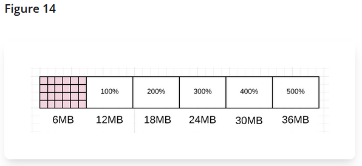

Однако важно понимать: это не «оптимизация», а просто обмен одного ресурса на другой. Вы уменьшаете частоту работы GC, но при этом увеличиваете потребление памяти. Сам сборщик при этом не становится эффективнее.

Попытка напрямую замедлить работу сборщика мусора — не лучший подход. Гораздо правильнее уменьшать нагрузку на него. Это достигается за счёт:

* снижения количества выделений памяти;
* уменьшения объёма данных, которые выделяются.

Чем меньше аллокаций делает программа, тем меньше работы у сборщика мусора — и тем реже он будет запускаться естественным образом.

Основная цель — выполнять как можно больше полезной работы между запусками GC, не раздувая при этом объём используемой памяти.

Важно: нужно стремиться к балансу — достаточной производительности при минимально возможном объёме кучи. Это особенно критично в облачных средах, где использование памяти напрямую влияет на стоимость и эффективность системы.

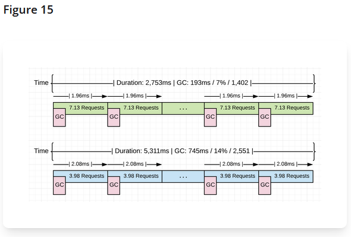

На изображении 15 представлена некоторая статистика работающего приложения на Go. Версия, выделенная синим цветом, показывает статистику приложения без оптимизации при обработке 10 тысяч запросов. Версия, выделенная зеленым цветом, показывает статистику после обнаружения и удаления из приложения 4,48 ГБ непродуктивной памяти для тех же 10 тысяч запросов.

Обратите внимание на среднюю скорость сбора данных в обеих версиях (2,08 мс против 1,96 мс). Она практически одинакова, около 2,0 мс. Принципиальное отличие между этими двумя версиями заключается в объёме работы, выполняемой между сборками. Приложение обрабатывало с 3,98 до 7,13 запросов за сборку — на 79,1% больше. Как видите, сборка данных не замедлилась при сокращении выделенных ресурсов, а осталась прежней. Выигрыш был достигнут за счет увеличения объема работы между сборками.

> **Зачем это Go-разработчику.** Ключевая метрика — не «как часто работает GC», а «сколько полезной работы выполняется между сборками». Увеличение этого показателя при том же объёме кучи означает реальный рост эффективности.

***

## 6. Трассировка GC

Трассировку сборки мусора можно сгенерировать, включив переменную окружения **GODEBUG с опцией gctrace=1** при запуске любого приложения Go. Каждый раз при сборке мусора среда выполнения записывает информацию о трассировке в stderr.

```

GODEBUG=gctrace=1 ./app

gc 1405 @6.068s 11%: 0.058+1.2+0.083 ms clock, 0.70+2.5/1.5/0+0.99 ms cpu, 7->11->6 MB, 10 MB goal, 12 P

gc 1406 @6.070s 11%: 0.051+1.8+0.076 ms clock, 0.61+2.0/2.5/0+0.91 ms cpu, 8->11->6 MB, 13 MB goal, 12 P

gc 1407 @6.073s 11%: 0.052+1.8+0.20 ms clock, 0.62+1.5/2.2/0+2.4 ms cpu, 8->14->8 MB, 13 MB goal, 12 P

```

Здесь показано, как использовать переменную GODEBUG для генерации трассировок GC. В листинге также показаны три трассировки, сгенерированные работающим приложением Go.

### Разбор полей трассировки

Ниже представлен анализ каждого значения в трассировке GC на примере первой строки:

```

gc 1405 @6.068s 11%: 0.058+1.2+0.083 ms clock, 0.70+2.5/1.5/0+0.99 ms cpu, 7->11->6 MB, 10 MB goal, 12 P

```

**Общая информация:**

| Поле      | Значение                                            |
| --------- | --------------------------------------------------- |
| `gc 1405` | 1405-й запуск GC с момента старта программы         |
| `@6.068s` | Шесть секунд с момента запуска программы            |
| `11%`     | 11% доступного CPU потрачено на GC с момента старта |

**Wall-Clock (настенные часы):**

| Поле      | Значение                                                   |
| --------- | ---------------------------------------------------------- |
| `0.058ms` | STW: Mark Setup — включение Write Barrier                  |
| `1.2ms`   | Concurrent: Marking                                        |
| `0.083ms` | STW: Mark Termination — выключение Write Barrier и очистка |

**CPU Time (процессорное время):**

| Поле     | Значение                                                  |
| -------- | --------------------------------------------------------- |
| `0.70ms` | STW: Mark Setup                                           |
| `2.5ms`  | Concurrent: Mark — Assist Time (GC в строке с аллокацией) |
| `1.5ms`  | Concurrent: Mark — Background GC time (фоновая работа)    |
| `0ms`    | Concurrent: Mark — Idle GC time (в простое)               |
| `0.99ms` | STW: Mark Termination                                     |

**Память:**

| Поле    | Значение                                      |
| ------- | --------------------------------------------- |
| `7 MB`  | Heap в использовании до начала Marking        |
| `11 MB` | Heap в использовании после завершения Marking |
| `6 MB`  | Heap, помеченный как живой после Marking      |
| `10 MB` | Целевой размер heap после Marking             |

**Потоки:**

| Поле   | Значение                          |
| ------ | --------------------------------- |
| `12 P` | Количество логических процессоров |

### Интерпретация данных памяти

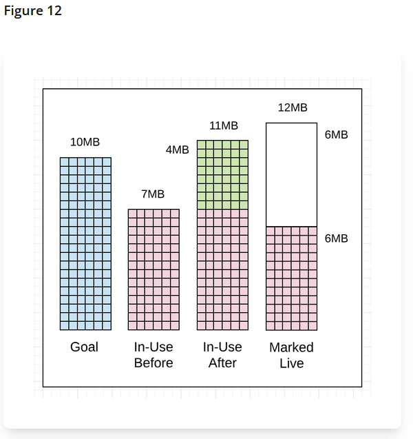

Разбор памяти:

| Поле    | Значение                      |
| ------- | ----------------------------- |
| 7` MB`  | Heap до начала Marking        |
| `11 MB` | Heap после завершения Marking |
| `6 MB`  | Heap, помеченный как живой    |
| `10 MB` | Целевой размер heap           |

Строка трассировки GC 1405 говорит о следующем. До начала сборки мусора приложение использовало 7 МБ динамической памяти. Пока выполнялся процесс маркировки, приложение продолжало работать и выделять новую память, поэтому к моменту завершения маркировки общий объём используемой памяти вырос до 11 МБ — то есть было дополнительно выделено 4 МБ.

После маркировки выяснилось, что реально используемые (живые) данные занимают 6 МБ. Остальная память считается мусором и будет освобождена.

Сборщик мусора рассчитывает, что приложение может увеличить использование памяти примерно вдвое относительно объёма живых данных. В данном случае это означает рост с 6 МБ до 12 МБ перед запуском следующей сборки мусора.

Ожидалось, что после завершения сборки мусора объём используемой памяти будет около 10 МБ, однако фактически он составил 11 МБ. Это не ошибка: сборщик мусора делает оценку заранее, но во время его работы приложение может выделять больше памяти, чем предполагалось.

Если вы посмотрите на следующую линию трассировки GC (1406), вы увидите, как все изменилось в течение 2 мс.

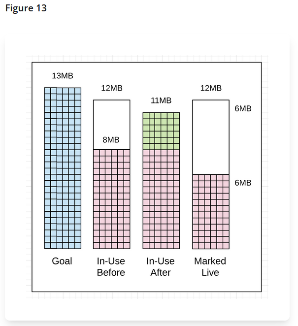

```

gc 1406 @6.070s 11%: 0.051+1.8+0.076 ms clock, 0.61+2.0/2.5/0+0.91 ms cpu, 8->11->6 MB, 13 MB goal, 12 P

```

Разбор памяти:

| Поле    | Значение                      |
| ------- | ----------------------------- |
| `8 MB`  | Heap до начала Marking        |
| `11 MB` | Heap после завершения Marking |
| `6 MB`  | Heap, помеченный как живой    |
| `13 MB` | Целевой размер heap           |

Эта сборка началась через 2 мс после начала предыдущей (6,068 с против 6,070 с), несмотря на то, что объем используемой памяти достиг всего 8 МБ из 12 МБ. Если сборщик решит, что лучше начать сборку раньше, он так и сделает. В данном случае сборка, вероятно, началась раньше, поскольку приложение активно выделяет память, и сборщик хотел сократить задержку Mark Assist во время этой сборки.

На этот раз сборщик не вышел за рамки поставленной задачи: объём используемой памяти после завершения маркировки составил 11 МБ, а не 13 МБ — на 2 МБ меньше. Объем памяти, помеченной как живой, остался прежним — 6 МБ.

### Расширенная трассировка: gcpacertrace=1

Вы можете получить более подробную информацию из трассировки GC, добавив флаг **gcpacertrace=1**. Это заставит сборщик вывести информацию о внутреннем состоянии параллельного пейсера.

```

$ export GODEBUG=gctrace=1,gcpacertrace=1 ./app

```

Пример вывода:

```

gc 5 @0.071s 0%: 0.018+0.46+0.071 ms clock, 0.14+0/0.38/0.14+0.56 ms cpu, 29->29->29 MB, 30 MB goal, 8 P
pacer: sweep done at heap size 29MB; allocated 0MB of spans; swept 3752 pages at +6.183550e-004 pages/byte
pacer: assist ratio=+1.232155e+000 (scan 1 MB in 70->71 MB) workers=2+0
pacer: H_m_prev=30488736 h_t=+2.334071e-001 H_T=37605024 h_a=+1.409842e+000 H_a=73473040 h_g=+1.000000e+000 H_g=60977472 u_a=+2.500000e-001 u_g=+2.500000e-001 W_a=308200 goalΔ=+7.665929e-001 actualΔ=+1.176435e+000 u_a/u_g=+1.000000e+000

```

Запуск трассировки GC может многое рассказать о работоспособности приложения и темпе работы сборщика. Темп работы сборщика играет важную роль в процессе сбора данных.

> **Зачем это Go-разработчику.** Включение `gctrace=1` — первый шаг при диагностике проблем с производительностью GC в production. По трассировке можно оценить: долю CPU на GC, частоту сборок, участие горутин в Mark Assist и соотношение живой/мёртвой памяти. Это отправная точка для принятия решения о настройке GOGC или оптимизации аллокаций.

***

## 7. Затраты на задержку сбора данных

Каждая сборка мусора вызывает два типа задержек в работающем приложении.

### Кража ресурсов процессора

Первый тип задержки — **кража ресурсов процессора**. Из-за этого приложение не работает на полную мощность во время сборки мусора. Горутины приложения делят P с горутинами сборщика мусора или помогают в сборе мусора (Mark Assist).

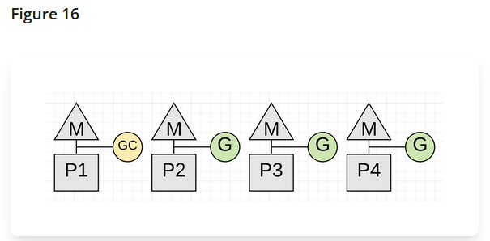

На рисунке 16 показано, что приложение использует только 75% ресурсов процессора для выполнения своих задач. Это связано с тем, что сборщик выделил для себя P1. Он будет использоваться для большей части сбора.

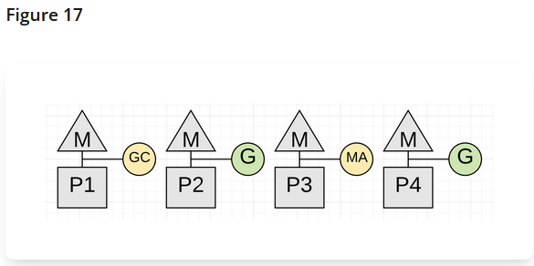

На рисунке 17 показано, как приложение в этот момент времени (обычно всего несколько микросекунд) использует только половину ресурсов процессора для выполнения своих задач. Это связано с тем, что горутина на P3 выполняет функцию Mark Assist, а сборщик мусора выделил P1 для себя.

Примечание: Маркировка обычно занимает 4 миллисекунды ЦП на каждый мегабайт активной кучи (чтобы оценить, сколько миллисекунд займет фаза маркировки, возьмите размер активной кучи в мегабайтах и разделите его на 0,25 × количество процессоров). Фактически маркировка выполняется со скоростью около 1 МБ/мс, но использует лишь четверть процессоров.

### Задержка STW

Вторая задержка — **задержка STW**, возникающая во время сбора данных. **Время STW** — это время, когда ни одна из горутин приложения не выполняет свою работу. Приложение фактически остановлено.

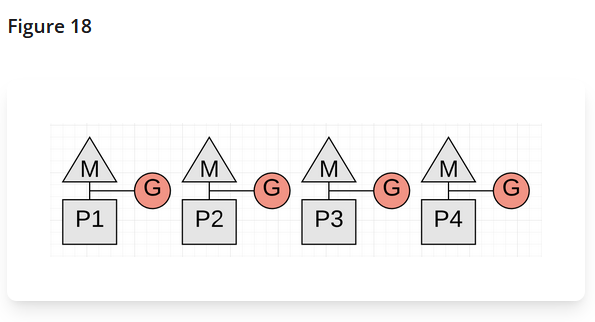

На рисунке 18 показана задержка STW, при которой все горутины останавливаются. Это происходит дважды при каждой сборке мусора. Если ваше приложение работает исправно, сборщик мусора должен поддерживать общее время STW на уровне 100 микросекунд или ниже для большинства сборок мусора.

> **Зачем это Go-разработчику.** При анализе производительности различайте два типа задержек. STW видна как пропуски в обработке запросов (latency spikes). Кража CPU видна как снижение пропускной способности (throughput) — приложение просто делает меньше работы за единицу времени.

***

## 8. Как помогать сборщику мусора

**«Сочувствие» сборщику мусора** означает писать код так, чтобы уменьшить нагрузку на динамическую память (heap). Под **нагрузкой** понимается скорость, с которой приложение создает новые объекты.

Чем меньше аллокаций выполняет программа, тем ниже нагрузка на память. Это напрямую снижает задержки, связанные со сборкой мусора — а именно эти задержки и замедляют выполнение приложения.

### Что даёт снижение нагрузки

Снижение аллокаций помогает сборщику мусора:

* поддерживать как можно меньший размер кучи;
* работать в стабильном и предсказуемом режиме;
* точнее достигать целевых параметров для каждого цикла сборки;
* сокращать длительность сборки, включая паузы STW и Mark Assist.

В результате уменьшаются задержки, которые сборщик мусора вносит в работу приложения. Это повышает общую производительность и пропускную способность.

### Ключевой принцип

Дело не в том, чтобы «ускорить» или «замедлить» сборщик мусора. Ключевая идея — **снизить объем работы, которую ему приходится выполнять**.

На практике это означает:

* **Уменьшение количества выделений:** переиспользование объектов (`sync.Pool`), избегание аллокаций в горячих циклах, использование value-типов вместо указателей где возможно.
* **Уменьшение объёма выделений:** сокращение размера структур, компактное представление данных, избегание избыточных полей.

> **Зачем это Go-разработчику.** Профилирование аллокаций (через `go test -benchmem` или pprof) и последующее их устранение — наиболее эффективный способ повышения производительности Go-приложения, зачастую более результативный, чем микрооптимизация CPU. В облачных средах это также напрямую снижает счёт за инфраструктуру.

***

## 9. Параметры и триггеры GC

### Основные переменные окружения

#### GOGC

Назначение: определяет целевой процент роста heap-памяти перед запуском GC.

Формула:

$\text{Новый порог GC} = \text{Текущий размер heap после GC} \times (1 + \frac{\text{GOGC}}{100})$

Значения:

* По умолчанию: 100 (запуск GC при удвоении heap).
* `GOGC=50`: GC запустится при росте heap на 50%.
* `GOGC=200`: GC запустится при росте heap в 3 раза.
* `GOGC=-1`: GC не запускается автоматически, но запускается вручную.
* `GOGC=off`: полное отключение GC.

Пример:

```bash
GOGC=50 go run main.go  # Более частый GC (меньше память, выше CPU-нагрузка)

GOGC=200 go run main.go  # Более редкий GC (больше память, ниже CPU-нагрузка)
``

#### GODEBUG

Включает трассировку и отладку GC:

* `gctrace=1`: вывод деталей каждой сборки.

```

GODEBUG=gctrace=1 go run main.go
``

Пример вывода:

```gc 8 @0.048s 0%: 0.010+0.22+0.015 ms clock, 0.12+0.32/0.42/0.22+0.18 ms cpu, 4->4->0 MB, 5 MB goal, 12 P.```

* `4->4->0 MB`: Heap до GC -> до выгрузки мусора -> после GC.

* `5 MB goal`: целевой размер heap после GC.
* `gcpacertrace=1`: трассировка pacing-алгоритма (для глубокой отладки).

### Параметры через runtime/debug

#### SetGCPercent

Назначение: аналог GOGC, но настраивается в runtime.

Пример:

```go
import "runtime/debug"

func main() {
    debug.SetGCPercent(50) // Установить целевой пост heap = 50%
}

```

#### SetMemoryLimit

Появился в Go 1.19.

Назначение: лимит общей памяти (включая heap, стек и другие структуры).

Поведение:

* При приближении к лимиту GC работает агрессивнее.
* По умолчанию: `math.MaxInt64` (отключено).

Пример:

``` go
import "runtime/debug"

func main() {
    debug.SetMemoryLimit(100 * 1024 * 1024) // 100 MB
}

```

### Внутренние параметры GC (GODEBUG)

Переменная окружения GODEBUG предоставляет доступ к низкоуровневым рычагам управления GC, которые обычно скрыты от разработчика. В отличие от GOGC, эти параметры предназначены не для повседневной настройки, а для отладки, экспериментов и воспроизведения поведения ранних версий Go.

#### gcstoptheworld

* `GODEBUG=gcstoptheworld=1`: полная остановка мира (STW) на время маркировки и очистки.
* `GODEBUG=gcstoptheworld=2`: STW только на время маркировки.

```shellscript

# Запуск теста производительности с принудительным STW на маркировке

GODEBUG=gcstoptheworld=2 go test-bench=. -benchtime=5s ./mypackage

```

#### gccpufraction

* Назначение: ограничивает долю CPU, используемую GC.
* По умолчанию: `GODEBUG=gccpufraction=25` (не более 25% CPU).

```shellscript

# Запуск сервера с принудительным ограничением GC 25% процессорного времени

GODEBUG=gccpufraction=25 go run main.go

# Запуск с агрессивным GC, которому разрешено забирать до половины CPU

GODEBUG=gccpufraction=50 go run main.go

```

### Триггеры GC

#### Основной триггер: рост кучи

Порог на основе GOGC:

$\text{Новый порог} = \text{Текущий размер кучи после GC} \times (1 + \frac{\text{GOGC}}{100})$

Пример:

* После GC куча = 10 MB, GOGC = 100
* Порог = 10 MB × (1 + 100/100) = 20 MB
* GC запустится, когда куча достигнет \~20 MB

```go
func main() {
    var data [][]byte
    for i := 0; i < 100; i++ {
        // Выделяем память
        data = append(data, make([]byte, 1010241024)) // 10 MB
        // GC автоматически запустится при достижении порога
        // (определяется GOGC и текущим размером heap)
    }
}

```

#### Периодический запуск (с Go 1.19+)

Если GC не запускался по росту кучи в течение 2 минут, системный монитор запускает его принудительно. Этр освобождает память от объектов, которые «зависли» в долго работающих программах. Изменить интервал 2 минуты стандартными средствами нельзя (это константа внутри рантайма).

#### Явный вызов (ручной триггер)

Через функцию runtime.GC(). Блокирует выполнение до завершения цикла GC.

```go
package main

import "runtime"

func main() {
    // Делаем что-то ресурсоёмкое
    doHeavyWork()

    // Явно запускаем GC
    runtime.GC()

    // Продолжаем работу с уменьшенным потреблением памяти
}

```

**Важно:** в продакшен-коде применять **не рекомендуется** — GC хорошо настроен и сам знает, когда запускаться.

### Дополнения к триггерм GC

#### Ассисты GC (помощь горутин)

Если GC уже запущен, а горутина продолжает выделять память и GC не успевает её освобождать, **горутина сама начинает маркировать объекты** (помогать сборщику). Это предотвращает OOM (Out Of Memory) и удерживает кучу в пределах целевого размера.

Ассисты включаются автоматически, настраивать их напрямую нельзя. Увидеть их влияние можно только через `GODEBUG=gctrace=1` (поле `assist` в логах).

#### Механика больших объектов (не триггер, а уточнение)

Крупные объекты (≥ 32 КБ) сами по себе не запускают GC. Но если при их выделении не хватает места, аллокатор разбудит GC раньше порога GOGC, чтобы тот освободил память.

```go
package main
func main() {
    // Объект > 32 KB — выделяется напрямую из кучи, минуя локальные кэши

    large := make([]byte, 64*1024)
    // Если свободной памяти нет, аллокатор запустит GC
    // и затем попробует выделить память снова
    _ = large
}

```

#### Пейсер (планировщик GC)

Внутренний алгоритм, который **решает точный момент запуска GC**, чтобы уложиться в целевой размер кучи. Пейсер учитывает:

* скорость выделения памяти приложением,
* скорость работы самого GC,
* время, прошедшее с начала текущего цикла.

Это не отдельный триггер, а «интеллектуальная» надстройка над порогом GOGC. Именно пейсер решает, когда нажать на спусковой крючок, чтобы не опоздать.

GODEBUG=madvdontneed (косвенное влияние)

Это **не триггер**, но переменная среды часто упоминается при настройке памяти. Она не меняет порог срабатывания GC, а влияет на то, **как именно Go возвращает неиспользуемую физическую память операционной системе**.

* **Суть:** Когда GC освобождает страницы памяти, рантайм вызывает системный вызов `madvise()`, чтобы сообщить ядру, что эти страницы больше не нужны.
* **Режим по умолчанию (****`MADV_FREE`****&#x20;в старых версиях / Linux):** Память помечается как доступная для освобождения, но ядро может держать её за процессом до востребования. RSS (Resident Set Size) процесса остается высоким, зато переиспользовать эту память внутри процесса быстрее.
* **Режим&#x20;****`GODEBUG=madvdontneed=1`****&#x20;(****`MADV_DONTNEED`****):** Ядро сразу забирает физические страницы у процесса. RSS процесса быстро падает. Это полезно для контейнеризированных сред, чтобы честно показывать реальное потребление памяти, но может замедлять приложение, так как при новом выделении памяти придется запрашивать страницы у ОС заново.

```shellscript
GODEBUG=madvdontneed=1 go run main.go

```

***

## 10. Scavenger: устройство и работа

### Назначение: GC освобождает объекты, scavenger возвращает память ОС

В Go управление памятью разделено на две связанные, но разные задачи. Сборщик мусора (GC) находит и освобождает неиспользуемые объекты, а **scavenger** отвечает за возврат уже освобождённой памяти обратно операционной системе. Это различие принципиально важно: после работы GC объекты удаляются, но сама память остаётся закреплённой за процессом. Поэтому с точки зрения операционной системы приложение может продолжать занимать тот же объём памяти. Scavenger как раз и решает эту проблему, уменьшая **фактическое потребление памяти (RSS)**.

### Почему RSS важен: виртуальная память ≠ физическая

Процесс в Linux имеет два показателя потребления памяти:

* **VSZ (Virtual Size)** — общий объём зарезервированного виртуального адресного пространства. Даже после освобождения страниц внутри процесса, виртуальные адреса остаются за ним.
* **RSS (Resident Set Size)** — объём физической памяти, реально занятой процессом в ОЗУ.

GC умеет «освобождать» память внутри процесса (делать её доступной для повторного использования через mheap/mcentral), но без scavenger'а RSS не уменьшается. Для контейнеризированных сред (Kubernetes, Docker) важен именно RSS — по нему принимаются решения о вытеснении (eviction) и рассчитывается стоимость.

> **Зачем это Go-разработчику.** Если ваше приложение в контейнере занимает 500 МБ RSS при живых данных в 50 МБ — это не утечка, это scavenger не успевает или не может вернуть память ОС. Диагностика: смотрите `runtime.MemStats.HeapIdle` (свободно внутри процесса) против `HeapReleased` (реально возвращено ОС).

### Структура кучи с точки зрения scavenger

Scavenger оперирует не объектами, а страницами и спанами.

#### Страницы и арены

* **Страница** — минимальная единица учёта и возврата, обычно **8 КБ**.
* **Арена (arena)** — крупная область виртуальной памяти (64 МБ на большинстве платформ), внутри которой выделяются спаны. Арены нужны для эффективного управления большими регионами памяти и упрощения учёта.
* **Спан (span)** — группа из одной или нескольких последовательных страниц, выделенных под объекты одного размерного класса (см. раздел 2).

#### Метаданные — как scavenger узнаёт, что можно вернуть

Каждый спан содержит битовые карты в своём заголовке:

| Карта        | Назначение                                                      |
| ------------ | --------------------------------------------------------------- |
| `allocBits`  | Какие слоты в спане заняты объектами (1 = занят, 0 = свободен)  |
| `gcmarkBits` | Какие слоты помечены как живые во время последней маркировки GC |

После завершения sweep-фазы рантайм сравнивает эти карты. Если `allocBits` показывает, что все слоты свободны (или после sweep таковыми стали), спан помечается как **полностью свободный** и становится кандидатом на возврат ОС.

Scavenger **не анализирует объекты напрямую** — он проверяет состояние спанов через метаданные. Это быстрее и не требует обхода всей кучи объект за объектом.

Три основных состояния спана с точки зрения scavenger:

* **Used (занят)** — содержит хотя бы один живой объект, возврату не подлежит.
* **Free (свободен)** — все объекты освобождены, находится в пуле mheap для повторного использования, но ОС ещё не возвращён.
* **Scavenged (возвращён)** — физические страницы возвращены ОС, спан доступен только для виртуального резервирования.

### Жизненный цикл scavenger

#### Фоновый поток

Scavenger реализован как отдельная фоновая горутина внутри рантайма (`bgscavenge`). Она запускается один раз при инициализации рантайма и работает на протяжении всей жизни процесса. Поток имеет **низкий приоритет**: он уступает CPU пользовательским горутинам и горутинам GC.

#### Условия пробуждения

Scavenger просыпается в нескольких ситуациях:

* **После завершения цикла GC** — в этот момент появляется наибольшее количество полностью свободных спанов (sweep только что закончился).
* **По таймеру** — периодически, даже если GC не запускался, чтобы постепенно возвращать накопленную свободную память.
* **При давлении памяти** — если приложение близко к лимиту (`SetMemoryLimit`) или ОС сигнализирует о нехватке памяти.

#### Как scavenger находит страницы-кандидаты

Алгоритм поиска:

1. Обходит спаны в порядке адресов (физически последовательно).
2. Для каждого спана проверяет битовые карты: все ли слоты свободны.
3. Группирует последовательные свободные спаны для возврата одним системным вызовом (эффективнее, чем вызывать `madvise` на каждый спан).
4. Пропускает спаны, которые недавно использовались (эвристика «остывания» — чтобы не вернуть память, которая вот-вот понадобится).

### Механизм возврата памяти: madvise

Когда scavenger находит подходящие страницы, он использует системный вызов `madvise`, чтобы сообщить операционной системе, что эта память больше не нужна.

#### Два режима возврата

| Режим       | Системный вызов         | Поведение                                                                                                                                                                        |
| ----------- | ----------------------- | -------------------------------------------------------------------------------------------------------------------------------------------------------------------------------- |
| Ленивый     | `MADV_FREE` (Linux)     | ОС *может* забрать физическую память когда захочет. RSS уменьшается только при реальном давлении памяти в системе. Переиспользование страницы процессом — мгновенно и бесплатно. |
| Агрессивный | `MADV_DONTNEED` (Linux) | Физическая память освобождается немедленно. RSS падает сразу. Но при следующей аллокации память придётся запрашивать у ОС заново.                                                |

Go использует `MADV_FREE` по умолчанию на Linux, так как это даёт лучший баланс: память доступна системе при необходимости, но процесс может быстро переиспользовать страницы без дорогих системных вызовов.

#### Платформенные различия

* **Linux**: `MADV_FREE` (основной) / `MADV_DONTNEED` (форсированный).
* **macOS / BSD**: аналог `MADV_FREE`.
* **Windows**: `VirtualFree` с флагом `MEM_DECOMMIT` (аналог `MADV_DONTNEED` — немедленное освобождение).

При этом **виртуальное адресное пространство сохраняется за процессом** — страницы не удаляются из таблицы страниц, а только лишаются физической подложки. Это значит, что при повторном обращении к этим адресам ОС прозрачно выделит новую физическую страницу (page fault).

### Взаимодействие с GC

Scavenger тесно связан с GC, но работает асинхронно:

* **После sweep-фазы**: когда GC завершил маркировку и очистку, часть спанов переходит в состояние Free. Scavenger в этот момент получает наибольший объём кандидатов.
* **Эвристики активации**: рантайм учитывает текущий размер кучи, объём недавно освобождённой памяти, целевые показатели (`GOGC`, `SetMemoryLimit`) и расстояние до следующего порога GC. Если куча далека от порога — scavenger может работать менее агрессивно.
* **Обратная связь**: если scavenger вернул слишком много памяти и приложению пришлось запрашивать новую у ОС (дорого), рантайм корректирует агрессивность scavenger'а в меньшую сторону.

### Фрагментация и её влияние

Фрагментация — главный враг scavenger'а. Рассмотрим конкретный пример:

Предположим, у нас есть спан на 8 КБ (одна страница), разбитый на слоты по 64 байта (128 слотов). Если 127 слотов свободны, а 1 занят живым объектом — **вся страница не может быть возвращена ОС**, потому что scavenger оперирует страницами целиком. При этом внутри процесса свободно 8 128 байт, но scavenger бессилен.

Если такие «почти пустые» спаны распределены по всей куче, то RSS остаётся высоким, несмотря на то, что внутренне процесс использует лишь малую долю памяти.

**Связь с паттернами аллокаций**: приложение, которое выделяет много мелких объектов разного размера и разных времён жизни, создаёт идеальные условия для фрагментации. Крупные объекты (>32 КБ) имеют собственные спаны и при освобождении возвращаются полностью — с ними scavenger работает эффективнее.

### Баланс память/производительность

Scavenger вынужден искать компромисс:

* **Слишком агрессивный возврат** → при следующих аллокациях придётся делать системные вызовы для получения новой памяти у ОС (дорого, особенно под глобальной блокировкой mheap).
* **Слишком ленивый возврат** → RSS раздувается, контейнер могут вытеснить (OOM kill), хотя реально живых данных мало.

Рантайм решает это через **pacing внутри scavenger'а** — возврат выполняется постепенно, небольшими порциями за раз. Внутренний механизм отслеживает:

* Сколько памяти уже возвращено относительно доступной свободной.
* Как быстро приложение выделяет новую память.
* Насколько близок `SetMemoryLimit`.

#### Настройка агрессивности

Прямой ручки «сделать scavenger агрессивнее» нет, но косвенно влияют:

* **`GOGC`**: чем ниже, тем меньше куча в целом, меньше свободных страниц для возврата — scavenger'у меньше работы.
* **`SetMemoryLimit`**: при приближении к лимиту GC работает чаще, а scavenger — агрессивнее.
* **Внутренние константы рантайма**: меняются только при сборке из исходников.

### Диагностика работы scavenger

Основной источник информации — `runtime.MemStats`:

| Поле                      | Что означает                                                                                     |
| ------------------------- | ------------------------------------------------------------------------------------------------ |
| `HeapIdle`                | Объём памяти в спанах, свободных для использования (но не обязательно возвращённых ОС), в байтах |
| `HeapReleased`            | Объём памяти, реально возвращённой операционной системе, в байтах                                |
| `HeapIdle - HeapReleased` | «Застрявшая» память: свободна внутри процесса, но не возвращена ОС — кандидат на scavenge        |

Пример кода для мониторинга:

```go
var m runtime.MemStats
runtime.ReadMemStats(&m)
fmt.Printf("HeapIdle: %d MB, HeapReleased: %d MB, Gap: %d MB\n",
    m.HeapIdle/1024/1024, m.HeapReleased/1024/1024,
    (m.HeapIdle-m.HeapReleased)/1024/1024)

```

Большой разрыв (`HeapIdle - HeapReleased`) при стабильной рабочей нагрузке означает, что scavenger не справляется или упирается во фрагментацию.

Также трассировка `GODEBUG=gctrace=1` показывает работу scavenger косвенно: после нескольких сборок GC, если `HeapIdle` растёт, а `HeapReleased` нет — scavenger либо ещё не активизировался, либо не может найти непрерывные свободные страницы.

> **Зачем это Go-разработчику.** В контейнерных средах контролируйте разрыв между `HeapIdle` и `HeapReleased`. Если при живых данных в 100 МБ разрыв стабильно >200 МБ — это не утечка, а фрагментация. Решения: (1) снизить темп аллокаций, (2) укрупнить объекты (меньше мелких), (3) настроить `SetMemoryLimit` для более агрессивного GC/scavenger.

***

## 11. Экспериментальный сборщик Green Tea

В Go 1.25 включен новый экспериментальный сборщик мусора под названием **Green Tea**, доступный при установке параметра **GOEXPERIMENT=greenteagc** во время сборки. Многие рабочие нагрузки тратят на сборку мусора примерно на 10% меньше времени, а некоторые — до 40%.

### Объекты и указатели

Цель сборки мусора — автоматически освобождать и повторно использовать память, которая больше не используется программой. Для этого сборщик мусора Go занимается **объектами и указателями**.

В контексте среды выполнения Go **объекты** — это значения Go, память под которыми выделяется из кучи. Объекты в куче создаются, когда компилятор Go не может определить, как еще выделить память для значения. Например, следующий фрагмент кода выделяет один объект в куче: хранилище для среза указателей.

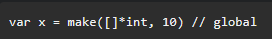

Компилятор Go не может выделить память для среза данных где-либо, кроме кучи, поскольку ему очень сложно, а может быть, даже невозможно, определить, как долго x будет ссылаться на объект.

**Указатели** — это просто числа, указывающие местоположение значения Go в памяти, и именно с их помощью программа Go ссылается на объекты. Например, чтобы получить указатель на начало объекта, выделенного в последнем фрагменте кода, мы можем написать:


### Алгоритм трассирующей сборки (graph flood)

Сборщик мусора Go использует стратегию, широко известную как **трассирующая сборка мусора**, что означает, что сборщик мусора следует, или отслеживает, указатели в программе, чтобы определить, какие объекты программа все еще использует.

Более конкретно, сборщик мусора Go реализует алгоритм пометки и очистки — Mark & Sweep. Представьте объекты и указатели как граф: объекты — это узлы, указатели — это ребра.

По сути, если опустить детали, это **алгоритм обхода графа (graph flood algorithm)**.

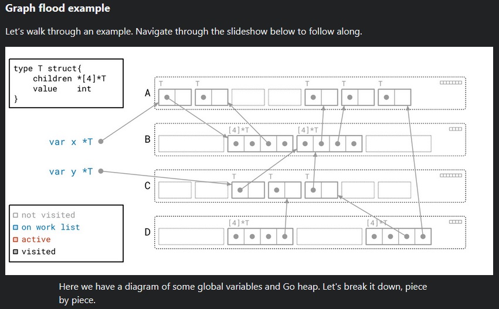

### Цена сборки мусора

Выполнение этого алгоритма в некоторых программах может занимать много времени, что существенно увеличивает накладные расходы практически любой программы на Go. Нередко можно увидеть, как программы на Go тратят 20% и более своего процессорного времени на сборщик мусора.

В общих чертах, стоимость работы сборщика мусора состоит из двух частей. Первая — это частота его запуска, а вторая — объем работы, выполняемой им за каждый запуск. Перемножив эти две части, вы получите **общую стоимость работы сборщика мусора**.


### Что именно занимает время в цикле GC

За годы изучения профилей ЦП мы узнали две важные вещи о сборщике мусора Go.

**Во-первых**, около 90% стоимости сборщика мусора тратится на маркировку, и только около 10% — на очистку. Очистку гораздо проще оптимизировать, чем маркировку, и в Go уже много лет существует очень эффективный очиститель.

**Во-вторых**, из этого времени, затраченного на маркировку, значительная часть, обычно не менее 35%, просто тратится на доступ к памяти кучи. Это не только медленно само по себе, но и полностью блокирует работу того, что делает современные процессоры по-настоящему быстрыми.

### Микроархитектурная катастрофа graph flood

Алгоритм graph flood для процессора — это постоянные прыжки по случайным адресам памяти. Каждая стрелка слева направо представляет собой фрагмент работы сканирования, а пунктирные стрелки показывают, как мы перескакивали между фрагментами.

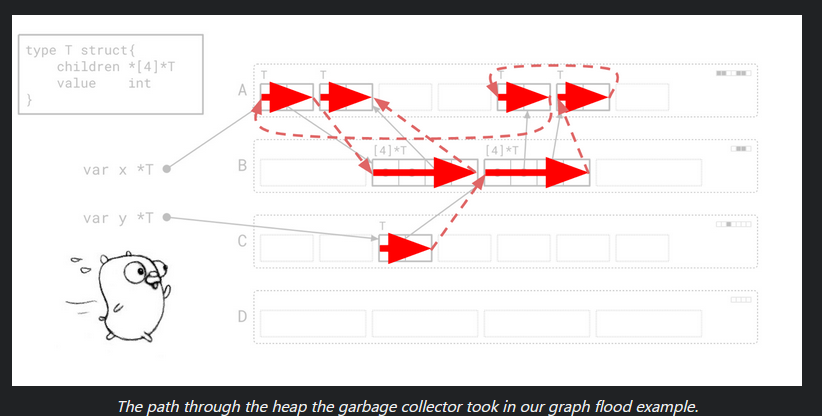

Мы постоянно перемещаемся по памяти, выполняя крошечные фрагменты работы в каждом месте — часто переключаемся между страницами и между различными частями страниц.

Современные процессоры активно используют кэширование. Обращение к основной памяти может быть до 100 раз медленнее, чем доступ к кэшу. Кэши заполняются памятью, к которой недавно обращались, и соседней памятью. Но нет гарантии, что два объекта, указывающие друг на друга, находятся близко друг к другу в памяти. Graph flood этого не учитывает.

Более того: процессоры отправляют запросы к памяти асинхронно, поэтому даже медленные запросы могут перекрываться, если процессор видит достаточно далеко вперёд. Но в graph flood каждый фрагмент работы мал, непредсказуем и сильно зависит от предыдущего — процессор вынужден ждать почти каждой отдельной выборки из памяти.

Тенденции в современном аппаратном обеспечении усугубляют проблему:

* **NUMA (Non-Uniform Memory Access)** — память привязана к подмножествам ядер ЦП. Доступ к «чужой» памяти медленнее.
* **Снижение пропускной способности памяти на ядро** — хотя ядер становится больше, каждое ядро может отправлять относительно меньше запросов к основной памяти.
* **Рост числа ядер** — общая очередь объектов для параллельного сканирования становится узким местом.
* **Векторные инструкции** (AVX-512 и другие) потенциально могут ускорить обработку, но graph flood слишком нерегулярен для их применения.

### Идея Green Tea: работа со спанами вместо объектов

Основная идея Green Tea: **работайте со спанами, а не с объектами.**

Конкретно это означает:

* Вместо сканирования объектов мы сканируем целые спаны.
* Вместо отслеживания объектов в списке задач мы отслеживаем целые спаны.
* Нам всё ещё нужно отмечать объекты, но мы отслеживаем их локально для каждого спана, а не по всей куче.

### Детальный разбор алгоритма Green Tea

#### Метаданные: seen и scanned биты

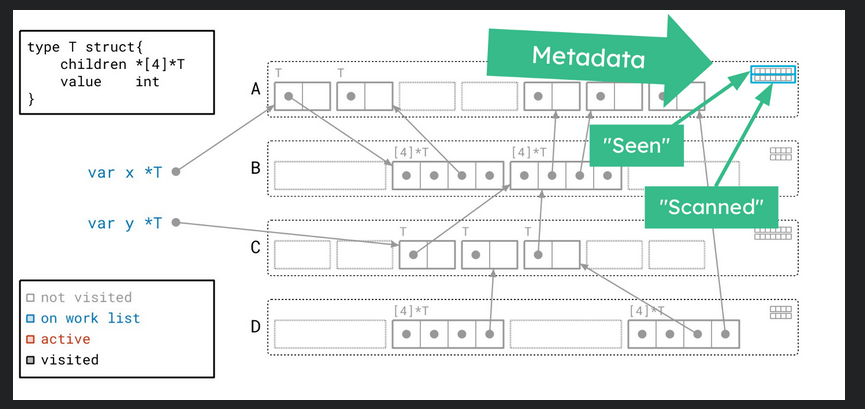

Метаданные используют два бита на объект вместо одного:

* **Seen биты** — видели ли мы указатель на объект (аналог бита mark в классическом алгоритме).
* **Scanned биты** — просканировали ли мы объект (прошли ли по его указателям).

Эти биты нужны потому, что список задач в Green Tea отслеживает спаны, а не объекты. Разница между seen и scanned показывает, какие объекты на спанах ещё нужно обработать.

#### Пошаговый обход

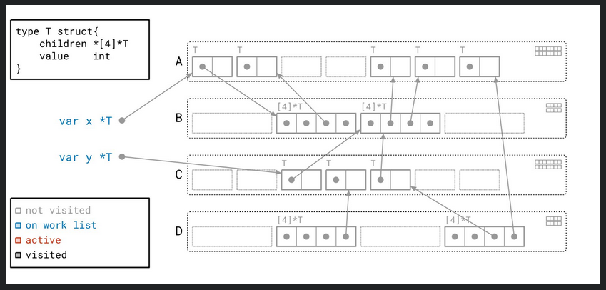

Мы начинаем так же, как и раньше, перемещая объекты от корней.

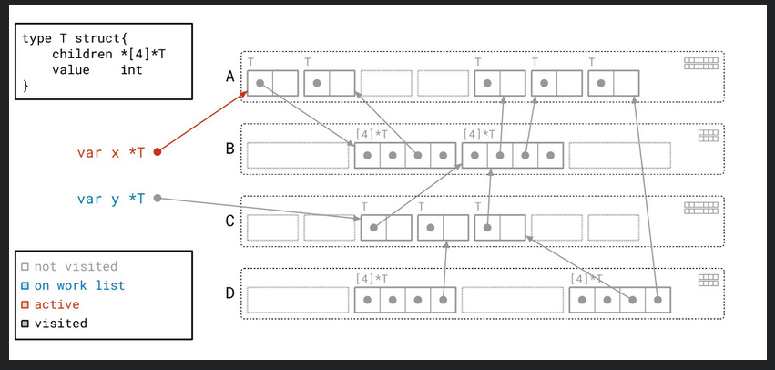

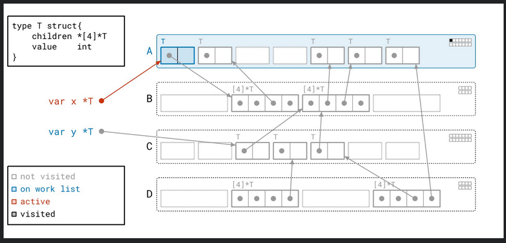

Но на этот раз, вместо того чтобы добавлять объект в список задач, мы добавляем в список целый спан — спан А.

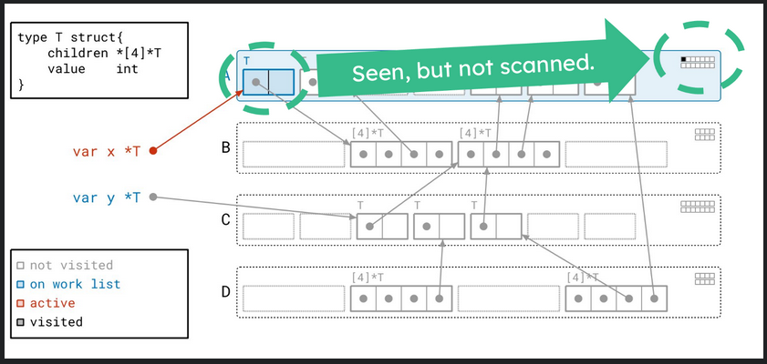

Найденный объект имеет синий цвет: при обработке спана его нужно будет просканировать. Соответствующий бит seen установлен, но бит scanned — нет.

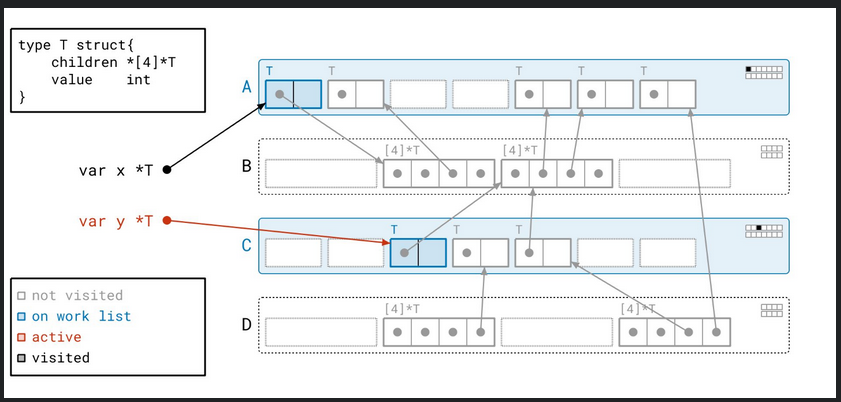

Переходим к следующему корню, находим другой объект и снова помещаем весь спан C в список задач, установив бит seen.

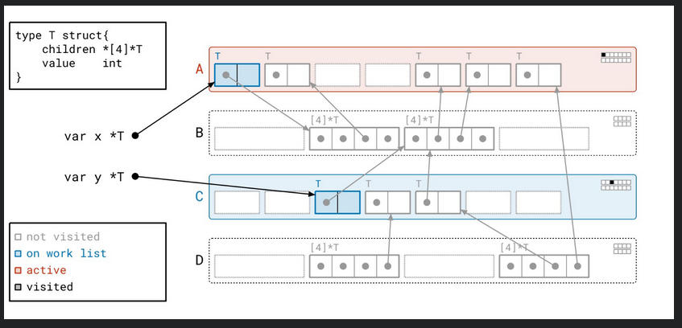

Закончили с корнями — переходим к списку задач. Снимаем спан А.

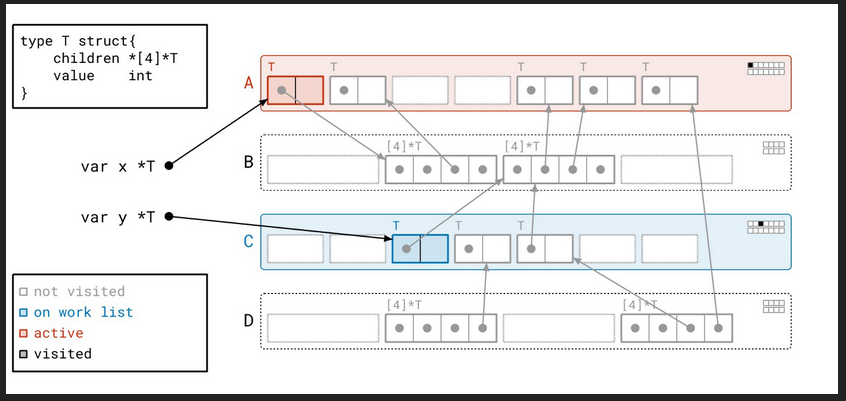

Используя seen и scanned биты, видим: один объект для сканирования на спане A.

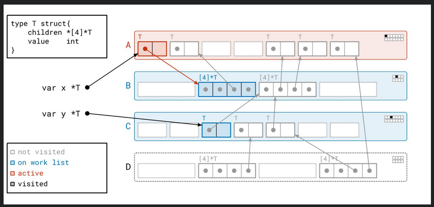

Сканируем этот объект, следуя его указателям. Добавляем спан B в список задач — объект на спане A указывает на спане B.

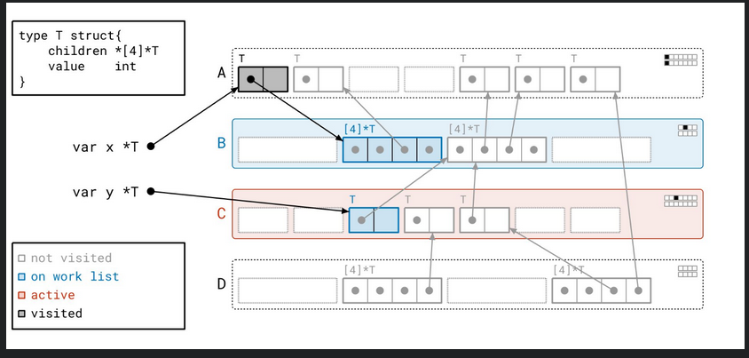

Закончили со спаном А. Снимаем со списка спан С.

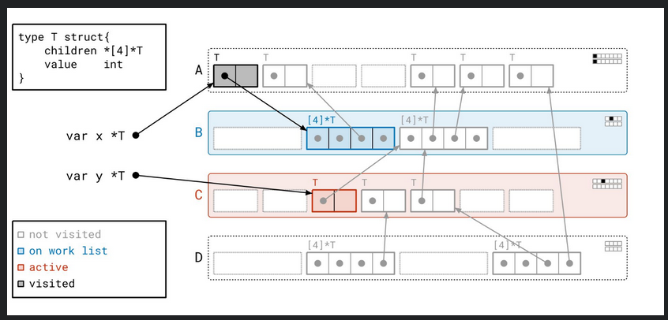

Аналогично спану А, на спане С нужно отсканировать один объект.

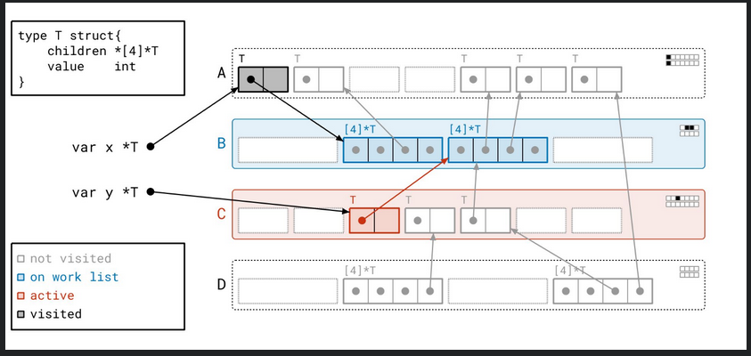

Обнаружили указатель на объект на спане B. Спан B уже в списке задач — просто устанавливаем бит seen для целевого объекта.

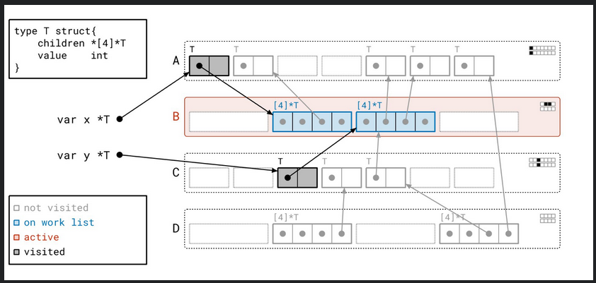

Теперь очередь спана B. На нем накопилось два объекта для сканирования — обрабатываем оба подряд, в порядке расположения в памяти!

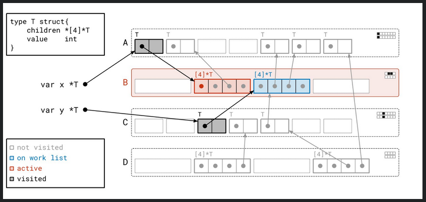

Проходим по указателям первого объекта...

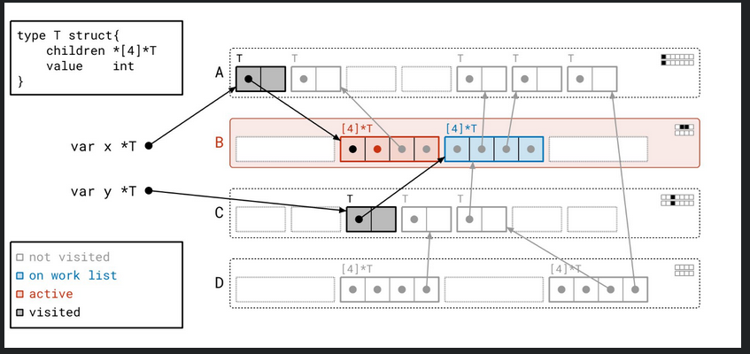

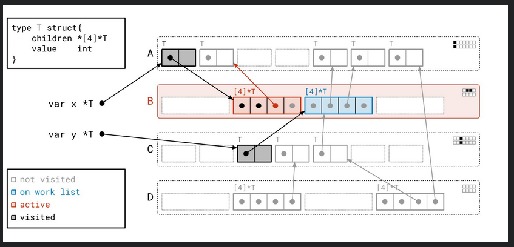

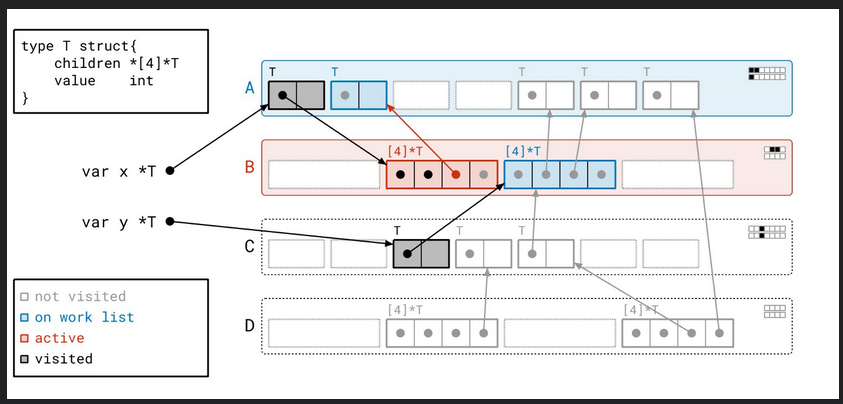

Находим указатель на объект на спане A. Спан A ранее была в списке задач, но сейчас его там нет — возвращаем её в список. В отличие от классического Mark & Sweep, где объект добавляется в список задач не более одного раза, в Green Tea спан может появляться в списке несколько раз.


Сканируем второй объект на спане B.


На спане А находим еще несколько объектов...


Закончили сканирование спана B. Снимаем спан A со списка задач.


На этот раз нужно отсканировать только три объекта, а не четыре — первый объект уже отсканирован. Разница между seen и scanned битами показывает, какие объекты нужно обработать.


Сканируем эти объекты последовательно.


Готово! В списке задач больше нет спаноа. Метаданные синхронизированы: все доступные объекты просмотрены и отсканированы.

### Ключевые отличия от graph flood

* **Порядок обработки**: FIFO (очередь) вместо LIFO (стек). Это позволяет объектам накапливаться на спане, пока она ждёт в очереди — мы обрабатываем больше объектов за один проход.
* **Повторное появление**: спан может попасть в список задач несколько раз за цикл маркировки.
* **Локальность**: сканирование происходит последовательно в пределах спана — кэш процессора используется эффективнее.
*

### Сравнение


Оригинальный graph flood кучи требовал 7 раздельных операций сканирования с постоянными перескоками.


Green Tea требует всего 4 сканирования — меньше, но более длинных проходов слева направо по страницам. Чем длиннее эти стрелки, тем лучше. При больших кучах эффект усиливается.

Всё это обеспечивает лучшую совместимость с микроархитектурой: сканирование объектов ближе друг к другу → эффективное использование кэша → меньше обращений к оперативной памяти. Метаданные страницы с большей вероятностью в кэше. Отслеживание страниц вместо объектов → меньший размер списков задач → меньше конкуренции за них → меньше задержек процессора.

### Векторное ускорение

Помимо обычных арифметических операций, современное векторное оборудование поддерживает две возможности, ценные для Green Tea: **очень широкие регистры и сложные побитовые операции**.

Большинство современных процессоров x86 поддерживают **AVX-512** с 512-битными векторными регистрами. Этого достаточно, чтобы вместить все метаданные для целой страницы всего в двух регистрах, прямо на процессоре, что позволяет Green Tea обрабатывать всю страницу за несколько инструкций. Начиная с AMD Zen 4 и Intel Ice Lake, также поддерживается новая инструкция для работы с битовыми векторами, которая выполняет ключевой этап сканирования Green Tea всего за несколько тактов.

Для graph flood такой подход даже не рассматривался — иногда требовалось два бита метаданных, а иногда десятки тысяч. Не хватало предсказуемости и регулярности для векторного оборудования.

### Оценка эффективности

Даже без векторной обработки снижение затрат процессорного времени на GC составляет 10–40% в наборе тестов. Если приложение тратит 10% времени на GC, это даёт общее снижение затрат CPU на 1–4%. Снижение на 10% — примерно среднее улучшение.

Метод основан на гипотезе: можно накопить достаточно объектов для сканирования на одной странице за один проход, чтобы компенсировать затраты на процесс накопления. Это работает, если куча имеет регулярную структуру — объекты одинакового размера на схожей глубине в графе. Но есть рабочие нагрузки, требующие сканирования только одного объекта на странице за раз — это потенциально хуже graph flood.

Реализация Green Tea имеет особый случай для страниц с одним объектом для сканирования, что уменьшает регрессии, но не устраняет их полностью.

Однако для того, чтобы превзойти graph flood, требуется гораздо меньше накопления, чем можно было бы ожидать. Один из неожиданных результатов: сканирование всего 2% страницы за раз может дать улучшения по сравнению с методом обхода графа.

> **Зачем это Go-разработчику.** Green Tea — экспериментальная фича, но она отражает вектор развития Go: ставка на кэш-дружественные алгоритмы. Если ваши бенчмарки показывают высокую долю CPU в GC и вы используете Go 1.25+, попробуйте `GOEXPERIMENT=greenteagc` — особенно на рабочих нагрузках с регулярной структурой объектов.

***

## 12. Ссылки

* [Garbage Collection In Go: Part I — Semantics (Ardan Labs)](https://www.ardanlabs.com/blog/2018/12/garbage-collection-in-go-part1-semantics.html)
* [Garbage Collection In Go: Part II — GC Traces (Ardan Labs)](https://www.ardanlabs.com/blog/2019/05/garbage-collection-in-go-part2-gctraces.html)
* [Garbage Collection In Go: Part III — GC Pacing (Ardan Labs)](https://www.ardanlabs.com/blog/2019/05/garbage-collection-in-go-part2-gctraces.html)
* [A Guide to the Go Garbage Collector (go.dev)](https://go.dev/doc/gc-guide)
* [Сборщик мусора в Go: принципы работы (Habr)](https://habr.com/ru/articles/923398/)
* [The Green Tea Garbage Collector (Go Blog)](https://go.dev/blog/greenteagc)
* [Внутреннее устройство сборщика мусора Golang (Habr)](https://habr.com/ru/companies/ncloudtech/articles/676960/)
